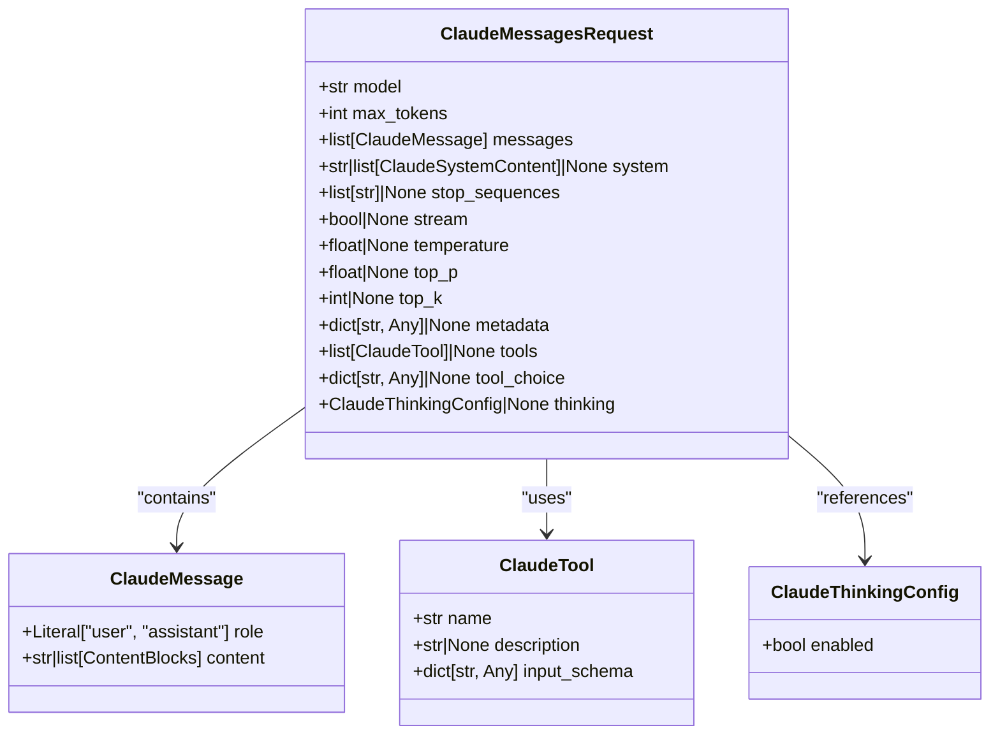
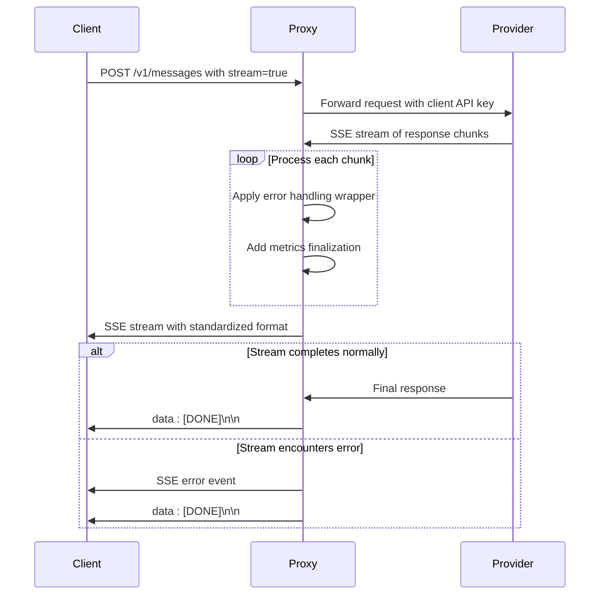
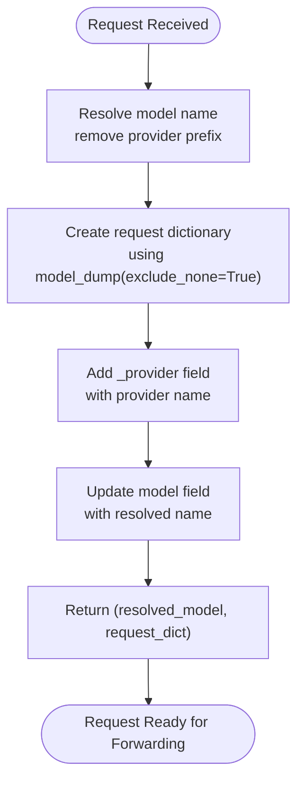

# Anthropic Passthrough Endpoints

<cite>
**Referenced Files in This Document**   
- [endpoints.py](file://src/api/endpoints.py#L391-L723)
- [v1.py](file://src/api/routers/v1.py#L13-L14)
- [request_builder.py](file://src/api/services/request_builder.py#L12-L35)
- [claude.py](file://src/models/claude.py#L57-L70)
- [api-key-passthrough.md](file://docs/api-key-passthrough.md#L1-L211)
</cite>

## Table of Contents
1. [Introduction](#introduction)
2. [Endpoint Configuration](#endpoint-configuration)
3. [Request Structure](#request-structure)
4. [Passthrough Functionality](#passthrough-functionality)
5. [Streaming Implementation](#streaming-implementation)
6. [API Key Passthrough Mechanism](#api-key-passthrough-mechanism)
7. [Request Preparation](#request-preparation)
8. [Usage Examples](#usage-examples)
9. [Error Handling](#error-handling)
10. [Implementation Details](#implementation-details)

## Introduction
The Anthropic passthrough endpoints provide direct forwarding of requests to Anthropic-compatible providers without format conversion. This document focuses on the `/v1/messages` endpoint, which implements HTTP POST method to handle Claude Messages API requests. The endpoint supports both streaming and non-streaming responses, with Server-Sent Events (SSE) for streaming implementation. The architecture enables direct passthrough of both requests and responses, maintaining the original format throughout the communication chain. This approach ensures compatibility with Anthropic's API specification while providing flexibility in provider configuration and authentication mechanisms.

## Endpoint Configuration
The `/v1/messages` endpoint is configured through FastAPI's router system, with the route registered in the v1 router module. The endpoint accepts POST requests and returns either JSON responses or streaming responses depending on the request parameters. The router registration occurs in `src/api/routers/v1.py`, where the endpoint function is imported from `src/api/endpoints.py` and mapped to the URL pattern `/v1/messages`. This modular approach separates route definitions from implementation logic, allowing for clean API versioning and maintenance. The endpoint configuration supports both authentication methods: x-api-key header and Authorization: Bearer token, with key validation handled by the `validate_api_key` dependency function.

**Section sources**
- [v1.py](file://src/api/routers/v1.py#L13-L14)
- [endpoints.py](file://src/api/endpoints.py#L112-L138)

## Request Structure
The request structure for the `/v1/messages` endpoint is defined by the `ClaudeMessagesRequest` model, which implements the complete Claude Messages API specification. The model includes essential fields such as model, max_tokens, and messages, along with optional parameters like system, stop_sequences, stream, temperature, top_p, top_k, metadata, tools, tool_choice, and thinking. The messages field contains an array of message objects, each with a role (user or assistant) and content. Content can be a simple string or a structured array containing text, image, tool_use, or tool_result blocks. The model field supports provider-prefixed names (e.g., "anthropic:claude-3-5-sonnet-20241022") to specify the target provider. This structure enables full compatibility with Anthropic's API while supporting provider routing through the proxy.



**Diagram sources **
- [claude.py](file://src/models/claude.py#L57-L70)

**Section sources**
- [claude.py](file://src/models/claude.py#L57-L70)

## Passthrough Functionality
The passthrough functionality enables direct forwarding of requests to Anthropic-compatible providers without format conversion. When a request is received for an Anthropic-format provider, the system extracts the provider name from the model field (using the provider prefix) and routes the request directly to the corresponding provider endpoint. The passthrough mechanism preserves the original request structure, including all parameters and message formats, ensuring complete compatibility with the target provider's API. This approach eliminates the need for request transformation, reducing latency and potential conversion errors. The system determines passthrough requirements by checking the provider configuration's `is_anthropic_format` flag, which is set based on the provider's API format specification. For non-Anthropic format providers, the system applies appropriate conversion logic to translate between API formats.

**Section sources**
- [endpoints.py](file://src/api/endpoints.py#L468-L470)
- [endpoints.py](file://src/api/endpoints.py#L538-L541)

## Streaming Implementation
The streaming implementation uses Server-Sent Events (SSE) to provide real-time response streaming for the `/v1/messages` endpoint. When the stream parameter is set to true, the endpoint returns a StreamingResponse with appropriate SSE headers, including Cache-Control: no-cache and Connection: keep-alive. The streaming response is generated by wrapping the upstream provider's stream with error handling and metrics finalization middleware. The `with_streaming_error_handling` function combines SSE error handling with metrics finalization, ensuring that errors are properly formatted as SSE events and metrics are finalized regardless of stream completion status. The implementation handles various error types, including read timeouts, general timeouts, HTTP status errors, and other exceptions, converting them to standardized SSE error events. The stream automatically terminates with a [DONE] event when completed or when an error occurs.



**Diagram sources **
- [endpoints.py](file://src/api/endpoints.py#L535-L571)
- [streaming.py](file://src/api/services/streaming.py#L196-L241)

**Section sources**
- [endpoints.py](file://src/api/endpoints.py#L535-L571)
- [streaming.py](file://src/api/services/streaming.py#L196-L241)

## API Key Passthrough Mechanism
The API key passthrough mechanism allows clients to use their own API keys for authentication with upstream providers. This functionality is configured through the `!PASSTHRU` sentinel value in the provider's API key environment variable (e.g., `OPENAI_API_KEY=!PASSTHRU`). When a provider is configured for passthrough, the proxy extracts the client's API key from the x-api-key header or Authorization: Bearer token and uses it to authenticate with the upstream provider. This approach enables multi-tenant deployments where each client can use their own provider credentials, providing cost control and usage tracking at the client level. The system validates that a client API key is provided when required, returning a 401 error if no key is present. The passthrough mechanism supports mixed mode operation, allowing some providers to use static keys while others use client-provided keys.

**Section sources**
- [api-key-passthrough.md](file://docs/api-key-passthrough.md#L7-L10)
- [endpoints.py](file://src/api/endpoints.py#L471-L476)

## Request Preparation
The request preparation process is handled by the `build_anthropic_passthrough_request` function, which prepares requests for direct forwarding to Anthropic-compatible providers. This function takes the original `ClaudeMessagesRequest` object and the provider name as inputs, returning a tuple containing the resolved model name and a request dictionary suitable for direct passthrough. The function first resolves the model name by removing the provider prefix, then creates a dictionary representation of the request using Pydantic's model_dump method with exclude_none=True to omit null values. It adds the provider name to the request dictionary under the `_provider` key and updates the model field with the resolved model name. This prepared request dictionary is then used directly in the upstream API call, maintaining the original structure while ensuring proper provider routing and authentication.



**Diagram sources **
- [request_builder.py](file://src/api/services/request_builder.py#L12-L35)

**Section sources**
- [request_builder.py](file://src/api/services/request_builder.py#L12-L35)

## Usage Examples
The following curl examples demonstrate the usage of the `/v1/messages` endpoint with provider-prefixed model names and the x-api-key header. For passthrough providers, the client must provide their API key in the x-api-key header, which will be used directly for authentication with the upstream provider. The model parameter uses a provider prefix (e.g., "anthropic:") to specify the target provider. The request structure follows the standard Claude Messages API format, with messages containing role and content fields. For streaming requests, the stream parameter is set to true, and the response is delivered as Server-Sent Events.

```bash
curl -X POST http://localhost:8082/v1/messages \
  -H "Content-Type: application/json" \
  -H "x-api-key: my-anthropic-api-key" \
  -d '{
    "model": "anthropic:claude-3-5-sonnet-20241022",
    "max_tokens": 100,
    "messages": [
      {"role": "user", "content": "Hello!"}
    ],
    "stream": false
  }'
```

For streaming requests:

```bash
curl -X POST http://localhost:8082/v1/messages \
  -H "Content-Type: application/json" \
  -H "x-api-key: my-anthropic-api-key" \
  -d '{
    "model": "anthropic:claude-3-5-sonnet-20241022",
    "max_tokens": 100,
    "messages": [
      {"role": "user", "content": "Hello!"}
    ],
    "stream": true
  }'
```

**Section sources**
- [api-key-passthrough.md](file://docs/api-key-passthrough.md#L68-L75)
- [test_anthropic_passthrough_endpoints.py](file://tests/integration/test_anthropic_passthrough_endpoints.py#L543-L548)

## Error Handling
The error handling system for the `/v1/messages` endpoint includes validation for missing client API keys and configuration errors. When a passthrough provider is configured but no client API key is provided, the system returns a 401 Unauthorized error with a descriptive message indicating which provider requires the key. The validation occurs early in the request processing pipeline, before any upstream API calls are made. For streaming requests, errors are handled through the `build_streaming_error_response` function, which formats errors as SSE events and ensures proper stream termination with a [DONE] event. The system also handles upstream provider errors, timeouts, and HTTP status errors, converting them to appropriate client responses. Configuration validation prevents mixed mode errors, such as combining `!PASSTHRU` with static API keys for the same provider, by validating the configuration at startup.

**Section sources**
- [endpoints.py](file://src/api/endpoints.py#L471-L476)
- [error_handling.py](file://src/api/services/error_handling.py#L49-L92)
- [api-key-passthrough.md](file://docs/api-key-passthrough.md#L190-L198)

## Implementation Details
The implementation of the `/v1/messages` endpoint is located in `src/api/endpoints.py`, with router registration in `src/api/routers/v1.py`. The endpoint function `create_message` handles both streaming and non-streaming requests, with logic branches based on the provider's API format configuration. For Anthropic-format providers, the system uses direct passthrough without format conversion, while other providers may require request transformation. The request processing pipeline includes client API key validation, provider context resolution, request preparation, and response handling. Metrics collection is integrated throughout the process, tracking request duration, token usage, and other performance indicators. The system supports middleware integration for additional processing, such as thought signature injection and extraction. The implementation follows a modular design, with separate services for request building, streaming, error handling, and metrics, promoting maintainability and testability.

**Section sources**
- [endpoints.py](file://src/api/endpoints.py#L391-L723)
- [v1.py](file://src/api/routers/v1.py#L13-L14)