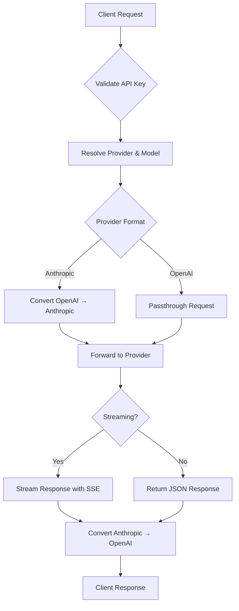
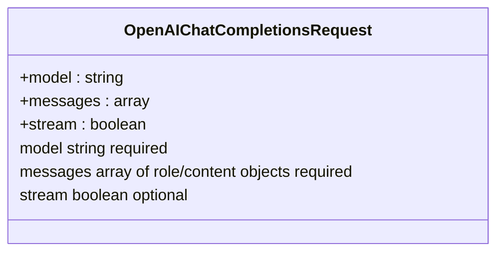
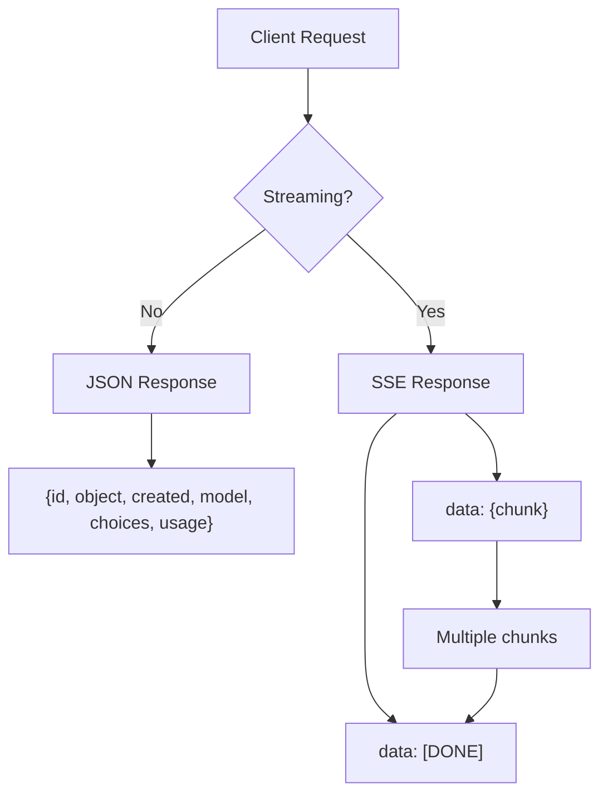
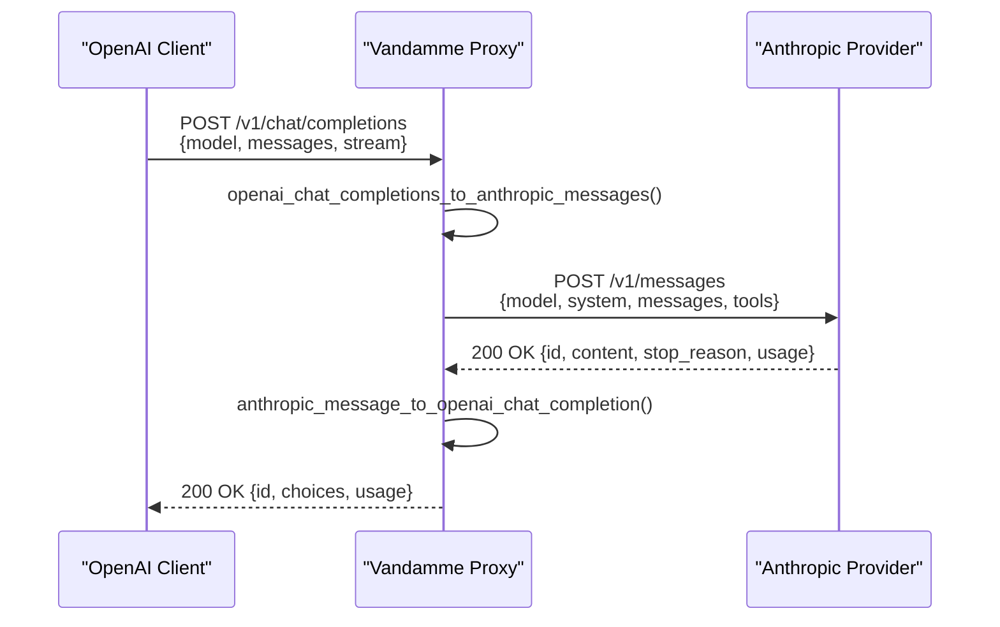
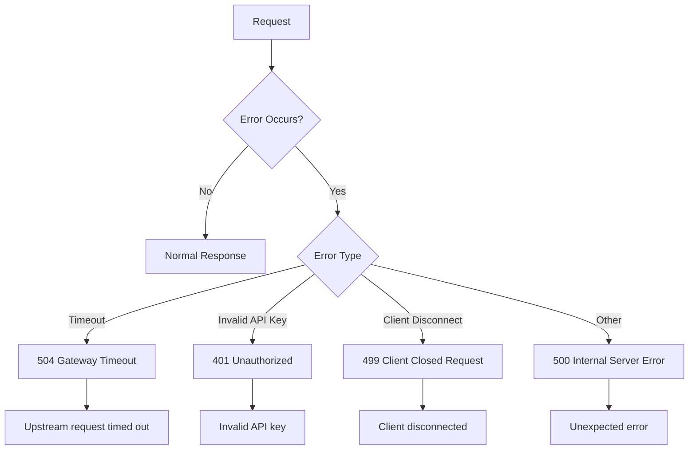
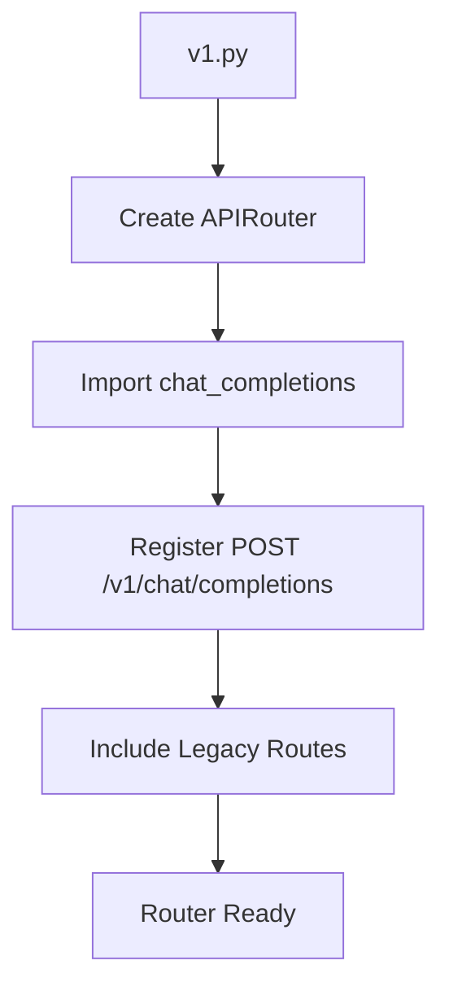

# OpenAI-Compatible Endpoints

<cite>
**Referenced Files in This Document**   
- [v1.py](file://src/api/routers/v1.py)
- [endpoints.py](file://src/api/endpoints.py)
- [openai.py](file://src/models/openai.py)
- [openai_to_anthropic.py](file://src/conversion/openai_to_anthropic.py)
- [anthropic_to_openai.py](file://src/conversion/anthropic_to_openai.py)
- [anthropic_sse_to_openai.py](file://src/conversion/anthropic_sse_to_openai.py)
- [streaming.py](file://src/api/services/streaming.py)
</cite>

## Table of Contents
1. [Introduction](#introduction)
2. [Endpoint Overview](#endpoint-overview)
3. [Request Structure](#request-structure)
4. [Response Format](#response-format)
5. [Conversion Logic](#conversion-logic)
6. [Streaming Implementation](#streaming-implementation)
7. [Error Handling](#error-handling)
8. [API Examples](#api-examples)
9. [Router Registration](#router-registration)

## Introduction
This document provides comprehensive documentation for the OpenAI-compatible endpoints implemented in the Vandamme Proxy system. The primary endpoint `/v1/chat/completions` enables OpenAI API compatibility while supporting conversion to Anthropic format when necessary. The system acts as a gateway between OpenAI-compatible clients and various LLM providers, handling request/response transformations, streaming protocols, and error mapping.

The implementation supports both streaming and non-streaming requests, with proper handling of SSE (Server-Sent Events) headers for streaming responses. The proxy can route requests to different providers based on configuration and convert between OpenAI and Anthropic API formats as needed.

**Section sources**
- [endpoints.py](file://src/api/endpoints.py#L171-L388)
- [v1.py](file://src/api/routers/v1.py#L1-L34)

## Endpoint Overview
The `/v1/chat/completions` endpoint provides OpenAI-compatible chat completions functionality, allowing clients to interact with various LLM providers through a standardized interface. This endpoint supports both streaming and non-streaming requests via the HTTP POST method.

The endpoint is registered in the v1 router and implemented in the endpoints module. When a request is received, the system:
1. Validates the client API key
2. Resolves the target provider and model
3. Determines whether format conversion is needed
4. Processes the request (streaming or non-streaming)
5. Returns the appropriate response format

For providers that use Anthropic format, the system converts the OpenAI request to Anthropic format, forwards it to the upstream provider, and converts the response back to OpenAI format. For OpenAI-format providers, the request is passed through directly.



**Diagram sources**
- [endpoints.py](file://src/api/endpoints.py#L171-L388)
- [v1.py](file://src/api/routers/v1.py#L1-L34)

**Section sources**
- [endpoints.py](file://src/api/endpoints.py#L171-L388)
- [v1.py](file://src/api/routers/v1.py#L1-L34)

## Request Structure
The `/v1/chat/completions` endpoint accepts POST requests with a JSON body that follows the OpenAI chat completions schema. The request structure is defined by the `OpenAIChatCompletionsRequest` model in the codebase.

### Required Parameters
The following parameters are required in the request body:

- **model** (string): The model identifier to use for the completion. This can be a direct model name or a provider-prefixed model (e.g., "openai:gpt-4o"). The system resolves this to the appropriate provider and model.
- **messages** (array): An array of message objects, each containing a role and content. The role can be "system", "user", or "assistant". Each message must have a content field, which can be a string or an array of content parts.

### Optional Parameters
- **stream** (boolean): When set to true, the response will be streamed as Server-Sent Events (SSE). Default is false.

The request model allows additional fields beyond these core parameters, which are forwarded to the upstream provider. This flexibility enables support for provider-specific parameters without requiring changes to the proxy implementation.



**Diagram sources**
- [openai.py](file://src/models/openai.py#L8-L16)
- [endpoints.py](file://src/api/endpoints.py#L173-L176)

**Section sources**
- [openai.py](file://src/models/openai.py#L8-L16)
- [endpoints.py](file://src/api/endpoints.py#L173-L176)

## Response Format
The response format depends on whether the request is streaming or non-streaming. Both formats adhere to the OpenAI chat completions response structure, with appropriate conversion when interacting with Anthropic-format providers.

### Non-Streaming Response
For non-streaming requests (stream=false), the endpoint returns a JSON response with the following structure:
- **id**: A unique identifier for the completion
- **object**: Set to "chat.completion"
- **created**: Unix timestamp of when the completion was created
- **model**: The model used for the completion
- **choices**: An array containing a single choice object with:
  - **index**: Always 0
  - **message**: The assistant's message with role and content
  - **finish_reason**: Why the completion ended (e.g., "stop", "length", "tool_calls")
- **usage**: Token usage statistics (prompt_tokens, completion_tokens, total_tokens)

### Streaming Response
For streaming requests (stream=true), the endpoint returns a text/event-stream response with Server-Sent Events. Each event is formatted as:
```
data: {chunk_data}
```
Where chunk_data is a JSON object with the structure:
- **id**: The completion ID
- **object**: Set to "chat.completion.chunk"
- **created**: Unix timestamp
- **model**: The model used
- **choices**: An array with a single choice object containing:
  - **index**: Always 0
  - **delta**: Partial message content (role, content, or tool_calls)
  - **finish_reason**: Present only in the final chunk

The stream ends with a final event:
```
data: [DONE]
```

The SSE headers include:
- Cache-Control: no-cache
- Connection: keep-alive
- Access-Control-Allow-Origin: *



**Diagram sources**
- [endpoints.py](file://src/api/endpoints.py#L260-L290)
- [streaming.py](file://src/api/services/streaming.py#L18-L25)
- [anthropic_to_openai.py](file://src/conversion/anthropic_to_openai.py#L62-L99)

**Section sources**
- [endpoints.py](file://src/api/endpoints.py#L260-L290)
- [streaming.py](file://src/api/services/streaming.py#L18-L25)
- [anthropic_to_openai.py](file://src/conversion/anthropic_to_openai.py#L62-L99)

## Conversion Logic
The system implements bidirectional conversion between OpenAI and Anthropic API formats to support providers that use different API specifications. This conversion is handled by dedicated functions in the conversion module.

### Request Conversion: OpenAI to Anthropic
When a request is routed to an Anthropic-format provider, the `openai_chat_completions_to_anthropic_messages` function converts the OpenAI request to Anthropic format. The conversion process includes:

1. **Model Mapping**: The resolved model name is used in the Anthropic request
2. **Max Tokens**: The OpenAI max_tokens or max_completion_tokens is mapped to Anthropic's max_tokens
3. **System Messages**: System messages from the OpenAI messages array are extracted and combined into a single system string
4. **Message Structure**: User and assistant messages are preserved with their content
5. **Tool Conversion**: OpenAI function tools are converted to Anthropic tools format with name, description, and input_schema
6. **Tool Calls**: OpenAI tool calls are converted to Anthropic tool_use blocks

The conversion handles the subset of OpenAI features that have direct equivalents in the Anthropic API, preserving the core functionality while maintaining compatibility.

### Response Conversion: Anthropic to OpenAI
When a response is received from an Anthropic-format provider, the `anthropic_message_to_openai_chat_completion` function converts it back to OpenAI format. The conversion process includes:

1. **Basic Structure**: The response is mapped to the OpenAI chat completion structure with id, object, created, and model fields
2. **Content Extraction**: The assistant's text content is extracted from the Anthropic response
3. **Tool Calls**: Anthropic tool_use blocks are converted to OpenAI tool_calls format
4. **Finish Reason**: The Anthropic stop_reason is mapped to OpenAI finish_reason ("tool_use" → "tool_calls", "max_tokens" → "length")
5. **Usage Data**: Token usage is mapped from Anthropic's input_tokens/output_tokens to OpenAI's prompt_tokens/completion_tokens

The conversion ensures that clients receive responses in the expected OpenAI format regardless of the underlying provider's API specification.



**Diagram sources**
- [openai_to_anthropic.py](file://src/conversion/openai_to_anthropic.py#L106-L178)
- [anthropic_to_openai.py](file://src/conversion/anthropic_to_openai.py#L62-L99)
- [endpoints.py](file://src/api/endpoints.py#L253-L322)

**Section sources**
- [openai_to_anthropic.py](file://src/conversion/openai_to_anthropic.py#L106-L178)
- [anthropic_to_openai.py](file://src/conversion/anthropic_to_openai.py#L62-L99)
- [endpoints.py](file://src/api/endpoints.py#L253-L322)

## Streaming Implementation
The streaming implementation handles Server-Sent Events (SSE) for real-time response delivery. The system supports streaming for both OpenAI-format and Anthropic-format providers, with appropriate conversion when necessary.

### Streaming Architecture
The streaming functionality is implemented using FastAPI's StreamingResponse, with several layers of processing:

1. **SSE Headers**: The `sse_headers()` function provides consistent headers for all streaming responses
2. **Error Handling**: The `with_streaming_error_handling()` wrapper catches exceptions during streaming and emits proper error events
3. **Metrics Finalization**: The `with_streaming_metrics_finalizer()` ensures request metrics are properly recorded even if streaming is interrupted

For Anthropic-format providers, the system uses the `anthropic_sse_to_openai_chat_completions_sse` function to translate Anthropic's SSE events to OpenAI format. This stateful translator handles:
- Event parsing and buffering
- Role emission
- Text delta streaming
- Tool call delta streaming
- Finish reason mapping
- Proper stream termination

### Streaming Process
When a streaming request is received:
1. The system validates the request and resolves the provider
2. For Anthropic-format providers, it sets up the conversion stream
3. The upstream provider's streaming response is consumed
4. Each chunk is converted to OpenAI format
5. Chunks are yielded as SSE events
6. The stream ends with a [DONE] event

The implementation includes robust error handling to manage network timeouts and other streaming issues, ensuring clients receive proper error notifications when problems occur.

```mermaid
flowchart TD
A[Streaming Request] --> B{Provider Format}
B --> |Anthropic| C[anthropic_sse_to_openai_chat_completions_sse]
B --> |OpenAI| D[Passthrough Stream]
C --> E[Parse SSE Events]
E --> F[Convert to OpenAI Format]
F --> G[Yield SSE Chunks]
D --> G
G --> H{Error?}
H --> |Yes| I[Emit Error Event]
H --> |No| J[Yield Normal Chunk]
I --> K[Yield [DONE]]
J --> L{Stream Complete?}
L --> |No| G
L --> |Yes| K
K --> M[End Stream]
```

**Diagram sources**
- [anthropic_sse_to_openai.py](file://src/conversion/anthropic_sse_to_openai.py#L150-L264)
- [streaming.py](file://src/api/services/streaming.py#L40-L242)
- [endpoints.py](file://src/api/endpoints.py#L260-L290)

**Section sources**
- [anthropic_sse_to_openai.py](file://src/conversion/anthropic_sse_to_openai.py#L150-L264)
- [streaming.py](file://src/api/services/streaming.py#L40-L242)
- [endpoints.py](file://src/api/endpoints.py#L260-L290)

## Error Handling
The system implements comprehensive error handling for both streaming and non-streaming requests, with proper HTTP status codes and error responses.

### Timeout Handling
Timeout errors are specifically handled and mapped to appropriate HTTP status codes:
- ReadTimeout and TimeoutException from httpx are detected by the `_is_timeout_error()` function
- These errors are mapped to HTTP 504 Gateway Timeout using the `_map_timeout_to_504()` function
- The error message suggests increasing REQUEST_TIMEOUT or STREAMING_READ_TIMEOUT_SECONDS

This ensures that timeout issues are clearly communicated to clients with the appropriate status code.

### Client API Key Validation
The system validates client API keys through the `validate_api_key()` dependency:
- Keys can be provided in the x-api-key header or Authorization header (Bearer token)
- If PROXY_API_KEY is not set in the environment, validation is disabled
- Invalid keys result in HTTP 401 Unauthorized responses
- The validation message specifies that an Anthropic API key is expected

### Streaming Error Handling
For streaming requests, the system uses specialized error handling:
- The `with_sse_error_handler()` wrapper catches exceptions during streaming
- Errors are formatted as OpenAI-style SSE error events
- The stream emits an error event followed by [DONE] to properly terminate
- Common error types include upstream_timeout, upstream_http_error, and streaming_error

### General Error Response
For non-streaming requests, unhandled exceptions result in HTTP 500 Internal Server Error responses with a detail message. The system logs detailed error information for debugging purposes while providing appropriate error responses to clients.



**Diagram sources**
- [endpoints.py](file://src/api/endpoints.py#L53-L83)
- [endpoints.py](file://src/api/endpoints.py#L112-L138)
- [streaming.py](file://src/api/services/streaming.py#L104-L192)

**Section sources**
- [endpoints.py](file://src/api/endpoints.py#L53-L83)
- [endpoints.py](file://src/api/endpoints.py#L112-L138)
- [streaming.py](file://src/api/services/streaming.py#L104-L192)

## API Examples
This section provides curl examples for both streaming and non-streaming requests to the `/v1/chat/completions` endpoint.

### Non-Streaming Request
```bash
curl -X POST http://localhost:8082/v1/chat/completions \
  -H "Content-Type: application/json" \
  -d '{
    "model": "gpt-4o",
    "messages": [
      {"role": "user", "content": "Hello, how are you?"}
    ],
    "stream": false
  }'
```

### Streaming Request
```bash
curl -X POST http://localhost:8082/v1/chat/completions \
  -H "Content-Type: application/json" \
  -d '{
    "model": "gpt-4o",
    "messages": [
      {"role": "user", "content": "Tell me a story about a robot"}
    ],
    "stream": true
  }'
```

### Request with Tools
```bash
curl -X POST http://localhost:8082/v1/chat/completions \
  -H "Content-Type: application/json" \
  -d '{
    "model": "gpt-4o",
    "messages": [
      {"role": "user", "content": "What's the weather in San Francisco?"}
    ],
    "tools": [
      {
        "type": "function",
        "function": {
          "name": "get_weather",
          "description": "Get the current weather in a location",
          "parameters": {
            "type": "object",
            "properties": {
              "location": {
                "type": "string",
                "description": "The city and state, e.g. San Francisco, CA"
              }
            },
            "required": ["location"]
          }
        }
      }
    ],
    "stream": false
  }'
```

These examples demonstrate the standard OpenAI API interface, which is compatible with any OpenAI client library or tool.

**Section sources**
- [endpoints.py](file://src/api/endpoints.py#L171-L388)
- [QUICKSTART.md](file://QUICKSTART.md#L195-L201)

## Router Registration
The `/v1/chat/completions` endpoint is registered in the v1 router module, which serves as the entry point for version 1 of the API. The router is implemented in `src/api/routers/v1.py` and follows a clean separation of concerns pattern.

The registration process:
1. Creates an APIRouter instance
2. Imports the chat_completions endpoint function from `src.api.endpoints`
3. Registers the endpoint with the POST method at the `/v1/chat/completions` path
4. Includes legacy routes while avoiding duplication

This approach provides a clean router module while preserving the exact runtime behavior from the endpoints implementation. The separation allows for easy maintenance and testing of the routing configuration independently from the endpoint logic.



**Diagram sources**
- [v1.py](file://src/api/routers/v1.py#L1-L34)
- [endpoints.py](file://src/api/endpoints.py#L171-L177)

**Section sources**
- [v1.py](file://src/api/routers/v1.py#L1-L34)
- [endpoints.py](file://src/api/endpoints.py#L171-L177)