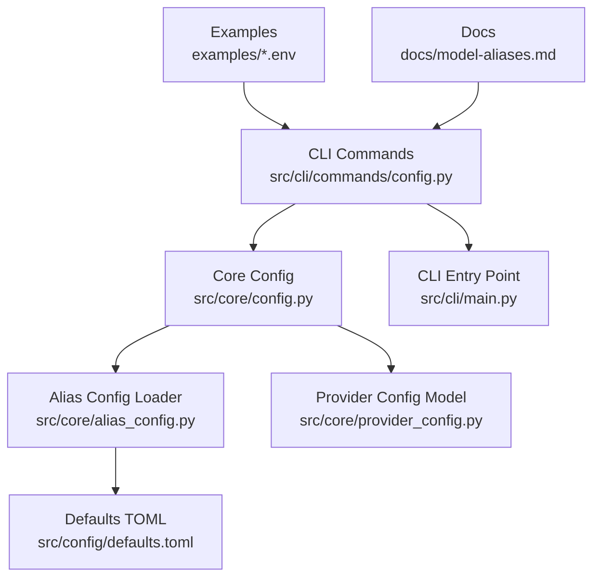
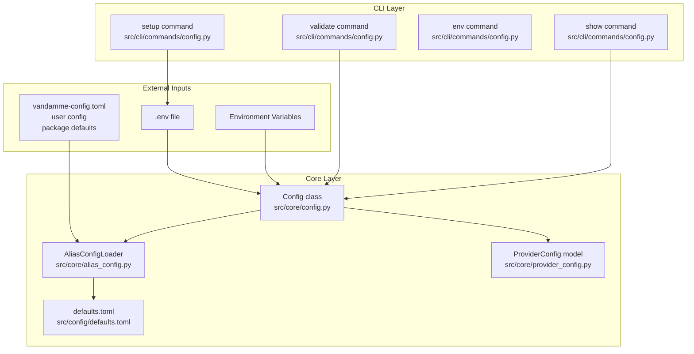
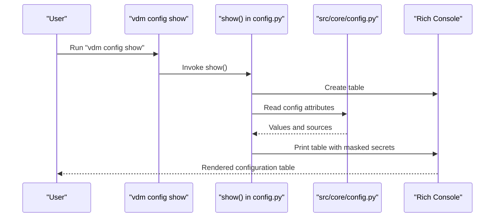
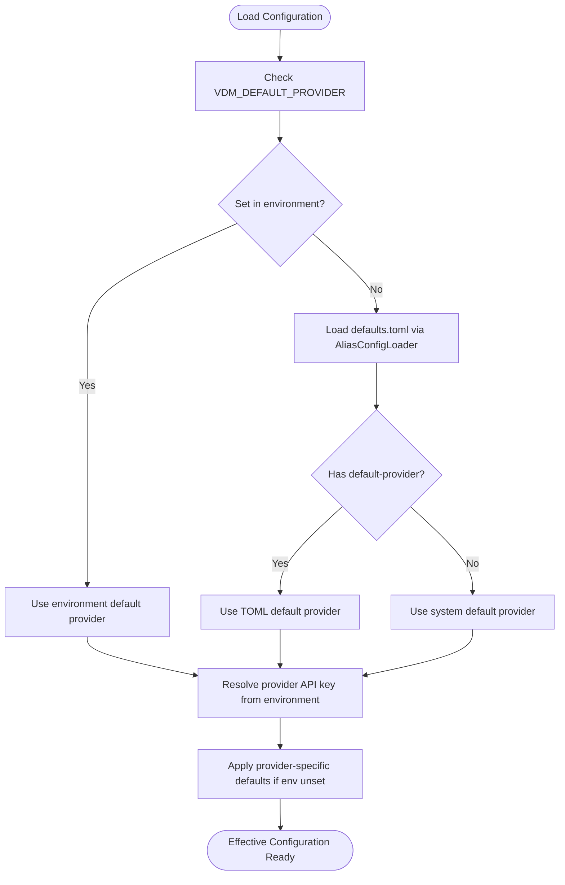
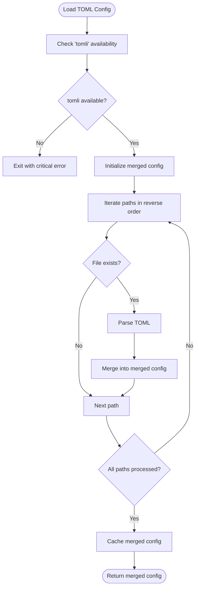
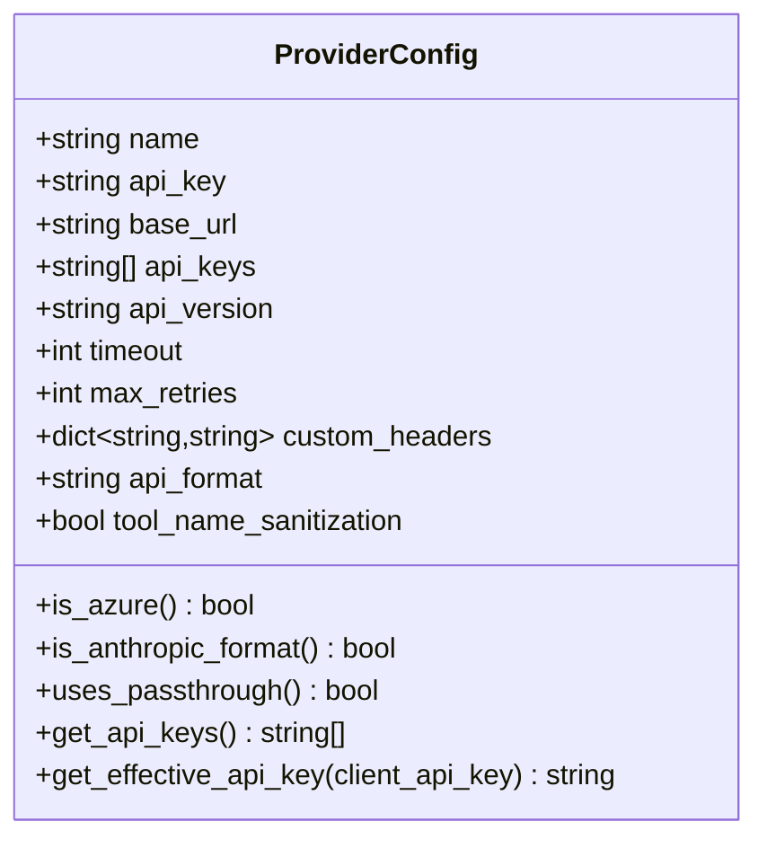
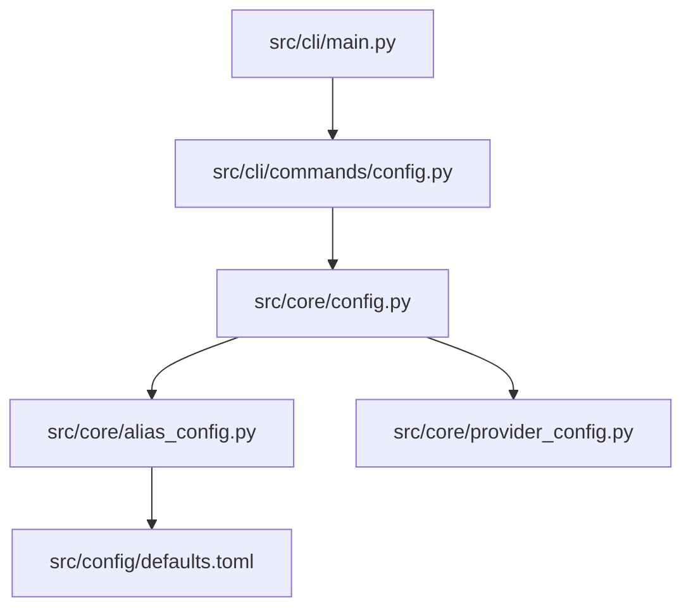

# Configuration Management

<cite>
**Referenced Files in This Document**
- [config.py](file://src/cli/commands/config.py)
- [main.py](file://src/cli/main.py)
- [config.py](file://src/core/config.py)
- [alias_config.py](file://src/core/alias_config.py)
- [defaults.toml](file://src/config/defaults.toml)
- [provider_config.py](file://src/core/provider_config.py)
- [multi-provider.env](file://examples/multi-provider.env)
- [anthropic-direct.env](file://examples/anthropic-direct.env)
- [model-aliases.md](file://docs/model-aliases.md)
</cite>

## Table of Contents
1. [Introduction](#introduction)
2. [Project Structure](#project-structure)
3. [Core Components](#core-components)
4. [Architecture Overview](#architecture-overview)
5. [Detailed Component Analysis](#detailed-component-analysis)
6. [Dependency Analysis](#dependency-analysis)
7. [Performance Considerations](#performance-considerations)
8. [Troubleshooting Guide](#troubleshooting-guide)
9. [Conclusion](#conclusion)
10. [Appendices](#appendices)

## Introduction
This document explains the configuration management commands in the CLI tool for inspecting and modifying proxy configuration. It covers the show, validate, and setup commands, and explains how configuration hierarchy works with environment variables, TOML files, and defaults. Practical scenarios demonstrate debugging provider setup issues, verifying alias configurations, and troubleshooting configuration conflicts. The content references the implementation in src/cli/commands/config.py and its integration with the core configuration system.

## Project Structure
The configuration management functionality spans the CLI commands and the core configuration system:
- CLI commands: src/cli/commands/config.py
- CLI entry point: src/cli/main.py
- Core configuration: src/core/config.py
- TOML defaults: src/config/defaults.toml
- Alias configuration loader: src/core/alias_config.py
- Provider configuration model: src/core/provider_config.py
- Examples: examples/multi-provider.env, examples/anthropic-direct.env
- Documentation: docs/model-aliases.md

**Diagram sources**
- [config.py](file://src/cli/commands/config.py#L1-L141)
- [main.py](file://src/cli/main.py#L1-L113)
- [config.py](file://src/core/config.py#L1-L285)
- [alias_config.py](file://src/core/alias_config.py#L1-L224)
- [defaults.toml](file://src/config/defaults.toml#L1-L89)
- [provider_config.py](file://src/core/provider_config.py#L1-L102)
- [multi-provider.env](file://examples/multi-provider.env#L1-L48)
- [anthropic-direct.env](file://examples/anthropic-direct.env#L1-L22)
- [model-aliases.md](file://docs/model-aliases.md#L1-L443)

**Section sources**
- [config.py](file://src/cli/commands/config.py#L1-L141)
- [main.py](file://src/cli/main.py#L1-L113)

## Core Components
- CLI configuration commands:
  - show: displays current effective configuration with variable, value, and source.
  - validate: checks required settings and basic format validation.
  - env: lists required and optional environment variables.
  - setup: interactive creation of a .env file with minimal required values.
- Core configuration:
  - Loads environment variables and TOML defaults to build the effective configuration.
  - Provides validation helpers and secret masking for display.
- Alias configuration loader:
  - Loads and merges TOML configuration from multiple sources with strict precedence.
  - Supplies default provider and fallback aliases used by the core configuration.

**Section sources**
- [config.py](file://src/cli/commands/config.py#L17-L141)
- [config.py](file://src/core/config.py#L15-L285)
- [alias_config.py](file://src/core/alias_config.py#L27-L224)

## Architecture Overview
The configuration system resolves values from multiple sources with a strict precedence order. The CLI commands consume the core configuration to present effective values and validate settings.

**Diagram sources**
- [config.py](file://src/cli/commands/config.py#L17-L141)
- [config.py](file://src/core/config.py#L15-L285)
- [alias_config.py](file://src/core/alias_config.py#L27-L224)
- [defaults.toml](file://src/config/defaults.toml#L1-L89)
- [provider_config.py](file://src/core/provider_config.py#L7-L102)

## Detailed Component Analysis

### CLI Configuration Commands
- show
  - Displays effective configuration values and their sources.
  - Masks sensitive values for display.
- validate
  - Validates required settings and basic format.
  - Exits with non-zero status on validation failure.
- env
  - Prints a comprehensive list of required and optional environment variables.
- setup
  - Interactive prompt to generate a .env file with minimal required values.

**Diagram sources**
- [config.py](file://src/cli/commands/config.py#L17-L46)
- [config.py](file://src/core/config.py#L15-L285)

**Section sources**
- [config.py](file://src/cli/commands/config.py#L17-L141)

### Configuration Hierarchy and Effective Values
The effective configuration is built by combining environment variables, optional TOML defaults, and system defaults. The core configuration reads environment variables and determines the default provider, then applies provider-specific defaults when environment variables are not set.

**Diagram sources**
- [config.py](file://src/core/config.py#L16-L47)
- [alias_config.py](file://src/core/alias_config.py#L30-L39)
- [defaults.toml](file://src/config/defaults.toml#L5-L8)

**Section sources**
- [config.py](file://src/core/config.py#L16-L98)
- [alias_config.py](file://src/core/alias_config.py#L30-L39)
- [defaults.toml](file://src/config/defaults.toml#L5-L8)

### TOML Configuration Loading and Precedence
The alias configuration loader merges TOML files from multiple sources with strict precedence:
- Highest priority: ./vandamme-config.toml (project override)
- Medium priority: ~/.config/vandamme-proxy/vandamme-config.toml (user config)
- Lowest priority: src/config/defaults.toml (package defaults)

**Diagram sources**
- [alias_config.py](file://src/core/alias_config.py#L41-L155)
- [defaults.toml](file://src/config/defaults.toml#L1-L89)

**Section sources**
- [alias_config.py](file://src/core/alias_config.py#L27-L155)
- [defaults.toml](file://src/config/defaults.toml#L1-L89)

### Provider Configuration Model
Provider configuration encapsulates provider-specific settings and validation rules. It supports single or multiple API keys, Azure OpenAI detection, and passthrough semantics.

**Diagram sources**
- [provider_config.py](file://src/core/provider_config.py#L7-L102)

**Section sources**
- [provider_config.py](file://src/core/provider_config.py#L7-L102)

### Practical Scenarios and Examples

#### Viewing Effective Configuration
- Use the show command to display current effective configuration with variable, value, and source.
- The command masks sensitive values for display.

**Section sources**
- [config.py](file://src/cli/commands/config.py#L17-L46)

#### Validating Configuration Files
- Use the validate command to check required settings and basic format.
- The command prints validation errors and exits with non-zero status on failure.

**Section sources**
- [config.py](file://src/cli/commands/config.py#L48-L68)

#### Interactive Setup and Environment Variables
- Use the setup command to generate a .env file with minimal required values.
- Use the env command to list required and optional environment variables.

**Section sources**
- [config.py](file://src/cli/commands/config.py#L70-L141)

#### Debugging Provider Setup Issues
- Verify that the default provider is set via VDM_DEFAULT_PROVIDER.
- Ensure the corresponding provider API key environment variable is set.
- For Azure OpenAI, set AZURE_API_VERSION alongside provider-specific API key and base URL.
- For Anthropic passthrough, set PROXY_API_KEY if client authentication is required.

**Section sources**
- [config.py](file://src/core/config.py#L16-L98)
- [multi-provider.env](file://examples/multi-provider.env#L1-L48)
- [anthropic-direct.env](file://examples/anthropic-direct.env#L1-L22)

#### Verifying Alias Configurations
- Use the env command to review required environment variables for alias configuration.
- Refer to the model aliases documentation for configuration patterns and troubleshooting.

**Section sources**
- [config.py](file://src/cli/commands/config.py#L70-L101)
- [model-aliases.md](file://docs/model-aliases.md#L41-L99)

## Dependency Analysis
The CLI configuration commands depend on the core configuration, which in turn depends on the alias configuration loader and defaults TOML. The provider configuration model underpins provider-specific settings.

**Diagram sources**
- [config.py](file://src/cli/commands/config.py#L1-L141)
- [config.py](file://src/core/config.py#L1-L285)
- [alias_config.py](file://src/core/alias_config.py#L1-L224)
- [defaults.toml](file://src/config/defaults.toml#L1-L89)
- [provider_config.py](file://src/core/provider_config.py#L1-L102)
- [main.py](file://src/cli/main.py#L1-L113)

**Section sources**
- [config.py](file://src/cli/commands/config.py#L1-L141)
- [config.py](file://src/core/config.py#L1-L285)
- [alias_config.py](file://src/core/alias_config.py#L1-L224)
- [defaults.toml](file://src/config/defaults.toml#L1-L89)
- [provider_config.py](file://src/core/provider_config.py#L1-L102)
- [main.py](file://src/cli/main.py#L1-L113)

## Performance Considerations
- Configuration loading is performed once during initialization; subsequent reads are constant-time property access.
- TOML parsing occurs once and is cached to avoid repeated I/O overhead.
- Masking sensitive values for display is a lightweight operation.

[No sources needed since this section provides general guidance]

## Troubleshooting Guide
Common configuration pitfalls and best practices:
- Missing required environment variables:
  - Ensure OPENAI_API_KEY (or the provider-specific key) is set.
  - For Azure OpenAI, set AZURE_API_VERSION.
- Invalid API key format:
  - The validator checks for a basic format; ensure the key matches expectations.
- Provider not found:
  - Set the provider’s API key environment variable or configure provider settings in TOML.
- Client authentication mismatch:
  - If PROXY_API_KEY is set, clients must provide the exact API key.
- TOML parsing errors:
  - Fix TOML syntax; the loader will log warnings and continue with defaults if files are invalid.
- Conflicting configuration sources:
  - Prefer environment variables for overrides; TOML files are for defaults and fallbacks.

**Section sources**
- [config.py](file://src/cli/commands/config.py#L48-L68)
- [config.py](file://src/core/config.py#L226-L241)
- [alias_config.py](file://src/core/alias_config.py#L138-L139)

## Conclusion
The configuration management commands provide a straightforward way to inspect, validate, and set up proxy configuration. The core configuration system integrates environment variables, TOML defaults, and provider-specific settings to produce an effective configuration. By following the hierarchy and best practices outlined here, you can reliably manage configurations across different environments and troubleshoot issues efficiently.

[No sources needed since this section summarizes without analyzing specific files]

## Appendices

### Configuration Hierarchy Summary
- Environment variables override TOML defaults.
- Provider-specific environment variables override system defaults.
- TOML files are merged in order of precedence: project override, user config, package defaults.
- The effective configuration is computed at startup and used throughout the application lifecycle.

**Section sources**
- [config.py](file://src/core/config.py#L16-L98)
- [alias_config.py](file://src/core/alias_config.py#L30-L39)
- [defaults.toml](file://src/config/defaults.toml#L1-L89)