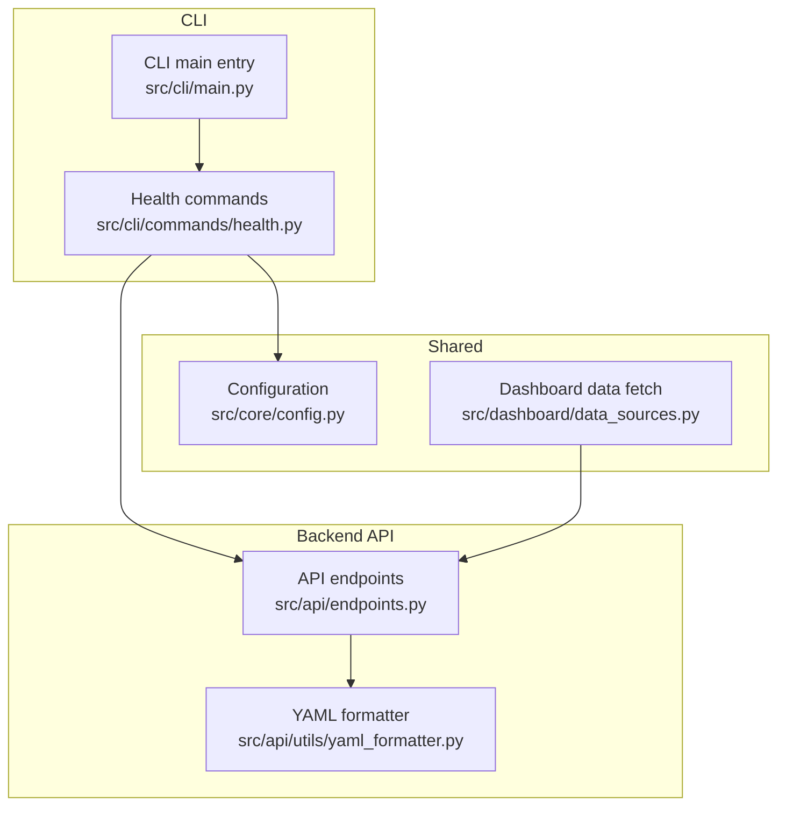
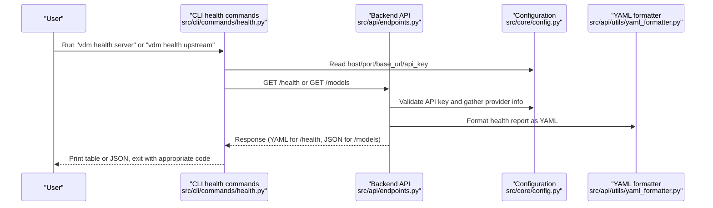
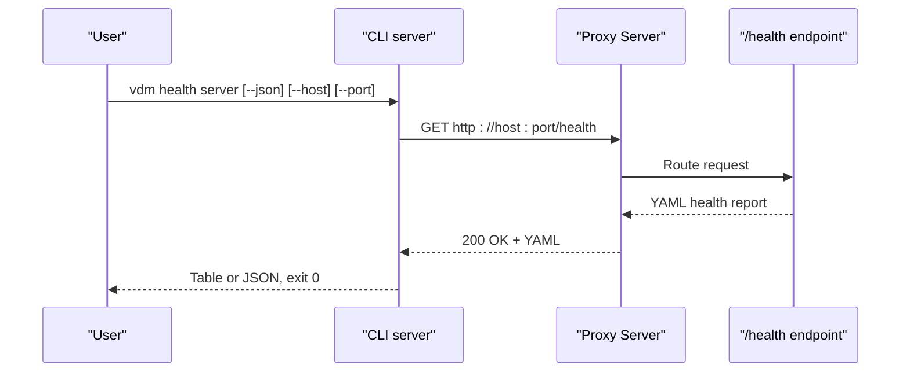
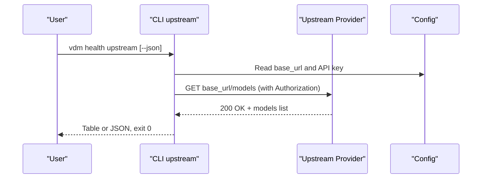
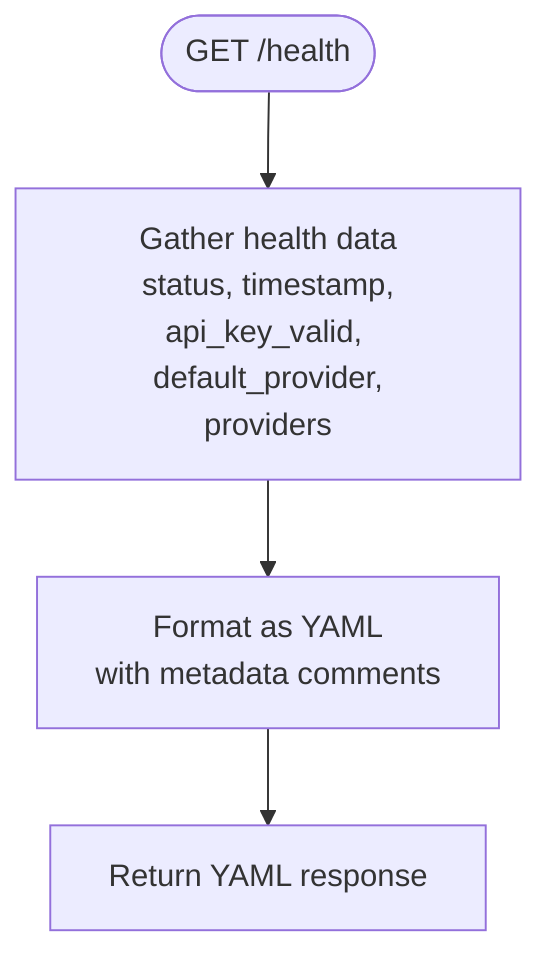
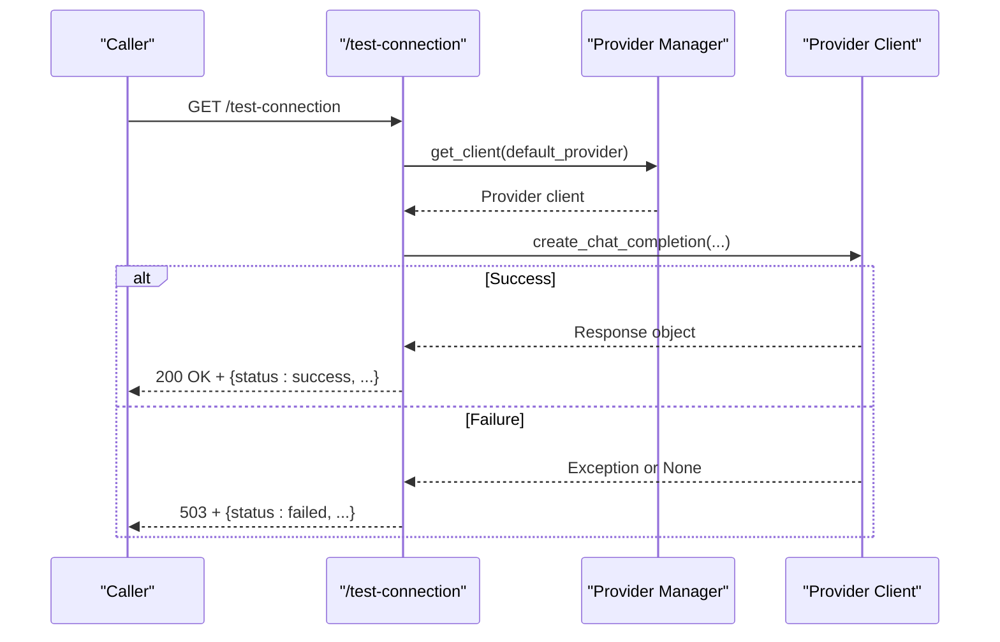
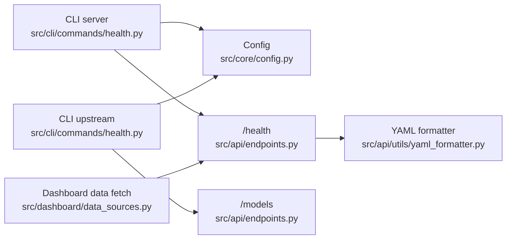

# Health Checks

<cite>
**Referenced Files in This Document**
- [health.py](file://src/cli/commands/health.py)
- [endpoints.py](file://src/api/endpoints.py)
- [main.py](file://src/cli/main.py)
- [config.py](file://src/core/config.py)
- [yaml_formatter.py](file://src/api/utils/yaml_formatter.py)
- [dashboard_data_sources.py](file://src/dashboard/data_sources.py)
- [test_anthropic_passthrough_endpoints.py](file://tests/integration/test_anthropic_passthrough_endpoints.py)
</cite>

## Table of Contents
1. [Introduction](#introduction)
2. [Project Structure](#project-structure)
3. [Core Components](#core-components)
4. [Architecture Overview](#architecture-overview)
5. [Detailed Component Analysis](#detailed-component-analysis)
6. [Dependency Analysis](#dependency-analysis)
7. [Performance Considerations](#performance-considerations)
8. [Troubleshooting Guide](#troubleshooting-guide)
9. [Conclusion](#conclusion)
10. [Appendices](#appendices)

## Introduction
This document explains the health check commands in the CLI tool and how they relate to the backend API health endpoints. It covers:
- How the CLI health commands verify the proxy’s operational state and upstream provider connectivity
- Response formats and exit codes for the CLI commands
- Interpretation of health check output and how to integrate checks into monitoring and CI/CD
- Troubleshooting guidance for common network and authentication issues

## Project Structure
The health check capability spans the CLI commands and the backend API:
- CLI commands: server and upstream checks
- Backend API: /health endpoint and /test-connection endpoint
- Shared configuration: environment variables and provider settings
- Utilities: YAML formatter for health reports

**Diagram sources**
- [main.py](file://src/cli/main.py#L1-L35)
- [health.py](file://src/cli/commands/health.py#L1-L126)
- [endpoints.py](file://src/api/endpoints.py#L1010-L1134)
- [yaml_formatter.py](file://src/api/utils/yaml_formatter.py#L170-L206)
- [config.py](file://src/core/config.py#L15-L120)
- [dashboard_data_sources.py](file://src/dashboard/data_sources.py#L33-L45)

**Section sources**
- [main.py](file://src/cli/main.py#L1-L35)
- [health.py](file://src/cli/commands/health.py#L1-L126)
- [endpoints.py](file://src/api/endpoints.py#L1010-L1134)
- [yaml_formatter.py](file://src/api/utils/yaml_formatter.py#L170-L206)
- [config.py](file://src/core/config.py#L15-L120)
- [dashboard_data_sources.py](file://src/dashboard/data_sources.py#L33-L45)

## Core Components
- CLI health commands:
  - server: checks the proxy server health endpoint and prints a table or JSON
  - upstream: tests connectivity to the configured upstream provider by listing models
- Backend health endpoints:
  - /health: returns a YAML report with system status, timestamp, API key validation, default provider, and provider details
  - /test-connection: performs a live test to the default provider and returns structured success/failure details

Key behaviors:
- The CLI server command calls the backend /health endpoint and interprets the response
- The CLI upstream command calls the upstream provider’s /models endpoint using configured credentials
- The backend /health endpoint can return “healthy” or “degraded” depending on configuration completeness

**Section sources**
- [health.py](file://src/cli/commands/health.py#L17-L126)
- [endpoints.py](file://src/api/endpoints.py#L1010-L1134)
- [yaml_formatter.py](file://src/api/utils/yaml_formatter.py#L170-L206)

## Architecture Overview
The health check flow connects CLI commands to backend endpoints and configuration:

**Diagram sources**
- [health.py](file://src/cli/commands/health.py#L17-L126)
- [endpoints.py](file://src/api/endpoints.py#L1010-L1134)
- [yaml_formatter.py](file://src/api/utils/yaml_formatter.py#L170-L206)
- [config.py](file://src/core/config.py#L15-L120)

## Detailed Component Analysis

### CLI Health Commands

#### Command: server
- Purpose: Verify the proxy server is reachable and responding to health checks
- Behavior:
  - Resolves target host/port from CLI options or configuration
  - Calls backend /health endpoint
  - Prints either a formatted table or JSON depending on --json
  - Exits with code 0 on success, 1 on failure
- Output format:
  - Table mode: includes status, URL, and response time
  - JSON mode: includes the parsed JSON payload from /health
- Exit codes:
  - 0: successful health check
  - 1: connection error or other failure

**Diagram sources**
- [health.py](file://src/cli/commands/health.py#L17-L64)
- [endpoints.py](file://src/api/endpoints.py#L1010-L1041)

**Section sources**
- [health.py](file://src/cli/commands/health.py#L17-L64)

#### Command: upstream
- Purpose: Verify connectivity to the configured upstream provider
- Behavior:
  - Builds an HTTP client using configured base_url and API key
  - Calls upstream /models endpoint
  - Prints either a formatted table or JSON depending on --json
  - Exits with code 0 on success, 1 on failure
- Output format:
  - Table mode: includes status, base URL, API key hash, and response time
  - JSON mode: includes status, base_url, and api_key hash
- Exit codes:
  - 0: successful upstream connectivity
  - 1: upstream connectivity failure

**Diagram sources**
- [health.py](file://src/cli/commands/health.py#L66-L126)
- [config.py](file://src/core/config.py#L49-L80)

**Section sources**
- [health.py](file://src/cli/commands/health.py#L66-L126)

### Backend Health Endpoints

#### Endpoint: /health
- Purpose: Provide a comprehensive health report for the proxy server
- Response:
  - Content-Type: text/yaml; charset=utf-8
  - Body: YAML-formatted health report including:
    - status: "healthy" or "degraded"
    - timestamp: ISO timestamp
    - api_key_valid: boolean indicating if the configured API key looks valid
    - client_api_key_validation: boolean indicating if client-side API key validation is enabled
    - default_provider: name of the default provider
    - providers: provider details (structure depends on implementation)
- Behavior:
  - On configuration issues, returns a "degraded" status with suggestions and error details
  - Uses a YAML formatter to produce human-readable output with metadata comments

**Diagram sources**
- [endpoints.py](file://src/api/endpoints.py#L1010-L1069)
- [yaml_formatter.py](file://src/api/utils/yaml_formatter.py#L170-L206)

**Section sources**
- [endpoints.py](file://src/api/endpoints.py#L1010-L1069)
- [yaml_formatter.py](file://src/api/utils/yaml_formatter.py#L170-L206)

#### Endpoint: /test-connection
- Purpose: Perform a live connectivity test to the default provider
- Behavior:
  - Attempts a minimal chat completion request to the default provider
  - Returns structured success or failure details
  - On success: returns status "success" with provider, model used, and response ID
  - On failure: returns status "failed" with error details and suggestions

**Diagram sources**
- [endpoints.py](file://src/api/endpoints.py#L1072-L1134)

**Section sources**
- [endpoints.py](file://src/api/endpoints.py#L1072-L1134)

### Configuration and Environment Variables
- Default provider selection:
  - Priority: environment variable VDM_DEFAULT_PROVIDER, then TOML defaults, otherwise "openai"
- API key and base URL:
  - Provider-specific API key via environment variables (e.g., OPENAI_API_KEY)
  - Base URL via environment variables (e.g., OPENAI_BASE_URL), with provider-specific defaults
- Client-side API key validation:
  - Controlled by PROXY_API_KEY; when set, client requests must match
- API key hashing:
  - A secure hash representation is exposed for display without revealing the full key

**Section sources**
- [config.py](file://src/core/config.py#L15-L120)
- [config.py](file://src/core/config.py#L226-L277)

## Dependency Analysis
- CLI health commands depend on:
  - Configuration module for host/port and upstream settings
  - HTTP client to call backend endpoints
- Backend health endpoints depend on:
  - Configuration module for API key validation and provider details
  - YAML formatter for consistent reporting
- Dashboard data sources depend on:
  - Backend /health endpoint for provider list extraction

**Diagram sources**
- [health.py](file://src/cli/commands/health.py#L17-L126)
- [config.py](file://src/core/config.py#L15-L120)
- [endpoints.py](file://src/api/endpoints.py#L1010-L1134)
- [yaml_formatter.py](file://src/api/utils/yaml_formatter.py#L170-L206)
- [dashboard_data_sources.py](file://src/dashboard/data_sources.py#L33-L45)

**Section sources**
- [health.py](file://src/cli/commands/health.py#L17-L126)
- [config.py](file://src/core/config.py#L15-L120)
- [endpoints.py](file://src/api/endpoints.py#L1010-L1134)
- [yaml_formatter.py](file://src/api/utils/yaml_formatter.py#L170-L206)
- [dashboard_data_sources.py](file://src/dashboard/data_sources.py#L33-L45)

## Performance Considerations
- Timeouts:
  - CLI server command uses a short timeout for health checks to keep feedback snappy
  - CLI upstream command uses a longer timeout suitable for upstream provider calls
- Response parsing:
  - /health returns YAML; CLI server parses JSON when --json is used
- Provider list extraction:
  - Dashboard safely extracts provider lists from health YAML, handling both dict and list formats

[No sources needed since this section provides general guidance]

## Troubleshooting Guide

### Interpreting Health Check Output
- CLI server (table mode):
  - Status: shows “Healthy” when the backend responds successfully
  - URL: the endpoint that was checked
  - Response Time: elapsed time for the request
- CLI server (JSON mode):
  - Parses and prints the backend’s JSON payload
- CLI upstream (table mode):
  - Status: shows “Connected” when upstream responds successfully
  - Base URL: configured upstream base URL
  - API Key: secure hash representation
  - Response Time: elapsed time for the upstream request
- Backend /health:
  - status: “healthy” or “degraded”
  - timestamp: when the report was generated
  - api_key_valid: whether the configured API key appears valid
  - default_provider: configured default provider
  - providers: provider details (may vary by implementation)
- /test-connection:
  - success: includes provider, model used, and response ID
  - failed: includes error type, message, and suggestions

**Section sources**
- [health.py](file://src/cli/commands/health.py#L35-L63)
- [health.py](file://src/cli/commands/health.py#L86-L107)
- [endpoints.py](file://src/api/endpoints.py#L1010-L1134)

### Common Network Issues
- Cannot connect to server:
  - Symptoms: CLI server exits with code 1 and an error message
  - Causes: wrong host/port, firewall blocking, server down
  - Actions: verify host/port, check network connectivity, confirm server is running
- Upstream connectivity failures:
  - Symptoms: CLI upstream exits with code 1 and an error message
  - Causes: incorrect base_url, blocked network, upstream service downtime
  - Actions: verify base_url, check DNS and firewall, test upstream service availability

**Section sources**
- [health.py](file://src/cli/commands/health.py#L48-L63)
- [health.py](file://src/cli/commands/health.py#L109-L125)

### Authentication Problems
- Missing or invalid API key:
  - Symptoms: backend /health may report “degraded”, upstream calls fail
  - Causes: OPENAI_API_KEY not set or invalid format
  - Actions: set OPENAI_API_KEY (or provider-specific key), ensure it matches expected format
- Client-side API key mismatch:
  - Symptoms: requests rejected if PROXY_API_KEY is configured
  - Actions: configure PROXY_API_KEY consistently or unset it to disable validation

**Section sources**
- [config.py](file://src/core/config.py#L226-L241)
- [endpoints.py](file://src/api/endpoints.py#L1044-L1055)

### Integration Examples

#### Monitoring Systems
- Use the CLI server command to poll the backend /health endpoint:
  - Example invocation: vdm health server --json --host localhost --port 8082
  - Parse the JSON payload for status and response time
  - Exit code 0 indicates success; 1 indicates failure

**Section sources**
- [health.py](file://src/cli/commands/health.py#L17-L64)

#### CI/CD Pipelines
- Pre-deploy health checks:
  - After starting the proxy, run vdm health server to ensure it is reachable
  - Optionally run vdm health upstream to verify upstream connectivity
- Post-deploy verification:
  - Integrate the CLI commands into pipeline stages to gate deployments on success

**Section sources**
- [health.py](file://src/cli/commands/health.py#L17-L126)

## Conclusion
The health check system provides two complementary views:
- CLI server: confirms the proxy is up and serving /health
- CLI upstream: validates connectivity to the configured upstream provider
Together with backend endpoints and configuration, they enable robust monitoring and CI/CD integration while offering actionable diagnostics for common issues.

[No sources needed since this section summarizes without analyzing specific files]

## Appendices

### Exit Codes Summary
- CLI server:
  - 0: successful health check
  - 1: connection or other failure
- CLI upstream:
  - 0: successful upstream connectivity
  - 1: upstream connectivity failure

**Section sources**
- [health.py](file://src/cli/commands/health.py#L48-L63)
- [health.py](file://src/cli/commands/health.py#L109-L125)

### Backend Health Response Shape
- /health returns YAML with:
  - status: "healthy" or "degraded"
  - timestamp: ISO timestamp
  - api_key_valid: boolean
  - client_api_key_validation: boolean
  - default_provider: string
  - providers: provider details (structure depends on implementation)

**Section sources**
- [endpoints.py](file://src/api/endpoints.py#L1010-L1069)
- [yaml_formatter.py](file://src/api/utils/yaml_formatter.py#L170-L206)

### Related Tests
- Integration test verifies /health returns YAML and includes server status indicators

**Section sources**
- [test_anthropic_passthrough_endpoints.py](file://tests/integration/test_anthropic_passthrough_endpoints.py#L45-L66)