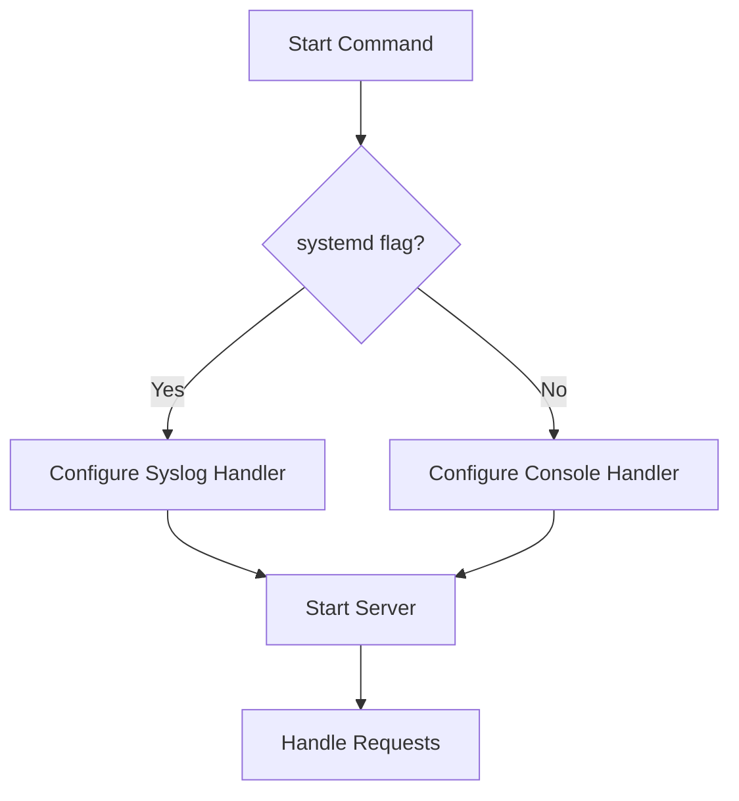
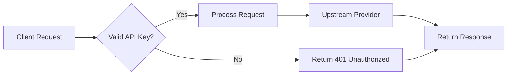

# Server Management

<cite>
**Referenced Files in This Document**   
- [server.py](file://src/cli/commands/server.py)
- [main.py](file://src/cli/main.py)
- [config.py](file://src/core/config.py)
- [configuration.py](file://src/core/logging/configuration.py)
- [proxy_manager.py](file://src/cli/wrap/proxy_manager.py)
- [wrappers.py](file://src/cli/wrap/wrappers.py)
- [v1.py](file://src/api/routers/v1.py)
- [endpoints.py](file://src/api/endpoints.py)
</cite>

## Table of Contents
1. [Introduction](#introduction)
2. [Server Management Commands](#server-management-commands)
3. [Command Implementation Details](#command-implementation-details)
4. [Configuration and Environment Variables](#configuration-and-environment-variables)
5. [Process Lifecycle Management](#process-lifecycle-management)
6. [System Integration and Service Management](#system-integration-and-service-management)
7. [Common Issues and Troubleshooting](#common-issues-and-troubleshooting)
8. [Best Practices for Production](#best-practices-for-production)

## Introduction

The Vandamme Proxy CLI provides server management functionality through the `vdm server` command group. This documentation details the implementation and usage of server management commands including start, stop, restart, and status operations. The server management system is designed to handle proxy server lifecycle operations with support for various deployment scenarios from development to production environments.

The CLI is built using Typer and integrates with the FastAPI application through uvicorn. Server management commands interact with the proxy server process, handling configuration, logging, and process lifecycle operations. The system supports both interactive development use and automated production deployments with systemd integration.

**Section sources**
- [server.py](file://src/cli/commands/server.py#L1-L114)
- [main.py](file://src/cli/main.py#L1-L113)

## Server Management Commands

The server management commands are accessible through the `vdm server` command group. Currently, the `start` command is fully implemented, while `stop`, `restart`, and `status` commands are placeholders with TODO implementations.

### Start Command

The `start` command initiates the proxy server with various configuration options:

```bash
vdm server start [OPTIONS]
```

**Options:**
- `--host TEXT`: Override server host (defaults to config value)
- `--port INTEGER`: Override server port (defaults to config value)
- `--reload`: Enable auto-reload for development
- `--daemon`: Run in background (not yet implemented)
- `--pid-file TEXT`: PID file path (defaults to `~/.vdm.pid`)
- `--systemd`: Send logs to systemd journal instead of console

When starting the server, the command displays configuration details including server URL, default provider, base URL, and API key hash (first 16 characters of SHA256 hash). It also shows provider summaries and alias configurations.

### Stop, Restart, and Status Commands

Currently, the stop, restart, and status commands are not implemented and display placeholder messages:

```python
console.print("[yellow]Stop command not yet implemented[/yellow]")
```

These commands are defined in the CLI but lack actual implementation. Future versions should provide functionality to stop running server instances, restart the server, and check server status.

**Section sources**
- [server.py](file://src/cli/commands/server.py#L15-L114)

## Command Implementation Details

### Command Registration

The server commands are registered within the CLI application structure. The main CLI entry point in `src/cli/main.py` imports and adds the server command group:

```python
from src.cli.commands import server
app.add_typer(server.app, name="server", help="Server management")
```

This creates the `vdm server` command group with access to all server-related commands.

### Start Command Implementation

The `start` command implementation follows a structured approach:

1. **Logging Configuration**: Configures root logging before any console output
2. **Configuration Override**: Applies command-line options to override configuration
3. **Console Setup**: Initializes Rich console for output formatting
4. **Configuration Display**: Shows server configuration in a formatted table
5. **Provider and Alias Summaries**: Displays provider and alias configuration summaries
6. **Server Startup**: Starts the server either in daemon mode or foreground mode

The actual server startup is handled by the `_start_server` function, which uses uvicorn to run the FastAPI application:

```python
uvicorn.run(
    "src.main:app",
    host=host,
    port=port,
    reload=reload,
    log_level="warning",
    access_log=False,
)
```

Uvicorn's default logging is disabled since the application configures its own logging system.

### Daemon Mode

The daemon mode functionality is currently not implemented. The `_start_daemon` function contains a TODO comment indicating that daemon mode with proper PID file handling needs to be implemented.

**Section sources**
- [server.py](file://src/cli/commands/server.py#L15-L114)
- [main.py](file://src/cli/main.py#L10-L28)

## Configuration and Environment Variables

### Configuration System

The server configuration is managed through the `Config` class in `src/core/config.py`. Configuration values are derived from environment variables with sensible defaults:

- `HOST`: Server host (default: "0.0.0.0")
- `PORT`: Server port (default: "8082")
- `LOG_LEVEL`: Logging level (default: "INFO")
- `MAX_TOKENS_LIMIT`: Maximum tokens limit (default: "4096")
- `REQUEST_TIMEOUT`: Request timeout in seconds (default: "90")

The configuration system also handles provider-specific settings and API keys, with the default provider determined by the `VDM_DEFAULT_PROVIDER` environment variable.

### Logging Configuration

The logging system is configured in `src/core/logging/configuration.py` and supports two output modes:

1. **Console Output**: Default mode that displays formatted output to stdout
2. **Systemd Journal**: Enabled with `--systemd` flag, sends logs to journald

When using systemd mode, all console output is suppressed, and logs are sent to the systemd journal. The logging configuration includes:
- Custom formatter with correlation IDs
- HTTP request log downgrading filter
- Syslog handler for systemd integration
- Console handler for development use

The logging mode can be checked programmatically through the `get_logging_mode()` function, which returns information about the requested and effective logging handlers.



**Diagram sources **
- [configuration.py](file://src/core/logging/configuration.py#L88-L144)
- [server.py](file://src/cli/commands/server.py#L34-L41)

**Section sources**
- [config.py](file://src/core/config.py#L15-L285)
- [configuration.py](file://src/core/logging/configuration.py#L1-L144)

## Process Lifecycle Management

### Process Management in Wrap Commands

The `vdm wrap` command includes process management functionality through the `ProxyManager` class in `src/cli/wrap/proxy_manager.py`. This class handles the lifecycle of the proxy server when used in conjunction with wrapped tools.

Key features of the ProxyManager:
- Checks if proxy is already running via health endpoint
- Starts proxy process with subprocess.Popen
- Uses `--systemd` flag to suppress console output
- Manages process cleanup on exit
- Handles graceful termination and force killing

The proxy manager uses health checks to verify server readiness:

```python
async def _is_proxy_running(self) -> bool:
    try:
        async with httpx.AsyncClient(timeout=5.0) as client:
            response = await client.get(f"http://{self.host}:{self.port}/health")
            return response.status_code == 200
    except Exception:
        return False
```

### Process Cleanup

The cleanup process follows a graceful shutdown pattern:
1. Send terminate signal to process
2. Wait up to 2.5 seconds for graceful shutdown
3. Force kill if process doesn't terminate
4. Clean up process references

```python
def cleanup_if_needed(self) -> None:
    if self._we_started_it and self._process:
        self._process.terminate()
        # Wait for graceful termination
        for _ in range(5):
            if self._process.poll() is not None:
                break
            await asyncio.sleep(0.5)
        # Force kill if needed
        if self._process.poll() is None:
            self._process.kill()
            self._process.wait()
```

**Section sources**
- [proxy_manager.py](file://src/cli/wrap/proxy_manager.py#L14-L142)
- [wrappers.py](file://src/cli/wrap/wrappers.py#L13-L141)

## System Integration and Service Management

### Systemd Integration

The server supports systemd integration for production deployments. When started with the `--systemd` flag, logs are sent to the systemd journal instead of console output.

Example systemd service configuration:
```ini
[Unit]
Description=Vandamme Proxy
After=network.target

[Service]
Type=simple
User=vandamme
WorkingDirectory=/opt/vandamme-proxy
Environment=HOST=0.0.0.0
Environment=PORT=8082
ExecStart=/opt/vandamme-proxy/.venv/bin/vdm server start --systemd
Restart=always

[Install]
WantedBy=multi-user.target
```

Logs can be viewed using:
```bash
journalctl -t vandamme-proxy -f
```

If systemd is unavailable, the server falls back to console logging. The system checks for `/dev/log` to determine if journald is available.

### Docker Integration

The server can be deployed using Docker Compose:

```yaml
version: '3'
services:
  vandamme-proxy:
    build: .
    ports:
      - "8082:8082"
    environment:
      - OPENAI_API_KEY=${OPENAI_API_KEY}
      - POE_API_KEY=${POE_API_KEY}
    restart: always
```

Deployment commands:
```bash
docker compose up -d
docker compose logs -f
docker compose down
```

**Section sources**
- [README.md](file://README.md#L622-L660)
- [configuration.py](file://src/core/logging/configuration.py#L44-L53)

## Common Issues and Troubleshooting

### Port Conflicts

Port conflicts occur when the specified port is already in use. Solutions include:

1. Check for existing processes:
```bash
lsof -i :8082
netstat -tulpn | grep 8082
```

2. Use a different port:
```bash
vdm server start --port 8083
```

3. Kill the existing process:
```bash
lsof -t -i:8082 | xargs kill
```

### Permission Errors

Permission errors typically occur when writing to PID files or log directories. Ensure the user has appropriate permissions:

```bash
# Ensure directory exists and has proper permissions
mkdir -p ~/.cache/vandamme-proxy
chmod 755 ~/.cache/vandamme-proxy
```

For systemd services, ensure the service user has appropriate permissions to the working directory and configuration files.

### Process Cleanup Issues

When the server doesn't shut down properly, orphaned processes may remain. Check for running processes:

```bash
ps aux | grep vdm
pkill -f vdm
```

The PID file at `~/.vdm.pid` should be cleaned up on proper shutdown. If the file remains, it can be safely removed.

### Logging Issues

When using systemd logging, ensure the systemd Python package is installed and `/dev/log` is available. If systemd is not available, the server automatically falls back to console logging.

Check logging configuration:
```bash
# Verify logging mode
curl http://localhost:8082/metrics | grep systemd
```

**Section sources**
- [server.py](file://src/cli/commands/server.py#L96-L101)
- [proxy_manager.py](file://src/cli/wrap/proxy_manager.py#L115-L137)

## Best Practices for Production

### Configuration Management

Use environment files for configuration management:

```bash
# .env file
OPENAI_API_KEY=sk-your-key
POE_API_KEY=!PASSTHRU
VDM_DEFAULT_PROVIDER=openai
HOST=0.0.0.0
PORT=8082
LOG_LEVEL=INFO
```

Load environment variables:
```bash
source .env
vdm server start --systemd
```

### High Availability

For production deployments, configure multiple API keys for automatic failover:

```bash
export OPENAI_API_KEY="sk-key1 sk-key2 sk-key3"
export ANTHROPIC_API_KEY="sk-ant1 sk-ant2"
vdm server start --systemd
```

This enables round-robin load balancing and automatic failover when keys are invalid or rate-limited.

### Monitoring and Health Checks

Use the built-in health check endpoint to monitor server status:

```bash
# Check server health
curl http://localhost:8082/health

# Check from CLI
vdm health server
```

The health endpoint returns detailed information about server status and provider connectivity.

### Automated Restart

Configure the service to restart automatically on failure:

```ini
[Service]
Restart=always
RestartSec=5
```

This ensures the proxy remains available even if it crashes due to unexpected errors.

### Security Considerations

1. Use environment variables for API keys, not command-line arguments
2. Set appropriate file permissions on configuration files
3. Use the `PROXY_API_KEY` environment variable to require client authentication
4. Regularly rotate API keys
5. Monitor logs for unauthorized access attempts



**Diagram sources **
- [endpoints.py](file://src/api/endpoints.py#L112-L138)
- [v1.py](file://src/api/routers/v1.py#L1-L34)

**Section sources**
- [config.py](file://src/core/config.py#L226-L241)
- [endpoints.py](file://src/api/endpoints.py#L1-L200)