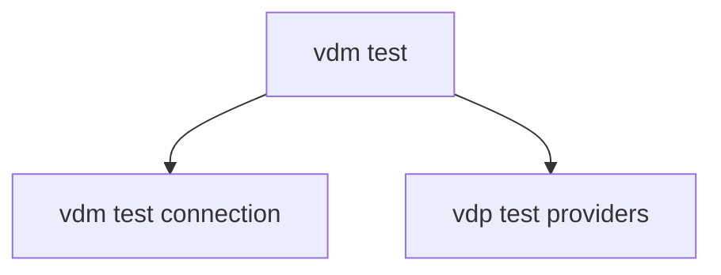
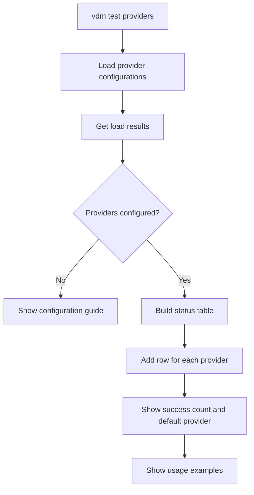
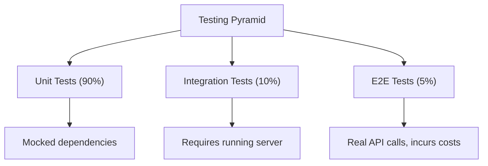

# Testing Utilities

<cite>
**Referenced Files in This Document**   
- [test.py](file://src/cli/commands/test.py)
- [health.py](file://src/cli/commands/health.py)
- [main.py](file://src/cli/main.py)
- [client.py](file://src/core/client.py)
- [endpoints.py](file://src/api/endpoints.py)
- [provider_manager.py](file://src/core/provider_manager.py)
- [models.py](file://src/cli/commands/models.py)
</cite>

## Table of Contents
1. [Introduction](#introduction)
2. [Test Command Overview](#test-command-overview)
3. [Connection Testing](#connection-testing)
4. [Provider Configuration Validation](#provider-configuration-validation)
5. [Integration with Health Checks](#integration-with-health-checks)
6. [Model Discovery and Testing](#model-discovery-and-testing)
7. [Testing Framework Integration](#testing-framework-integration)
8. [Common Testing Scenarios](#common-testing-scenarios)
9. [Performance and Error Metrics](#performance-and-error-metrics)
10. [Best Practices for Development and Production](#best-practices-for-development-and-production)

## Introduction

The Vandamme proxy provides comprehensive testing utilities through its CLI interface to validate proxy functionality, provider connectivity, and performance characteristics. These testing tools are essential for both development validation and production monitoring, enabling users to verify configuration changes, test model routing, and measure system performance. The testing framework is designed to support multiple testing scenarios, from simple connectivity checks to comprehensive integration testing.

The testing utilities are implemented as CLI commands that interact with the proxy's core components, including the provider manager, configuration system, and API endpoints. These commands provide both human-readable output and machine-readable JSON formats, making them suitable for both interactive use and automated testing workflows. The testing infrastructure is integrated with the project's Makefile-based development workflow, allowing for seamless execution of test suites.

**Section sources**
- [test.py](file://src/cli/commands/test.py#L1-L128)
- [main.py](file://src/cli/main.py#L1-L113)

## Test Command Overview

The CLI testing utilities are organized under the `vdm test` command namespace, providing several subcommands for different testing purposes. The primary testing commands include `connection` for validating API access and `providers` for listing configured providers. These commands are implemented in the `src/cli/commands/test.py` module and integrated into the main CLI application through Typer, a modern Python library for building command-line interfaces.

The testing commands follow a consistent design pattern, using Rich for formatted console output with color-coded status indicators and structured tables. Each command performs specific validation checks and provides clear feedback about the system's configuration and connectivity status. The commands are designed to be non-destructive and safe for use in both development and production environments, focusing on read-only operations that verify system state without modifying configuration.

The testing framework is extensible, allowing for additional test commands to be added as needed. The commands are registered with the main CLI application through the Typer framework, ensuring consistent help text, argument parsing, and error handling across all commands. This modular design enables focused testing of specific system components while maintaining a unified interface.

**Diagram sources**
- [test.py](file://src/cli/commands/test.py#L12-L128)
- [main.py](file://src/cli/main.py#L25)

**Section sources**
- [test.py](file://src/cli/commands/test.py#L1-L128)
- [main.py](file://src/cli/main.py#L7-L28)

## Connection Testing

The `vdm test connection` command validates API connectivity by checking the configuration of the default provider. This command performs several validation steps to ensure that the proxy can successfully communicate with the upstream API service. It verifies the presence of required API keys, displays configuration details such as the base URL and provider information, and provides guidance for further testing.

When executed, the command first checks whether the API key for the default provider is properly configured in the environment variables. If the API key is missing, it displays an error message indicating which provider's API key is required. If the configuration is valid, it shows the hashed API key (for security), the default provider, and the base URL. The command also provides guidance on next steps, suggesting the use of `vdm health upstream` for a more comprehensive connectivity test.

This connection test is designed to catch configuration issues early in the setup process, helping users identify missing environment variables or incorrect configuration settings. The command's output is structured to be both human-readable and machine-parsable, with color-coded status indicators (red for errors, green for success) and clear error messages that suggest remediation steps.

**Section sources**
- [test.py](file://src/cli/commands/test.py#L15-L45)
- [endpoints.py](file://src/api/endpoints.py#L1072-L1088)

## Provider Configuration Validation

The `vdm test providers` command provides comprehensive validation of all configured providers in the system. This command loads provider configurations through the provider manager, checks their status, and presents a detailed table showing the configuration state of each provider. The output includes information about API key availability, base URLs, and readiness status for each configured provider.

The command implementation uses the provider manager to load all provider configurations and retrieve their load results. It then processes these results to determine the status of each provider, displaying success indicators for properly configured providers and warning indicators for providers with partial configuration. The table output shows the provider name, API key hash (obscured for security), base URL, status, and whether the provider is configured as the default.

For providers that are successfully configured, the command displays a summary of how many providers are ready for requests. It also shows the default provider and provides usage examples demonstrating how to route requests to specific providers using model prefixes. This information is particularly useful for users who have multiple providers configured and need to understand how routing works in the proxy system.

**Diagram sources**
- [test.py](file://src/cli/commands/test.py#L48-L127)
- [provider_manager.py](file://src/core/provider_manager.py#L434-L455)

**Section sources**
- [test.py](file://src/cli/commands/test.py#L48-L127)
- [provider_manager.py](file://src/core/provider_manager.py#L434-L455)

## Integration with Health Checks

The testing utilities are closely integrated with the health check system, providing complementary functionality for system validation. While the `vdm test` commands focus on configuration validation and provider readiness, the `vdm health` commands perform runtime connectivity tests to verify that the proxy can successfully communicate with upstream services.

The `vdm health upstream` command performs an actual API call to the upstream service to test connectivity, whereas `vdm test connection` only validates configuration without making API calls. This distinction allows users to separate configuration validation from runtime connectivity testing. The health check command makes a request to the `/models` endpoint of the upstream API, verifying that the service is responsive and that authentication is working correctly.

This integration between testing and health checking provides a comprehensive approach to system validation. Users can first validate their configuration with the test commands, then verify runtime connectivity with the health commands. The health check results include response time measurements, providing performance metrics in addition to connectivity verification. This combination enables thorough validation of both the static configuration and dynamic runtime behavior of the proxy system.

**Section sources**
- [health.py](file://src/cli/commands/health.py#L66-L126)
- [test.py](file://src/cli/commands/test.py#L15-L45)

## Model Discovery and Testing

The model discovery functionality, accessible through the `vdm test models` command (implemented in `models.py`), enables users to discover and test available models across configured providers. This command retrieves model information from the proxy's model discovery endpoint and presents it in a structured format, either as a formatted table or JSON output.

The model testing capabilities allow users to verify that model routing is working correctly and to explore the capabilities of available models. By listing all available models, users can confirm that their provider configurations are correctly exposing the expected models through the proxy. The command supports filtering options to narrow down the results by provider or sub-provider, making it easier to test specific provider configurations.

Model discovery is particularly useful when setting up new provider configurations or troubleshooting routing issues. Users can verify that models from newly configured providers appear in the list and that model aliases are resolving correctly. The command also shows pricing information and capabilities for each model, helping users make informed decisions about which models to use for different tasks.

**Section sources**
- [models.py](file://src/cli/commands/models.py#L1-L88)
- [endpoints.py](file://src/api/endpoints.py#L1197-L1226)

## Testing Framework Integration

The CLI testing utilities are integrated with the project's comprehensive testing framework, which follows a three-tier testing pyramid. The framework consists of unit tests (~90%), integration tests (~10%), and end-to-end tests (<5%), each serving a specific purpose in the validation process. The CLI commands themselves are validated through unit tests that mock the underlying system components.

The testing framework is accessible through Makefile commands that provide convenient shortcuts for running different test suites. The `make test-unit` command runs fast, mocked unit tests using RESPX for HTTP-layer mocking, while `make test-integration` runs integration tests that require a running server instance. The `make test-e2e` command executes end-to-end tests that make real API calls and may incur costs.

This testing infrastructure supports both development and production validation workflows. During development, developers can use the unit and integration tests to quickly validate changes without making external API calls. In production, the end-to-end tests can be used for critical validation of the complete system, including external provider connectivity. The CLI testing commands complement this framework by providing interactive testing capabilities that can be used at any stage of the development or deployment process.

**Diagram sources**
- [Makefile](file://Makefile#L283-L329)
- [test.py](file://src/cli/commands/test.py#L1-L128)

**Section sources**
- [Makefile](file://Makefile#L283-L329)
- [test.py](file://src/cli/commands/test.py#L1-L128)
- [health.py](file://src/cli/commands/health.py#L1-L126)

## Common Testing Scenarios

The testing utilities support several common scenarios for both development and production use. For development, the most common scenario is verifying new provider configurations. Developers can use `vdm test providers` to confirm that their provider API keys are correctly set in environment variables and that the provider configurations are loading properly. They can then use `vdm health upstream` to verify that the proxy can successfully communicate with the upstream service.

Another common scenario is troubleshooting routing issues. When requests are not being routed to the expected provider, developers can use the testing commands to verify the default provider configuration and check that model prefixes are working correctly. The `vdm test providers` command shows which provider is configured as the default, while the usage examples demonstrate how to route to specific providers using model prefixes.

For production validation, the testing commands are used to verify configuration changes before deploying to production. Operations teams can run the test suite as part of their deployment pipeline to ensure that configuration updates have not broken provider connectivity. The JSON output option allows these tests to be integrated into automated monitoring systems that can alert on configuration issues.

**Section sources**
- [test.py](file://src/cli/commands/test.py#L15-L127)
- [health.py](file://src/cli/commands/health.py#L66-L126)

## Performance and Error Metrics

The testing utilities provide basic performance metrics through the health check commands, particularly in the response time measurements. When running `vdm health upstream`, the command displays the response time of the upstream API call, giving users an indication of the latency between the proxy and the upstream service. This metric is valuable for identifying performance issues or network connectivity problems.

The system also captures detailed error metrics through its request tracking and metrics system. When testing connectivity, various error types are classified and reported with specific guidance for resolution. Authentication errors, rate limiting, bad requests, and API errors are all handled with specific error messages that suggest remediation steps. These error classifications help users quickly diagnose and resolve common issues.

The metrics system tracks additional performance characteristics such as request duration, token usage, and error rates, which can be accessed through the proxy's metrics endpoints. While not directly exposed through the CLI testing commands, these metrics provide a comprehensive view of system performance and can be used in conjunction with the testing utilities for thorough performance evaluation.

**Section sources**
- [health.py](file://src/cli/commands/health.py#L105-L106)
- [client.py](file://src/core/client.py#L147-L149)

## Best Practices for Development and Production

When using the testing utilities in development, it is recommended to follow a systematic approach: first validate configuration with `vdm test connection` and `vdm test providers`, then verify runtime connectivity with `vdm health upstream`. This progression ensures that both static configuration and dynamic connectivity are working correctly. Developers should also use the `make validate` command regularly, which runs a comprehensive suite of static checks, linting, and quick tests.

For production environments, the testing commands should be integrated into deployment pipelines and monitoring systems. Automated tests should verify provider connectivity after any configuration changes. The JSON output format enables easy integration with monitoring tools that can alert on configuration issues. It is also recommended to periodically run end-to-end tests to ensure that all components are working together correctly.

Security best practices include using the hashed API key display rather than exposing full keys, and ensuring that testing commands cannot be used to extract sensitive configuration information. The testing utilities are designed with these considerations in mind, obscuring sensitive information in their output while still providing sufficient detail for troubleshooting.

**Section sources**
- [test.py](file://src/cli/commands/test.py#L1-L128)
- [health.py](file://src/cli/commands/health.py#L1-L126)
- [Makefile](file://Makefile#L283-L329)