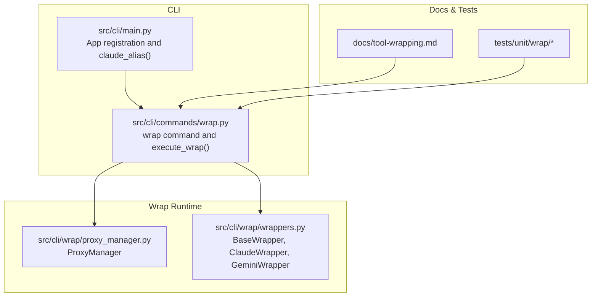
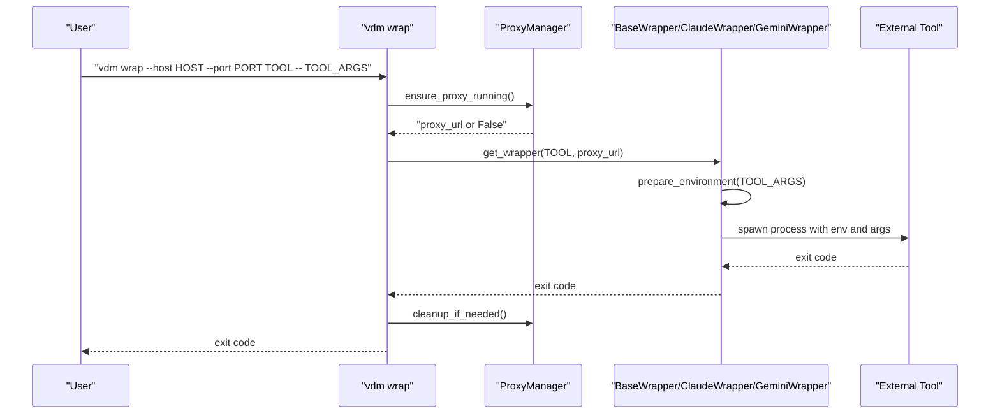
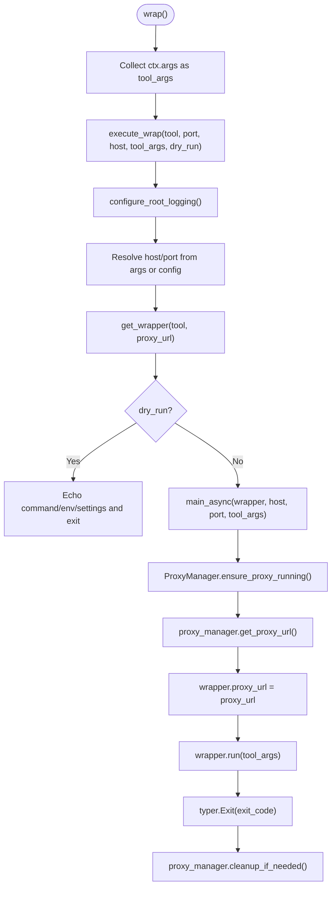
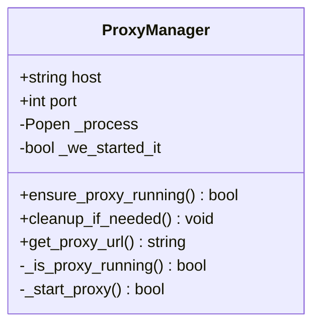
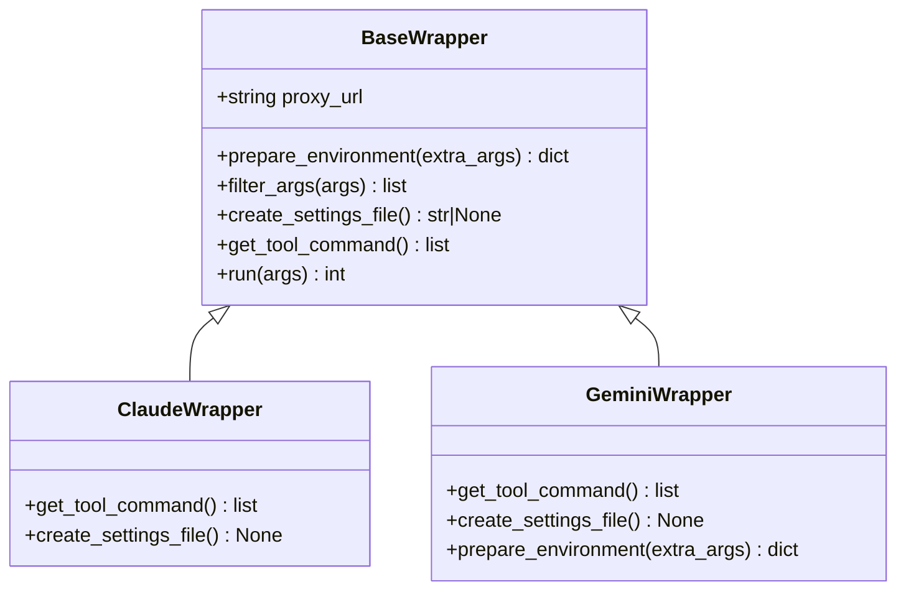
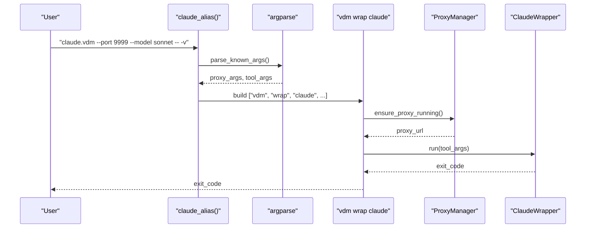
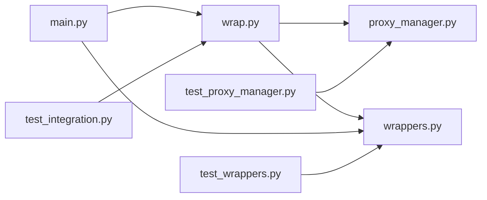

# Wrap Commands

<cite>
**Referenced Files in This Document**
- [wrap.py](file://src/cli/commands/wrap.py)
- [main.py](file://src/cli/main.py)
- [proxy_manager.py](file://src/cli/wrap/proxy_manager.py)
- [wrappers.py](file://src/cli/wrap/wrappers.py)
- [tool-wrapping.md](file://docs/tool-wrapping.md)
- [test_wrappers.py](file://tests/unit/wrap/test_wrappers.py)
- [test_proxy_manager.py](file://tests/unit/wrap/test_proxy_manager.py)
- [test_integration.py](file://tests/unit/wrap/test_integration.py)
- [claude.vdm](file://examples/claude.vdm)
- [config.py](file://src/core/config.py)
</cite>

## Table of Contents
1. [Introduction](#introduction)
2. [Project Structure](#project-structure)
3. [Core Components](#core-components)
4. [Architecture Overview](#architecture-overview)
5. [Detailed Component Analysis](#detailed-component-analysis)
6. [Dependency Analysis](#dependency-analysis)
7. [Performance Considerations](#performance-considerations)
8. [Troubleshooting Guide](#troubleshooting-guide)
9. [Conclusion](#conclusion)
10. [Appendices](#appendices)

## Introduction
This document explains how the wrap commands in the CLI tool enable seamless integration of external CLI tools (such as Claude and Gemini) through the Vandamme proxy. It covers how the wrap functionality intercepts and enhances tool execution, the argument parsing mechanism that separates proxy parameters from tool arguments, and how the system overrides proxy connection settings on a per-session basis. It also documents the claude.vdm alias implementation, common use cases for IDEs and development workflows, and provides troubleshooting guidance for command execution issues, argument parsing problems, and PATH configuration.

## Project Structure
The wrap system spans several modules:
- CLI command definition and orchestration
- Proxy lifecycle management
- Tool wrapper abstractions
- Documentation and tests

**Diagram sources**
- [main.py](file://src/cli/main.py#L13-L28)
- [wrap.py](file://src/cli/commands/wrap.py#L16-L36)
- [proxy_manager.py](file://src/cli/wrap/proxy_manager.py#L14-L22)
- [wrappers.py](file://src/cli/wrap/wrappers.py#L13-L42)
- [tool-wrapping.md](file://docs/tool-wrapping.md#L1-L216)

**Section sources**
- [main.py](file://src/cli/main.py#L13-L28)
- [wrap.py](file://src/cli/commands/wrap.py#L16-L36)
- [proxy_manager.py](file://src/cli/wrap/proxy_manager.py#L14-L22)
- [wrappers.py](file://src/cli/wrap/wrappers.py#L13-L42)
- [tool-wrapping.md](file://docs/tool-wrapping.md#L1-L216)

## Core Components
- Wrap command: Parses wrap-specific options and forwards remaining arguments to the target tool.
- ProxyManager: Ensures the proxy is running, starts it if needed, and cleans up afterward.
- Tool wrappers: Provide environment setup, command construction, and process execution for specific tools.
- claude.vdm alias: A convenience wrapper that intercepts proxy parameters and delegates to the vdm wrap command.

Key responsibilities:
- Argument separation: Only wrap-specific options are processed; all other arguments are forwarded.
- Temporary overrides: Per-session proxy host/port overrides are supported.
- Environment injection: Tools receive proxy URLs via environment variables.
- Lifecycle management: The proxy is started if absent and stopped only if wrap itself started it.

**Section sources**
- [wrap.py](file://src/cli/commands/wrap.py#L16-L36)
- [wrap.py](file://src/cli/commands/wrap.py#L39-L144)
- [proxy_manager.py](file://src/cli/wrap/proxy_manager.py#L23-L141)
- [wrappers.py](file://src/cli/wrap/wrappers.py#L13-L141)
- [main.py](file://src/cli/main.py#L36-L84)

## Architecture Overview
The wrap command orchestrates a controlled flow: parse wrap options, manage the proxy lifecycle, select a tool wrapper, inject environment variables, and execute the tool while forwarding signals.

**Diagram sources**
- [wrap.py](file://src/cli/commands/wrap.py#L113-L144)
- [proxy_manager.py](file://src/cli/wrap/proxy_manager.py#L23-L141)
- [wrappers.py](file://src/cli/wrap/wrappers.py#L43-L93)

## Detailed Component Analysis

### Wrap Command: Argument Parsing and Execution
- The wrap command is registered with Typer’s allow_extra_args to capture trailing arguments after the tool name.
- ctx.args contains only tool arguments; wrap-specific options are parsed as Typer options.
- execute_wrap configures logging, resolves host/port (with config defaults), selects a wrapper, and runs the tool asynchronously.

**Diagram sources**
- [wrap.py](file://src/cli/commands/wrap.py#L16-L36)
- [wrap.py](file://src/cli/commands/wrap.py#L39-L144)

**Section sources**
- [wrap.py](file://src/cli/commands/wrap.py#L16-L36)
- [wrap.py](file://src/cli/commands/wrap.py#L39-L144)

### Proxy Lifecycle Management
ProxyManager ensures the proxy is running and manages its lifecycle:
- Health check via HTTP GET to /health
- Start via subprocess with server start command and systemd flag
- Graceful termination and force kill fallback
- Track whether the process was started by wrap for cleanup

**Diagram sources**
- [proxy_manager.py](file://src/cli/wrap/proxy_manager.py#L14-L141)

**Section sources**
- [proxy_manager.py](file://src/cli/wrap/proxy_manager.py#L23-L141)
- [test_proxy_manager.py](file://tests/unit/wrap/test_proxy_manager.py#L17-L172)

### Tool Wrappers: Environment, Arguments, and Process Execution
BaseWrapper defines the contract for tool-specific wrappers:
- prepare_environment injects proxy URLs and placeholder keys
- filter_args allows wrappers to remove wrap-specific flags
- create_settings_file lets wrappers create temporary settings if needed
- run constructs the command, sets environment, forwards signals, and waits for completion

ClaudeWrapper and GeminiWrapper specialize environment variables and behavior:
- ClaudeWrapper avoids creating a settings file to prevent conflicts
- GeminiWrapper sets GEMINI_API_BASE_URL

**Diagram sources**
- [wrappers.py](file://src/cli/wrap/wrappers.py#L13-L141)

**Section sources**
- [wrappers.py](file://src/cli/wrap/wrappers.py#L13-L141)
- [test_wrappers.py](file://tests/unit/wrap/test_wrappers.py#L8-L133)

### claude.vdm Alias Implementation
The claude_alias function intercepts proxy parameters (--host, --port, --pid-file) and forwards the remainder to the wrapped tool. It builds a vdm wrap command with the same arguments and executes it.

**Diagram sources**
- [main.py](file://src/cli/main.py#L36-L84)
- [claude.vdm](file://examples/claude.vdm#L1-L6)

**Section sources**
- [main.py](file://src/cli/main.py#L36-L84)
- [claude.vdm](file://examples/claude.vdm#L1-L6)

### Argument Parsing Mechanism: Separating Proxy Parameters from Tool Arguments
- Typer’s allow_extra_args captures all arguments after the tool name into ctx.args.
- The wrap command treats only --port and --host as wrap-specific options; all others are forwarded as tool arguments.
- The claude.vdm alias uses argparse.parse_known_args to separate proxy parameters from tool arguments, then constructs a vdm wrap invocation with a separator to ensure proper parsing downstream.

Practical implications:
- Use -- to separate wrap options from tool arguments when invoking vdm wrap directly.
- When using claude.vdm, proxy parameters are parsed locally and forwarded to vdm wrap.

**Section sources**
- [wrap.py](file://src/cli/commands/wrap.py#L32-L36)
- [main.py](file://src/cli/main.py#L47-L71)
- [test_integration.py](file://tests/unit/wrap/test_integration.py#L88-L110)

### Overriding Proxy Connection Settings
- Temporary overrides: --host and --port override the proxy host/port for the current session.
- Configuration defaults: If not provided, host/port are taken from config and environment variables.
- Environment variables: HOST and PORT influence defaults; the proxy URL is injected into tool environments.

**Section sources**
- [wrap.py](file://src/cli/commands/wrap.py#L51-L56)
- [config.py](file://src/core/config.py#L79-L80)
- [wrappers.py](file://src/cli/wrap/wrappers.py#L19-L28)

### Examples of Wrapping Different Tools
- Claude: vdm wrap claude -- --model sonnet
- Gemini: vdm wrap gemini --port 8083
- Dry run: vdm wrap --dry-run claude -- --model sonnet

The wrapper selection is based on the tool name; currently supported tools include claude and gemini.

**Section sources**
- [wrap.py](file://src/cli/commands/wrap.py#L27-L31)
- [tool-wrapping.md](file://docs/tool-wrapping.md#L29-L70)
- [wrappers.py](file://src/cli/wrap/wrappers.py#L129-L141)

### IDE and Development Workflow Integration
- Use claude.vdm for convenient integration with editors and shells that invoke the Claude CLI directly.
- Use vdm wrap for ad-hoc sessions with custom ports or hosts.
- The proxy lifecycle is shared across terminals; use consistent ports to avoid multiple proxies.

**Section sources**
- [tool-wrapping.md](file://docs/tool-wrapping.md#L47-L70)
- [tool-wrapping.md](file://docs/tool-wrapping.md#L180-L186)

## Dependency Analysis
The wrap system exhibits clear separation of concerns:
- CLI command depends on ProxyManager and wrappers.
- ProxyManager encapsulates process and network concerns.
- Wrappers encapsulate tool-specific behavior and environment setup.
- claude_alias is a thin adapter that delegates to the vdm wrap command.

**Diagram sources**
- [wrap.py](file://src/cli/commands/wrap.py#L10-L11)
- [proxy_manager.py](file://src/cli/wrap/proxy_manager.py#L14-L22)
- [wrappers.py](file://src/cli/wrap/wrappers.py#L13-L42)
- [main.py](file://src/cli/main.py#L9-L11)
- [test_wrappers.py](file://tests/unit/wrap/test_wrappers.py#L3-L5)
- [test_proxy_manager.py](file://tests/unit/wrap/test_proxy_manager.py#L3-L8)
- [test_integration.py](file://tests/unit/wrap/test_integration.py#L3-L8)

**Section sources**
- [wrap.py](file://src/cli/commands/wrap.py#L10-L11)
- [proxy_manager.py](file://src/cli/wrap/proxy_manager.py#L14-L22)
- [wrappers.py](file://src/cli/wrap/wrappers.py#L13-L42)
- [main.py](file://src/cli/main.py#L9-L11)
- [test_wrappers.py](file://tests/unit/wrap/test_wrappers.py#L3-L5)
- [test_proxy_manager.py](file://tests/unit/wrap/test_proxy_manager.py#L3-L8)
- [test_integration.py](file://tests/unit/wrap/test_integration.py#L3-L8)

## Performance Considerations
- Proxy reuse: Multiple wrap sessions can share the same proxy instance, reducing startup overhead.
- Minimal overhead: The wrapper spawns the tool process and forwards signals; environment injection is lightweight.
- Async lifecycle: ProxyManager uses asynchronous health checks and process management to avoid blocking.

[No sources needed since this section provides general guidance]

## Troubleshooting Guide
Common issues and resolutions:
- Proxy won’t start
  - Check port availability and try a different port with --port.
  - Verify proxy configuration (API keys, base URLs).
- Unknown tool
  - Ensure the tool name is supported (claude, gemini).
- Proxy already running on a different port
  - Specify the port of the running proxy with --port.
- Connection issues
  - Confirm the proxy is healthy by curl http://127.0.0.1:8082/health.
  - Review proxy logs and API key configuration.
- PATH configuration
  - Ensure vdm and the external tools (e.g., claude) are available on PATH.
  - When using claude.vdm, confirm the script is executable and located on PATH.

**Section sources**
- [tool-wrapping.md](file://docs/tool-wrapping.md#L142-L179)
- [main.py](file://src/cli/main.py#L76-L83)

## Conclusion
The wrap system provides a robust, transparent way to integrate external CLI tools with the Vandamme proxy. By separating proxy parameters from tool arguments, managing proxy lifecycle, and injecting environment variables, it enables seamless tool usage without modifying the original tools. The claude.vdm alias simplifies daily workflows, while the underlying architecture supports extension to additional tools.

[No sources needed since this section summarizes without analyzing specific files]

## Appendices

### Appendix A: Example Invocation Patterns
- Wrap Claude with a custom port and model: vdm wrap claude --port 9999 -- --model sonnet
- Use claude.vdm with proxy overrides: claude.vdm --port 9999 --model sonnet
- Dry run to preview environment and command: vdm wrap --dry-run claude -- --model sonnet

**Section sources**
- [tool-wrapping.md](file://docs/tool-wrapping.md#L29-L70)
- [wrap.py](file://src/cli/commands/wrap.py#L27-L31)

### Appendix B: Adding Support for New Tools
Steps:
- Create a new wrapper class inheriting from BaseWrapper.
- Implement get_tool_command, prepare_environment, and optionally create_settings_file.
- Register the wrapper in get_wrapper.

**Section sources**
- [wrappers.py](file://src/cli/wrap/wrappers.py#L129-L141)
- [tool-wrapping.md](file://docs/tool-wrapping.md#L187-L216)