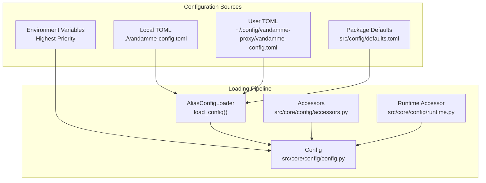
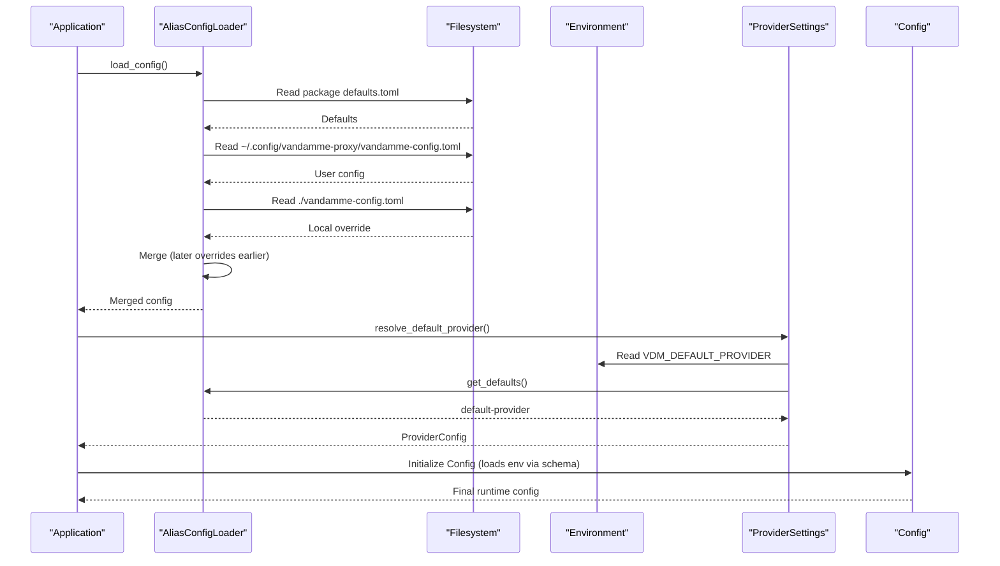
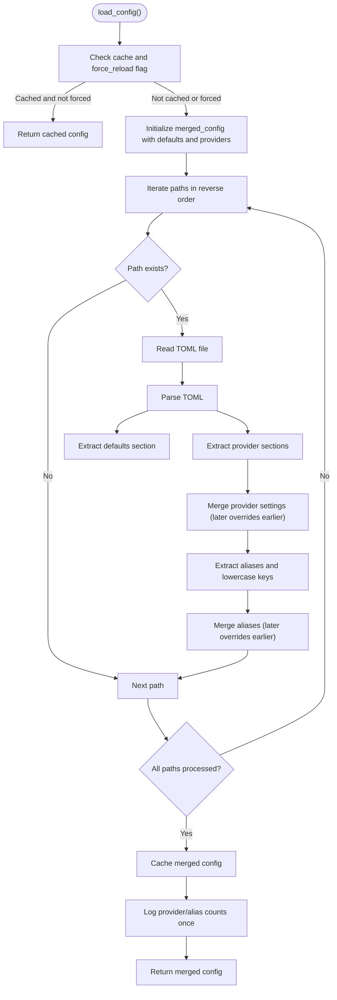
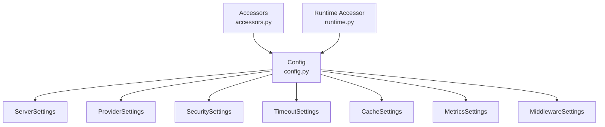
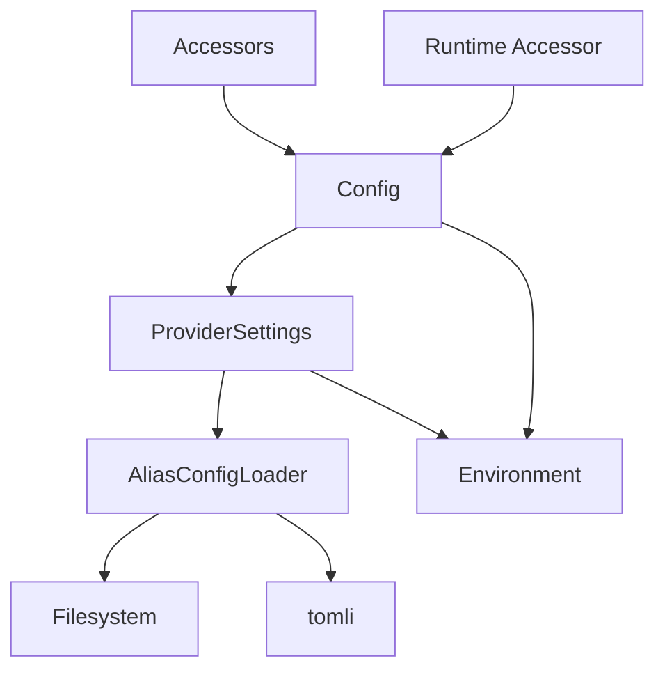

# Configuration Hierarchy

<cite>
**Referenced Files in This Document**
- [alias_config.py](file://src/core/alias_config.py)
- [defaults.toml](file://src/config/defaults.toml)
- [config.py](file://src/core/config/config.py)
- [accessors.py](file://src/core/config/accessors.py)
- [runtime.py](file://src/core/config/runtime.py)
- [providers.py](file://src/core/config/providers.py)
- [schema.py](file://src/core/config/schema.py)
- [validation.py](file://src/core/config/validation.py)
- [server.py](file://src/core/config/server.py)
- [timeouts.py](file://src/core/config/timeouts.py)
- [cache.py](file://src/core/config/cache.py)
- [metrics.py](file://src/core/config/metrics.py)
- [middleware.py](file://src/core/config/middleware.py)
- [security.py](file://src/core/config/security.py)
- [test_alias_config.py](file://tests/core/test_alias_config.py)
</cite>

## Table of Contents
1. [Introduction](#introduction)
2. [Project Structure](#project-structure)
3. [Core Components](#core-components)
4. [Architecture Overview](#architecture-overview)
5. [Detailed Component Analysis](#detailed-component-analysis)
6. [Dependency Analysis](#dependency-analysis)
7. [Performance Considerations](#performance-considerations)
8. [Troubleshooting Guide](#troubleshooting-guide)
9. [Conclusion](#conclusion)

## Introduction
This document explains the three-tiered configuration system used by the application. It covers how environment variables (highest priority), TOML configuration files (medium priority), and hardcoded defaults (lowest priority) are merged to produce the final runtime configuration. The focus is on the AliasConfigLoader’s loading order and merge strategy, the specific file paths searched, and how local project configurations override user-level settings, which in turn override package defaults. Practical examples illustrate how values are resolved and overridden, and the implications for production deployments versus development workflows.

## Project Structure
The configuration system spans several modules:
- Alias configuration loader: loads and merges TOML files from three locations and caches the result.
- Package defaults: bundled TOML with baseline provider and alias settings.
- Runtime configuration: reads environment variables and applies them on top of the merged alias configuration.
- Accessors and runtime wiring: DI-friendly accessors and FastAPI runtime accessors replace the old global singleton.

**Diagram sources**
- [alias_config.py](file://src/core/alias_config.py#L30-L39)
- [config.py](file://src/core/config/config.py#L50-L68)
- [accessors.py](file://src/core/config/accessors.py#L69-L163)
- [runtime.py](file://src/core/config/runtime.py#L19-L33)

**Section sources**
- [alias_config.py](file://src/core/alias_config.py#L30-L39)
- [defaults.toml](file://src/config/defaults.toml#L1-L89)
- [config.py](file://src/core/config/config.py#L50-L68)
- [accessors.py](file://src/core/config/accessors.py#L69-L163)
- [runtime.py](file://src/core/config/runtime.py#L19-L33)

## Core Components
- AliasConfigLoader: Loads and merges TOML configuration from three paths, with higher-priority files overriding lower-priority ones. It caches the merged configuration and logs provider/alias counts.
- Package defaults: A bundled TOML file containing provider sections and default aliases.
- Runtime Config: Reads environment variables and applies them on top of the merged alias configuration.
- Accessors and runtime wiring: DI-friendly accessors and FastAPI runtime accessors replace the old global singleton.

Key behaviors:
- Loading order: package defaults (lowest) → user config → local override (highest).
- Merge strategy: later files override earlier files for both provider settings and aliases.
- Caching: AliasConfigLoader caches the merged configuration to avoid repeated file I/O.
- Environment overrides: Environment variables take precedence over TOML for runtime settings.

**Section sources**
- [alias_config.py](file://src/core/alias_config.py#L41-L155)
- [defaults.toml](file://src/config/defaults.toml#L5-L89)
- [config.py](file://src/core/config/config.py#L50-L115)
- [accessors.py](file://src/core/config/accessors.py#L69-L163)
- [runtime.py](file://src/core/config/runtime.py#L19-L33)

## Architecture Overview
The configuration pipeline integrates environment variables, TOML files, and defaults into a unified runtime configuration. The AliasConfigLoader is responsible for merging TOML sources, while environment variables are handled in dedicated modules and the Config singleton.

**Diagram sources**
- [alias_config.py](file://src/core/alias_config.py#L41-L155)
- [providers.py](file://src/core/config/providers.py#L86-L120)
- [config.py](file://src/core/config/config.py#L50-L68)

## Detailed Component Analysis

### AliasConfigLoader: Three-Tier TOML Loading and Merge Strategy
AliasConfigLoader defines the three search paths and implements a strict override order:
- Lowest priority: package defaults (src/config/defaults.toml)
- Medium priority: user-level config (~/.config/vandamme-proxy/vandamme-config.toml)
- Highest priority: local project config (./vandamme-config.toml)

The loader iterates through the paths in reverse order so that later files override earlier ones. It extracts provider sections and aliases, normalizes alias names to lowercase, and merges provider settings and aliases into a single dictionary under “providers” and “defaults”.

Caching behavior:
- The loader caches the merged configuration in a module-level variable and logs provider/alias counts only once per process.
- A reset_cache method clears the cache for test isolation.

**Diagram sources**
- [alias_config.py](file://src/core/alias_config.py#L41-L155)

**Section sources**
- [alias_config.py](file://src/core/alias_config.py#L30-L39)
- [alias_config.py](file://src/core/alias_config.py#L75-L155)
- [alias_config.py](file://src/core/alias_config.py#L215-L224)

### Package Defaults: Baseline Configuration
The package defaults file provides baseline provider settings and aliases. It includes sections for multiple providers and their default aliases. The runtime configuration can override the default provider via environment variables.

Examples of sections and keys:
- defaults.default-provider
- provider sections (e.g., openai, poe, anthropic) with base-url, api-format, timeout, max-retries, and aliases subsections

These defaults are loaded last and thus can be overridden by user or local TOML files.

**Section sources**
- [defaults.toml](file://src/config/defaults.toml#L5-L89)

### Runtime Configuration: Environment Variables Override
The runtime configuration reads environment variables and applies them on top of the merged alias configuration. Notable behaviors:
- VDM_DEFAULT_PROVIDER overrides the default-provider from TOML.
- Provider-specific variables (e.g., {PROVIDER}_API_KEY, {PROVIDER}_BASE_URL) are read and validated.
- Other settings (HOST, PORT, LOG_LEVEL, timeouts, retries, etc.) are read from environment variables with sensible defaults.

This ensures environment variables take precedence over TOML for runtime behavior.

**Section sources**
- [config.py](file://src/core/config/config.py#L50-L115)
- [schema.py](file://src/core/config/schema.py#L50-L124)
- [validation.py](file://src/core/config/validation.py#L62-L128)

### DI Accessors and Runtime Wiring
The configuration system replaces the global singleton with DI-friendly accessors and runtime wiring:
- Accessors: Functions like log_request_metrics(), max_tokens_limit(), etc., fetch values from either FastAPI request context or a lazily created fallback Config instance.
- Runtime accessor: get_config(request) retrieves the Config instance from app state, enabling dependency injection in API endpoints.
- Config: The main Config class delegates to focused modules (server, providers, security, timeouts, cache, metrics, middleware, top_models) and lazily initializes managers.

**Diagram sources**
- [accessors.py](file://src/core/config/accessors.py#L69-L163)
- [runtime.py](file://src/core/config/runtime.py#L19-L33)
- [config.py](file://src/core/config/config.py#L50-L68)

**Section sources**
- [accessors.py](file://src/core/config/accessors.py#L25-L68)
- [accessors.py](file://src/core/config/accessors.py#L69-L163)
- [runtime.py](file://src/core/config/runtime.py#L19-L33)
- [config.py](file://src/core/config/config.py#L50-L68)

### Example Scenarios: How Values Are Resolved and Overridden
Below are practical examples derived from the test suite and configuration logic. These illustrate how the three-tier hierarchy resolves values.

- Local override overrides user config and package defaults:
  - Local TOML sets poe.base-url to a custom value and adds new aliases.
  - User TOML sets poe.base-url and a new alias.
  - Package defaults define poe.base-url and default aliases.
  - Result: local values take precedence; missing values fall back to user; missing values fall back to package defaults.

- New aliases in user config are merged:
  - Local TOML adds a new alias.
  - User TOML adds another new alias.
  - Result: both new aliases are present; local overrides existing aliases; user fills missing ones.

- Provider settings override hierarchy:
  - Local TOML sets poe.timeout.
  - User TOML sets poe.base-url.
  - Result: local timeout overrides; user base-url overrides; missing values from package defaults.

- Case-insensitive alias normalization:
  - Local TOML defines aliases with uppercase names.
  - Result: aliases are stored in lowercase.

- Invalid or malformed TOML is handled gracefully:
  - Invalid TOML is skipped; the loader continues with available files and falls back to package defaults.

These scenarios are verified by the test suite and reflect the documented merge strategy.

**Section sources**
- [test_alias_config.py](file://tests/core/test_alias_config.py#L62-L137)
- [test_alias_config.py](file://tests/core/test_alias_config.py#L178-L192)
- [test_alias_config.py](file://tests/core/test_alias_config.py#L193-L214)
- [test_alias_config.py](file://tests/core/test_alias_config.py#L215-L240)
- [test_alias_config.py](file://tests/core/test_alias_config.py#L241-L263)

## Dependency Analysis
The configuration system exhibits clear separation of concerns:
- AliasConfigLoader depends on filesystem access and TOML parsing to build a merged configuration.
- ProviderSettings depends on AliasConfigLoader for default-provider resolution and on environment variables for API keys/base URLs.
- Config depends on environment variables (via schema-based validation) and on AliasConfigLoader for default-provider resolution.
- Accessors and runtime accessor provide DI-friendly access without global imports.

**Diagram sources**
- [alias_config.py](file://src/core/alias_config.py#L14-L18)
- [providers.py](file://src/core/config/providers.py#L86-L120)
- [config.py](file://src/core/config/config.py#L50-L68)
- [accessors.py](file://src/core/config/accessors.py#L69-L163)
- [runtime.py](file://src/core/config/runtime.py#L19-L33)

**Section sources**
- [alias_config.py](file://src/core/alias_config.py#L14-L18)
- [providers.py](file://src/core/config/providers.py#L86-L120)
- [config.py](file://src/core/config/config.py#L50-L68)
- [accessors.py](file://src/core/config/accessors.py#L69-L163)
- [runtime.py](file://src/core/config/runtime.py#L19-L33)

## Performance Considerations
- Caching: AliasConfigLoader caches the merged configuration to avoid repeated file I/O. Tests confirm cache reuse and explicit cache invalidation via reset_cache.
- Lazy loading: Config delegates to focused modules and lazily initializes managers to avoid circular dependencies and reduce startup cost.
- Minimal parsing overhead: Only provider sections and defaults are processed; aliases are extracted and normalized efficiently.

Recommendations:
- Prefer environment variables for frequently changing settings to avoid file I/O.
- Keep TOML files minimal and focused to reduce parsing time.
- Use reset_cache in tests to ensure deterministic behavior.

**Section sources**
- [alias_config.py](file://src/core/alias_config.py#L22-L24)
- [alias_config.py](file://src/core/alias_config.py#L215-L224)
- [test_alias_config.py](file://tests/core/test_alias_config.py#L162-L177)

## Troubleshooting Guide
Common issues and resolutions:
- Missing tomli dependency: The loader fails fast with a clear message if tomli is unavailable. Install the dependency and retry.
- Invalid TOML files: The loader logs warnings and skips invalid files, falling back to available configurations.
- Missing aliases section: If a TOML file lacks an aliases section, the loader continues and uses defaults.
- Malformed aliases: Non-string targets are ignored; ensure aliases map to valid string values.
- Case sensitivity: Aliases are normalized to lowercase; ensure environment variables use uppercase names consistently.
- Cache staleness: Use reset_cache in tests or force reload to refresh configuration.

**Section sources**
- [alias_config.py](file://src/core/alias_config.py#L57-L74)
- [alias_config.py](file://src/core/alias_config.py#L138-L140)
- [test_alias_config.py](file://tests/core/test_alias_config.py#L178-L192)
- [test_alias_config.py](file://tests/core/test_alias_config.py#L215-L240)
- [alias_config.py](file://src/core/alias_config.py#L215-L224)

## Conclusion
The configuration hierarchy provides a robust, layered approach to managing application settings:
- Environment variables take highest priority for runtime behavior.
- TOML files provide structured, portable configuration with a clear override order.
- Package defaults ensure sensible defaults when no user configuration is present.
- The AliasConfigLoader enforces a predictable merge strategy, and caching improves performance.
- DI accessors and runtime wiring replace the global singleton, improving testability and modularity.

This design supports flexible development workflows (local overrides) and production deployments (environment-driven configuration) while maintaining reliability and clarity.