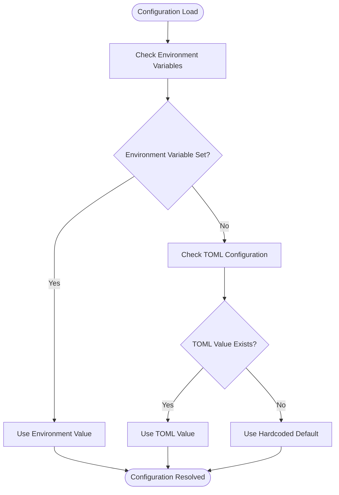
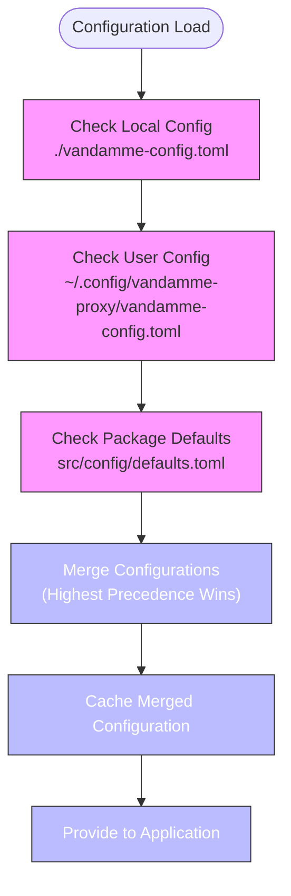
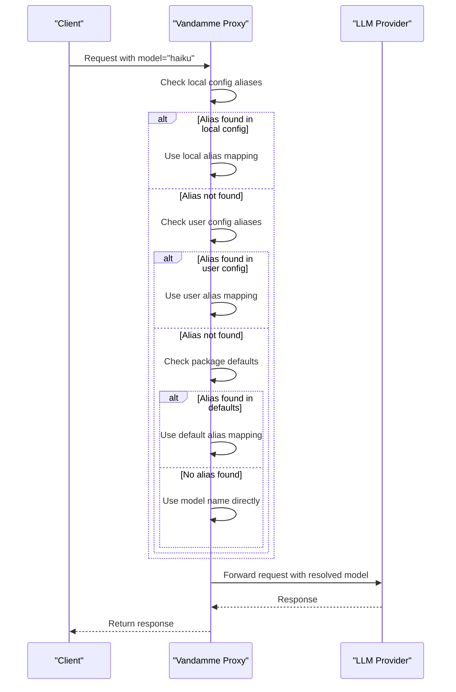
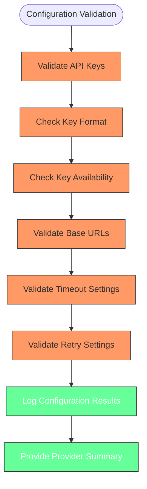

# Configuration

<cite>
**Referenced Files in This Document**   
- [config.py](file://src/core/config.py)
- [defaults.toml](file://src/config/defaults.toml)
- [multi-api-keys.md](file://docs/multi-api-keys.md)
- [fallback-aliases.md](file://docs/fallback-aliases.md)
- [provider_config.py](file://src/core/provider_config.py)
- [alias_config.py](file://src/core/alias_config.py)
- [provider_manager.py](file://src/core/provider_manager.py)
- [alias_manager.py](file://src/core/alias_manager.py)
- [alias_service.py](file://src/api/services/alias_service.py)
</cite>

## Table of Contents
1. [Introduction](#introduction)
2. [Configuration Hierarchy and Precedence](#configuration-hierarchy-and-precedence)
3. [Environment Variables](#environment-variables)
4. [TOML Configuration Files](#toml-configuration-files)
5. [Advanced Configuration Topics](#advanced-configuration-topics)
6. [Configuration Validation and Debugging](#configuration-validation-and-debugging)
7. [Conclusion](#conclusion)

## Introduction

The Vandamme Proxy configuration system implements a hierarchical model that combines environment variables, TOML configuration files, and hardcoded defaults to provide flexible and robust configuration management. This system enables users to customize their proxy behavior through multiple layers of configuration, with clear precedence rules determining which values take effect. The configuration governs critical aspects such as provider selection, API key management, routing rules, and performance settings, allowing for both simple setups and complex multi-provider scenarios.

The system follows a cascading configuration approach where environment variables have the highest precedence, followed by TOML configuration files, with hardcoded defaults serving as the foundation. This design allows users to override settings at different levels of specificity, from global defaults to project-specific configurations. The configuration is loaded at startup and made available throughout the application via a singleton pattern, ensuring consistent access to configuration values across all components.

**Section sources**
- [config.py](file://src/core/config.py#L15-L285)
- [provider_manager.py](file://src/core/provider_manager.py#L29-L586)

## Configuration Hierarchy and Precedence

The Vandamme Proxy configuration system follows a well-defined hierarchy that determines how configuration values are resolved. This hierarchy ensures predictable behavior and allows users to override settings at different levels of specificity. The precedence order, from highest to lowest, is: environment variables, TOML configuration files, and hardcoded defaults.

The configuration loading process begins with the `Config` class in `src/core/config.py`, which orchestrates the loading of configuration values from multiple sources. When the application starts, it first checks for the `VDM_DEFAULT_PROVIDER` environment variable to determine the default provider. If this variable is not set, it attempts to load the default provider from the TOML configuration file. Only if both of these sources are unavailable does it fall back to the hardcoded default of "openai".

For provider-specific settings, the system follows a similar pattern. When loading provider configurations in `ProviderManager`, it first checks environment variables, then TOML configuration files, and finally applies hardcoded defaults. This is evident in the `_load_provider_config_with_result` method, which explicitly checks environment variables first, then TOML configuration, and only uses defaults as a last resort. This approach ensures that users can override any setting through environment variables, making it easy to customize behavior without modifying configuration files.



**Diagram sources **
- [config.py](file://src/core/config.py#L15-L285)
- [provider_manager.py](file://src/core/provider_manager.py#L244-L321)

**Section sources**
- [config.py](file://src/core/config.py#L15-L285)
- [provider_manager.py](file://src/core/provider_manager.py#L244-L321)

## Environment Variables

Environment variables provide the highest precedence in the Vandamme Proxy configuration system, allowing users to override settings defined in configuration files. These variables control critical aspects of the proxy's behavior, including provider selection, API key management, and performance settings. The system uses a consistent naming convention where provider-specific variables are prefixed with the provider name in uppercase, followed by the setting name.

Key environment variables include `OPENAI_API_KEY`, `ANTHROPIC_API_KEY`, and `VDMS_DEFAULT_PROVIDER`, which determine the API keys for different providers and the default provider to use. Security implications are significant, as these variables contain sensitive authentication credentials that should be protected from unauthorized access. The system validates API keys through basic format checks, such as verifying that OpenAI keys start with "sk-", but relies on the underlying provider APIs for comprehensive authentication.

Other important environment variables include `LOG_LEVEL` for controlling verbosity, `PORT` for specifying the listening port, and `REQUEST_TIMEOUT` for setting request timeout durations. Custom headers can be defined using variables prefixed with `CUSTOM_HEADER_`, which are automatically converted to HTTP header format. The system also supports provider-specific custom headers using the pattern `{PROVIDER}_CUSTOM_HEADER_*`, allowing for fine-grained control over HTTP requests to different providers.

```mermaid
classDiagram
class EnvironmentVariables {
+OPENAI_API_KEY : str
+ANTHROPIC_API_KEY : str
+VDMS_DEFAULT_PROVIDER : str
+LOG_LEVEL : str
+PORT : int
+REQUEST_TIMEOUT : int
+CUSTOM_HEADER_* : str
+{PROVIDER}_CUSTOM_HEADER_* : str
}
class Config {
+default_provider : str
+openai_api_key : str
+proxy_api_key : str
+base_url : str
+host : str
+port : int
+log_level : str
}
class ProviderConfig {
+name : str
+api_key : str
+base_url : str
+api_keys : list[str]
+timeout : int
+max_retries : int
+custom_headers : dict[str, str]
}
EnvironmentVariables --> Config : "populates"
EnvironmentVariables --> ProviderConfig : "populates"
Config --> ProviderConfig : "uses for initialization"
```

**Diagram sources **
- [config.py](file://src/core/config.py#L15-L285)
- [provider_config.py](file://src/core/provider_config.py#L7-L102)

**Section sources**
- [config.py](file://src/core/config.py#L15-L285)
- [provider_config.py](file://src/core/provider_config.py#L7-L102)

## TOML Configuration Files

The TOML configuration system in Vandamme Proxy provides a structured way to define provider settings, model aliases, and routing rules. The primary configuration file, `src/config/defaults.toml`, contains default values for all supported providers, including OpenAI, Poe, OpenRouter, Z.AI, Kimi, and Anthropic. Each provider section defines settings such as base URL, API format, timeout, and retry limits, along with provider-specific aliases that map common model names to actual provider models.

The configuration system supports a hierarchical file structure with three levels of precedence: local project configuration (`./vandamme-config.toml`), user-specific configuration (`~/.config/vandamme-proxy/vandamme-config.toml`), and package defaults (`src/config/defaults.toml`). This allows for flexible configuration management, where project-specific settings can override user preferences, which in turn override system defaults. The `AliasConfigLoader` class manages this hierarchy, loading and merging configurations from all available files in order of increasing precedence.

Provider definitions in the TOML files include both connection settings and model aliases. For example, the Poe provider configuration includes aliases that map "haiku" to "gpt-5.1-mini", "sonnet" to "gpt-5.1-codex-mini", and "opus" to "gpt-5.1-codex-max". These aliases enable users to use consistent model names across different providers, simplifying client configuration. The system also supports advanced features like tool name sanitization for the Kimi provider, which can be enabled through the configuration file.



**Diagram sources **
- [defaults.toml](file://src/config/defaults.toml#L1-L89)
- [alias_config.py](file://src/core/alias_config.py#L27-L224)

**Section sources**
- [defaults.toml](file://src/config/defaults.toml#L1-L89)
- [alias_config.py](file://src/core/alias_config.py#L27-L224)

## Advanced Configuration Topics

Vandamme Proxy supports several advanced configuration scenarios that enable sophisticated routing and failover strategies. The multi-API-key feature allows users to configure multiple API keys per provider, enabling load balancing and automatic failover. This is particularly useful for production deployments where high availability and rate limit management are critical. Keys are specified as whitespace-separated values in the environment variable, and the system uses a round-robin rotation strategy to distribute requests across the available keys.

The fallback aliases system provides intelligent defaults for model names, ensuring that common model identifiers like "haiku", "sonnet", and "opus" work across different providers even when exact matches don't exist. This system follows a clear priority order: local project configuration takes precedence over user configuration, which in turn overrides package defaults. When a model request is made, the system first checks for exact alias matches, then applies provider prefixes, and finally resolves to actual models using the configured aliases.

Custom TOML configurations enable complex routing scenarios by defining provider-specific settings and aliases. For example, a configuration might route "haiku" requests to different models depending on the provider, allowing for optimized performance and cost management. The system also supports passthrough mode, where client-provided API keys are forwarded to the upstream provider, enabling scenarios where the proxy acts as a transparent gateway. However, it's important to note that passthrough mode cannot be mixed with static keys for the same provider, as this would create ambiguous configuration states.



**Diagram sources **
- [multi-api-keys.md](file://docs/multi-api-keys.md#L1-L272)
- [fallback-aliases.md](file://docs/fallback-aliases.md#L1-L304)
- [alias_manager.py](file://src/core/alias_manager.py#L167-L634)

**Section sources**
- [multi-api-keys.md](file://docs/multi-api-keys.md#L1-L272)
- [fallback-aliases.md](file://docs/fallback-aliases.md#L1-L304)
- [alias_manager.py](file://src/core/alias_manager.py#L167-L634)

## Configuration Validation and Debugging

The Vandamme Proxy includes comprehensive configuration validation and debugging capabilities to help users identify and resolve misconfigurations. When the application starts, it performs validation on all provider configurations, checking for required fields like API keys and base URLs. If a provider is configured but lacks essential settings, the system logs appropriate warnings or errors, helping users quickly identify configuration issues.

Debugging is facilitated through detailed logging that shows the configuration loading process, including which files were loaded and what values were applied. The system logs provider and alias information at startup, showing the total number of providers and aliases loaded. For multi-API-key configurations, the logs include information about key rotation, showing which key was used for each request and when rotation occurs due to authentication failures.

The proxy also includes health check endpoints that can be used to verify the status of configured providers. These endpoints test connectivity to each provider and report on their availability, helping users identify issues with API keys or network connectivity. Additionally, the system provides a provider summary that lists all active providers, their API key hashes (for security), and base URLs, giving users a clear overview of the current configuration state.



**Diagram sources **
- [config.py](file://src/core/config.py#L15-L285)
- [provider_manager.py](file://src/core/provider_manager.py#L510-L580)
- [alias_service.py](file://src/api/services/alias_service.py#L65-L211)

**Section sources**
- [config.py](file://src/core/config.py#L15-L285)
- [provider_manager.py](file://src/core/provider_manager.py#L510-L580)
- [alias_service.py](file://src/api/services/alias_service.py#L65-L211)

## Conclusion

The Vandamme Proxy configuration system provides a robust and flexible framework for managing LLM provider settings, routing rules, and performance parameters. By combining environment variables, TOML configuration files, and hardcoded defaults in a well-defined hierarchy, the system offers both simplicity for basic use cases and sophistication for complex deployment scenarios. The multi-layered approach allows users to customize behavior at different levels of specificity, from global defaults to project-specific overrides.

Key strengths of the configuration system include its support for multiple API keys per provider, intelligent fallback aliases, and comprehensive validation and debugging capabilities. These features enable high availability, cost optimization, and ease of use across different deployment environments. The system's design follows established patterns for configuration management, making it intuitive for users familiar with similar systems while providing advanced capabilities for power users.

As the system continues to evolve, opportunities exist to enhance configuration management further, such as adding support for dynamic configuration reloading, more sophisticated routing rules, and improved security features for API key management. However, the current implementation provides a solid foundation that balances flexibility, reliability, and ease of use.