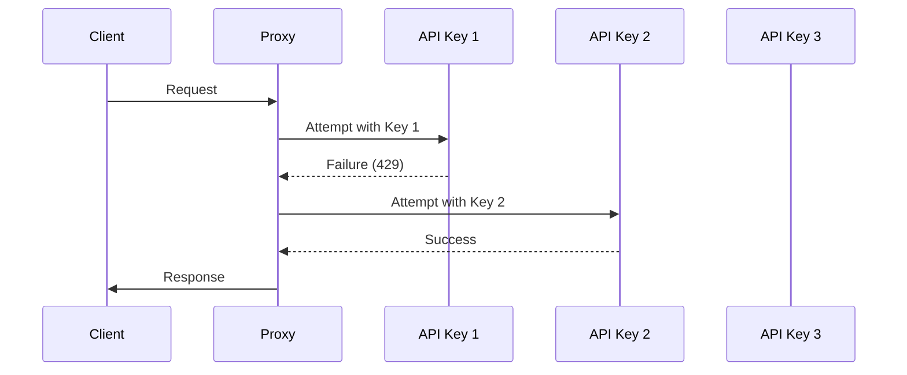
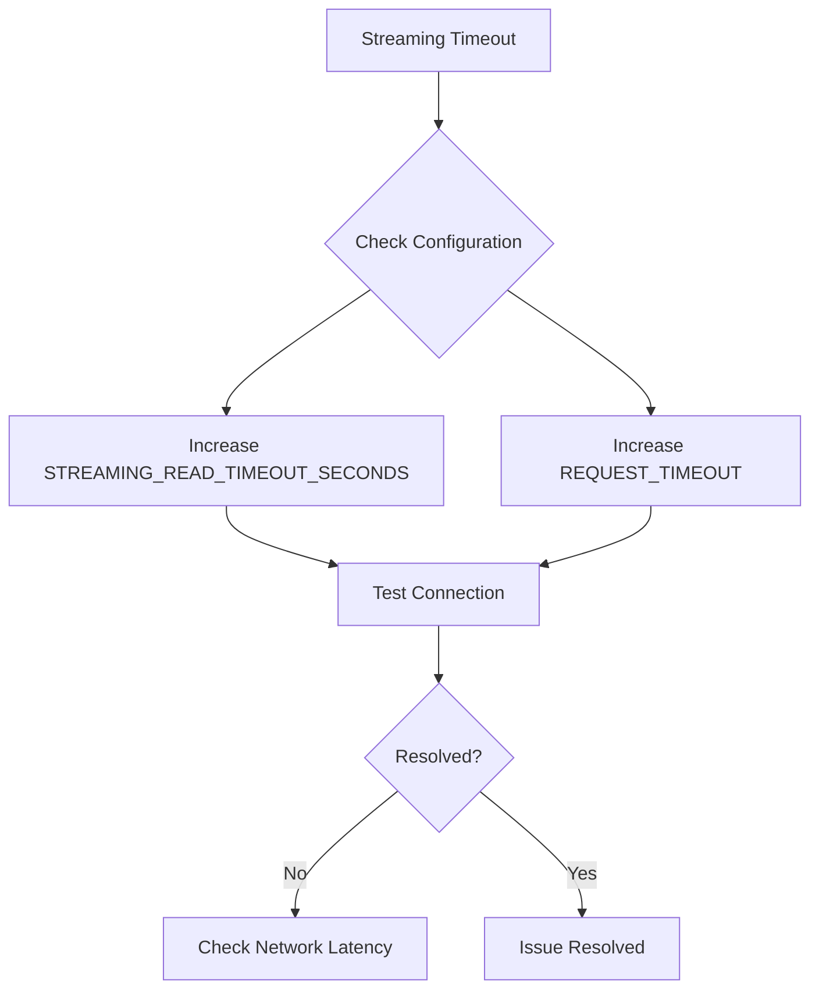

# Environment Variables

<cite>
**Referenced Files in This Document**   
- [.env.example](file://.env.example)
- [src/config/defaults.toml](file://src/config/defaults.toml)
- [src/core/config.py](file://src/core/config.py)
- [src/core/provider_manager.py](file://src/core/provider_manager.py)
- [src/api/services/key_rotation.py](file://src/api/services/key_rotation.py)
- [src/core/provider_config.py](file://src/core/provider_config.py)
- [src/api/services/streaming.py](file://src/api/services/streaming.py)
- [src/core/anthropic_client.py](file://src/core/anthropic_client.py)
- [src/core/alias_manager.py](file://src/core/alias_manager.py)
- [CLAUDE.md](file://CLAUDE.md)
- [src/cli/commands/config.py](file://src/cli/commands/config.py)
</cite>

## Table of Contents
1. [Introduction](#introduction)
2. [Core Environment Variables](#core-environment-variables)
3. [Provider Configuration](#provider-configuration)
4. [Multi-API-Key Configuration](#multi-api-key-configuration)
5. [Custom Headers](#custom-headers)
6. [Advanced Configuration](#advanced-configuration)
7. [Practical Examples](#practical-examples)
8. [Troubleshooting Guide](#troubleshooting-guide)

## Introduction
The Vandamme Proxy uses environment variables for configuration, enabling flexible deployment across different environments. This document details all supported environment variables, their purposes, security implications, and advanced configuration options. The proxy supports multiple providers, load balancing, failover mechanisms, and custom header injection, making it a versatile solution for routing AI model requests.

**Section sources**
- [.env.example](file://.env.example#L1-L152)
- [src/core/config.py](file://src/core/config.py#L1-L285)

## Core Environment Variables

### VDM_DEFAULT_PROVIDER
Specifies the default provider to use when no provider prefix is included in the model name. This variable overrides the default_provider setting from src/config/defaults.toml.

**Purpose**: Determines which AI provider handles requests without explicit provider prefixes.

**Security Implications**: Setting this variable exposes which provider is used by default. Ensure this aligns with your organization's security policies.

**Section sources**
- [.env.example](file://.env.example#L13-L17)
- [src/core/config.py](file://src/core/config.py#L19-L24)

### OPENAI_API_KEY
The API key for OpenAI services. This can be a single key or multiple keys separated by spaces for load balancing and failover.

**Purpose**: Authenticates requests to OpenAI's API.

**Security Implications**: This is a sensitive credential. Never commit this to version control. Use environment variables or secret management systems.

**Section sources**
- [.env.example](file://.env.example#L1-L7)
- [src/core/config.py](file://src/core/config.py#L50-L52)

### PROXY_API_KEY
An optional expected proxy API key for client validation.

**Purpose**: If set, clients must provide this exact API key to access the proxy, adding an additional layer of security.

**Security Implications**: This provides authentication at the proxy level, preventing unauthorized access to your proxy instance.

**Section sources**
- [.env.example](file://.env.example#L9-L11)
- [src/core/config.py](file://src/core/config.py#L64)

### PORT and HOST
Configure the server's network binding.

**Purpose**: 
- **PORT**: Specifies the port number the server listens on (default: 8082)
- **HOST**: Specifies the network interface to bind to (default: 0.0.0.0)

**Security Implications**: Binding to 0.0.0.0 makes the service accessible from any network interface. For production, consider binding to specific interfaces or using reverse proxies.

**Section sources**
- [.env.example](file://.env.example#L129-L130)
- [src/core/config.py](file://src/core/config.py#L79-L80)

### LOG_LEVEL
Sets the logging verbosity level.

**Purpose**: Controls the amount of information logged by the application. Valid values are DEBUG, INFO, WARNING, ERROR, and CRITICAL.

**Security Implications**: Higher log levels may expose sensitive information. Use DEBUG only in development environments.

**Section sources**
- [.env.example](file://.env.example#L131-L132)
- [src/core/config.py](file://src/core/config.py#L81)

## Provider Configuration

### Provider Discovery Mechanism
Providers are discovered based on environment variables. Only providers with {PROVIDER}_API_KEY set are loaded.

**Rules**:
- Providers without API keys are silently ignored
- For OpenAI and Poe, BASE_URL defaults to standard endpoints if not provided
- Other providers require both API_KEY and BASE_URL to be configured

```mermaid
flowchart TD
A[Environment Variable Check] --> B{Has {PROVIDER}_API_KEY?}
B --> |Yes| C[Load Provider Configuration]
B --> |No| D[Ignore Provider]
C --> E{Has BASE_URL?}
E --> |No| F[Use Default URL]
E --> |Yes| G[Use Custom URL]
```

**Diagram sources**
- [.env.example](file://.env.example#L26-L30)
- [src/core/provider_manager.py](file://src/core/provider_manager.py#L145-L177)

### Provider-Specific Variables
The proxy supports various providers through specific environment variables:

#### POE_API_KEY
API key for Poe.com integration.

**Purpose**: Authenticates requests to Poe's API.

**Section sources**
- [.env.example](file://.env.example#L34-L38)

#### AZURE_OPENAI_API_KEY
API key for Azure OpenAI services.

**Purpose**: Authenticates requests to Azure OpenAI.

**Section sources**
- [.env.example](file://.env.example#L48-L52)

## Multi-API-Key Configuration

### Load Balancing and Failover
The proxy supports multiple API keys for high availability and load distribution.

**Implementation**:
- Keys are tried in round-robin order
- Automatic rotation on authentication failures (401/403/429)
- Failed keys are temporarily skipped



**Diagram sources**
- [.env.example](file://.env.example#L5-L8)
- [src/api/services/key_rotation.py](file://src/api/services/key_rotation.py#L14-L32)

### Key Rotation Logic
The key rotation system is implemented in the make_next_provider_key_fn function.

**Process**:
1. Client makes a request
2. Proxy attempts with the current key
3. If the key fails with 401, 403, or 429, it's added to the exclude set
4. Proxy requests the next viable key from the rotation system
5. Process continues until a working key is found or all keys are exhausted

**Section sources**
- [src/api/services/key_rotation.py](file://src/api/services/key_rotation.py#L14-L70)
- [src/core/provider_config.py](file://src/core/provider_config.py#L83-L101)

## Custom Headers

### CUSTOM_HEADER_* Processing
The proxy processes environment variables starting with CUSTOM_HEADER_ to inject custom HTTP headers.

**Transformation Rules**:
- Remove 'CUSTOM_HEADER_' prefix
- Convert underscores to hyphens
- Use the resulting string as the header name

**Example**:
- CUSTOM_HEADER_X_API_KEY becomes X-API-Key header


**Diagram sources**
- [.env.example](file://.env.example#L141-L151)
- [src/core/config.py](file://src/core/config.py#L246-L261)
- [src/cli/commands/config.py](file://src/cli/commands/config.py#L93-L97)

### Provider-Specific Custom Headers
Headers can be configured for specific providers using {PROVIDER}_CUSTOM_HEADER_{HEADER_NAME}.

**Purpose**: Allows different providers to have different authentication or metadata requirements.

**Example**:
- POE_CUSTOM_HEADER_X_USER_ID="your-poe-user-id"
- AZURE_OPENAI_CUSTOM_HEADER_API_KEY="your-azure-api-key"

**Section sources**
- [.env.example](file://.env.example#L103-L110)
- [src/core/provider_manager.py](file://src/core/provider_manager.py#L385-L399)

## Advanced Configuration

### Streaming Timeouts
Configure timeouts for streaming requests.

#### STREAMING_READ_TIMEOUT_SECONDS
Controls the read timeout for streaming SSE (Server-Sent Events) requests.

**Purpose**: Prevents hanging connections during long streaming responses.

**Default**: None (no timeout), which is recommended for SSE.

**Section sources**
- [CLAUDE.md](file://CLAUDE.md#L334-L336)
- [src/core/config.py](file://src/core/config.py#L90-L93)
- [src/core/anthropic_client.py](file://src/core/anthropic_client.py#L52-L78)

#### STREAMING_CONNECT_TIMEOUT_SECONDS
Controls the connection timeout for streaming requests.

**Purpose**: Limits the time to establish a connection with the upstream provider.

**Default**: 30 seconds

**Section sources**
- [CLAUDE.md](file://CLAUDE.md#L338)
- [src/core/config.py](file://src/core/config.py#L94-L96)

### Alias Chain Limits
Control the maximum length of alias chains.

#### ALIAS_MAX_CHAIN_LENGTH
Sets the maximum number of alias resolution steps.

**Purpose**: Prevents infinite loops in alias resolution and controls complexity.

**Default**: 10

**Section sources**
- [src/core/config.py](file://src/core/config.py#L136-L138)
- [src/core/alias_manager.py](file://src/core/alias_manager.py#L579-L633)

## Practical Examples

### Production-Ready Configuration
The following example from .env.example shows a production-ready configuration:

```env
# Multiple API keys for load balancing
OPENAI_API_KEY="sk-key1 sk-key2 sk-key3"

# Provider-specific configurations
POE_API_KEY="poe-key1 poe-key2 poe-backup"
AZURE_OPENAI_API_KEY="azure-key1 azure-key2"

# Global custom headers
CUSTOM_HEADER_X_API_KEY="your-api-key"
CUSTOM_HEADER_X_CLIENT_ID="your-client-id"

# Server settings
HOST="0.0.0.0"
PORT="8082"
LOG_LEVEL="INFO"
```

**Section sources**
- [.env.example](file://.env.example#L1-L152)

### Multi-Provider Configuration
The multi-provider.env example demonstrates configuring multiple providers:

```env
# OpenAI Provider
OPENAI_API_KEY=sk-openai-...
OPENAI_BASE_URL=https://api.openai.com/v1

# Anthropic Direct Provider
ANTHROPIC_API_KEY=sk-ant-...
ANTHROPIC_BASE_URL=https://api.anthropic.com

# AWS Bedrock Provider
BEDROCK_API_KEY=your-aws-key
BEDROCK_BASE_URL=https://bedrock-runtime.us-west-2.amazonaws.com
```

**Section sources**
- [examples/multi-provider.env](file://examples/multi-provider.env#L1-L48)

## Troubleshooting Guide

### Missing API Keys
**Symptoms**: Provider not available, authentication errors.

**Solution**: Ensure the appropriate {PROVIDER}_API_KEY environment variable is set and exported.

**Section sources**
- [src/core/provider_manager.py](file://src/core/provider_manager.py#L162-L177)

### Incorrect Base URLs
**Symptoms**: Connection errors, 404 responses.

**Solution**: Verify the {PROVIDER}_BASE_URL matches the provider's API endpoint.

**Section sources**
- [.env.example](file://.env.example#L19-L21)

### Streaming Timeouts
**Symptoms**: Prematurely terminated streaming responses.

**Solution**: Adjust STREAMING_READ_TIMEOUT_SECONDS and REQUEST_TIMEOUT values.



**Diagram sources**
- [src/api/services/streaming.py](file://src/api/services/streaming.py#L127-L156)
- [CLAUDE.md](file://CLAUDE.md#L334-L336)