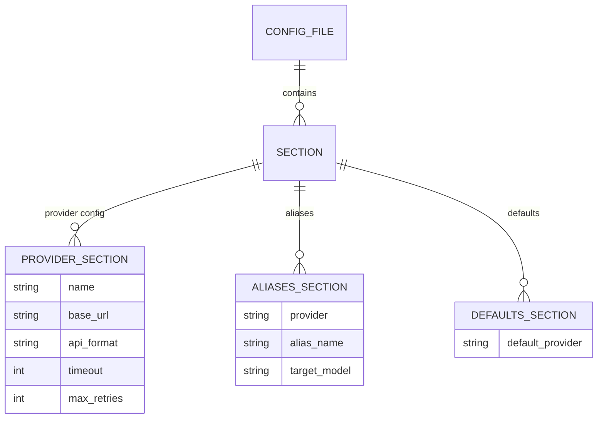
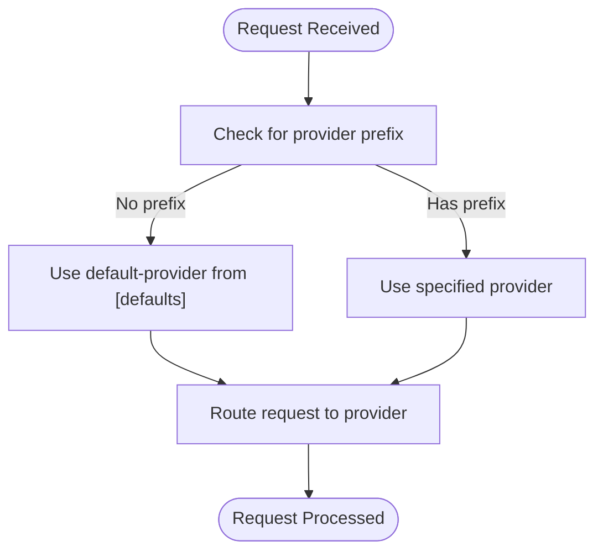
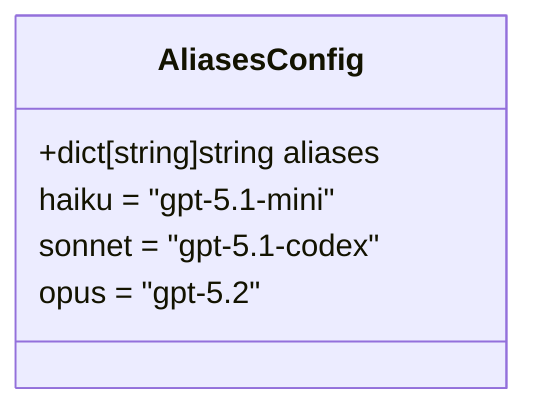
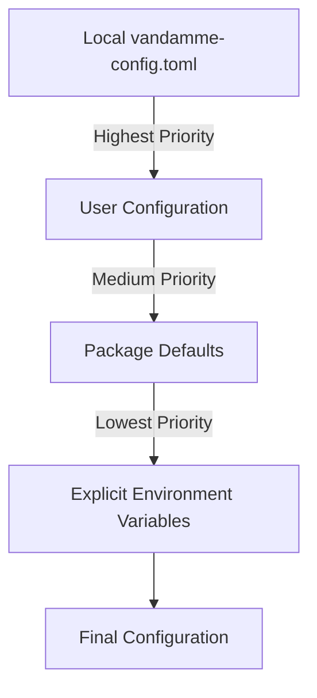
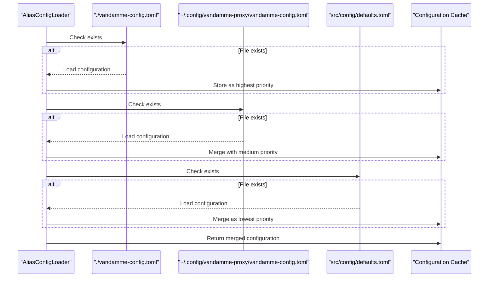

# TOML Configuration

<cite>
**Referenced Files in This Document**   
- [vandamme-config.toml](file://vandamme-config.toml)
- [src/config/defaults.toml](file://src/config/defaults.toml)
- [src/core/alias_config.py](file://src/core/alias_config.py)
- [src/core/config.py](file://src/core/config.py)
- [src/core/provider_config.py](file://src/core/provider_config.py)
- [config/top-models/programming.toml](file://config/top-models/programming.toml)
</cite>

## Table of Contents
1. [Introduction](#introduction)
2. [TOML Configuration Structure](#toml-configuration-structure)
3. [Provider Configuration](#provider-configuration)
4. [Defaults Section](#defaults-section)
5. [Nested Aliases Configuration](#nested-aliases-configuration)
6. [Fallback Alias System](#fallback-alias-system)
7. [Configuration Hierarchy and Loading](#configuration-hierarchy-and-loading)
8. [Environment Variables Interaction](#environment-variables-interaction)
9. [Complex Configuration Examples](#complex-configuration-examples)
10. [Custom Configuration for Deployment Environments](#custom-configuration-for-deployment-environments)
11. [Best Practices](#best-practices)

## Introduction

The Vandamme Proxy system uses TOML configuration files to define provider settings, default values, and model aliases. This documentation provides comprehensive guidance on configuring the system through TOML files, with a focus on the vandamme-config.toml file and its interaction with the defaults.toml configuration. The configuration system enables flexible provider routing, model aliasing, and fallback mechanisms that simplify working with multiple LLM providers while maintaining consistency in model naming conventions.

**Section sources**
- [vandamme-config.toml](file://vandamme-config.toml#L1-L44)
- [src/config/defaults.toml](file://src/config/defaults.toml#L1-L89)

## TOML Configuration Structure

The TOML configuration system in Vandamme Proxy follows a hierarchical structure with distinct sections for different configuration aspects. The primary configuration file, vandamme-config.toml, supports three main types of sections: provider configurations, provider-specific aliases, and provider settings.



**Diagram sources**
- [vandamme-config.toml](file://vandamme-config.toml#L1-L44)
- [src/config/defaults.toml](file://src/config/defaults.toml#L1-L89)

The configuration structure allows for both simple and complex setups, from basic provider configuration to sophisticated alias chaining across multiple providers. Each section serves a specific purpose in the overall configuration hierarchy, enabling fine-grained control over provider behavior and model routing.

**Section sources**
- [vandamme-config.toml](file://vandamme-config.toml#L1-L44)
- [src/config/defaults.toml](file://src/config/defaults.toml#L1-L89)

## Provider Configuration

Provider configuration sections in TOML files define the settings for specific LLM providers. Each provider section uses the provider name as its identifier (e.g., [poe], [openai]) and contains key-value pairs for various configuration options.

```mermaid
classDiagram
class ProviderConfig {
+string name
+string base_url
+string api_format
+int timeout
+int max_retries
+dict custom_headers
+bool tool_name_sanitization
}
ProviderConfig : base-url = "https : //api.poe.com/v1"
ProviderConfig : api-format = "openai"
ProviderConfig : timeout = 90
ProviderConfig : max-retries = 2
```

**Diagram sources**
- [vandamme-config.toml](file://vandamme-config.toml#L13-L18)
- [src/config/defaults.toml](file://src/config/defaults.toml#L12-L15)

The key provider configuration options include:

- **base-url**: The API endpoint URL for the provider
- **api-format**: The API format used by the provider ("openai" or "anthropic")
- **timeout**: Request timeout in seconds
- **max-retries**: Maximum number of retry attempts for failed requests
- **custom_headers**: Additional headers to include in requests
- **tool-name-sanitization**: Whether to sanitize tool names in requests

These settings can be configured for each provider independently, allowing for customized behavior based on the specific requirements of each LLM service. The configuration system supports multiple providers simultaneously, enabling seamless switching between different services.

**Section sources**
- [vandamme-config.toml](file://vandamme-config.toml#L13-L18)
- [src/config/defaults.toml](file://src/config/defaults.toml#L12-L15)
- [src/core/provider_config.py](file://src/core/provider_config.py#L7-L32)

## Defaults Section

The defaults section in the TOML configuration provides system-wide default values that apply when more specific configurations are not available. This section is defined using the [defaults] header and contains key configuration options that influence the overall behavior of the proxy system.

```toml
[defaults]
default-provider = "poe"
```

The defaults section supports the following configuration options:

- **default-provider**: Specifies the default provider to use when no provider is explicitly specified in a request. This can be overridden by the VDM_DEFAULT_PROVIDER environment variable.

The defaults section serves as the foundation for the configuration hierarchy, providing sensible fallback values that ensure the system functions correctly even with minimal configuration. When a provider is not explicitly specified in a request, the system uses the default provider specified in this section.



**Diagram sources**
- [src/config/defaults.toml](file://src/config/defaults.toml#L5-L8)
- [src/core/config.py](file://src/core/config.py#L15-L48)

The defaults section is particularly important for user experience, as it allows users to work with familiar model names (like "haiku", "sonnet", "opus") without needing to specify the provider each time. The system automatically routes these requests to the default provider configured in this section.

**Section sources**
- [src/config/defaults.toml](file://src/config/defaults.toml#L5-L8)
- [src/core/config.py](file://src/core/config.py#L15-L48)

## Nested Aliases Configuration

The nested aliases configuration allows for sophisticated model routing through provider-specific alias sections. These sections are defined using the pattern [provider.aliases] and contain mappings from alias names to target models.



**Diagram sources**
- [vandamme-config.toml](file://vandamme-config.toml#L1-L8)
- [src/config/defaults.toml](file://src/config/defaults.toml#L16-L19)

The aliases configuration supports several advanced features:

- **Cross-provider references**: Aliases can reference models from other providers using the format "provider:alias"
- **Chained resolution**: Aliases can point to other aliases, creating chains that are resolved recursively
- **Case-insensitive matching**: Alias resolution is case-insensitive
- **Substring matching**: Partial matches are supported for flexible alias resolution

For example, in the vandamme-config.toml file, the poe.aliases section includes:
```toml
[poe.aliases]
haiku = "zai:haiku"
sonnet = "zai:sonnet"
opus = "gpt-5.1-codex-max"
```

This configuration demonstrates cross-provider referencing, where the "haiku" and "sonnet" aliases for the Poe provider point to models from the Z.AI provider. This enables sophisticated routing strategies where requests for certain model types are automatically directed to the most appropriate provider.

The system also supports complex alias chains, allowing for multi-step resolution paths. For instance, an alias might resolve through several intermediate steps before reaching the final target model, enabling sophisticated routing logic based on model capabilities, cost, or performance characteristics.

**Section sources**
- [vandamme-config.toml](file://vandamme-config.toml#L1-L8)
- [src/config/defaults.toml](file://src/config/defaults.toml#L16-L19)
- [src/core/alias_manager.py](file://src/core/alias_manager.py#L383-L458)

## Fallback Alias System

The fallback alias system provides default model mappings when environment variables are not set, ensuring consistent behavior across different deployment environments. This system uses a hierarchical approach to configuration, with multiple levels of fallbacks that provide sensible defaults while allowing for customization.



**Diagram sources**
- [src/core/alias_config.py](file://src/core/alias_config.py#L32-L38)
- [docs/fallback-aliases.md](file://docs/fallback-aliases.md#L50-L70)

The fallback system operates on the principle of progressive override, where more specific configurations take precedence over general ones. The hierarchy follows this order:

1. **Local configuration**: ./vandamme-config.toml in the current directory
2. **User configuration**: ~/.config/vandamme-proxy/vandamme-config.toml
3. **Package defaults**: src/config/defaults.toml

This hierarchical approach enables different levels of customization:
- **Project-specific settings**: Local configuration for individual projects
- **Personal preferences**: User configuration for individual developer preferences
- **System defaults**: Package defaults for out-of-the-box functionality

The fallback system is particularly valuable for the "haiku", "sonnet", and "opus" model aliases, which are commonly used across different providers but may map to different actual models. For example, the defaults.toml file provides provider-specific mappings:

```toml
[poe.aliases]
haiku = "gpt-5.1-mini"
sonnet = "gpt-5.1-codex-mini"
opus = "gpt-5.1-codex-max"

[openai.aliases]
haiku = "gpt-5.1-mini"
sonnet = "gpt-5.1-codex"
opus = "gpt-5.2"
```

These fallbacks ensure that requests using standard model names work seamlessly across different providers, providing a consistent user experience while allowing for provider-specific optimizations.

**Section sources**
- [src/config/defaults.toml](file://src/config/defaults.toml#L16-L35)
- [src/core/alias_config.py](file://src/core/alias_config.py#L27-L39)
- [docs/fallback-aliases.md](file://docs/fallback-aliases.md#L1-L304)

## Configuration Hierarchy and Loading

The configuration system follows a specific hierarchy and loading process that determines how settings are applied and overridden. This process ensures that the most specific and relevant configuration takes precedence while maintaining sensible defaults.



**Diagram sources**
- [src/core/alias_config.py](file://src/core/alias_config.py#L32-L39)
- [src/core/alias_config.py](file://src/core/alias_config.py#L77-L141)

The loading process follows these steps:

1. **Configuration discovery**: The system searches for configuration files in a specific order:
   - Local directory: ./vandamme-config.toml
   - User configuration: ~/.config/vandamme-proxy/vandamme-config.toml
   - Package defaults: src/config/defaults.toml

2. **Hierarchical merging**: Configuration files are loaded from lowest to highest priority, with later files overriding earlier ones. This ensures that local settings take precedence over user settings, which in turn take precedence over package defaults.

3. **Caching**: The merged configuration is cached to avoid reloading on subsequent requests, improving performance.

4. **Validation**: The configuration is validated to ensure all required fields are present and correctly formatted.

The configuration loader uses the tomli library for TOML parsing, ensuring compatibility with Python 3.10 and later versions. The system also includes error handling to gracefully manage configuration issues, such as invalid TOML syntax or missing files.

This hierarchical approach enables flexible configuration management across different environments, from development to production, while maintaining consistency in model naming and behavior.

**Section sources**
- [src/core/alias_config.py](file://src/core/alias_config.py#L27-L141)
- [docs/fallback-aliases.md](file://docs/fallback-aliases.md#L239-L243)

## Environment Variables Interaction

The TOML configuration system interacts with environment variables in a specific way, serving as fallback defaults rather than overrides. This design ensures that environment variables take precedence, allowing for dynamic configuration in different deployment environments.

```mermaid
flowchart TD
A[Request Received] --> B{Provider Specified?}
B --> |Yes| C[Use specified provider]
B --> |No| D{VDM_DEFAULT_PROVIDER set?}
D --> |Yes| E[Use environment variable value]
D --> |No| F[Use [defaults] section value]
F --> G[Load provider configuration]
G --> H{Provider config in TOML?}
H --> |Yes| I[Use TOML provider settings]
H --> |No| J[Use environment variables]
I --> K[Final Configuration]
J --> K
```

**Diagram sources**
- [src/core/config.py](file://src/core/config.py#L15-L48)
- [src/core/config.py](file://src/core/config.py#L66-L76)

The interaction between TOML configuration and environment variables follows these principles:

1. **Environment variables have higher priority**: When both a TOML configuration and an environment variable exist for the same setting, the environment variable takes precedence.

2. **TOML serves as fallback defaults**: The TOML configuration provides default values that are used when corresponding environment variables are not set.

3. **Provider-specific environment variables**: Settings like API keys and base URLs can be configured through environment variables (e.g., POE_API_KEY, OPENAI_BASE_URL).

4. **Configuration hierarchy**: The system follows a specific order when resolving settings:
   - Environment variables
   - Local TOML configuration
   - User TOML configuration
   - Package default TOML configuration

For example, the default provider is determined by checking:
1. The VDM_DEFAULT_PROVIDER environment variable
2. The default-provider setting in the [defaults] section of the TOML configuration
3. The system default (openai) if neither of the above is set

This approach enables flexible deployment strategies, where sensitive information like API keys can be managed through environment variables while less sensitive configuration can be version-controlled in TOML files.

**Section sources**
- [src/core/config.py](file://src/core/config.py#L15-L48)
- [examples/multi-provider.env](file://examples/multi-provider.env#L23-L24)

## Complex Configuration Examples

The TOML configuration system supports complex setups with multiple providers, custom timeouts, and specialized API formats. These examples demonstrate advanced configuration patterns that can be used in different deployment scenarios.

### Multiple Providers Configuration

```toml
[agentrouter]
base-url = "https://agentrouter.org/v1"
api-format = "openai"
timeout = 90
max-retries = 2
[agentrouter.aliases]
haiku = "deepseek-chat"
sonnet = "deepseek-reasoner"
opus = "deepseek-reasoner"

[deepseek]
base-url = "https://api.deepseek.com"
api-format = "openai"
timeout = 90
max-retries = 2
[deepseek.aliases]
haiku = "deepseek-chat"
sonnet = "deepseek-reasoner"
opus = "deepseek-reasoner"

[longcat]
base-url = "https://api.longcat.chat/openai/v1"
api-format = "openai"
timeout = 90
max-retries = 2
[longcat.aliases]
haiku = "LongCat-Flash-Chat"
sonnet = "LongCat-Flash-Thinking"
opus = "LongCat-Flash-Thinking"
```

This configuration demonstrates:
- Multiple providers with different base URLs
- Consistent timeout and retry settings across providers
- Provider-specific model aliases
- Support for different API formats

### Custom Timeouts and API Formats

```toml
[poe]
base-url = "https://api.poe.com/v1"
model-page = "https://poe.com/{display_name}/api"
api-format = "openai"
timeout = 90
max-retries = 2

[zai]
base-url = "https://api.z.ai/api/anthropic"
api-format = "anthropic"
timeout = 90
max-retries = 2
```

This configuration shows:
- Different API formats (openai vs. anthropic)
- Custom timeout settings
- Provider-specific URL patterns
- Consistent retry policies

### Specialized Alias Mappings

```toml
[poe.aliases]
haiku = "zai:haiku"
sonnet = "zai:sonnet"
opus = "gpt-5.1-codex-max"
cheap = "glm-4.6"
top = "gpt-5.2"
t1 = "openrouter:kwaipilot/kat-coder-pro:free"

[openrouter.aliases]
t1 = "kwaipilot/kat-coder-pro:free"
```

This configuration demonstrates:
- Cross-provider alias references
- Custom alias names for specific use cases
- Hierarchical alias resolution
- Support for specialized model identifiers

These complex configurations enable sophisticated routing strategies, allowing the system to direct requests to the most appropriate provider based on model requirements, cost considerations, or performance characteristics.

**Section sources**
- [vandamme-config.toml](file://vandamme-config.toml#L1-L44)
- [src/config/defaults.toml](file://src/config/defaults.toml#L1-L89)

## Custom Configuration for Deployment Environments

The TOML configuration system supports custom configurations for different deployment environments through its hierarchical file structure and environment variable integration. This enables tailored setups for development, testing, staging, and production environments.

### Development Environment

For development, a local vandamme-config.toml file can be created in the project directory:

```toml
[poe]
base-url = "https://staging.poe.com/v1"
timeout = 30
[poe.aliases]
haiku = "staging-haiku-model"
sonnet = "staging-sonnet-model"
```

This configuration:
- Uses a staging API endpoint
- Shorter timeout for faster feedback
- Test-specific model aliases
- Can be committed to version control

### Production Environment

For production, configuration is typically managed through environment variables:

```bash
# Environment variables for production
VDM_DEFAULT_PROVIDER=openai
OPENAI_API_KEY=sk-prod-...
OPENAI_BASE_URL=https://api.openai.com/v1
REQUEST_TIMEOUT=90
MAX_RETRIES=3
```

This approach:
- Keeps sensitive information out of version control
- Allows for dynamic configuration
- Supports different settings across deployment targets
- Enables secret management through platform-specific tools

### Testing Environment

For testing, a combination of TOML configuration and environment variables can be used:

```toml
[defaults]
default-provider = "openai"

[openai]
base-url = "https://test.api.openai.com/v1"
timeout = 10
max-retries = 1
```

```bash
# Test environment variables
OPENAI_API_KEY=sk-test-...
LOG_LEVEL=DEBUG
```

This setup:
- Uses test-specific API endpoints
- Shorter timeouts for faster test execution
- Reduced retries to fail fast
- Enhanced logging for debugging

The hierarchical configuration system allows for environment-specific overrides while maintaining common settings across environments. This ensures consistency in model naming and behavior while allowing for environment-specific optimizations.

**Section sources**
- [vandamme-config.toml](file://vandamme-config.toml#L1-L44)
- [examples/multi-provider.env](file://examples/multi-provider.env#L1-L48)
- [src/config/defaults.toml](file://src/config/defaults.toml#L1-L89)

## Best Practices

When configuring the TOML configuration system, several best practices should be followed to ensure optimal performance, security, and maintainability.

### Configuration Management

- **Use environment variables for sensitive data**: API keys and other sensitive information should be managed through environment variables rather than hardcoding them in TOML files.
- **Version control non-sensitive configuration**: TOML files containing non-sensitive configuration can be committed to version control for team collaboration and auditability.
- **Use hierarchical configuration appropriately**: Leverage the hierarchy of local, user, and package configurations to manage settings at the appropriate scope.

### Performance Optimization

- **Set appropriate timeouts**: Configure timeouts based on expected response times and network conditions.
- **Configure retry policies**: Set max-retries based on the reliability of the target providers and the criticality of the requests.
- **Use caching effectively**: The system includes built-in caching for alias resolution; ensure cache settings are appropriate for your use case.

### Security Considerations

- **Validate API keys**: Ensure API keys are properly validated and rotated regularly.
- **Use secure connections**: Always use HTTPS for API endpoints.
- **Limit permissions**: Configure API keys with the minimum necessary permissions.

### Maintainability

- **Document custom configurations**: Add comments to explain the purpose of custom settings.
- **Use consistent naming conventions**: Follow established naming patterns for aliases and providers.
- **Test configuration changes**: Validate configuration changes in a staging environment before deploying to production.

Following these best practices ensures that the TOML configuration system is used effectively, providing a robust foundation for working with multiple LLM providers while maintaining security, performance, and ease of maintenance.

**Section sources**
- [vandamme-config.toml](file://vandamme-config.toml#L1-L44)
- [src/config/defaults.toml](file://src/config/defaults.toml#L1-L89)
- [examples/multi-provider.env](file://examples/multi-provider.env#L1-L48)