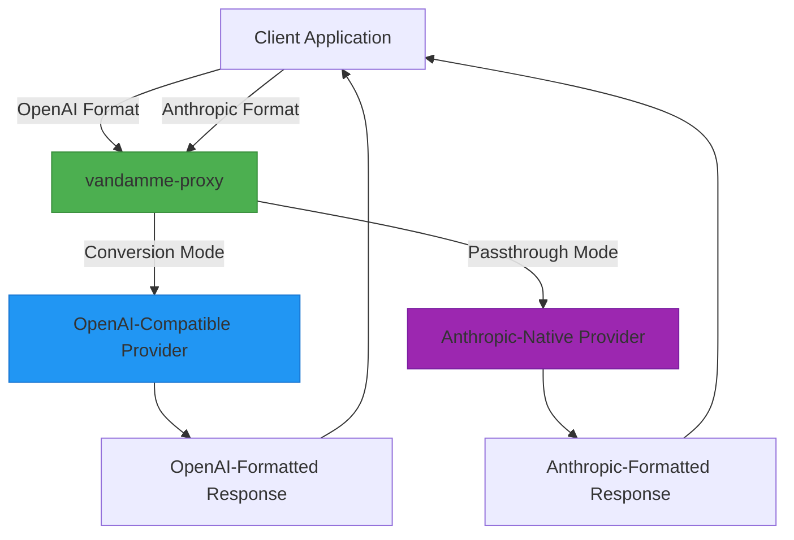
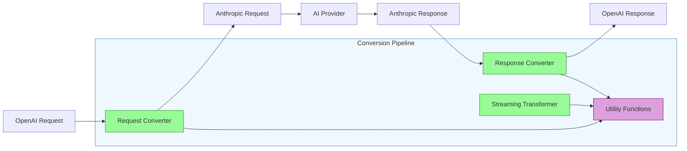
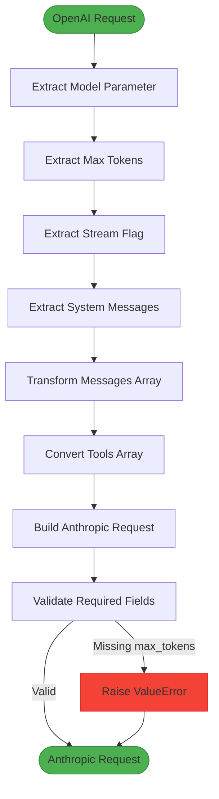
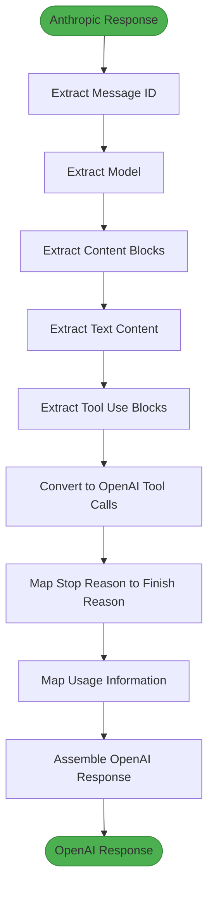
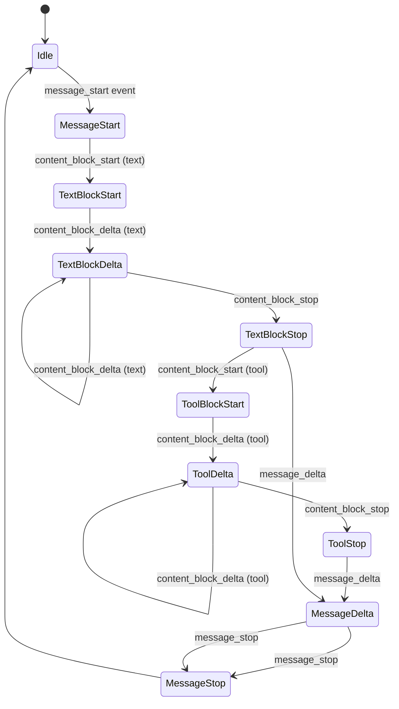
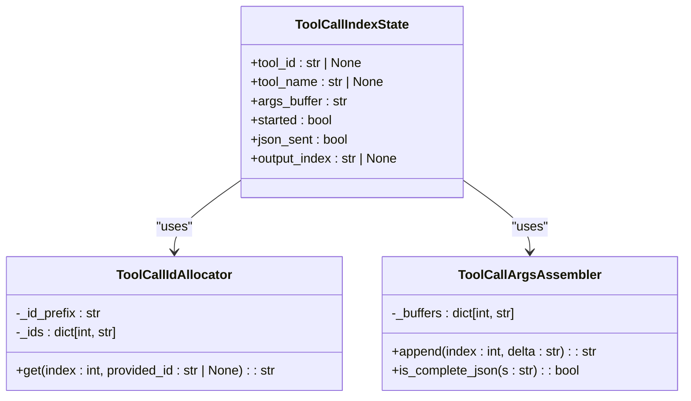
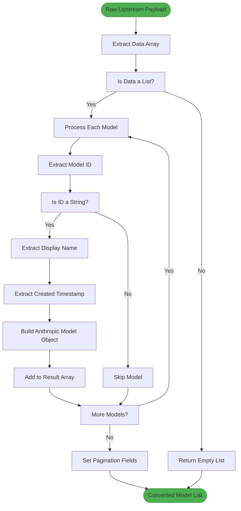
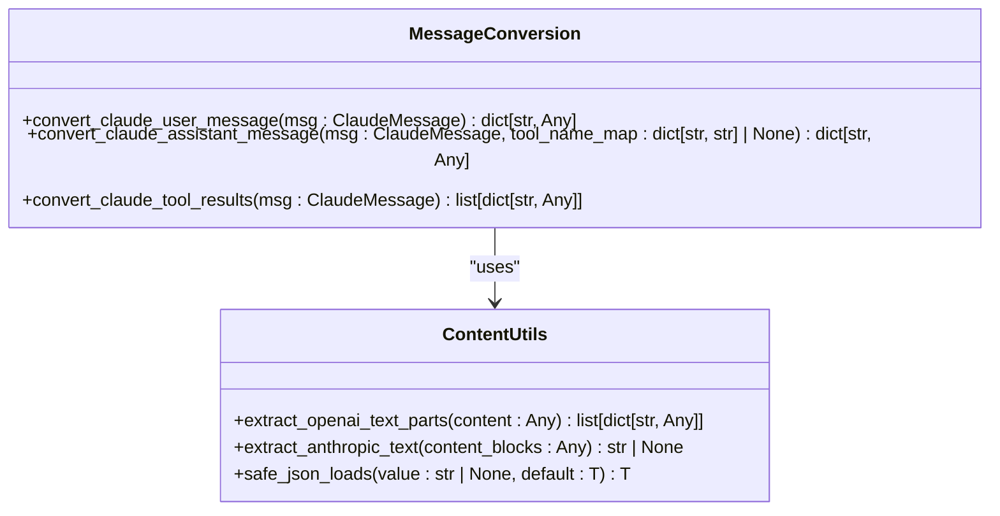
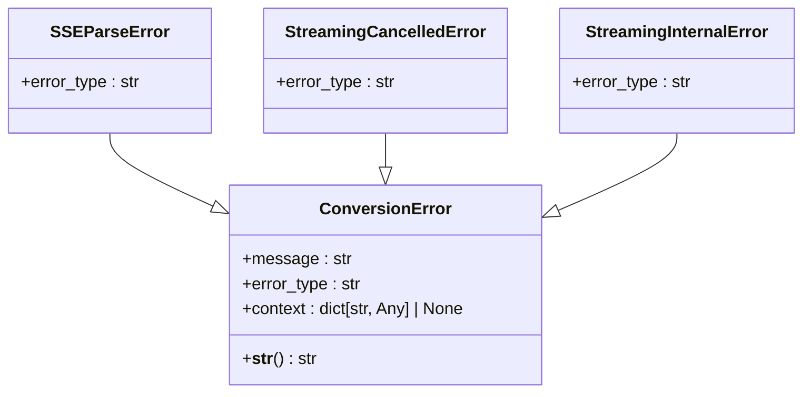

# API Format Support

<cite>
**Referenced Files in This Document**   
- [request_converter.py](file://src/conversion/request_converter.py)
- [response_converter.py](file://src/conversion/response_converter.py)
- [openai_to_anthropic.py](file://src/conversion/openai_to_anthropic.py)
- [anthropic_to_openai.py](file://src/conversion/anthropic_to_openai.py)
- [models_converter.py](file://src/conversion/models_converter.py)
- [openai_stream_to_claude_state_machine.py](file://src/conversion/openai_stream_to_claude_state_machine.py)
- [tool_call_delta.py](file://src/conversion/tool_call_delta.py)
- [anthropic_sse_to_openai.py](file://src/conversion/anthropic_sse_to_openai.py)
- [content_utils.py](file://src/conversion/content_utils.py)
- [errors.py](file://src/conversion/errors.py)
- [endpoints.py](file://src/api/endpoints.py)
- [v1.py](file://src/api/routers/v1.py)
- [config.py](file://src/core/config.py)
- [api-key-passthrough.md](file://docs/api-key-passthrough.md)
</cite>

## Table of Contents
1. [Introduction](#introduction)
2. [Dual-Mode Operation](#dual-mode-operation)
3. [Conversion Pipeline Architecture](#conversion-pipeline-architecture)
4. [Request Conversion Process](#request-conversion-process)
5. [Response Conversion Process](#response-conversion-process)
6. [Streaming Support with Server-Sent Events](#streaming-support-with-server-sent-events)
7. [Tool Call Conversion](#tool-call-conversion)
8. [Model Field Mappings](#model-field-mappings)
9. [Message Structure Transformations](#message-structure-transformations)
10. [Error Handling](#error-handling)
11. [Performance Considerations](#performance-considerations)
12. [Configuration and Security](#configuration-and-security)
13. [Practical Examples](#practical-examples)

## Introduction

The vandamme-proxy provides comprehensive API format support for seamless interoperability between OpenAI and Anthropic AI models. The system implements a sophisticated conversion layer that enables clients to interact with Anthropic models using the OpenAI API format while also supporting direct passthrough for native Anthropic API requests. This documentation details the architecture, implementation, and usage patterns for the API format conversion capabilities, focusing on the dual-mode operation, conversion pipeline, streaming support, tool call handling, and configuration options.

**Section sources**
- [endpoints.py](file://src/api/endpoints.py#L1-L1418)
- [config.py](file://src/core/config.py#L1-L285)

## Dual-Mode Operation

The vandamme-proxy operates in two distinct modes to accommodate different client requirements and provider capabilities:

1. **OpenAI-to-Anthropic Conversion Mode**: Translates OpenAI-style API requests to Anthropic format and vice versa, enabling clients to use the familiar OpenAI interface with Anthropic models.

2. **Direct Anthropic Passthrough Mode**: Allows direct forwarding of Anthropic-formatted requests to Anthropic-compatible APIs without format conversion, preserving the native API structure.

The mode selection is determined by the provider configuration and request endpoint. The `/v1/chat/completions` endpoint handles OpenAI-compatible requests, while the `/v1/messages` endpoint supports both direct Anthropic passthrough and converted requests. The system automatically routes requests based on the provider configuration and model resolution.



**Diagram sources **
- [endpoints.py](file://src/api/endpoints.py#L171-L800)
- [v1.py](file://src/api/routers/v1.py#L1-L34)

**Section sources**
- [endpoints.py](file://src/api/endpoints.py#L171-L800)
- [v1.py](file://src/api/routers/v1.py#L1-L34)

## Conversion Pipeline Architecture

The conversion pipeline in vandamme-proxy is implemented as a modular system within the `src/conversion/` directory, with specialized components handling different aspects of the format transformation. The architecture follows a clean separation of concerns, with distinct modules for request conversion, response conversion, streaming translation, and utility functions.

The core conversion components work together to transform API payloads between OpenAI and Anthropic formats:

- **Request Conversion**: Transforms OpenAI-style requests to Anthropic format using `request_converter.py` and `openai_to_anthropic.py`
- **Response Conversion**: Converts Anthropic responses back to OpenAI format using `response_converter.py` and `anthropic_to_openai.py`
- **Streaming Translation**: Handles Server-Sent Events (SSE) format conversion with stateful streaming transformers
- **Utility Functions**: Provides shared functionality for content extraction, JSON parsing, and data transformation



**Diagram sources **
- [request_converter.py](file://src/conversion/request_converter.py#L1-L347)
- [response_converter.py](file://src/conversion/response_converter.py#L1-L333)
- [openai_to_anthropic.py](file://src/conversion/openai_to_anthropic.py#L1-L178)
- [anthropic_to_openai.py](file://src/conversion/anthropic_to_openai.py#L1-L99)

**Section sources**
- [request_converter.py](file://src/conversion/request_converter.py#L1-L347)
- [response_converter.py](file://src/conversion/response_converter.py#L1-L333)

## Request Conversion Process

The request conversion process transforms OpenAI-style chat completion requests into the Anthropic Messages API format. This conversion is handled by the `openai_chat_completions_to_anthropic_messages` function in `openai_to_anthropic.py`, which implements a subset of the OpenAI schema focused on the most commonly used fields.

The conversion process includes several key transformations:

1. **Model Field Mapping**: The model field is preserved but may be resolved through aliasing
2. **Max Tokens Handling**: Maps OpenAI's `max_tokens` or `max_completion_tokens` to Anthropic's required `max_tokens` field
3. **Stream Flag Preservation**: Maintains the stream parameter for consistent streaming behavior
4. **System Message Extraction**: Consolidates system messages from the messages array into the top-level system field
5. **Message Content Transformation**: Converts message content to Anthropic's content blocks format
6. **Tool Conversion**: Transforms OpenAI tools array to Anthropic tools format

The conversion handles different message roles appropriately:
- User and assistant messages are converted with their content
- Tool messages are transformed into tool result blocks
- System messages are extracted and placed in the top-level system field



**Diagram sources **
- [openai_to_anthropic.py](file://src/conversion/openai_to_anthropic.py#L106-L178)
- [content_utils.py](file://src/conversion/content_utils.py#L1-L64)

**Section sources**
- [openai_to_anthropic.py](file://src/conversion/openai_to_anthropic.py#L106-L178)
- [content_utils.py](file://src/conversion/content_utils.py#L1-L64)

## Response Conversion Process

The response conversion process transforms Anthropic Messages API responses back into the OpenAI chat completion format. This is implemented in the `anthropic_message_to_openai_chat_completion` function in `anthropic_to_openai.py`, which maps the key response fields between the two formats.

The conversion process includes:

1. **Message Content Extraction**: Extracts text content from Anthropic's content blocks
2. **Tool Call Conversion**: Transforms tool_use blocks into OpenAI's tool_calls format
3. **Finish Reason Mapping**: Converts Anthropic's stop_reason to OpenAI's finish_reason
4. **Usage Information Mapping**: Transforms token usage data between formats
5. **Response Structure Assembly**: Builds the complete OpenAI response structure

The conversion handles different content types in the Anthropic response:
- Text blocks are extracted and concatenated for the message content
- Tool_use blocks are converted to tool_calls with proper function formatting
- The response maintains the single-choice structure expected by OpenAI clients



**Diagram sources **
- [anthropic_to_openai.py](file://src/conversion/anthropic_to_openai.py#L62-L99)
- [content_utils.py](file://src/conversion/content_utils.py#L50-L64)

**Section sources**
- [anthropic_to_openai.py](file://src/conversion/anthropic_to_openai.py#L62-L99)
- [content_utils.py](file://src/conversion/content_utils.py#L50-L64)

## Streaming Support with Server-Sent Events

The vandamme-proxy provides comprehensive support for streaming responses using Server-Sent Events (SSE), implementing a state machine to handle the conversion between OpenAI and Anthropic streaming formats. The streaming conversion is handled by the `openai_stream_to_claude_state_machine.py` module, which maintains conversion state across multiple SSE events.

The streaming architecture includes:

1. **State Management**: The `OpenAIToClaudeStreamState` class tracks conversion state including text block index, tool block counter, and tool call state
2. **Event Translation**: Converts OpenAI streaming events to Anthropic SSE events with proper event types and data structures
3. **Delta Handling**: Processes incremental deltas for both text and tool call arguments
4. **Tool Call Assembly**: Accumulates tool call argument deltas and detects complete JSON objects
5. **Final Event Generation**: Produces proper final events including message stop and usage information

The state machine handles the following event types:
- `message_start`: Initial message event
- `content_block_start`: Begins a new content block (text or tool)
- `content_block_delta`: Incremental updates to content blocks
- `content_block_stop`: Completes a content block
- `message_delta`: Message-level updates including stop reason
- `message_stop`: Final event indicating completion



**Diagram sources **
- [openai_stream_to_claude_state_machine.py](file://src/conversion/openai_stream_to_claude_state_machine.py#L1-L245)
- [tool_call_delta.py](file://src/conversion/tool_call_delta.py#L1-L64)

**Section sources**
- [openai_stream_to_claude_state_machine.py](file://src/conversion/openai_stream_to_claude_state_machine.py#L1-L245)
- [tool_call_delta.py](file://src/conversion/tool_call_delta.py#L1-L64)

## Tool Call Conversion

The vandamme-proxy implements sophisticated tool call conversion to support function calling capabilities across both OpenAI and Anthropic formats. The conversion process handles both request and response transformations for tool calls, including schema transformation and delta handling for streaming responses.

Key components of the tool call conversion system:

1. **Schema Transformation**: Converts OpenAI tool schemas to Anthropic format and vice versa
2. **Tool Name Sanitization**: Handles tool name mapping between formats
3. **Delta Handling**: Manages incremental tool call argument updates in streaming responses
4. **State Management**: Tracks tool call state during streaming operations

The `tool_call_delta.py` module provides essential classes for streaming tool call conversion:
- `ToolCallIndexState`: Tracks state for individual tool calls
- `ToolCallIdAllocator`: Provides stable tool call IDs
- `ToolCallArgsAssembler`: Accumulates argument deltas and detects complete JSON

The conversion process handles tool calls in both directions:
- OpenAI to Anthropic: Converts tool_calls array to tool_use content blocks
- Anthropic to OpenAI: Transforms tool_use blocks back to tool_calls format



**Diagram sources **
- [tool_call_delta.py](file://src/conversion/tool_call_delta.py#L1-L64)
- [openai_stream_to_claude_state_machine.py](file://src/conversion/openai_stream_to_claude_state_machine.py#L1-L245)

**Section sources**
- [tool_call_delta.py](file://src/conversion/tool_call_delta.py#L1-L64)
- [openai_stream_to_claude_state_machine.py](file://src/conversion/openai_stream_to_claude_state_machine.py#L1-L245)

## Model Field Mappings

The vandamme-proxy handles model field mappings through the `models_converter.py` module, which provides functions to convert between different model listing formats. This enables consistent model enumeration across different providers and API formats.

The module implements two primary conversion functions:

1. **raw_to_openai_models**: Converts a raw upstream payload to OpenAI-style models list response format
2. **raw_to_anthropic_models**: Converts raw upstream payload to Anthropic Models List schema

The conversion process extracts model information from upstream responses and maps it to the target format:
- Model ID is preserved from the upstream response
- Display name is derived from the model's display_name field or falls back to the ID
- Created timestamp is extracted from created_at or created fields
- Type is set to "model" for Anthropic format compatibility

The converter handles various edge cases and data inconsistencies in upstream responses, providing robust mapping even when source data is incomplete or malformed.



**Diagram sources **
- [models_converter.py](file://src/conversion/models_converter.py#L1-L71)

**Section sources**
- [models_converter.py](file://src/conversion/models_converter.py#L1-L71)

## Message Structure Transformations

The vandamme-proxy implements comprehensive message structure transformations through the `content_utils.py` module, which provides utility functions for extracting and normalizing content between OpenAI and Anthropic formats.

Key transformation functions include:

1. **extract_openai_text_parts**: Extracts text parts from OpenAI message content, handling both string and array formats
2. **extract_anthropic_text**: Extracts concatenated text from Anthropic content blocks
3. **safe_json_loads**: Provides robust JSON parsing with error handling for malformed payloads

The message structure transformations handle various content types and formats:
- OpenAI string content is converted to a single text block
- OpenAI array content with text parts is converted to multiple text blocks
- Anthropic content blocks are processed to extract text content
- Tool result content is normalized to string format

The transformations ensure consistent handling of multimodal content, including text and images, while preserving the semantic meaning of the messages across format conversions.



**Diagram sources **
- [content_utils.py](file://src/conversion/content_utils.py#L1-L64)
- [request_converter.py](file://src/conversion/request_converter.py#L202-L307)

**Section sources**
- [content_utils.py](file://src/conversion/content_utils.py#L1-L64)
- [request_converter.py](file://src/conversion/request_converter.py#L202-L307)

## Error Handling

The vandamme-proxy implements a comprehensive error handling system for the conversion layer, defined in the `errors.py` module. The system uses structured exception classes to provide detailed error information that can be logged, mapped to client-visible errors, and attached to request metrics.

The error hierarchy includes:

1. **ConversionError**: Base class for all conversion-layer exceptions
2. **SSEParseError**: Specific error for Server-Sent Events parsing failures
3. **StreamingCancelledError**: Indicates a streaming request was cancelled
4. **StreamingInternalError**: Represents internal streaming errors

Each error class includes structured context that enables:
- Deterministic logging
- Mapping to stable client-visible error payloads
- Attachment to request metrics
- Consistent error reporting across the system

The error handling is integrated throughout the conversion pipeline, with specific error handling in both request and response conversion processes, as well as in the streaming components.



**Diagram sources **
- [errors.py](file://src/conversion/errors.py#L1-L38)
- [response_converter.py](file://src/conversion/response_converter.py#L148-L162)

**Section sources**
- [errors.py](file://src/conversion/errors.py#L1-L38)
- [response_converter.py](file://src/conversion/response_converter.py#L148-L162)

## Performance Considerations

The format translation process in vandamme-proxy introduces several performance considerations that impact latency, throughput, and resource utilization. The conversion overhead varies depending on the operation mode and request characteristics.

Key performance factors include:

1. **Conversion Latency**: The time required to transform request and response payloads between formats
2. **Streaming Overhead**: Additional processing for real-time event translation in streaming scenarios
3. **Memory Usage**: State maintenance for streaming conversions and tool call tracking
4. **CPU Utilization**: JSON parsing, string manipulation, and data transformation operations

The system implements several optimizations to minimize performance impact:
- Efficient data structure transformations
- Reusable conversion state objects
- Optimized JSON handling
- Minimal data copying

For high-throughput scenarios, the direct Anthropic passthrough mode provides the best performance as it eliminates format conversion overhead entirely.

**Section sources**
- [request_converter.py](file://src/conversion/request_converter.py#L1-L347)
- [response_converter.py](file://src/conversion/response_converter.py#L1-L333)

## Configuration and Security

The vandamme-proxy provides configuration options for enabling passthrough mode and managing security considerations for API key forwarding. The API key passthrough feature allows providers to use the client's API key instead of a statically configured one.

Key configuration and security aspects:

1. **API Key Passthrough**: Enabled by setting the provider's API key environment variable to `!PASSTHRU`
2. **Security Design**: Uses explicit sentinel values to prevent accidental passthrough
3. **Mixed Mode Support**: Allows simultaneous use of static and passthrough providers
4. **Configuration Validation**: Prevents mixing static keys with passthrough for the same provider

The system enforces security through:
- Explicit configuration requirements
- Clear intent signaling
- Reduced risk of accidental secret exposure
- Auditability of passthrough providers

Configuration examples:
```bash
# Enable passthrough for a provider
ANTHROPIC_API_KEY='!PASSTHRU'

# Static API key configuration
OPENAI_API_KEY='sk-your-key-here'
```

**Section sources**
- [api-key-passthrough.md](file://docs/api-key-passthrough.md#L1-L167)
- [config.py](file://src/core/config.py#L1-L285)

## Practical Examples

The following examples demonstrate practical usage of the vandamme-proxy API format support capabilities:

### OpenAI-Compatible Request to Anthropic Model
```bash
curl -X POST https://your-proxy/v1/chat/completions \
  -H "Content-Type: application/json" \
  -H "x-api-key: your-anthropic-key" \
  -d '{
    "model": "claude-3-opus-20240229",
    "messages": [
      {"role": "user", "content": "Hello, how are you?"}
    ],
    "max_tokens": 100,
    "stream": false
  }'
```

### Streaming Request with Tool Calls
```bash
curl -X POST https://your-proxy/v1/chat/completions \
  -H "Content-Type: application/json" \
  -H "x-api-key: your-anthropic-key" \
  -d '{
    "model": "claude-3-opus-20240229",
    "messages": [
      {"role": "user", "content": "What's the weather in San Francisco?"}
    ],
    "tools": [
      {
        "type": "function",
        "function": {
          "name": "get_weather",
          "description": "Get the current weather in a location",
          "parameters": {
            "type": "object",
            "properties": {
              "location": {"type": "string"}
            },
            "required": ["location"]
          }
        }
      }
    ],
    "max_tokens": 100,
    "stream": true
  }'
```

### Direct Anthropic Passthrough
```bash
curl -X POST https://your-proxy/v1/messages \
  -H "Content-Type: application/json" \
  -H "x-api-key: your-anthropic-key" \
  -d '{
    "model": "claude-3-opus-20240229",
    "messages": [
      {"role": "user", "content": "Hello, how are you?"}
    ],
    "max_tokens": 100,
    "stream": false
  }'
```

These examples show how clients can make OpenAI-compatible requests that are converted to Anthropic format and receive properly formatted responses, leveraging the full capabilities of the vandamme-proxy conversion system.

**Section sources**
- [endpoints.py](file://src/api/endpoints.py#L171-L800)
- [api-key-passthrough.md](file://docs/api-key-passthrough.md#L1-L167)