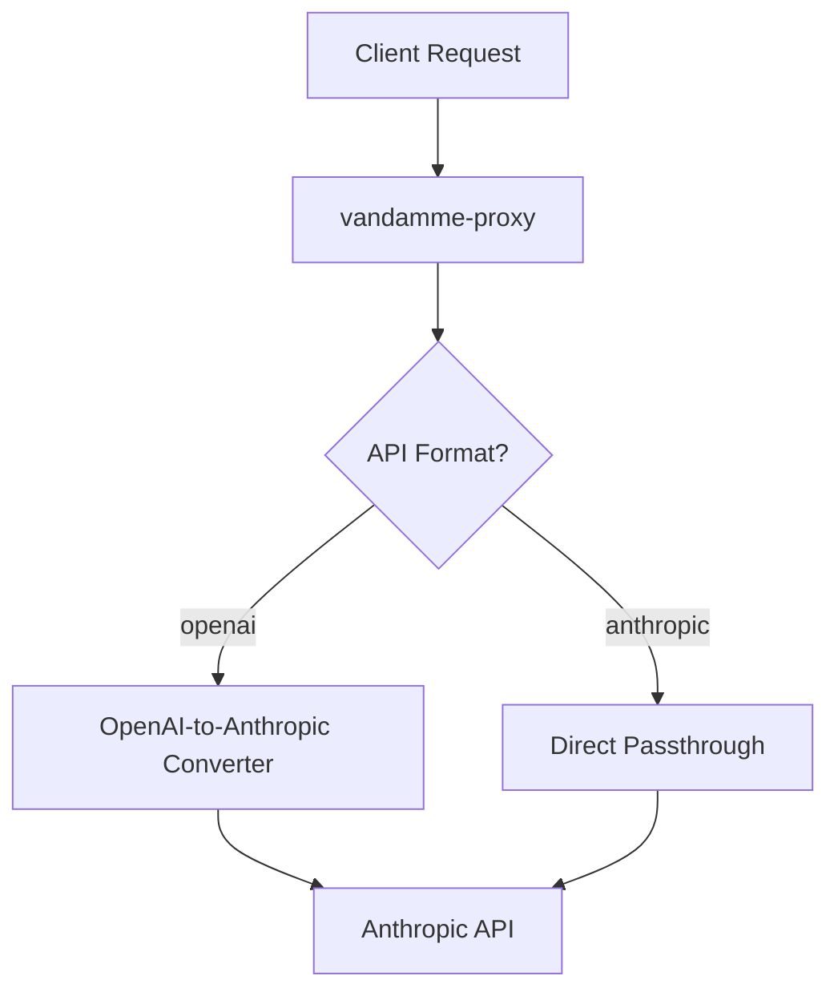
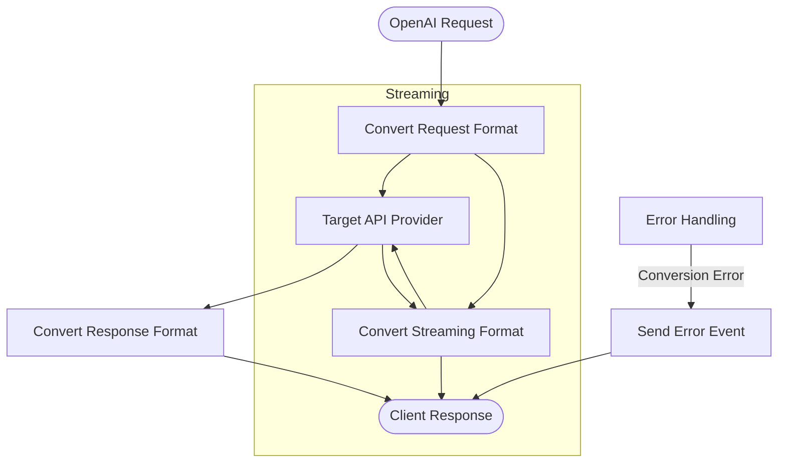
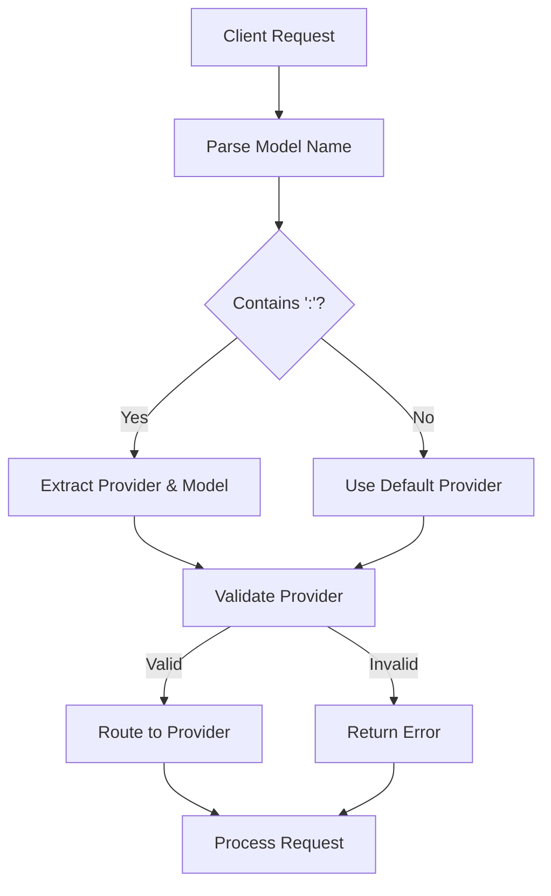

# Core Features

<cite>
**Referenced Files in This Document**   
- [resolver.py](file://src/core/alias/resolver.py)
- [alias_manager.py](file://src/core/alias_manager.py)
- [model_manager.py](file://src/core/model_manager.py)
- [provider_manager.py](file://src/core/provider_manager.py)
- [request_converter.py](file://src/conversion/request_converter.py)
- [response_converter.py](file://src/conversion/response_converter.py)
- [openai_to_anthropic.py](file://src/conversion/openai_to_anthropic.py)
- [anthropic_to_openai.py](file://src/conversion/anthropic_to_openai.py)
- [provider-routing-guide.md](file://docs/provider-routing-guide.md)
- [model-aliases.md](file://docs/model-aliases.md)
</cite>

## Table of Contents
1. [Multi-Provider Support System](#multi-provider-support-system)
2. [Smart Model Aliasing System](#smart-model-aliasing-system)
3. [Dual API Mode](#dual-api-mode)
4. [Protocol Translation Capabilities](#protocol-translation-capabilities)
5. [Provider Routing Mechanism](#provider-routing-mechanism)
6. [Feature Combinations](#feature-combinations)
7. [Performance Implications](#performance-implications)
8. [Best Practices](#best-practices)

## Multi-Provider Support System

The vandamme-proxy enables routing to multiple AI providers through a unified interface, supporting OpenAI, Anthropic, Poe, Azure, Gemini, and AWS Bedrock. This multi-provider architecture allows users to seamlessly switch between different AI services without changing their client code. The system automatically discovers providers from environment variables, where the presence of any `{PROVIDER}_API_KEY` creates a corresponding provider. Each provider can have its own configuration including base URL, API version, and custom headers, enabling flexible integration with various services.

The proxy supports both OpenAI-compatible APIs (with automatic translation) and Anthropic-compatible APIs (with direct passthrough). For OpenAI format providers, the proxy handles protocol translation between the OpenAI and Anthropic APIs, while Anthropic format providers receive requests directly without conversion. This dual approach provides maximum flexibility for integrating with different AI services.

**Section sources**
- [provider_manager.py](file://src/core/provider_manager.py#L29-L586)
- [provider-routing-guide.md](file://docs/provider-routing-guide.md#L1-L305)

## Smart Model Aliasing System

The smart model aliasing system provides case-insensitive substring matching with chained resolution capabilities. Users can create provider-specific aliases using the `<PROVIDER>_ALIAS_<NAME>` environment variable pattern, allowing for flexible model name resolution. The system supports both exact matches and substring matching, where any model name containing the alias name will trigger resolution.

The alias resolution process follows a priority order: exact matches are preferred first, followed by the longest substring match. When multiple aliases have the same length, they are sorted alphabetically by provider and then by alias name. The system also handles variations between underscores and hyphens, so an alias defined with underscores will match model names using either underscores or hyphens.

Chained resolution allows aliases to point to other aliases, creating resolution chains like `fast -> sonnet -> gpt-4o-mini`. The system includes cycle detection to prevent infinite loops and limits the maximum chain length to prevent excessive recursion. A caching mechanism with TTL (time-to-live) improves performance by storing resolved aliases, reducing the need for repeated resolution operations.

**Section sources**
- [resolver.py](file://src/core/alias/resolver.py#L1-L524)
- [alias_manager.py](file://src/core/alias_manager.py#L1-L634)
- [model-aliases.md](file://docs/model-aliases.md#L1-L443)

## Dual API Mode

The vandamme-proxy implements a dual API mode that supports both OpenAI-to-Anthropic conversion and direct Anthropic passthrough. In OpenAI-to-Anthropic conversion mode, the proxy translates OpenAI API requests into the Anthropic Messages API format, handling differences in request structure, parameter names, and response formats. This allows clients designed for the OpenAI API to work with Anthropic models seamlessly.

In direct Anthropic passthrough mode, requests are forwarded directly to Anthropic-compatible providers without conversion. This mode is activated when a provider is configured with `API_FORMAT=anthropic`, allowing the proxy to serve as a simple gateway for Anthropic API requests. The dual mode system provides flexibility for different use cases, enabling both protocol translation for compatibility and direct passthrough for performance.

The system determines which mode to use based on the provider configuration, specifically the `api_format` setting in the `ProviderConfig` class. Providers with `api_format="openai"` trigger conversion, while those with `api_format="anthropic"` use direct passthrough.

**Diagram sources**
- [request_converter.py](file://src/conversion/request_converter.py#L1-L347)
- [response_converter.py](file://src/conversion/response_converter.py#L1-L333)

## Protocol Translation Capabilities

The protocol translation system handles request/response format conversion and streaming support between different API formats. For request conversion, the proxy transforms OpenAI API requests into the Anthropic Messages API format, mapping parameters like `max_tokens`, `temperature`, and `top_p` between the two systems. The conversion process preserves essential information while adapting to the target API's requirements.

Streaming support is fully implemented, with the proxy converting between OpenAI's SSE (Server-Sent Events) format and Anthropic's streaming format. The system handles streaming errors gracefully, ensuring that clients receive proper error events even when issues occur during streaming. The translation includes proper handling of tool calls, tool results, and other complex message types, maintaining the integrity of the conversation flow.

The conversion system is modular, with separate components for request conversion, response conversion, and streaming conversion. This separation of concerns allows for independent development and testing of each translation aspect. The system also includes error handling for malformed requests and responses, providing meaningful error messages to clients when conversion fails.

**Diagram sources**
- [request_converter.py](file://src/conversion/request_converter.py#L1-L347)
- [response_converter.py](file://src/conversion/response_converter.py#L1-L333)
- [openai_to_anthropic.py](file://src/conversion/openai_to_anthropic.py#L1-L178)
- [anthropic_to_openai.py](file://src/conversion/anthropic_to_openai.py#L1-L99)

## Provider Routing Mechanism

The provider routing mechanism uses the syntax `provider:model` to direct requests to specific providers, with a configurable default provider for requests without explicit routing. When a request includes a provider prefix (e.g., `openai:gpt-4o`), the proxy routes it to the corresponding provider. If no prefix is specified, the request uses the default provider configured in the environment or configuration files.

The routing process begins with parsing the model name to extract the provider and model components. If a colon is present, the part before the colon is treated as the provider name, and the part after is the model name. Without a colon, the default provider is used. The system validates that the specified provider is configured before processing the request, returning an error if the provider is not found.

Default provider configuration follows a hierarchy: environment variables take precedence over configuration files. The `VDM_DEFAULT_PROVIDER` environment variable overrides the `default-provider` setting in configuration files. If neither is specified, the system defaults to "openai". This flexible configuration system allows for easy switching between providers based on deployment requirements.

**Diagram sources**
- [provider_manager.py](file://src/core/provider_manager.py#L408-L418)
- [model_manager.py](file://src/core/model_manager.py#L19-L92)
- [provider-routing-guide.md](file://docs/provider-routing-guide.md#L1-L305)

## Feature Combinations

The vandamme-proxy allows for powerful combinations of features, such as using model aliases with multi-provider routing. For example, a user can define an alias `OPENAI_ALIAS_FAST=gpt-4o-mini` and then use it with provider routing by specifying `openai:fast` in their request. This combination enables both human-readable model names and explicit provider selection in a single model specification.

Another common combination is using the literal prefix `!` with provider routing to bypass alias resolution. By specifying `!openai:gpt-4o`, users can ensure that their request uses the exact model name without any alias processing. This is useful when testing specific model versions or when alias behavior needs to be temporarily overridden.

The system also supports combining streaming with protocol translation, allowing clients to stream responses from converted APIs. For instance, a client can make a streaming request to an OpenAI-compatible endpoint, which is then converted to an Anthropic streaming response. The proxy handles the format conversion transparently, maintaining the streaming nature of the response while adapting to the target API's requirements.

**Section sources**
- [resolver.py](file://src/core/alias/resolver.py#L135-L173)
- [model_manager.py](file://src/core/model_manager.py#L19-L92)
- [request_converter.py](file://src/conversion/request_converter.py#L72-L199)

## Performance Implications

The vandamme-proxy introduces several performance considerations that users should understand. The alias resolution system includes a caching mechanism with a default TTL of 5 minutes and a maximum size of 1000 entries, which significantly reduces the overhead of repeated alias lookups. However, the initial resolution of complex alias chains may add latency, particularly when multiple chained aliases need to be resolved.

Protocol translation between different API formats adds processing overhead, as requests and responses must be transformed between formats. This overhead is generally minimal for simple requests but can become more significant for complex requests with many tool calls or large message histories. Streaming requests may experience slightly higher latency due to the need for format conversion during the streaming process.

The multi-provider architecture allows for load balancing across multiple API keys when configured, which can improve reliability and throughput. However, this requires careful configuration to ensure that keys are properly distributed and that rate limits are respected. The system includes built-in retry logic with exponential backoff to handle transient errors, which can affect response times during periods of high load or provider instability.

**Section sources**
- [alias_manager.py](file://src/core/alias_manager.py#L56-L140)
- [request_converter.py](file://src/conversion/request_converter.py#L1-L347)
- [response_converter.py](file://src/conversion/response_converter.py#L1-L333)

## Best Practices

To maximize the effectiveness and reliability of the vandamme-proxy, several best practices should be followed. For security, use the `!PASSTHRU` sentinel for client-managed API keys rather than exposing provider keys directly. Keep sensitive keys out of version control by using environment variables or secret management systems.

For performance, configure multiple API keys per provider when available to enable automatic load balancing and failover. Consider the regional location of providers to minimize latency, and use connection pooling where possible. Monitor API key usage per provider to avoid hitting rate limits unexpectedly.

For reliability, implement proper error handling in client applications to gracefully handle provider failures. Use the proxy's health checking endpoints to monitor provider status, and set up alerts for critical failures. Regularly review and update provider configurations to ensure compatibility with API changes.

For maintainability, document provider configurations and model mappings for team members. Use consistent naming conventions for aliases across providers, and organize aliases by use case or environment. Regularly review and clean up unused aliases to maintain clarity and reduce configuration complexity.

**Section sources**
- [provider-routing-guide.md](file://docs/provider-routing-guide.md#L204-L224)
- [model-aliases.md](file://docs/model-aliases.md#L270-L300)
- [provider_manager.py](file://src/core/provider_manager.py#L474-L497)