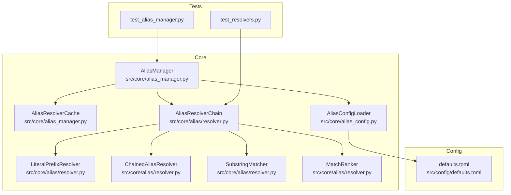
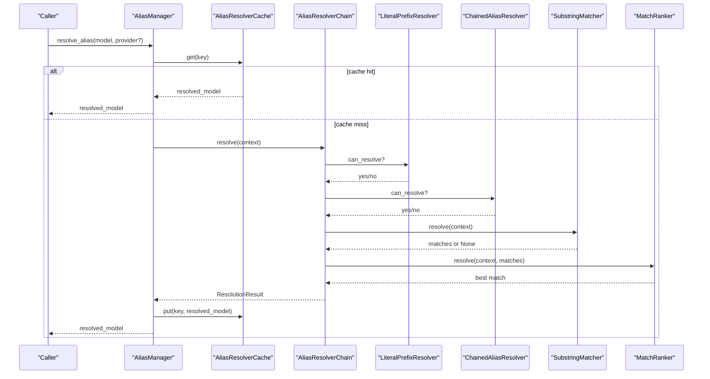
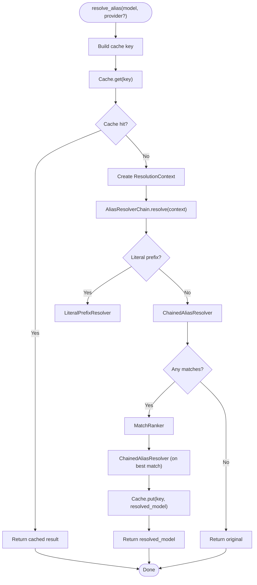
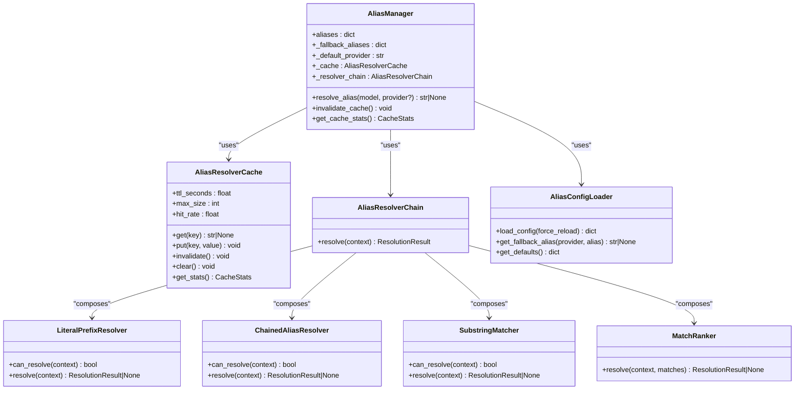

# Model Aliasing System

<cite>
**Referenced Files in This Document**
- [alias_manager.py](file://src/core/alias_manager.py)
- [resolver.py](file://src/core/alias/resolver.py)
- [alias_config.py](file://src/core/alias_config.py)
- [defaults.toml](file://src/config/defaults.toml)
- [test_alias_manager.py](file://tests/unit/test_alias_manager.py)
- [test_resolvers.py](file://tests/unit/alias/test_resolvers.py)
- [model-aliases.md](file://docs/model-aliases.md)
- [fallback-aliases.md](file://docs/fallback-aliases.md)
</cite>

## Table of Contents
1. [Introduction](#introduction)
2. [Project Structure](#project-structure)
3. [Core Components](#core-components)
4. [Architecture Overview](#architecture-overview)
5. [Detailed Component Analysis](#detailed-component-analysis)
6. [Dependency Analysis](#dependency-analysis)
7. [Performance Considerations](#performance-considerations)
8. [Troubleshooting Guide](#troubleshooting-guide)
9. [Conclusion](#conclusion)
10. [Appendices](#appendices)

## Introduction
This document explains the model aliasing system in vandamme-proxy, focusing on the AliasManager class and its resolver chain. It covers how aliases are defined via environment variables and TOML fallbacks, how case-insensitive substring matching works, and how chained alias resolution resolves references across providers. It also documents the caching mechanism with TTL and max size, cache invalidation, recursive resolution to prevent circular references, priority rules for conflict resolution, and validation of alias targets.

## Project Structure
The aliasing system spans several modules:
- Core alias manager and cache: src/core/alias_manager.py
- Resolver chain and strategies: src/core/alias/resolver.py
- Fallback configuration loader: src/core/alias_config.py
- Package defaults: src/config/defaults.toml
- Tests: tests/unit/test_alias_manager.py and tests/unit/alias/test_resolvers.py
- Documentation: docs/model-aliases.md and docs/fallback-aliases.md

**Diagram sources**
- [alias_manager.py](file://src/core/alias_manager.py#L167-L634)
- [resolver.py](file://src/core/alias/resolver.py#L135-L524)
- [alias_config.py](file://src/core/alias_config.py#L27-L224)
- [defaults.toml](file://src/config/defaults.toml#L1-L89)
- [test_alias_manager.py](file://tests/unit/test_alias_manager.py#L1-L532)
- [test_resolvers.py](file://tests/unit/alias/test_resolvers.py#L1-L731)

**Section sources**
- [alias_manager.py](file://src/core/alias_manager.py#L1-L634)
- [resolver.py](file://src/core/alias/resolver.py#L1-L524)
- [alias_config.py](file://src/core/alias_config.py#L1-L224)
- [defaults.toml](file://src/config/defaults.toml#L1-L89)

## Core Components
- AliasManager: Central orchestrator for loading, validating, and resolving aliases. Implements a resolver chain and a TTL-based cache.
- AliasResolverChain and Strategies: LiteralPrefixResolver, ChainedAliasResolver, SubstringMatcher, MatchRanker compose the resolution pipeline.
- AliasResolverCache: TTL and generation-based cache with hit/miss tracking and invalidation.
- AliasConfigLoader: Loads TOML fallback configuration with a strict hierarchy and caches results.

Key responsibilities:
- Load environment variable aliases (<PROVIDER>_ALIAS_<NAME>) and normalize to lowercase.
- Load fallback aliases from TOML files and merge them for known providers.
- Resolve aliases using a three-tier chain: literal bypass, chained resolution, substring matching, and ranking.
- Cache results with TTL and generation-based invalidation.
- Prevent circular references and support cross-provider aliases.

**Section sources**
- [alias_manager.py](file://src/core/alias_manager.py#L167-L634)
- [resolver.py](file://src/core/alias/resolver.py#L135-L524)
- [alias_config.py](file://src/core/alias_config.py#L27-L224)

## Architecture Overview
The aliasing system uses a strategy pattern with a resolver chain. AliasManager initializes the chain and delegates resolution to it. It also manages caching and configuration loading.

**Diagram sources**
- [alias_manager.py](file://src/core/alias_manager.py#L460-L536)
- [resolver.py](file://src/core/alias/resolver.py#L436-L523)

**Section sources**
- [alias_manager.py](file://src/core/alias_manager.py#L460-L536)
- [resolver.py](file://src/core/alias/resolver.py#L417-L523)

## Detailed Component Analysis

### AliasManager
AliasManager encapsulates:
- Storage of aliases per provider and fallback aliases.
- Loading of environment variable aliases and TOML fallbacks.
- Resolver chain creation and resolution.
- Caching with TTL and generation-based invalidation.
- Recursive resolution to handle chained aliases and cross-provider references.

Key behaviors:
- Case-insensitive alias storage and matching.
- Provider-scoped resolution with fallback defaults.
- Validation of alias targets and circular references.
- Cache key construction and stats reporting.

Practical examples:
- Environment variable aliases: OPENAI_ALIAS_FAST=gpt-4o-mini resolves "fast" to "openai:gpt-4o-mini".
- TOML fallbacks: defaults.toml defines fallbacks like POE_ALIAS_HAIKU=grok-4.1-fast-non-reasoning.

**Section sources**
- [alias_manager.py](file://src/core/alias_manager.py#L167-L634)
- [defaults.toml](file://src/config/defaults.toml#L29-L34)

### Resolver Chain Components
- LiteralPrefixResolver: Handles literal names prefixed with "!" to bypass alias resolution.
- ChainedAliasResolver: Resolves chained aliases (e.g., fast -> sonnet -> gpt-4o-mini) with cycle detection and max chain length.
- SubstringMatcher: Performs case-insensitive substring matching across providers, normalizing underscores/hyphens and building a list of candidates.
- MatchRanker: Ranks matches by exactness, longest match, default provider preference, and alphabetical ordering.

Priority rules:
- Exact match before substring.
- Longest match first.
- Default provider preference.
- Alphabetical provider and alias name.

Cross-provider support:
- If a target contains a colon and the left-hand side is a known provider, it is treated as a cross-provider alias and returned as-is.
- Otherwise, the source provider prefix is added.

**Section sources**
- [resolver.py](file://src/core/alias/resolver.py#L135-L524)
- [test_resolvers.py](file://tests/unit/alias/test_resolvers.py#L1-L731)

### AliasResolverCache
- TTL-based eviction: Entries older than ttl_seconds are evicted.
- Generation-based invalidation: Incrementing the generation invalidates all entries.
- Max size eviction: Oldest entries by timestamp are removed when capacity is reached.
- Stats: Hits, misses, hit rate, and generation tracking.

Usage:
- Cache key: "{provider}:{model}" or "{model}" depending on provider presence.
- Invalidate cache when reloading aliases at runtime.

**Section sources**
- [alias_manager.py](file://src/core/alias_manager.py#L58-L164)

### AliasConfigLoader
- Loads TOML configuration from three locations (priority order): project override, user config, package defaults.
- Extracts provider sections and aliases, lowercasing alias names.
- Provides fallback alias lookup and provider defaults.
- Caches configuration to avoid repeated loads.

**Section sources**
- [alias_config.py](file://src/core/alias_config.py#L27-L224)
- [defaults.toml](file://src/config/defaults.toml#L1-L89)

### Practical Examples
- Environment variables:
  - OPENAI_ALIAS_FAST=gpt-4o-mini resolves "fast" to "openai:gpt-4o-mini".
  - POE_ALIAS_HAIKU=grok-4.1-fast-non-reasoning resolves "haiku" to "poe:grok-4.1-fast-non-reasoning".
- TOML fallbacks:
  - defaults.toml provides fallbacks for common model names (e.g., haiku, sonnet, opus) per provider.

**Section sources**
- [model-aliases.md](file://docs/model-aliases.md#L41-L99)
- [defaults.toml](file://src/config/defaults.toml#L16-L88)

### Resolver Chain Flow

**Diagram sources**
- [alias_manager.py](file://src/core/alias_manager.py#L460-L536)
- [resolver.py](file://src/core/alias/resolver.py#L436-L523)

**Section sources**
- [alias_manager.py](file://src/core/alias_manager.py#L460-L536)
- [resolver.py](file://src/core/alias/resolver.py#L417-L523)

### Recursive Resolution and Cross-Provider Aliases
- Recursive resolution prevents cycles by tracking visited provider-scoped aliases.
- Cross-provider aliases are supported: if a target looks like a provider prefix and the provider exists, it is preserved; otherwise, the source provider prefix is added.
- ChainedAliasResolver enforces a maximum chain length to avoid infinite loops.

**Section sources**
- [alias_manager.py](file://src/core/alias_manager.py#L383-L458)
- [resolver.py](file://src/core/alias/resolver.py#L175-L271)

### Priority Rules and Conflict Resolution
- Exact match before substring.
- Among substring matches, longest alias wins.
- Default provider preference.
- Alphabetical ordering by provider and alias name.

**Section sources**
- [resolver.py](file://src/core/alias/resolver.py#L343-L414)
- [test_resolvers.py](file://tests/unit/alias/test_resolvers.py#L403-L564)

### Validation of Alias Targets
- Empty or whitespace-only values are skipped.
- Circular references are detected and logged.
- "@" in targets is flagged as invalid.
- Provider validation is deferred until resolution time to avoid requiring API keys at startup.

**Section sources**
- [alias_manager.py](file://src/core/alias_manager.py#L270-L299)
- [test_alias_manager.py](file://tests/unit/test_alias_manager.py#L151-L194)

## Dependency Analysis
AliasManager depends on:
- AliasConfigLoader for TOML fallbacks.
- AliasResolverChain and its strategies for resolution.
- AliasResolverCache for caching.

Resolver chain components depend on:
- ResolutionContext for carrying state.
- Match for storing candidate matches.

**Diagram sources**
- [alias_manager.py](file://src/core/alias_manager.py#L58-L200)
- [resolver.py](file://src/core/alias/resolver.py#L135-L524)
- [alias_config.py](file://src/core/alias_config.py#L27-L224)

**Section sources**
- [alias_manager.py](file://src/core/alias_manager.py#L167-L213)
- [resolver.py](file://src/core/alias/resolver.py#L417-L524)
- [alias_config.py](file://src/core/alias_config.py#L27-L224)

## Performance Considerations
- Resolution cost: O(n) where n is the number of aliases, due to substring matching across providers.
- Caching: TTL-based and generation-based invalidation reduce repeated computation.
- Memory: Aliases are stored in memory; cache max size controls footprint.
- Recommendations:
  - Keep alias counts reasonable.
  - Prefer specific aliases before general ones to minimize overlap.
  - Use provider scoping to limit search space.

[No sources needed since this section provides general guidance]

## Troubleshooting Guide
Common issues and remedies:
- Alias not matching:
  - Verify alias name is a substring of the requested model.
  - Check provider scoping; use "provider:model" when needed.
- Circular reference:
  - Detected and logged; fix alias definitions to remove cycles.
- Empty or invalid values:
  - Empty or whitespace-only values are skipped; ensure non-empty targets.
- Cache not reflecting updates:
  - Invalidate cache after reloading aliases at runtime.
- Cross-provider alias confusion:
  - Ensure the target provider exists; otherwise, the source provider prefix is added.

**Section sources**
- [alias_manager.py](file://src/core/alias_manager.py#L270-L299)
- [alias_manager.py](file://src/core/alias_manager.py#L597-L610)
- [test_alias_manager.py](file://tests/unit/test_alias_manager.py#L501-L531)

## Conclusion
The model aliasing system provides a robust, extensible way to define and resolve model names across providers. It combines environment variable aliases with TOML fallbacks, supports case-insensitive substring matching, prioritizes exact and longest matches, and safely handles chained and cross-provider aliases. The resolver chain pattern enables modular, testable resolution logic, while caching and invalidation keep performance predictable and configuration updates safe.

[No sources needed since this section summarizes without analyzing specific files]

## Appendices

### Configuration and Usage Examples
- Environment variables:
  - OPENAI_ALIAS_FAST=gpt-4o-mini
  - POE_ALIAS_HAIKU=grok-4.1-fast-non-reasoning
- TOML fallbacks:
  - defaults.toml contains provider-specific aliases under [poe.aliases], [openai.aliases], etc.

**Section sources**
- [model-aliases.md](file://docs/model-aliases.md#L41-L99)
- [defaults.toml](file://src/config/defaults.toml#L16-L88)

### Cache Configuration and Invalidation
- TTL: default 300 seconds (5 minutes).
- Max size: default 1000 entries.
- Invalidate cache: call invalidate() when reloading aliases at runtime.

**Section sources**
- [alias_manager.py](file://src/core/alias_manager.py#L74-L75)
- [alias_manager.py](file://src/core/alias_manager.py#L597-L610)

### Test Coverage Highlights
- Environment variable loading and case-insensitive storage.
- Provider-scoped resolution with fallbacks.
- Chained alias resolution and cycle detection.
- Priority rules for exact vs. substring matches and alphabetical tie-breaking.
- Cross-provider alias handling and validation.

**Section sources**
- [test_alias_manager.py](file://tests/unit/test_alias_manager.py#L15-L532)
- [test_resolvers.py](file://tests/unit/alias/test_resolvers.py#L1-L731)