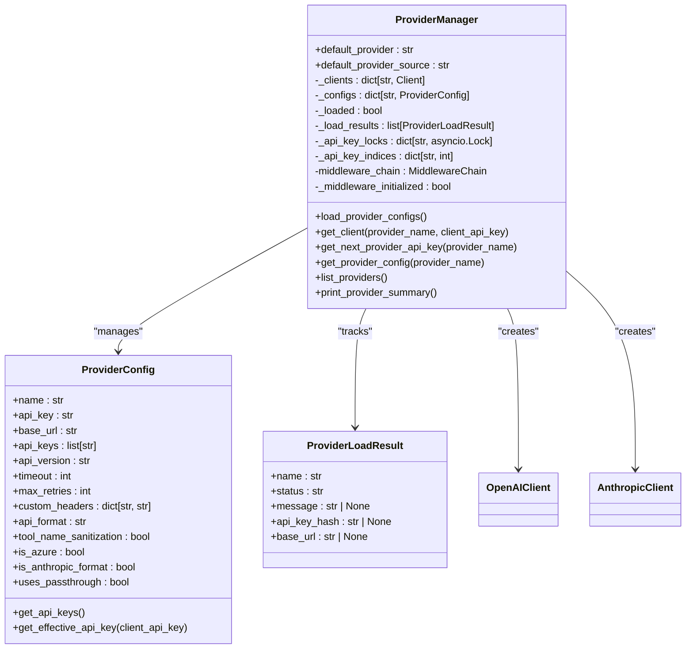
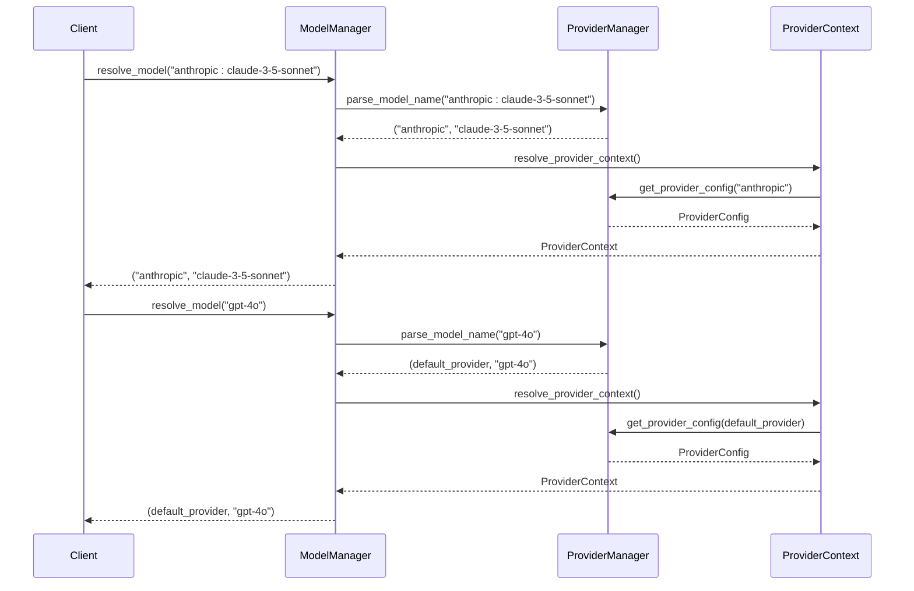
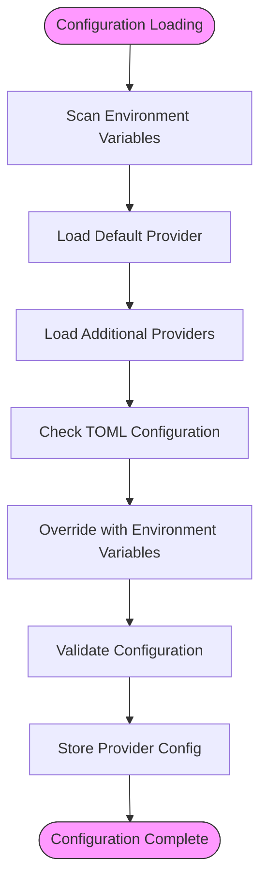
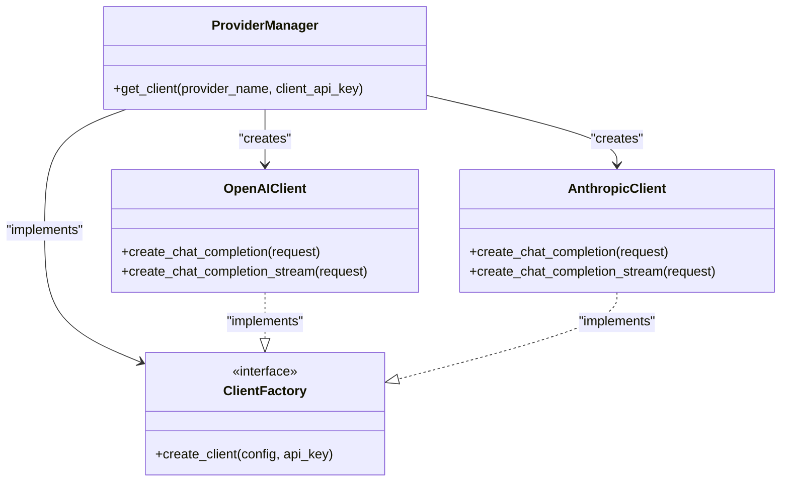
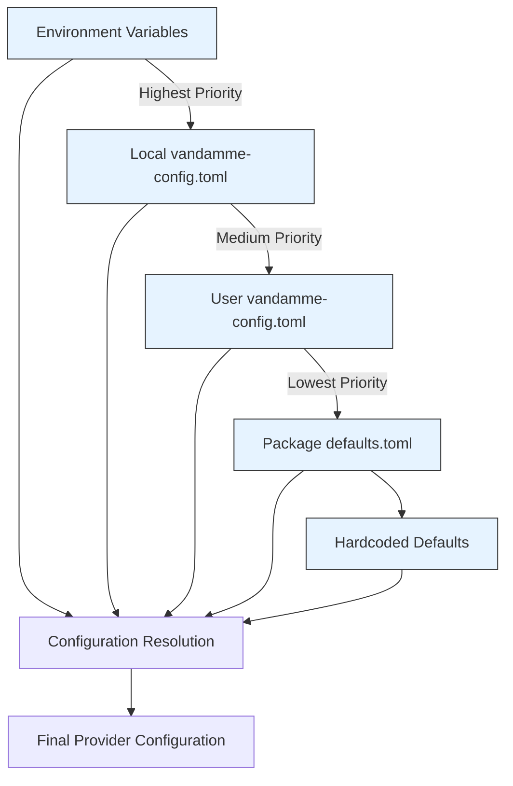
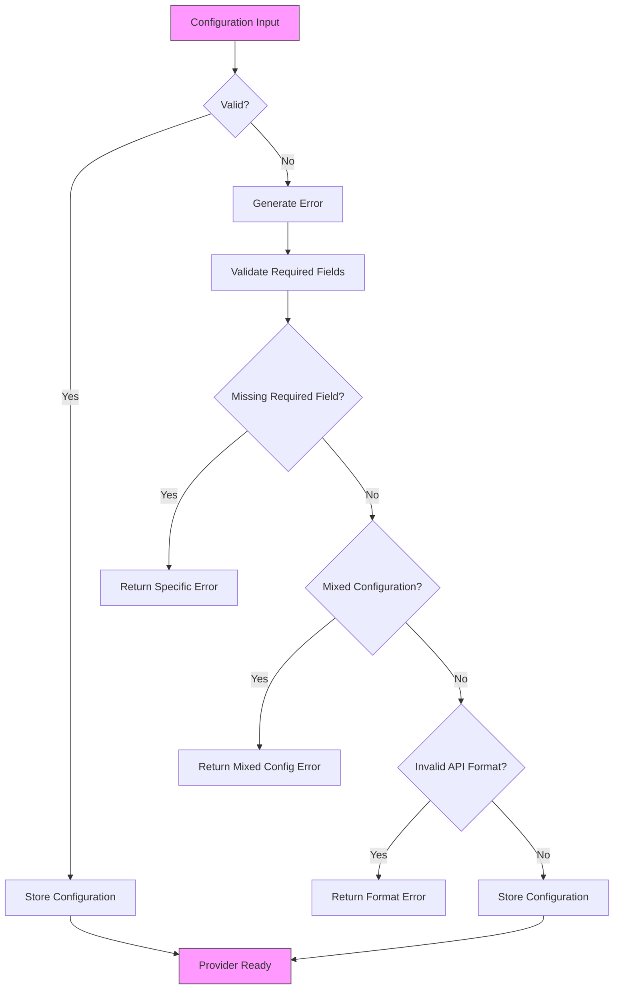
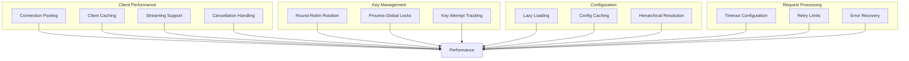
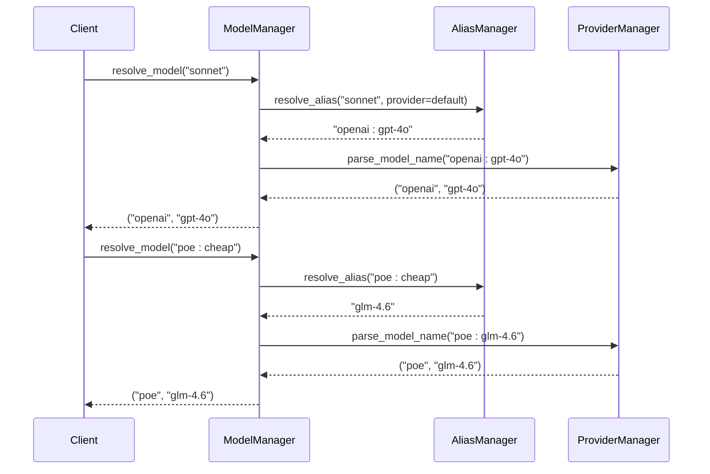
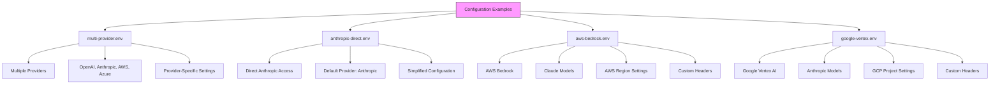

# Multi-Provider Support

<cite>
**Referenced Files in This Document**   
- [provider_manager.py](file://src/core/provider_manager.py)
- [provider_config.py](file://src/core/provider_config.py)
- [client.py](file://src/core/client.py)
- [anthropic_client.py](file://src/core/anthropic_client.py)
- [defaults.toml](file://src/config/defaults.toml)
- [alias_config.py](file://src/core/alias_config.py)
- [model_manager.py](file://src/core/model_manager.py)
- [provider_context.py](file://src/api/services/provider_context.py)
- [multi-provider.env](file://examples/multi-provider.env)
- [anthropic-direct.env](file://examples/anthropic-direct.env)
- [aws-bedrock.env](file://examples/aws-bedrock.env)
- [google-vertex.env](file://examples/google-vertex.env)
</cite>

## Table of Contents
1. [Introduction](#introduction)
2. [ProviderManager Architecture](#providermanager-architecture)
3. [Provider Routing Mechanism](#provider-routing-mechanism)
4. [Configuration Management](#configuration-management)
5. [Factory Pattern and Client Creation](#factory-pattern-and-client-creation)
6. [Hierarchical Configuration Loading](#hierarchical-configuration-loading)
7. [Error Handling and Validation](#error-handling-and-validation)
8. [Performance Considerations](#performance-considerations)
9. [Integration with Alias System](#integration-with-alias-system)
10. [Practical Configuration Examples](#practical-configuration-examples)

## Introduction

The vandamme-proxy system implements a sophisticated multi-provider support architecture that enables seamless integration with various LLM providers including OpenAI, Anthropic, Poe, Azure, Gemini, and AWS Bedrock. At the core of this system is the ProviderManager class, which orchestrates provider configuration, routing, and client management through a flexible and extensible design. The system supports both static API key configurations and client key passthrough modes, allowing for diverse deployment scenarios from simple single-provider setups to complex multi-tenant environments. This documentation details the architecture and implementation of the multi-provider system, focusing on the ProviderManager class and its interactions with configuration management, routing mechanisms, and client creation patterns.

## ProviderManager Architecture

The ProviderManager class serves as the central orchestrator for managing multiple LLM providers within the vandamme-proxy system. It implements a singleton-like pattern through lazy initialization, ensuring that provider configurations are loaded only when needed during request processing. The architecture follows a clear separation of concerns, with distinct responsibilities for configuration loading, client management, and middleware integration. The ProviderManager maintains internal dictionaries for storing provider configurations (`_configs`) and instantiated clients (`_clients`), enabling efficient lookup and reuse of resources. It also manages process-global state for API key rotation through `_api_key_locks` and `_api_key_indices`, ensuring thread-safe operation when multiple requests access the same provider. The class implements a comprehensive error handling system that provides meaningful feedback when provider configurations are invalid or incomplete.

**Diagram sources**
- [provider_manager.py](file://src/core/provider_manager.py#L29-L586)
- [provider_config.py](file://src/core/provider_config.py#L7-L102)

**Section sources**
- [provider_manager.py](file://src/core/provider_manager.py#L29-L586)
- [provider_config.py](file://src/core/provider_config.py#L7-L102)

## Provider Routing Mechanism

The provider routing mechanism in vandamme-proxy uses a simple yet powerful 'provider:model' syntax to direct requests to specific LLM providers. This syntax allows clients to explicitly specify which provider should handle a request by prefixing the model name with the provider identifier followed by a colon. For example, 'openai:gpt-4o' routes the request to the OpenAI provider, while 'anthropic:claude-3-5-sonnet' directs it to Anthropic. When no provider prefix is specified, the system uses the default provider configured through environment variables or TOML files. The routing process is implemented in the `parse_model_name` method of the ProviderManager class, which parses the model string and returns a tuple containing the provider name and the actual model name. This mechanism enables fine-grained control over provider selection while maintaining backward compatibility with existing client applications.

**Diagram sources**
- [provider_manager.py](file://src/core/provider_manager.py#L408-L417)
- [model_manager.py](file://src/core/model_manager.py#L19-L91)
- [provider_context.py](file://src/api/services/provider_context.py#L21-L58)

**Section sources**
- [provider_manager.py](file://src/core/provider_manager.py#L408-L417)
- [model_manager.py](file://src/core/model_manager.py#L19-L91)
- [provider_context.py](file://src/api/services/provider_context.py#L21-L58)

## Configuration Management

The multi-provider system implements a comprehensive configuration management approach that supports multiple sources and formats. Provider configurations are primarily defined through environment variables, with each provider requiring specific environment variables such as `{PROVIDER}_API_KEY`, `{PROVIDER}_BASE_URL`, and `{PROVIDER}_API_VERSION`. The system automatically discovers providers by scanning for environment variables ending with `_API_KEY`, allowing for dynamic provider registration without code changes. In addition to environment variables, the system supports TOML-based configuration files that provide default values and additional settings. The configuration loading process follows a hierarchical approach, with environment variables taking precedence over TOML configurations, which in turn override hardcoded defaults. This layered approach enables flexible deployment scenarios, from simple environment-based configurations to complex setups with multiple configuration sources.

**Diagram sources**
- [provider_manager.py](file://src/core/provider_manager.py#L91-L108)
- [provider_config.py](file://src/core/provider_config.py#L7-L102)
- [alias_config.py](file://src/core/alias_config.py#L27-L224)

**Section sources**
- [provider_manager.py](file://src/core/provider_manager.py#L91-L108)
- [provider_config.py](file://src/core/provider_config.py#L7-L102)
- [alias_config.py](file://src/core/alias_config.py#L27-L224)

## Factory Pattern and Client Creation

The vandamme-proxy system implements a factory pattern for dynamic provider client creation, enabling lazy loading and efficient resource management. The ProviderManager class acts as a factory that creates and manages client instances for different providers based on their API format. When a client is requested through the `get_client` method, the ProviderManager checks if a client for the specified provider already exists in its cache. If not, it creates a new client instance based on the provider's configuration, particularly the `api_format` setting which determines whether to instantiate an OpenAIClient or AnthropicClient. This factory approach enables several key benefits: clients are created only when needed (lazy loading), multiple requests to the same provider can share the same client instance, and the system can support different client types (OpenAI vs Anthropic) through a consistent interface. The factory also handles special cases such as passthrough providers, where the client is configured to use the client's API key rather than a static provider key.

**Diagram sources**
- [provider_manager.py](file://src/core/provider_manager.py#L419-L473)
- [client.py](file://src/core/client.py#L32-L352)
- [anthropic_client.py](file://src/core/anthropic_client.py#L25-L271)

**Section sources**
- [provider_manager.py](file://src/core/provider_manager.py#L419-L473)
- [client.py](file://src/core/client.py#L32-L352)
- [anthropic_client.py](file://src/core/anthropic_client.py#L25-L271)

## Hierarchical Configuration Loading

The vandamme-proxy system implements a hierarchical configuration loading process that combines environment variables, user configuration files, and package defaults to provide flexible and robust configuration management. The loading process begins with environment variables, which have the highest precedence and allow for runtime configuration and deployment-specific settings. When environment variables are not present, the system looks for configuration in TOML files, starting with local overrides (`vandamme-config.toml` in the current directory), then user-specific configurations (`~/.config/vandamme-proxy/vandamme-config.toml`), and finally package defaults (`src/config/defaults.toml`). This hierarchy enables a powerful configuration cascade where local settings can override user preferences, which in turn override system defaults. The system also supports provider-specific configuration options such as custom headers, timeouts, and retry limits, allowing for fine-tuned control over each provider's behavior.

**Diagram sources**
- [provider_manager.py](file://src/core/provider_manager.py#L145-L321)
- [alias_config.py](file://src/core/alias_config.py#L32-L155)
- [defaults.toml](file://src/config/defaults.toml#L1-L89)

**Section sources**
- [provider_manager.py](file://src/core/provider_manager.py#L145-L321)
- [alias_config.py](file://src/core/alias_config.py#L32-L155)
- [defaults.toml](file://src/config/defaults.toml#L1-L89)

## Error Handling and Validation

The multi-provider system implements comprehensive error handling and validation to ensure robust operation in various deployment scenarios. The ProviderConfig class includes a `__post_init__` method that validates configuration parameters such as provider name, API key, base URL, and API format, raising descriptive errors when requirements are not met. The system specifically prevents mixed configurations where passthrough mode (`!PASSTHRU`) is combined with static API keys, ensuring clear and predictable behavior. During provider loading, the system tracks load results through the ProviderLoadResult class, capturing success, partial, and failure states with detailed messages. This information is used to generate informative summaries through the `print_provider_summary` method, which displays provider status, API key hashes, and base URLs. The client classes also implement sophisticated error handling for API interactions, including automatic key rotation on authentication failures and proper mapping of provider-specific error messages to standardized HTTP responses.

**Diagram sources**
- [provider_config.py](file://src/core/provider_config.py#L69-L97)
- [provider_manager.py](file://src/core/provider_manager.py#L244-L321)
- [client.py](file://src/core/client.py#L23-L219)

**Section sources**
- [provider_config.py](file://src/core/provider_config.py#L69-L97)
- [provider_manager.py](file://src/core/provider_manager.py#L244-L321)
- [client.py](file://src/core/client.py#L23-L219)

## Performance Considerations

The multi-provider system incorporates several performance optimizations to handle multiple upstream services efficiently. The client classes implement connection pooling through cached HTTP clients, reducing the overhead of establishing new connections for each request. The ProviderManager maintains a cache of client instances, allowing multiple requests to reuse the same client and avoiding the cost of repeated client initialization. For providers with multiple API keys, the system implements round-robin key rotation with process-global locks to ensure thread-safe operation while distributing load across available keys. The system also supports streaming responses with proper cancellation handling, allowing long-running requests to be terminated gracefully without resource leaks. Configuration loading is designed to be lazy, with providers loaded only when first accessed, reducing startup time and memory usage. The system also includes configurable timeouts and retry limits, allowing administrators to tune performance characteristics based on their specific deployment requirements and provider capabilities.

**Diagram sources**
- [client.py](file://src/core/client.py#L53-L86)
- [provider_manager.py](file://src/core/provider_manager.py#L44-L46)
- [anthropic_client.py](file://src/core/anthropic_client.py#L50-L54)
- [client.py](file://src/core/client.py#L109-L137)

**Section sources**
- [client.py](file://src/core/client.py#L53-L86)
- [provider_manager.py](file://src/core/provider_manager.py#L44-L46)
- [anthropic_client.py](file://src/core/anthropic_client.py#L50-L54)

## Integration with Alias System

The multi-provider system integrates closely with the alias system to provide flexible model name resolution and provider abstraction. The ModelManager class coordinates between the ProviderManager and AliasManager to resolve model names through a multi-step process: first applying alias resolution if available, then parsing the provider prefix, and finally returning the resolved provider and model name. This integration allows users to define aliases in TOML configuration files that can reference specific providers or use provider-specific aliases. For example, an alias 'haiku' might resolve to different models depending on the context provider, enabling consistent naming across different providers. The system also supports cross-provider aliases, where an alias can reference a model on a different provider, facilitating migration between providers or cost-based routing. The alias resolution process is designed to be efficient, with caching mechanisms to avoid repeated parsing and resolution operations.

**Diagram sources**
- [model_manager.py](file://src/core/model_manager.py#L19-L91)
- [alias_config.py](file://src/core/alias_config.py#L157-L175)
- [provider_manager.py](file://src/core/provider_manager.py#L408-L417)

**Section sources**
- [model_manager.py](file://src/core/model_manager.py#L19-L91)
- [alias_config.py](file://src/core/alias_config.py#L157-L175)

## Practical Configuration Examples

The vandamme-proxy system provides several practical configuration examples that demonstrate different deployment scenarios for the multi-provider system. The `multi-provider.env` example shows how to configure multiple providers including OpenAI, Anthropic, AWS Bedrock, and Azure, with each provider having its own API key and base URL. This configuration enables clients to route requests to different providers using the 'provider:model' syntax. The `anthropic-direct.env` example demonstrates a simple setup with direct Anthropic API access, setting the default provider to Anthropic. The `aws-bedrock.env` example shows configuration for AWS Bedrock with Claude models, including AWS-specific settings like region and custom headers. The `google-vertex.env` example illustrates configuration for Google Vertex AI with Anthropic models, including Google Cloud project settings. These examples provide templates for common use cases and can be customized based on specific requirements, such as adding custom headers, adjusting timeouts, or configuring multiple API keys for load balancing and failover.

**Diagram sources**
- [multi-provider.env](file://examples/multi-provider.env#L1-L48)
- [anthropic-direct.env](file://examples/anthropic-direct.env#L1-L22)
- [aws-bedrock.env](file://examples/aws-bedrock.env#L1-L32)
- [google-vertex.env](file://examples/google-vertex.env#L1-L32)

**Section sources**
- [multi-provider.env](file://examples/multi-provider.env#L1-L48)
- [anthropic-direct.env](file://examples/anthropic-direct.env#L1-L22)
- [aws-bedrock.env](file://examples/aws-bedrock.env#L1-L32)
- [google-vertex.env](file://examples/google-vertex.env#L1-L32)