# Request Orchestrator

<cite>
**Referenced Files in This Document**
- [request_orchestrator.py](file://src/api/orchestrator/request_orchestrator.py)
- [request_context.py](file://src/api/context/request_context.py)
- [request_builder.py](file://src/api/services/request_builder.py)
- [endpoint_requests.py](file://src/api/models/endpoint_requests.py)
- [endpoint_responses.py](file://src/api/models/endpoint_responses.py)
- [v1.py](file://src/api/routers/v1.py)
- [model_manager.py](file://src/core/model_manager.py)
- [provider_manager.py](file://src/core/provider_manager.py)
- [config.py](file://src/core/config/config.py)
- [claude.py](file://src/models/claude.py)
- [request_converter.py](file://src/conversion/request_converter.py)
- [endpoints.py](file://src/api/endpoints.py)
- [metrics_helper.py](file://src/api/services/metrics_helper.py)
- [runtime.py](file://src/core/metrics/runtime.py)
- [base.py](file://src/middleware/base.py)
- [test_request_orchestrator.py](file://tests/api/orchestrator/test_request_orchestrator.py)
- [test_request_orchestrator_error_paths.py](file://tests/api/orchestrator/test_request_orchestrator_error_paths.py)
</cite>

## Table of Contents
1. [Introduction](#introduction)
2. [Project Structure](#project-structure)
3. [Core Components](#core-components)
4. [Architecture Overview](#architecture-overview)
5. [Detailed Component Analysis](#detailed-component-analysis)
6. [Dependency Analysis](#dependency-analysis)
7. [Performance Considerations](#performance-considerations)
8. [Troubleshooting Guide](#troubleshooting-guide)
9. [Conclusion](#conclusion)
10. [Appendices](#appendices)

## Introduction
This document explains the Request Orchestrator, the central initialization and preparation layer for incoming Claude Messages API requests. It consolidates provider resolution, request conversion, authentication, metrics, middleware preprocessing, and client acquisition into a single, testable flow. The orchestrator produces a RequestContext that downstream handlers use to route to the correct provider and execute the request.

## Project Structure
The orchestrator lives in the API layer and integrates with core services for model resolution, provider configuration, and middleware. The request lifecycle begins at the FastAPI router and ends with a response or streaming stream.

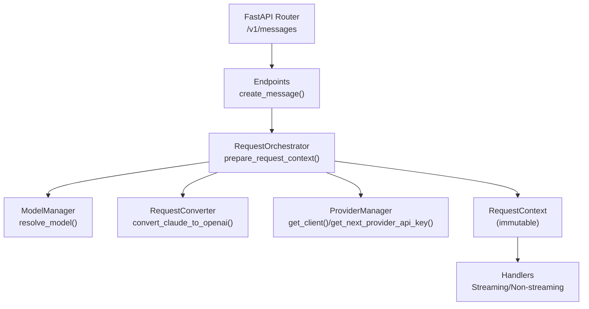

**Diagram sources**
- [v1.py](file://src/api/routers/v1.py#L1-L34)
- [endpoints.py](file://src/api/endpoints.py#L201-L246)
- [request_orchestrator.py](file://src/api/orchestrator/request_orchestrator.py#L56-L177)
- [model_manager.py](file://src/core/model_manager.py#L17-L90)
- [request_converter.py](file://src/conversion/request_converter.py#L80-L104)
- [provider_manager.py](file://src/core/provider_manager.py#L432-L486)
- [request_context.py](file://src/api/context/request_context.py#L11-L115)

**Section sources**
- [v1.py](file://src/api/routers/v1.py#L1-L34)
- [endpoints.py](file://src/api/endpoints.py#L201-L246)

## Core Components
- RequestOrchestrator: Central initializer that builds a RequestContext from a Claude request.
- RequestContext: Immutable container holding all request-related data and computed properties.
- ModelManager: Resolves aliases and provider prefixes to a concrete provider and model.
- ProviderManager: Loads provider configs, manages clients, and rotates API keys.
- RequestConverter: Translates Claude Messages API to OpenAI-compatible format.
- MiddlewareChain: Optional pre/post-processing pipeline for request messages.
- Metrics helpers: Populate request metrics and tie into the RequestTracker.

**Section sources**
- [request_orchestrator.py](file://src/api/orchestrator/request_orchestrator.py#L27-L177)
- [request_context.py](file://src/api/context/request_context.py#L11-L115)
- [model_manager.py](file://src/core/model_manager.py#L17-L90)
- [provider_manager.py](file://src/core/provider_manager.py#L432-L486)
- [request_converter.py](file://src/conversion/request_converter.py#L80-L104)
- [base.py](file://src/middleware/base.py#L191-L398)
- [metrics_helper.py](file://src/api/services/metrics_helper.py#L38-L78)

## Architecture Overview
The orchestrator coordinates multiple subsystems to produce a fully prepared context for handlers.

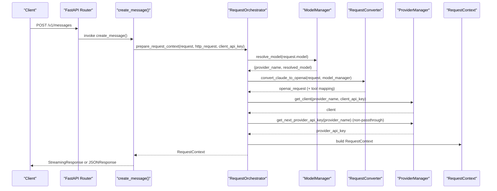

**Diagram sources**
- [endpoints.py](file://src/api/endpoints.py#L201-L246)
- [request_orchestrator.py](file://src/api/orchestrator/request_orchestrator.py#L56-L177)
- [model_manager.py](file://src/core/model_manager.py#L17-L90)
- [request_converter.py](file://src/conversion/request_converter.py#L80-L104)
- [provider_manager.py](file://src/core/provider_manager.py#L432-L486)

## Detailed Component Analysis

### RequestOrchestrator
Responsibilities:
- Generates request ID and timing
- Initializes metrics/tracker when enabled
- Resolves provider and model
- Converts Claude request to OpenAI format
- Validates passthrough vs. provider API key usage
- Populates request metrics (size, counts)
- Retrieves provider client
- Applies middleware preprocessing
- Checks client disconnect and cleans up metrics

Key behaviors:
- Authentication:
  - Passthrough providers require a client API key; otherwise a 401 is raised.
  - Non-passthrough providers rotate provider API keys via ProviderManager.
- Middleware:
  - If configured, transforms messages before provider dispatch.
- Disconnect handling:
  - If the client disconnects early, records metrics and raises 499.

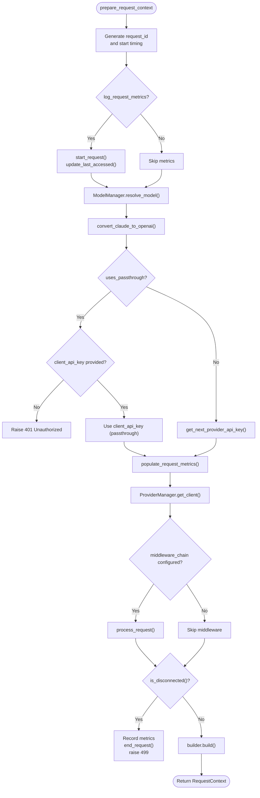

**Diagram sources**
- [request_orchestrator.py](file://src/api/orchestrator/request_orchestrator.py#L56-L177)
- [metrics_helper.py](file://src/api/services/metrics_helper.py#L38-L78)
- [runtime.py](file://src/core/metrics/runtime.py#L20-L29)

**Section sources**
- [request_orchestrator.py](file://src/api/orchestrator/request_orchestrator.py#L56-L177)
- [test_request_orchestrator.py](file://tests/api/orchestrator/test_request_orchestrator.py#L69-L118)
- [test_request_orchestrator.py](file://tests/api/orchestrator/test_request_orchestrator.py#L185-L244)
- [test_request_orchestrator.py](file://tests/api/orchestrator/test_request_orchestrator.py#L307-L368)

### RequestContext and Builder
RequestContext is an immutable dataclass that carries:
- Core request and converted OpenAI request
- Identity and tracking (request_id, http_request)
- Provider context (provider_name, resolved_model, provider_config)
- Authentication (client_api_key, provider_api_key)
- Tool mapping (inverse tool name map)
- Client and metrics/tracker
- Timing and sizing metrics

RequestContextBuilder enables incremental construction and validation of required fields.

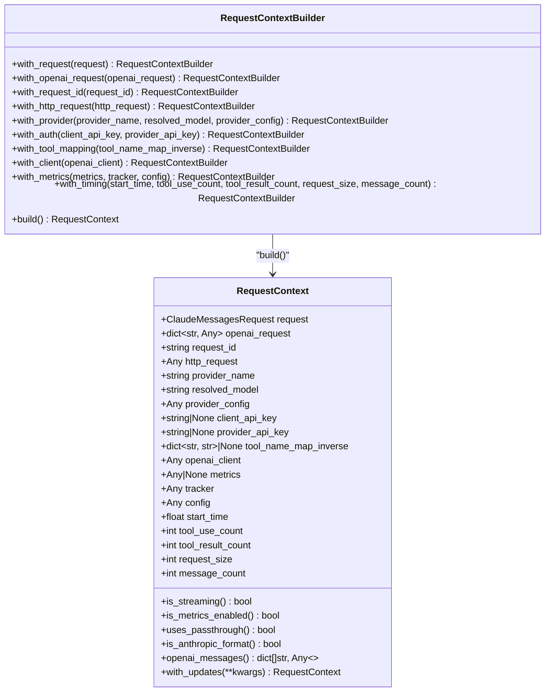

**Diagram sources**
- [request_context.py](file://src/api/context/request_context.py#L11-L257)

**Section sources**
- [request_context.py](file://src/api/context/request_context.py#L11-L257)

### Model Resolution and Provider Selection
ModelManager resolves aliases and provider prefixes, returning (provider_name, actual_model). ProviderManager parses model names and loads provider configurations, selects default providers, and creates clients.

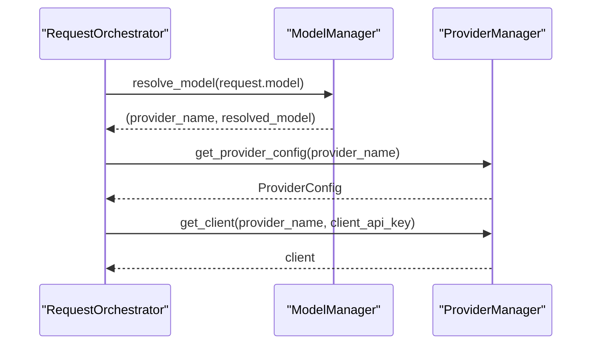

**Diagram sources**
- [model_manager.py](file://src/core/model_manager.py#L17-L90)
- [provider_manager.py](file://src/core/provider_manager.py#L421-L486)
- [request_orchestrator.py](file://src/api/orchestrator/request_orchestrator.py#L94-L144)

**Section sources**
- [model_manager.py](file://src/core/model_manager.py#L17-L90)
- [provider_manager.py](file://src/core/provider_manager.py#L421-L486)

### Request Conversion
The orchestrator converts Claude Messages API requests to OpenAI-compatible format using a pipeline-based converter. Tool name maps and provider format are considered during conversion.

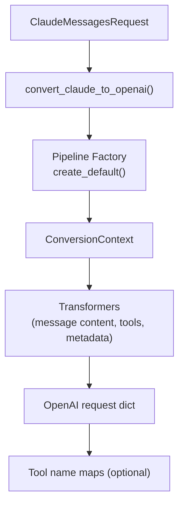

**Diagram sources**
- [request_converter.py](file://src/conversion/request_converter.py#L80-L104)
- [request_converter.py](file://src/conversion/request_converter.py#L106-L147)

**Section sources**
- [request_converter.py](file://src/conversion/request_converter.py#L80-L104)
- [request_converter.py](file://src/conversion/request_converter.py#L106-L147)

### Middleware Preprocessing
If configured, the orchestrator invokes the middleware chain to modify messages before provider dispatch. The middleware operates on a request context with messages, provider, model, and request_id.

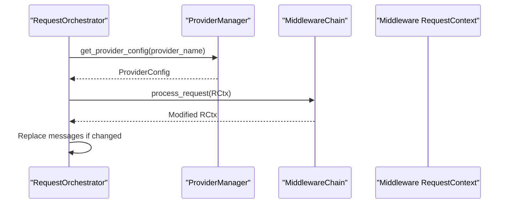

**Diagram sources**
- [request_orchestrator.py](file://src/api/orchestrator/request_orchestrator.py#L246-L280)
- [base.py](file://src/middleware/base.py#L253-L298)

**Section sources**
- [request_orchestrator.py](file://src/api/orchestrator/request_orchestrator.py#L246-L280)
- [base.py](file://src/middleware/base.py#L253-L298)

### Authentication and Provider API Keys
- Passthrough providers: require client_api_key; otherwise 401 Unauthorized.
- Non-passthrough providers: rotate provider API keys via ProviderManager’s round-robin mechanism.

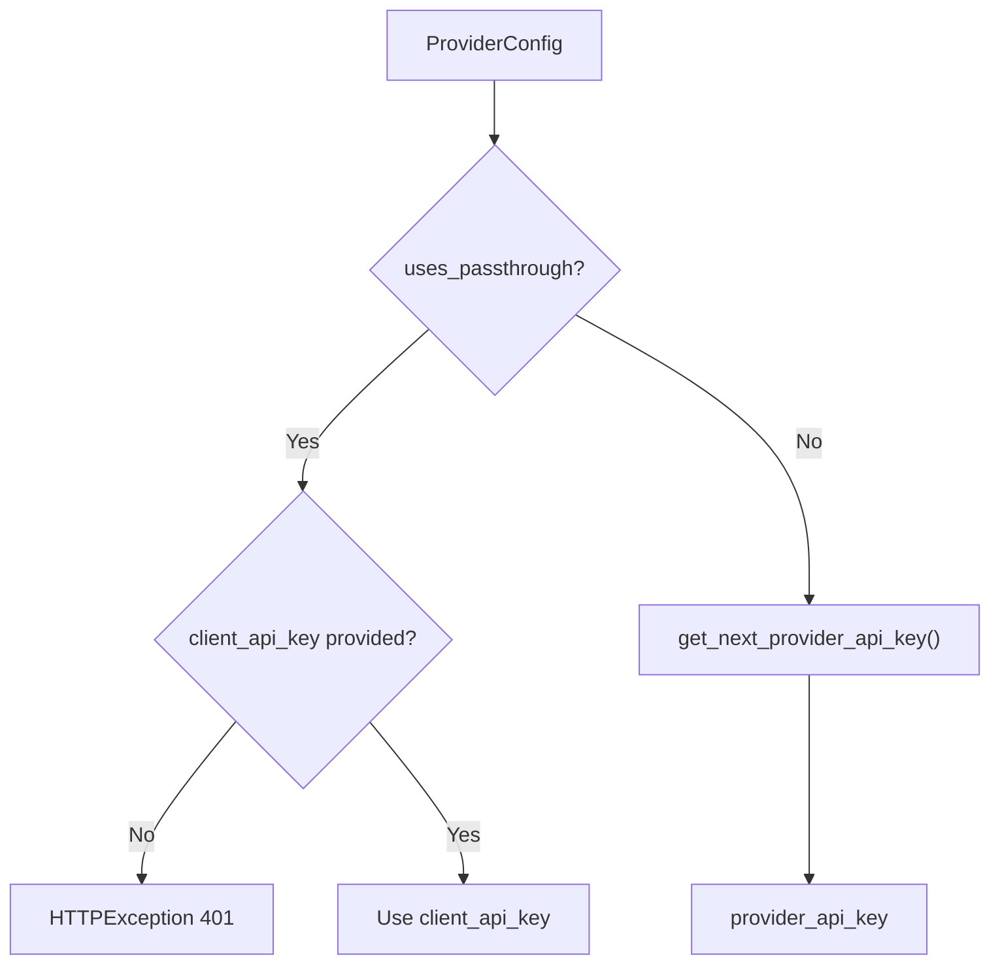

**Diagram sources**
- [request_orchestrator.py](file://src/api/orchestrator/request_orchestrator.py#L214-L245)
- [provider_manager.py](file://src/core/provider_manager.py#L487-L510)

**Section sources**
- [request_orchestrator.py](file://src/api/orchestrator/request_orchestrator.py#L214-L245)
- [provider_manager.py](file://src/core/provider_manager.py#L487-L510)

### Metrics and Tracking
When enabled, the orchestrator starts a request in the RequestTracker, updates last accessed timestamps, and populates metrics such as request size, message count, and tool usage. On disconnect, it marks an error and ends the request.

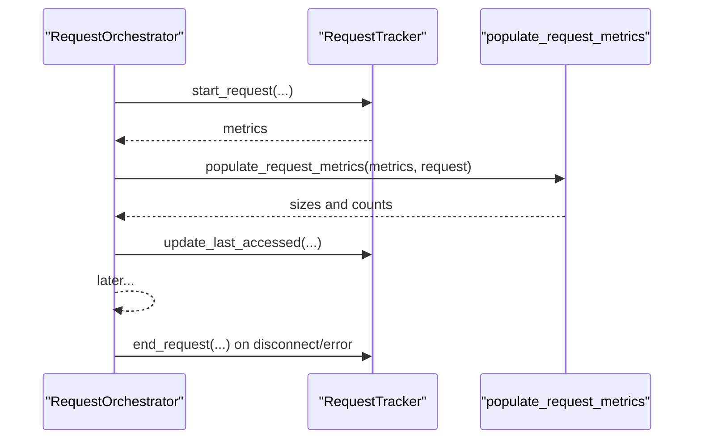

**Diagram sources**
- [request_orchestrator.py](file://src/api/orchestrator/request_orchestrator.py#L179-L213)
- [metrics_helper.py](file://src/api/services/metrics_helper.py#L38-L78)
- [runtime.py](file://src/core/metrics/runtime.py#L20-L29)

**Section sources**
- [request_orchestrator.py](file://src/api/orchestrator/request_orchestrator.py#L179-L213)
- [metrics_helper.py](file://src/api/services/metrics_helper.py#L38-L78)
- [runtime.py](file://src/core/metrics/runtime.py#L20-L29)

### Endpoint Integration
The /v1/messages endpoint delegates all initialization to the orchestrator, then routes to streaming or non-streaming handlers based on the RequestContext.

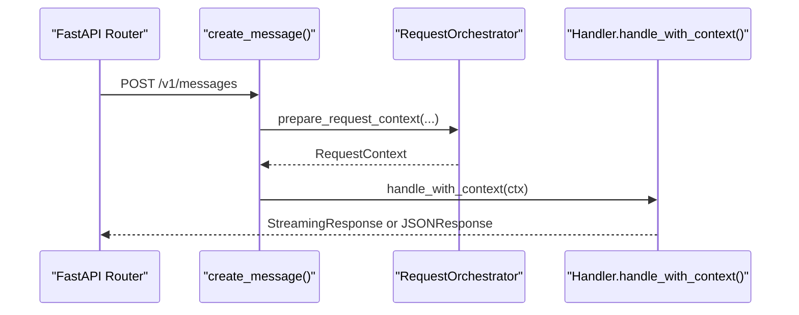

**Diagram sources**
- [v1.py](file://src/api/routers/v1.py#L1-L34)
- [endpoints.py](file://src/api/endpoints.py#L201-L246)

**Section sources**
- [v1.py](file://src/api/routers/v1.py#L1-L34)
- [endpoints.py](file://src/api/endpoints.py#L201-L246)

## Dependency Analysis
High-level dependencies among orchestrator components:

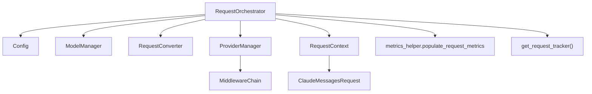

**Diagram sources**
- [request_orchestrator.py](file://src/api/orchestrator/request_orchestrator.py#L44-L177)
- [config.py](file://src/core/config/config.py#L217-L228)
- [model_manager.py](file://src/core/model_manager.py#L17-L90)
- [request_converter.py](file://src/conversion/request_converter.py#L80-L104)
- [provider_manager.py](file://src/core/provider_manager.py#L432-L486)
- [request_context.py](file://src/api/context/request_context.py#L11-L115)
- [metrics_helper.py](file://src/api/services/metrics_helper.py#L38-L78)
- [runtime.py](file://src/core/metrics/runtime.py#L20-L29)
- [claude.py](file://src/models/claude.py#L57-L80)

**Section sources**
- [request_orchestrator.py](file://src/api/orchestrator/request_orchestrator.py#L44-L177)
- [config.py](file://src/core/config/config.py#L217-L228)
- [provider_manager.py](file://src/core/provider_manager.py#L432-L486)

## Performance Considerations
- Conversion pipeline: The request conversion uses a pipeline of transformers; keep transformations minimal and efficient.
- Middleware: Each middleware adds latency; ensure only applicable middlewares are active.
- Metrics overhead: Enabling metrics introduces tracker calls; disable when throughput is critical.
- Provider client reuse: ProviderManager caches clients by provider; leverage this to avoid repeated client creation.
- API key rotation: Round-robin rotation is O(1) per key; ensure provider has multiple keys configured for high concurrency.

[No sources needed since this section provides general guidance]

## Troubleshooting Guide
Common issues and diagnostics:
- Passthrough provider without client key:
  - Symptom: 401 Unauthorized during authentication.
  - Cause: Provider configured for passthrough but client did not supply API key.
  - Fix: Provide a valid client API key or switch to a non-passthrough provider.
- Client disconnects before processing:
  - Symptom: 499 error; metrics recorded as client disconnect.
  - Action: Check network stability; reissue request if needed.
- Middleware exception:
  - Symptom: Exception raised inside middleware chain.
  - Action: Inspect middleware chain initialization and ensure proper error handling.
- Metrics tracker not configured:
  - Symptom: Runtime error when retrieving RequestTracker.
  - Action: Ensure RequestTracker is attached to app.state during startup.
- Provider not configured or API key missing:
  - Symptom: ValueError when resolving provider or retrieving client.
  - Action: Set provider environment variables and ensure base URL is configured.

**Section sources**
- [test_request_orchestrator.py](file://tests/api/orchestrator/test_request_orchestrator.py#L185-L244)
- [test_request_orchestrator.py](file://tests/api/orchestrator/test_request_orchestrator.py#L241-L305)
- [test_request_orchestrator_error_paths.py](file://tests/api/orchestrator/test_request_orchestrator_error_paths.py#L388-L480)
- [test_request_orchestrator_error_paths.py](file://tests/api/orchestrator/test_request_orchestrator_error_paths.py#L482-L525)
- [test_request_orchestrator_error_paths.py](file://tests/api/orchestrator/test_request_orchestrator_error_paths.py#L527-L626)
- [test_request_orchestrator_error_paths.py](file://tests/api/orchestrator/test_request_orchestrator_error_paths.py#L628-L775)
- [test_request_orchestrator_error_paths.py](file://tests/api/orchestrator/test_request_orchestrator_error_paths.py#L777-L800)

## Conclusion
The Request Orchestrator centralizes request initialization, ensuring consistent provider resolution, conversion, authentication, metrics, and middleware handling. By producing an immutable RequestContext, it simplifies downstream handlers and improves testability and maintainability.

[No sources needed since this section summarizes without analyzing specific files]

## Appendices

### Endpoint Request/Response DTOs
- Endpoint request DTOs: ModelsListRequest, TopModelsRequest
- Endpoint response DTOs: ModelsListResponse, TopModelsResponse

**Section sources**
- [endpoint_requests.py](file://src/api/models/endpoint_requests.py#L12-L116)
- [endpoint_responses.py](file://src/api/models/endpoint_responses.py#L13-L42)

### Supporting Models
- ClaudeMessagesRequest and related message/tool models used by the orchestrator.

**Section sources**
- [claude.py](file://src/models/claude.py#L57-L80)