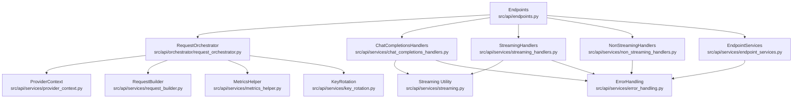
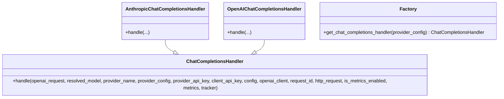
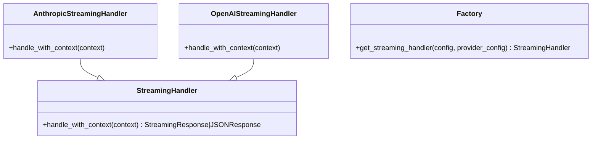
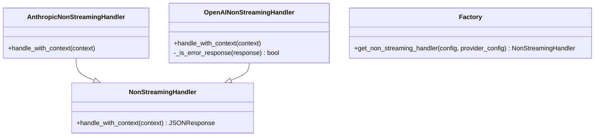
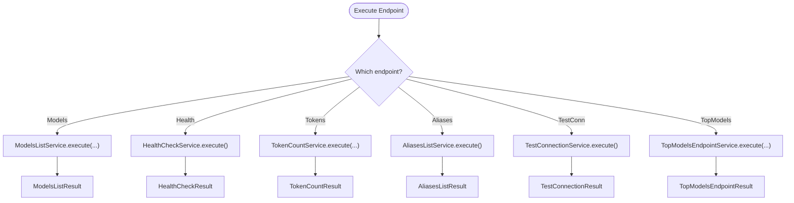
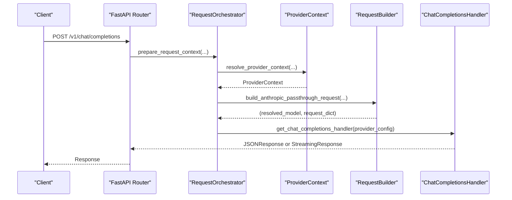
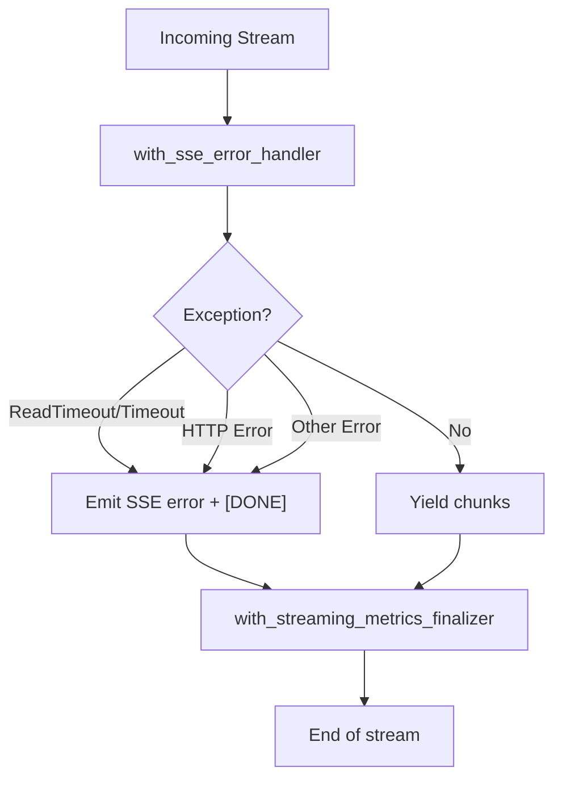
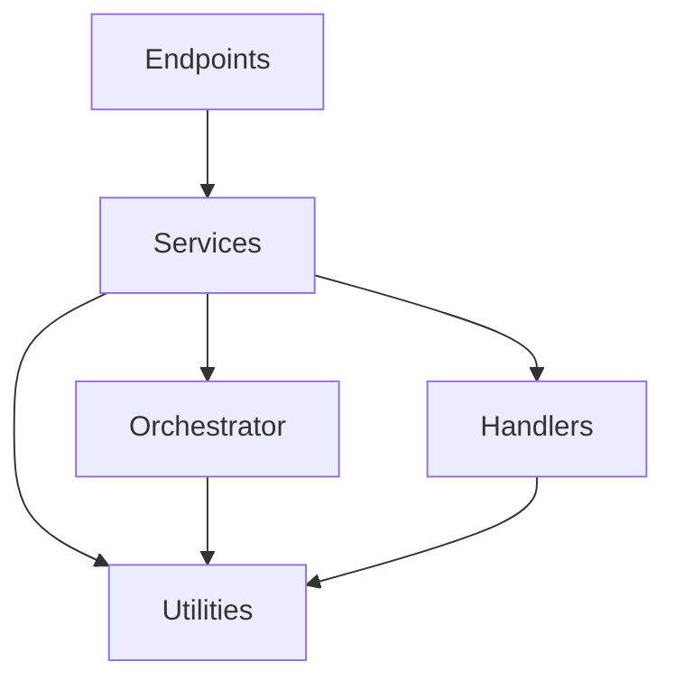

# Service Layer Architecture

<cite>
**Referenced Files in This Document**
- [src/api/services/chat_completions_handlers.py](file://src/api/services/chat_completions_handlers.py)
- [src/api/services/endpoint_services.py](file://src/api/services/endpoint_services.py)
- [src/api/services/request_builder.py](file://src/api/services/request_builder.py)
- [src/api/services/provider_context.py](file://src/api/services/provider_context.py)
- [src/api/services/streaming_handlers.py](file://src/api/services/streaming_handlers.py)
- [src/api/services/non_streaming_handlers.py](file://src/api/services/non_streaming_handlers.py)
- [src/api/services/key_rotation.py](file://src/api/services/key_rotation.py)
- [src/api/services/metrics_helper.py](file://src/api/services/metrics_helper.py)
- [src/api/services/error_handling.py](file://src/api/services/error_handling.py)
- [src/api/services/streaming.py](file://src/api/services/streaming.py)
- [src/api/services/alias_service.py](file://src/api/services/alias_service.py)
- [src/api/services/metrics_orchestrator.py](file://src/api/services/metrics_orchestrator.py)
- [src/api/orchestrator/request_orchestrator.py](file://src/api/orchestrator/request_orchestrator.py)
- [src/api/endpoints.py](file://src/api/endpoints.py)
</cite>

## Table of Contents
1. [Introduction](#introduction)
2. [Project Structure](#project-structure)
3. [Core Components](#core-components)
4. [Architecture Overview](#architecture-overview)
5. [Detailed Component Analysis](#detailed-component-analysis)
6. [Dependency Analysis](#dependency-analysis)
7. [Performance Considerations](#performance-considerations)
8. [Troubleshooting Guide](#troubleshooting-guide)
9. [Conclusion](#conclusion)

## Introduction
This document explains the Service Layer Architecture of the proxy, focusing on how business logic is encapsulated into cohesive, testable services. The architecture separates endpoint orchestration from provider-specific handling, request conversion, metrics, error handling, and streaming. It leverages strategy patterns for format-specific handlers and a robust metrics orchestration system to ensure consistent behavior across endpoints.

## Project Structure
The service layer resides primarily under src/api/services and integrates with src/api/orchestrator, src/api/context, and conversion utilities. Endpoints delegate to services for business logic, while services coordinate with providers, caches, and metrics.

```mermaid
graph TB
subgraph "Endpoints"
E1["/v1/chat/completions<br/>src/api/endpoints.py"]
E2["Other endpoints<br/>src/api/endpoints.py"]
end
subgraph "Orchestration"
O1["RequestOrchestrator<br/>src/api/orchestrator/request_orchestrator.py"]
end
subgraph "Services"
S1["ChatCompletionsHandlers<br/>src/api/services/chat_completions_handlers.py"]
S2["EndpointServices<br/>src/api/services/endpoint_services.py"]
S3["StreamingHandlers<br/>src/api/services/streaming_handlers.py"]
S4["NonStreamingHandlers<br/>src/api/services/non_streaming_handlers.py"]
S5["KeyRotation<br/>src/api/services/key_rotation.py"]
S6["MetricsHelper<br/>src/api/services/metrics_helper.py"]
S7["ErrorHandling<br/>src/api/services/error_handling.py"]
S8["StreamingUtility<br/>src/api/services/streaming.py"]
S9["ProviderContext<br/>src/api/services/provider_context.py"]
S10["RequestBuilder<br/>src/api/services/request_builder.py"]
S11["AliasService<br/>src/api/services/alias_service.py"]
S12["MetricsOrchestrator<br/>src/api/services/metrics_orchestrator.py"]
end
E1 --> O1
E1 --> S1
E1 --> S12
E1 --> S9
E1 --> S10
E1 --> S5
E1 --> S6
E1 --> S8
E1 --> S7
E2 --> S2
E2 --> S11
```

**Diagram sources**
- [src/api/endpoints.py](file://src/api/endpoints.py#L117-L200)
- [src/api/orchestrator/request_orchestrator.py](file://src/api/orchestrator/request_orchestrator.py#L27-L178)
- [src/api/services/chat_completions_handlers.py](file://src/api/services/chat_completions_handlers.py#L17-L246)
- [src/api/services/endpoint_services.py](file://src/api/services/endpoint_services.py#L94-L800)
- [src/api/services/streaming_handlers.py](file://src/api/services/streaming_handlers.py#L35-L225)
- [src/api/services/non_streaming_handlers.py](file://src/api/services/non_streaming_handlers.py#L30-L270)
- [src/api/services/key_rotation.py](file://src/api/services/key_rotation.py#L14-L88)
- [src/api/services/metrics_helper.py](file://src/api/services/metrics_helper.py#L14-L78)
- [src/api/services/error_handling.py](file://src/api/services/error_handling.py#L19-L299)
- [src/api/services/streaming.py](file://src/api/services/streaming.py#L19-L243)
- [src/api/services/provider_context.py](file://src/api/services/provider_context.py#L15-L72)
- [src/api/services/request_builder.py](file://src/api/services/request_builder.py#L15-L41)
- [src/api/services/alias_service.py](file://src/api/services/alias_service.py#L65-L211)
- [src/api/services/metrics_orchestrator.py](file://src/api/services/metrics_orchestrator.py#L36-L285)

**Section sources**
- [src/api/endpoints.py](file://src/api/endpoints.py#L117-L200)
- [src/api/services/chat_completions_handlers.py](file://src/api/services/chat_completions_handlers.py#L17-L246)
- [src/api/services/endpoint_services.py](file://src/api/services/endpoint_services.py#L94-L800)
- [src/api/services/streaming_handlers.py](file://src/api/services/streaming_handlers.py#L35-L225)
- [src/api/services/non_streaming_handlers.py](file://src/api/services/non_streaming_handlers.py#L30-L270)
- [src/api/services/key_rotation.py](file://src/api/services/key_rotation.py#L14-L88)
- [src/api/services/metrics_helper.py](file://src/api/services/metrics_helper.py#L14-L78)
- [src/api/services/error_handling.py](file://src/api/services/error_handling.py#L19-L299)
- [src/api/services/streaming.py](file://src/api/services/streaming.py#L19-L243)
- [src/api/services/provider_context.py](file://src/api/services/provider_context.py#L15-L72)
- [src/api/services/request_builder.py](file://src/api/services/request_builder.py#L15-L41)
- [src/api/services/alias_service.py](file://src/api/services/alias_service.py#L65-L211)
- [src/api/services/metrics_orchestrator.py](file://src/api/services/metrics_orchestrator.py#L36-L285)
- [src/api/orchestrator/request_orchestrator.py](file://src/api/orchestrator/request_orchestrator.py#L27-L178)

## Core Components
- Strategy-based Handlers
  - ChatCompletionsHandlers: Encapsulates OpenAI and Anthropic format handling for /v1/chat/completions.
  - StreamingHandlers: Encapsulates streaming logic for OpenAI and Anthropic formats.
  - NonStreamingHandlers: Encapsulates non-streaming logic for OpenAI and Anthropic formats.
- Endpoint Services
  - ModelsListService, HealthCheckService, TokenCountService, AliasesListService, TestConnectionService, TopModelsEndpointService: Business logic for respective endpoints with structured results and error handling.
- Orchestration and Context
  - RequestOrchestrator: Centralizes request initialization, metrics, conversion, authentication, and middleware preprocessing.
  - ProviderContext: Resolves provider, model, and authentication context.
  - RequestBuilder: Builds provider-specific request dicts for passthrough scenarios.
- Utilities
  - KeyRotation: Manages provider API key rotation and passthrough selection.
  - MetricsHelper: Populates request metrics consistently.
  - ErrorHandling: Standardized error builders and streaming error finalization.
  - Streaming: SSE headers, streaming response composition, and error wrapping.
  - MetricsOrchestrator: Centralized metrics lifecycle management.

**Section sources**
- [src/api/services/chat_completions_handlers.py](file://src/api/services/chat_completions_handlers.py#L17-L246)
- [src/api/services/streaming_handlers.py](file://src/api/services/streaming_handlers.py#L35-L225)
- [src/api/services/non_streaming_handlers.py](file://src/api/services/non_streaming_handlers.py#L30-L270)
- [src/api/services/endpoint_services.py](file://src/api/services/endpoint_services.py#L94-L800)
- [src/api/orchestrator/request_orchestrator.py](file://src/api/orchestrator/request_orchestrator.py#L27-L178)
- [src/api/services/provider_context.py](file://src/api/services/provider_context.py#L15-L72)
- [src/api/services/request_builder.py](file://src/api/services/request_builder.py#L15-L41)
- [src/api/services/key_rotation.py](file://src/api/services/key_rotation.py#L14-L88)
- [src/api/services/metrics_helper.py](file://src/api/services/metrics_helper.py#L14-L78)
- [src/api/services/error_handling.py](file://src/api/services/error_handling.py#L19-L299)
- [src/api/services/streaming.py](file://src/api/services/streaming.py#L19-L243)
- [src/api/services/metrics_orchestrator.py](file://src/api/services/metrics_orchestrator.py#L36-L285)

## Architecture Overview
The service layer follows a layered design:
- Endpoints depend on services for business logic.
- Services depend on orchestrators, converters, and provider managers.
- Strategy patterns decouple format-specific logic (OpenAI vs Anthropic).
- MetricsOrchestrator ensures consistent metrics lifecycle across endpoints.
- ErrorHandling and Streaming utilities standardize error and streaming behavior.

**Diagram sources**
- [src/api/endpoints.py](file://src/api/endpoints.py#L117-L200)
- [src/api/orchestrator/request_orchestrator.py](file://src/api/orchestrator/request_orchestrator.py#L27-L178)
- [src/api/services/provider_context.py](file://src/api/services/provider_context.py#L15-L72)
- [src/api/services/request_builder.py](file://src/api/services/request_builder.py#L15-L41)
- [src/api/services/metrics_helper.py](file://src/api/services/metrics_helper.py#L14-L78)
- [src/api/services/key_rotation.py](file://src/api/services/key_rotation.py#L14-L88)
- [src/api/services/chat_completions_handlers.py](file://src/api/services/chat_completions_handlers.py#L17-L246)
- [src/api/services/streaming_handlers.py](file://src/api/services/streaming_handlers.py#L35-L225)
- [src/api/services/non_streaming_handlers.py](file://src/api/services/non_streaming_handlers.py#L30-L270)
- [src/api/services/streaming.py](file://src/api/services/streaming.py#L19-L243)
- [src/api/services/error_handling.py](file://src/api/services/error_handling.py#L19-L299)
- [src/api/services/endpoint_services.py](file://src/api/services/endpoint_services.py#L94-L800)

## Detailed Component Analysis

### Strategy Pattern: Chat Completions Handlers
- Purpose: Eliminate duplication between OpenAI and Anthropic formats in /v1/chat/completions.
- Classes:
  - ChatCompletionsHandler (abstract): Defines the handle interface.
  - AnthropicChatCompletionsHandler: Converts OpenAI to Anthropic, streams SSE, converts back to OpenAI format.
  - OpenAIChatCompletionsHandler: Passthrough OpenAI format, streams SSE directly.
- Factory: get_chat_completions_handler selects handler based on provider configuration.

**Diagram sources**
- [src/api/services/chat_completions_handlers.py](file://src/api/services/chat_completions_handlers.py#L17-L246)

**Section sources**
- [src/api/services/chat_completions_handlers.py](file://src/api/services/chat_completions_handlers.py#L17-L246)

### Strategy Pattern: Streaming Handlers
- Purpose: Encapsulate streaming logic for OpenAI and Anthropic formats.
- Classes:
  - StreamingHandler (abstract): Defines handle_with_context.
  - AnthropicStreamingHandler: Passthrough to Anthropic; applies error handling and metrics finalization.
  - OpenAIStreamingHandler: Converts OpenAI stream to Claude format; supports middleware wrapping; applies error handling and metrics finalization.
- Factory: get_streaming_handler selects handler based on provider configuration.

**Diagram sources**
- [src/api/services/streaming_handlers.py](file://src/api/services/streaming_handlers.py#L35-L225)

**Section sources**
- [src/api/services/streaming_handlers.py](file://src/api/services/streaming_handlers.py#L35-L225)

### Strategy Pattern: Non-Streaming Handlers
- Purpose: Encapsulate non-streaming logic for OpenAI and Anthropic formats.
- Classes:
  - NonStreamingHandler (abstract): Defines handle_with_context.
  - AnthropicNonStreamingHandler: Passthrough to Anthropic; updates metrics; supports middleware post-processing.
  - OpenAINonStreamingHandler: Calls OpenAI, validates error responses, extracts usage and tool call counts, converts to Claude format, logs success.
- Factory: get_non_streaming_handler selects handler based on provider configuration.

**Diagram sources**
- [src/api/services/non_streaming_handlers.py](file://src/api/services/non_streaming_handlers.py#L30-L270)

**Section sources**
- [src/api/services/non_streaming_handlers.py](file://src/api/services/non_streaming_handlers.py#L30-L270)

### Endpoint Services: Business Logic Abstraction
- ModelsListService: Provider resolution, caching, format conversion, error handling.
- HealthCheckService: Gathers provider info and returns health YAML; graceful degradation.
- TokenCountService: Attempts provider-specific token counting; falls back to character-based estimation.
- AliasesListService: Retrieves active aliases and overlays suggested aliases from top-models.
- TestConnectionService: Validates connectivity to default provider with minimal request.
- TopModelsEndpointService: Fetches curated models and transforms to API response format.

**Diagram sources**
- [src/api/services/endpoint_services.py](file://src/api/services/endpoint_services.py#L94-L800)

**Section sources**
- [src/api/services/endpoint_services.py](file://src/api/services/endpoint_services.py#L94-L800)

### Orchestration and Context
- RequestOrchestrator: Generates request ID, initializes metrics/tracker, resolves provider/model, converts request, validates authentication, prepares client, applies middleware, checks client disconnect, and builds RequestContext.
- ProviderContext: Resolves provider/model, enforces passthrough requirements, selects API key for non-passthrough providers.
- RequestBuilder: Builds Anthropic passthrough request with resolved model and provider marker.

**Diagram sources**
- [src/api/orchestrator/request_orchestrator.py](file://src/api/orchestrator/request_orchestrator.py#L27-L178)
- [src/api/services/provider_context.py](file://src/api/services/provider_context.py#L15-L72)
- [src/api/services/request_builder.py](file://src/api/services/request_builder.py#L15-L41)
- [src/api/services/chat_completions_handlers.py](file://src/api/services/chat_completions_handlers.py#L234-L246)
- [src/api/endpoints.py](file://src/api/endpoints.py#L117-L200)

**Section sources**
- [src/api/orchestrator/request_orchestrator.py](file://src/api/orchestrator/request_orchestrator.py#L27-L178)
- [src/api/services/provider_context.py](file://src/api/services/provider_context.py#L15-L72)
- [src/api/services/request_builder.py](file://src/api/services/request_builder.py#L15-L41)
- [src/api/services/chat_completions_handlers.py](file://src/api/services/chat_completions_handlers.py#L234-L246)
- [src/api/endpoints.py](file://src/api/endpoints.py#L117-L200)

### Utilities and Cross-Cutting Concerns
- KeyRotation: Creates next-key function for rotation; builds api_key and next_api_key params for upstream calls.
- MetricsHelper: Counts tool calls and populates message count, request size, and tool counts for logging.
- ErrorHandling: Centralized builders for consistent error responses; streaming error finalization and classification.
- Streaming: SSE headers, streaming response composition, and error wrapping with standardized events and [DONE].
- MetricsOrchestrator: Initializes and finalizes metrics consistently; updates provider resolution; handles timeout and error finalization.

**Diagram sources**
- [src/api/services/streaming.py](file://src/api/services/streaming.py#L105-L195)
- [src/api/services/streaming.py](file://src/api/services/streaming.py#L197-L243)

**Section sources**
- [src/api/services/key_rotation.py](file://src/api/services/key_rotation.py#L14-L88)
- [src/api/services/metrics_helper.py](file://src/api/services/metrics_helper.py#L14-L78)
- [src/api/services/error_handling.py](file://src/api/services/error_handling.py#L19-L299)
- [src/api/services/streaming.py](file://src/api/services/streaming.py#L19-L243)
- [src/api/services/metrics_orchestrator.py](file://src/api/services/metrics_orchestrator.py#L36-L285)

## Dependency Analysis
- Cohesion and Separation of Concerns
  - Handlers are cohesive around a single responsibility (format-specific processing).
  - Services encapsulate endpoint logic independently of FastAPI, improving testability.
  - Utilities are small, focused, and reusable across handlers and services.
- Coupling
  - Handlers depend on shared utilities (key rotation, streaming, error handling).
  - Services depend on configuration, provider manager, and conversion modules.
  - Endpoints depend on services and orchestrators; they remain thin.
- Potential Circular Dependencies
  - AliasService coordinates between AliasManager and ProviderManager to avoid circular imports.
  - RequestOrchestrator centralizes initialization to prevent duplication across endpoints.

**Diagram sources**
- [src/api/endpoints.py](file://src/api/endpoints.py#L117-L200)
- [src/api/services/endpoint_services.py](file://src/api/services/endpoint_services.py#L94-L800)
- [src/api/services/streaming_handlers.py](file://src/api/services/streaming_handlers.py#L35-L225)
- [src/api/services/non_streaming_handlers.py](file://src/api/services/non_streaming_handlers.py#L30-L270)
- [src/api/services/chat_completions_handlers.py](file://src/api/services/chat_completions_handlers.py#L17-L246)
- [src/api/services/streaming.py](file://src/api/services/streaming.py#L19-L243)
- [src/api/services/error_handling.py](file://src/api/services/error_handling.py#L19-L299)
- [src/api/orchestrator/request_orchestrator.py](file://src/api/orchestrator/request_orchestrator.py#L27-L178)

**Section sources**
- [src/api/services/alias_service.py](file://src/api/services/alias_service.py#L65-L211)
- [src/api/services/endpoint_services.py](file://src/api/services/endpoint_services.py#L94-L800)
- [src/api/services/streaming_handlers.py](file://src/api/services/streaming_handlers.py#L35-L225)
- [src/api/services/non_streaming_handlers.py](file://src/api/services/non_streaming_handlers.py#L30-L270)
- [src/api/services/chat_completions_handlers.py](file://src/api/services/chat_completions_handlers.py#L17-L246)
- [src/api/services/streaming.py](file://src/api/services/streaming.py#L19-L243)
- [src/api/services/error_handling.py](file://src/api/services/error_handling.py#L19-L299)
- [src/api/orchestrator/request_orchestrator.py](file://src/api/orchestrator/request_orchestrator.py#L27-L178)

## Performance Considerations
- Streaming Efficiency
  - SSE error handling and metrics finalization are composed to minimize overhead and ensure cleanup.
  - Error events are emitted as OpenAI-style SSE to keep clients informed without re-encoding entire payloads.
- Metrics Overhead
  - MetricsOrchestrator centralizes initialization and finalization to avoid duplication and reduce branching logic.
  - MetricsHelper computes counts and sizes efficiently without heavy transformations.
- Provider Key Rotation
  - KeyRotation avoids unnecessary key fetching by using dynamic provider config and exclusion sets.
- Caching and Conversion
  - EndpointServices implement cache-first strategies with fallback to stale cache on upstream failures to improve latency and resilience.

[No sources needed since this section provides general guidance]

## Troubleshooting Guide
- Streaming Failures
  - Use with_sse_error_handler to emit standardized error events and [DONE] markers.
  - finalize_metrics_on_streaming_error ensures metrics are recorded and tracker is ended.
- Non-Streaming Errors
  - OpenAINonStreamingHandler validates error responses and raises HTTPException with structured details.
  - ErrorResponseBuilder provides consistent error responses across endpoints.
- Timeout Handling
  - MetricsOrchestrator.finalize_on_timeout records timeout errors and ends the request.
  - Endpoints map timeout exceptions to HTTP 504 for upstream timeouts.
- Logging and Diagnostics
  - log_traceback centralizes traceback logging for debugging.
  - ConversationLogger captures request-scoped logs for diagnostics.

**Section sources**
- [src/api/services/streaming.py](file://src/api/services/streaming.py#L105-L195)
- [src/api/services/streaming.py](file://src/api/services/streaming.py#L224-L243)
- [src/api/services/error_handling.py](file://src/api/services/error_handling.py#L19-L299)
- [src/api/services/non_streaming_handlers.py](file://src/api/services/non_streaming_handlers.py#L164-L179)
- [src/api/services/metrics_orchestrator.py](file://src/api/services/metrics_orchestrator.py#L222-L230)
- [src/api/endpoints.py](file://src/api/endpoints.py#L39-L78)

## Conclusion
The Service Layer Architecture cleanly separates endpoint orchestration from business logic, enabling testability, maintainability, and scalability. Strategy patterns isolate format-specific concerns, while cross-cutting utilities standardize metrics, error handling, and streaming. This design supports multiple providers and formats with minimal duplication and consistent behavior.