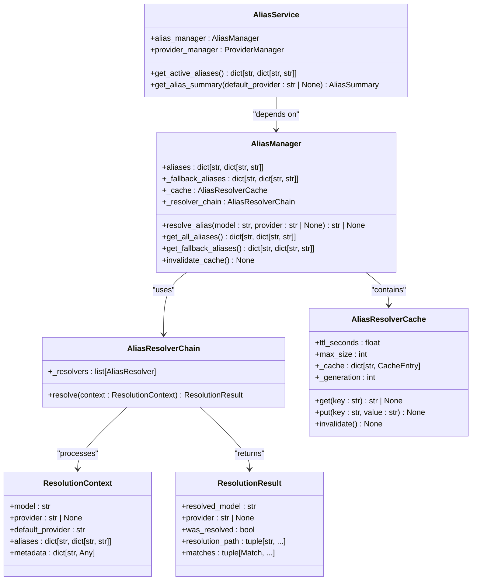
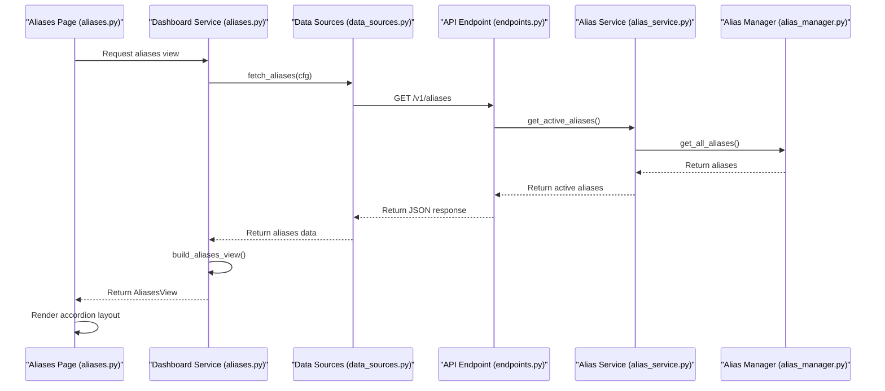
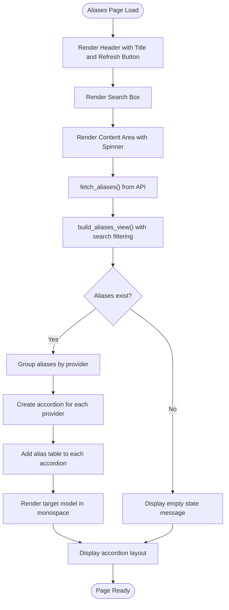
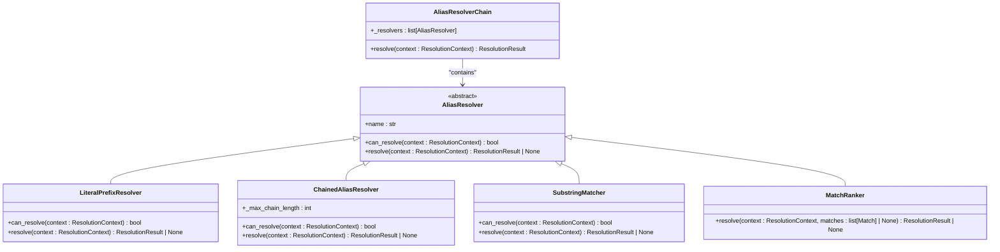
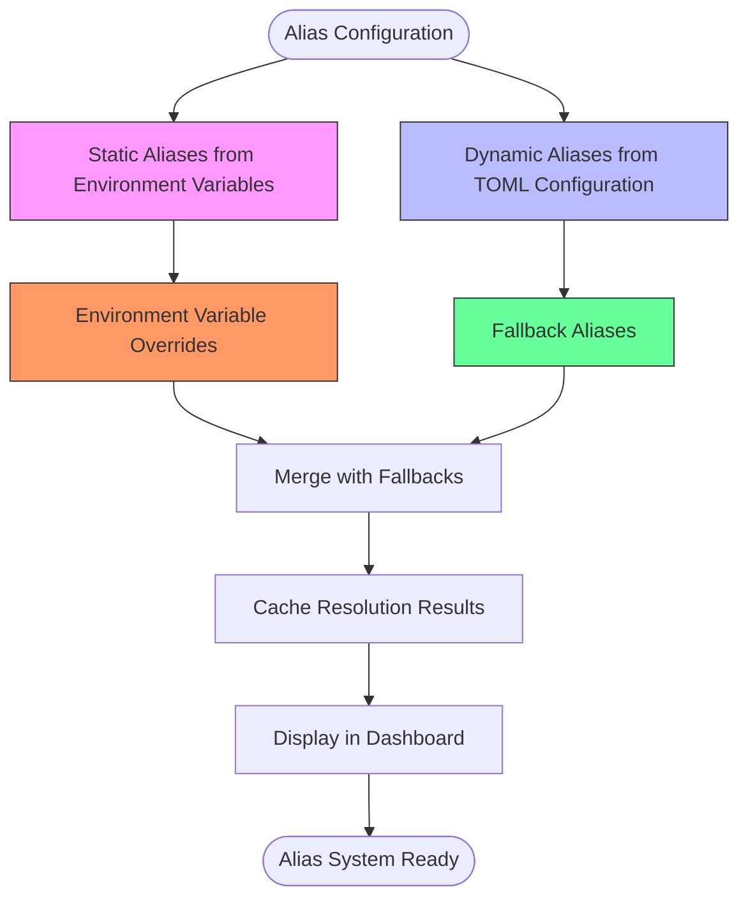

# Aliases

<cite>
**Referenced Files in This Document**   
- [alias_manager.py](file://src/core/alias_manager.py)
- [resolver.py](file://src/core/alias/resolver.py)
- [aliases.py](file://src/dashboard/services/aliases.py)
- [aliases.py](file://src/dashboard/pages/aliases.py)
- [data_sources.py](file://src/dashboard/data_sources.py)
- [endpoints.py](file://src/api/endpoints.py)
- [alias_service.py](file://src/api/services/alias_service.py)
</cite>

## Table of Contents
1. [Introduction](#introduction)
2. [Core Architecture](#core-architecture)
3. [Data Flow](#data-flow)
4. [Dashboard Components](#dashboard-components)
5. [Alias Resolution System](#alias-resolution-system)
6. [Static and Dynamic Aliases](#static-and-dynamic-aliases)
7. [Debugging and Validation](#debugging-and-validation)
8. [Common Issues](#common-issues)
9. [Conclusion](#conclusion)

## Introduction

The Aliases dashboard page provides a comprehensive visualization of the smart alias resolution system in the Vandamme Proxy. This system enables flexible model name resolution through provider-specific environment variables and configuration files, supporting case-insensitive substring matching and chained resolution logic. The dashboard serves as a critical tool for administrators and developers to monitor, debug, and validate alias configurations across different providers.

The primary purpose of this documentation is to explain how the Aliases page visualizes the complete alias resolution system, showing configured aliases, their target models, and resolution precedence. It details how both static and dynamic aliases are displayed, including environment variable overrides and fallback chains. The documentation also covers the data flow from the core alias management components through the dashboard service to the frontend interface.

**Section sources**
- [alias_manager.py](file://src/core/alias_manager.py#L1-L634)
- [resolver.py](file://src/core/alias/resolver.py#L1-L524)

## Core Architecture

The alias resolution system is built on a modular architecture with clear separation of concerns between components. At its core is the `AliasManager` class, which manages model aliases with case-insensitive substring matching. This manager supports provider-specific `<PROVIDER>_ALIAS_*` environment variables, allowing for flexible model name resolution scoped to specific providers.

The architecture follows a layered approach with distinct components for configuration, resolution, and presentation. The system is designed to be extensible through the Strategy Pattern, with resolver classes handling specific aspects of alias resolution. This design enables the system to process resolution requests through a chain of resolvers in a specific order, similar to middleware architecture.

The core components include:
- **AliasManager**: Central component for managing model aliases
- **AliasResolverChain**: Orchestrates resolution through multiple resolver strategies
- **AliasService**: Service layer coordinating alias operations with provider filtering
- **Cache system**: TTL cache with generation-based invalidation for resolution results

This architecture ensures that alias resolution is both efficient and maintainable, with clear boundaries between different functional areas.

**Diagram sources **
- [alias_manager.py](file://src/core/alias_manager.py#L167-L634)
- [resolver.py](file://src/core/alias/resolver.py#L417-L524)

**Section sources**
- [alias_manager.py](file://src/core/alias_manager.py#L1-L634)
- [resolver.py](file://src/core/alias/resolver.py#L1-L524)

## Data Flow

The data flow for the Aliases dashboard page follows a well-defined path from the core alias management system through the dashboard service to the frontend interface. This flow ensures that alias information is accurately presented to users while maintaining separation between backend logic and presentation.

The process begins with the `AliasManager` loading aliases from environment variables and configuration files during initialization. These aliases are then made available through the `/v1/aliases` API endpoint, which is implemented in `src/api/endpoints.py`. The endpoint returns a JSON response containing all configured aliases grouped by provider, along with suggested aliases derived from the top models service.

The dashboard service in `src/dashboard/services/aliases.py` fetches this data through the `fetch_aliases` function in `src/dashboard/data_sources.py`. This function makes an HTTP request to the `/v1/aliases` endpoint and processes the response. The `build_aliases_view` function then transforms this data into a Dash component structure suitable for display.

Finally, the frontend in `src/dashboard/pages/aliases.py` renders this component structure within the dashboard layout. The page includes search functionality and provider grouping, allowing users to easily navigate and filter the alias information.

**Diagram sources **
- [aliases.py](file://src/dashboard/services/aliases.py#L18-L69)
- [data_sources.py](file://src/dashboard/data_sources.py#L170-L187)
- [endpoints.py](file://src/api/endpoints.py#L1295-L1330)
- [alias_service.py](file://src/api/services/alias_service.py#L112-L141)
- [alias_manager.py](file://src/core/alias_manager.py#L538-L545)
- [aliases.py](file://src/dashboard/pages/aliases.py#L9-L56)

**Section sources**
- [aliases.py](file://src/dashboard/services/aliases.py#L1-L69)
- [data_sources.py](file://src/dashboard/data_sources.py#L170-L187)
- [endpoints.py](file://src/api/endpoints.py#L1295-L1330)

## Dashboard Components

The Aliases dashboard page is composed of several key components that work together to provide a comprehensive view of the alias system. These components are organized in a hierarchical structure that makes it easy for users to navigate and understand the alias configurations.

The main layout is defined in `src/dashboard/pages/aliases.py` and includes a header with the page title and a refresh button, a search box for filtering aliases, and a content area that displays the aliases in an accordion format. The search functionality allows users to filter aliases by name or target model, making it easier to find specific configurations.

The content is rendered by the `build_aliases_view` function in `src/dashboard/services/aliases.py`, which transforms the raw alias data into a Dash component structure. This function creates an accordion for each provider, with each accordion item containing a table of aliases for that provider. The tables display the alias name and its target model, with the target model rendered in monospace font for clarity.

The dashboard also includes empty state handling, displaying appropriate messages when no aliases are found or when no aliases are configured. This provides a better user experience by giving clear feedback in edge cases.

**Diagram sources **
- [aliases.py](file://src/dashboard/pages/aliases.py#L9-L56)
- [aliases.py](file://src/dashboard/services/aliases.py#L18-L69)
- [data_sources.py](file://src/dashboard/data_sources.py#L170-L187)

**Section sources**
- [aliases.py](file://src/dashboard/pages/aliases.py#L1-L56)
- [aliases.py](file://src/dashboard/services/aliases.py#L1-L69)

## Alias Resolution System

The alias resolution system is a sophisticated mechanism that handles both simple and complex alias scenarios. At its core is the `AliasResolverChain` class, which orchestrates resolution through a series of resolver strategies in a specific order. This chain-based approach allows for flexible and extensible resolution logic.

The resolution process follows a specific algorithm:
1. **Literal prefix handling**: The `LiteralPrefixResolver` handles model names prefixed with '!' which bypass alias resolution
2. **Chained alias resolution**: The `ChainedAliasResolver` resolves aliases that point to other aliases, creating a chain that must be followed to reach the final model name
3. **Substring matching**: The `SubstringMatcher` performs case-insensitive substring matching against alias names, creating variations with hyphens and underscores
4. **Match ranking**: The `MatchRanker` ranks and selects the best match from candidate aliases based on priority rules

The system supports case-insensitive substring matching, where aliases are matched against any part of the requested model name. It also handles hyphen/underscore variations, so an alias defined with underscores will match model names with hyphens and vice versa. This flexibility makes it easier to create aliases that work with different naming conventions.

The resolution precedence follows a clear hierarchy:
1. **Exact matches** take precedence over substring matches
2. **Longer substring matches** are preferred over shorter ones
3. **Default provider** aliases are preferred when multiple providers have matches of the same length
4. **Alphabetical order** is used as a tiebreaker

This system ensures predictable and consistent alias resolution while providing flexibility for different use cases.

**Diagram sources **
- [resolver.py](file://src/core/alias/resolver.py#L91-L524)

**Section sources**
- [resolver.py](file://src/core/alias/resolver.py#L1-L524)

## Static and Dynamic Aliases

The alias system supports both static and dynamic aliases, providing flexibility for different configuration needs. Static aliases are defined through environment variables and configuration files, while dynamic aliases are derived from system state and usage patterns.

Static aliases are configured using the `<PROVIDER>_ALIAS_*` environment variable pattern, such as `OPENAI_ALIAS_FAST=gpt-4o-mini` or `POE_ALIAS_HAIKU=grok-4.1-fast-non-reasoning`. These aliases are loaded at startup and represent explicit configurations set by administrators. They take precedence over fallback aliases and provide a way to create memorable names for frequently used models.

Dynamic aliases, also known as fallback aliases, are loaded from TOML configuration files and provide sensible defaults for common model names. These are automatically applied when no explicit alias is configured for a model name. The system includes built-in fallbacks for common Claude model names like "haiku", "sonnet", and "opus", mapping them to appropriate models for each provider.

The system also supports environment variable overrides, where aliases defined in environment variables take precedence over those in configuration files. This allows for runtime configuration changes without modifying configuration files. The override precedence follows a clear hierarchy:
1. Environment variable aliases (highest precedence)
2. Project-level configuration file aliases
3. User-level configuration file aliases
4. Package default configuration aliases (lowest precedence)

The dashboard displays both static and dynamic aliases, clearly indicating their source. This helps users understand which aliases are explicitly configured and which are fallbacks, making it easier to debug configuration issues.

**Diagram sources **
- [alias_manager.py](file://src/core/alias_manager.py#L214-L382)
- [alias_service.py](file://src/api/services/alias_service.py#L167-L193)

**Section sources**
- [alias_manager.py](file://src/core/alias_manager.py#L1-L634)
- [alias_service.py](file://src/api/services/alias_service.py#L1-L211)

## Debugging and Validation

The Aliases dashboard page provides several features to help users debug alias conflicts, verify case-insensitive matching, and validate chained resolution logic. These tools are essential for ensuring that the alias system behaves as expected in production environments.

To debug alias conflicts, users can use the search functionality to find all aliases that match a particular pattern. For example, searching for "haiku" will show all aliases that contain "haiku" in their name or target model. This helps identify potential conflicts where multiple aliases might match the same model name.

The dashboard clearly displays the resolution precedence, showing which aliases are explicit configurations and which are fallbacks. This information is crucial for understanding why a particular alias was resolved to a specific model. Users can also verify case-insensitive matching by testing different capitalizations of alias names in the search box.

For validating chained resolution logic, the system includes cycle detection to prevent infinite loops in alias chains. When a cycle is detected, the system logs a warning and stops the resolution process. The dashboard can be used to identify such issues by examining the alias configurations for circular references.

The page also supports cache invalidation testing. Users can refresh the page to see if cache invalidation is working correctly, ensuring that changes to alias configurations are properly reflected in the dashboard. This is particularly important in dynamic environments where aliases might be updated frequently.

Additionally, the system provides detailed logging of alias resolution, which can be enabled for debugging purposes. The logs show the complete resolution path, including intermediate steps in chained resolutions, making it easier to trace how a particular model name was resolved.

**Section sources**
- [alias_manager.py](file://src/core/alias_manager.py#L383-L458)
- [resolver.py](file://src/core/alias/resolver.py#L184-L271)
- [aliases.py](file://src/dashboard/pages/aliases.py#L1-L56)

## Common Issues

Several common issues can arise when working with the alias system, particularly related to alias override precedence and cache invalidation. Understanding these issues and their solutions is crucial for maintaining a reliable system.

One common issue is **alias override precedence confusion**. Users may expect aliases from configuration files to take precedence over environment variables, but the system follows the opposite order. Environment variable aliases always take precedence over configuration file aliases. This can lead to unexpected behavior when trying to override defaults. The solution is to ensure that environment variables are set correctly and to use the dashboard to verify which aliases are active.

Another issue is **cache invalidation problems**. The system uses a TTL cache with generation-based invalidation to improve performance. However, this can cause stale data to be served if the cache is not properly invalidated when aliases are updated. The `invalidate_cache()` method should be called whenever aliases are reloaded at runtime to ensure that the cache is refreshed.

**Circular reference detection** is another potential issue. The system includes cycle detection to prevent infinite loops in alias chains, but users may still create configurations that result in cycles. When this happens, the system logs a warning and stops the resolution process. To avoid this issue, users should carefully review their alias configurations for circular references.

**Case-insensitive matching conflicts** can also occur when multiple aliases match the same model name with different capitalizations. The system resolves this by following the precedence rules, but it can lead to unexpected results. Users should use the dashboard search functionality to identify potential conflicts and adjust their configurations accordingly.

Finally, **fallback alias conflicts** can arise when both explicit and fallback aliases are defined for the same model name. The system resolves this by giving precedence to explicit aliases, but users should be aware of this behavior and use the dashboard to verify which aliases are active.

**Section sources**
- [alias_manager.py](file://src/core/alias_manager.py#L597-L602)
- [resolver.py](file://src/core/alias/resolver.py#L217-L229)
- [alias_manager.py](file://src/core/alias_manager.py#L279-L297)

## Conclusion

The Aliases dashboard page provides a comprehensive visualization of the smart alias resolution system in the Vandamme Proxy. It effectively displays configured aliases, their target models, and resolution precedence, making it an essential tool for system administration and debugging.

The system's architecture, based on the Strategy Pattern and a resolver chain, provides a flexible and extensible foundation for alias resolution. The clear separation between static and dynamic aliases, along with well-defined override precedence, ensures predictable behavior while allowing for customization.

The data flow from the core `AliasManager` through the dashboard service to the frontend is well-structured and efficient, leveraging caching to improve performance while providing mechanisms for cache invalidation when needed. The dashboard's search and filtering capabilities make it easy to navigate complex alias configurations and identify potential issues.

For users, the page serves as both a monitoring tool and a debugging interface, providing insights into alias resolution behavior and helping to validate configurations. The ability to see both explicit and fallback aliases, along with their sources, enhances transparency and reduces configuration errors.

Overall, the Aliases dashboard page exemplifies good design principles in system visualization, providing a user-friendly interface to a complex underlying system while maintaining the integrity and performance of the core functionality.