# Dashboard

<cite>
**Referenced Files in This Document**   
- [app.py](file://src/dashboard/app.py)
- [mount.py](file://src/dashboard/mount.py)
- [routing.py](file://src/dashboard/routing.py)
- [overview.py](file://src/dashboard/pages/overview.py)
- [metrics.py](file://src/dashboard/pages/metrics.py)
- [models.py](file://src/dashboard/pages/models.py)
- [top_models.py](file://src/dashboard/pages/top_models.py)
- [aliases.py](file://src/dashboard/pages/aliases.py)
- [token_counter.py](file://src/dashboard/pages/token_counter.py)
- [logs.py](file://src/dashboard/pages/logs.py)
- [overview.py](file://src/dashboard/services/overview.py)
- [metrics.py](file://src/dashboard/services/metrics.py)
- [models.py](file://src/dashboard/services/models.py)
- [top_models.py](file://src/dashboard/services/top_models.py)
- [aliases.py](file://src/dashboard/services/aliases.py)
- [token_counter.py](file://src/dashboard/services/token_counter.py)
- [logs.py](file://src/dashboard/services/logs.py)
- [data_sources.py](file://src/dashboard/data_sources.py)
- [30-vdm-grid-init.js](file://assets/ag_grid/30-vdm-grid-init.js)
- [26-vdm-active-requests-sse.js](file://assets/ag_grid/26-vdm-active-requests-sse.js)
</cite>

## Table of Contents
1. [Introduction](#introduction)
2. [Project Structure](#project-structure)
3. [Core Components](#core-components)
4. [Architecture Overview](#architecture-overview)
5. [Detailed Component Analysis](#detailed-component-analysis)
6. [Dependency Analysis](#dependency-analysis)
7. [Performance Considerations](#performance-considerations)
8. [Troubleshooting Guide](#troubleshooting-guide)
9. [Conclusion](#conclusion)

## Introduction
The Vandamme Proxy Dashboard provides real-time visibility into proxy operations, offering comprehensive monitoring of active requests, token usage, model performance, and error rates. Built using the Dash framework with AG Grid components, the dashboard serves as a central interface for administrators and developers to monitor system health, analyze performance metrics, and troubleshoot issues. The dashboard is accessible via the `/dashboard` endpoint and features multiple pages for different monitoring aspects, including Overview, Metrics, Models, Aliases, Token Counter, Top Models, and Logs.

## Project Structure
The dashboard functionality is organized within the `src/dashboard/` directory, with a clear separation between frontend components, backend services, and JavaScript assets. The structure follows a modular pattern with distinct directories for callbacks, components, pages, and services.

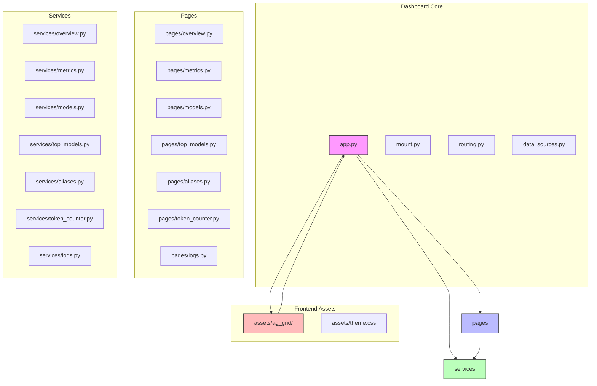

**Diagram sources**
- [app.py](file://src/dashboard/app.py)
- [pages/](file://src/dashboard/pages/)
- [services/](file://src/dashboard/services/)
- [assets/ag_grid/](file://assets/ag_grid/)

**Section sources**
- [app.py](file://src/dashboard/app.py)
- [mount.py](file://src/dashboard/mount.py)
- [routing.py](file://src/dashboard/routing.py)

## Core Components
The dashboard's core components include the application initialization, routing mechanism, and service layer that connects frontend components with backend data sources. The `app.py` file creates the Dash application instance and registers all necessary callbacks, while `mount.py` handles the integration with the FastAPI server. The `routing.py` file manages navigation between different dashboard pages based on the URL path.

**Section sources**
- [app.py](file://src/dashboard/app.py#L41-L144)
- [mount.py](file://src/dashboard/mount.py#L11-L19)
- [routing.py](file://src/dashboard/routing.py#L19-L42)

## Architecture Overview
The dashboard architecture follows a client-server pattern with a clear separation between presentation, business logic, and data access layers. The frontend is built with Dash and AG Grid components, while the backend services fetch data from various API endpoints. Real-time updates are achieved through Server-Sent Events (SSE) for active requests and periodic polling for other metrics.

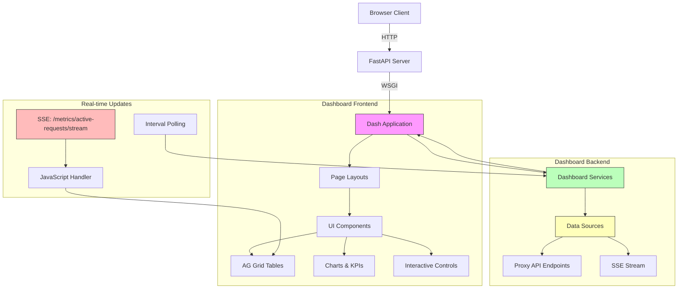

**Diagram sources**
- [app.py](file://src/dashboard/app.py)
- [services/](file://src/dashboard/services/)
- [data_sources.py](file://src/dashboard/data_sources.py)
- [26-vdm-active-requests-sse.js](file://assets/ag_grid/26-vdm-active-requests-sse.js)

## Detailed Component Analysis

### Dashboard Pages and Functionality

#### Overview Page
The Overview page serves as the dashboard's landing page, providing a high-level summary of system health and key performance indicators. It displays health status, provider information, and key metrics such as request counts and token usage. The page includes a refresh button and automatic polling every 10 seconds to keep data current.

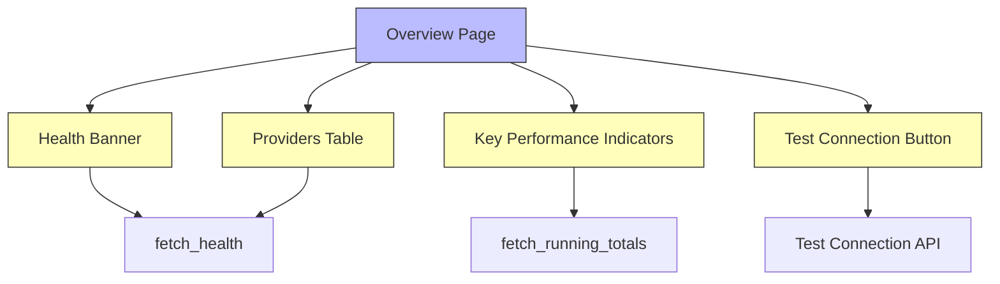

**Diagram sources**
- [overview.py](file://src/dashboard/pages/overview.py)
- [overview.py](file://src/dashboard/services/overview.py)
- [data_sources.py](file://src/dashboard/data_sources.py)

**Section sources**
- [overview.py](file://src/dashboard/pages/overview.py#L7-L92)
- [overview.py](file://src/dashboard/services/overview.py#L24-L50)

#### Metrics Page
The Metrics page provides detailed insights into proxy operations, including active requests, model aggregates, and provider breakdowns. It features real-time updates through Server-Sent Events (SSE) for active requests and configurable polling intervals (5s, 10s, 30s) for other metrics. The page includes a token composition pie chart showing the distribution of input, output, cache read, and cache creation tokens.

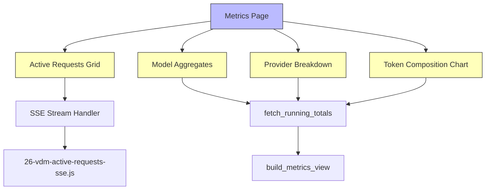

**Diagram sources**
- [metrics.py](file://src/dashboard/pages/metrics.py)
- [metrics.py](file://src/dashboard/services/metrics.py)
- [26-vdm-active-requests-sse.js](file://assets/ag_grid/26-vdm-active-requests-sse.js)

**Section sources**
- [metrics.py](file://src/dashboard/pages/metrics.py#L16-L161)
- [metrics.py](file://src/dashboard/services/metrics.py#L34-L66)

#### Models Page
The Models page displays a comprehensive list of available models from configured providers. It features an AG Grid table with filtering by provider and sorting capabilities. Users can copy selected model IDs to the clipboard, and the page automatically refreshes every 30 seconds. The table includes custom renderers for model IDs with provider icons and qualified model names.

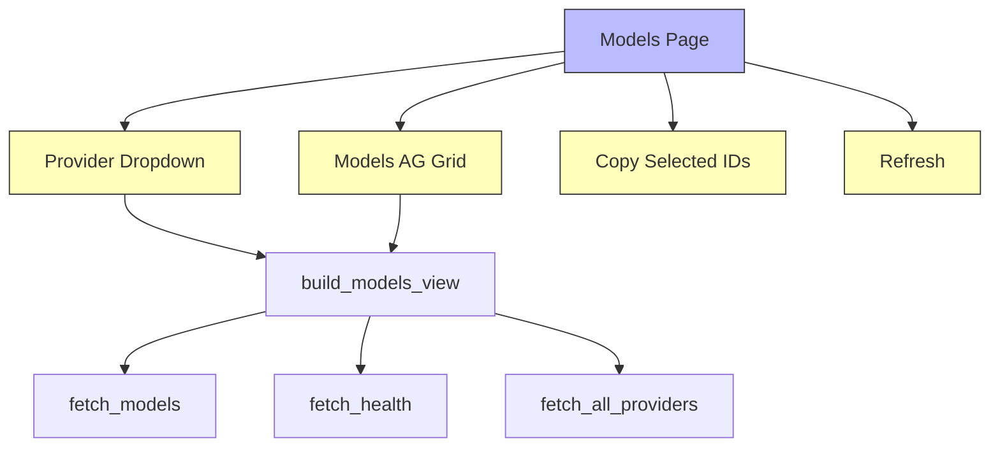

**Diagram sources**
- [models.py](file://src/dashboard/pages/models.py)
- [models.py](file://src/dashboard/services/models.py)
- [data_sources.py](file://src/dashboard/data_sources.py)

**Section sources**
- [models.py](file://src/dashboard/pages/models.py#L9-L138)
- [models.py](file://src/dashboard/services/models.py#L21-L78)

#### Top Models Page
The Top Models page provides discovery functionality for popular models, allowing users to filter by provider, limit results, and search by model ID or name. It displays model information, metadata, and suggested aliases. The page refreshes automatically every 60 seconds and supports manual refresh.

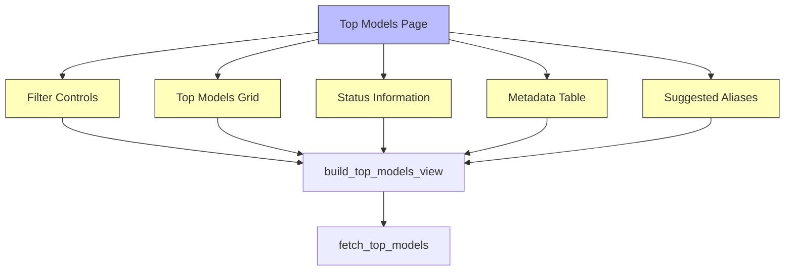

**Diagram sources**
- [top_models.py](file://src/dashboard/pages/top_models.py)
- [top_models.py](file://src/dashboard/services/top_models.py)
- [data_sources.py](file://src/dashboard/data_sources.py)

**Section sources**
- [top_models.py](file://src/dashboard/pages/top_models.py#L11-L155)
- [top_models.py](file://src/dashboard/services/top_models.py#L29-L136)

#### Aliases Page
The Aliases page displays configured model aliases grouped by provider. It includes a search function to filter aliases by name or target model. Each provider's aliases are presented in an accordion section, showing the alias name and the model it maps to. The page refreshes automatically every 60 seconds.

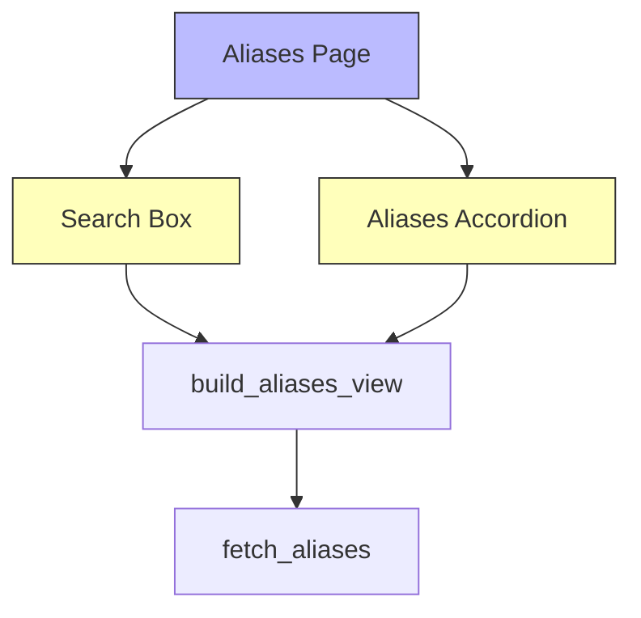

**Diagram sources**
- [aliases.py](file://src/dashboard/pages/aliases.py)
- [aliases.py](file://src/dashboard/services/aliases.py)
- [data_sources.py](file://src/dashboard/data_sources.py)

**Section sources**
- [aliases.py](file://src/dashboard/pages/aliases.py#L9-L56)
- [aliases.py](file://src/dashboard/services/aliases.py#L18-L69)

#### Token Counter Page
The Token Counter page provides a tool for estimating token counts in messages. Users can select a model, enter a system message (optional), and input their message to get a token estimate. The estimate uses a simple approximation (characters divided by 4). The model dropdown is populated automatically from available models.

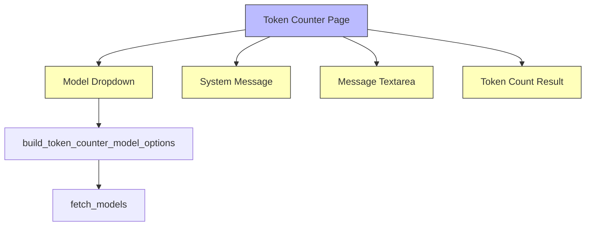

**Diagram sources**
- [token_counter.py](file://src/dashboard/pages/token_counter.py)
- [token_counter.py](file://src/dashboard/services/token_counter.py)
- [data_sources.py](file://src/dashboard/data_sources.py)

**Section sources**
- [token_counter.py](file://src/dashboard/pages/token_counter.py#L7-L120)
- [token_counter.py](file://src/dashboard/services/token_counter.py#L22-L59)

#### Logs Page
The Logs page displays recent error and trace logs in AG Grid tables. It includes tabs for switching between error logs and trace logs. When logs are disabled, a callout message explains how to enable them. The page polls for new logs every 5 seconds.

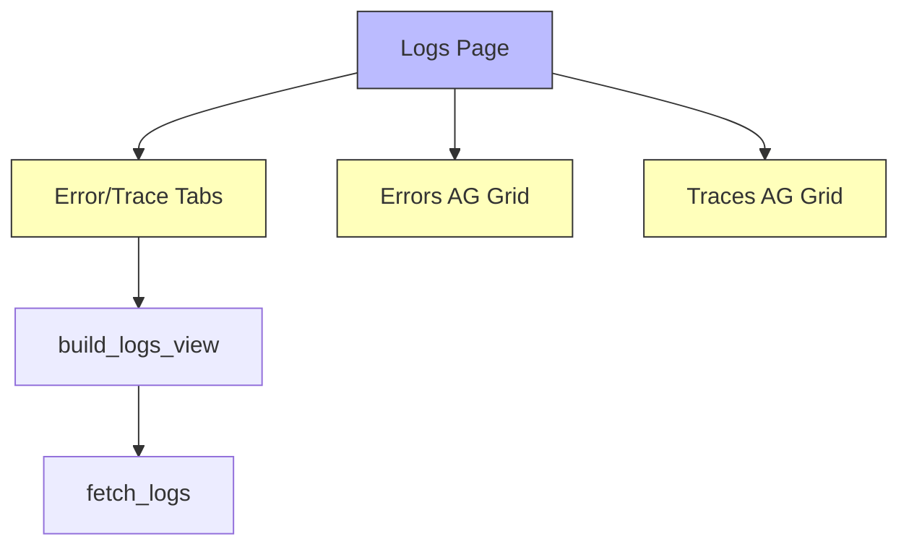

**Diagram sources**
- [logs.py](file://src/dashboard/pages/logs.py)
- [logs.py](file://src/dashboard/services/logs.py)
- [data_sources.py](file://src/dashboard/data_sources.py)

**Section sources**
- [logs.py](file://src/dashboard/pages/logs.py#L7-L64)
- [logs.py](file://src/dashboard/services/logs.py#L19-L53)

### Real-time Update Mechanism
The dashboard implements real-time updates for active requests using Server-Sent Events (SSE), while other metrics use periodic polling. The SSE mechanism provides low-latency updates without the overhead of repeated HTTP requests.

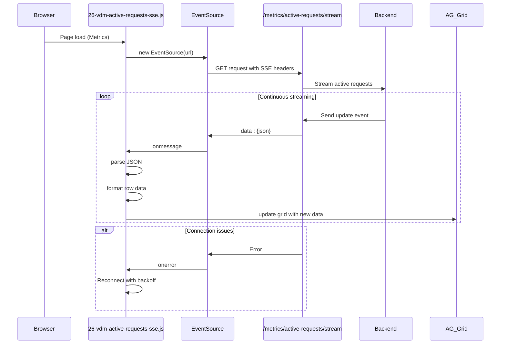

**Diagram sources**
- [26-vdm-active-requests-sse.js](file://assets/ag_grid/26-vdm-active-requests-sse.js)
- [metrics.py](file://src/dashboard/pages/metrics.py)
- [data_sources.py](file://src/dashboard/data_sources.py)

**Section sources**
- [26-vdm-active-requests-sse.js](file://assets/ag_grid/26-vdm-active-requests-sse.js)
- [metrics.py](file://src/dashboard/pages/metrics.py#L70-L96)

### JavaScript Components
The dashboard includes several JavaScript components in the `assets/ag_grid/` directory that enhance the AG Grid functionality. These include custom renderers, helpers, and initialization scripts that provide features like model ID copying, recency indicators, and SSE integration.

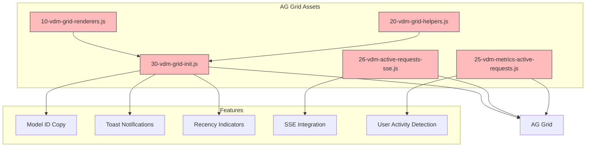

**Diagram sources**
- [30-vdm-grid-init.js](file://assets/ag_grid/30-vdm-grid-init.js)
- [26-vdm-active-requests-sse.js](file://assets/ag_grid/26-vdm-active-requests-sse.js)
- [25-vdm-metrics-active-requests.js](file://assets/ag_grid/25-vdm-metrics-active-requests.js)

**Section sources**
- [30-vdm-grid-init.js](file://assets/ag_grid/30-vdm-grid-init.js)
- [26-vdm-active-requests-sse.js](file://assets/ag_grid/26-vdm-active-requests-sse.js)

## Dependency Analysis
The dashboard components have a well-defined dependency structure with clear separation between presentation, business logic, and data access layers. The dependency graph shows how different components interact to provide the complete dashboard functionality.

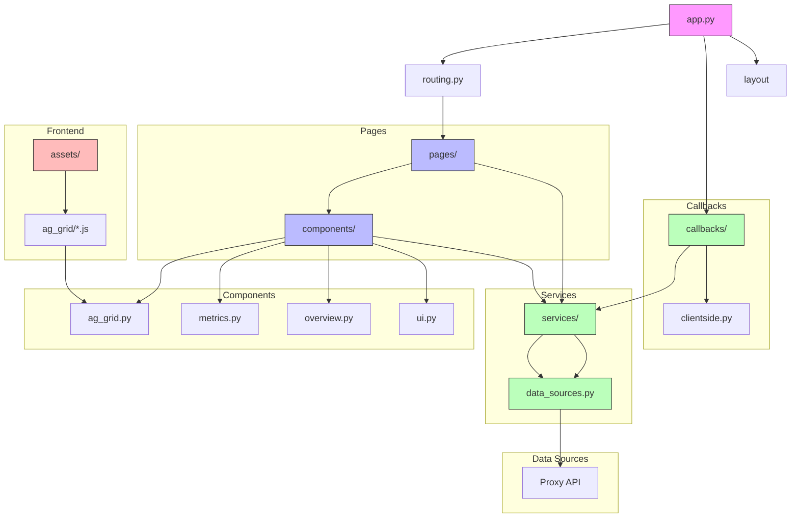

**Diagram sources**
- [app.py](file://src/dashboard/app.py)
- [routing.py](file://src/dashboard/routing.py)
- [pages/](file://src/dashboard/pages/)
- [services/](file://src/dashboard/services/)
- [callbacks/](file://src/dashboard/callbacks/)
- [components/](file://src/dashboard/components/)
- [data_sources.py](file://src/dashboard/data_sources.py)
- [assets/ag_grid/](file://assets/ag_grid/)

**Section sources**
- [app.py](file://src/dashboard/app.py)
- [routing.py](file://src/dashboard/routing.py)
- [src/dashboard/](file://src/dashboard/)

## Performance Considerations
The dashboard is designed with performance in mind, using several optimization techniques to ensure responsive user experience:

1. **Real-time Updates**: Active requests use Server-Sent Events (SSE) instead of polling, reducing server load and providing immediate updates.
2. **Efficient Data Fetching**: The dashboard services fetch only necessary data and transform it into the required format before sending to the frontend.
3. **Client-side Processing**: JavaScript components handle many UI updates (like recency indicators) without server round-trips.
4. **Configurable Polling**: Users can adjust polling intervals or disable polling when not actively monitoring.
5. **Lazy Loading**: The dashboard detects the API base URL dynamically, avoiding configuration issues.

The SSE implementation for active requests is particularly efficient, using a reliability-first strategy that replaces the entire grid dataset rather than using transactional updates. This approach avoids edge cases with duplicate node IDs and ensures data consistency.

## Troubleshooting Guide
When experiencing dashboard connectivity or data display issues, consider the following troubleshooting steps:

1. **Check Dashboard Accessibility**: Verify the dashboard is accessible at the `/dashboard` endpoint. If not, ensure the proxy server is running and the dashboard is properly mounted.

2. **Verify SSE Connection**: On the Metrics page, check the SSE connection indicator. If it shows "Reconnecting...", there may be network issues or the SSE endpoint may be disabled.

3. **Check API Endpoints**: Ensure the backend API endpoints are accessible. The dashboard relies on several endpoints like `/metrics/active-requests/stream` for SSE and various data sources for polling.

4. **Review Browser Console**: Check the browser's developer console for JavaScript errors, particularly related to AG Grid or SSE connectivity.

5. **Verify Environment Variables**: Ensure required environment variables are set, such as `LOG_REQUEST_METRICS=true` for metrics collection.

6. **Check Network Connectivity**: Verify that the browser can connect to the server and that there are no firewall or CORS restrictions.

7. **Review Server Logs**: Check the proxy server logs for any errors related to dashboard requests or data fetching.

8. **Clear Browser Cache**: If the dashboard appears broken, try clearing the browser cache or using incognito mode.

Common issues and their solutions:
- **Blank dashboard**: Check if the FastAPI server is running and the dashboard is properly mounted.
- **No data in tables**: Verify that the corresponding API endpoints are returning data and that the data format matches expectations.
- **SSE connection failures**: Check network connectivity and ensure the `/metrics/active-requests/stream` endpoint is accessible.
- **Slow performance**: Adjust polling intervals or disable polling when not actively monitoring.

## Conclusion
The Vandamme Proxy Dashboard provides comprehensive monitoring capabilities for proxy operations, offering real-time visibility into active requests, token usage, model performance, and error rates. Built with the Dash framework and AG Grid components, the dashboard offers an intuitive interface with multiple pages for different monitoring aspects. The real-time update mechanism using Server-Sent Events ensures immediate visibility of active requests, while periodic polling provides regular updates for other metrics. The dashboard's modular architecture separates concerns between frontend components, backend services, and data sources, making it maintainable and extensible. With proper configuration and connectivity, the dashboard serves as an essential tool for monitoring and optimizing proxy performance.