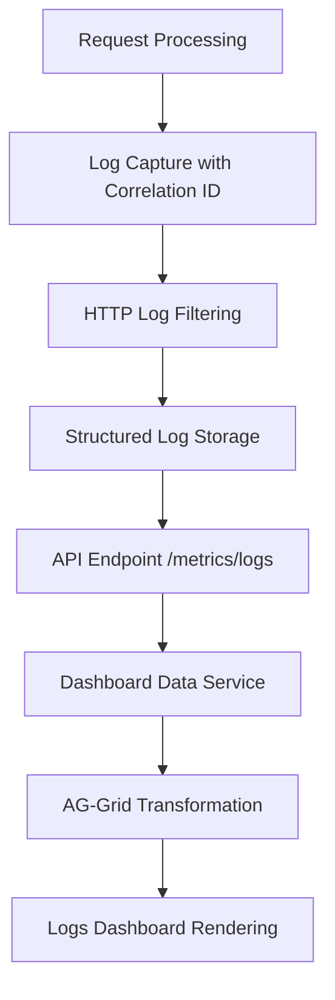
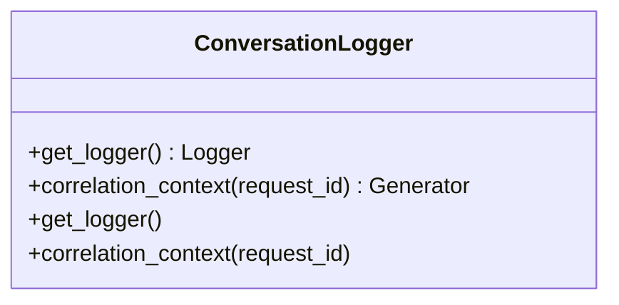
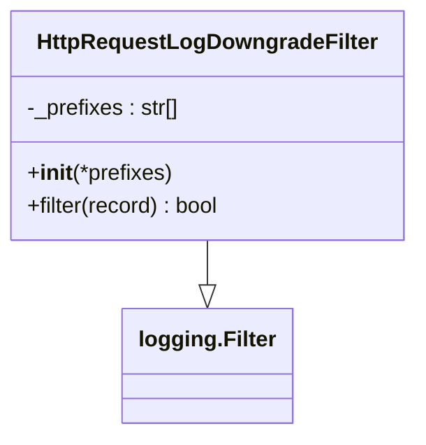
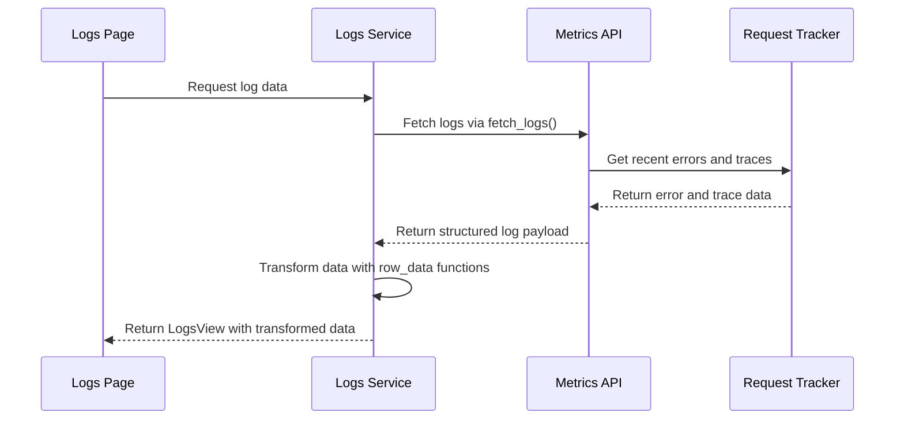
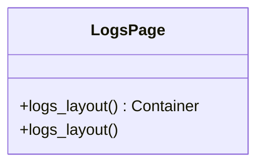

# Logs

<cite>
**Referenced Files in This Document**   
- [logs.py](file://src/dashboard/pages/logs.py)
- [logs.py](file://src/dashboard/services/logs.py)
- [conversation.py](file://src/core/logging/conversation.py)
- [http.py](file://src/core/logging/filters/http.py)
- [data_sources.py](file://src/dashboard/data_sources.py)
- [transformers.py](file://src/dashboard/ag_grid/transformers.py)
- [ag_grid.py](file://src/dashboard/components/ag_grid.py)
- [callbacks.py](file://src/dashboard/callbacks/logs.py)
- [metrics.py](file://src/api/metrics.py)
- [configuration.py](file://src/core/logging/configuration.py)
</cite>

## Table of Contents
1. [Introduction](#introduction)
2. [Log Data Flow](#log-data-flow)
3. [Core Components](#core-components)
4. [Architecture Overview](#architecture-overview)
5. [Detailed Component Analysis](#detailed-component-analysis)
6. [Log Filtering and Search](#log-filtering-and-search)
7. [Error Analysis and Debugging](#error-analysis-and-debugging)
8. [Performance Considerations](#performance-considerations)
9. [Log Retention and System Requirements](#log-retention-and-system-requirements)
10. [Troubleshooting Guide](#troubleshooting-guide)

## Introduction
The Logs dashboard page provides a comprehensive view of structured request and response logs with correlation IDs, timestamps, and contextual metadata. This documentation explains the complete log flow from capture to display, covering the core logging system, filtering mechanisms, and rendering components. The page enables users to debug request failures, trace end-to-end flows, and analyze payload structures through its dual-tab interface showing both errors and request traces.

## Log Data Flow
The log data flows through a well-defined pipeline from request processing to dashboard display. When a request is processed, the core logging system captures structured data with correlation IDs. This data passes through filtering mechanisms before being served to the dashboard via API endpoints and rendered in the user interface. The flow ensures that logs are properly contextualized with metadata while maintaining performance and usability.



**Diagram sources**
- [conversation.py](file://src/core/logging/conversation.py)
- [http.py](file://src/core/logging/filters/http.py)
- [metrics.py](file://src/api/metrics.py)
- [data_sources.py](file://src/dashboard/data_sources.py)
- [transformers.py](file://src/dashboard/ag_grid/transformers.py)
- [logs.py](file://src/dashboard/pages/logs.py)

## Core Components
The Logs dashboard functionality is built on several core components that work together to capture, process, and display log data. These components include the conversation logger for correlation ID management, HTTP log filters for noise reduction, data services for API communication, and UI components for data presentation. The system is designed to be modular and maintainable, with clear separation of concerns between logging infrastructure and dashboard presentation.

**Section sources**
- [conversation.py](file://src/core/logging/conversation.py)
- [http.py](file://src/core/logging/filters/http.py)
- [logs.py](file://src/dashboard/services/logs.py)
- [logs.py](file://src/dashboard/pages/logs.py)

## Architecture Overview
The Logs dashboard architecture follows a clean separation between data capture, processing, and presentation layers. The system captures structured logs during request processing, applies filtering to reduce noise, stores data in memory for quick access, exposes it through API endpoints, and finally renders it in the dashboard interface. This architecture ensures efficient log handling while providing rich debugging capabilities.

```mermaid
graph TD
subgraph "Data Capture Layer"
A[Conversation Logger]
B[HTTP Log Filters]
end
subgraph "Processing Layer"
C[Request Tracker]
D[Log Formatter]
end
subgraph "API Layer"
E[Metrics Router]
F[/metrics/logs Endpoint]
end
subgraph "Dashboard Layer"
G[Data Service]
H[Transformers]
I[AG-Grid Components]
J[Logs Page]
end
A --> C
B --> C
C --> D
D --> E
E --> F
F --> G
G --> H
H --> I
I --> J
```

**Diagram sources**
- [conversation.py](file://src/core/logging/conversation.py)
- [http.py](file://src/core/logging/filters/http.py)
- [runtime.py](file://src/core/metrics/runtime.py)
- [metrics.py](file://src/api/metrics.py)
- [data_sources.py](file://src/dashboard/data_sources.py)
- [transformers.py](file://src/dashboard/ag_grid/transformers.py)
- [ag_grid.py](file://src/dashboard/components/ag_grid.py)
- [logs.py](file://src/dashboard/pages/logs.py)

## Detailed Component Analysis

### Conversation Logger Analysis
The ConversationLogger class manages correlation IDs for request tracking, ensuring that all logs within a request context share the same identifier. This enables end-to-end tracing of requests across the system.



**Diagram sources**
- [conversation.py](file://src/core/logging/conversation.py)

### HTTP Log Filtering Analysis
The HttpRequestLogDowngradeFilter reduces noise from third-party HTTP libraries by downgrading INFO logs to DEBUG level, preventing overwhelming application logs while preserving important information.



**Diagram sources**
- [http.py](file://src/core/logging/filters/http.py)

### Logs Dashboard Service Analysis
The build_logs_view function orchestrates the retrieval and transformation of log data, handling both successful data retrieval and error conditions with appropriate UI feedback.



**Diagram sources**
- [logs.py](file://src/dashboard/services/logs.py)
- [data_sources.py](file://src/dashboard/data_sources.py)
- [transformers.py](file://src/dashboard/ag_grid/transformers.py)

### Logs Dashboard Page Analysis
The logs_layout function defines the UI structure of the Logs page, creating a tabbed interface with separate views for errors and request traces, along with periodic polling for real-time updates.



**Diagram sources**
- [logs.py](file://src/dashboard/pages/logs.py)

**Section sources**
- [logs.py](file://src/dashboard/pages/logs.py)
- [logs.py](file://src/dashboard/services/logs.py)
- [transformers.py](file://src/dashboard/ag_grid/transformers.py)
- [ag_grid.py](file://src/dashboard/components/ag_grid.py)

## Log Filtering and Search
The Logs dashboard provides robust filtering and search capabilities through the AG-Grid component. Users can filter logs by various criteria including time, provider, model, error type, and request ID. The grid supports sorting, column filtering, and full-text search across all visible fields. These features enable efficient navigation of potentially large log datasets, allowing users to quickly locate specific requests or error patterns.

The filtering is implemented at multiple levels: server-side filtering through API parameters and client-side filtering within the dashboard interface. This hybrid approach balances performance with flexibility, ensuring responsive interactions while maintaining the ability to work with comprehensive log data.

**Section sources**
- [transformers.py](file://src/dashboard/ag_grid/transformers.py)
- [ag_grid.py](file://src/dashboard/components/ag_grid.py)
- [logs.py](file://src/dashboard/pages/logs.py)

## Error Analysis and Debugging
The Logs dashboard is a powerful tool for debugging request failures and analyzing system behavior. The Errors tab displays detailed information about failed requests, including error types, messages, and associated metadata. Each error entry includes the correlation ID, enabling users to trace the complete request flow from initiation to failure.

For debugging purposes, the dashboard provides several key features:
- Correlation IDs for end-to-end request tracing
- Timestamps with relative time indicators for temporal analysis
- Provider and model information for routing verification
- Error type categorization for pattern recognition
- Full error messages with preserved formatting

These features allow developers to quickly identify the root cause of issues, whether they stem from configuration problems, provider errors, or application logic flaws.

**Section sources**
- [transformers.py](file://src/dashboard/ag_grid/transformers.py)
- [logs.py](file://src/dashboard/pages/logs.py)

## Performance Considerations
The logging system is designed with performance in mind, particularly when handling high-volume logging scenarios. Several strategies are employed to maintain system responsiveness:

1. **Memory-efficient storage**: Log data is stored in memory using ring buffers, automatically discarding older entries when limits are reached.
2. **Configurable limits**: The system allows configuration of log limits through parameters like limit_errors and limit_traces.
3. **Asynchronous operations**: Data retrieval and transformation occur asynchronously to prevent UI blocking.
4. **Incremental updates**: The dashboard uses polling with configurable intervals to balance freshness and performance.

The performance implications of high-volume logging are mitigated through these design choices, ensuring that the logging system does not become a bottleneck even under heavy load.

**Section sources**
- [metrics.py](file://src/api/metrics.py)
- [data_sources.py](file://src/dashboard/data_sources.py)
- [logs.py](file://src/dashboard/services/logs.py)

## Log Retention and System Requirements
Log retention in the system is managed through in-memory ring buffers with configurable limits. By default, the system retains up to 100 recent errors and 200 recent request traces, with these values configurable through API parameters. The retention policy follows a first-in, first-out (FIFO) approach, automatically removing older entries when the limits are exceeded.

System requirements for the logging functionality include:
- Access to /dev/log for systemd integration
- Proper configuration of the LOG_REQUEST_METRICS environment variable
- Sufficient memory to handle the configured log limits
- Appropriate file system permissions for log storage

The system checks for these requirements at startup and provides clear feedback when logging is disabled or improperly configured.

**Section sources**
- [configuration.py](file://src/core/logging/configuration.py)
- [metrics.py](file://src/api/metrics.py)
- [logs.py](file://src/dashboard/services/logs.py)

## Troubleshooting Guide
When encountering issues with the Logs dashboard, consider the following common scenarios and solutions:

1. **Logs are not appearing**: Verify that the server was started with --systemd flag and that /dev/log is available. Check the LOG_REQUEST_METRICS environment variable setting.

2. **Error messages are truncated**: The dashboard displays formatted error messages, but the full message is available in tooltips. Hover over error message cells to see complete content.

3. **Performance issues with large log volumes**: Adjust the polling interval or reduce the log limits to improve responsiveness. Consider filtering to specific providers or models to reduce data volume.

4. **Correlation ID mismatches**: Ensure that the conversation context is properly established for all requests. Verify that the ConversationLogger is correctly integrated in the request processing pipeline.

5. **Missing provider information**: Check that provider configuration is correct and that the request routing is functioning as expected.

The dashboard provides diagnostic information through status messages and callouts, helping users identify and resolve configuration issues.

**Section sources**
- [logs.py](file://src/dashboard/services/logs.py)
- [logs.py](file://src/dashboard/pages/logs.py)
- [configuration.py](file://src/core/logging/configuration.py)