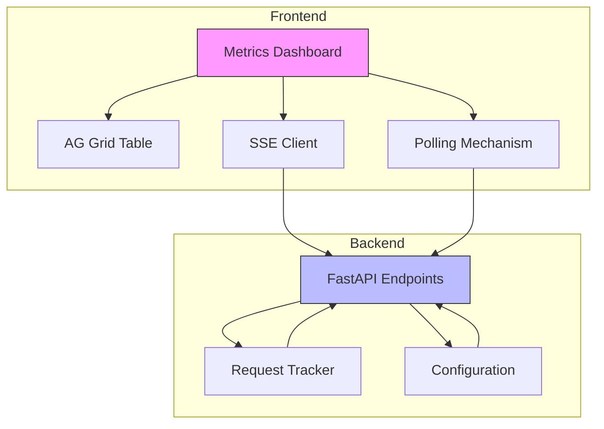
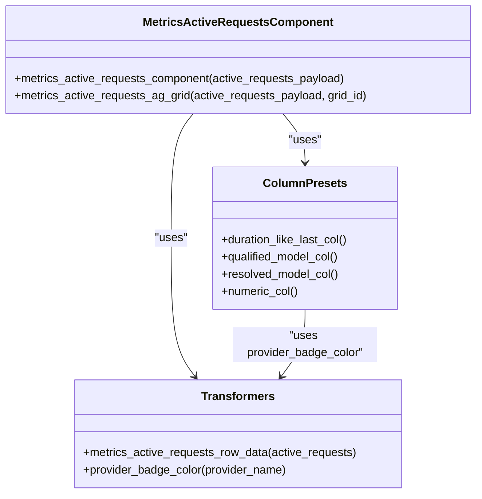
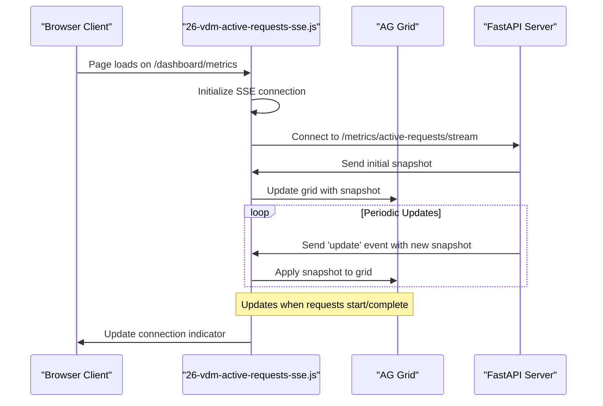
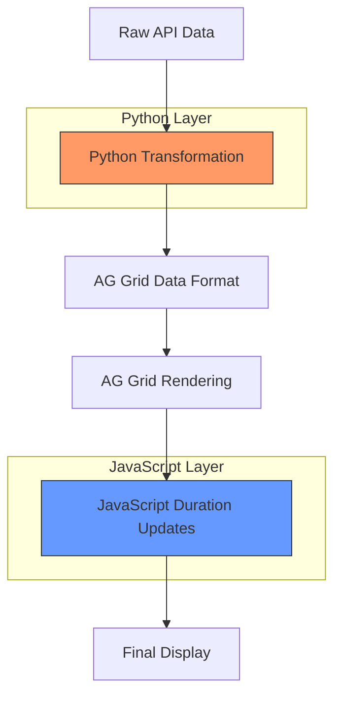

# Metrics

<cite>
**Referenced Files in This Document**   
- [metrics.py](file://src/dashboard/pages/metrics.py)
- [metrics.py](file://src/dashboard/services/metrics.py)
- [25-vdm-metrics-active-requests.js](file://assets/ag_grid/25-vdm-metrics-active-requests.js)
- [26-vdm-active-requests-sse.js](file://assets/ag_grid/26-vdm-active-requests-sse.js)
- [ag_grid.py](file://src/dashboard/components/ag_grid.py)
- [column_presets.py](file://src/dashboard/ag_grid/column_presets.py)
- [transformers.py](file://src/dashboard/ag_grid/transformers.py)
- [data_sources.py](file://src/dashboard/data_sources.py)
- [metrics.py](file://src/api/metrics.py)
- [normalize.py](file://src/dashboard/normalize.py)
- [config.py](file://src/core/config.py)
- [metrics.py](file://src/dashboard/callbacks/metrics.py)
</cite>

## Table of Contents
1. [Introduction](#introduction)
2. [Core Components](#core-components)
3. [Architecture Overview](#architecture-overview)
4. [Detailed Component Analysis](#detailed-component-analysis)
5. [Data Flow and Backend Integration](#data-flow-and-backend-integration)
6. [Configuration and Retention](#configuration-and-retention)
7. [Interpretation and Troubleshooting](#interpretation-and-troubleshooting)
8. [Conclusion](#conclusion)

## Introduction
The Metrics dashboard page provides comprehensive visualization of quantitative performance data for the Vandamme proxy system. It enables monitoring of key metrics including request volume, latency, token consumption, and provider load distribution. The dashboard features real-time monitoring of active requests through an AG Grid table updated via Server-Sent Events (SSE), providing immediate visibility into ongoing operations. The interface includes multiple data views such as model aggregates, provider breakdowns, and token composition charts, allowing users to analyze system performance from various perspectives. The page supports both real-time streaming updates and traditional polling mechanisms, with configurable refresh intervals to balance between data freshness and system load.

## Core Components
The Metrics dashboard consists of several core components that work together to provide a comprehensive view of system performance. The active requests grid displays real-time information about in-flight requests, including request duration, provider, model, and token usage. The model aggregates section shows cumulative metrics for different models across providers, while the provider breakdown presents performance data organized by provider. A token composition chart visualizes the distribution of input, output, cache read, and cache creation tokens. The dashboard includes a toolbar with controls for refreshing data, toggling polling, and adjusting the refresh interval. The SSE connection status is displayed prominently, indicating whether real-time updates are active. These components are integrated through a modular architecture that separates data fetching, transformation, and presentation concerns.

**Section sources**
- [metrics.py](file://src/dashboard/pages/metrics.py#L1-L210)
- [ag_grid.py](file://src/dashboard/components/ag_grid.py#L33-L105)

## Architecture Overview
The Metrics dashboard follows a layered architecture with clear separation between frontend and backend components. The frontend is built using Dash with AG Grid for data visualization, while the backend exposes REST endpoints through FastAPI. Data flows from the backend metrics tracking system to the frontend through both traditional polling and real-time Server-Sent Events. The architecture supports multiple update mechanisms: SSE for real-time active requests updates, and periodic polling for aggregated metrics. JavaScript utilities handle client-side rendering and event processing, while Python components manage data transformation and server-side logic. The system is designed to gracefully degrade when SSE is unavailable, falling back to polling mechanisms. Configuration options allow tuning of update frequencies and feature toggles.



**Diagram sources **
- [metrics.py](file://src/dashboard/pages/metrics.py#L1-L210)
- [metrics.py](file://src/api/metrics.py#L1-L263)

## Detailed Component Analysis

### Active Requests Grid Implementation
The active requests grid is implemented using AG Grid with custom column presets and data transformation logic. The grid displays key information about in-flight requests including duration, provider, model, streaming status, and token usage. The duration column uses a specialized renderer that shows both a visual indicator and formatted duration text (e.g., "12s", "3m 04s"). The grid is configured with specific column widths and flex properties to optimize information display. Provider badges are color-coded based on the provider type (OpenAI, Anthropic, etc.) for quick visual identification. The request ID is displayed in a monospace font for better readability. The grid supports filtering and sorting on most columns, allowing users to organize the data according to their needs.



**Diagram sources **
- [ag_grid.py](file://src/dashboard/components/ag_grid.py#L33-L105)
- [column_presets.py](file://src/dashboard/ag_grid/column_presets.py#L1-L167)
- [transformers.py](file://src/dashboard/ag_grid/transformers.py#L283-L332)

### Server-Sent Events Integration
The real-time updates for active requests are implemented using Server-Sent Events (SSE), which provides a persistent connection from the server to the client for pushing updates. The SSE integration is handled by the 26-vdm-active-requests-sse.js JavaScript utility, which establishes a connection to the /metrics/active-requests/stream endpoint. The client listens for 'update' events containing snapshots of active requests, which are then applied to the AG Grid. The implementation includes automatic reconnection logic with exponential backoff in case of connection failures. The connection is automatically managed based on page visibility and navigation, disconnecting when the user navigates away from the metrics page and reconnecting when they return. A connection status indicator in the toolbar shows whether the SSE connection is active ('● Live') or reconnecting ('○ Reconnecting...').



**Diagram sources **
- [26-vdm-active-requests-sse.js](file://assets/ag_grid/26-vdm-active-requests-sse.js#L1-L316)
- [metrics.py](file://src/api/metrics.py#L81-L173)

### Data Transformation and Rendering
The data transformation pipeline converts raw metrics data into the format required by the AG Grid component. The process begins with the backend providing data in YAML or JSON format, which is then transformed by Python utility functions in the transformers.py module. The metrics_active_requests_row_data function shapes the API response into the structure expected by AG Grid, including adding provider badge colors and formatting timestamps. The JavaScript duration ticker (25-vdm-metrics-active-requests.js) runs independently to update the duration text every second, using performance.now() for smooth timing. This client-side update avoids unnecessary server round-trips for time formatting. The grid's getRowId is configured to use the request_id, enabling AG Grid to efficiently manage row updates and prevent duplicate entries. The implementation includes defensive programming to handle duplicate request IDs by keeping the most recent copy.



**Diagram sources **
- [transformers.py](file://src/dashboard/ag_grid/transformers.py#L283-L332)
- [25-vdm-metrics-active-requests.js](file://assets/ag_grid/25-vdm-metrics-active-requests.js#L1-L95)

## Data Flow and Backend Integration
The data flow for the Metrics dashboard begins with the RequestTracker component in the core metrics system, which maintains real-time information about active requests and cumulative metrics. When a client requests the active requests data, the FastAPI endpoint (/metrics/active-requests) retrieves a snapshot from the tracker and returns it as JSON. For the SSE stream (/metrics/active-requests/stream), the server establishes a persistent connection and pushes updates whenever the active requests change, with a maximum interval defined by the configuration. The aggregated metrics (provider breakdown, model aggregates) are fetched from the /metrics/running-totals endpoint, which returns hierarchical data in YAML format. This data is then parsed and transformed by the dashboard's Python components before being rendered in the various grid and chart components. The callback system in Dash orchestrates the periodic refresh of all metrics components, ensuring they stay synchronized.

```mermaid
flowchart LR
A[RequestTracker] --> B[/metrics/active-requests]
A --> C[/metrics/active-requests/stream]
A --> D[/metrics/running-totals]
B --> E[JSON Response]
C --> F[SSE Stream]
D --> G[YAML Response]
E --> H[AG Grid]
F --> H
G --> I[Data Transformation]
I --> J[Provider Breakdown Grid]
I --> K[Model Aggregates Grid]
I --> L[Token Chart]
style A fill:#f96,stroke:#333
style B fill:#69f,stroke:#333
style C fill:#69f,stroke:#333
style D fill:#69f,stroke:#333
```

**Diagram sources **
- [metrics.py](file://src/api/metrics.py#L1-L263)
- [data_sources.py](file://src/dashboard/data_sources.py#L99-L114)
- [services/metrics.py](file://src/dashboard/services/metrics.py#L34-L66)

## Configuration and Retention
The Metrics dashboard behavior is controlled by several configuration options that can be set via environment variables. The LOG_REQUEST_METRICS environment variable enables or disables request metrics logging, with a default value of "true". When disabled, the dashboard displays a callout explaining that metrics are disabled and suggesting how to enable them. The VDM_ACTIVE_REQUESTS_SSE_ENABLED variable controls whether Server-Sent Events are enabled for real-time updates, defaulting to "true". The update frequency for the SSE stream is configured by VDM_ACTIVE_REQUESTS_SSE_INTERVAL, which defaults to 2.0 seconds. A heartbeat is sent every 30 seconds (configurable via VDM_ACTIVE_REQUESTS_SSE_HEARTBEAT) to keep the connection alive. The client-side duration ticker runs at a fixed 1-second interval regardless of the SSE interval. The polling interval for non-SSE updates is user-configurable through the dashboard interface with options for 5s, 10s, and 30s intervals.

**Section sources**
- [config.py](file://src/core/config.py#L84-L149)
- [metrics.py](file://src/api/metrics.py#L81-L173)
- [metrics.py](file://src/dashboard/pages/metrics.py#L46-L57)

## Interpretation and Troubleshooting
Interpreting the Metrics dashboard effectively requires understanding the various indicators and their implications for system behavior. Spike patterns in the active requests grid may indicate sudden increases in traffic or potential issues with request processing. A high number of active requests for a specific provider could suggest throttling or rate limiting by that provider, as requests remain in flight longer than normal. The duration column can help identify slow providers or models—consistently long durations may indicate performance issues. The token composition chart helps identify usage patterns, such as whether input or output tokens dominate, which can inform cost optimization strategies. When troubleshooting, users should first check the SSE connection indicator; if it shows "Reconnecting...", the real-time updates are not functioning, and the data may be stale. The provider breakdown grid can reveal imbalances in load distribution, which might indicate routing issues. Error rates in the model aggregates can highlight problematic models or providers that may need investigation.

**Section sources**
- [metrics.py](file://src/dashboard/pages/metrics.py#L1-L210)
- [ag_grid.py](file://src/dashboard/components/ag_grid.py#L522-L626)
- [normalize.py](file://src/dashboard/normalize.py#L58-L62)

## Conclusion
The Metrics dashboard provides a comprehensive view of the Vandamme proxy system's performance through a combination of real-time and aggregated metrics. Its architecture effectively balances the need for immediate visibility into active operations with historical trend analysis. The integration of Server-Sent Events for real-time updates significantly enhances the user experience by providing immediate feedback on request processing without the latency of polling. The modular design separates concerns between data collection, transformation, and presentation, making the system maintainable and extensible. Configuration options provide flexibility in balancing data freshness with system resource usage. The dashboard serves as a critical tool for monitoring system health, identifying performance bottlenecks, and understanding usage patterns across different providers and models.