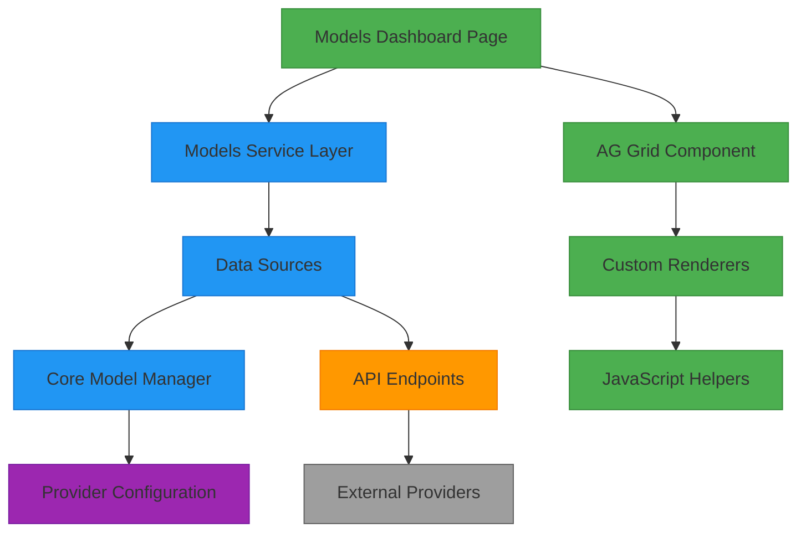
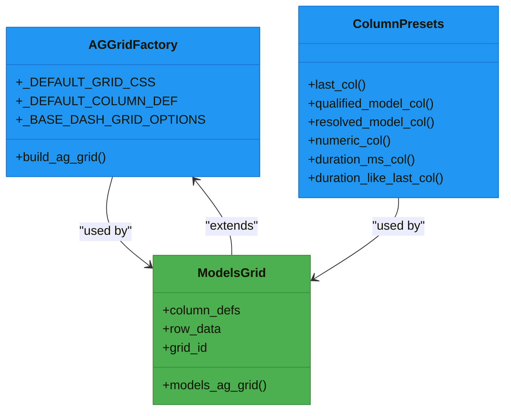
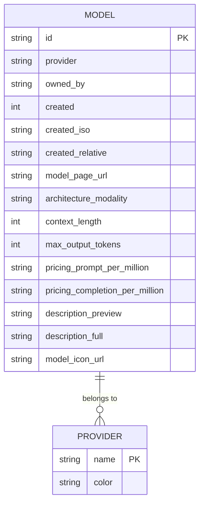
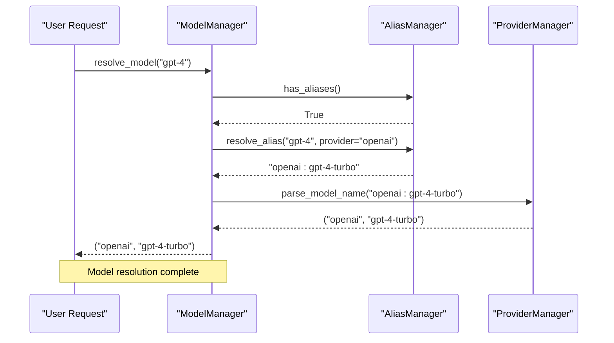
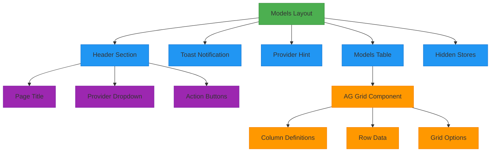
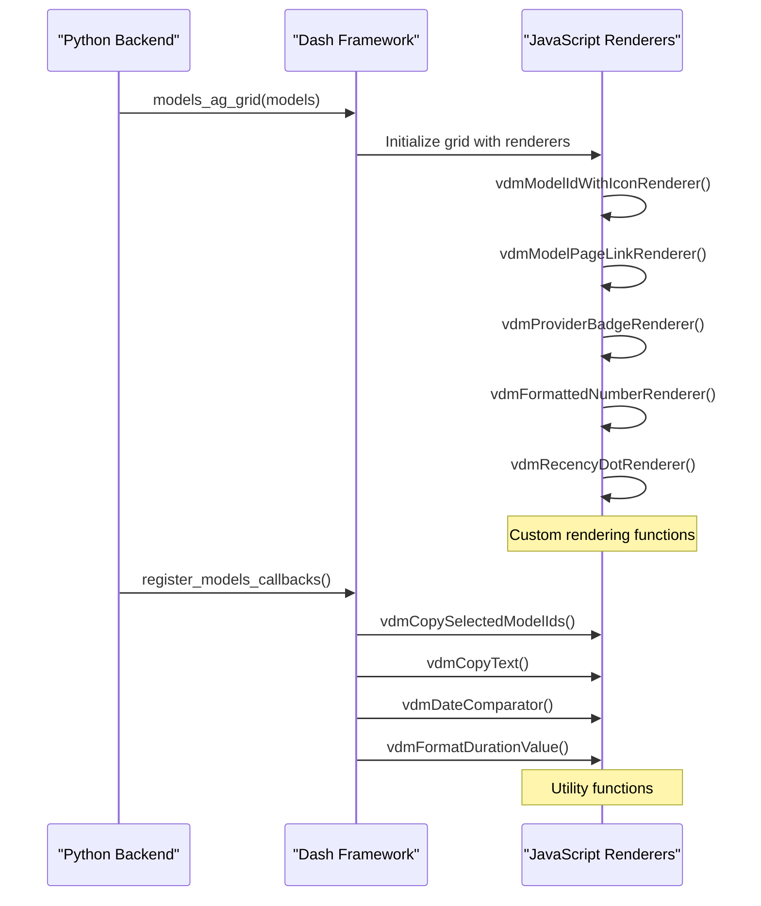

# Models

<cite>
**Referenced Files in This Document**   
- [models.py](file://src/dashboard/pages/models.py)
- [models.py](file://src/dashboard/services/models.py)
- [model_manager.py](file://src/core/model_manager.py)
- [ag_grid.py](file://src/dashboard/components/ag_grid.py)
- [transformers.py](file://src/dashboard/ag_grid/transformers.py)
- [data_sources.py](file://src/dashboard/data_sources.py)
- [column_presets.py](file://src/dashboard/ag_grid/column_presets.py)
- [factories.py](file://src/dashboard/ag_grid/factories.py)
- [ui.py](file://src/dashboard/components/ui.py)
- [models.js](file://assets/ag_grid/10-vdm-grid-renderers.js)
- [helpers.js](file://assets/ag_grid/20-vdm-grid-helpers.js)
</cite>

## Table of Contents
1. [Introduction](#introduction)
2. [Core Functionality](#core-functionality)
3. [Data Flow Architecture](#data-flow-architecture)
4. [AG Grid Implementation](#ag-grid-implementation)
5. [Model Data Structure](#model-data-structure)
6. [Provider and Alias Management](#provider-and-alias-management)
7. [User Interface Components](#user-interface-components)
8. [Custom Renderers and JavaScript Integration](#custom-renderers-and-javascript-integration)
9. [Usage and Troubleshooting](#usage-and-troubleshooting)
10. [Conclusion](#conclusion)

## Introduction

The Models dashboard page provides a comprehensive view of available Large Language Models (LLMs) within the system, serving as a central interface for monitoring, debugging, and validating model configurations. This documentation details the architecture, implementation, and usage of the Models dashboard, focusing on its role in displaying model information, provider mappings, alias configurations, and usage statistics.

The dashboard leverages AG Grid for data presentation, offering advanced features such as sorting, filtering, and dynamic updates. It integrates with the core model manager to retrieve model data and exposes this information through a service layer that formats the data for optimal display. The page enables users to validate model routing, debug alias resolution, and monitor provider-specific model availability, making it an essential tool for system administrators and developers.

**Section sources**
- [models.py](file://src/dashboard/pages/models.py#L1-L139)

## Core Functionality

The Models dashboard page serves as a centralized interface for managing and monitoring LLM models within the system. Its primary functions include displaying available models, their provider mappings, alias configurations, and usage statistics. The page provides a comprehensive view of the model ecosystem, enabling users to validate model routing, debug alias resolution, and monitor provider-specific model availability.

Key features of the Models dashboard include:
- **Model Listing**: Displays all available models with detailed information including provider, sub-provider, model ID, modality, context length, pricing, and description.
- **Provider Filtering**: Allows users to filter models by provider, with a dropdown selector that automatically populates with available providers from the system configuration.
- **Dynamic Updates**: The model list automatically refreshes every 30 seconds and can be manually refreshed using the "Refresh" button.
- **Bulk Operations**: Supports copying selected model IDs to the clipboard for easy reference or integration with other tools.
- **Model Details**: Provides detailed information about selected models through a drawer interface that displays comprehensive metadata.

The dashboard is designed to be intuitive and efficient, with sorting and filtering handled directly within the AG-Grid table component. This allows users to quickly find and analyze specific models without requiring additional navigation or complex queries.

**Section sources**
- [models.py](file://src/dashboard/pages/models.py#L1-L139)
- [models.py](file://src/dashboard/services/models.py#L1-L79)

## Data Flow Architecture

The Models dashboard follows a well-defined data flow architecture that connects the frontend interface with the backend model management system. This architecture ensures efficient data retrieval, processing, and presentation while maintaining separation of concerns between components.

**Diagram sources**
- [models.py](file://src/dashboard/pages/models.py#L1-L139)
- [models.py](file://src/dashboard/services/models.py#L1-L79)
- [model_manager.py](file://src/core/model_manager.py#L1-L117)
- [data_sources.py](file://src/dashboard/data_sources.py#L1-L362)

The data flow begins with the Models dashboard page requesting model data through the models service layer. The service layer coordinates with data sources to fetch the necessary information from both the core model manager and external API endpoints. The core model manager handles model resolution and alias processing, while the data sources module manages HTTP requests to retrieve model information from providers.

Once the data is retrieved, it is processed and transformed by the service layer into a format suitable for display in the AG Grid component. The transformation process includes normalizing model attributes, formatting timestamps, and preparing data for custom renderers. Finally, the processed data is rendered in the AG Grid with the help of custom JavaScript renderers that enhance the user interface with interactive elements and visual indicators.

## AG Grid Implementation

The Models dashboard utilizes AG Grid as its primary data table component, providing a rich and interactive interface for displaying model information. The implementation is designed to offer advanced features such as sorting, filtering, pagination, and dynamic updates while maintaining a consistent user experience across different data views.

**Diagram sources**
- [ag_grid.py](file://src/dashboard/components/ag_grid.py#L1-L636)
- [factories.py](file://src/dashboard/ag_grid/factories.py#L1-L96)
- [column_presets.py](file://src/dashboard/ag_grid/column_presets.py#L1-L167)

The AG Grid implementation is built on a modular architecture that promotes code reuse and consistency across different grid components in the application. The `build_ag_grid` function in the factories module serves as a central factory method that creates AG Grid components with standardized configuration options. This includes default styling, column definitions, and grid behavior settings that ensure a consistent appearance and functionality across all grids in the dashboard.

The grid configuration includes several key features:
- **Sorting**: Users can sort data by clicking on column headers, with the ability to sort in ascending or descending order.
- **Filtering**: Each column supports filtering, allowing users to narrow down the displayed data based on specific criteria.
- **Pagination**: The grid supports pagination with configurable page sizes (25, 50, 100, 200) to manage large datasets efficiently.
- **Row Selection**: Multi-row selection is enabled, allowing users to select multiple models for bulk operations.
- **Responsive Design**: The grid is designed to be responsive, adapting to different screen sizes and orientations.

The Models grid specifically is configured with a set of columns that display relevant model information, including creation date, actions, sub-provider, model ID, modality, context length, maximum output tokens, pricing information, and description. The grid is initialized with a default sort by creation date (newest first) and includes custom cell renderers for enhanced functionality.

**Section sources**
- [ag_grid.py](file://src/dashboard/components/ag_grid.py#L1-L636)
- [factories.py](file://src/dashboard/ag_grid/factories.py#L1-L96)
- [column_presets.py](file://src/dashboard/ag_grid/column_presets.py#L1-L167)

## Model Data Structure

The Models dashboard displays a comprehensive set of attributes for each available LLM, organized in a structured format that facilitates easy navigation and analysis. The data structure is designed to provide both essential information and detailed metadata, enabling users to make informed decisions about model selection and usage.

**Diagram sources**
- [transformers.py](file://src/dashboard/ag_grid/transformers.py#L1-L486)
- [model_manager.py](file://src/core/model_manager.py#L1-L117)

The model data structure includes the following key fields:

- **id**: The unique identifier for the model, displayed prominently in the grid and used for copy operations.
- **provider**: The name of the provider that hosts the model, used for filtering and grouping.
- **owned_by**: The sub-provider or organization that owns the model, providing additional context about the model's origin.
- **created**: The timestamp (in seconds) when the model was created, used for sorting and age calculation.
- **created_iso**: The ISO-formatted date (yyyy-mm-dd) derived from the creation timestamp, displayed in the grid.
- **created_relative**: A human-readable relative time string (e.g., "2h ago") that indicates how long ago the model was created.
- **model_page_url**: The URL to the provider's model page, used for the "Open provider page" link in the details drawer.
- **architecture_modality**: The input/output modalities supported by the model (e.g., "text,image->text").
- **context_length**: The maximum number of tokens the model can process in a single context.
- **max_output_tokens**: The maximum number of tokens the model can generate in a single response.
- **pricing_prompt_per_million**: The cost per million input tokens, formatted as a string with two decimal places.
- **pricing_completion_per_million**: The cost per million output tokens, formatted as a string with two decimal places.
- **description_preview**: A truncated version of the model description (first 40 characters) displayed in the grid.
- **description_full**: The complete model description, displayed in the details drawer.
- **model_icon_url**: The URL to the model's icon image, displayed alongside the model ID in the grid.

The data structure is transformed from the raw model data retrieved from the API through the `models_row_data` function in the transformers module. This transformation process normalizes the data, extracts relevant fields, and formats values for optimal display in the AG Grid component. The transformation ensures that all necessary fields are present and properly formatted, even when the source data varies in structure or completeness.

**Section sources**
- [transformers.py](file://src/dashboard/ag_grid/transformers.py#L1-L486)
- [model_manager.py](file://src/core/model_manager.py#L1-L117)

## Provider and Alias Management

The Models dashboard integrates closely with the system's provider and alias management capabilities, providing visibility into how models are routed and resolved within the proxy architecture. This integration enables users to validate model routing configurations, debug alias resolution issues, and monitor provider-specific model availability.

The core of this functionality is the ModelManager class in the core module, which handles the resolution of model names to their actual provider and model identifiers. The resolution process follows a specific sequence:

1. **Alias Resolution**: If aliases are configured, the system first attempts to resolve the model name through the alias manager. Literal model names (prefixed with '!') bypass alias matching but still allow normalization into provider:model form when needed.
2. **Provider Context Determination**: The system determines the provider context either from an explicit prefix in the model name or from the default provider configuration.
3. **Alias Application**: If no provider prefix is present, the system resolves aliases using the default provider scope. If a provider prefix is present, cross-provider resolution is allowed.
4. **Provider Parsing**: The final step parses the provider prefix from the resolved model name to determine the actual provider and model name.

**Diagram sources**
- [model_manager.py](file://src/core/model_manager.py#L1-L117)
- [models.py](file://src/dashboard/services/models.py#L1-L79)

The dashboard service layer exposes this functionality through the `build_models_view` function, which fetches model data and constructs the view model for the dashboard. This function coordinates with the data sources module to retrieve health information, provider lists, and model data from the API endpoints. It then processes this data to create a comprehensive view that includes provider options, selected provider context, and hint text for the user interface.

The provider filtering functionality in the dashboard allows users to view models from specific providers, which is particularly useful for debugging provider-specific issues or comparing models across different providers. The provider dropdown is populated with available providers from the system configuration, with the default provider highlighted for easy identification.

**Section sources**
- [model_manager.py](file://src/core/model_manager.py#L1-L117)
- [models.py](file://src/dashboard/services/models.py#L1-L79)
- [data_sources.py](file://src/dashboard/data_sources.py#L1-L362)

## User Interface Components

The Models dashboard is composed of several interconnected UI components that work together to provide a cohesive and user-friendly experience. These components are organized in a hierarchical structure that separates concerns and promotes reusability across different parts of the application.

**Diagram sources**
- [models.py](file://src/dashboard/pages/models.py#L1-L139)
- [ag_grid.py](file://src/dashboard/components/ag_grid.py#L1-L636)
- [ui.py](file://src/dashboard/components/ui.py#L1-L592)

The main layout of the Models page is defined in the `models_layout` function, which creates a structured interface with several key sections:

- **Header Section**: Contains the page title ("Available Models"), provider dropdown filter, and action buttons (Copy selected IDs, Refresh).
- **Toast Notification**: A temporary message that appears when models are copied to the clipboard, providing feedback to the user.
- **Provider Hint**: A text element that displays which provider's models are currently being shown, providing context for the user.
- **Models Table**: The main content area that displays the AG Grid component with the model data.
- **Hidden Stores**: Several hidden Dash components that store state information, such as selected model IDs, row data, and grid initialization status.

The models table itself is implemented as a reusable component that can be easily integrated into different parts of the application. It is created by the `models_table` function in the UI module, which wraps the AG Grid component with additional functionality. The table supports sorting and filtering through the AG Grid's built-in features, with the initial sort order set to creation date (newest first).

The provider dropdown filter allows users to select which provider's models to display, with options populated from the system configuration. When a provider is selected, the model list is automatically filtered to show only models from that provider. The "Copy selected IDs" button enables users to copy the IDs of selected models to the clipboard, which is useful for referencing models in other contexts. The "Refresh" button allows users to manually refresh the model list, which is also updated automatically every 30 seconds.

**Section sources**
- [models.py](file://src/dashboard/pages/models.py#L1-L139)
- [ag_grid.py](file://src/dashboard/components/ag_grid.py#L1-L636)
- [ui.py](file://src/dashboard/components/ui.py#L1-L592)

## Custom Renderers and JavaScript Integration

The Models dashboard leverages custom JavaScript renderers to enhance the functionality and user experience of the AG Grid component. These renderers are implemented in external JavaScript files and integrated with the Dash application through a well-defined interface that allows for rich client-side interactions.

**Diagram sources**
- [ag_grid.py](file://src/dashboard/components/ag_grid.py#L1-L636)
- [models.js](file://assets/ag_grid/10-vdm-grid-renderers.js#L1-L320)
- [helpers.js](file://assets/ag_grid/20-vdm-grid-helpers.js#L1-L129)

The custom renderers are organized into two main JavaScript files:

- **10-vdm-grid-renderers.js**: Contains the cell renderer functions that control how data is displayed in the AG Grid cells. These include:
  - `vdmModelIdWithIconRenderer`: Renders the model ID with an optional icon image, creating a visually distinctive representation of each model.
  - `vdmModelPageLinkRenderer`: Renders an action icon that links to the provider's model page, allowing users to easily access additional information about the model.
  - `vdmProviderBadgeRenderer`: Renders provider names as colored badges, using Bootstrap's badge classes for consistent styling.
  - `vdmFormattedNumberRenderer`: Formats numeric values with thousand separators for improved readability.
  - `vdmQualifiedModelRenderer`: Renders qualified model IDs with provider badges and separators.
  - `vdmRecencyDotRenderer`: Renders a recency indicator with a colored dot and relative time text, used for showing how recently a model was accessed.

- **20-vdm-grid-helpers.js**: Contains utility functions that support the grid functionality:
  - `vdmDateComparator`: A custom comparator function for sorting date columns.
  - `vdmCopySelectedModelIds`: Copies the IDs of selected models to the clipboard.
  - `vdmCopyText`: Copies arbitrary text to the clipboard with fallback support for older browsers.
  - `vdmFormatDurationValue`: Formats duration values in milliseconds into human-readable strings.
  - `vdmFormatDurationTooltip`: Formats duration values for display in tooltips.

The integration between Python and JavaScript is facilitated by the `get_ag_grid_clientside_callback` function in the scripts module, which registers the client-side callbacks with the Dash application. This allows the Python code to invoke JavaScript functions in response to user interactions, such as clicking the "Copy selected IDs" button or selecting a model in the grid.

The custom renderers enhance the user experience by providing visual cues and interactive elements that would be difficult to achieve with standard HTML and CSS alone. For example, the recency dot renderer uses a color gradient to indicate how recently a model was accessed, with red indicating very recent activity and black indicating activity more than an hour ago. This visual indicator helps users quickly identify active models without needing to parse timestamp values.

**Section sources**
- [ag_grid.py](file://src/dashboard/components/ag_grid.py#L1-L636)
- [models.js](file://assets/ag_grid/10-vdm-grid-renderers.js#L1-L320)
- [helpers.js](file://assets/ag_grid/20-vdm-grid-helpers.js#L1-L129)

## Usage and Troubleshooting

The Models dashboard page is designed to be intuitive and user-friendly, but understanding its capabilities and potential issues can help users make the most of its features. This section provides guidance on using the page effectively and troubleshooting common problems.

### Using the Models Dashboard

To effectively use the Models dashboard for validating model routing, debugging alias resolution, and monitoring provider-specific model availability:

1. **Validate Model Routing**: Use the provider dropdown filter to isolate models from specific providers. This allows you to verify that models are correctly associated with their respective providers and that the routing configuration is working as expected.

2. **Debug Alias Resolution**: When troubleshooting alias issues, compare the model IDs displayed in the grid with the expected aliases. Use the "Copy selected IDs" feature to copy model IDs and verify they match the expected values in your configuration files.

3. **Monitor Provider Availability**: Regularly check the model list to ensure that expected models are available from each provider. The automatic refresh every 30 seconds helps keep the information current, but you can also manually refresh using the "Refresh" button.

4. **Analyze Model Details**: Click on a model in the grid to open the details drawer, which provides comprehensive information about the model including its description, pricing, context length, and other metadata. This is particularly useful for comparing models or verifying configuration settings.

5. **Copy Model IDs**: Select one or more models in the grid and click "Copy selected IDs" to copy their IDs to the clipboard. This is useful for referencing models in API calls, configuration files, or documentation.

### Troubleshooting Common Issues

When encountering issues with the Models dashboard, consider the following common problems and their solutions:

- **Missing Models**: If expected models are not appearing in the list:
  - Verify that the provider is correctly configured and accessible.
  - Check the provider's API status and authentication credentials.
  - Ensure that the model is not filtered out by the provider dropdown selection.
  - Confirm that the model is not excluded by any routing rules or filters in the configuration.

- **Incorrect Status Displays**: If model statuses or metadata appear incorrect:
  - Refresh the page to ensure you have the latest data.
  - Verify that the model information in the provider's API matches what is displayed in the dashboard.
  - Check for any caching issues that might be serving stale data.
  - Review the model's configuration in the system to ensure it matches the expected values.

- **Alias Resolution Issues**: If aliases are not resolving correctly:
  - Verify that the alias configuration files are correctly formatted and located in the expected directory.
  - Check that the alias manager is properly initialized and has access to the configuration.
  - Ensure that the model names and aliases match exactly, including case sensitivity.
  - Test alias resolution using the CLI tools to isolate whether the issue is with the dashboard or the core functionality.

- **Performance Problems**: If the dashboard is slow to load or update:
  - Check the network connection between the dashboard and the API endpoints.
  - Verify that the provider APIs are responding within expected timeframes.
  - Consider reducing the frequency of automatic refreshes if network conditions are poor.
  - Monitor system resources to ensure the server has sufficient capacity to handle requests.

By following these guidelines, users can effectively leverage the Models dashboard to manage and monitor their LLM infrastructure, ensuring optimal performance and reliability.

**Section sources**
- [models.py](file://src/dashboard/pages/models.py#L1-L139)
- [models.py](file://src/dashboard/services/models.py#L1-L79)
- [model_manager.py](file://src/core/model_manager.py#L1-L117)
- [data_sources.py](file://src/dashboard/data_sources.py#L1-L362)

## Conclusion

The Models dashboard page provides a comprehensive and user-friendly interface for managing and monitoring LLM models within the system. By integrating with the core model manager and leveraging AG Grid for data presentation, it offers a powerful tool for validating model routing, debugging alias resolution, and monitoring provider-specific model availability.

The architecture of the dashboard follows a clean separation of concerns, with distinct components for data retrieval, processing, and presentation. The data flow from the core model manager through the service layer to the AG Grid component ensures efficient and reliable information delivery. The use of custom JavaScript renderers enhances the user experience with visual indicators and interactive elements that facilitate quick analysis and decision-making.

Key features such as provider filtering, dynamic updates, bulk operations, and detailed model information make the dashboard an essential tool for system administrators and developers. The ability to copy model IDs, view comprehensive metadata, and monitor model availability in real-time supports effective management of the LLM infrastructure.

By understanding the architecture and functionality of the Models dashboard, users can maximize its potential for optimizing model usage, troubleshooting issues, and ensuring the reliability of their AI applications. The combination of robust backend processing and intuitive frontend design creates a powerful tool that bridges the gap between complex system internals and user-friendly interface.