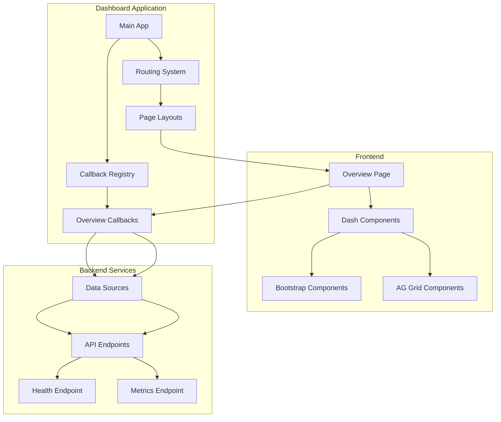
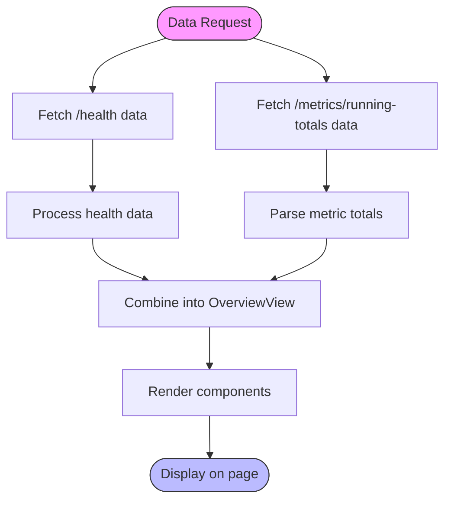
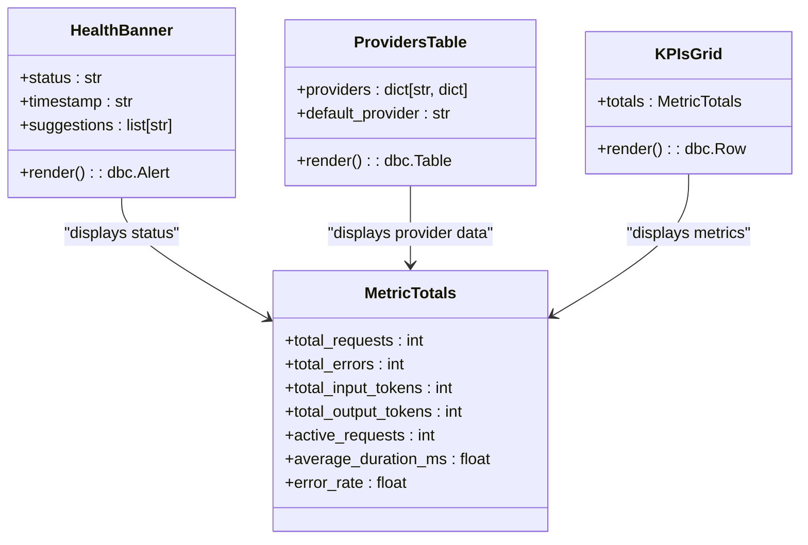

# Overview

<cite>
**Referenced Files in This Document**   
- [overview.py](file://src/dashboard/pages/overview.py)
- [overview.py](file://src/dashboard/services/overview.py)
- [app.py](file://src/dashboard/app.py)
- [callbacks/overview.py](file://src/dashboard/callbacks/overview.py)
- [components/overview.py](file://src/dashboard/components/overview.py)
- [components/metrics.py](file://src/dashboard/components/metrics.py)
- [data_sources.py](file://src/dashboard/data_sources.py)
- [normalize.py](file://src/dashboard/normalize.py)
- [ui.py](file://src/dashboard/components/ui.py)
</cite>

## Table of Contents
1. [Introduction](#introduction)
2. [Core Components](#core-components)
3. [Architecture Overview](#architecture-overview)
4. [Data Flow and Processing](#data-flow-and-processing)
5. [Visual Components](#visual-components)
6. [Real-time Updates and Refresh Mechanism](#real-time-updates-and-refresh-mechanism)
7. [Interpreting Key Metrics](#interpreting-key-metrics)
8. [Troubleshooting Guide](#troubleshooting-guide)

## Introduction

The Dashboard Overview page serves as the central landing page for monitoring the health and activity of the Vandamme Proxy system. It provides a high-level summary of proxy performance through visual components that display key metrics such as total requests, active connections, error rates, and system uptime. The page is designed to give administrators and operators immediate visibility into the system's operational status and performance trends.

The Overview page is implemented as part of a Dash-based dashboard application and is accessible at the root dashboard path. It integrates with backend services to fetch real-time data about the proxy's health and metrics, presenting this information through a combination of summary cards, tables, and status indicators. The page supports both automatic periodic updates and manual refresh functionality, ensuring that users have access to current system information.

**Section sources**
- [overview.py](file://src/dashboard/pages/overview.py#L7-L93)
- [app.py](file://src/dashboard/app.py#L41-L145)

## Core Components

The Dashboard Overview page is composed of several core components that work together to display system information. The main layout is defined in the `overview_layout()` function, which structures the page into a responsive container with multiple rows containing different visual elements. The page includes a header with the application title and user controls for theme toggling and manual refresh.

Key components include the health banner, which displays the current system status with color-coded indicators; the providers table, which lists configured providers with their connection details; and the KPIs grid, which presents key performance indicators in a card-based layout. The page also includes a section for testing upstream connectivity, allowing users to verify connections to external services.

The OverviewView dataclass in the services module encapsulates the complete view state, containing all the components that will be rendered on the page. This design pattern separates the data fetching and processing logic from the presentation layer, making the code more maintainable and testable.

**Section sources**
- [overview.py](file://src/dashboard/pages/overview.py#L7-L93)
- [overview.py](file://src/dashboard/services/overview.py#L15-L51)
- [components/overview.py](file://src/dashboard/components/overview.py#L11-L115)
- [components/metrics.py](file://src/dashboard/components/metrics.py#L29-L101)

## Architecture Overview

The Dashboard Overview page is integrated into the main Dash application through a modular architecture that separates concerns and promotes code reuse. The application is initialized in `app.py`, where the dashboard is configured with appropriate styling, assets, and routing. The routing system directs requests to the appropriate page layout based on the URL path, with the Overview page serving as the default landing page.

**Diagram sources **
- [app.py](file://src/dashboard/app.py#L41-L145)
- [routing.py](file://src/dashboard/routing.py#L19-L43)
- [overview.py](file://src/dashboard/pages/overview.py#L7-L93)
- [callbacks/overview.py](file://src/dashboard/callbacks/overview.py#L12-L80)

## Data Flow and Processing

The data displayed on the Overview page follows a well-defined flow from backend services through processing layers to the final presentation. The process begins with data retrieval from backend API endpoints, specifically the `/health` and `/metrics/running-totals` endpoints. These endpoints provide information about system health and request metrics respectively.

The data sources module contains asynchronous functions for fetching this data, handling HTTP requests with appropriate error handling and response parsing. The fetched data is then processed through normalization functions that transform the raw API responses into structured data suitable for display. The `parse_metric_totals` function in the normalize module converts the metrics data into a `MetricTotals` dataclass instance, which standardizes the data format for consistent presentation.

**Diagram sources **
- [data_sources.py](file://src/dashboard/data_sources.py#L33-L96)
- [normalize.py](file://src/dashboard/normalize.py#L72-L104)
- [services/overview.py](file://src/dashboard/services/overview.py#L24-L51)

## Visual Components

The Overview page utilizes several visual components to present system information effectively. The health banner provides a prominent status indicator at the top of the page, using color coding (green for healthy, yellow for degraded, gray for unknown) to quickly communicate system status. The banner also displays the timestamp of the last update, allowing users to assess data freshness.

The KPIs grid displays key performance indicators in a card-based layout, with each card showing a specific metric such as total requests, active connections, input/output tokens, and error rates. Duration metrics are color-coded based on performance thresholds, with green indicating fast response times, yellow for moderate times, and red for slow responses. The providers table lists all configured providers with their API formats, base URLs, and API key hashes, with the default provider highlighted for easy identification.

**Diagram sources **
- [components/overview.py](file://src/dashboard/components/overview.py#L11-L115)
- [components/metrics.py](file://src/dashboard/components/metrics.py#L29-L101)
- [ui.py](file://src/dashboard/components/ui.py#L63-L73)
- [normalize.py](file://src/dashboard/normalize.py#L7-L22)

## Real-time Updates and Refresh Mechanism

The Overview page implements a real-time update mechanism through the use of Dash callbacks and interval components. The page automatically refreshes data at regular intervals, with the default refresh interval set to 10 seconds as defined by the `vdm-overview-poll` interval component. This ensures that users have access to current system information without needing to manually refresh the page.

In addition to automatic polling, the page provides a "Refresh now" button that allows users to manually trigger an immediate data refresh. This is particularly useful when users want to check the current status after making configuration changes or when investigating issues. The callback system handles both the interval-based updates and manual refresh requests through the same processing pipeline, ensuring consistency in data handling.

The refresh mechanism is implemented in the `register_overview_callbacks` function, which sets up a callback that responds to both the interval timer and the refresh button click events. When triggered, this callback invokes the `build_overview_view` function to fetch and process the latest data, then updates all the page components with the new information. Error handling is integrated into this process, ensuring that failures in data retrieval are communicated to the user through appropriate error messages.

**Section sources**
- [overview.py](file://src/dashboard/pages/overview.py#L88)
- [callbacks/overview.py](file://src/dashboard/callbacks/overview.py#L18-L38)
- [services/overview.py](file://src/dashboard/services/overview.py#L24-L51)

## Interpreting Key Metrics

The Overview page presents several key metrics that provide insight into the proxy's performance and health. The total requests metric indicates the volume of API calls processed by the proxy, while the active connections metric shows the number of currently in-flight requests. These metrics help identify traffic patterns and potential bottlenecks in the system.

The error rate is calculated as the ratio of total errors to total requests, providing a measure of system reliability. High error rates may indicate issues with upstream providers, configuration problems, or client-side issues. Duration metrics, including average duration and streaming/non-streaming averages, help assess performance and identify slow responses that may impact user experience.

The system status banner provides immediate visibility into the overall health of the proxy. A "healthy" status indicates normal operation, while "degraded" suggests potential issues that may require attention. The providers table allows users to verify that all expected providers are properly configured and accessible, with API key hashes displayed to confirm authentication setup.

When interpreting these metrics, it's important to consider them in context. For example, a temporary spike in error rates might be expected during provider maintenance windows, while sustained high error rates warrant investigation. Similarly, increases in active connections during peak usage periods may be normal, but persistent high connection counts could indicate resource constraints.

**Section sources**
- [components/metrics.py](file://src/dashboard/components/metrics.py#L30-L55)
- [components/overview.py](file://src/dashboard/components/overview.py#L83-L115)
- [normalize.py](file://src/dashboard/normalize.py#L58-L62)

## Troubleshooting Guide

When encountering issues with the Dashboard Overview page, several common problems and their solutions should be considered. If data appears stale or is not updating, first verify that the `LOG_REQUEST_METRICS` environment variable is set to `true`, as metrics collection must be enabled for the page to display meaningful data. If metrics are disabled, a callout will appear on the page with instructions for enabling them.

If the page displays error messages or fails to load, check the connectivity between the dashboard and the proxy API. The dashboard retrieves data from endpoints like `/health` and `/metrics/running-totals`, so network issues or API service interruptions will prevent data loading. The "Run test connection" button in the connectivity section can help diagnose these issues by testing direct communication with upstream services.

For missing or incorrect provider information, verify the proxy configuration files and ensure that provider settings are correctly specified. The providers table displays API key hashes rather than full keys for security, so if keys appear as "<not set>", this indicates that no API key has been configured for that provider.

When investigating performance issues, examine the duration metrics and error rates. High average durations may indicate slow upstream providers or network latency, while high error rates could point to authentication problems, rate limiting, or provider outages. The real-time nature of the data allows users to correlate metric changes with specific events or configuration changes.

**Section sources**
- [services/overview.py](file://src/dashboard/services/overview.py#L43-L50)
- [data_sources.py](file://src/dashboard/data_sources.py#L28-L31)
- [components/metrics.py](file://src/dashboard/components/metrics.py#L12-L26)
- [callbacks/overview.py](file://src/dashboard/callbacks/overview.py#L45-L80)