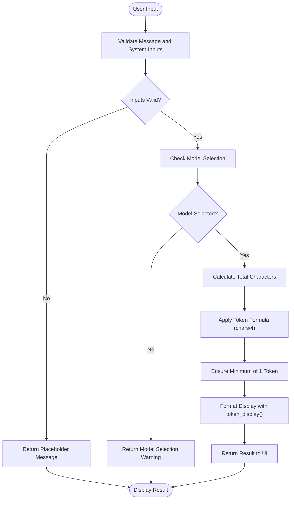
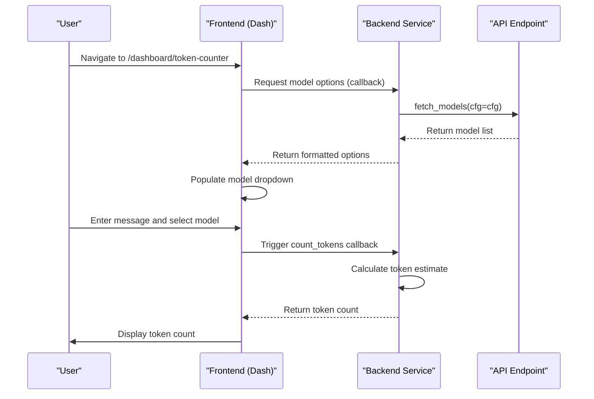
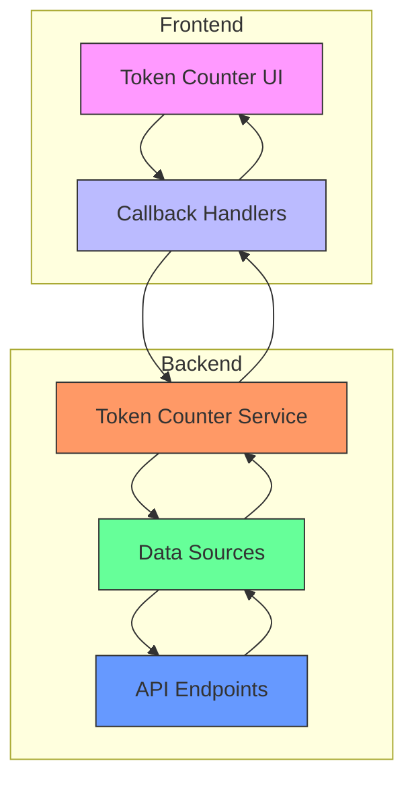

# Token Counter

<cite>
**Referenced Files in This Document**   
- [token_counter.py](file://src/dashboard/pages/token_counter.py)
- [token_counter.py](file://src/dashboard/callbacks/token_counter.py)
- [token_counter.py](file://src/dashboard/services/token_counter.py)
- [ui.py](file://src/dashboard/components/ui.py)
- [data_sources.py](file://src/dashboard/data_sources.py)
- [message_utils.py](file://src/conversion/message_utils.py)
- [models_converter.py](file://src/conversion/models_converter.py)
- [endpoints.py](file://src/api/endpoints.py)
- [routing.py](file://src/dashboard/routing.py)
- [app.py](file://src/dashboard/app.py)
- [dashboard.md](file://docs/dashboard.md)
</cite>

## Table of Contents
1. [Introduction](#introduction)
2. [Core Functionality](#core-functionality)
3. [Token Counting Implementation](#token-counting-implementation)
4. [Frontend-Backend Integration](#frontend-backend-integration)
5. [Model-Specific Considerations](#model-specific-considerations)
6. [Usage Guidance](#usage-guidance)
7. [Architecture Overview](#architecture-overview)

## Introduction

The Token Counter dashboard page provides a real-time tool for estimating and tracking token usage across requests, enabling cost monitoring and quota management for LLM operations. This interactive utility allows users to input messages and system prompts to receive immediate token estimates before making actual API calls, helping to optimize prompt efficiency and manage budget constraints.

The dashboard page is accessible at `/dashboard/token-counter` and integrates with the backend services to provide accurate token estimation based on the selected model. The tool is designed to help users identify high-usage endpoints and optimize their prompt engineering strategies by providing immediate feedback on token consumption.

**Section sources**
- [token_counter.py](file://src/dashboard/pages/token_counter.py#L7-L121)
- [dashboard.md](file://docs/dashboard.md#L89-L113)

## Core Functionality

The Token Counter page offers a user-friendly interface for estimating token usage with the following key features:

- **Model Selection**: A dropdown menu populated with available models from configured providers, allowing users to select the target model for token estimation
- **System Message Input**: An optional field for entering system messages that contribute to the overall token count
- **Message Input**: A text area for entering the main message content to be analyzed for token usage
- **Real-time Counting**: Immediate token estimation as users type, with results displayed prominently
- **Clear Functionality**: A button to reset all input fields and start fresh

The interface is designed with a clean, intuitive layout that separates configuration options from the message input area, making it easy for users to understand how different components contribute to the overall token count. The token estimation is displayed prominently using a large, readable format that emphasizes the estimated token count.

When no message or system prompt is entered, the interface displays a helpful prompt to guide users. Similarly, when a model is not selected, a warning message appears to indicate that token counting cannot proceed without a selected model.

**Section sources**
- [token_counter.py](file://src/dashboard/pages/token_counter.py#L7-L121)
- [dashboard.md](file://docs/dashboard.md#L93-L98)

## Token Counting Implementation

The token counting functionality is implemented through a combination of frontend and backend components that work together to provide accurate estimates. The core algorithm uses a character-based approximation method, dividing the total character count by 4 to estimate the number of tokens.

The implementation follows these steps:
1. Calculate the total character count from both the message and system message inputs
2. Apply the approximation formula (total_chars // 4) to estimate token count
3. Ensure a minimum token count of 1 even for very short inputs
4. Display the result using a prominent visual format

The estimation method is intentionally simple and fast, providing immediate feedback to users without requiring actual API calls to the LLM providers. This approach balances accuracy with responsiveness, allowing users to quickly iterate on their prompts.

For more accurate token counting, the system could potentially leverage provider-specific tokenization methods, but the current implementation prioritizes speed and simplicity for the estimation use case.

**Diagram sources**
- [token_counter.py](file://src/dashboard/callbacks/token_counter.py#L39-L53)
- [ui.py](file://src/dashboard/components/ui.py#L567-L575)

**Section sources**
- [token_counter.py](file://src/dashboard/callbacks/token_counter.py#L39-L53)
- [ui.py](file://src/dashboard/components/ui.py#L567-L575)
- [endpoints.py](file://src/api/endpoints.py#L947-L975)

## Frontend-Backend Integration

The Token Counter page integrates frontend and backend components through a well-defined architecture that follows the Dash framework patterns. The integration involves several key components working together:

The frontend layout is defined in `token_counter_layout()` which creates the user interface with input fields, dropdowns, and display elements. This layout is registered in the dashboard routing system and becomes accessible at the `/dashboard/token-counter` path.

The backend integration occurs through callback functions registered in `register_token_counter_callbacks()`. These callbacks handle the dynamic behavior of the page:
- Loading available models from the API when the page loads
- Calculating token counts when input values change
- Clearing input fields when the clear button is clicked

The data flow follows this pattern:
1. The frontend requests model options from the backend via the callback system
2. The backend service `build_token_counter_model_options()` fetches models from the API
3. The frontend displays the token count result using the `token_display()` component
4. User interactions trigger callbacks that update the display in real-time

This integration ensures that the token counter always has access to the most up-to-date list of available models while providing a responsive user experience.

**Diagram sources**
- [token_counter.py](file://src/dashboard/pages/token_counter.py#L7-L121)
- [token_counter.py](file://src/dashboard/callbacks/token_counter.py#L12-L63)
- [services/token_counter.py](file://src/dashboard/services/token_counter.py#L22-L60)
- [data_sources.py](file://src/dashboard/data_sources.py#L117-L168)
- [routing.py](file://src/dashboard/routing.py#L30-L31)
- [app.py](file://src/dashboard/app.py#L140)

**Section sources**
- [token_counter.py](file://src/dashboard/pages/token_counter.py#L7-L121)
- [token_counter.py](file://src/dashboard/callbacks/token_counter.py#L12-L63)
- [services/token_counter.py](file://src/dashboard/services/token_counter.py#L22-L60)
- [data_sources.py](file://src/dashboard/data_sources.py#L117-L168)
- [routing.py](file://src/dashboard/routing.py#L30-L31)
- [app.py](file://src/dashboard/app.py#L140)

## Model-Specific Considerations

While the Token Counter uses a universal approximation method (characters divided by 4) for estimating token counts, it's important to understand that different LLM providers and models have varying tokenization schemes. The current implementation provides a consistent estimation approach across all models, but users should be aware of potential discrepancies between the estimated counts and actual token usage.

The model selection dropdown is populated with models from all configured providers, including OpenAI, Anthropic, and others. When a user selects a model, the token counter uses the same estimation algorithm regardless of the underlying provider. This approach ensures a consistent user experience but may not reflect the precise tokenization behavior of each specific model.

For more accurate token counting, the system could potentially integrate with provider-specific tokenization methods, but this would require additional API calls and might impact the responsiveness of the tool. The current design prioritizes speed and simplicity, making it ideal for quick estimations during prompt development.

Users should treat the token counts as approximations rather than exact values, using them as guidance for relative comparisons between different prompts rather than relying on them for precise cost calculations.

**Section sources**
- [token_counter.py](file://src/dashboard/callbacks/token_counter.py#L39-L53)
- [models_converter.py](file://src/conversion/models_converter.py#L6-L71)
- [message_utils.py](file://src/conversion/message_utils.py#L14-L57)

## Usage Guidance

The Token Counter page is designed to help users optimize their LLM interactions by providing immediate feedback on token usage. Here are recommended practices for effective use:

1. **Cost Monitoring**: Use the tool to estimate costs before making expensive API calls, especially when working with high-token models or large prompts
2. **Prompt Optimization**: Experiment with different phrasings and structures to find the most token-efficient way to express your request
3. **Quota Management**: Track your token usage patterns to stay within rate limits and budget constraints
4. **High-Usage Endpoint Identification**: Compare token counts across different request types to identify which endpoints or use cases consume the most tokens

To get the most value from the Token Counter:
- Always select the target model before entering your message
- Include system messages in your estimation when they are part of your actual requests
- Use the tool iteratively to refine prompts and reduce token consumption
- Combine token estimates with actual usage data from the metrics dashboard for comprehensive analysis

The tool is particularly useful during prompt engineering, allowing developers to quickly assess the token impact of different approaches before deploying them in production.

**Section sources**
- [token_counter.py](file://src/dashboard/pages/token_counter.py#L7-L121)
- [dashboard.md](file://docs/dashboard.md#L89-L113)

## Architecture Overview

The Token Counter feature is integrated into the overall dashboard architecture as a standalone page with dedicated frontend and backend components. The architecture follows a modular design with clear separation of concerns between presentation, business logic, and data access layers.

The component hierarchy shows how different parts of the system work together:
- **Presentation Layer**: The token_counter_layout() function defines the UI structure using Dash Bootstrap Components
- **Interaction Layer**: Callback functions handle user interactions and update the display dynamically
- **Service Layer**: The token_counter service prepares model options and handles business logic
- **Data Access Layer**: Data sources fetch model information from the API endpoints
- **Integration Layer**: The routing system connects the page to the main dashboard application

This architecture enables the Token Counter to remain responsive and maintainable while leveraging shared components and services from the broader dashboard system.

**Diagram sources**
- [token_counter.py](file://src/dashboard/pages/token_counter.py#L7-L121)
- [token_counter.py](file://src/dashboard/callbacks/token_counter.py#L12-L63)
- [services/token_counter.py](file://src/dashboard/services/token_counter.py#L22-L60)
- [data_sources.py](file://src/dashboard/data_sources.py#L117-L168)
- [routing.py](file://src/dashboard/routing.py#L30-L31)
- [app.py](file://src/dashboard/app.py#L140)

**Section sources**
- [token_counter.py](file://src/dashboard/pages/token_counter.py#L7-L121)
- [token_counter.py](file://src/dashboard/callbacks/token_counter.py#L12-L63)
- [services/token_counter.py](file://src/dashboard/services/token_counter.py#L22-L60)
- [data_sources.py](file://src/dashboard/data_sources.py#L117-L168)
- [routing.py](file://src/dashboard/routing.py#L30-L31)
- [app.py](file://src/dashboard/app.py#L140)