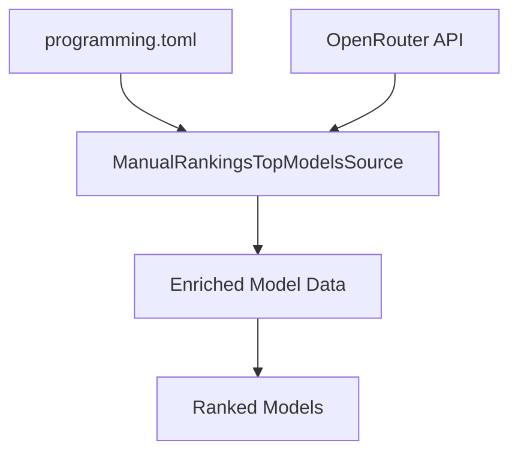
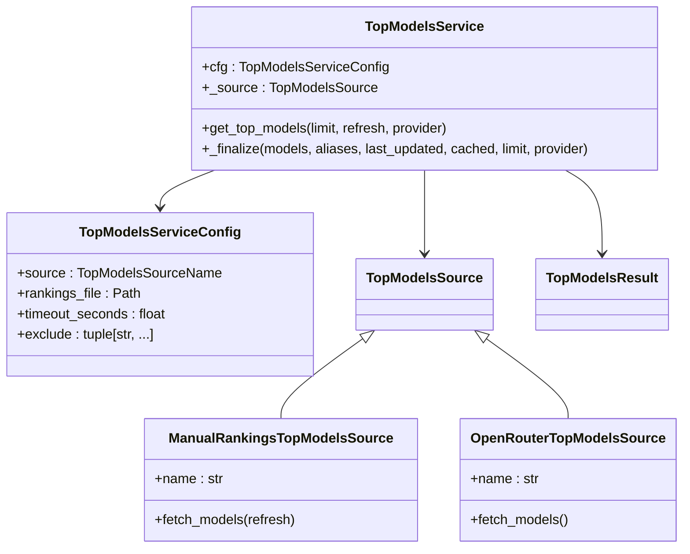
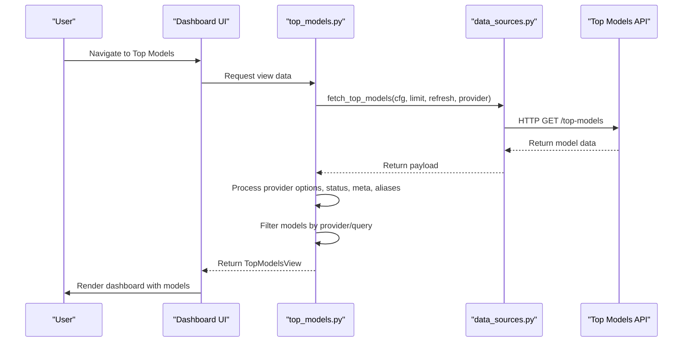
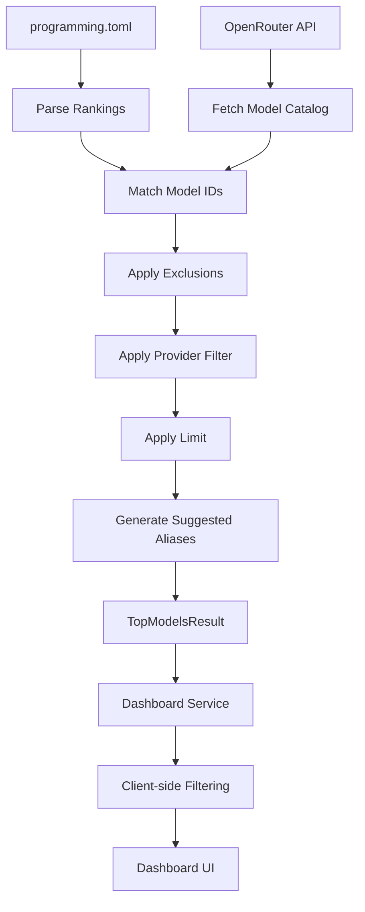
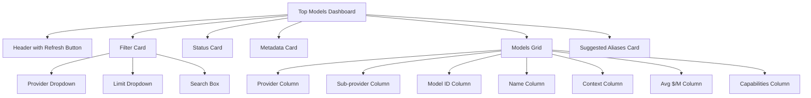

# Top Models

<cite>
**Referenced Files in This Document**   
- [programming.toml](file://config/top-models/programming.toml)
- [manual_rankings.py](file://src/top_models/manual_rankings.py)
- [service.py](file://src/top_models/service.py)
- [top_models.py](file://src/dashboard/services/top_models.py)
- [top_models.py](file://src/dashboard/pages/top_models.py)
- [data_sources.py](file://src/dashboard/data_sources.py)
- [transformers.py](file://src/dashboard/ag_grid/transformers.py)
- [ag_grid.py](file://src/dashboard/components/ag_grid.py)
- [top_models.md](file://docs/top-models.md)
</cite>

## Table of Contents
1. [Introduction](#introduction)
2. [Configuration and Manual Rankings](#configuration-and-manual-rankings)
3. [Top Models Service Architecture](#top-models-service-architecture)
4. [Dashboard Integration](#dashboard-integration)
5. [Data Flow and Processing](#data-flow-and-processing)
6. [Visualization and User Interface](#visualization-and-user-interface)
7. [Troubleshooting](#troubleshooting)
8. [Conclusion](#conclusion)

## Introduction

The Top Models dashboard page provides a comprehensive interface for discovering and analyzing the highest-performing AI models based on both manual configurations and dynamic data sources. This documentation explains the architecture, functionality, and usage of the Top Models feature, which enables users to identify optimal models for specific tasks, track performance trends, and validate ranking logic.

The system combines static manual rankings defined in configuration files with dynamic data from various sources to provide up-to-date model recommendations. The dashboard serves as the primary interface for visualizing these rankings, allowing users to filter, search, and analyze model performance metrics.

**Section sources**
- [top_models.md](file://docs/top-models.md#L1-L297)

## Configuration and Manual Rankings

The Top Models system supports two primary ranking sources: manual configurations and dynamic data sources. The manual ranking system is implemented through TOML configuration files located in the `config/top-models/` directory. These files define the preferred order of models for specific categories.

The `programming.toml` configuration file contains a list of model IDs in the desired ranking order. Each model is specified within a `[[models]]` section with an `id` field that references the full model identifier (e.g., "openai/gpt-5.2"). The configuration includes metadata such as version, category, and last updated timestamp.

The manual ranking system is implemented in `manual_rankings.py` as the `ManualRankingsTopModelsSource` class, which parses the TOML configuration and enriches the model data with additional metadata from OpenRouter's catalog. This enrichment process preserves the manual ranking order while adding dynamic information such as pricing, context window size, and capabilities.

**Diagram sources**
- [programming.toml](file://config/top-models/programming.toml#L1-L34)
- [manual_rankings.py](file://src/top_models/manual_rankings.py#L51-L105)

**Section sources**
- [programming.toml](file://config/top-models/programming.toml#L1-L34)
- [manual_rankings.py](file://src/top_models/manual_rankings.py#L1-L105)

## Top Models Service Architecture

The top models service, implemented in `service.py`, acts as the central component that orchestrates the retrieval and processing of model ranking data. The `TopModelsService` class serves as the primary interface for obtaining ranked model data, supporting both manual and dynamic ranking sources.

The service architecture follows a modular design with distinct components for different ranking sources. The `TopModelsServiceConfig` dataclass defines the configuration parameters, including the source type, rankings file path, timeout settings, and exclusion rules. The service supports two source types: "manual_rankings" and "openrouter", with the source determined by the `TOP_MODELS_SOURCE` environment variable.

When using manual rankings, the service integrates with the OpenRouter catalog to enrich the manually ranked models with up-to-date pricing, capabilities, and other metadata. This integration is achieved through a custom fetcher function that reuses the caching semantics of the `/v1/models` endpoint while preserving additional metadata that would otherwise be stripped.

The service applies exclusion rules to filter out models based on substring matches against the model ID. It also generates suggested aliases for the top-ranked models, including "top" (highest ranked), "top-cheap" (lowest average cost), and "top-longctx" (longest context window).

**Diagram sources**
- [service.py](file://src/top_models/service.py#L1-L216)

**Section sources**
- [service.py](file://src/top_models/service.py#L1-L216)

## Dashboard Integration

The dashboard integration for the Top Models feature is implemented through a combination of backend services and frontend components. The `top_models.py` file in the dashboard services directory contains the `build_top_models_view` function, which orchestrates the retrieval and transformation of data for the dashboard interface.

The dashboard service retrieves data from the top models endpoint using the `fetch_top_models` function from `data_sources.py`. This function makes HTTP requests to the `/top-models` endpoint with parameters for limit, refresh, and provider filtering. The retrieved data is then processed to extract provider options, status information, metadata, and suggested aliases.

The dashboard page layout is defined in `src/dashboard/pages/top_models.py`, which implements the `top_models_layout` function. This function creates a responsive UI with filters for provider, limit, and search, along with cards for status, metadata, models, and suggested aliases. The layout includes a refresh button that triggers a force refresh of the data, bypassing any cached results.

**Diagram sources**
- [top_models.py](file://src/dashboard/services/top_models.py#L29-L137)
- [top_models.py](file://src/dashboard/pages/top_models.py#L11-L156)
- [data_sources.py](file://src/dashboard/data_sources.py#L219-L252)

**Section sources**
- [top_models.py](file://src/dashboard/services/top_models.py#L1-L137)
- [top_models.py](file://src/dashboard/pages/top_models.py#L1-L156)
- [data_sources.py](file://src/dashboard/data_sources.py#L1-L362)

## Data Flow and Processing

The data flow for the Top Models feature follows a structured pipeline from configuration and data sources through processing and enrichment to final presentation in the dashboard. The process begins with the manual rankings configuration in `programming.toml`, which defines the base order of models.

When a request is made to the top models service, the system first retrieves the manual rankings from the configuration file. It then fetches the latest model catalog from OpenRouter through the `/v1/models` endpoint, using a custom fetcher that preserves pricing and context metadata. The service matches the manually ranked model IDs with their corresponding entries in the OpenRouter catalog, creating enriched model objects with complete metadata.

The processing pipeline applies several transformations to the data:
1. Exclusion filtering based on the `TOP_MODELS_EXCLUDE` environment variable
2. Provider filtering when requested
3. Limit application to restrict the number of results
4. Suggested alias generation based on model characteristics

The final result is a structured payload containing the ranked models, metadata about the source and update time, and suggested aliases. This payload is then consumed by the dashboard service, which performs additional client-side filtering based on user input for provider and search queries.

**Diagram sources**
- [manual_rankings.py](file://src/top_models/manual_rankings.py#L68-L105)
- [service.py](file://src/top_models/service.py#L159-L216)
- [data_sources.py](file://src/dashboard/data_sources.py#L254-L282)

**Section sources**
- [manual_rankings.py](file://src/top_models/manual_rankings.py#L1-L105)
- [service.py](file://src/top_models/service.py#L1-L216)
- [data_sources.py](file://src/dashboard/data_sources.py#L1-L362)

## Visualization and User Interface

The Top Models dashboard provides a comprehensive user interface for visualizing and interacting with the ranked model data. The interface is built using Dash components and AG Grid for data presentation, offering a rich, interactive experience.

The main visualization is an AG Grid table that displays the ranked models with columns for provider, sub-provider, model ID, name, context window, average cost per million tokens, and capabilities. The grid supports sorting, filtering, and pagination, allowing users to explore the data efficiently. The `top_models_ag_grid` function in `ag_grid.py` configures the grid with appropriate column definitions and styling for a dark theme.

The dashboard layout includes several interactive elements:
- A refresh button that forces a fresh data fetch from the API
- Dropdown filters for provider and result limit
- A search box for filtering models by ID or name
- Cards displaying status information, metadata, and suggested aliases

The status card shows whether the data was served from cache or fetched live, along with the last updated timestamp. The metadata card displays configuration details such as cache TTL and exclusion rules. The suggested aliases card presents the generated aliases ("top", "top-cheap", "top-longctx") and their corresponding model IDs.

**Diagram sources**
- [top_models.py](file://src/dashboard/pages/top_models.py#L11-L156)
- [ag_grid.py](file://src/dashboard/components/ag_grid.py#L107-L189)
- [transformers.py](file://src/dashboard/ag_grid/transformers.py#L210-L234)

**Section sources**
- [top_models.py](file://src/dashboard/pages/top_models.py#L1-L156)
- [ag_grid.py](file://src/dashboard/components/ag_grid.py#L1-L636)
- [transformers.py](file://src/dashboard/ag_grid/transformers.py#L1-L486)

## Troubleshooting

When encountering issues with the Top Models dashboard, several common problems and their solutions should be considered. The most frequent issues relate to incorrect rankings, stale data, or missing models.

For incorrect rankings, verify that the `programming.toml` file contains the expected model IDs in the correct order. Check that all model IDs in the configuration exist in the OpenRouter catalog, as models not found in the catalog are excluded from the results with a log message. Ensure that the `TOP_MODELS_SOURCE` environment variable is set to "manual_rankings" if manual rankings are intended.

For stale data issues, use the refresh button on the dashboard or add `refresh=true` to the API request to bypass the cache. Verify that the server clock is synchronized, as cache TTL is based on system time. If using a multi-node deployment, ensure that all nodes are accessing the same cache storage.

If models are missing from the results, check the `TOP_MODELS_EXCLUDE` environment variable to ensure it is not accidentally filtering out desired models. Verify network connectivity to `https://openrouter.ai/api/v1/models`, as failure to fetch the catalog will result in incomplete data. Enable DEBUG logging to see detailed information about cache hits/misses and fetch operations.

Common error scenarios and their indicators:
- **Configuration file not found**: Error message when reading the rankings file
- **Invalid TOML format**: Parsing error when loading the configuration
- **Network connectivity issues**: Timeout or connection errors when fetching the catalog
- **Cache corruption**: Inability to read or write cache files
- **Model ID mismatches**: Log messages indicating ranked model IDs not found in the catalog

**Section sources**
- [top_models.md](file://docs/top-models.md#L275-L291)
- [service.py](file://src/top_models/service.py#L70-L74)
- [manual_rankings.py](file://src/top_models/manual_rankings.py#L30-L31)

## Conclusion

The Top Models dashboard provides a powerful interface for discovering and analyzing the best-performing AI models based on both manual configurations and dynamic data sources. By combining static rankings defined in configuration files with enriched metadata from OpenRouter's catalog, the system offers a flexible and up-to-date view of model performance.

The architecture follows a clean separation of concerns, with distinct components for configuration management, data retrieval, processing, and visualization. This modular design allows for easy maintenance and extension of the system. The dashboard interface provides an intuitive user experience with comprehensive filtering, sorting, and search capabilities.

The system supports key use cases such as identifying optimal models for specific tasks, tracking performance trends over time, and validating ranking logic. The suggested aliases feature provides quick access to top-performing models based on different criteria, enhancing productivity for developers and operators.

For future improvements, consider adding support for additional ranking sources, more sophisticated filtering options, and enhanced visualization of performance trends over time. The current architecture is well-positioned to accommodate these enhancements while maintaining its core functionality.