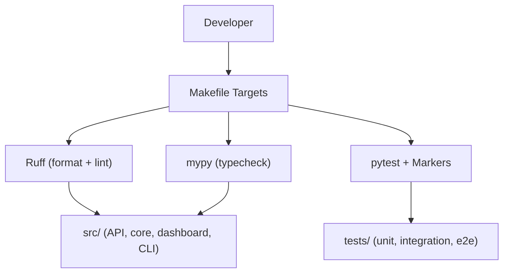
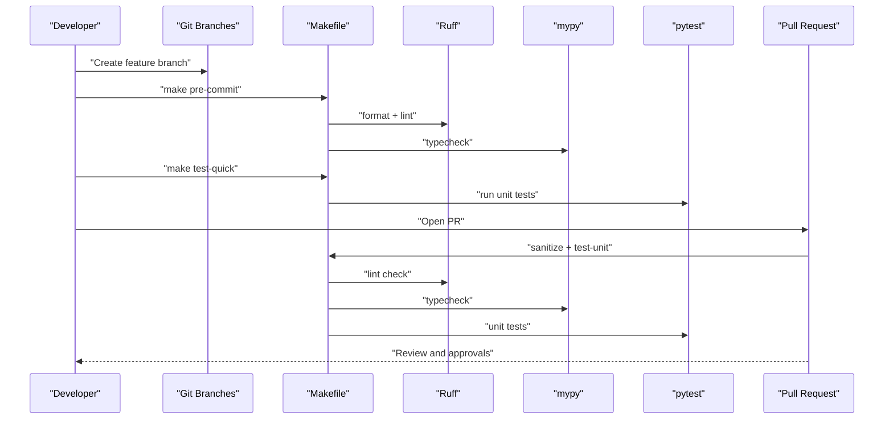
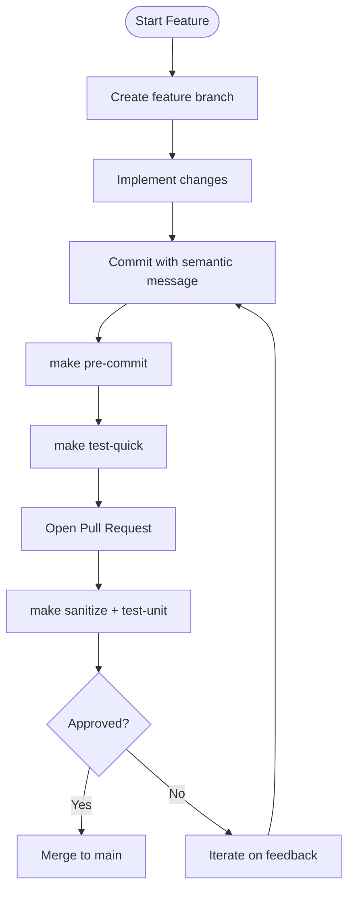
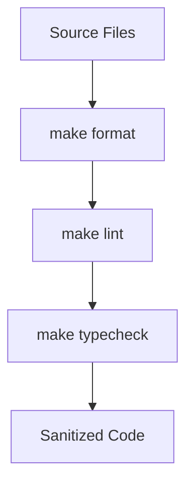
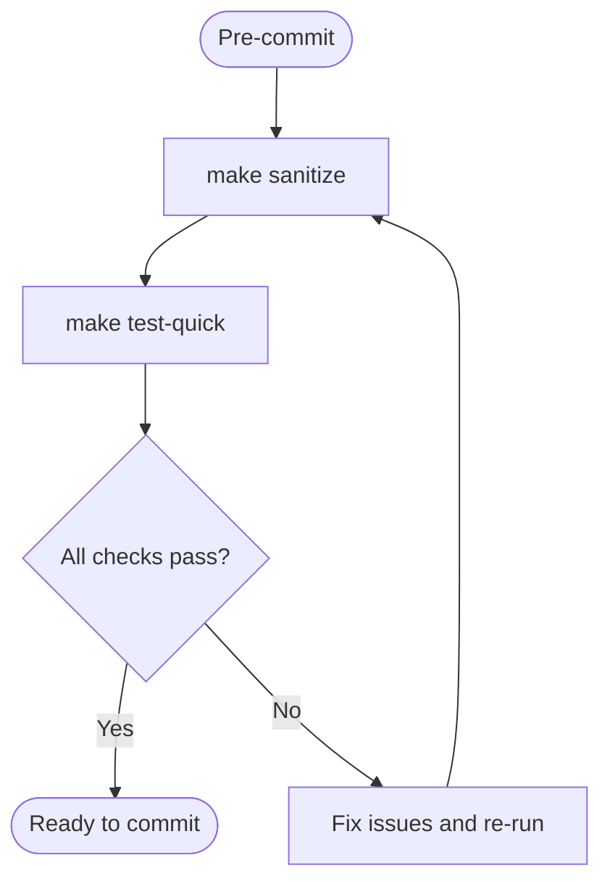
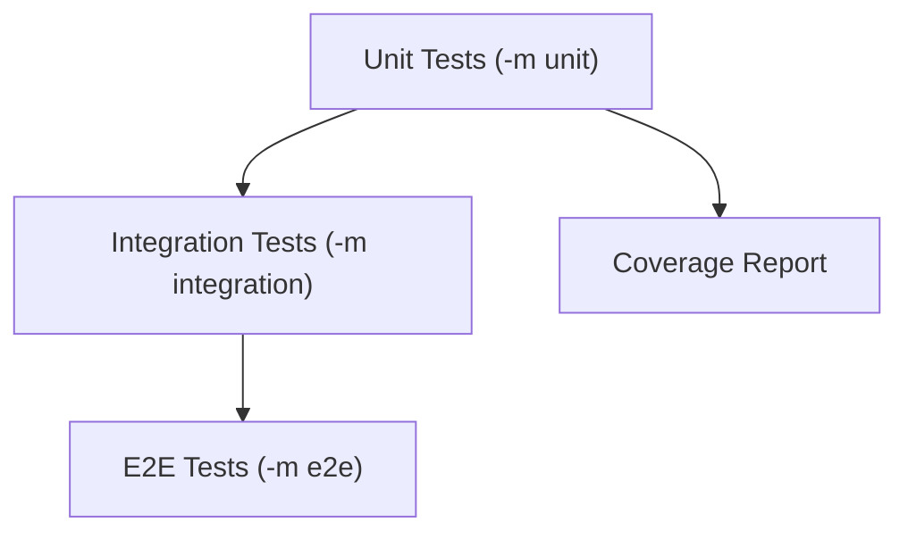
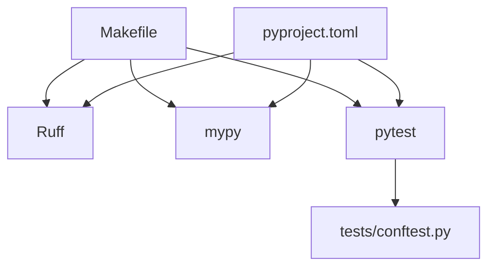

# Contribution Guidelines

<cite>
**Referenced Files in This Document**
- [Makefile](file://Makefile)
- [pyproject.toml](file://pyproject.toml)
- [README.md](file://README.md)
- [docs/makefile-workflows.md](file://docs/makefile-workflows.md)
- [tests/conftest.py](file://tests/conftest.py)
- [planning/major-refactor.md](file://planning/major-refactor.md)
- [planning/prd_cursor_feature_detection_intent_based_model_routing_van_damme.md](file://planning/prd_cursor_feature_detection_intent_based_model_routing_van_damme.md)
- [planning/top-models-implementation.md](file://planning/top-models-implementation.md)
</cite>

## Table of Contents
1. [Introduction](#introduction)
2. [Project Structure](#project-structure)
3. [Core Components](#core-components)
4. [Architecture Overview](#architecture-overview)
5. [Detailed Component Analysis](#detailed-component-analysis)
6. [Dependency Analysis](#dependency-analysis)
7. [Performance Considerations](#performance-considerations)
8. [Troubleshooting Guide](#troubleshooting-guide)
9. [Conclusion](#conclusion)
10. [Appendices](#appendices)

## Introduction
This document provides contribution guidelines for the Vandamme Proxy project. It consolidates the recommended Git workflow, code quality standards, pre-commit and sanitization processes, testing practices, and documentation procedures. It also explains how to engage with the planning documents that capture ongoing and future design work.

## Project Structure
The repository organizes development around a Makefile-driven workflow, pytest-based testing, and a clear separation of concerns across API, core logic, dashboard, and CLI layers. Planning documents in the planning/ directory capture technical proposals and refactors that inform contribution expectations.

**Diagram sources**
- [Makefile](file://Makefile#L202-L256)
- [pyproject.toml](file://pyproject.toml#L130-L144)
- [tests/conftest.py](file://tests/conftest.py#L72-L102)

**Section sources**
- [Makefile](file://Makefile#L1-L110)
- [README.md](file://README.md#L488-L548)

## Core Components
- Git workflow: feature branches, semantic commit messages, and pull request requirements.
- Code quality: ruff for formatting and linting, mypy for type checking.
- Pre-commit and sanitization: make pre-commit and make sanitize.
- Testing: pytest markers (unit, integration, e2e), coverage reporting, and test organization.
- Documentation: update existing docs and reference planning/ for design proposals.

**Section sources**
- [Makefile](file://Makefile#L257-L261)
- [pyproject.toml](file://pyproject.toml#L75-L117)
- [tests/conftest.py](file://tests/conftest.py#L72-L102)
- [docs/makefile-workflows.md](file://docs/makefile-workflows.md#L674-L700)

## Architecture Overview
The contribution workflow integrates development tasks, code quality gates, and testing into a cohesive pipeline. The Makefile centralizes these operations, while pytest and ruff define the quality standards.

**Diagram sources**
- [Makefile](file://Makefile#L257-L261)
- [Makefile](file://Makefile#L237-L247)
- [pyproject.toml](file://pyproject.toml#L130-L144)

## Detailed Component Analysis

### Git Workflow and Semantic Commit Messages
- Use feature branches for changes.
- Follow semantic commit prefixes for clarity and automation:
  - feat:, fix:, docs:, refactor:, test:, chore:
- Pull requests must pass the merge gate (sanitize + test-unit) and include tests for new features.

**Diagram sources**
- [docs/makefile-workflows.md](file://docs/makefile-workflows.md#L674-L700)
- [Makefile](file://Makefile#L237-L247)

**Section sources**
- [docs/makefile-workflows.md](file://docs/makefile-workflows.md#L674-L700)

### Code Quality Standards (Ruff, Linting, Type Checking)
- Formatting and linting are handled by ruff:
  - make format runs ruff format and ruff check --fix.
  - make lint runs ruff format --check and ruff check.
- Type checking is performed by mypy via make typecheck.
- The project enforces strict type checking with disallow_untyped_defs and other mypy settings.

**Diagram sources**
- [Makefile](file://Makefile#L202-L235)
- [pyproject.toml](file://pyproject.toml#L75-L117)
- [pyproject.toml](file://pyproject.toml#L146-L159)

**Section sources**
- [Makefile](file://Makefile#L202-L235)
- [pyproject.toml](file://pyproject.toml#L75-L117)
- [pyproject.toml](file://pyproject.toml#L146-L159)

### Pre-commit and Sanitization
- Pre-commit hook target:
  - make pre-commit runs make sanitize and make test-quick.
- Sanitization:
  - make sanitize runs format, lint, and typecheck without tests.
- Use make sanitize before submitting changes to ensure a clean merge gate.

**Diagram sources**
- [Makefile](file://Makefile#L257-L261)
- [Makefile](file://Makefile#L230-L247)

**Section sources**
- [Makefile](file://Makefile#L257-L261)
- [Makefile](file://Makefile#L230-L247)

### Testing Strategy and Coverage
- Test markers:
  - unit: fast, no external dependencies.
  - integration: requires running services and API keys.
  - e2e: requires valid API keys and makes real API calls.
- Test organization:
  - tests/unit/, tests/integration/, tests/middleware/.
- Coverage:
  - make coverage generates HTML and terminal reports.
- Contribute tests alongside features and maintain coverage on critical paths.

**Diagram sources**
- [tests/conftest.py](file://tests/conftest.py#L72-L102)
- [pyproject.toml](file://pyproject.toml#L130-L144)
- [Makefile](file://Makefile#L331-L344)

**Section sources**
- [tests/conftest.py](file://tests/conftest.py#L72-L102)
- [pyproject.toml](file://pyproject.toml#L130-L144)
- [Makefile](file://Makefile#L267-L344)

### Writing Tests: Unit vs Integration vs E2E
- Unit tests:
  - Fast, isolated, mock external services.
  - Marked with @pytest.mark.unit or inferred from directory placement.
- Integration tests:
  - Require server running and environment configuration.
  - Marked with @pytest.mark.integration.
- E2E tests:
  - Real API calls; use make test-e2e and ensure API keys are configured.
- Coverage:
  - Use make coverage to generate reports and review missing branches.

**Section sources**
- [tests/conftest.py](file://tests/conftest.py#L83-L102)
- [Makefile](file://Makefile#L283-L325)
- [Makefile](file://Makefile#L331-L344)

### Documentation Updates and Planning Documents
- Update existing documentation when adding or changing features.
- Reference planning/ for design documents and technical proposals:
  - major-refactor.md outlines modularization plans and test targets.
  - prd_cursor_feature_detection_intent_based_model_routing_van_damme.md defines intent-based routing policy.
  - top-models-implementation.md describes the top-models feature specification and CLI.
- Engage with existing proposals by reviewing and contributing to planning documents before implementing changes.

**Section sources**
- [planning/major-refactor.md](file://planning/major-refactor.md#L1-L202)
- [planning/prd_cursor_feature_detection_intent_based_model_routing_van_damme.md](file://planning/prd_cursor_feature_detection_intent_based_model_routing_van_damme.md#L1-L407)
- [planning/top-models-implementation.md](file://planning/top-models-implementation.md#L1-L768)

## Dependency Analysis
The contribution workflow depends on Makefile targets, pytest markers, and ruff/mypy configuration. The following diagram shows how these components interact.

**Diagram sources**
- [Makefile](file://Makefile#L202-L256)
- [pyproject.toml](file://pyproject.toml#L75-L117)
- [pyproject.toml](file://pyproject.toml#L130-L144)
- [tests/conftest.py](file://tests/conftest.py#L72-L102)

**Section sources**
- [Makefile](file://Makefile#L202-L256)
- [pyproject.toml](file://pyproject.toml#L75-L117)
- [pyproject.toml](file://pyproject.toml#L130-L144)
- [tests/conftest.py](file://tests/conftest.py#L72-L102)

## Performance Considerations
- Keep commits small and focused to minimize pre-commit and test times.
- Prefer unit tests for rapid feedback; reserve integration and E2E tests for critical paths.
- Use make test-quick for fast iteration; rely on make coverage for periodic coverage reviews.

[No sources needed since this section provides general guidance]

## Troubleshooting Guide
Common issues and resolutions:
- Pre-commit failures:
  - Run make format and make lint to address formatting and linting issues.
  - Review remaining issues and apply manual fixes.
- Test failures:
  - Ensure server is running for integration tests (make dev).
  - Set API keys in .env for integration and E2E tests.
- Sanitization failures:
  - Confirm ruff and mypy pass locally before opening PRs.
- Environment mismatches:
  - Deactivate conflicting virtual environments before using make commands.

**Section sources**
- [docs/makefile-workflows.md](file://docs/makefile-workflows.md#L516-L608)
- [Makefile](file://Makefile#L217-L235)

## Conclusion
Contributions should follow a disciplined Git workflow, maintain high code quality via ruff and mypy, pass pre-commit and sanitization checks, and include appropriate tests. Engage with planning documents to align changes with ongoing design efforts and ensure documentation stays current.

[No sources needed since this section summarizes without analyzing specific files]

## Appendices
- Quick reference:
  - make pre-commit: run sanitization and quick tests.
  - make sanitize: run format, lint, and typecheck.
  - make test-quick: run unit tests quickly.
  - make coverage: generate coverage reports.
  - make format and make lint: fix and check formatting/linting.

**Section sources**
- [Makefile](file://Makefile#L257-L261)
- [Makefile](file://Makefile#L230-L247)
- [Makefile](file://Makefile#L283-L344)
- [Makefile](file://Makefile#L331-L344)