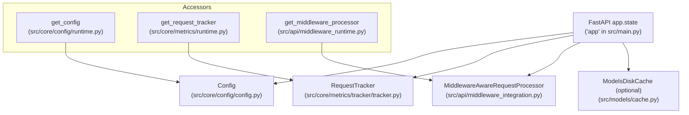
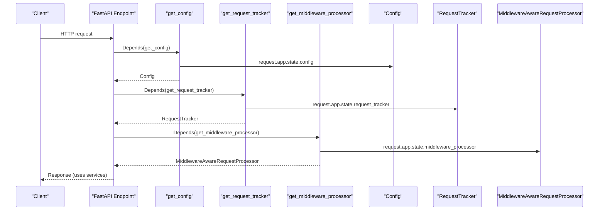
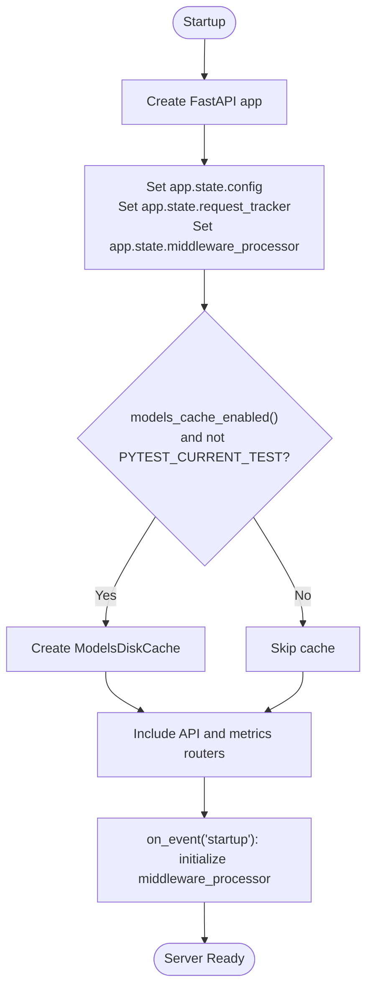
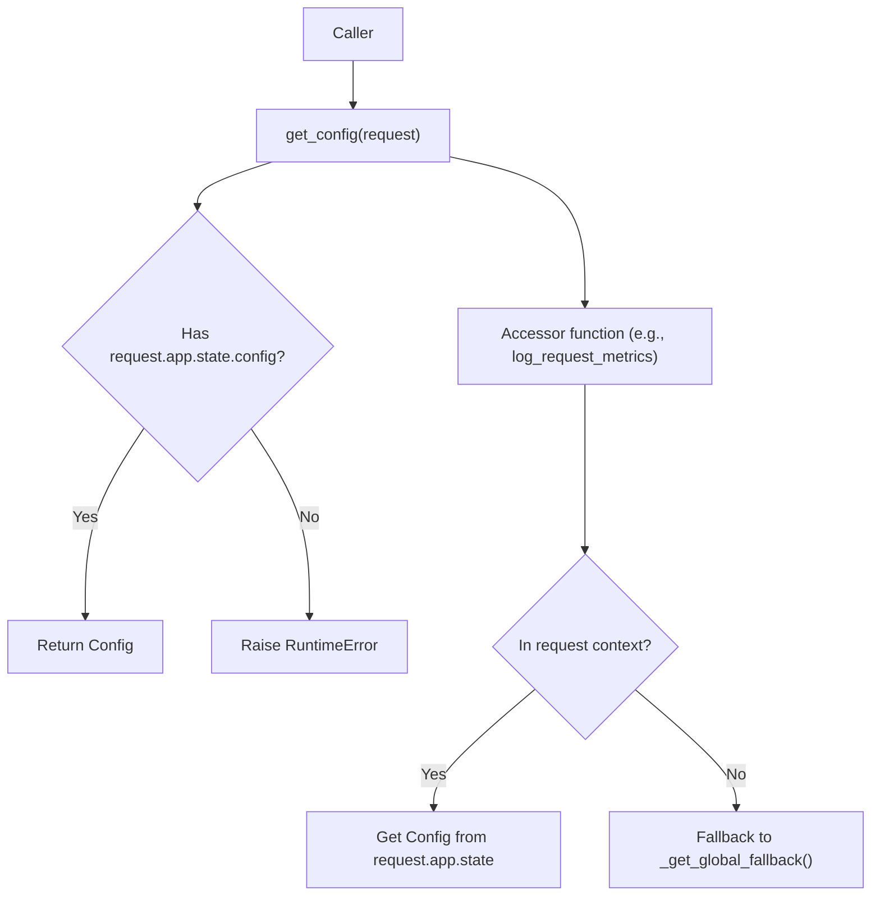
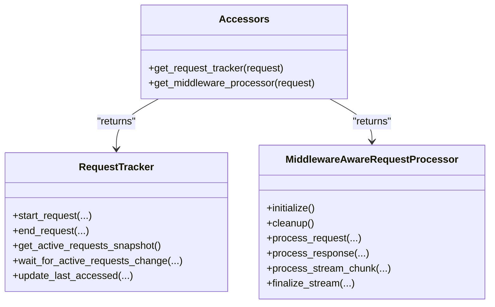
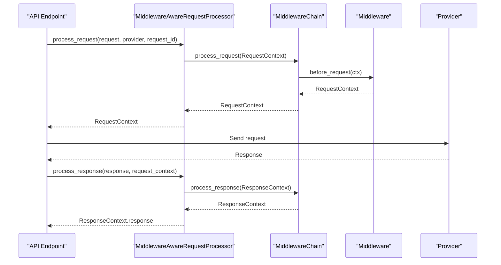
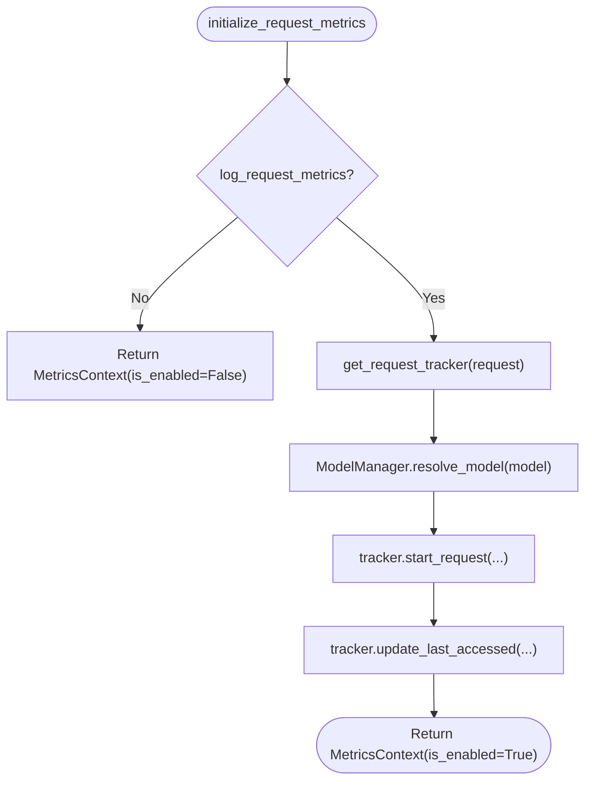
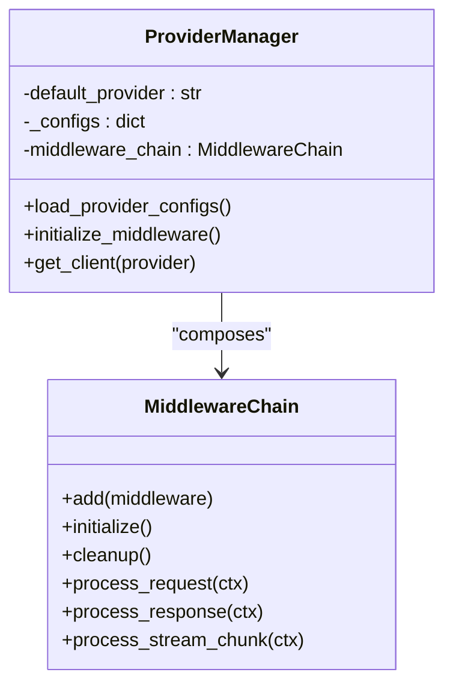
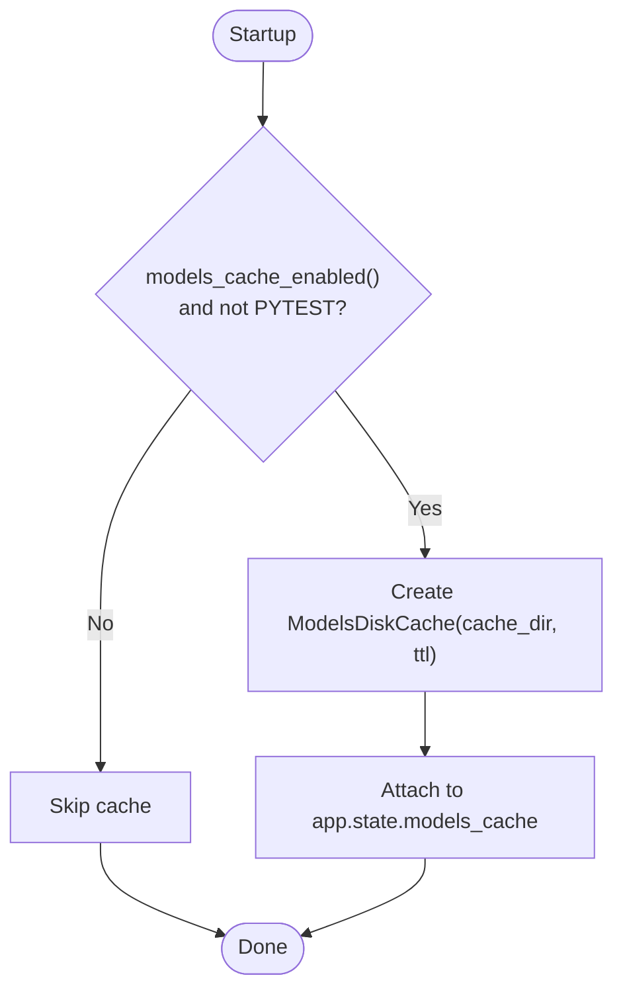
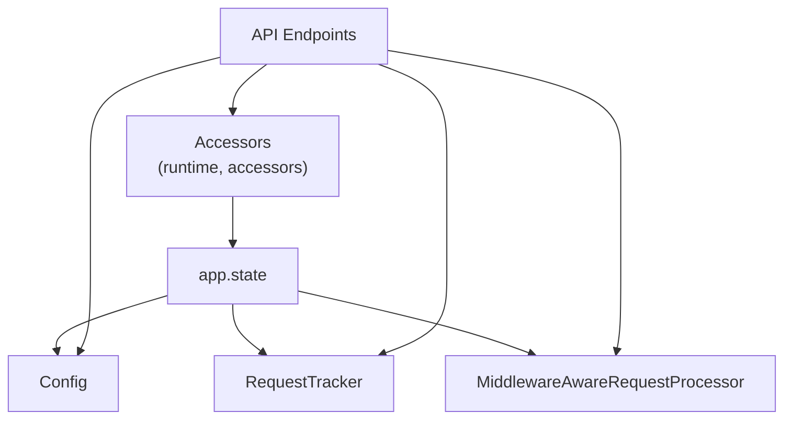

# Dependency Injection System

<cite>
**Referenced Files in This Document**
- [src/main.py](file://src/main.py)
- [src/api/middleware_runtime.py](file://src/api/middleware_runtime.py)
- [src/core/config/runtime.py](file://src/core/config/runtime.py)
- [src/core/config/accessors.py](file://src/core/config/accessors.py)
- [src/core/config/config.py](file://src/core/config/config.py)
- [src/core/metrics/runtime.py](file://src/core/metrics/runtime.py)
- [src/api/middleware_integration.py](file://src/api/middleware_integration.py)
- [src/core/metrics/tracker/tracker.py](file://src/core/metrics/tracker/tracker.py)
- [src/core/provider_manager.py](file://src/core/provider_manager.py)
- [src/middleware/base.py](file://src/middleware/base.py)
- [src/api/services/metrics_orchestrator.py](file://src/api/services/metrics_orchestrator.py)
- [src/models/cache.py](file://src/models/cache.py)
</cite>

## Table of Contents
1. [Introduction](#introduction)
2. [Project Structure](#project-structure)
3. [Core Components](#core-components)
4. [Architecture Overview](#architecture-overview)
5. [Detailed Component Analysis](#detailed-component-analysis)
6. [Dependency Analysis](#dependency-analysis)
7. [Performance Considerations](#performance-considerations)
8. [Troubleshooting Guide](#troubleshooting-guide)
9. [Conclusion](#conclusion)

## Introduction
This document explains the dependency injection system used by the application. The system centers on a process-local FastAPI app.state that holds shared services and managers, and on lightweight wiring helpers that expose them to endpoints and services without relying on global singletons. Configuration values are accessed via runtime accessors that safely resolve from request context or a fallback singleton. Metrics tracking and middleware processing are integrated through these patterns, enabling clean separation of concerns and testability.

## Project Structure
The dependency injection strategy is implemented across a few key areas:
- Application bootstrap initializes app.state with core services and managers.
- Runtime accessors provide controlled access to Config, RequestTracker, and MiddlewareProcessor.
- Services and endpoints depend on these accessors and FastAPI’s dependency injection.

**Diagram sources**
- [src/main.py](file://src/main.py#L22-L40)
- [src/core/config/runtime.py](file://src/core/config/runtime.py#L19-L33)
- [src/core/metrics/runtime.py](file://src/core/metrics/runtime.py#L20-L29)
- [src/api/middleware_runtime.py](file://src/api/middleware_runtime.py#L22-L53)
- [src/core/config/config.py](file://src/core/config/config.py#L38-L68)
- [src/core/metrics/tracker/tracker.py](file://src/core/metrics/tracker/tracker.py#L42-L75)
- [src/api/middleware_integration.py](file://src/api/middleware_integration.py#L26-L52)
- [src/models/cache.py](file://src/models/cache.py#L17-L32)

**Section sources**
- [src/main.py](file://src/main.py#L22-L40)

## Core Components
- Process-local app.state: Holds Config, RequestTracker, MiddlewareAwareRequestProcessor, and optionally ModelsDiskCache.
- Runtime accessors:
  - get_config: Retrieves Config from request.app.state with validation.
  - get_request_tracker: Retrieves RequestTracker from request.app.state with validation.
  - get_middleware_processor: Retrieves MiddlewareAwareRequestProcessor from request.app.state with validation.
- Accessor functions for configuration values: log_request_metrics, max_tokens_limit, models_cache_enabled, cache_dir, etc., which resolve from request context or a fallback singleton.

Key behaviors:
- Startup initializes app.state and registers routers and lifecycle hooks.
- Lifecycle hooks initialize and cleanup middleware processor.
- Accessors raise explicit errors if the expected object is missing or wrong type.

**Section sources**
- [src/main.py](file://src/main.py#L22-L56)
- [src/core/config/runtime.py](file://src/core/config/runtime.py#L19-L33)
- [src/core/metrics/runtime.py](file://src/core/metrics/runtime.py#L20-L29)
- [src/api/middleware_runtime.py](file://src/api/middleware_runtime.py#L22-L53)
- [src/core/config/accessors.py](file://src/core/config/accessors.py#L25-L63)

## Architecture Overview
The system uses FastAPI’s dependency injection and a process-local state container to deliver shared services to endpoints and services. Configuration values are accessed through accessor functions that resolve from request context or a fallback singleton, avoiding import-time coupling.

**Diagram sources**
- [src/api/middleware_runtime.py](file://src/api/middleware_runtime.py#L22-L53)
- [src/core/config/runtime.py](file://src/core/config/runtime.py#L19-L33)
- [src/core/metrics/runtime.py](file://src/core/metrics/runtime.py#L20-L29)
- [src/main.py](file://src/main.py#L22-L30)

## Detailed Component Analysis

### FastAPI app.state Initialization
- Creates FastAPI app and stores:
  - Config: eagerly created at startup.
  - RequestTracker: created via factory.
  - MiddlewareAwareRequestProcessor: created and later initialized on startup.
  - ModelsDiskCache: conditionally created if enabled and not in tests.
- Registers routers and lifecycle hooks for middleware initialization and cleanup.

**Diagram sources**
- [src/main.py](file://src/main.py#L22-L56)
- [src/main.py](file://src/main.py#L31-L40)

**Section sources**
- [src/main.py](file://src/main.py#L22-L56)
- [src/main.py](file://src/main.py#L31-L40)

### Runtime Accessors for Config
- get_config: Returns Config from request.app.state with validation and raises if missing or wrong type.
- Accessor functions (e.g., log_request_metrics, max_tokens_limit, models_cache_enabled) resolve Config from request context or a fallback singleton, enabling reuse in CLI/tests.

**Diagram sources**
- [src/core/config/runtime.py](file://src/core/config/runtime.py#L19-L33)
- [src/core/config/accessors.py](file://src/core/config/accessors.py#L25-L63)

**Section sources**
- [src/core/config/runtime.py](file://src/core/config/runtime.py#L19-L33)
- [src/core/config/accessors.py](file://src/core/config/accessors.py#L69-L163)

### Runtime Accessors for RequestTracker and MiddlewareProcessor
- get_request_tracker: Returns RequestTracker from request.app.state with validation.
- get_middleware_processor: Returns MiddlewareAwareRequestProcessor from request.app.state with validation.

**Diagram sources**
- [src/core/metrics/runtime.py](file://src/core/metrics/runtime.py#L20-L29)
- [src/api/middleware_runtime.py](file://src/api/middleware_runtime.py#L22-L53)
- [src/core/metrics/tracker/tracker.py](file://src/core/metrics/tracker/tracker.py#L42-L75)
- [src/api/middleware_integration.py](file://src/api/middleware_integration.py#L26-L52)

**Section sources**
- [src/core/metrics/runtime.py](file://src/core/metrics/runtime.py#L20-L29)
- [src/api/middleware_runtime.py](file://src/api/middleware_runtime.py#L22-L53)

### Middleware Integration Layer
- MiddlewareAwareRequestProcessor composes a MiddlewareChain and exposes methods to process requests, responses, and streaming chunks.
- Provides a streaming wrapper that parses SSE and feeds chunks to middleware.

**Diagram sources**
- [src/api/middleware_integration.py](file://src/api/middleware_integration.py#L53-L124)
- [src/middleware/base.py](file://src/middleware/base.py#L191-L241)
- [src/middleware/base.py](file://src/middleware/base.py#L254-L341)

**Section sources**
- [src/api/middleware_integration.py](file://src/api/middleware_integration.py#L26-L184)
- [src/middleware/base.py](file://src/middleware/base.py#L191-L398)

### Metrics Orchestration and Dual-Path Pattern
- MetricsOrchestrator encapsulates the dual-path logic (metrics enabled/disabled) and provides:
  - initialize_request_metrics: resolves provider/model, starts tracking, updates last accessed.
  - update_provider_resolution: updates provider/model after resolution.
  - finalize_on_timeout/on_error/success: consistent finalization.
- Uses get_request_tracker to access RequestTracker.

**Diagram sources**
- [src/api/services/metrics_orchestrator.py](file://src/api/services/metrics_orchestrator.py#L117-L189)
- [src/core/metrics/runtime.py](file://src/core/metrics/runtime.py#L20-L29)
- [src/core/model_manager.py](file://src/core/model_manager.py#L17-L90)

**Section sources**
- [src/api/services/metrics_orchestrator.py](file://src/api/services/metrics_orchestrator.py#L90-L259)

### Provider Management and Middleware Wiring
- ProviderManager loads provider configurations and initializes middleware chain with injected middleware settings.
- Uses injected middleware config to avoid circular dependencies with the global Config singleton.

**Diagram sources**
- [src/core/provider_manager.py](file://src/core/provider_manager.py#L30-L61)
- [src/core/provider_manager.py](file://src/core/provider_manager.py#L124-L147)
- [src/middleware/base.py](file://src/middleware/base.py#L191-L241)

**Section sources**
- [src/core/provider_manager.py](file://src/core/provider_manager.py#L30-L61)
- [src/core/provider_manager.py](file://src/core/provider_manager.py#L124-L147)
- [src/middleware/base.py](file://src/middleware/base.py#L191-L241)

### Models Cache
- ModelsDiskCache is conditionally attached to app.state and used to cache provider model lists.
- Provides APIs to read/write raw upstream responses keyed by provider/base_url/headers.

**Diagram sources**
- [src/main.py](file://src/main.py#L31-L40)
- [src/models/cache.py](file://src/models/cache.py#L17-L32)

**Section sources**
- [src/main.py](file://src/main.py#L31-L40)
- [src/models/cache.py](file://src/models/cache.py#L17-L32)

## Dependency Analysis
- Coupling:
  - Endpoints depend on accessors rather than global singletons, reducing import-time coupling.
  - Accessors depend on request.app.state, which is populated at startup.
- Cohesion:
  - Accessor modules isolate wiring logic from business logic.
  - Middleware and metrics orchestration are cohesive units with clear responsibilities.
- External dependencies:
  - FastAPI for dependency injection and app.state.
  - asyncio for concurrency in RequestTracker and middleware chain.

**Diagram sources**
- [src/core/config/runtime.py](file://src/core/config/runtime.py#L19-L33)
- [src/core/metrics/runtime.py](file://src/core/metrics/runtime.py#L20-L29)
- [src/api/middleware_runtime.py](file://src/api/middleware_runtime.py#L22-L53)
- [src/main.py](file://src/main.py#L22-L30)

**Section sources**
- [src/core/config/runtime.py](file://src/core/config/runtime.py#L19-L33)
- [src/core/metrics/runtime.py](file://src/core/metrics/runtime.py#L20-L29)
- [src/api/middleware_runtime.py](file://src/api/middleware_runtime.py#L22-L53)
- [src/main.py](file://src/main.py#L22-L30)

## Performance Considerations
- Accessors are lightweight and avoid heavy imports; they rely on getattr and type checks.
- RequestTracker uses locks and conditions to coordinate SSE updates efficiently.
- Middleware chain initialization happens once and is reused; streaming middleware wraps upstream streams with minimal overhead.
- Conditional cache creation avoids unnecessary disk IO when disabled.

## Troubleshooting Guide
Common issues and remedies:
- Accessor raises RuntimeError: Ensure app.state is populated (startup ran) and the expected object is present.
- Accessor raises TypeError: Ensure the object stored on app.state is of the expected type.
- Middleware processor not initialized: Verify startup lifecycle hook executed; the processor is initialized on app startup and cleaned up on shutdown.
- Metrics not appearing: Confirm log_request_metrics is enabled; otherwise, MetricsOrchestrator returns a disabled context.

**Section sources**
- [src/api/middleware_runtime.py](file://src/api/middleware_runtime.py#L45-L53)
- [src/core/config/runtime.py](file://src/core/config/runtime.py#L27-L33)
- [src/core/metrics/runtime.py](file://src/core/metrics/runtime.py#L23-L29)
- [src/main.py](file://src/main.py#L45-L56)
- [src/api/services/metrics_orchestrator.py](file://src/api/services/metrics_orchestrator.py#L117-L140)

## Conclusion
The dependency injection system relies on FastAPI’s app.state and small, focused wiring helpers to deliver shared services to endpoints and services. This approach eliminates global singletons, reduces import-time coupling, and supports lifecycle-managed components like middleware processors and metrics trackers. The dual-path pattern in metrics orchestration ensures robust behavior whether metrics are enabled or not, and accessor functions enable consistent configuration access across request and non-request contexts.