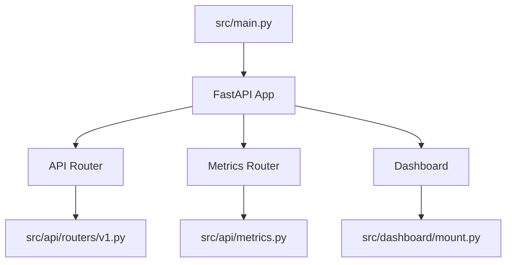
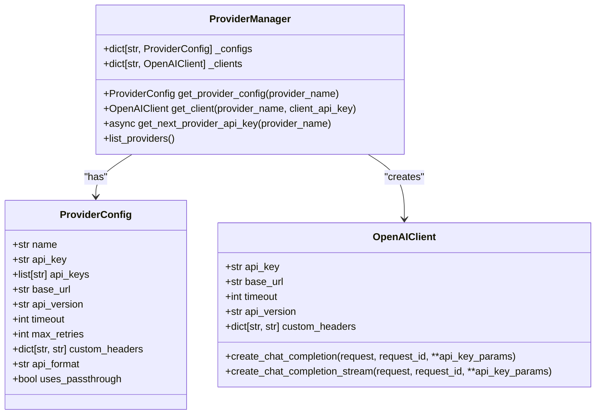
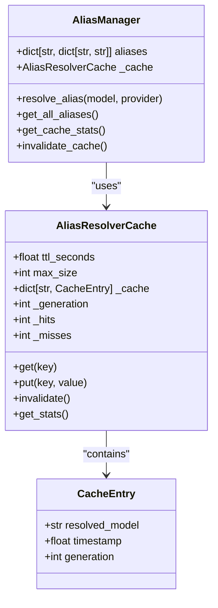
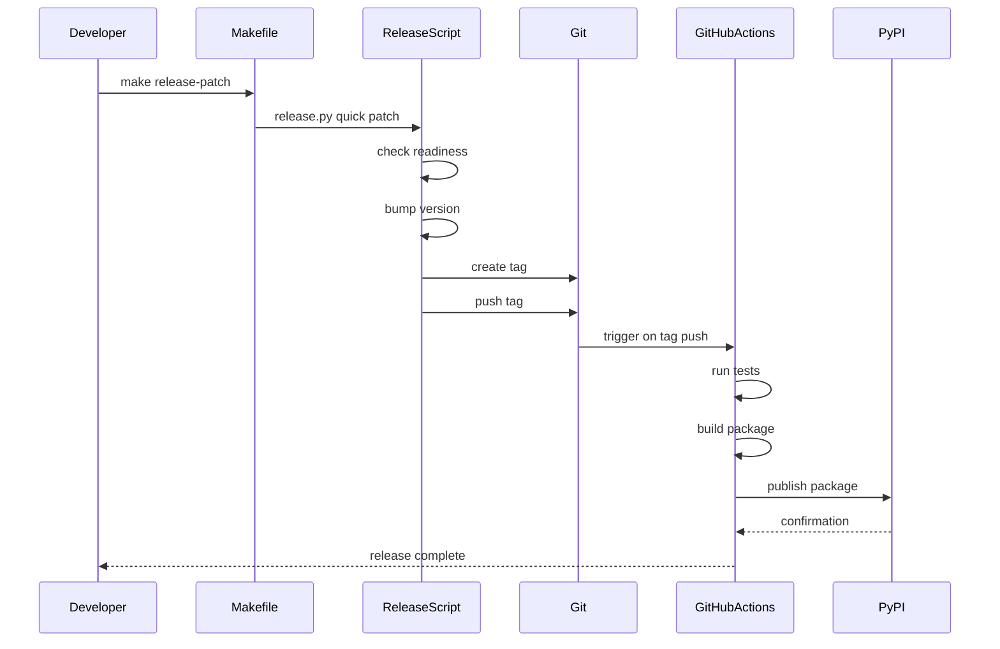

# Development Guide

<cite>
**Referenced Files in This Document**   
- [Makefile](file://Makefile)
- [docs/makefile-workflows.md](file://docs/makefile-workflows.md)
- [scripts/release.py](file://scripts/release.py)
- [scripts/version.py](file://scripts/version.py)
- [src/main.py](file://src/main.py)
- [src/cli/main.py](file://src/cli/main.py)
- [src/api/endpoints.py](file://src/api/endpoints.py)
- [src/core/provider_manager.py](file://src/core/provider_manager.py)
- [src/core/alias_manager.py](file://src/core/alias_manager.py)
- [src/config/defaults.toml](file://src/config/defaults.toml)
- [planning/major-refactor.md](file://planning/major-refactor.md)
- [planning/prd_cursor_feature_detection_intent_based_model_routing_van_damme.md](file://planning/prd_cursor_feature_detection_intent_based_model_routing_van_damme.md)
</cite>

## Table of Contents
1. [Development Setup](#development-setup)
2. [Codebase Structure and Component Relationships](#codebase-structure-and-component-relationships)
3. [Release Process](#release-process)
4. [Contribution Guidelines](#contribution-guidelines)
5. [Debugging and Local Development](#debugging-and-local-development)
6. [Planning Process](#planning-process)
7. [Extending Core Functionality](#extending-core-functionality)

## Development Setup

The development environment for Vandamme Proxy is managed through a comprehensive Makefile that orchestrates all workflows. The setup process is designed to be simple and consistent across different development environments.

To initialize the development environment, run:
```bash
make dev-env-init
```

This command creates a virtual environment and sets up the basic structure. After initialization, synchronize the dependencies and install the CLI:
```bash
make dev-deps-sync
```

The project uses `uv` as the preferred package manager, which provides faster dependency resolution and installation compared to traditional pip. The Makefile contains several targets for different setup scenarios:

- `dev-env-init`: Creates the virtual environment
- `dev-deps-sync`: Installs all dependencies including development tools
- `check-install`: Verifies that the installation was successful by checking the vdm command and Python imports

For daily development, the recommended workflow starts the server with hot reload enabled:
```bash
make dev
```

This command runs the development server using uvicorn with the reload flag, allowing automatic restart when code changes are detected. The server runs on the default host (0.0.0.0) and port (8082), which can be overridden with environment variables.

The Makefile also provides a comprehensive help system that lists all available commands with their descriptions. Running `make help` displays a categorized list of commands including environment setup, code quality checks, testing, Docker operations, and release management.

**Section sources**
- [Makefile](file://Makefile#L1-L570)
- [docs/makefile-workflows.md](file://docs/makefile-workflows.md#L1-L749)

## Codebase Structure and Component Relationships

The Vandamme Proxy codebase follows a modular structure with clear separation of concerns. The main components are organized in the `src/` directory, with each subdirectory serving a specific purpose.

The entry point of the application is `src/main.py`, which initializes the FastAPI application and configures the request tracker for metrics. The main application object is created with the title "Vandamme Proxy" and the version from the package metadata.



**Diagram sources**
- [src/main.py](file://src/main.py#L1-L105)

The API endpoints are defined in `src/api/endpoints.py`, which contains the request handlers for various endpoints including chat completions, messages, and health checks. This file imports several services that handle specific aspects of request processing:

- `provider_context.py`: Resolves the provider context for a request
- `key_rotation.py`: Manages API key rotation for providers with multiple keys
- `metrics_helper.py`: Populates request metrics for monitoring
- `request_builder.py`: Builds requests for passthrough mode
- `streaming.py`: Handles streaming responses

The core functionality is organized in the `src/core/` directory, which contains the essential components of the proxy:

- `provider_manager.py`: Manages multiple provider configurations and clients
- `alias_manager.py`: Handles model alias resolution with caching
- `config.py`: Central configuration management
- `model_manager.py`: Manages model resolution and provider selection

The provider manager is responsible for loading provider configurations from environment variables and creating appropriate clients. It supports both OpenAI-format and Anthropic-format providers, with the ability to handle passthrough authentication where client-provided API keys are used.



**Diagram sources**
- [src/core/provider_manager.py](file://src/core/provider_manager.py#L1-L586)
- [src/api/services/provider_context.py](file://src/api/services/provider_context.py)
- [src/api/services/key_rotation.py](file://src/api/services/key_rotation.py)

The alias manager provides a flexible system for model name resolution with case-insensitive substring matching. It supports provider-specific aliases configured through environment variables (e.g., `POE_ALIAS_FAST=gpt-4o-mini`) and includes a caching layer to improve performance.



**Diagram sources**
- [src/core/alias_manager.py](file://src/core/alias_manager.py#L1-L634)

**Section sources**
- [src/main.py](file://src/main.py#L1-L105)
- [src/api/endpoints.py](file://src/api/endpoints.py#L1-L800)
- [src/core/provider_manager.py](file://src/core/provider_manager.py#L1-L586)
- [src/core/alias_manager.py](file://src/core/alias_manager.py#L1-L634)

## Release Process

The release process for Vandamme Proxy is automated through a combination of Makefile targets and Python scripts. The process follows semantic versioning with three types of releases: patch, minor, and major.

The version management is handled by two scripts: `scripts/release.py` and `scripts/version.py`. These scripts work together to manage the version lifecycle, from checking the current version to creating Git tags and publishing to PyPI.

The release process begins with validation of the release readiness:
```bash
make release-check
```

This command performs several checks:
- Ensures the working directory is clean (no uncommitted changes)
- Runs quick tests to verify functionality
- Checks that the current version is properly formatted

Once the release is validated, the version can be bumped according to the type of changes:
```bash
# Quick patch release
make release-patch

# Quick minor release
make release-minor

# Quick major release
make release-major
```

These commands automate the entire release process:
1. Validate release readiness
2. Bump the version number
3. Create and push a Git tag
4. Trigger the automated publishing workflow

The version bumping is handled by `scripts/version.py`, which parses the current version, increments the appropriate component (patch, minor, or major), and creates a new Git tag. The `scripts/release.py` script orchestrates the overall release process, providing both interactive and non-interactive modes.

For interactive releases, use:
```bash
make release-full
```

This command guides the developer through the release process with prompts for version selection and confirmation. It's particularly useful for major releases that require more careful consideration.

The actual publishing to PyPI is handled by GitHub Actions when a new tag is pushed. The `release` target in the Makefile creates the tag and pushes it to the remote repository, which triggers the CI/CD pipeline to build the package and publish it to PyPI.



**Diagram sources**
- [scripts/release.py](file://scripts/release.py#L1-L202)
- [scripts/version.py](file://scripts/version.py#L1-L99)
- [Makefile](file://Makefile#L1-L570)

**Section sources**
- [scripts/release.py](file://scripts/release.py#L1-L202)
- [scripts/version.py](file://scripts/version.py#L1-L99)

## Contribution Guidelines

Contributions to Vandamme Proxy are welcome and encouraged. The project follows a structured contribution process to ensure code quality and consistency.

### Code Style Standards

The project enforces strict code style standards using Ruff, which combines the functionality of Black, isort, flake8, and other linters into a single tool. The configuration is defined in `pyproject.toml` and includes:

- Line length limit of 100 characters
- Target Python version 3.10
- Automatic fixing of issues
- Type transformation rules (e.g., `List` → `list`, `Dict` → `dict`)

Before committing code, run the pre-commit checks:
```bash
make pre-commit
```

This command runs the `sanitize` target, which performs formatting, linting, and type checking. It's equivalent to running:
```bash
make format
make lint
make typecheck
```

The project uses type hints extensively and enforces their usage through mypy configuration in `pyproject.toml`. The configuration requires all functions to be typed (`disallow_untyped_defs = true`) and warns on returning Any types.

### Pull Request Requirements

Pull requests must meet the following requirements:

1. **Pass all tests**: The PR must pass all unit and integration tests. Run `make test` to verify.
2. **Code quality**: The code must pass all static checks (`make sanitize`).
3. **Documentation**: New features must be documented in the appropriate documentation files.
4. **Changelog entry**: Significant changes should include an entry in the changelog.
5. **Issue reference**: The PR should reference the relevant issue or feature request.

The CI pipeline runs automatically on pull requests and includes:
- Code formatting and linting checks
- Unit tests
- Type checking
- Security vulnerability scanning

### Testing Strategy

The project follows a testing pyramid with three tiers:

1. **Unit tests** (~90%): Fast, mocked tests using RESPX for HTTP-layer mocking
2. **Integration tests** (~10%): Require a running server but no external API calls
3. **E2E tests** (<5%): Real API calls for critical validation (requires API keys, incurs costs)

To run the tests:
```bash
# Run unit tests only (fastest)
make test-unit

# Run integration tests (requires server)
make test-integration

# Run all tests including E2E (requires API keys)
make test-all
```

Unit tests should be fast and independent, focusing on testing business logic in isolation. Integration tests verify the interaction between components, while E2E tests validate critical paths with real API calls.

**Section sources**
- [Makefile](file://Makefile#L1-L570)
- [pyproject.toml](file://pyproject.toml#L1-L159)
- [docs/makefile-workflows.md](file://docs/makefile-workflows.md#L1-L749)

## Debugging and Local Development

Effective debugging and local development are essential for contributing to Vandamme Proxy. The project provides several tools and workflows to support these activities.

### Local Development Workflows

The primary development workflow uses the `make dev` command, which starts the server with hot reload enabled. This allows developers to see changes immediately without restarting the server.

For more granular control, the server can be started directly:
```bash
uvicorn src.main:app --host 0.0.0.0 --port 8082 --reload --log-level debug
```

The log level can be adjusted to control the verbosity of output. Setting it to `debug` provides detailed information about request processing, which is invaluable for debugging.

### Debugging Techniques

The application provides several endpoints for debugging and monitoring:

- `GET /health`: Health check with provider status
- `GET /v1/aliases`: View active model aliases
- `GET /metrics/running-totals`: Usage metrics
- `GET /v1/models`: List available models

These endpoints can be accessed directly or through the CLI:
```bash
# Check server health
vdm health server

# Test upstream provider connectivity
vdm health upstream

# Show current configuration
vdm config show

# List available models
vdm test models
```

For debugging specific issues, the application logs detailed information about request processing. The logs include:
- Request start and completion
- Provider selection and model resolution
- Token usage and request size
- Error information when applicable

The dashboard provides a visual interface for monitoring the proxy's activity. It can be accessed at `http://localhost:8082/dashboard/` and shows real-time metrics, active requests, and system status.

### Watch Mode

For continuous testing during development, use the watch mode:
```bash
make watch
```

This command uses `watchexec` to monitor for file changes and automatically run tests. It requires `watchexec` to be installed (`cargo install watchexec-cli`).

Alternatively, run tests manually in watch mode:
```bash
watchexec -e py -w src -w tests -- make test-quick
```

This setup provides immediate feedback on code changes, helping to catch issues early in the development process.

**Section sources**
- [Makefile](file://Makefile#L1-L570)
- [src/main.py](file://src/main.py#L1-L105)
- [src/api/endpoints.py](file://src/api/endpoints.py#L1-L800)

## Planning Process

The planning process for Vandamme Proxy is documented in the `planning/` directory, which contains design documents and product requirements that guide the project's evolution.

### Design Documents

The `planning/` directory contains several key documents that outline major features and architectural changes:

- `major-refactor.md`: Details a comprehensive refactor plan for the API endpoints, dashboard, and AG Grid components
- `prd_cursor_feature_detection_intent_based_model_routing_van_damme.md`: Describes a product requirement for Cursor IDE feature detection and intent-based model routing
- `handler-extraction-investigation.md`: Documents the investigation into extracting request handlers from the monolithic endpoints file
- `top-models-implementation.md`: Outlines the implementation plan for the top models feature

These documents follow a structured format that includes background, goals, architecture, and implementation plans. They serve as a reference for understanding the rationale behind major changes and the intended direction of the project.

### Interpreting Planning Documents

When working on features mentioned in planning documents, follow these guidelines:

1. **Understand the goals**: Read the background and motivation sections to understand why the feature is needed.
2. **Review the architecture**: Examine the proposed architecture to understand how the feature fits into the existing system.
3. **Follow the implementation plan**: Use the execution steps as a guide for implementing the feature incrementally.
4. **Consider the safety checklist**: Pay attention to the safety and validation requirements to ensure the implementation is robust.

For example, the `major-refactor.md` document proposes a significant restructuring of the codebase to improve modularity and testability. It outlines a step-by-step plan for extracting services, handlers, and components from the monolithic files.

The `prd_cursor_feature_detection_intent_based_model_routing_van_damme.md` document describes a sophisticated feature for detecting Cursor IDE features and routing requests based on intent. It defines execution intents like `FAST_CONTINUATION`, `INTERACTIVE_CHAT`, and `STRUCTURED_EDIT`, and provides a classification algorithm based on token volume, streaming flag, and tool presence.

These planning documents are living documents that may evolve as the project progresses. When implementing features based on these documents, it's important to check for updates and discuss any changes with the team.

**Section sources**
- [planning/major-refactor.md](file://planning/major-refactor.md#L1-L202)
- [planning/prd_cursor_feature_detection_intent_based_model_routing_van_damme.md](file://planning/prd_cursor_feature_detection_intent_based_model_routing_van_damme.md#L1-L407)

## Extending Core Functionality

Extending the core functionality of Vandamme Proxy involves adding new providers or middleware to enhance its capabilities. The architecture is designed to be extensible, allowing developers to add new features without modifying core components.

### Adding New Providers

To add a new provider, follow these steps:

1. **Environment variables**: Define the required environment variables for the provider (e.g., `NEWPROVIDER_API_KEY`, `NEWPROVIDER_BASE_URL`).
2. **Configuration defaults**: Add default configuration values to `src/config/defaults.toml` if appropriate.
3. **Provider configuration**: The provider manager automatically detects providers from environment variables that follow the pattern `{PROVIDER}_API_KEY`.
4. **Client implementation**: If the provider uses a non-standard API format, create a custom client class that implements the same interface as `OpenAIClient`.

The provider manager handles most of the complexity of managing multiple providers. It automatically:
- Loads configuration from environment variables
- Creates appropriate clients based on the API format
- Manages API key rotation for providers with multiple keys
- Handles passthrough authentication when configured

For example, to add a new provider called "example", set the environment variable `EXAMPLE_API_KEY=your-key` and optionally `EXAMPLE_BASE_URL=https://api.example.com/v1`. The provider manager will automatically detect and configure this provider.

### Adding Middleware

The middleware system in Vandamme Proxy follows the chain-of-responsibility pattern, allowing multiple middleware components to process requests and responses. To add new middleware:

1. **Create a middleware class**: Implement a class that inherits from the middleware base class and implements the `process_request` and `process_response` methods.
2. **Register the middleware**: Add the middleware to the middleware chain in the provider manager.

The `ThoughtSignatureMiddleware` is an example of existing middleware that processes requests to extract thought signatures from Google Gemini responses. It uses a `ThoughtSignatureStore` to cache signatures and reduce API calls.

When creating new middleware, consider the following best practices:
- Keep middleware stateless when possible
- Handle errors gracefully and log appropriately
- Use configuration options to make middleware behavior customizable
- Consider performance implications, especially for operations that make external API calls

The middleware chain is initialized in the provider manager and can be extended to support new use cases such as:
- Request/response transformation
- Authentication and authorization
- Rate limiting and quota management
- Logging and monitoring
- Caching

By following these patterns, developers can extend the functionality of Vandamme Proxy while maintaining the integrity and performance of the core system.

**Section sources**
- [src/core/provider_manager.py](file://src/core/provider_manager.py#L1-L586)
- [src/middleware/](file://src/middleware/)
- [src/config/defaults.toml](file://src/config/defaults.toml#L1-L89)