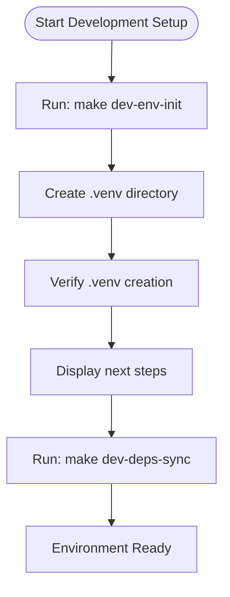
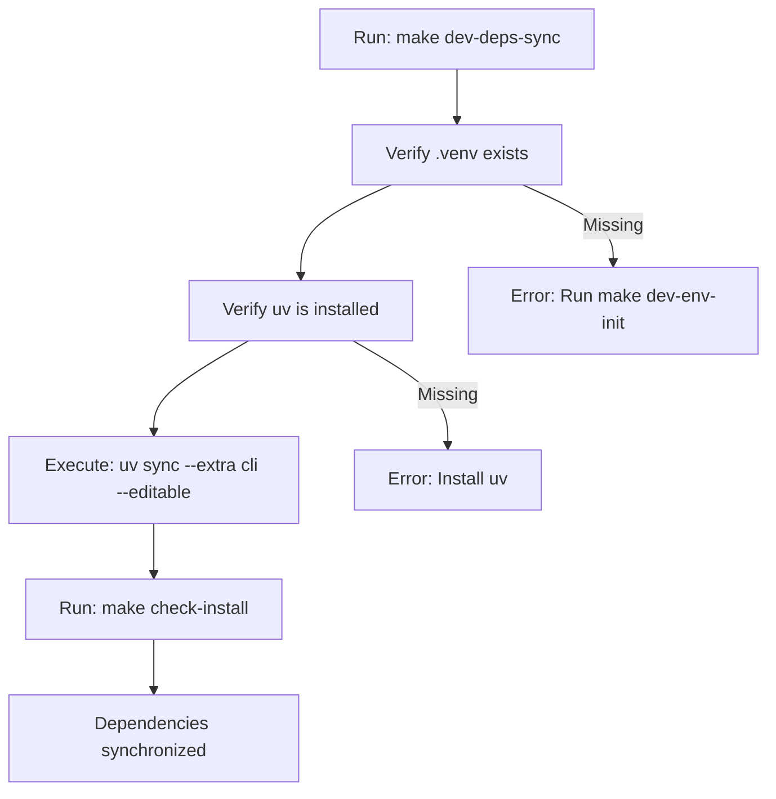
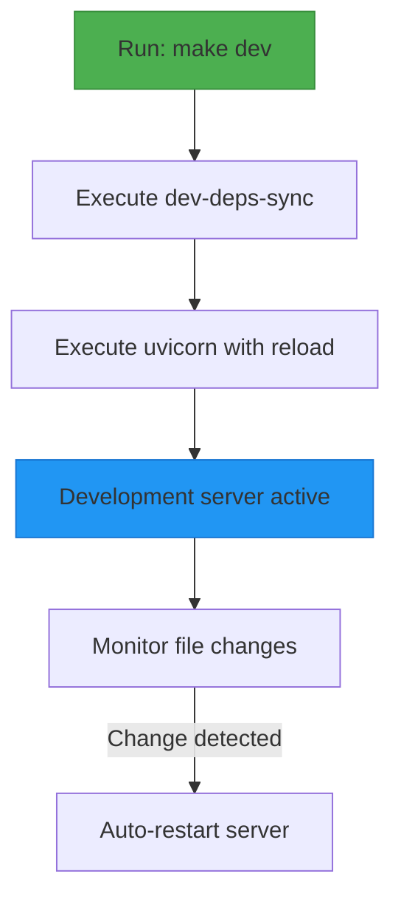
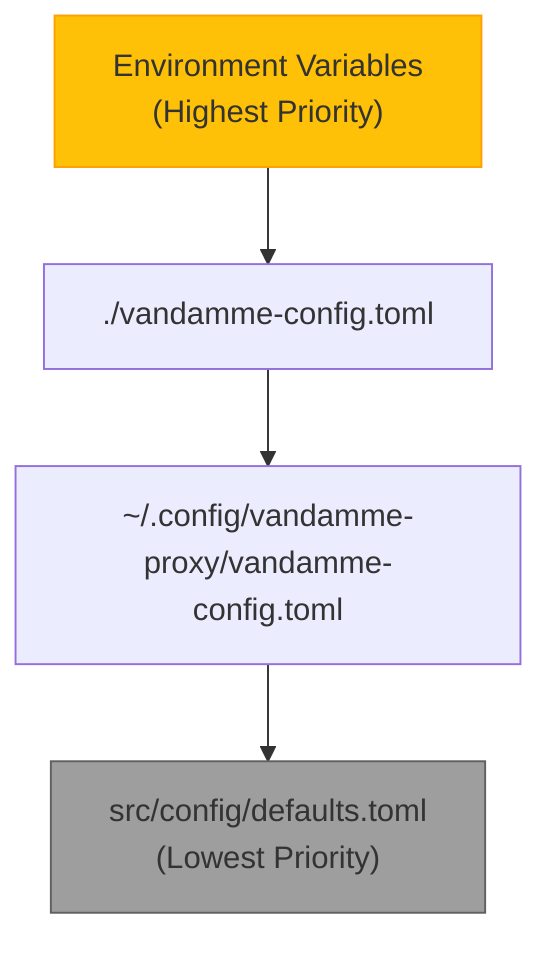
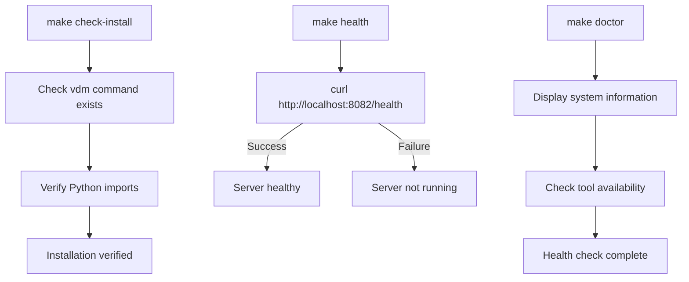
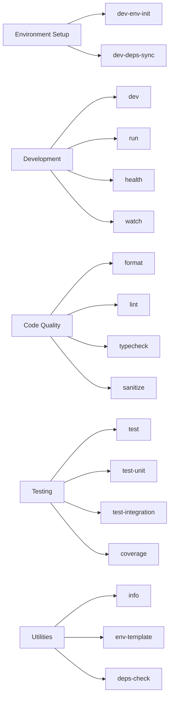
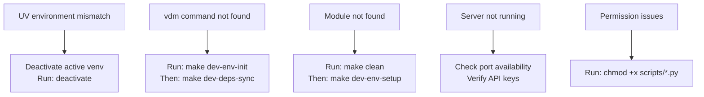

# Development Setup

<cite>
**Referenced Files in This Document**   
- [Makefile](file://Makefile)
- [docs/makefile-workflows.md](file://docs/makefile-workflows.md)
- [README.md](file://README.md)
- [.env.example](file://.env.example)
- [src/config/defaults.toml](file://src/config/defaults.toml)
- [pyproject.toml](file://pyproject.toml)
</cite>

## Table of Contents
1. [Introduction](#introduction)
2. [Development Environment Initialization](#development-environment-initialization)
3. [Dependency Management with UV](#dependency-management-with-uv)
4. [Running the Development Server](#running-the-development-server)
5. [Configuration and Environment Variables](#configuration-and-environment-variables)
6. [Health Checks and Verification](#health-checks-and-verification)
7. [Daily Development Commands](#daily-development-commands)
8. [Troubleshooting Common Issues](#troubleshooting-common-issues)

## Introduction

This document provides comprehensive guidance for setting up the development environment for the vandamme-proxy project. The setup process leverages Makefile workflows to streamline development tasks, including environment initialization, dependency management, server execution, and health verification. The project uses uv as the preferred package manager for Python dependencies, providing efficient virtual environment management and dependency resolution.

The development workflow is designed to be consistent and reproducible, with clear separation between development, testing, and production environments. Key components include the Makefile for task automation, environment variables for configuration, and a structured approach to dependency management.

**Section sources**
- [Makefile](file://Makefile#L1-L570)
- [docs/makefile-workflows.md](file://docs/makefile-workflows.md#L1-L749)

## Development Environment Initialization

The development environment initialization process begins with the `dev-env-init` target in the Makefile, which creates a virtual environment using uv. This target is the recommended starting point for new developers setting up the project.



The initialization process follows these steps:
1. Execute `make dev-env-init` to create the virtual environment
2. The Makefile creates a `.venv` directory using uv
3. After successful creation, the system prompts to run `make dev-deps-sync`
4. This two-step process ensures proper separation between environment creation and dependency installation

The `dev-env-init` target is designed to be idempotent, meaning it can be safely run multiple times without adverse effects. If the `.venv` directory already exists, the command will skip the creation step and proceed with the next steps.

**Diagram sources**
- [Makefile](file://Makefile#L115-L123)

**Section sources**
- [Makefile](file://Makefile#L115-L123)
- [README.md](file://README.md#L497-L503)

## Dependency Management with UV

Dependency management in the vandamme-proxy project is handled through uv, a modern Python package installer and resolver. The primary target for dependency synchronization is `dev-deps-sync`, which reconciles all project dependencies including development tools.



The dependency synchronization process includes:
- Verification that the `.venv` directory exists
- Validation that uv is installed on the system
- Execution of `uv sync` with the `--extra cli` and `--editable` flags
- Post-installation verification through the `check-install` target

The project's dependencies are defined in `pyproject.toml`, which specifies both core dependencies and optional dependency groups. The `cli` extra dependencies include typer, rich, and pyyaml, enabling the command-line interface functionality.

**Diagram sources**
- [Makefile](file://Makefile#L124-L133)
- [pyproject.toml](file://pyproject.toml#L35-L45)

**Section sources**
- [Makefile](file://Makefile#L124-L133)
- [pyproject.toml](file://pyproject.toml#L1-L159)

## Running the Development Server

The development server can be started with hot reload functionality using the `make dev` command. This target combines dependency synchronization with server execution, ensuring that all dependencies are up-to-date before starting the server.



The `make dev` command executes the following workflow:
1. Automatically runs `dev-deps-sync` to ensure dependencies are current
2. Launches uvicorn with the `--reload` flag for hot reload functionality
3. Binds to the host and port specified by environment variables (default: 0.0.0.0:8082)
4. Sets the log level based on the LOG_LEVEL environment variable

Custom host and port settings can be specified by setting environment variables:
```bash
HOST=127.0.0.1 PORT=3000 make dev
```

The server will automatically reload when changes are detected in the source files, providing a seamless development experience.

**Diagram sources**
- [Makefile](file://Makefile#L143-L145)

**Section sources**
- [Makefile](file://Makefile#L143-L145)
- [src/main.py](file://src/main.py#L1-L105)

## Configuration and Environment Variables

The vandamme-proxy project uses a hierarchical configuration system with environment variables taking precedence over configuration files. The primary configuration file is `.env.example`, which serves as a template for the actual `.env` file.



Key environment variables include:
- **OPENAI_API_KEY**: Required for OpenAI provider access
- **VDM_DEFAULT_PROVIDER**: Overrides the default provider from defaults.toml
- **HOST** and **PORT**: Server binding configuration
- **LOG_LEVEL**: Controls the verbosity of logging output

The default provider is determined by the following priority order:
1. VDM_DEFAULT_PROVIDER environment variable
2. default-provider from local vandamme-config.toml
3. default-provider from user config file
4. default-provider from src/config/defaults.toml (defaults to "poe")

Configuration files in TOML format can also define provider-specific settings and model aliases, providing a structured way to manage complex configurations.

**Diagram sources**
- [.env.example](file://.env.example#L37-L44)
- [src/config/defaults.toml](file://src/config/defaults.toml#L1-L89)

**Section sources**
- [.env.example](file://.env.example#L1-L152)
- [src/config/defaults.toml](file://src/config/defaults.toml#L1-L89)
- [README.md](file://README.md#L221-L226)

## Health Checks and Verification

The development environment includes several targets for health checks and installation verification. These commands ensure that the setup process completed successfully and that all components are functioning correctly.



The primary verification targets are:
- **check-install**: Verifies that the vdm command is available and that Python imports work correctly
- **health**: Checks the server's health endpoint to confirm it's running
- **doctor**: Runs a comprehensive environment health check, reporting system information and tool availability

The `check-install` target performs the following validations:
1. Checks for the existence of the `.venv/bin/vdm` executable
2. Verifies that the CLI module can be imported successfully
3. Reports success or failure with appropriate messaging

The `doctor` target provides system-level information including OS, architecture, and the availability of essential tools like uv, Python, Docker, and git.

**Diagram sources**
- [Makefile](file://Makefile#L151-L183)

**Section sources**
- [Makefile](file://Makefile#L147-L183)
- [README.md](file://README.md#L198-L211)

## Daily Development Commands

The Makefile provides a comprehensive set of commands for daily development tasks. These commands are organized into logical groups to support different aspects of the development workflow.



Essential daily commands include:
- **make dev**: Start the development server with hot reload
- **make format**: Auto-format code using ruff
- **make lint**: Run code linting checks
- **make test-unit**: Run unit tests only
- **make watch**: Watch for file changes and auto-run tests
- **make info**: Show project information
- **make env-template**: Generate a .env template file

The `make help` command displays all available targets with descriptions, serving as a quick reference for developers. The output is color-coded and organized by category for easy navigation.

**Diagram sources**
- [Makefile](file://Makefile#L69-L108)

**Section sources**
- [Makefile](file://Makefile#L69-L108)
- [docs/makefile-workflows.md](file://docs/makefile-workflows.md#L34-L41)

## Troubleshooting Common Issues

Several common issues may arise during the development setup process. This section provides solutions for the most frequent problems encountered by developers.



Common issues and their solutions:

**UV Environment Mismatches**
When encountering warnings about VIRTUAL_ENV not matching the project environment path:
```bash
deactivate
make dev-env-init
make dev-deps-sync
```

**Missing vdm Command**
If the vdm command is not found after installation:
1. Verify that `dev-env-init` completed successfully
2. Ensure `dev-deps-sync` was executed
3. Check that the `.venv/bin` directory is in the PATH

**Dependency Conflicts**
For module import errors or dependency conflicts:
```bash
make clean
make dev-env-init
make dev-deps-sync
```

**Server Health Check Failures**
When the health check fails:
1. Verify the server is running with `make dev`
2. Check that the port (default 8082) is not in use
3. Ensure required API keys are properly configured in the environment

**Outdated Dependencies**
To check for outdated dependencies:
```bash
make deps-check
```

This command lists all outdated packages, allowing developers to update them as needed.

**Section sources**
- [docs/makefile-workflows.md](file://docs/makefile-workflows.md#L518-L582)
- [Makefile](file://Makefile#L126-L128)