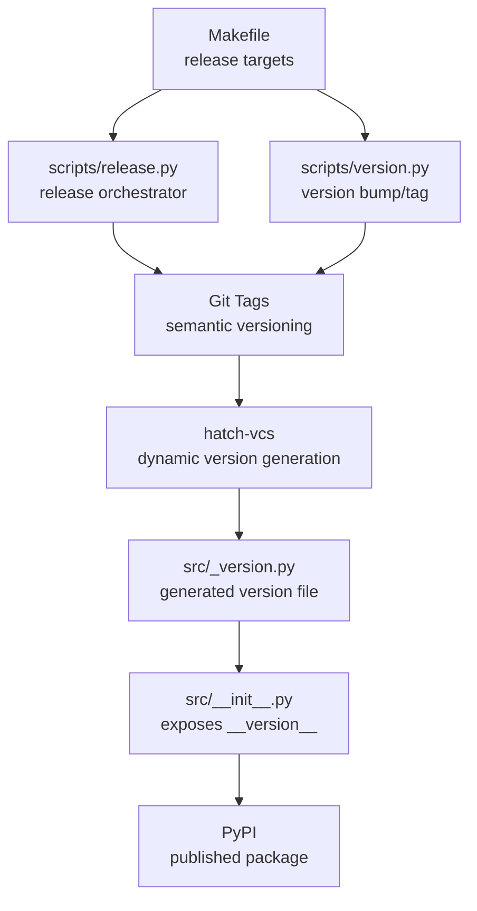
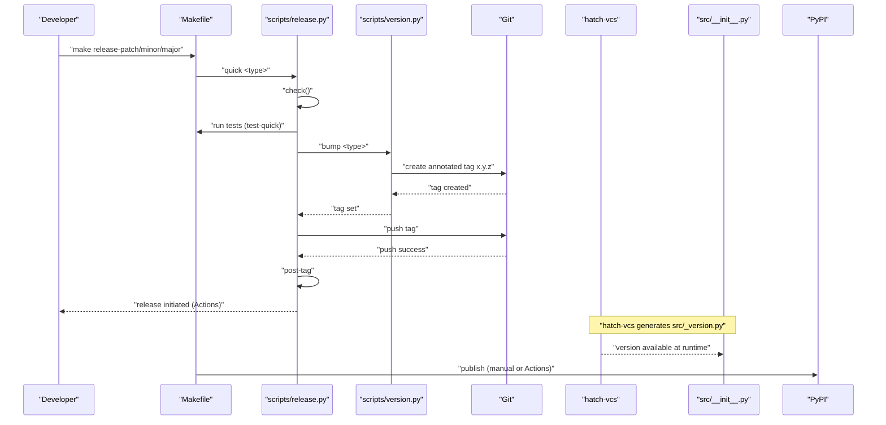
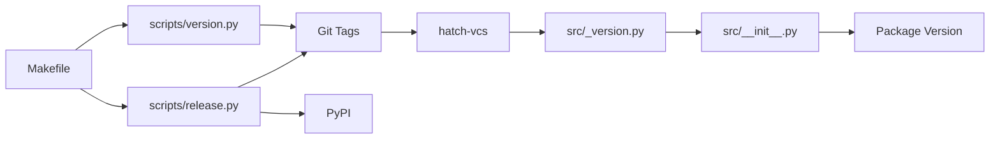

# Release Process

<cite>
**Referenced Files in This Document**
- [Makefile](file://Makefile)
- [scripts/release.py](file://scripts/release.py)
- [scripts/version.py](file://scripts/version.py)
- [pyproject.toml](file://pyproject.toml)
- [src/__init__.py](file://src/__init__.py)
- [src/_version.py](file://src/_version.py)
- [docs/makefile-workflows.md](file://docs/makefile-workflows.md)
- [README.md](file://README.md)
</cite>

## Table of Contents
1. [Introduction](#introduction)
2. [Project Structure](#project-structure)
3. [Core Components](#core-components)
4. [Architecture Overview](#architecture-overview)
5. [Detailed Component Analysis](#detailed-component-analysis)
6. [Dependency Analysis](#dependency-analysis)
7. [Performance Considerations](#performance-considerations)
8. [Troubleshooting Guide](#troubleshooting-guide)
9. [Conclusion](#conclusion)

## Introduction
This document explains the release process for vandamme-proxy, focusing on semantic versioning and the automated release workflow. It covers how Makefile targets orchestrate release tasks, how scripts manage version bumps and tags, how dynamic versioning integrates with Git tags and hatch-vcs, and how GitHub Actions (conceptual) would publish to PyPI upon tag creation. It also provides manual release procedures, verification steps, and troubleshooting guidance.

## Project Structure
The release system centers around:
- Makefile targets that coordinate validation, testing, version bumping, tagging, and publishing
- Python scripts that encapsulate version logic and Git operations
- pyproject.toml configuration enabling dynamic versioning via hatch-vcs
- Runtime version discovery in the package’s public API

**Diagram sources**
- [Makefile](file://Makefile#L458-L510)
- [scripts/release.py](file://scripts/release.py#L1-L202)
- [scripts/version.py](file://scripts/version.py#L1-L99)
- [pyproject.toml](file://pyproject.toml#L118-L123)
- [src/_version.py](file://src/_version.py#L31-L34)
- [src/__init__.py](file://src/__init__.py#L15-L26)

**Section sources**
- [Makefile](file://Makefile#L458-L510)
- [pyproject.toml](file://pyproject.toml#L118-L123)
- [src/__init__.py](file://src/__init__.py#L15-L26)
- [src/_version.py](file://src/_version.py#L31-L34)

## Core Components
- Semantic versioning scheme: patch, minor, major
- Makefile release targets: quick release commands and full workflows
- Scripts:
  - release.py: validation, tagging, publishing, and post-tag notifications
  - version.py: version parsing, bumping, and tag creation
- Dynamic versioning:
  - pyproject.toml configures hatch-vcs to derive version from Git tags
  - src/_version.py is the generated version file consumed by src/__init__.py

**Section sources**
- [docs/makefile-workflows.md](file://docs/makefile-workflows.md#L294-L306)
- [Makefile](file://Makefile#L458-L510)
- [scripts/release.py](file://scripts/release.py#L95-L198)
- [scripts/version.py](file://scripts/version.py#L66-L96)
- [pyproject.toml](file://pyproject.toml#L118-L123)
- [src/__init__.py](file://src/__init__.py#L15-L26)
- [src/_version.py](file://src/_version.py#L31-L34)

## Architecture Overview
The release architecture ties together Makefile orchestration, Python scripts, Git tags, and dynamic versioning:

**Diagram sources**
- [Makefile](file://Makefile#L458-L510)
- [scripts/release.py](file://scripts/release.py#L141-L198)
- [scripts/version.py](file://scripts/version.py#L85-L96)
- [pyproject.toml](file://pyproject.toml#L118-L123)
- [src/__init__.py](file://src/__init__.py#L15-L26)

## Detailed Component Analysis

### Semantic Versioning Scheme
- Patch release: backward-compatible bug fixes (e.g., 1.0.0 → 1.0.1)
- Minor release: new features/backward compatible changes (e.g., 1.0.0 → 1.1.0)
- Major release: breaking changes (e.g., 1.0.0 → 2.0.0)
- Version format: x.y.z without leading “v” prefix
- Version source: Git tags; fallback to package metadata if no tags

**Section sources**
- [docs/makefile-workflows.md](file://docs/makefile-workflows.md#L301-L306)
- [scripts/version.py](file://scripts/version.py#L26-L51)
- [scripts/release.py](file://scripts/release.py#L33-L54)

### Makefile Release Targets
- Quick release commands:
  - make release-patch
  - make release-minor
  - make release-major
- Full workflows:
  - make release-full (interactive)
  - make release (tag + post-tag)
- Supporting targets:
  - make version, make version-set, make version-bump
  - make tag-release
  - make release-check, make release-build, make release-publish

Behavior highlights:
- release-check validates working directory cleanliness and runs tests
- release-build cleans and builds distributions
- release-publish builds and publishes to PyPI (manual)
- release triggers post-tag messaging

**Section sources**
- [Makefile](file://Makefile#L458-L510)
- [docs/makefile-workflows.md](file://docs/makefile-workflows.md#L307-L384)

### scripts/release.py
Responsibilities:
- Version discovery from Git tags or package fallback
- Working directory cleanliness check
- Test execution via make test-quick
- Version bump delegation to scripts/version.py
- Tag creation and push
- Publishing to PyPI (manual)
- Post-tag notification

Key flows:
- quick <type>: runs check, bumps version, pushes tag, prints post-tag notice
- full: interactive selection, bumps version, pushes tag, prints instructions

**Section sources**
- [scripts/release.py](file://scripts/release.py#L95-L198)

### scripts/version.py
Responsibilities:
- Parse current version from Git tags
- Bump version according to patch/minor/major
- Create annotated Git tag for new version

Algorithm:
- Extract highest semver tag from Git
- Parse x.y.z format
- Increment appropriate component(s)
- Create tag with message “Release x.y.z”

**Section sources**
- [scripts/version.py](file://scripts/version.py#L66-L96)

### Dynamic Versioning with hatch-vcs and Git Tags
- pyproject.toml configures hatch-vcs to derive version from Git tags
- Version file generation:
  - pyproject.toml sets dynamic version and hatch-vcs hook
  - hatch-vcs writes src/_version.py with version attributes
- Runtime consumption:
  - src/__init__.py imports version from src._version
  - Falls back to importlib.metadata if the generated file is missing

**Section sources**
- [pyproject.toml](file://pyproject.toml#L118-L123)
- [src/_version.py](file://src/_version.py#L31-L34)
- [src/__init__.py](file://src/__init__.py#L15-L26)

### GitHub Actions Pipeline (Conceptual)
While the repository does not include a GitHub Actions workflow file, the release process is designed to trigger Actions on tag creation:
- On tag push, Actions would run tests, build distributions, and publish to PyPI
- The release.py post-tag message directs users to monitor Actions

**Section sources**
- [scripts/release.py](file://scripts/release.py#L158-L164)
- [docs/makefile-workflows.md](file://docs/makefile-workflows.md#L372-L384)

## Dependency Analysis
The release pipeline depends on:
- Makefile orchestration
- scripts/release.py for validation and tagging
- scripts/version.py for version bumping and tag creation
- Git tags as the authoritative version source
- hatch-vcs to generate src/_version.py consumed by src/__init__.py
- PyPI for package publication

**Diagram sources**
- [Makefile](file://Makefile#L458-L510)
- [scripts/release.py](file://scripts/release.py#L141-L198)
- [scripts/version.py](file://scripts/version.py#L85-L96)
- [pyproject.toml](file://pyproject.toml#L118-L123)
- [src/_version.py](file://src/_version.py#L31-L34)
- [src/__init__.py](file://src/__init__.py#L15-L26)

**Section sources**
- [Makefile](file://Makefile#L458-L510)
- [scripts/release.py](file://scripts/release.py#L141-L198)
- [scripts/version.py](file://scripts/version.py#L85-L96)
- [pyproject.toml](file://pyproject.toml#L118-L123)
- [src/_version.py](file://src/_version.py#L31-L34)
- [src/__init__.py](file://src/__init__.py#L15-L26)

## Performance Considerations
- Release validation uses make test-quick to minimize time-to-release
- Version bumping and tagging are lightweight Git operations
- Dynamic version generation occurs during build; runtime cost is negligible
- Publishing to PyPI is network-bound; consider batching releases to reduce CI load

[No sources needed since this section provides general guidance]

## Troubleshooting Guide
Common issues and resolutions:
- Working directory not clean:
  - Commit or stash pending changes; ensure git status is clean before release
- Version already published:
  - Check current version and bump to a new version before tagging
- Module not found or import errors:
  - Reinstall dependencies and rebuild; ensure hatch-vcs generated src/_version.py
- Lint/format/typecheck failures:
  - Run make sanitize and fix reported issues
- Permission issues with scripts:
  - Ensure scripts are executable

Verification steps:
- Confirm version: make version
- Validate build: make release-build
- Test installation: pip install dist/*.whl --force-reinstall; vdm version

**Section sources**
- [docs/makefile-workflows.md](file://docs/makefile-workflows.md#L516-L601)
- [Makefile](file://Makefile#L483-L489)

## Conclusion
vandamme-proxy’s release process combines Makefile orchestration, Python scripts, and Git-based dynamic versioning to deliver reliable, repeatable releases. The Makefile targets streamline quick and interactive workflows, while scripts enforce validation and tagging discipline. Dynamic versioning via hatch-vcs ensures the package version reflects Git tags, and the design supports both manual publishing and automated Actions-triggered publishing.