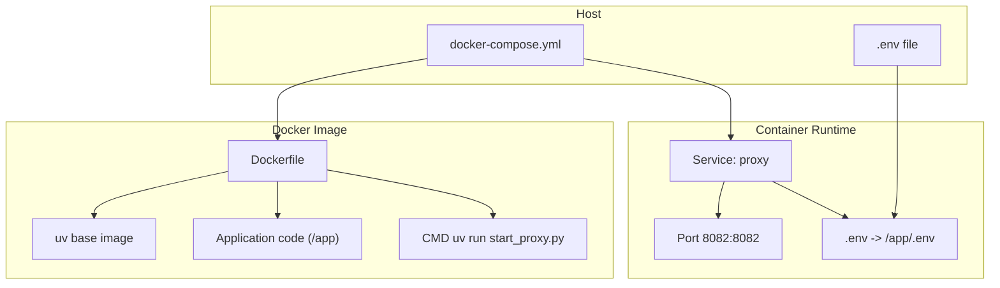
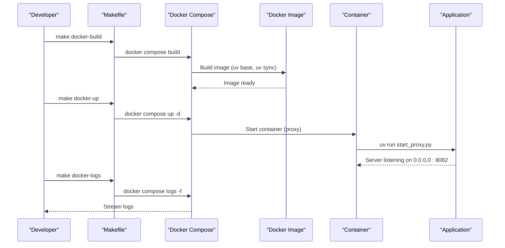
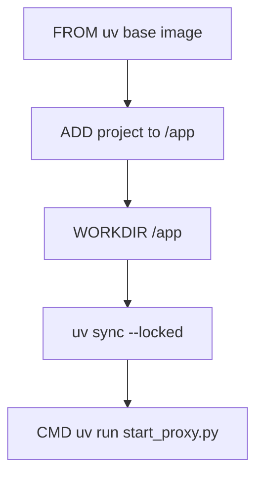
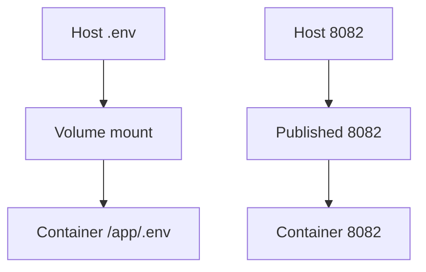
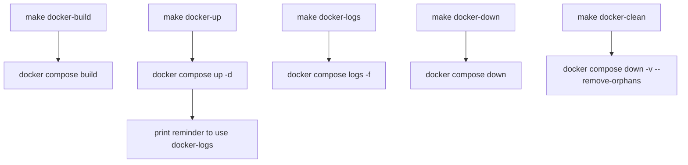
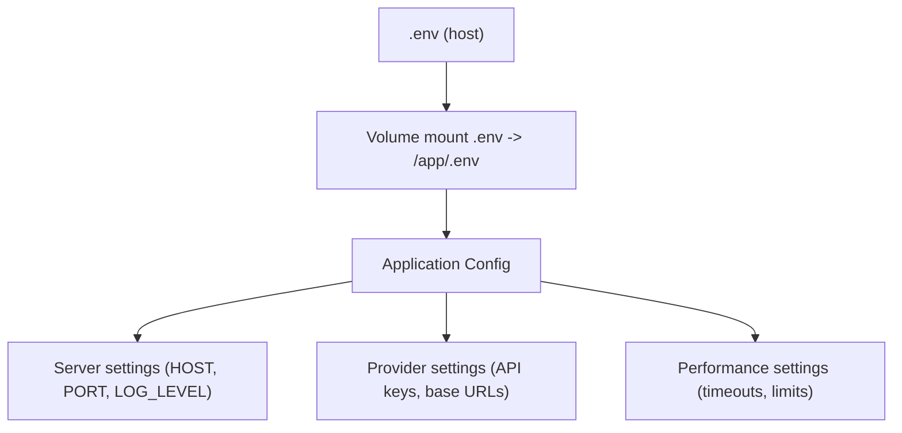
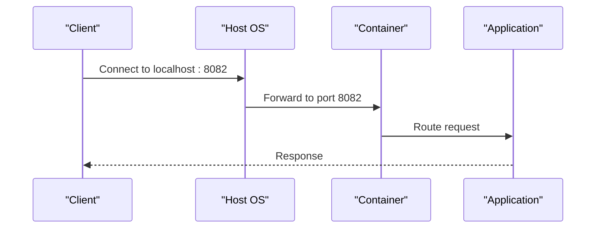
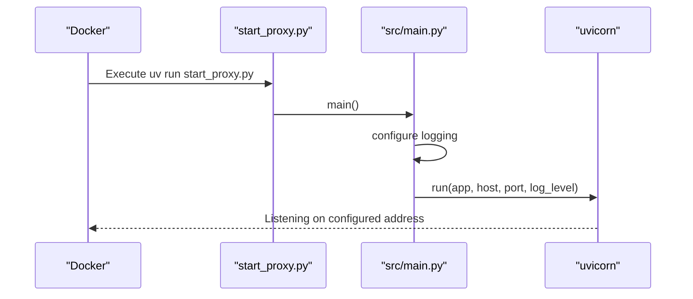
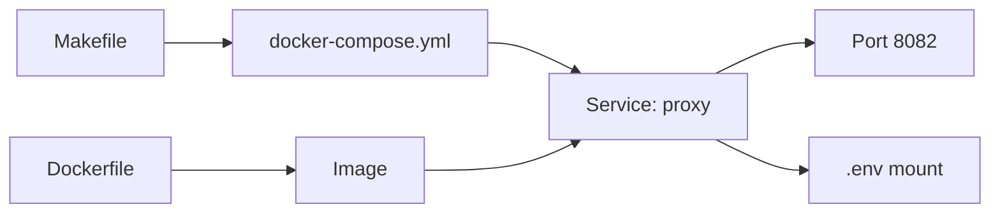

# Docker Deployment

<cite>
**Referenced Files in This Document**
- [Dockerfile](file://Dockerfile)
- [docker-compose.yml](file://docker-compose.yml)
- [Makefile](file://Makefile)
- [.env.example](file://.env.example)
- [start_proxy.py](file://start_proxy.py)
- [src/main.py](file://src/main.py)
- [src/core/config.py](file://src/core/config.py)
- [pyproject.toml](file://pyproject.toml)
- [requirements.txt](file://requirements.txt)
- [README.md](file://README.md)
</cite>

## Table of Contents
1. [Introduction](#introduction)
2. [Project Structure](#project-structure)
3. [Core Components](#core-components)
4. [Architecture Overview](#architecture-overview)
5. [Detailed Component Analysis](#detailed-component-analysis)
6. [Dependency Analysis](#dependency-analysis)
7. [Performance Considerations](#performance-considerations)
8. [Troubleshooting Guide](#troubleshooting-guide)
9. [Conclusion](#conclusion)
10. [Appendices](#appendices)

## Introduction
This document explains how to deploy the Vandamme Proxy using Docker and Docker Compose. It focuses on the multi-stage Dockerfile leveraging uv for dependency resolution and a minimal runtime image, the docker-compose.yml service definition, and the Makefile targets that streamline building, starting, and observing the service. It also covers environment variable injection via a mounted .env file, port mapping, and production considerations such as restart policies, logging integration, and health checks.

## Project Structure
The Docker deployment relies on:
- A Dockerfile that uses a uv base image to resolve dependencies and run the application
- A docker-compose.yml that defines the service, port mapping, and volume mounts
- A Makefile with docker-* targets to automate common operations
- An .env.example file that documents environment variables consumed by the application

**Diagram sources**
- [Dockerfile](file://Dockerfile#L1-L11)
- [docker-compose.yml](file://docker-compose.yml#L1-L10)
- [Makefile](file://Makefile#L398-L433)

**Section sources**
- [Dockerfile](file://Dockerfile#L1-L11)
- [docker-compose.yml](file://docker-compose.yml#L1-L10)
- [Makefile](file://Makefile#L398-L433)

## Core Components
- Dockerfile: Defines a multi-stage-like build using a uv base image, copies the project, resolves dependencies with uv sync, and sets the container command to run the application via uv.
- docker-compose.yml: Declares a service named proxy, builds from the Dockerfile, exposes port 8082, and mounts a local .env file into the container at /app/.env.
- Makefile: Provides docker-build, docker-up, docker-down, docker-logs, docker-restart, and docker-clean targets that wrap docker compose commands and validate Docker availability.
- .env.example: Documents environment variables used by the application, including provider keys, default provider, base URLs, server settings, and performance tuning options.

**Section sources**
- [Dockerfile](file://Dockerfile#L1-L11)
- [docker-compose.yml](file://docker-compose.yml#L1-L10)
- [Makefile](file://Makefile#L398-L433)
- [.env.example](file://.env.example#L1-L152)

## Architecture Overview
The Docker deployment architecture centers on a single service that:
- Runs the application using uv inside a slim base image
- Exposes port 8082 for client access
- Loads configuration from a mounted .env file at /app/.env
- Integrates with Docker Compose for lifecycle management

**Diagram sources**
- [Makefile](file://Makefile#L398-L433)
- [docker-compose.yml](file://docker-compose.yml#L1-L10)
- [Dockerfile](file://Dockerfile#L1-L11)
- [start_proxy.py](file://start_proxy.py#L1-L14)
- [src/main.py](file://src/main.py#L93-L100)

## Detailed Component Analysis

### Dockerfile: Multi-stage with uv for minimal footprint
- Base image: Uses a uv-provided slim image to reduce base layer size and leverage uv’s efficient dependency resolution.
- Project copy: Adds the entire project into /app inside the image.
- Dependency resolution: Runs uv sync with a locked configuration to ensure deterministic installs.
- Command: Starts the application via uv run, invoking the script that launches the FastAPI app.

**Diagram sources**
- [Dockerfile](file://Dockerfile#L1-L11)

**Section sources**
- [Dockerfile](file://Dockerfile#L1-L11)

### docker-compose.yml: Service definition, port mapping, and volume mounting
- Service: proxy
- Build: context is the repository root, Dockerfile is the project Dockerfile
- Ports: maps host port 8082 to container port 8082
- Volumes: mounts the local .env file to /app/.env inside the container

**Diagram sources**
- [docker-compose.yml](file://docker-compose.yml#L1-L10)

**Section sources**
- [docker-compose.yml](file://docker-compose.yml#L1-L10)

### Makefile: Streamlined Docker operations
- docker-build: Validates Docker availability and runs docker compose build.
- docker-up: Validates Docker availability and starts services in detached mode; prints a reminder to use docker-logs.
- docker-down: Stops services gracefully.
- docker-logs: Streams container logs.
- docker-restart: Chains docker-down and docker-up.
- docker-clean: Stops and removes containers and volumes, cleaning up orphaned resources.

**Diagram sources**
- [Makefile](file://Makefile#L398-L433)

**Section sources**
- [Makefile](file://Makefile#L398-L433)

### Environment variable injection via mounted .env
- The container reads configuration from /app/.env, which is mounted from the host’s .env file.
- The application loads environment variables in the configuration layer and applies them to server settings, provider routing, and performance parameters.

**Diagram sources**
- [docker-compose.yml](file://docker-compose.yml#L8-L9)
- [src/core/config.py](file://src/core/config.py#L79-L81)
- [src/core/config.py](file://src/core/config.py#L49-L78)
- [src/core/config.py](file://src/core/config.py#L83-L97)

**Section sources**
- [docker-compose.yml](file://docker-compose.yml#L8-L9)
- [src/core/config.py](file://src/core/config.py#L79-L81)
- [src/core/config.py](file://src/core/config.py#L49-L78)
- [src/core/config.py](file://src/core/config.py#L83-L97)

### Network configuration and port mapping
- The service publishes port 8082 from the container to the host, enabling clients to reach the proxy at http://localhost:8082.
- The application binds to 0.0.0.0:8082 by default, aligning with the published port.

**Diagram sources**
- [docker-compose.yml](file://docker-compose.yml#L6-L7)
- [src/main.py](file://src/main.py#L95-L96)

**Section sources**
- [docker-compose.yml](file://docker-compose.yml#L6-L7)
- [src/main.py](file://src/main.py#L95-L96)

### Application startup and configuration loading
- The container command invokes uv run start_proxy.py, which adds src to the Python path and calls the main entry point.
- The main entry point initializes logging, prints a configuration summary, and starts uvicorn bound to the configured host and port.

**Diagram sources**
- [Dockerfile](file://Dockerfile#L10-L11)
- [start_proxy.py](file://start_proxy.py#L1-L14)
- [src/main.py](file://src/main.py#L64-L100)

**Section sources**
- [Dockerfile](file://Dockerfile#L10-L11)
- [start_proxy.py](file://start_proxy.py#L1-L14)
- [src/main.py](file://src/main.py#L64-L100)

## Dependency Analysis
- Dockerfile depends on:
  - A uv base image for a lean foundation
  - uv sync to resolve dependencies deterministically
  - The application entry point via uv run
- docker-compose.yml depends on:
  - The Dockerfile for image build
  - Volume and port mappings for runtime configuration
- Makefile depends on:
  - Docker availability and docker compose commands
  - docker-compose.yml for service orchestration

**Diagram sources**
- [Dockerfile](file://Dockerfile#L1-L11)
- [docker-compose.yml](file://docker-compose.yml#L1-L10)
- [Makefile](file://Makefile#L398-L433)

**Section sources**
- [Dockerfile](file://Dockerfile#L1-L11)
- [docker-compose.yml](file://docker-compose.yml#L1-L10)
- [Makefile](file://Makefile#L398-L433)

## Performance Considerations
- Minimal base image: Using a uv base image reduces the attack surface and initial download size.
- Deterministic dependency resolution: uv sync ensures reproducible installs, reducing cold start variability.
- Port exposure: Publishing only the required port minimizes resource usage and attack surface.
- Logging level: The application respects LOG_LEVEL and can disable access logs at non-debug levels to reduce I/O overhead.

[No sources needed since this section provides general guidance]

## Troubleshooting Guide
Common deployment issues and resolutions:
- Docker daemon not running
  - Symptom: make docker-* targets fail with an error indicating Docker is not installed or not running.
  - Resolution: Start the Docker daemon or install Docker Desktop as appropriate for your platform.
  - Evidence: The Makefile checks for Docker presence and aborts with a clear message if not available.
- Port conflicts
  - Symptom: Port 8082 already in use on the host.
  - Resolution: Change the host port in docker-compose.yml or stop the conflicting process.
  - Evidence: docker-compose.yml publishes port 8082; adjust the left-hand side of the port mapping to a free host port.
- Permission denied errors accessing the .env file
  - Symptom: The container cannot read /app/.env.
  - Resolution: Ensure the host .env file is readable by the user running Docker and that the path is correct.
  - Evidence: docker-compose.yml mounts ./.env; verify file permissions and path correctness.

**Section sources**
- [Makefile](file://Makefile#L400-L401)
- [docker-compose.yml](file://docker-compose.yml#L6-L9)

## Conclusion
The Docker deployment for Vandamme Proxy uses a uv-powered, minimal image, a straightforward docker-compose service definition, and Makefile targets to simplify building, starting, and observing the service. Environment variables are injected via a mounted .env file, and the service exposes port 8082 for client access. Following the operational guidance and troubleshooting tips will help ensure a smooth deployment.

[No sources needed since this section summarizes without analyzing specific files]

## Appendices

### Environment variables commonly used in Docker deployments
- OPENAI_API_KEY: Provider API key for OpenAI
- PROXY_API_KEY: Optional client-side API key validation
- VDM_DEFAULT_PROVIDER: Default provider when no prefix is used
- OPENAI_BASE_URL: Base URL for OpenAI-compatible endpoints
- HOST: Server host binding (default 0.0.0.0)
- PORT: Server port (default 8082)
- LOG_LEVEL: Logging verbosity (DEBUG, INFO, WARNING, ERROR, CRITICAL)
- REQUEST_TIMEOUT: Request timeout in seconds
- MAX_RETRIES: Number of retry attempts

These variables are documented in .env.example and consumed by the application configuration layer.

**Section sources**
- [.env.example](file://.env.example#L1-L152)
- [src/core/config.py](file://src/core/config.py#L79-L81)
- [src/core/config.py](file://src/core/config.py#L83-L97)

### Production considerations
- Restart policies: Configure restart policies in your orchestrator or compose file to ensure automatic recovery after failures.
- Logging integration: Use Docker logging drivers or integrate with centralized logging systems as needed.
- Health checks: Implement a health endpoint and configure health checks in your orchestrator to monitor service readiness.
- Resource limits: Consider adding memory and CPU limits to prevent resource exhaustion.

[No sources needed since this section provides general guidance]