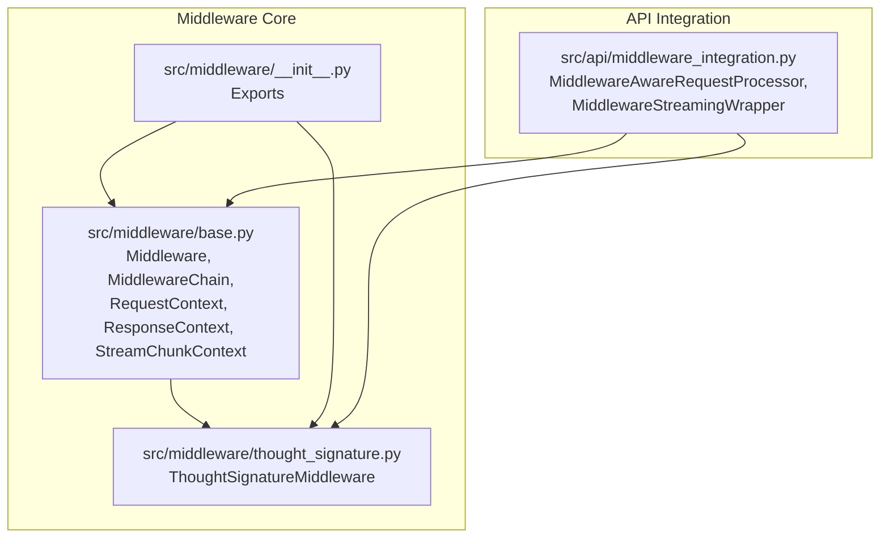
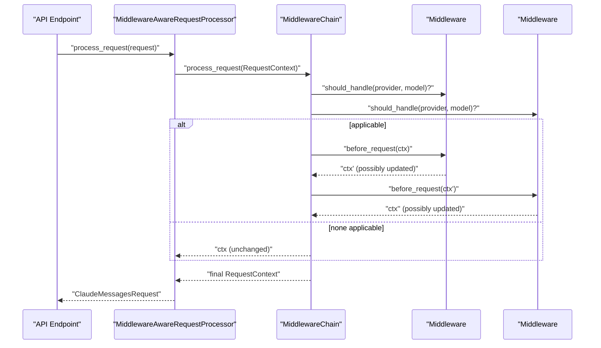
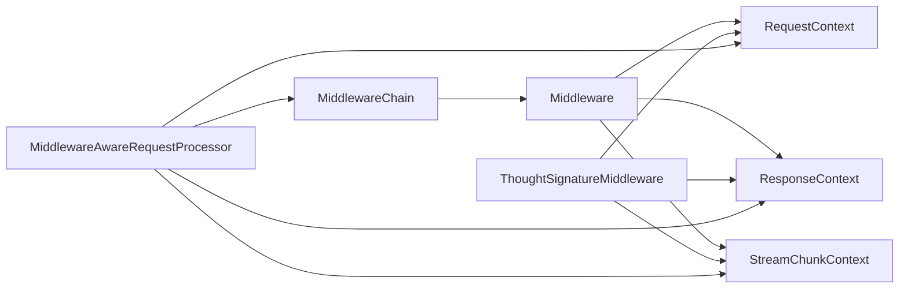

# Middleware Architecture

<cite>
**Referenced Files in This Document**
- [src/middleware/base.py](file://src/middleware/base.py)
- [src/middleware/__init__.py](file://src/middleware/__init__.py)
- [src/middleware/thought_signature.py](file://src/middleware/thought_signature.py)
- [src/api/middleware_integration.py](file://src/api/middleware_integration.py)
- [tests/middleware/test_base.py](file://tests/middleware/test_base.py)
- [tests/middleware/test_thought_signature.py](file://tests/middleware/test_thought_signature.py)
</cite>

## Table of Contents
1. [Introduction](#introduction)
2. [Project Structure](#project-structure)
3. [Core Components](#core-components)
4. [Architecture Overview](#architecture-overview)
5. [Detailed Component Analysis](#detailed-component-analysis)
6. [Dependency Analysis](#dependency-analysis)
7. [Performance Considerations](#performance-considerations)
8. [Troubleshooting Guide](#troubleshooting-guide)
9. [Conclusion](#conclusion)

## Introduction
This document describes the middleware architecture implemented in the project, focusing on the chain-of-responsibility pattern and the immutable context model. It explains how Middleware and MiddlewareChain orchestrate processing across request, response, and streaming phases, and how immutable RequestContext, ResponseContext, and StreamChunkContext ensure thread safety and state integrity. It also documents lifecycle methods (initialize, cleanup), processing hooks (before_request, after_response, on_stream_chunk, on_stream_complete), middleware registration and execution flow, applicability checks via should_handle, immutability patterns with with_updates, error handling and logging, and performance considerations for synchronous versus asynchronous operations.

## Project Structure
The middleware system resides under src/middleware and integrates with API endpoints via src/api/middleware_integration.py. The public API surface is exposed through src/middleware/__init__.py.

**Diagram sources**
- [src/middleware/base.py](file://src/middleware/base.py#L22-L92)
- [src/middleware/thought_signature.py](file://src/middleware/thought_signature.py#L31-L150)
- [src/middleware/__init__.py](file://src/middleware/__init__.py#L19-L28)
- [src/api/middleware_integration.py](file://src/api/middleware_integration.py#L26-L297)

**Section sources**
- [src/middleware/__init__.py](file://src/middleware/__init__.py#L1-L29)
- [src/middleware/base.py](file://src/middleware/base.py#L1-L11)
- [src/api/middleware_integration.py](file://src/api/middleware_integration.py#L1-L12)

## Core Components
- Middleware: Abstract base class defining the contract for all middleware implementations, including lifecycle and processing hooks.
- MiddlewareChain: Orchestrator managing middleware registration, initialization, and execution across request, response, and streaming phases.
- RequestContext: Immutable dataclass representing a request’s state and metadata.
- ResponseContext: Immutable dataclass wrapping provider responses with request context and metadata.
- StreamChunkContext: Immutable dataclass for streaming deltas and accumulated metadata.

Key characteristics:
- Immutability: All contexts are frozen dataclasses with copy-on-update semantics via with_updates.
- Asynchronicity: All lifecycle and processing hooks are async.
- Type safety: Full type annotations across the middleware stack.
- Thread safety: Immutability ensures safe concurrent access.

**Section sources**
- [src/middleware/base.py](file://src/middleware/base.py#L22-L92)
- [src/middleware/base.py](file://src/middleware/base.py#L94-L189)
- [src/middleware/base.py](file://src/middleware/base.py#L191-L398)

## Architecture Overview
The middleware architecture follows a chain-of-responsibility pattern:
- MiddlewareChain maintains a list of Middleware instances.
- For each phase (request, response, streaming), MiddlewareChain identifies applicable middlewares using should_handle(provider, model).
- It executes hooks in order, passing immutable contexts and collecting updates via with_updates.
- Logging is integrated at each stage to track applicability and mutations.

**Diagram sources**
- [src/api/middleware_integration.py](file://src/api/middleware_integration.py#L53-L97)
- [src/middleware/base.py](file://src/middleware/base.py#L253-L297)

**Section sources**
- [src/middleware/base.py](file://src/middleware/base.py#L191-L398)
- [src/api/middleware_integration.py](file://src/api/middleware_integration.py#L53-L97)

## Detailed Component Analysis

### Middleware and MiddlewareChain
- Middleware defines:
  - name: human-readable identifier
  - should_handle(provider, model): applicability predicate
  - before_request(context): pre-send hook
  - after_response(context): post-receive hook
  - on_stream_chunk(context): streaming delta hook
  - on_stream_complete(context, metadata): completion callback
  - initialize(): resource setup
  - cleanup(): resource teardown
- MiddlewareChain manages:
  - add(middleware): registration
  - initialize(): calls each middleware.initialize()
  - cleanup(): calls each middleware.cleanup() in reverse order
  - process_request(context): selects applicable middlewares and runs before_request chain
  - process_response(context): selects applicable middlewares and runs after_response chain
  - process_stream_chunk(context): selects applicable middlewares and runs on_stream_chunk chain; triggers on_stream_complete when is_complete is true

Immutability enforcement:
- RequestContext.with_updates(...) returns a new instance with updated fields; original remains unchanged.
- ResponseContext.with_updates(...) returns a new instance with updated fields; original remains unchanged.
- StreamChunkContext is immutable; middleware can only return a new instance with updated delta or accumulated_metadata.

Logging:
- MiddlewareChain logs initialization, cleanup, and per-hook errors with provider/model context.
- ThoughtSignatureMiddleware logs decisions and operations.

**Section sources**
- [src/middleware/base.py](file://src/middleware/base.py#L94-L189)
- [src/middleware/base.py](file://src/middleware/base.py#L191-L398)
- [src/middleware/thought_signature.py](file://src/middleware/thought_signature.py#L31-L150)

### RequestContext, ResponseContext, StreamChunkContext
- RequestContext: carries messages, provider, model, request_id, conversation_id, metadata, client_api_key; supports with_updates for immutable updates.
- ResponseContext: wraps provider response, request context, streaming flag, and metadata; supports with_updates.
- StreamChunkContext: carries delta, request context, accumulated_metadata, and is_complete; used for incremental streaming processing.

Immutability pattern:
- Each context exposes with_updates(**kwargs) that copies current values, merges provided updates, and returns a new instance. This preserves thread safety and enables deterministic transformations across the chain.

**Section sources**
- [src/middleware/base.py](file://src/middleware/base.py#L22-L92)

### Lifecycle Methods and Processing Hooks
- Lifecycle:
  - initialize(): invoked once during chain initialization
  - cleanup(): invoked during shutdown in reverse order
- Processing hooks:
  - before_request(context): modify or inspect request context prior to provider call
  - after_response(context): modify or inspect response context after provider call
  - on_stream_chunk(context): process incremental streaming deltas; can accumulate metadata
  - on_stream_complete(context, metadata): finalization hook with accumulated metadata

Execution flow:
- MiddlewareChain builds a list of applicable middlewares using should_handle(provider, model).
- Hooks are executed in registration order for request/response; streaming hooks are executed per chunk, then on_stream_complete is invoked once when is_complete is true.

**Section sources**
- [src/middleware/base.py](file://src/middleware/base.py#L172-L189)
- [src/middleware/base.py](file://src/middleware/base.py#L253-L398)

### Middleware Registration and Execution Flow
- Registration:
  - MiddlewareChain.add(middleware) registers a middleware for later execution.
  - MiddlewareAwareRequestProcessor.initialize() adds provider-specific middlewares (e.g., ThoughtSignatureMiddleware) and initializes the chain.
- Execution:
  - For request: MiddlewareChain.process_request(context) selects applicable middlewares and runs before_request in order.
  - For response: MiddlewareChain.process_response(context) selects applicable middlewares and runs after_response in order.
  - For streaming: MiddlewareChain.process_stream_chunk(context) selects applicable middlewares and runs on_stream_chunk; on completion, on_stream_complete is invoked with accumulated metadata.

Applicability:
- should_handle(provider, model) determines whether a middleware processes a given provider/model pair. ThoughtSignatureMiddleware handles models containing “gemini”.

**Section sources**
- [src/middleware/base.py](file://src/middleware/base.py#L204-L217)
- [src/api/middleware_integration.py](file://src/api/middleware_integration.py#L38-L51)
- [src/middleware/thought_signature.py](file://src/middleware/thought_signature.py#L50-L54)

### Context Immutability Examples (with_updates Pattern)
- RequestContext.with_updates(...): returns a new RequestContext with updated fields; original remains unchanged.
- ResponseContext.with_updates(...): returns a new ResponseContext with updated fields; original remains unchanged.
- StreamChunkContext: immutable; middleware returns a new instance with updated delta or accumulated_metadata.

These patterns ensure thread safety and deterministic transformations across the middleware chain.

**Section sources**
- [src/middleware/base.py](file://src/middleware/base.py#L39-L52)
- [src/middleware/base.py](file://src/middleware/base.py#L68-L77)
- [src/middleware/base.py](file://src/middleware/base.py#L80-L92)

### Error Handling and Logging
- MiddlewareChain catches and logs exceptions during before_request, after_response, and on_stream_chunk, then re-raises to abort processing.
- ThoughtSignatureMiddleware logs decisions and operations.
- Tests demonstrate propagation of errors from middleware hooks.

**Section sources**
- [src/middleware/base.py](file://src/middleware/base.py#L284-L295)
- [src/middleware/base.py](file://src/middleware/base.py#L326-L338)
- [src/middleware/base.py](file://src/middleware/base.py#L370-L381)
- [tests/middleware/test_base.py](file://tests/middleware/test_base.py#L363-L388)
- [src/middleware/thought_signature.py](file://src/middleware/thought_signature.py#L31-L48)

### API Integration and Streaming Wrapper
- MiddlewareAwareRequestProcessor:
  - Initializes middleware chain and registers provider-specific middlewares.
  - Converts requests/responses to/from RequestContext/ResponseContext.
  - Processes streaming chunks via process_stream_chunk and finalizes with finalize_stream.
- MiddlewareStreamingWrapper:
  - Parses OpenAI-style SSE chunks, extracts deltas, and feeds them to middleware.
  - Accumulates metadata across chunks and passes it to middleware.

**Section sources**
- [src/api/middleware_integration.py](file://src/api/middleware_integration.py#L26-L297)

## Dependency Analysis
The middleware system is modular and loosely coupled:
- MiddlewareChain depends on Middleware implementations.
- ThoughtSignatureMiddleware depends on base context types and extraction/store utilities.
- API integration depends on MiddlewareChain and base context types.

**Diagram sources**
- [src/middleware/base.py](file://src/middleware/base.py#L94-L189)
- [src/middleware/thought_signature.py](file://src/middleware/thought_signature.py#L31-L150)
- [src/api/middleware_integration.py](file://src/api/middleware_integration.py#L26-L297)

**Section sources**
- [src/middleware/base.py](file://src/middleware/base.py#L94-L189)
- [src/middleware/thought_signature.py](file://src/middleware/thought_signature.py#L31-L150)
- [src/api/middleware_integration.py](file://src/api/middleware_integration.py#L26-L297)

## Performance Considerations
- Synchronous vs asynchronous operations:
  - All middleware hooks are async; avoid blocking operations inside hooks.
  - Use async I/O for external stores (e.g., ThoughtSignatureStore).
- Middleware ordering:
  - Place heavy or slow middlewares later in the chain to minimize latency for fast-path middlewares.
  - Group provider-specific middlewares early to reduce unnecessary processing for unrelated providers.
- Streaming:
  - on_stream_chunk should be lightweight; avoid heavy computations per chunk.
  - Use accumulated_metadata judiciously to avoid excessive memory growth.
- Initialization:
  - initialize() is called once per chain; defer expensive setup until needed.
- Concurrency:
  - Immutable contexts prevent race conditions; concurrent middleware instances can safely operate on shared contexts.

[No sources needed since this section provides general guidance]

## Troubleshooting Guide
Common issues and remedies:
- Middleware not applied:
  - Verify should_handle(provider, model) returns True for the target provider/model.
  - Confirm middleware is added to the chain before initialization.
- Mutations not taking effect:
  - Ensure middleware returns a new context from with_updates; mutating in-place has no effect.
- Errors in hooks:
  - MiddlewareChain logs and re-raises exceptions; fix the underlying cause in the middleware implementation.
- Streaming anomalies:
  - Ensure is_complete is set to True only on the final chunk; on_stream_complete will not fire otherwise.
- Logging:
  - Enable debug logs for MiddlewareChain and specific middleware to trace applicability and transformations.

**Section sources**
- [src/middleware/base.py](file://src/middleware/base.py#L270-L275)
- [src/middleware/base.py](file://src/middleware/base.py#L384-L396)
- [tests/middleware/test_base.py](file://tests/middleware/test_base.py#L363-L388)

## Conclusion
The middleware architecture cleanly separates concerns, enforces immutability for thread safety, and provides a robust chain-of-responsibility pattern. Immutable contexts, strict lifecycle and hook contracts, and comprehensive logging enable extensibility and reliability. ThoughtSignatureMiddleware demonstrates provider-specific logic, while API integration shows practical usage across request, response, and streaming flows. Following the best practices outlined here will help maintain performance and correctness as the middleware ecosystem grows.