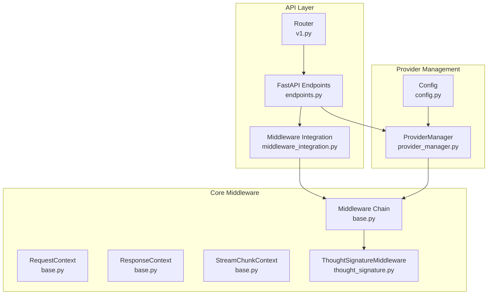
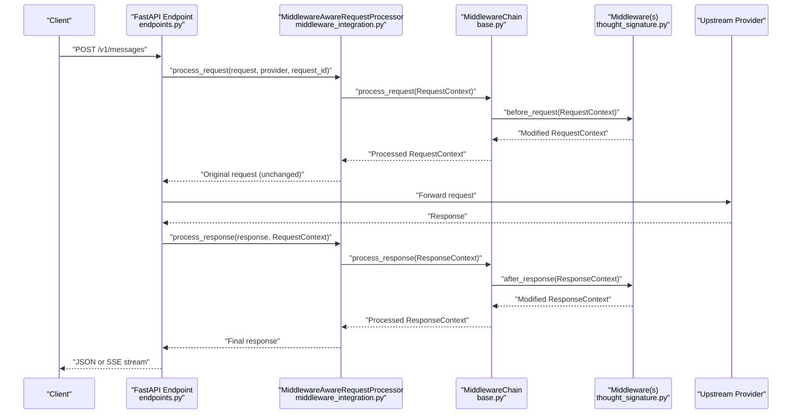
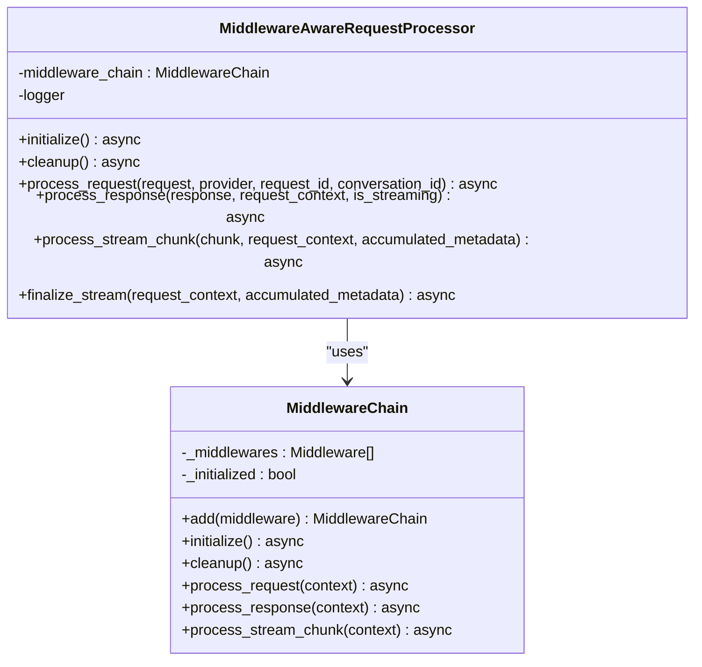
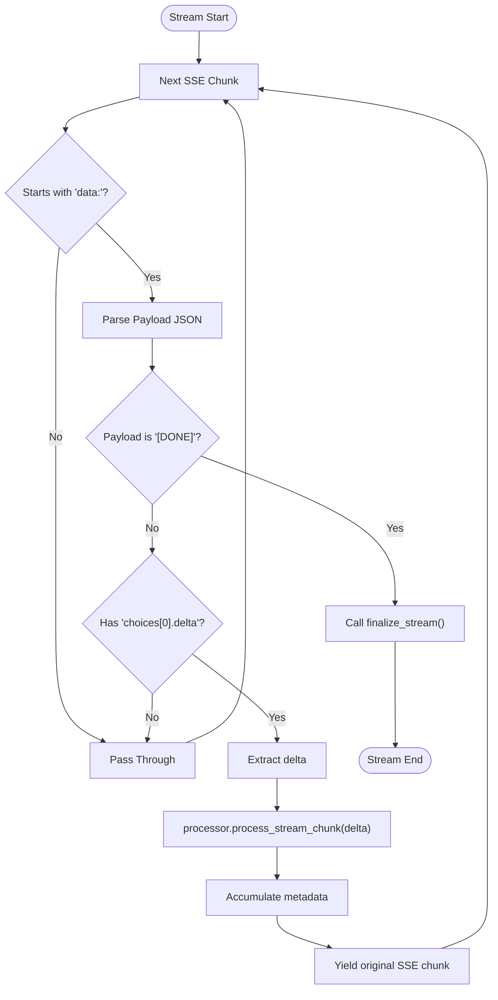
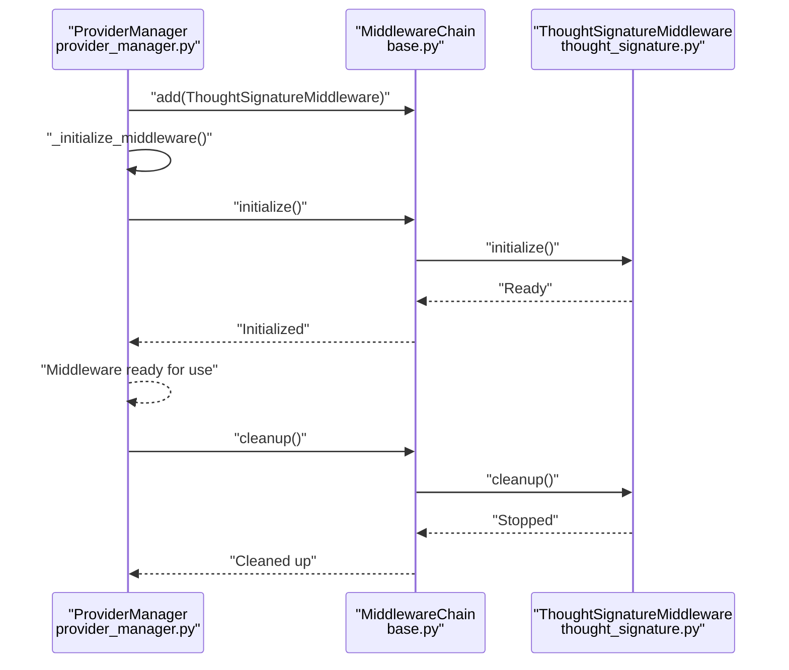
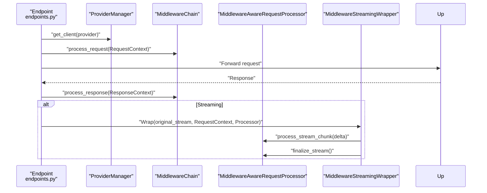
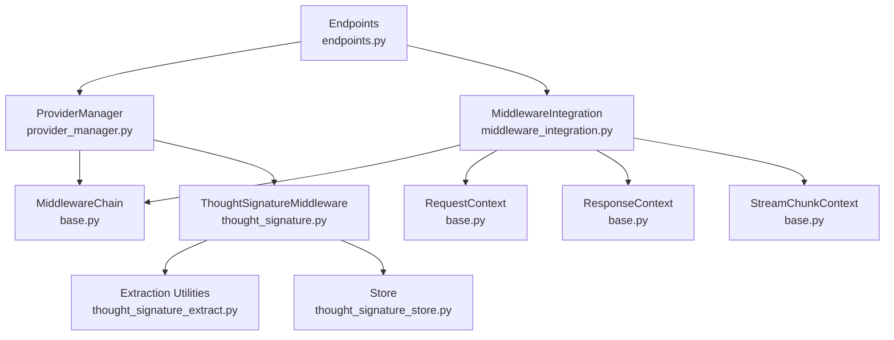

# Middleware Integration

<cite>
**Referenced Files in This Document**
- [middleware_integration.py](file://src/api/middleware_integration.py)
- [provider_manager.py](file://src/core/provider_manager.py)
- [base.py](file://src/middleware/base.py)
- [thought_signature.py](file://src/middleware/thought_signature.py)
- [endpoints.py](file://src/api/endpoints.py)
- [v1.py](file://src/api/routers/v1.py)
- [main.py](file://src/main.py)
- [config.py](file://src/core/config.py)
- [test_middleware_streaming_wrapper_parses_openai_sse.py](file://tests/unit/test_middleware_streaming_wrapper_parses_openai_sse.py)
</cite>

## Table of Contents
1. [Introduction](#introduction)
2. [Project Structure](#project-structure)
3. [Core Components](#core-components)
4. [Architecture Overview](#architecture-overview)
5. [Detailed Component Analysis](#detailed-component-analysis)
6. [Dependency Analysis](#dependency-analysis)
7. [Performance Considerations](#performance-considerations)
8. [Troubleshooting Guide](#troubleshooting-guide)
9. [Conclusion](#conclusion)

## Introduction
This document describes the middleware integration architecture that bridges the middleware system with FastAPI endpoints. It explains how the MiddlewareAwareRequestProcessor provides a clean interface for request/response processing, how streaming responses are wrapped for middleware processing, and how the provider manager initializes and manages middleware lifecycle. It also covers performance implications and error handling strategies for failed middleware processing.

## Project Structure
The middleware integration spans several modules:
- API layer integration: middleware_integration.py provides the bridge between FastAPI endpoints and the middleware system.
- Core middleware infrastructure: base.py defines contexts and the middleware chain orchestration.
- Provider management: provider_manager.py initializes and manages middleware for provider-specific scenarios.
- Endpoint implementations: endpoints.py demonstrates how FastAPI endpoints use the middleware processor transparently.
- Thought signature middleware: thought_signature.py implements a concrete middleware for Google Gemini.

**Diagram sources**
- [endpoints.py](file://src/api/endpoints.py#L171-L388)
- [v1.py](file://src/api/routers/v1.py#L10-L17)
- [middleware_integration.py](file://src/api/middleware_integration.py#L26-L183)
- [base.py](file://src/middleware/base.py#L191-L397)
- [thought_signature.py](file://src/middleware/thought_signature.py#L31-L150)
- [provider_manager.py](file://src/core/provider_manager.py#L29-L143)
- [config.py](file://src/core/config.py#L180-L196)

**Section sources**
- [middleware_integration.py](file://src/api/middleware_integration.py#L1-L297)
- [provider_manager.py](file://src/core/provider_manager.py#L1-L586)
- [base.py](file://src/middleware/base.py#L1-L398)
- [endpoints.py](file://src/api/endpoints.py#L1-L800)
- [v1.py](file://src/api/routers/v1.py#L1-L34)
- [config.py](file://src/core/config.py#L1-L200)

## Core Components
- MiddlewareAwareRequestProcessor: Provides process_request, process_response, and process_stream_chunk methods that wrap core functionality through the middleware chain. Also exposes finalize_stream for completion handlers.
- Global processor management: get_middleware_processor and cleanup_middleware_processor manage a singleton instance for cross-endpoint use.
- MiddlewareStreamingWrapper: Parses SSE chunks and applies middleware processing to streaming responses, accumulating metadata across chunks.
- ProviderManager: Initializes and manages middleware chain for provider-specific scenarios, including asynchronous initialization and cleanup.
- MiddlewareChain and contexts: Base infrastructure for middleware orchestration, including RequestContext, ResponseContext, and StreamChunkContext.

**Section sources**
- [middleware_integration.py](file://src/api/middleware_integration.py#L26-L212)
- [provider_manager.py](file://src/core/provider_manager.py#L113-L143)
- [base.py](file://src/middleware/base.py#L22-L397)

## Architecture Overview
The integration layer sits between FastAPI endpoints and the middleware system. Endpoints call into the middleware processor for request preprocessing, response postprocessing, and streaming delta processing. The provider manager ensures middleware is initialized and available globally, while the streaming wrapper ensures SSE parsing and middleware application for streaming responses.

**Diagram sources**
- [endpoints.py](file://src/api/endpoints.py#L391-L800)
- [middleware_integration.py](file://src/api/middleware_integration.py#L53-L124)
- [base.py](file://src/middleware/base.py#L253-L340)
- [thought_signature.py](file://src/middleware/thought_signature.py#L56-L93)

## Detailed Component Analysis

### MiddlewareAwareRequestProcessor
- Purpose: Provide a clean interface for endpoints to integrate middleware without understanding internal middleware architecture.
- Methods:
  - process_request: Creates RequestContext and delegates to middleware chain for request preprocessing.
  - process_response: Creates ResponseContext and delegates to middleware chain for response postprocessing.
  - process_stream_chunk: Creates StreamChunkContext and delegates to middleware chain for incremental streaming processing.
  - finalize_stream: Triggers completion handlers for streaming middleware.
- Global instance management: get_middleware_processor creates and initializes a singleton processor; cleanup_middleware_processor cleans it up.

**Diagram sources**
- [middleware_integration.py](file://src/api/middleware_integration.py#L26-L183)
- [base.py](file://src/middleware/base.py#L191-L397)

**Section sources**
- [middleware_integration.py](file://src/api/middleware_integration.py#L26-L183)

### MiddlewareStreamingWrapper
- Purpose: Parse SSE chunks and apply middleware processing to streaming responses.
- Behavior:
  - Extracts OpenAI-style deltas from SSE "data:" lines.
  - Calls process_stream_chunk for each delta and accumulates metadata.
  - Calls finalize_stream after the stream completes.
  - Passes through non-JSON SSE lines unchanged.

**Diagram sources**
- [middleware_integration.py](file://src/api/middleware_integration.py#L214-L296)

**Section sources**
- [middleware_integration.py](file://src/api/middleware_integration.py#L214-L296)

### ProviderManager Middleware Lifecycle
- Initialization: ProviderManager initializes a MiddlewareChain and registers middleware based on configuration (e.g., ThoughtSignatureMiddleware).
- Asynchronous initialization: initialize_middleware ensures middleware chain is ready before use.
- Cleanup: cleanup_middleware shuts down middleware resources cleanly.
- Endpoint usage: Endpoints can access the shared middleware chain via ProviderManager for request/response/streaming processing.

**Diagram sources**
- [provider_manager.py](file://src/core/provider_manager.py#L113-L143)
- [base.py](file://src/middleware/base.py#L191-L252)
- [thought_signature.py](file://src/middleware/thought_signature.py#L42-L48)

**Section sources**
- [provider_manager.py](file://src/core/provider_manager.py#L113-L143)

### API Endpoint Integration Examples
Endpoints transparently use middleware processing:
- Request preprocessing: Endpoints create RequestContext and call middleware chain to potentially modify messages before forwarding upstream.
- Response postprocessing: Endpoints create ResponseContext and call middleware chain to modify responses after receiving upstream responses.
- Streaming: Endpoints wrap streaming responses with MiddlewareStreamingWrapper to apply middleware to deltas and finalize processing at stream end.

**Diagram sources**
- [endpoints.py](file://src/api/endpoints.py#L489-L756)
- [middleware_integration.py](file://src/api/middleware_integration.py#L214-L296)

**Section sources**
- [endpoints.py](file://src/api/endpoints.py#L489-L756)

## Dependency Analysis
- MiddlewareAwareRequestProcessor depends on MiddlewareChain and contexts from base.py.
- ProviderManager composes MiddlewareChain and conditionally adds ThoughtSignatureMiddleware based on configuration.
- Endpoints depend on ProviderManager for middleware availability and on MiddlewareAwareRequestProcessor for streaming wrapping.
- ThoughtSignatureMiddleware depends on extraction utilities and a store for persistence.

**Diagram sources**
- [middleware_integration.py](file://src/api/middleware_integration.py#L19-L23)
- [provider_manager.py](file://src/core/provider_manager.py#L47-L133)
- [base.py](file://src/middleware/base.py#L22-L92)
- [thought_signature.py](file://src/middleware/thought_signature.py#L20-L26)
- [endpoints.py](file://src/api/endpoints.py#L489-L756)

**Section sources**
- [middleware_integration.py](file://src/api/middleware_integration.py#L19-L23)
- [provider_manager.py](file://src/core/provider_manager.py#L47-L133)
- [base.py](file://src/middleware/base.py#L22-L92)
- [thought_signature.py](file://src/middleware/thought_signature.py#L20-L26)
- [endpoints.py](file://src/api/endpoints.py#L489-L756)

## Performance Considerations
- Middleware chain overhead: Each middleware adds latency proportional to the number of applicable middlewares. The chain selects middlewares based on provider/model, minimizing unnecessary processing.
- Streaming processing: MiddlewareStreamingWrapper processes deltas incrementally, avoiding buffering entire responses. Accumulated metadata is lightweight dictionaries.
- Initialization cost: MiddlewareChain.initialize performs async initialization for each middleware. ProviderManager ensures this happens once during provider setup.
- Memory footprint: ThoughtSignatureMiddleware maintains in-memory caches controlled by configuration. Proper cleanup prevents memory leaks.
- Error propagation: MiddlewareChain propagates exceptions immediately, preventing silent failures but potentially impacting latency if middleware fails.

[No sources needed since this section provides general guidance]

## Troubleshooting Guide
- Middleware initialization failures: MiddlewareChain.initialize logs errors and raises exceptions if any middleware fails to initialize. Check middleware-specific logs for details.
- Streaming wrapper errors: MiddlewareStreamingWrapper catches exceptions internally and re-raises them, logging the error. Verify SSE format and payload structure.
- Provider middleware not active: Ensure ProviderManager has initialized middleware and that ThoughtSignatureMiddleware is registered based on configuration flags.
- Endpoint integration issues: Confirm endpoints are using the shared middleware chain from ProviderManager and that RequestContext/ResponseContext are constructed correctly.

**Section sources**
- [base.py](file://src/middleware/base.py#L218-L252)
- [middleware_integration.py](file://src/api/middleware_integration.py#L294-L296)
- [provider_manager.py](file://src/core/provider_manager.py#L113-L143)

## Conclusion
The middleware integration layer provides a robust, extensible bridge between FastAPI endpoints and the middleware system. It offers transparent request/response processing, efficient streaming delta handling, and lifecycle management for middleware resources. By leveraging ProviderManager for initialization and MiddlewareAwareRequestProcessor for cross-endpoint usage, the system maintains clean separation of concerns while enabling powerful middleware capabilities such as thought signature persistence for Gemini.