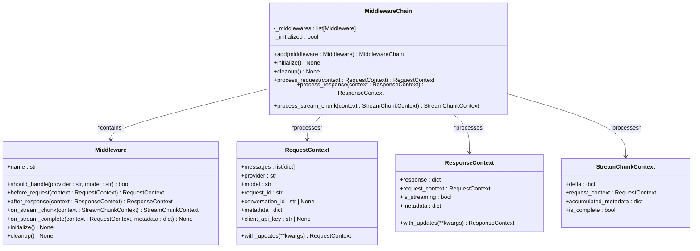
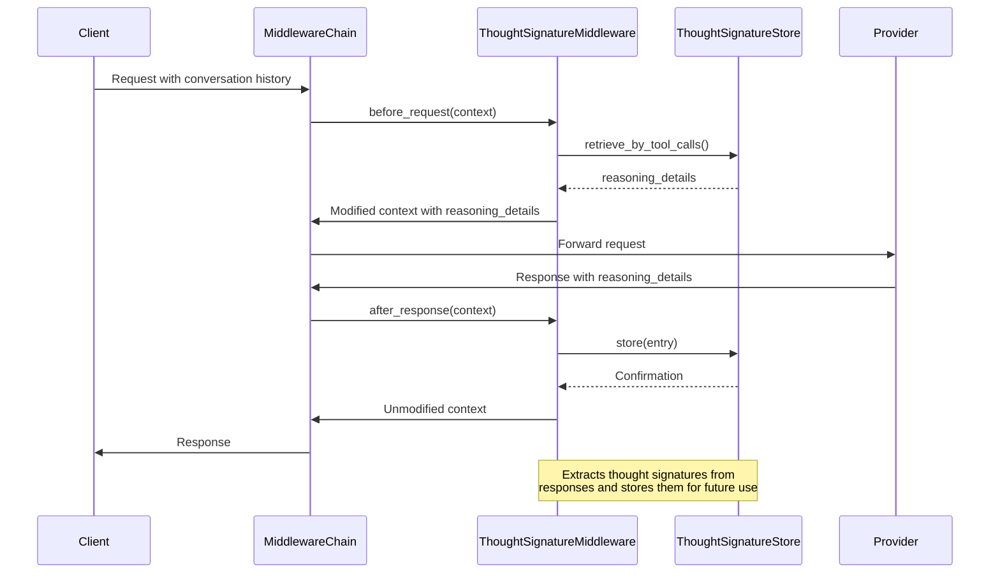
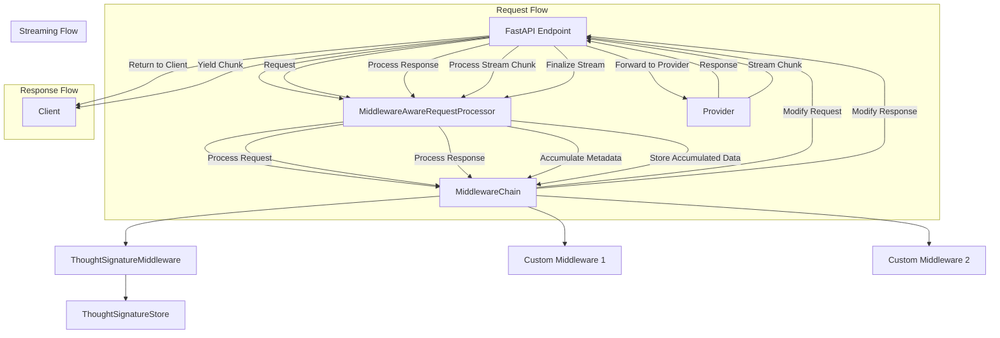
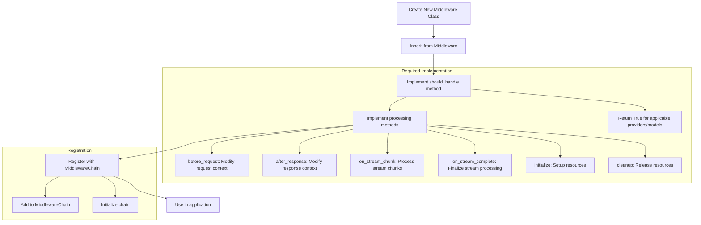
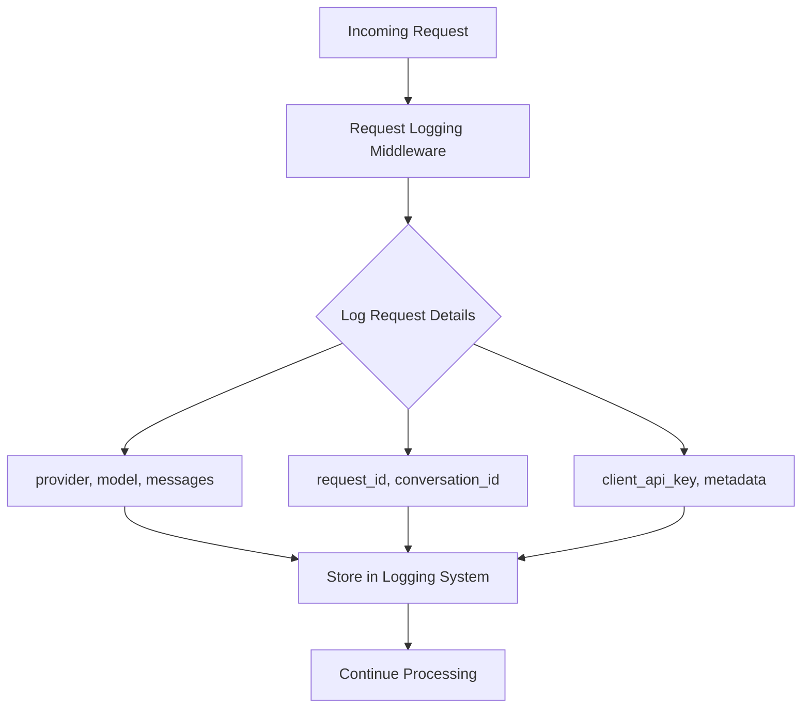
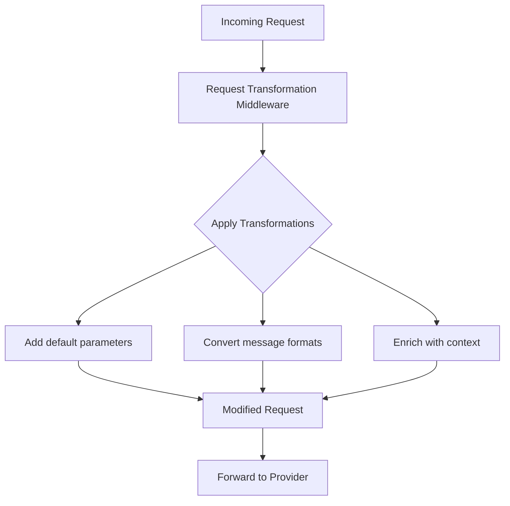
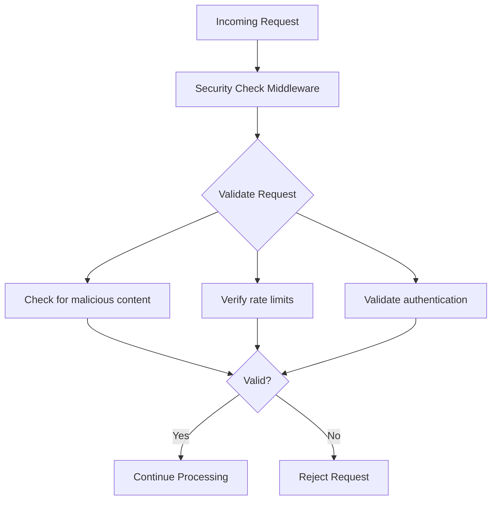
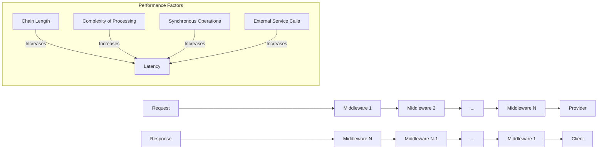
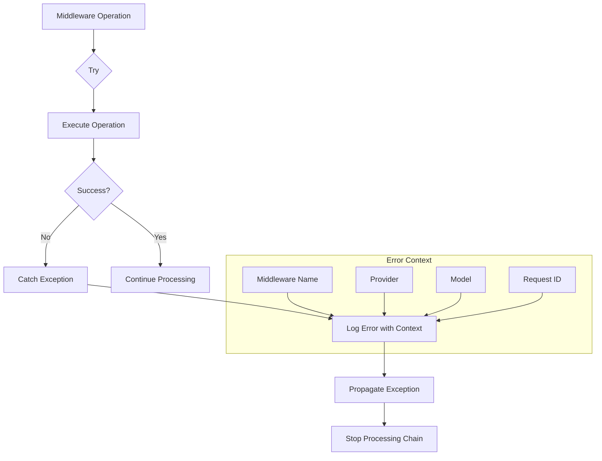

# Middleware System

<cite>
**Referenced Files in This Document**   
- [base.py](file://src/middleware/base.py)
- [thought_signature.py](file://src/middleware/thought_signature.py)
- [thought_signature_extract.py](file://src/middleware/thought_signature_extract.py)
- [thought_signature_store.py](file://src/middleware/thought_signature_store.py)
- [middleware_integration.py](file://src/api/middleware_integration.py)
- [v1.py](file://src/api/routers/v1.py)
- [endpoints.py](file://src/api/endpoints.py)
</cite>

## Table of Contents
1. [Introduction](#introduction)
2. [Chain-of-Responsibility Pattern Implementation](#chain-of-responsibility-pattern-implementation)
3. [Thought Signature Middleware](#thought-signature-middleware)
4. [Middleware Integration with FastAPI](#middleware-integration-with-fastapi)
5. [Extension Points for Custom Middleware](#extension-points-for-custom-middleware)
6. [Middleware Use Cases](#middleware-use-cases)
7. [Creating and Registering Custom Middleware](#creating-and-registering-custom-middleware)
8. [Performance Implications](#performance-implications)
9. [Error Handling in Middleware](#error-handling-in-middleware)
10. [Conclusion](#conclusion)

## Introduction

The middleware system in the Vandamme Proxy provides a flexible and extensible architecture for processing requests and responses across different AI providers. Built on the chain-of-responsibility pattern, this system enables provider-specific enhancements without intruding into core logic. The middleware framework supports both streaming and non-streaming operations, with a focus on type safety and async-first design principles.

The system is designed to handle various AI providers, with a particular focus on Google Vertex AI/Gemini through the thought signature middleware. This documentation will explore the architecture, implementation details, and extension points of the middleware system, enabling developers to understand, use, and extend the framework effectively.

## Chain-of-Responsibility Pattern Implementation

The middleware system implements the chain-of-responsibility pattern through the `MiddlewareChain` class in `src/middleware/base.py`. This pattern allows multiple middleware components to process requests and responses sequentially, with each component deciding whether to handle a specific provider/model combination.



**Diagram sources**
- [base.py](file://src/middleware/base.py#L94-L398)

**Section sources**
- [base.py](file://src/middleware/base.py#L1-L398)

The `MiddlewareChain` orchestrates the execution of middleware in the correct order, with proper error handling and performance monitoring. Each middleware in the chain is responsible for determining whether it should handle a specific provider/model combination through the `should_handle` method. The chain processes requests and responses through the `process_request` and `process_response` methods, respectively, applying only the middleware components that are applicable to the current provider and model.

The system uses immutable dataclasses (`RequestContext`, `ResponseContext`, and `StreamChunkContext`) to ensure thread safety and prevent unintended side effects. These context objects provide all necessary data for middleware to process requests and responses while maintaining immutability. The `with_updates` method allows middleware to create new context instances with modified fields without altering the original context.

## Thought Signature Middleware

The thought signature middleware, implemented in `src/middleware/thought_signature.py`, handles thought signature persistence for Google Vertex AI/Gemini models. This middleware enables seamless function calling across multi-turn conversations by extracting and storing metadata from LLM interactions.



**Diagram sources**
- [thought_signature.py](file://src/middleware/thought_signature.py#L31-L150)
- [thought_signature_store.py](file://src/middleware/thought_signature_store.py#L22-L194)

**Section sources**
- [thought_signature.py](file://src/middleware/thought_signature.py#L1-L150)
- [thought_signature_extract.py](file://src/middleware/thought_signature_extract.py#L1-L48)
- [thought_signature_store.py](file://src/middleware/thought_signature_store.py#L1-L194)

The `ThoughtSignatureMiddleware` class implements the `Middleware` interface and provides specific functionality for Gemini models. It checks if a request should be handled by examining the model name for "gemini" in the `should_handle` method. For requests, it injects previously stored thought signatures into assistant messages that contain tool calls, enabling the model to maintain context across multiple interactions.

The middleware uses a `ThoughtSignatureStore` to manage the storage and retrieval of thought signatures. This in-memory cache stores entries containing reasoning details, tool call IDs, timestamps, and conversation context. The store implements TTL (time-to-live) expiration and automatic cleanup to prevent memory leaks. When a response is received, the middleware extracts thought signatures and stores them for future use in subsequent requests.

For streaming responses, the middleware accumulates reasoning details and tool call IDs across multiple chunks, storing them only when the stream is complete. This ensures that partial or incomplete thought signatures are not stored, maintaining the integrity of the conversation context.

## Middleware Integration with FastAPI

The middleware system is integrated with FastAPI through the `MiddlewareAwareRequestProcessor` class in `src/api/middleware_integration.py`. This integration layer connects the middleware system with API endpoints without intruding into the core endpoint logic.



**Diagram sources**
- [middleware_integration.py](file://src/api/middleware_integration.py#L26-L297)
- [endpoints.py](file://src/api/endpoints.py#L620-L819)

**Section sources**
- [middleware_integration.py](file://src/api/middleware_integration.py#L1-L297)
- [endpoints.py](file://src/api/endpoints.py#L620-L819)

The `MiddlewareAwareRequestProcessor` provides a clean interface for endpoints to use middleware without needing to understand the internal middleware architecture. It acts as a facade, abstracting the complexity of the middleware chain from the endpoint implementations. The processor is initialized with provider-specific middlewares, currently including the `ThoughtSignatureMiddleware` for Gemini providers.

A global instance of `MiddlewareAwareRequestProcessor` is created and managed through the `get_middleware_processor` function, ensuring that the middleware chain is properly initialized and available across all endpoints. The `MiddlewareStreamingWrapper` class handles the integration of middleware with streaming responses, parsing server-sent events (SSE) and extracting JSON payloads to feed middleware via `process_stream_chunk`.

In the endpoint implementations, middleware is applied to both streaming and non-streaming responses. For streaming responses, the `MiddlewareStreamingWrapper` is used to process each chunk through the middleware chain while preserving the streaming nature of the response. For non-streaming responses, the response is processed through the middleware chain before being returned to the client.

## Extension Points for Custom Middleware Development

The middleware system provides several extension points for custom middleware development. Developers can create new middleware components by extending the `Middleware` abstract base class and implementing the required methods.



**Diagram sources**
- [base.py](file://src/middleware/base.py#L94-L188)

**Section sources**
- [base.py](file://src/middleware/base.py#L94-L188)

The primary extension point is the `Middleware` abstract base class, which defines the interface that all middleware components must implement. Custom middleware should inherit from this class and provide implementations for the abstract methods. The `should_handle` method determines whether the middleware should process a specific provider/model combination, allowing for targeted functionality.

Custom middleware can implement any of the processing methods (`before_request`, `after_response`, `on_stream_chunk`, `on_stream_complete`) based on their specific requirements. The `initialize` and `cleanup` methods provide hooks for setting up and tearing down resources, such as database connections or external service clients.

To register custom middleware, developers can add their middleware instances to the `MiddlewareChain` through the `add` method. The middleware chain will automatically handle initialization and cleanup of all registered middleware components. In the current implementation, middleware is registered in the `initialize` method of `MiddlewareAwareRequestProcessor`, but this can be extended to support dynamic registration based on configuration.

## Middleware Use Cases

The middleware system supports various use cases for enhancing request and response processing. These use cases demonstrate the flexibility and power of the chain-of-responsibility pattern in the context of AI proxy services.

### Request Logging

Request logging middleware can be implemented to capture detailed information about incoming requests for monitoring, debugging, and analytics purposes. This middleware would implement the `before_request` method to log request details such as provider, model, message content, and metadata.



### Request Transformation

Request transformation middleware can modify incoming requests before they are sent to the provider. This could include adding default parameters, converting message formats, or enriching requests with additional context. The `before_request` method would be used to modify the `RequestContext` as needed.



### Security Checks

Security check middleware can validate requests for potential security issues, such as malicious content, rate limiting, or unauthorized access. This middleware would implement the `before_request` method to inspect and potentially reject requests that fail security checks.



**Section sources**
- [base.py](file://src/middleware/base.py#L125-L159)
- [thought_signature.py](file://src/middleware/thought_signature.py#L56-L84)

## Creating and Registering Custom Middleware

Creating and registering custom middleware components involves several steps that follow the established patterns in the middleware system. Developers can create new middleware by extending the `Middleware` class and implementing the required methods.

```mermaid
flowchart TD
A[Define Custom Middleware Class] --> B[Inherit from Middleware]
B --> C[Implement name property]
C --> D[Implement should_handle method]
D --> E[Implement processing methods]
E --> F[Add to MiddlewareChain]
F --> G[Initialize middleware chain]
subgraph "Example: LoggingMiddleware"
A --> H[class LoggingMiddleware(Middleware):]
H --> I[def __init__(self, logger):]
H --> J[@property def name(self):]
H --> K[def should_handle(self, provider, model):]
H --> L[async def before_request(self, context):]
H --> M[async def after_response(self, context):]
H --> N[async def initialize(self):]
H --> O[async def cleanup(self):]
end
```

**Diagram sources**
- [base.py](file://src/middleware/base.py#L94-L188)

**Section sources**
- [base.py](file://src/middleware/base.py#L94-L188)
- [middleware_integration.py](file://src/api/middleware_integration.py#L38-L47)

To create a custom middleware, start by defining a new class that inherits from `Middleware`. The class must implement the `name` property, which provides a human-readable name for logging and debugging. The `should_handle` method determines whether the middleware should process a specific provider/model combination, returning `True` if applicable.

Next, implement the processing methods based on the middleware's requirements. The `before_request` method can modify the request context before it is sent to the provider, while the `after_response` method can modify the response context after receiving a response. For streaming support, implement the `on_stream_chunk` and `on_stream_complete` methods to process streaming chunks and finalize stream processing, respectively.

The `initialize` and `cleanup` methods provide hooks for setting up and tearing down resources. These methods are called once when the middleware chain is created and during application shutdown, respectively.

To register the custom middleware, add an instance of the middleware to the `MiddlewareChain` through the `add` method. In the current implementation, this is done in the `initialize` method of `MiddlewareAwareRequestProcessor`, but the system can be extended to support dynamic registration from configuration files or other sources.

## Performance Implications

The middleware chain has several performance implications that developers should consider when designing and implementing middleware components. The sequential nature of the chain means that each middleware adds some overhead to request and response processing.



**Diagram sources**
- [base.py](file://src/middleware/base.py#L253-L398)

**Section sources**
- [base.py](file://src/middleware/base.py#L253-L398)

The primary performance consideration is the length of the middleware chain. Each middleware in the chain adds processing time, as requests and responses must pass through each applicable middleware sequentially. The system mitigates this by only applying middleware that is relevant to the current provider and model, as determined by the `should_handle` method.

Another factor is the complexity of the processing performed by each middleware. Operations that involve heavy computation, external service calls, or database access can significantly impact performance. The thought signature middleware, for example, performs in-memory operations with O(1) lookup time for retrieving thought signatures, minimizing its performance impact.

For streaming responses, the middleware chain processes each chunk individually, which can add overhead for high-frequency streaming scenarios. The `MiddlewareStreamingWrapper` is designed to minimize this overhead by only processing chunks that contain relevant data (JSON SSE events) and passing through other chunks unchanged.

Developers should also consider the initialization and cleanup overhead of middleware components. The `initialize` method is called once when the middleware chain is created, and the `cleanup` method is called during application shutdown. These methods should be efficient and avoid long-running operations that could delay application startup or shutdown.

## Error Handling in Middleware

Error handling in the middleware system is designed to be robust and informative, with proper logging and exception propagation. Each middleware operation is wrapped in try-catch blocks to ensure that errors are properly handled and do not disrupt the entire request processing pipeline.



**Diagram sources**
- [base.py](file://src/middleware/base.py#L283-L323)

**Section sources**
- [base.py](file://src/middleware/base.py#L283-L323)
- [test_base.py](file://tests/middleware/test_base.py#L351-L388)

When an error occurs in a middleware component, it is caught and logged with detailed context information, including the middleware name, provider, model, and request ID. This information is crucial for debugging and monitoring. After logging the error, the exception is re-raised, which stops the processing chain and propagates the error to the caller.

The system uses specific error handling for initialization and cleanup operations. During initialization, if any middleware fails to initialize, the entire chain initialization fails, and the error is propagated. This ensures that the middleware system is in a consistent state. During cleanup, errors are logged but not propagated, as cleanup operations should not prevent the application from shutting down.

For streaming operations, the `MiddlewareStreamingWrapper` includes error handling in its `__aiter__` method. If an error occurs during stream processing, it is logged and re-raised, ensuring that clients receive appropriate error responses. The wrapper also ensures that the `finalize_stream` method is called even if an error occurs, allowing middleware to perform any necessary cleanup operations.

## Conclusion

The middleware system in the Vandamme Proxy provides a robust and extensible framework for processing requests and responses across different AI providers. By implementing the chain-of-responsibility pattern, the system enables modular, composable functionality that can be easily extended with custom middleware components.

The thought signature middleware demonstrates the power of this architecture, providing essential functionality for Google Vertex AI/Gemini models by managing thought signatures across multi-turn conversations. The integration with FastAPI is seamless, allowing endpoints to leverage middleware functionality without complex dependencies or intrusive code changes.

Developers can extend the system by creating custom middleware components that implement the `Middleware` interface. These components can perform various tasks, such as request logging, transformation, and security checks, while benefiting from the system's robust error handling and performance monitoring.

When creating custom middleware, developers should consider performance implications, particularly the impact of chain length and processing complexity. Proper error handling and resource management are also essential for maintaining system stability and reliability.

Overall, the middleware system provides a solid foundation for building sophisticated AI proxy services, enabling provider-specific enhancements while maintaining clean separation of concerns and type safety.