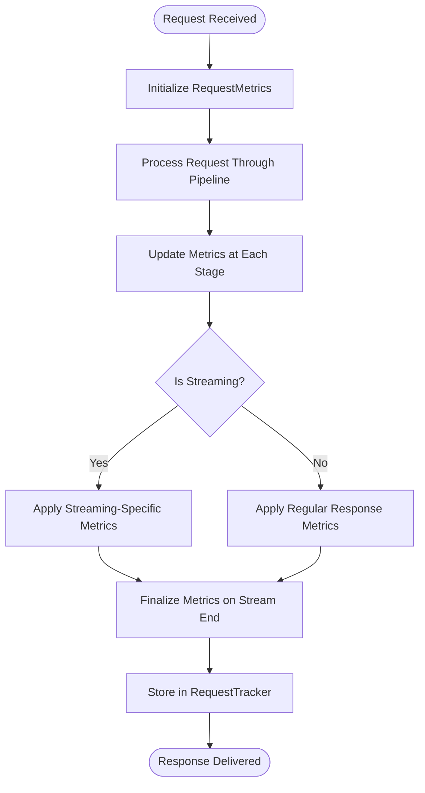
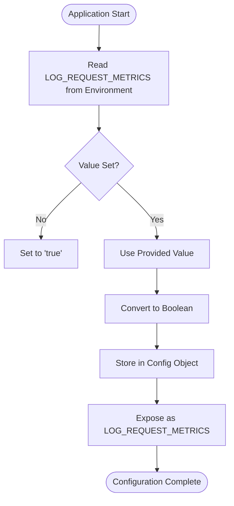
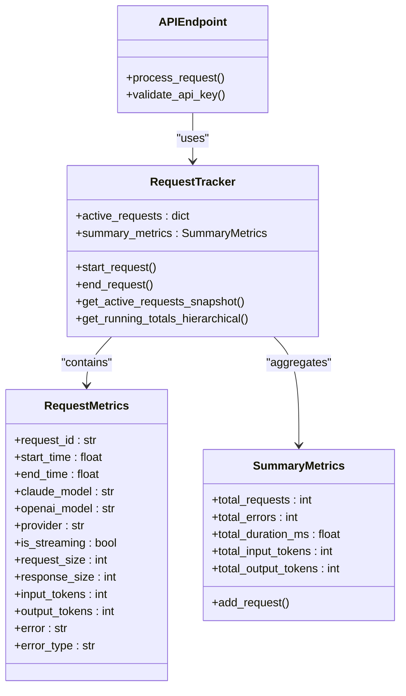
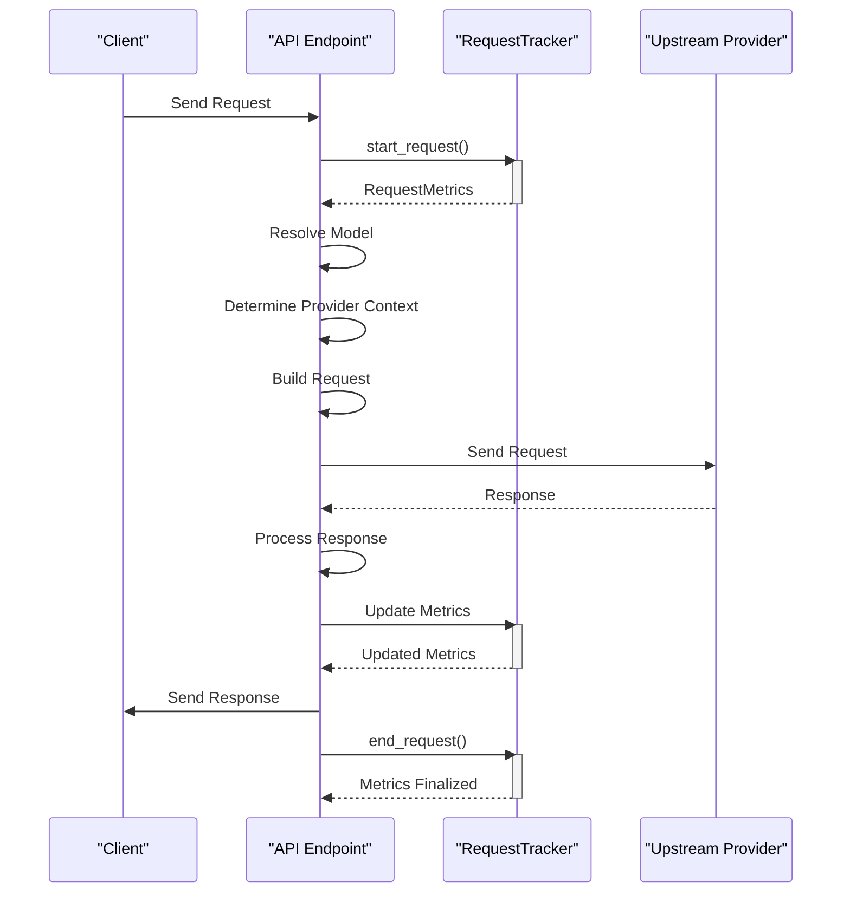
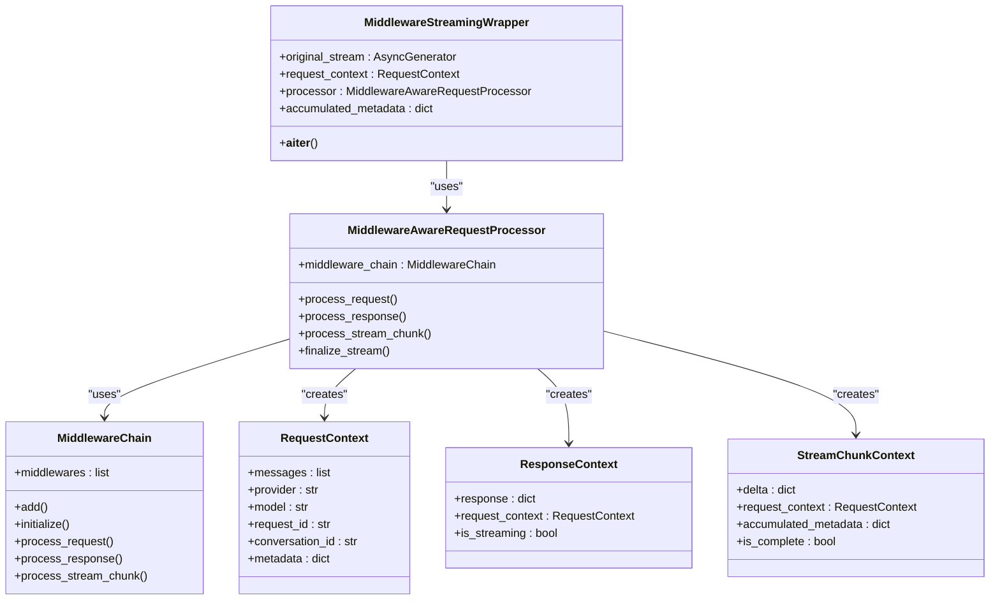
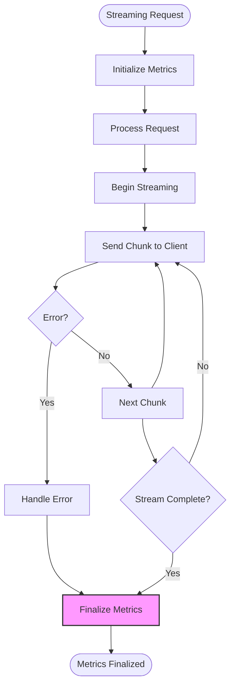

# API Metrics Integration

<cite>
**Referenced Files in This Document**   
- [metrics.py](file://src/api/metrics.py)
- [endpoints.py](file://src/api/endpoints.py)
- [middleware_integration.py](file://src/api/middleware_integration.py)
- [streaming.py](file://src/api/services/streaming.py)
- [error_handling.py](file://src/api/services/error_handling.py)
- [tracker.py](file://src/core/metrics/tracker/tracker.py)
- [runtime.py](file://src/core/metrics/runtime.py)
- [config.py](file://src/core/config.py)
- [main.py](file://src/main.py)
</cite>

## Table of Contents
1. [Introduction](#introduction)
2. [Metrics Collection Instrumentation](#metrics-collection-instrumentation)
3. [LOG_REQUEST_METRICS Configuration](#log_request_metrics-configuration)
4. [API Endpoints and Metrics Tracker Integration](#api-endpoints-and-metrics-tracker-integration)
5. [Request Processing Pipeline Metrics](#request-processing-pipeline-metrics)
6. [Middleware and Metrics Collection](#middleware-and-metrics-collection)
7. [Streaming Response Handling](#streaming-response-handling)
8. [End-to-End Visibility](#end-to-end-visibility)
9. [Conclusion](#conclusion)

## Introduction
The API metrics integration system provides comprehensive monitoring and visibility into API performance and usage patterns. This documentation details how metrics collection is instrumented throughout the API layer, from request reception to response delivery. The system captures detailed information about each API request, including timing, token usage, error rates, and other performance indicators. The metrics are collected through a sophisticated integration between API endpoints, middleware components, and the core metrics tracker, providing end-to-end visibility into the system's operation.

## Metrics Collection Instrumentation
The metrics collection system is instrumented throughout the API layer to capture comprehensive data about each request. The instrumentation begins at the moment a request is received and continues through the entire processing pipeline until the response is delivered. The system uses a RequestTracker component that maintains both active (in-flight) and completed request metrics, providing real-time visibility into current system load and historical performance data.

The metrics collection is implemented through a combination of direct instrumentation in API endpoints and middleware integration. When a request arrives, the system immediately creates a RequestMetrics object that captures various attributes of the request, including start time, model, provider, and streaming status. As the request progresses through the processing pipeline, additional metrics are populated, such as input/output token counts, request/response sizes, and tool usage statistics.



**Diagram sources**
- [endpoints.py](file://src/api/endpoints.py#L171-L851)
- [tracker.py](file://src/core/metrics/tracker/tracker.py#L85-L180)

**Section sources**
- [endpoints.py](file://src/api/endpoints.py#L171-L851)
- [tracker.py](file://src/core/metrics/tracker/tracker.py#L85-L180)

## LOG_REQUEST_METRICS Configuration
The LOG_REQUEST_METRICS constant controls the verbosity and enablement of metrics logging throughout the system. This configuration setting is derived from the environment variable LOG_REQUEST_METRICS and defaults to "true" if not explicitly set. The constant is defined in multiple locations across the codebase, ensuring consistent access to the metrics logging configuration.

When LOG_REQUEST_METRICS is enabled (set to true), the system collects and exposes comprehensive metrics through various endpoints, including active requests, running totals, and detailed request traces. When disabled, these endpoints return appropriate responses indicating that metrics logging is disabled, along with suggestions for enabling it.

The configuration is implemented as a boolean flag that is checked at multiple points in the request processing pipeline. This allows the system to conditionally execute metrics collection code, minimizing performance overhead when metrics are not needed. The configuration also affects the behavior of metrics-related endpoints, which return disabled status information when metrics logging is turned off.



**Diagram sources**
- [config.py](file://src/core/config.py#L84)
- [endpoints.py](file://src/api/endpoints.py#L46)
- [metrics.py](file://src/api/metrics.py#L18)

**Section sources**
- [config.py](file://src/core/config.py#L84)
- [endpoints.py](file://src/api/endpoints.py#L46)
- [metrics.py](file://src/api/metrics.py#L18)

## API Endpoints and Metrics Tracker Integration
The integration between API endpoints and the core metrics tracker is a fundamental aspect of the system's observability. Each API endpoint that processes requests integrates with the RequestTracker to capture metrics at various stages of request processing. The integration follows a consistent pattern across endpoints, ensuring uniform metrics collection regardless of the specific API functionality.

The primary integration points are the /v1/chat/completions and /v1/messages endpoints, which serve as the main entry points for API requests. When a request arrives at these endpoints, the system immediately initializes metrics collection by creating a RequestMetrics object and registering it with the RequestTracker. This registration marks the beginning of the request's lifecycle in the metrics system.

The RequestTracker is accessed through the FastAPI application state, following the pattern request.app.state.request_tracker. This design ensures that the metrics tracker is properly scoped to the application instance and can be easily accessed by any endpoint. The tracker maintains a dictionary of active requests, allowing for real-time monitoring of in-flight requests and their associated metrics.



**Diagram sources**
- [endpoints.py](file://src/api/endpoints.py#L171-L851)
- [tracker.py](file://src/core/metrics/tracker/tracker.py#L42-L490)
- [runtime.py](file://src/core/metrics/runtime.py#L20-L28)

**Section sources**
- [endpoints.py](file://src/api/endpoints.py#L171-L851)
- [tracker.py](file://src/core/metrics/tracker/tracker.py#L42-L490)

## Request Processing Pipeline Metrics
The request processing pipeline captures metrics at various stages, providing detailed insights into the performance and behavior of API requests. The pipeline begins with request reception and continues through model resolution, provider context determination, request building, upstream API communication, response processing, and final response delivery.

At each stage of the pipeline, specific metrics are captured and updated in the RequestMetrics object. For example, when the model is resolved, the system captures the requested model and the resolved target model, allowing for analysis of alias usage and model routing. When the provider context is determined, the system records the target provider, enabling provider-level performance analysis.

The pipeline also captures timing metrics at key points, allowing for identification of performance bottlenecks. The system records the start time when the request is received and the end time when processing is complete, calculating the total duration. For streaming responses, the system can capture additional timing metrics related to the streaming process.



**Diagram sources**
- [endpoints.py](file://src/api/endpoints.py#L171-L851)
- [tracker.py](file://src/core/metrics/tracker/tracker.py#L85-L180)

**Section sources**
- [endpoints.py](file://src/api/endpoints.py#L171-L851)
- [tracker.py](file://src/core/metrics/tracker/tracker.py#L85-L180)

## Middleware and Metrics Collection
The middleware system is tightly integrated with metrics collection, allowing for enhanced observability of request processing. The MiddlewareAwareRequestProcessor class provides a clean interface for endpoints to use middleware without needing to understand the internal middleware architecture. This processor integrates with the metrics system to capture information about middleware processing and its impact on requests.

Middleware components can modify requests and responses, and these modifications are captured in the metrics system. For example, the thought signature middleware can inject additional information into requests, and this activity is recorded in the metrics. The system captures both the original request state and the modified state, allowing for analysis of middleware impact.

The integration between middleware and metrics collection is particularly important for streaming responses, where middleware can process individual chunks of the response stream. The MiddlewareStreamingWrapper class wraps streaming responses to apply middleware to each chunk, and this processing is reflected in the accumulated metadata that is captured in the metrics.



**Diagram sources**
- [middleware_integration.py](file://src/api/middleware_integration.py#L26-L297)
- [tracker.py](file://src/core/metrics/tracker/tracker.py#L85-L180)

**Section sources**
- [middleware_integration.py](file://src/api/middleware_integration.py#L26-L297)

## Streaming Response Handling
Streaming responses are handled differently from regular responses in the metrics tracking system, with specialized mechanisms to ensure accurate metrics collection throughout the streaming process. The key difference lies in when and how metrics are finalized, as streaming responses are delivered incrementally over time rather than as a single complete response.

For streaming responses, the system uses a combination of error handling and metrics finalization wrappers to ensure that metrics are properly recorded regardless of how the stream ends. The with_streaming_error_handling function combines SSE error handling with metrics finalization, ensuring that metrics are finalized even if the stream encounters an error. This is implemented using a finally block, which guarantees execution regardless of normal completion or error conditions.

The system also captures streaming-specific metrics, such as the number of chunks delivered and timing information related to the streaming process. For streaming responses, the end_request method is called in a finally block of the streaming generator, ensuring that metrics are finalized when the stream completes, whether normally or due to an error.



**Diagram sources**
- [streaming.py](file://src/api/services/streaming.py#L40-L242)
- [error_handling.py](file://src/api/services/error_handling.py#L16-L93)
- [endpoints.py](file://src/api/endpoints.py#L281-L290)

**Section sources**
- [streaming.py](file://src/api/services/streaming.py#L40-L242)
- [error_handling.py](file://src/api/services/error_handling.py#L16-L93)

## End-to-End Visibility
The API metrics integration system provides comprehensive end-to-end visibility into API performance and usage patterns. This visibility is achieved through the aggregation of metrics from various sources and their exposure through multiple endpoints that serve different monitoring and analysis purposes.

The system provides several key metrics endpoints that offer different views into the system's operation. The /metrics/logs endpoint provides recent errors and request traces, enabling debugging and issue identification. The /metrics/active-requests endpoint offers a snapshot of in-flight requests, allowing for real-time monitoring of current system load. The /metrics/running-totals endpoint provides hierarchical provider-to-model breakdowns of request metrics, enabling detailed analysis of usage patterns.

The end-to-end visibility extends from the initial request reception through all processing stages to the final response delivery. The system captures not only high-level metrics like request count and error rate but also detailed information about token usage, response sizes, and processing times. This comprehensive data enables both operational monitoring and strategic analysis of API usage and performance.

```mermaid
graph TD
A[Client Requests] --> B[API Endpoints]
B --> C[Metrics Collection]
C --> D[Active Requests]
C --> E[Completed Requests]
D --> F[/metrics/active-requests]
D --> G[/metrics/active-requests/stream]
E --> H[/metrics/running-totals]
E --> I[/metrics/logs]
F --> J[Dashboard Active Requests]
G --> K[Dashboard Active Requests SSE]
H --> L[Dashboard Running Totals]
I --> M[Dashboard Logs]
J --> N[End-to-End Visibility]
K --> N
L --> N
M --> N
```

**Diagram sources**
- [metrics.py](file://src/api/metrics.py#L24-L263)
- [endpoints.py](file://src/api/endpoints.py#L171-L851)
- [tracker.py](file://src/core/metrics/tracker/tracker.py#L42-L490)

**Section sources**
- [metrics.py](file://src/api/metrics.py#L24-L263)

## Conclusion
The API metrics integration system provides a robust and comprehensive solution for monitoring and analyzing API performance and usage. By instrumenting metrics collection throughout the API layer, from request reception to response delivery, the system offers end-to-end visibility into the operation of the API. The LOG_REQUEST_METRICS configuration allows for flexible control over metrics verbosity, enabling or disabling metrics collection as needed.

The integration between API endpoints and the core metrics tracker is seamless and consistent, ensuring uniform metrics collection across all API functionality. The system captures detailed information at various stages of the request processing pipeline, providing insights into performance bottlenecks and usage patterns. The special handling of streaming responses ensures accurate metrics collection even for complex, long-running requests.

The middleware integration extends the metrics collection capabilities, capturing information about middleware processing and its impact on requests. This comprehensive approach to metrics collection enables both operational monitoring and strategic analysis, supporting the optimization of API performance and the understanding of usage patterns. The system's design, with its clear separation of concerns and well-defined interfaces, ensures maintainability and extensibility for future enhancements.