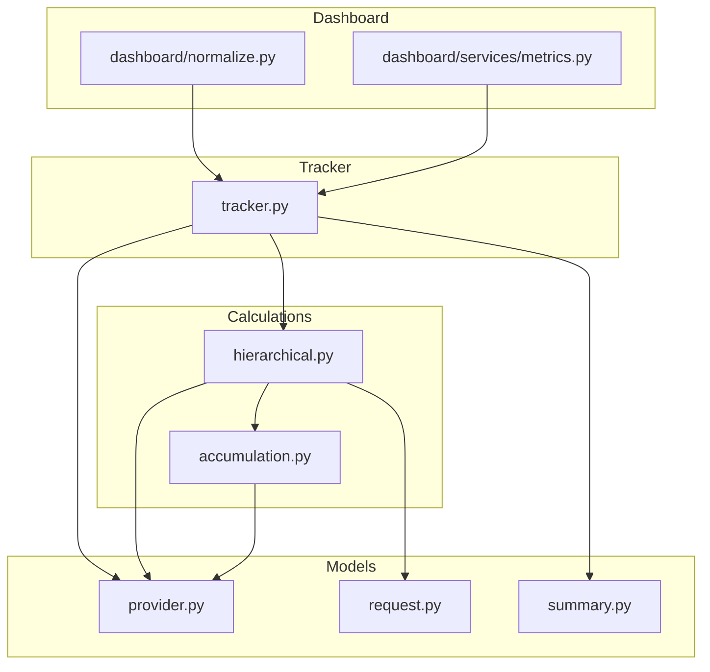
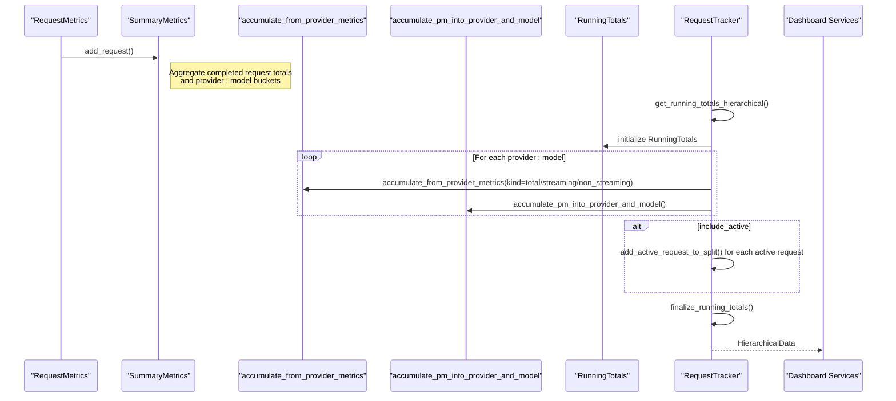
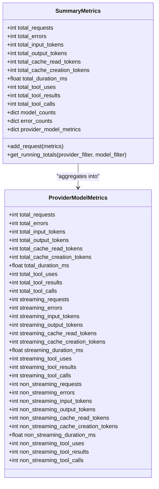
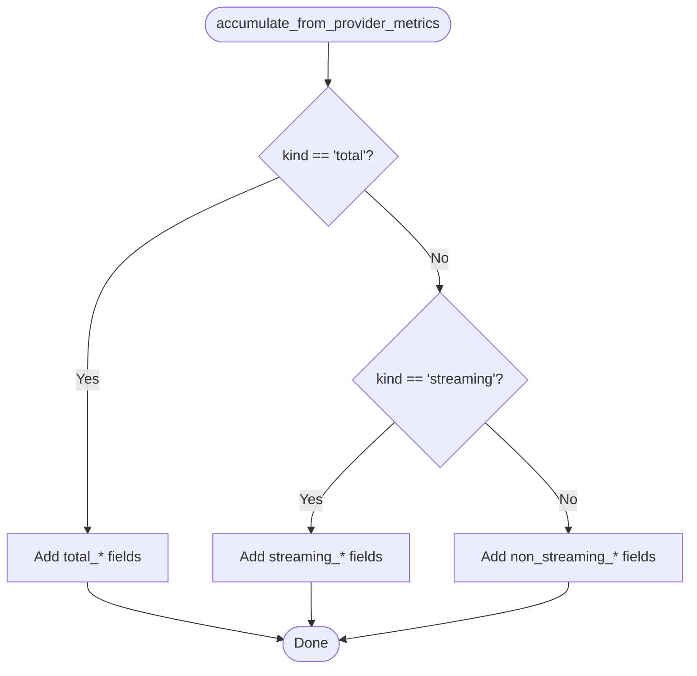
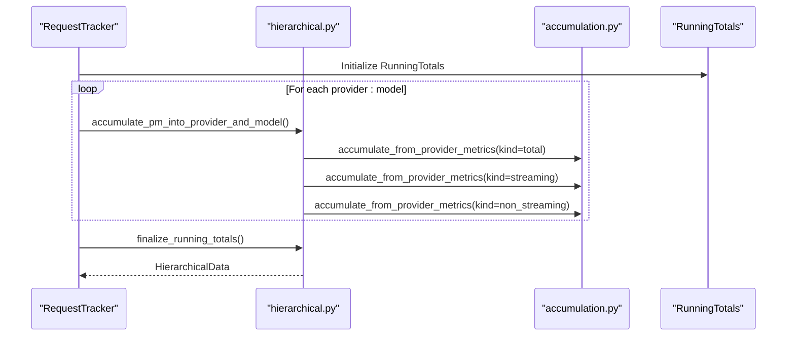
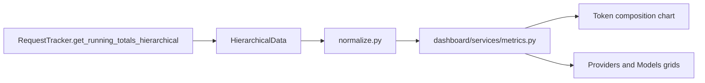
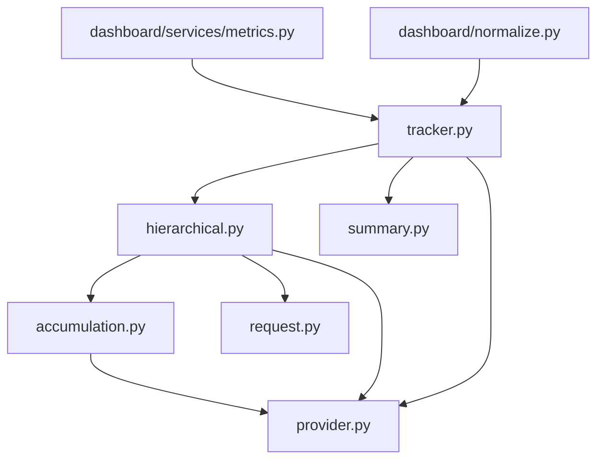

# Accumulation Metrics

<cite>
**Referenced Files in This Document**
- [accumulation.py](file://src/core/metrics/calculations/accumulation.py)
- [hierarchical.py](file://src/core/metrics/calculations/hierarchical.py)
- [provider.py](file://src/core/metrics/models/provider.py)
- [request.py](file://src/core/metrics/models/request.py)
- [summary.py](file://src/core/metrics/models/summary.py)
- [tracker.py](file://src/core/metrics/tracker/tracker.py)
- [types.py](file://src/core/metrics/types.py)
- [metrics.py](file://src/dashboard/services/metrics.py)
- [normalize.py](file://src/dashboard/normalize.py)
- [test_metrics_running_totals.py](file://tests/unit/test_metrics_running_totals.py)
</cite>

## Table of Contents
1. [Introduction](#introduction)
2. [Project Structure](#project-structure)
3. [Core Components](#core-components)
4. [Architecture Overview](#architecture-overview)
5. [Detailed Component Analysis](#detailed-component-analysis)
6. [Dependency Analysis](#dependency-analysis)
7. [Performance Considerations](#performance-considerations)
8. [Troubleshooting Guide](#troubleshooting-guide)
9. [Conclusion](#conclusion)

## Introduction
This document explains the accumulation pipeline that aggregates ProviderModelMetrics into hierarchical, dashboard-ready structures. It focuses on how raw metrics are combined into additive summaries across provider, model, and streaming/non-streaming dimensions, enabling efficient roll-up reporting and real-time dashboards. The module emphasizes pure accumulation helpers that are isolated from tracker state for testability and reuse.

## Project Structure
The accumulation logic spans several modules:
- Pure accumulation helpers for additive metric aggregation
- Hierarchical rollup builders that construct provider->model trees
- Data models for ProviderModelMetrics, RequestMetrics, and SummaryMetrics
- Tracker orchestration that coordinates accumulation into RunningTotals
- Dashboard integration that consumes finalized hierarchical metrics

**Diagram sources**
- [accumulation.py](file://src/core/metrics/calculations/accumulation.py#L1-L84)
- [hierarchical.py](file://src/core/metrics/calculations/hierarchical.py#L1-L125)
- [provider.py](file://src/core/metrics/models/provider.py#L1-L47)
- [request.py](file://src/core/metrics/models/request.py#L1-L56)
- [summary.py](file://src/core/metrics/models/summary.py#L1-L219)
- [tracker.py](file://src/core/metrics/tracker/tracker.py#L1-L490)
- [metrics.py](file://src/dashboard/services/metrics.py#L1-L67)
- [normalize.py](file://src/dashboard/normalize.py#L83-L196)

**Section sources**
- [accumulation.py](file://src/core/metrics/calculations/accumulation.py#L1-L84)
- [hierarchical.py](file://src/core/metrics/calculations/hierarchical.py#L1-L125)
- [provider.py](file://src/core/metrics/models/provider.py#L1-L47)
- [request.py](file://src/core/metrics/models/request.py#L1-L56)
- [summary.py](file://src/core/metrics/models/summary.py#L1-L219)
- [tracker.py](file://src/core/metrics/tracker/tracker.py#L1-L490)
- [metrics.py](file://src/dashboard/services/metrics.py#L1-L67)
- [normalize.py](file://src/dashboard/normalize.py#L83-L196)

## Core Components
- ProviderModelMetrics: Aggregated metrics per provider:model, including total/streaming/non_streaming splits.
- SummaryMetrics: Flat aggregation of completed requests into totals and provider:model buckets.
- RunningTotals: Hierarchical container for provider->model rollups with streaming splits.
- Accumulation helpers: Pure functions that add ProviderModelMetrics into rolling totals.
- Hierarchical builders: Functions that construct provider and model entries and compute averages.
- Tracker orchestration: Thread-safe aggregation pipeline that builds RunningTotals for dashboards.

Key functions:
- new_metric_totals(): Initializes an additive totals dictionary.
- new_streaming_split(): Creates a "total"/"streaming"/"non_streaming" split.
- accumulate_from_provider_metrics(target, pm, kind): Adds ProviderModelMetrics into a totals dict by kind.
- accumulate_pm_into_provider_and_model(provider_entry, model_entry, pm): Populates provider rollup and model entries.
- finalize_running_totals(running_totals): Computes averages and returns typed hierarchical output.

**Section sources**
- [accumulation.py](file://src/core/metrics/calculations/accumulation.py#L18-L84)
- [hierarchical.py](file://src/core/metrics/calculations/hierarchical.py#L28-L125)
- [provider.py](file://src/core/metrics/models/provider.py#L11-L47)
- [summary.py](file://src/core/metrics/models/summary.py#L16-L124)
- [types.py](file://src/core/metrics/types.py#L14-L32)

## Architecture Overview
The accumulation pipeline transforms raw metrics into hierarchical, additive summaries for dashboards. Completed requests are aggregated into SummaryMetrics, then rolled up into RunningTotals with provider and model splits. Active requests contribute to the same rollups in real time. Finalization computes averages and exposes a typed structure for API consumption.

**Diagram sources**
- [tracker.py](file://src/core/metrics/tracker/tracker.py#L315-L452)
- [hierarchical.py](file://src/core/metrics/calculations/hierarchical.py#L56-L125)
- [accumulation.py](file://src/core/metrics/calculations/accumulation.py#L42-L84)
- [summary.py](file://src/core/metrics/models/summary.py#L43-L124)
- [types.py](file://src/core/metrics/types.py#L14-L32)

## Detailed Component Analysis

### ProviderModelMetrics and SummaryMetrics
ProviderModelMetrics captures per-provider, per-model totals and streaming/non_streaming splits. SummaryMetrics adds completed RequestMetrics into:
- Global totals (requests, tokens, errors, durations, tool metrics)
- Provider:model buckets with the same split
- Model distribution and error counts

**Diagram sources**
- [provider.py](file://src/core/metrics/models/provider.py#L11-L47)
- [summary.py](file://src/core/metrics/models/summary.py#L16-L124)

**Section sources**
- [provider.py](file://src/core/metrics/models/provider.py#L11-L47)
- [summary.py](file://src/core/metrics/models/summary.py#L16-L124)

### Accumulation Helpers
The accumulation helpers provide pure, additive operations that can be tested in isolation. They support:
- new_metric_totals(): Initializes a totals dictionary with zeroed counters.
- new_streaming_split(): Creates a "total"/"streaming"/"non_streaming" split.
- accumulate_from_provider_metrics(target, pm, kind): Adds ProviderModelMetrics fields into a totals dict depending on kind.

**Diagram sources**
- [accumulation.py](file://src/core/metrics/calculations/accumulation.py#L42-L84)

**Section sources**
- [accumulation.py](file://src/core/metrics/calculations/accumulation.py#L18-L84)

### Hierarchical Rollup Builders
Hierarchical builders construct provider and model entries and populate them with streaming splits:
- new_provider_entry(last_accessed): Creates a provider entry with rollup and models.
- new_model_entry(last_accessed): Creates a model entry with streaming splits.
- add_active_request_to_split(split, metrics): Adds active request metrics into "total" and appropriate streaming split.
- accumulate_pm_into_provider_and_model(provider_entry, model_entry, pm): Populates provider rollup and model entries from ProviderModelMetrics.
- finalize_running_totals(running_totals): Computes averages and returns a typed structure.

**Diagram sources**
- [hierarchical.py](file://src/core/metrics/calculations/hierarchical.py#L56-L125)
- [accumulation.py](file://src/core/metrics/calculations/accumulation.py#L42-L84)
- [tracker.py](file://src/core/metrics/tracker/tracker.py#L315-L452)
- [types.py](file://src/core/metrics/types.py#L14-L32)

**Section sources**
- [hierarchical.py](file://src/core/metrics/calculations/hierarchical.py#L28-L125)
- [tracker.py](file://src/core/metrics/tracker/tracker.py#L315-L452)
- [types.py](file://src/core/metrics/types.py#L14-L32)

### Dashboard Integration
Dashboard services consume hierarchical metrics to render charts and grids:
- MetricsView builds components from running totals and active requests snapshots.
- normalize converts hierarchical data into normalized structures for charting and grid rendering.

**Diagram sources**
- [tracker.py](file://src/core/metrics/tracker/tracker.py#L315-L452)
- [normalize.py](file://src/dashboard/normalize.py#L83-L196)
- [metrics.py](file://src/dashboard/services/metrics.py#L34-L67)

**Section sources**
- [metrics.py](file://src/dashboard/services/metrics.py#L34-L67)
- [normalize.py](file://src/dashboard/normalize.py#L83-L196)

## Dependency Analysis
The accumulation pipeline exhibits clean separation of concerns:
- Pure helpers depend only on ProviderModelMetrics and operate independently of tracker state.
- Hierarchical builders depend on accumulation helpers and model types.
- Tracker orchestrates accumulation into RunningTotals and enforces thread safety.
- Dashboard services depend on typed outputs for rendering.

**Diagram sources**
- [accumulation.py](file://src/core/metrics/calculations/accumulation.py#L11-L15)
- [hierarchical.py](file://src/core/metrics/calculations/hierarchical.py#L12-L17)
- [tracker.py](file://src/core/metrics/tracker/tracker.py#L29-L39)
- [metrics.py](file://src/dashboard/services/metrics.py#L9-L15)
- [normalize.py](file://src/dashboard/normalize.py#L83-L104)

**Section sources**
- [accumulation.py](file://src/core/metrics/calculations/accumulation.py#L11-L15)
- [hierarchical.py](file://src/core/metrics/calculations/hierarchical.py#L12-L17)
- [tracker.py](file://src/core/metrics/tracker/tracker.py#L29-L39)
- [metrics.py](file://src/dashboard/services/metrics.py#L9-L15)
- [normalize.py](file://src/dashboard/normalize.py#L83-L104)

## Performance Considerations
- Additive metrics: Totals are incremented atomically per field, minimizing contention and enabling efficient roll-ups across dimensions.
- Streaming split: Separate counters for streaming and non-streaming reduce branching overhead during accumulation.
- Hierarchical construction: Pre-allocated streaming splits and provider/model entries minimize dynamic allocations.
- Thread safety: The tracker uses an asyncio.Lock to guard shared state during accumulation and updates, preventing race conditions in concurrent environments.
- Batch emission: Periodic summary emission reduces log overhead and maintains throughput for high-frequency writes.

Practical tips:
- Keep accumulation functions pure and stateless for testability and reuse.
- Use streaming splits to avoid recomputation of averages and to enable targeted filtering.
- Leverage RunningTotals for O(1) roll-ups across providers and models.

**Section sources**
- [tracker.py](file://src/core/metrics/tracker/tracker.py#L45-L60)
- [hierarchical.py](file://src/core/metrics/calculations/hierarchical.py#L28-L54)
- [accumulation.py](file://src/core/metrics/calculations/accumulation.py#L18-L39)

## Troubleshooting Guide
Common issues and resolutions:
- Incorrect provider/model keys: Ensure resolved model names are canonical and do not retain provider prefixes when stored in provider:model buckets.
- Streaming split mismatches: Verify that active requests are routed to the correct split based on is_streaming flag.
- Averages computed incorrectly: Confirm finalize_running_totals divides total_duration_ms by total_requests and rounds appropriately.
- Concurrency problems: Ensure all mutations to shared state occur under the tracker’s asyncio.Lock.

Validation via tests:
- Hierarchical structure correctness and streaming split coverage.
- Provider/model key normalization and preservation of model names with colons.
- Active request contribution to rollups and model entries.

**Section sources**
- [test_metrics_running_totals.py](file://tests/unit/test_metrics_running_totals.py#L93-L166)
- [test_metrics_running_totals.py](file://tests/unit/test_metrics_running_totals.py#L170-L200)
- [test_metrics_running_totals.py](file://tests/unit/test_metrics_running_totals.py#L204-L256)
- [test_metrics_running_totals.py](file://tests/unit/test_metrics_running_totals.py#L260-L301)
- [test_metrics_running_totals.py](file://tests/unit/test_metrics_running_totals.py#L305-L353)

## Conclusion
The accumulation module provides a robust, additive pipeline for transforming raw metrics into hierarchical summaries suitable for dashboards. Its pure helpers, streaming splits, and thread-safe orchestration enable efficient roll-ups across provider, model, and time dimensions. The design supports high-frequency writes and concurrent environments while keeping dashboard integrations straightforward and testable.