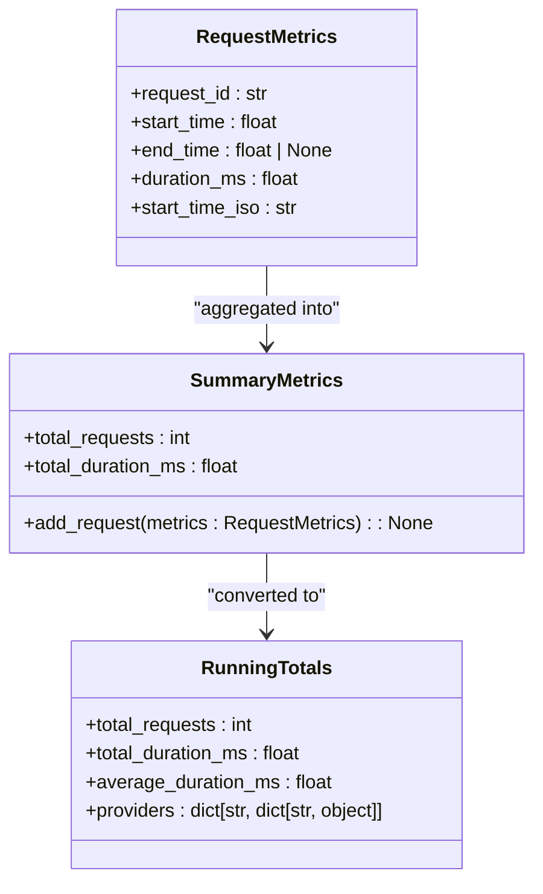
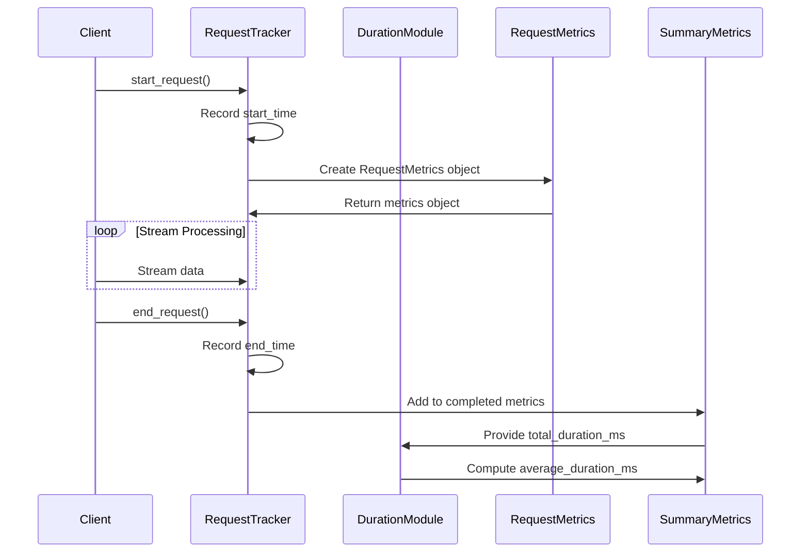
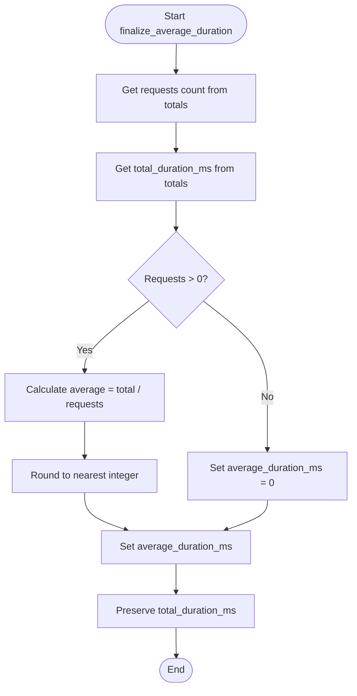
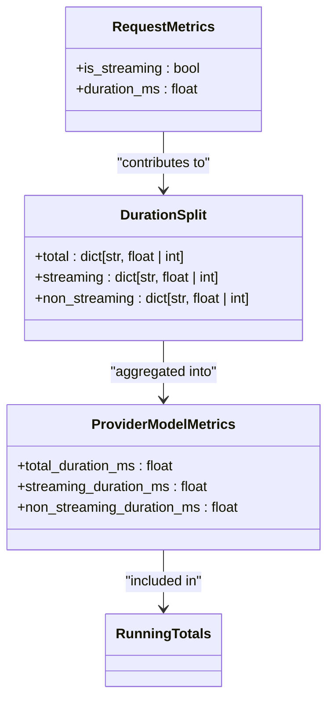
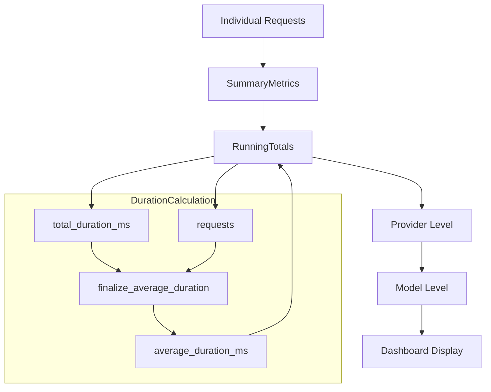
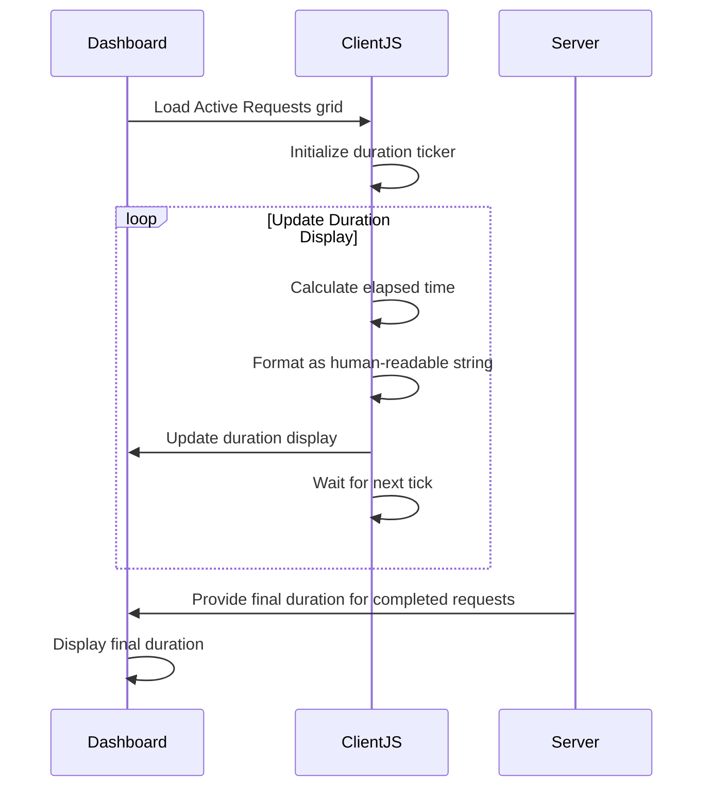

# Duration Calculations

<cite>
**Referenced Files in This Document**   
- [duration.py](file://src/core/metrics/calculations/duration.py)
- [request.py](file://src/core/metrics/models/request.py)
- [tracker.py](file://src/core/metrics/tracker/tracker.py)
- [hierarchical.py](file://src/core/metrics/calculations/hierarchical.py)
- [summary.py](file://src/core/metrics/models/summary.py)
- [streaming.py](file://src/api/services/streaming.py)
- [ag_grid/25-vdm-metrics-active-requests.js](file://assets/ag_grid/25-vdm-metrics-active-requests.js)
- [ag_grid/30-vdm-grid-init.js](file://assets/ag_grid/30-vdm-grid-init.js)
</cite>

## Table of Contents
1. [Introduction](#introduction)
2. [Duration Calculation Fundamentals](#duration-calculation-fundamentals)
3. [Core Components and Data Structures](#core-components-and-data-structures)
4. [Request Lifecycle and Timing Capture](#request-lifecycle-and-timing-capture)
5. [Average Duration Computation](#average-duration-computation)
6. [Streaming vs Non-Streaming Duration Tracking](#streaming-vs-non-streaming-duration-tracking)
7. [Hierarchical Metrics Aggregation](#hierarchical-metrics-aggregation)
8. [Real-Time Duration Updates in Dashboard](#real-time-duration-updates-in-dashboard)
9. [Edge Cases and Error Handling](#edge-cases-and-error-handling)
10. [Performance Monitoring and SLA Support](#performance-monitoring-and-sla-support)

## Introduction

The duration.py module is a critical component of the metrics system responsible for calculating and processing timing and latency measurements across the proxy infrastructure. This documentation provides a comprehensive analysis of how request duration, queue time, processing latency, and streaming intervals are computed and utilized for performance monitoring. The module works in conjunction with the metrics tracking system to capture timestamps at various stages of request processing and transform them into meaningful performance indicators that support both real-time monitoring and historical analysis.

The duration calculations are essential for SLA monitoring, performance optimization, and providing visibility into system behavior through the dashboard interface. By accurately measuring request processing times, the system enables operators to identify bottlenecks, track service level objectives, and optimize resource allocation.

## Duration Calculation Fundamentals

The duration.py module provides helper functions for computing duration metrics from raw timing data collected during request processing. The core functionality revolves around calculating average duration from total duration and request counts, while preserving both values for comprehensive analysis.

The module implements two primary functions for duration calculation:

- `finalize_average_duration`: Computes the average duration in milliseconds from the total duration and request count
- `finalize_split`: Applies average duration calculation across different request categories (total, streaming, non_streaming)

These functions operate on dictionary structures containing timing data and modify them in-place to include computed averages. The design intentionally retains both total and average duration values to provide flexibility in how the data is presented and analyzed in the dashboard.

**Section sources**
- [duration.py](file://src/core/metrics/calculations/duration.py#L6-L24)

## Core Components and Data Structures

The duration calculation system relies on several key data structures that capture timing information at different levels of granularity. The RequestMetrics class serves as the foundation for capturing individual request timing data, storing start and end timestamps as Unix timestamps.

The RequestMetrics class includes a duration_ms property that calculates the duration in milliseconds by subtracting the start time from the end time and multiplying by 1000. When the end time is not available (for active requests), the duration is returned as 0. This design allows for consistent duration calculations across both completed and in-flight requests.

Higher-level data structures like RunningTotals and SummaryMetrics aggregate duration data across multiple requests, providing the foundation for computing averages and totals at the provider and model levels.

**Diagram sources**
- [request.py](file://src/core/metrics/models/request.py#L9-L55)
- [summary.py](file://src/core/metrics/models/summary.py#L16-L219)

**Section sources**
- [request.py](file://src/core/metrics/models/request.py#L9-L55)
- [summary.py](file://src/core/metrics/models/summary.py#L16-L219)

## Request Lifecycle and Timing Capture

Timing capture begins when a request is registered with the RequestTracker through the start_request method, which records the current timestamp as the start_time. This timestamp is captured using time.time(), providing Unix timestamp precision for all duration calculations.

For streaming requests, duration tracking continues until the stream completes or terminates. The end_request method is called to finalize the request metrics, setting the end_time to the current timestamp. This method is invoked through the with_streaming_metrics_finalizer wrapper, which ensures metrics are properly finalized even if the stream encounters errors.

The RequestTracker maintains both active requests (in-flight) and completed requests (aggregated into summary metrics). For active requests, duration is calculated as the difference between the current time and the start time, providing real-time duration updates in the dashboard.

**Diagram sources**
- [tracker.py](file://src/core/metrics/tracker/tracker.py#L85-L180)
- [streaming.py](file://src/api/services/streaming.py#L47-L70)

**Section sources**
- [tracker.py](file://src/core/metrics/tracker/tracker.py#L85-L180)
- [streaming.py](file://src/api/services/streaming.py#L47-L70)

## Average Duration Computation

The finalize_average_duration function is the core of the duration calculation system, responsible for computing the average duration from the total duration and request count. The function takes a dictionary containing timing data and modifies it in-place to include the computed average.

The calculation follows a straightforward formula: average_duration_ms = total_duration_ms / requests. The result is rounded to the nearest integer and stored as average_duration_ms in the input dictionary. If there are no requests, the average is set to 0 to avoid division by zero errors.

A key design decision is to retain the total_duration_ms value alongside the computed average. This allows the dashboard to display both metrics, providing users with flexibility in how they interpret the data. The total duration is valuable for understanding overall system load, while the average provides insight into typical request performance.

**Diagram sources**
- [duration.py](file://src/core/metrics/calculations/duration.py#L6-L19)

**Section sources**
- [duration.py](file://src/core/metrics/calculations/duration.py#L6-L19)

## Streaming vs Non-Streaming Duration Tracking

The system differentiates between streaming and non-streaming requests in its duration tracking, providing separate metrics for each category. This distinction is crucial for performance analysis, as streaming requests typically have different latency characteristics and performance requirements than non-streaming requests.

The finalize_split function applies the average duration calculation across three categories: total, streaming, and non_streaming. This allows the system to provide granular insights into performance across different request types. The hierarchical data structure maintains separate counters for streaming and non_streaming requests, including their respective duration totals.

When a request is registered, the is_streaming flag is set based on the request type, and this flag determines which counters are updated when the request completes. This enables accurate tracking of duration metrics for each request category, supporting targeted optimization efforts.

**Diagram sources**
- [duration.py](file://src/core/metrics/calculations/duration.py#L22-L24)
- [hierarchical.py](file://src/core/metrics/calculations/hierarchical.py#L36-L53)
- [summary.py](file://src/core/metrics/models/summary.py#L76-L123)

**Section sources**
- [duration.py](file://src/core/metrics/calculations/duration.py#L22-L24)
- [hierarchical.py](file://src/core/metrics/calculations/hierarchical.py#L36-L53)

## Hierarchical Metrics Aggregation

The duration calculations are integrated into a hierarchical aggregation system that organizes metrics by provider and model. This structure enables detailed performance analysis at multiple levels, from overall system performance to individual model performance.

The RequestTracker aggregates completed requests into SummaryMetrics, which are then transformed into RunningTotals with a hierarchical provider -> models structure. The finalize_running_totals function processes this hierarchy, applying the duration calculations to each level.

At each level of the hierarchy, the system maintains separate counters for total, streaming, and non_streaming requests, ensuring that duration calculations are accurate for each category. The final output includes both total and average duration metrics at the provider, model, and system levels.

**Diagram sources**
- [hierarchical.py](file://src/core/metrics/calculations/hierarchical.py#L85-L124)
- [tracker.py](file://src/core/metrics/tracker/tracker.py#L329-L452)

**Section sources**
- [hierarchical.py](file://src/core/metrics/calculations/hierarchical.py#L85-L124)
- [tracker.py](file://src/core/metrics/tracker/tracker.py#L329-L452)

## Real-Time Duration Updates in Dashboard

The dashboard provides real-time updates of request durations for active requests, using client-side JavaScript to calculate elapsed time without requiring server round-trips. The Active Requests grid displays duration as a human-readable string (e.g., "12s", "3m 04s") that updates at a configurable interval.

The client-side implementation uses performance.now() for smooth elapsed time calculations, anchored to the system epoch time. This approach avoids the overhead of repeated server requests while providing accurate duration updates. The update frequency is configurable through UI controls or localStorage, with a default interval of 2 seconds.

For completed requests, the dashboard displays the final duration as calculated by the server, ensuring consistency between real-time monitoring and historical analysis.

**Diagram sources**
- [ag_grid/25-vdm-metrics-active-requests.js](file://assets/ag_grid/25-vdm-metrics-active-requests.js#L1-L34)
- [ag_grid/30-vdm-grid-init.js](file://assets/ag_grid/30-vdm-grid-init.js#L241-L378)

**Section sources**
- [ag_grid/25-vdm-metrics-active-requests.js](file://assets/ag_grid/25-vdm-metrics-active-requests.js#L1-L34)
- [ag_grid/30-vdm-grid-init.js](file://assets/ag_grid/30-vdm-grid-init.js#L241-L378)

## Edge Cases and Error Handling

The duration calculation system handles several edge cases to ensure robustness and accuracy. For active requests where the end_time is not yet available, the duration is calculated as 0 to prevent invalid calculations. This allows the system to provide meaningful metrics even for in-flight requests.

When requests fail or timeout, the system still captures duration information up to the point of failure. For streaming requests that encounter errors, the with_sse_error_handler wrapper ensures that the end_request method is called, allowing the duration to be recorded even in error scenarios.

The system also handles cases where request counts are zero, setting average duration to 0 rather than attempting division by zero. This prevents calculation errors and provides a consistent interface for consumers of the metrics data.

**Section sources**
- [request.py](file://src/core/metrics/models/request.py#L40-L43)
- [streaming.py](file://src/api/services/streaming.py#L127-L192)
- [duration.py](file://src/core/metrics/calculations/duration.py#L17-L18)

## Performance Monitoring and SLA Support

The duration calculations play a critical role in performance monitoring and SLA tracking. By providing accurate measurements of request processing times, the system enables operators to monitor compliance with service level objectives and identify performance degradation.

The dashboard displays key duration metrics including average duration, total duration, and separate averages for streaming and non-streaming requests. These metrics are updated in real-time, allowing for immediate detection of performance issues.

Historical analysis is supported through the aggregation of duration data over time, enabling trend analysis and capacity planning. The retention of both total and average duration values provides flexibility in how the data is analyzed, supporting both aggregate views and detailed investigations.

The precision of duration measurements (in milliseconds) ensures that even small performance changes can be detected, making the system suitable for monitoring high-performance services with strict latency requirements.

**Section sources**
- [dashboard/components/metrics.py](file://src/dashboard/components/metrics.py#L29-L58)
- [summary.py](file://src/core/metrics/models/summary.py#L125-L198)
- [tracker.py](file://src/core/metrics/tracker/tracker.py#L456-L458)