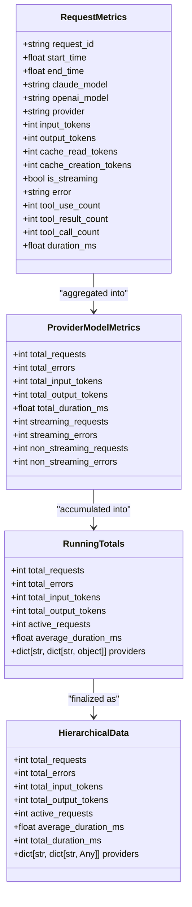
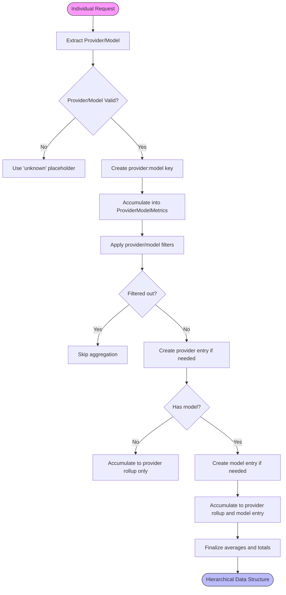
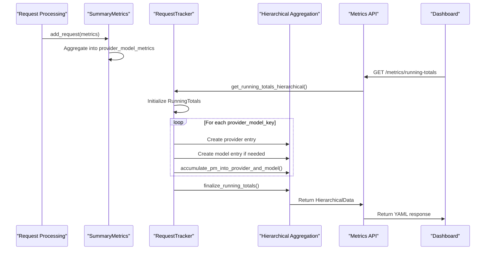

# Hierarchical Aggregation

<cite>
**Referenced Files in This Document**   
- [hierarchical.py](file://src/core/metrics/calculations/hierarchical.py)
- [provider.py](file://src/core/metrics/models/provider.py)
- [request.py](file://src/core/metrics/models/request.py)
- [summary.py](file://src/core/metrics/models/summary.py)
- [accumulation.py](file://src/core/metrics/calculations/accumulation.py)
- [duration.py](file://src/core/metrics/calculations/duration.py)
- [types.py](file://src/core/metrics/types.py)
- [tracker.py](file://src/core/metrics/tracker/tracker.py)
- [metrics.py](file://src/api/metrics.py)
- [data_sources.py](file://src/dashboard/data_sources.py)
- [transformers.py](file://src/dashboard/ag_grid/transformers.py)
- [normalize.py](file://src/dashboard/normalize.py)
</cite>

## Table of Contents
1. [Introduction](#introduction)
2. [Core Data Structures](#core-data-structures)
3. [Hierarchical Aggregation Process](#hierarchical-aggregation-process)
4. [Data Flow and Transformation](#data-flow-and-transformation)
5. [Dashboard Integration](#dashboard-integration)
6. [Memory Efficiency and Garbage Collection](#memory-efficiency-and-garbage-collection)
7. [Performance Analysis and Optimization](#performance-analysis-and-optimization)
8. [Conclusion](#conclusion)

## Introduction

The hierarchical aggregation system in the Vandamme proxy provides a structured approach to metrics collection and presentation, enabling both high-level overviews and detailed analysis of provider and model performance. This documentation explains the implementation of the hierarchical.py module that transforms flat request metrics into structured hierarchies suitable for dashboard drill-down views.

The system is designed to support the dashboard's ability to display top models and provider performance comparisons by organizing metrics in a provider-to-model breakdown structure. This hierarchical approach allows users to analyze overall system performance while also drilling down into specific provider and model metrics.

**Section sources**
- [hierarchical.py](file://src/core/metrics/calculations/hierarchical.py#L1-L125)

## Core Data Structures

The hierarchical aggregation system relies on several key data structures that define the metrics model and aggregation hierarchy. These structures enable the transformation of individual request data into structured summaries at multiple levels.

The `RequestMetrics` class captures metrics for individual requests, including request identifiers, timing information, token usage, and error details. This flat structure serves as the input to the aggregation process.

The `ProviderModelMetrics` class represents aggregated metrics for specific provider-model combinations, tracking both total counts and streaming vs. non-streaming splits across various metrics including requests, errors, tokens, and duration.

The `RunningTotals` class serves as the output container for hierarchical metrics, maintaining a dictionary of providers with their associated rollup data and model entries. This structure enables the multi-level view required by the dashboard.



**Diagram sources**
- [request.py](file://src/core/metrics/models/request.py#L9-L56)
- [provider.py](file://src/core/metrics/models/provider.py#L11-L47)
- [summary.py](file://src/core/metrics/models/summary.py#L202-L219)
- [types.py](file://src/core/metrics/types.py#L14-L32)

**Section sources**
- [request.py](file://src/core/metrics/models/request.py#L9-L56)
- [provider.py](file://src/core/metrics/models/provider.py#L11-L47)
- [summary.py](file://src/core/metrics/models/summary.py#L202-L219)
- [types.py](file://src/core/metrics/types.py#L14-L32)

## Hierarchical Aggregation Process

The hierarchical aggregation process transforms flat request metrics into structured hierarchies through a multi-step accumulation and rollup process. The core function `accumulate_pm_into_provider_and_model` serves as the primary mechanism for transforming provider-model metrics into the hierarchical structure consumed by the dashboard.

This function takes provider and model entries from the hierarchical structure and accumulates metrics from a `ProviderModelMetrics` instance into both the provider rollup and model-specific entries. The accumulation process handles both total metrics and streaming/non-streaming splits, ensuring that the hierarchical structure maintains detailed performance characteristics.

The aggregation process begins with individual request metrics being accumulated into `ProviderModelMetrics` instances within the `SummaryMetrics` class. These flat aggregations are then transformed into the hierarchical provider-model structure through the `get_running_totals_hierarchical` method in the `RequestTracker` class.



**Diagram sources**
- [hierarchical.py](file://src/core/metrics/calculations/hierarchical.py#L56-L68)
- [tracker.py](file://src/core/metrics/tracker/tracker.py#L315-L452)

**Section sources**
- [hierarchical.py](file://src/core/metrics/calculations/hierarchical.py#L56-L68)
- [tracker.py](file://src/core/metrics/tracker/tracker.py#L315-L452)

## Data Flow and Transformation

The data flow for hierarchical aggregation follows a well-defined path from individual request processing to dashboard presentation. This section details the transformation process that converts raw request data into structured hierarchical metrics.

When a request is processed, its metrics are captured in a `RequestMetrics` instance. Upon completion, these metrics are added to the `SummaryMetrics` accumulator, which maintains a flat structure of provider-model metrics. This accumulation occurs in the `add_request` method, which extracts the provider and resolved model name to create a canonical key for aggregation.

The transformation to hierarchical structure occurs when the dashboard requests metrics data. The `get_running_totals_hierarchical` method in `RequestTracker` orchestrates this transformation, iterating through the flat provider-model metrics and building the hierarchical structure. For each provider-model combination, it creates or retrieves the appropriate provider entry and model entry, then uses `accumulate_pm_into_provider_and_model` to populate the hierarchical data.

The final step involves finalizing the hierarchical data by computing averages and ensuring all metrics are properly formatted. The `finalize_running_totals` function processes the hierarchical structure, calculating average durations and summing provider rollups into the overall totals.



**Diagram sources**
- [summary.py](file://src/core/metrics/models/summary.py#L43-L124)
- [tracker.py](file://src/core/metrics/tracker/tracker.py#L315-L452)
- [hierarchical.py](file://src/core/metrics/calculations/hierarchical.py#L56-L68)
- [metrics.py](file://src/api/metrics.py#L176-L263)

**Section sources**
- [summary.py](file://src/core/metrics/models/summary.py#L43-L124)
- [tracker.py](file://src/core/metrics/tracker/tracker.py#L315-L452)
- [hierarchical.py](file://src/core/metrics/calculations/hierarchical.py#L56-L68)
- [metrics.py](file://src/api/metrics.py#L176-L263)

## Dashboard Integration

The hierarchical aggregation system is tightly integrated with the dashboard to provide comprehensive metrics visualization. The dashboard consumes the hierarchical data structure to display provider and model performance metrics in various views, including provider breakdown, model breakdown, and active requests monitoring.

The integration occurs through the `/metrics/running-totals` API endpoint, which returns the hierarchical data in YAML format. The dashboard's metrics service fetches this data and transforms it into components for display. The `build_metrics_view` function orchestrates this process, creating view fragments for token charts, active requests, and provider/model breakdowns.

The dashboard uses AG-Grid components to display the hierarchical data in tabular form, with separate grids for providers and models. The `metrics_providers_row_data` and `metrics_models_row_data` functions transform the hierarchical data into row data suitable for AG-Grid, applying formatting and calculations such as error rates and duration formatting.

```mermaid
graph TB
subgraph "Dashboard"
A[Metrics View]
B[Token Chart]
C[Active Requests]
D[Provider Breakdown]
E[Model Breakdown]
end
subgraph "API Layer"
F[/metrics/running-totals]
G[/metrics/active-requests]
end
subgraph "Aggregation System"
H[RequestTracker]
I[RunningTotals]
J[HierarchicalData]
end
A --> B
A --> C
A --> D
A --> E
F --> A
G --> C
H --> I
I --> J
J --> F
H --> G
style A fill:#f9f,stroke:#333
style F fill:#bbf,stroke:#333
style H fill:#f96,stroke:#333
```

**Diagram sources**
- [data_sources.py](file://src/dashboard/data_sources.py#L67-L96)
- [metrics.py](file://src/dashboard/services/metrics.py#L34-L66)
- [transformers.py](file://src/dashboard/ag_grid/transformers.py#L237-L334)
- [normalize.py](file://src/dashboard/normalize.py#L107-L169)

**Section sources**
- [data_sources.py](file://src/dashboard/data_sources.py#L67-L96)
- [metrics.py](file://src/dashboard/services/metrics.py#L34-L66)
- [transformers.py](file://src/dashboard/ag_grid/transformers.py#L237-L334)
- [normalize.py](file://src/dashboard/normalize.py#L107-L169)

## Memory Efficiency and Garbage Collection

The hierarchical aggregation system incorporates several strategies to ensure memory efficiency and manage stale entries. The system is designed to handle potentially large numbers of providers and models while maintaining performance and preventing memory leaks.

The primary mechanism for memory efficiency is the use of dictionaries with provider and model names as keys, which provides O(1) lookup and insertion performance. The hierarchical structure is built on-demand when metrics are requested, rather than being maintained continuously, reducing memory overhead.

For garbage collection of stale entries, the system relies on the natural lifecycle of provider and model usage. Providers and models that are no longer accessed will remain in the structure but will not consume significant resources. The system does not implement automatic cleanup of stale entries, as the memory cost of retaining unused provider and model entries is minimal compared to the complexity of tracking and removing them.

The `last_accessed` timestamps maintained for providers and models could potentially be used for garbage collection, but this functionality is not currently implemented. Instead, the system focuses on efficient data structures and on-demand aggregation to minimize memory usage.

**Section sources**
- [hierarchical.py](file://src/core/metrics/calculations/hierarchical.py#L28-L33)
- [tracker.py](file://src/core/metrics/tracker/tracker.py#L292-L313)
- [summary.py](file://src/core/metrics/models/summary.py#L37-L41)

## Performance Analysis and Optimization

The hierarchical aggregation system is designed with performance considerations in mind, particularly for high-throughput scenarios where numerous requests are processed simultaneously. The system employs several optimization strategies to ensure efficient metrics aggregation and reporting.

The aggregation process is optimized by separating the accumulation of completed requests from the transformation to hierarchical structure. Completed requests are accumulated in a flat structure (`SummaryMetrics`) with O(1) operations, while the hierarchical transformation is performed only when requested by the dashboard. This approach minimizes the performance impact on request processing.

The use of dictionaries for provider and model entries ensures O(1) lookup and insertion performance, making the aggregation process scalable with the number of unique providers and models. The system avoids expensive operations like sorting during the aggregation phase, deferring such operations to the presentation layer when necessary.

For high-frequency metrics updates, the system could be further optimized by implementing batch processing of request completions or by using more specialized data structures for high-cardinality provider-model combinations. However, the current implementation strikes a balance between performance, memory usage, and code complexity.

**Section sources**
- [summary.py](file://src/core/metrics/models/summary.py#L43-L124)
- [hierarchical.py](file://src/core/metrics/calculations/hierarchical.py#L56-L68)
- [tracker.py](file://src/core/metrics/tracker/tracker.py#L315-L452)

## Conclusion

The hierarchical aggregation system in the Vandamme proxy provides a robust and efficient mechanism for transforming flat request metrics into structured hierarchies suitable for dashboard drill-down views. By organizing metrics in a provider-to-model breakdown structure, the system enables both high-level overviews and detailed analysis of provider and model performance.

The implementation leverages well-defined data structures and a clear transformation process to ensure reliable metrics aggregation. The separation of accumulation and hierarchical transformation optimizes performance, while the integration with the dashboard provides comprehensive visualization capabilities.

The system supports the dashboard's ability to display top models and provider performance comparisons through its hierarchical approach, allowing users to analyze overall system performance while also drilling down into specific provider and model metrics. This multi-level view is essential for monitoring and optimizing the proxy's performance across various providers and models.

While the current implementation focuses on functionality and correctness, potential optimizations could include more aggressive garbage collection of stale entries or enhanced batching for high-throughput scenarios. However, the existing design provides a solid foundation for metrics aggregation that balances performance, memory usage, and maintainability.