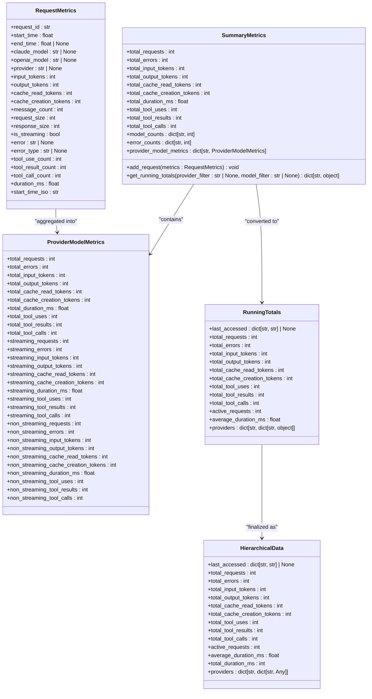
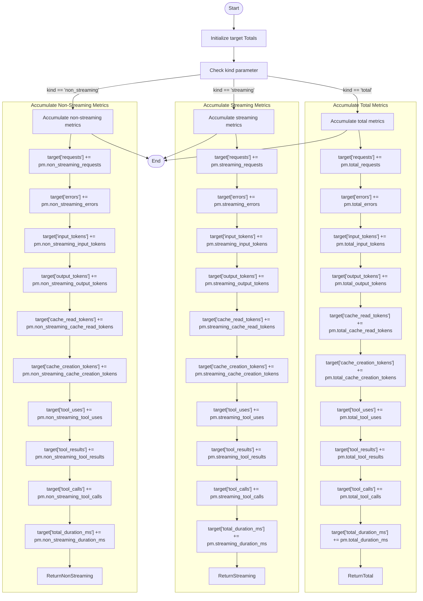
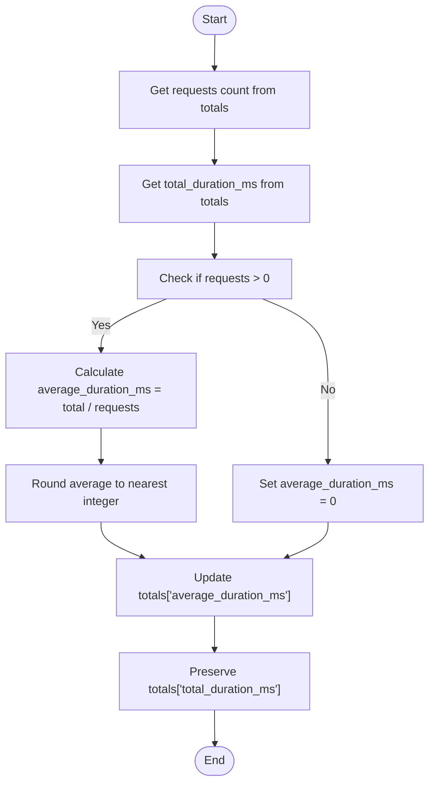
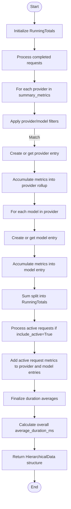
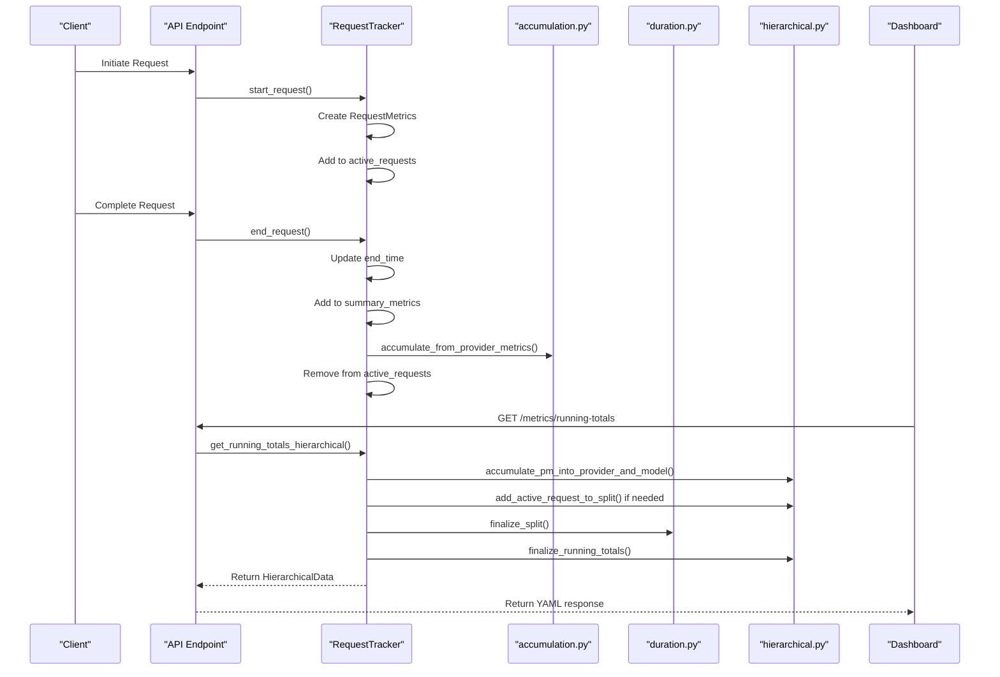
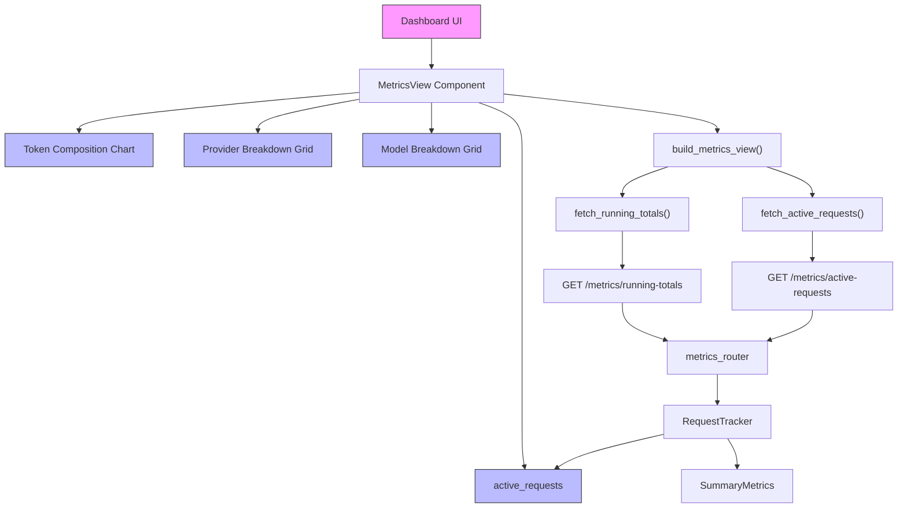

# Metrics Calculations

<cite>
**Referenced Files in This Document**   
- [accumulation.py](file://src/core/metrics/calculations/accumulation.py)
- [duration.py](file://src/core/metrics/calculations/duration.py)
- [hierarchical.py](file://src/core/metrics/calculations/hierarchical.py)
- [provider.py](file://src/core/metrics/models/provider.py)
- [request.py](file://src/core/metrics/models/request.py)
- [summary.py](file://src/core/metrics/models/summary.py)
- [types.py](file://src/core/metrics/types.py)
- [tracker.py](file://src/core/metrics/tracker/tracker.py)
- [metrics.py](file://src/api/metrics.py)
- [data_sources.py](file://src/dashboard/data_sources.py)
</cite>

## Table of Contents
1. [Introduction](#introduction)
2. [Core Metrics Data Structures](#core-metrics-data-structures)
3. [Accumulation Module](#accumulation-module)
4. [Duration Module](#duration-module)
5. [Hierarchical Module](#hierarchical-module)
6. [Metrics Processing Pipeline](#metrics-processing-pipeline)
7. [Performance Considerations](#performance-considerations)
8. [Dashboard Integration](#dashboard-integration)
9. [Conclusion](#conclusion)

## Introduction

The metrics calculation system in the Vandamme Proxy provides a comprehensive framework for aggregating, processing, and reporting API request metrics. This system transforms raw request data into structured, hierarchical summaries suitable for dashboard display and operational analysis. The core functionality is organized into three primary modules: accumulation, duration, and hierarchical, each responsible for specific aspects of metric processing.

The system is designed to support efficient roll-up reporting and real-time updates, handling high-frequency metric processing while maintaining accuracy during aggregation. Metrics are collected at the request level and aggregated into provider-model hierarchies, enabling detailed analysis of usage patterns, performance characteristics, and error rates across different providers and models.

This documentation details the architecture and implementation of the metrics calculation system, focusing on the key modules that provide functions for aggregating ProviderModelMetrics into various target structures, handling timing and latency calculations, and implementing the provider-to-model breakdown.

## Core Metrics Data Structures

The metrics system is built around several key data structures that define the shape of metrics at different processing stages. These structures provide type safety and clear contracts between different components of the system.

**Diagram sources**
- [provider.py](file://src/core/metrics/models/provider.py#L1-L47)
- [request.py](file://src/core/metrics/models/request.py#L1-L56)
- [summary.py](file://src/core/metrics/models/summary.py#L1-L219)
- [types.py](file://src/core/metrics/types.py#L1-L32)

**Section sources**
- [provider.py](file://src/core/metrics/models/provider.py#L1-L47)
- [request.py](file://src/core/metrics/models/request.py#L1-L56)
- [summary.py](file://src/core/metrics/models/summary.py#L1-L219)
- [types.py](file://src/core/metrics/types.py#L1-L32)

## Accumulation Module

The accumulation module provides pure functions for aggregating ProviderModelMetrics into various target structures without maintaining any state. These functions are designed to be testable in isolation and form the foundation of the metrics aggregation system.

The module defines two primary data structures: `Totals` and `Split`. The `Totals` type represents a dictionary of metric values (float or int) with keys for different metrics like requests, errors, input_tokens, etc. The `Split` type represents a dictionary with three sections: "total", "streaming", and "non_streaming", each containing a `Totals` dictionary. This structure allows for separate tracking of metrics for streaming and non-streaming requests while maintaining an overall total.

The module provides several key functions:

- `new_metric_totals()`: Creates a new `Totals` dictionary initialized with zero values for all metrics.
- `new_streaming_split()`: Creates a new `Split` dictionary with three sections, each initialized with zero values.
- `accumulate_from_provider_metrics()`: The core accumulation function that takes a target `Totals` dictionary, a `ProviderModelMetrics` object, and a `kind` parameter ("total", "streaming", or "non_streaming"). It adds the appropriate metrics from the `ProviderModelMetrics` object to the target dictionary based on the specified kind.

The accumulation functions handle all the standard metrics including request counts, error counts, token usage (input, output, cache read, and cache creation), tool usage statistics, and duration. The functions are designed to be composable, allowing higher-level functions to build more complex aggregation structures by combining these basic operations.

**Diagram sources**
- [accumulation.py](file://src/core/metrics/calculations/accumulation.py#L1-L84)

**Section sources**
- [accumulation.py](file://src/core/metrics/calculations/accumulation.py#L1-L84)

## Duration Module

The duration module provides functions for calculating average durations from total duration metrics. This separation of concerns allows the system to maintain both total and average duration values, providing flexibility for different use cases in the dashboard and reporting.

The module contains two primary functions:

- `finalize_average_duration()`: This function computes the `average_duration_ms` from the `total_duration_ms` and `requests` count in a `Totals` dictionary. It intentionally retains the `total_duration_ms` value so that the dashboard can display both average and total duration metrics. The function handles the edge case where there are zero requests by setting the average duration to zero.

- `finalize_split()`: This function applies `finalize_average_duration()` to each section ("total", "streaming", "non_streaming") of a `Split` dictionary. This allows for the calculation of average durations at different levels of granularity, providing insights into performance differences between streaming and non-streaming requests.

The duration calculations are performed as a final step in the metrics processing pipeline, after all accumulation has been completed. This ensures that the average duration is calculated based on the complete set of aggregated data, maintaining accuracy even when metrics are processed in batches or across multiple requests.

**Diagram sources**
- [duration.py](file://src/core/metrics/calculations/duration.py#L1-L25)

**Section sources**
- [duration.py](file://src/core/metrics/calculations/duration.py#L1-L25)

## Hierarchical Module

The hierarchical module implements the provider-to-model breakdown functionality, building the hierarchical data structure consumed by the YAML formatter and dashboard. This module orchestrates the various accumulation and duration functions to create a comprehensive view of metrics organized by provider and model.

The module provides several key functions:

- `matches_pattern()`: A case-insensitive wildcard matcher that supports * and ? wildcards, used for filtering providers and models.
- `new_provider_entry()`: Creates a new provider entry with last accessed timestamp and initialized rollup and models structures.
- `new_model_entry()`: Creates a new model entry with last accessed timestamp and initialized metrics.
- `add_active_request_to_split()`: Adds metrics from an active (in-flight) request to a split structure, handling both total and streaming/non-streaming categorization.
- `accumulate_pm_into_provider_and_model()`: The core function that accumulates ProviderModelMetrics into both provider rollup and model-specific entries, maintaining consistency between the two views.
- `sum_split_into_running_totals()`: Sums metrics from a split structure into a RunningTotals object.
- `finalize_running_totals()`: The final processing step that computes averages, sums metrics, and returns the HierarchicalData structure expected by the API.

The hierarchical processing follows a specific sequence: completed requests are aggregated into SummaryMetrics, which are then transformed into a hierarchical provider-model structure. Active requests are then added to this structure if requested. Finally, duration averages are calculated and the data is formatted for output.

**Diagram sources**
- [hierarchical.py](file://src/core/metrics/calculations/hierarchical.py#L1-L125)

**Section sources**
- [hierarchical.py](file://src/core/metrics/calculations/hierarchical.py#L1-L125)

## Metrics Processing Pipeline

The metrics processing pipeline integrates the various modules into a cohesive system that handles the complete lifecycle of metrics from collection to reporting. The pipeline is orchestrated by the RequestTracker class, which manages the state and coordinates the processing steps.

The pipeline begins when a request is initiated, at which point the RequestTracker creates a RequestMetrics object and adds it to the active requests collection. As the request progresses, metrics are updated in real-time. When the request completes, the metrics are aggregated into the SummaryMetrics object, which maintains counts and totals for completed requests.

Periodically, the system generates hierarchical summaries by combining the completed request metrics with the current active requests (if requested). This process involves several steps:

1. **Filtering**: Apply provider and model filters if specified in the request.
2. **Provider Rollup**: For each provider, create a rollup entry containing total, streaming, and non-streaming metrics.
3. **Model Breakdown**: For each model within a provider, create a model entry with its own metrics breakdown.
4. **Active Requests**: If requested, include metrics from currently active requests in the summary.
5. **Duration Calculation**: Compute average durations for all metric categories.
6. **Finalization**: Format the data as HierarchicalData for API output.

The pipeline is designed to be efficient, with minimal locking and atomic operations to ensure thread safety in a concurrent environment. The use of pure functions in the accumulation and duration modules allows for easy testing and verification of the core logic.

**Diagram sources**
- [tracker.py](file://src/core/metrics/tracker/tracker.py#L1-L490)
- [metrics.py](file://src/api/metrics.py#L1-L263)
- [data_sources.py](file://src/dashboard/data_sources.py#L1-L362)

**Section sources**
- [tracker.py](file://src/core/metrics/tracker/tracker.py#L1-L490)
- [metrics.py](file://src/api/metrics.py#L1-L263)
- [data_sources.py](file://src/dashboard/data_sources.py#L1-L362)

## Performance Considerations

The metrics calculation system is designed with performance in mind, particularly for high-frequency metric processing. Several strategies are employed to maintain efficiency while ensuring accuracy during aggregation.

The system uses a process-local, in-memory storage model for metrics, which provides fast access and updates without the overhead of external storage systems. This design choice means that metrics are per-process and reset on restart, which matches the existing behavior of the application.

To minimize contention in concurrent environments, the RequestTracker uses asyncio.Lock to protect critical sections, ensuring thread safety during metric updates. The lock is held for the minimum necessary duration, typically only during the update of shared data structures.

The accumulation functions are designed to be pure and stateless, allowing them to be easily tested and optimized. This functional approach also enables potential future optimizations such as parallel processing of independent aggregation operations.

For high-frequency scenarios, the system includes a summary interval configuration that controls how often summary logs are emitted. This prevents excessive logging while still providing regular visibility into request patterns.

The hierarchical processing is optimized to minimize redundant calculations. For example, the system reuses provider and model entries when possible, avoiding the creation of duplicate structures. The filtering is applied early in the processing pipeline to reduce the amount of data that needs to be processed.

Memory usage is managed through the use of bounded collections for recent errors and traces, preventing unbounded growth over time. The active requests collection is also kept in sync with the actual state of requests, with entries removed as requests complete.

```mermaid
flowchart TD
Performance["Performance Considerations"]
Performance --> Memory["Memory Efficiency"]
Memory --> ProcessLocal["Process-local in-memory storage"]
Memory --> BoundedCollections["Bounded collections for errors/traces"]
Memory --> EntryReuse["Reuse provider/model entries"]
Performance --> Concurrency["Concurrency"]
Concurrency --> AsyncioLock["asyncio.Lock for critical sections"]
Concurrency --> MinimalLocking["Minimal lock duration"]
Concurrency --> AtomicOperations["Atomic operations where possible"]
Performance --> Processing["Processing Efficiency"]
Processing --> PureFunctions["Pure functions for accumulation"]
Processing --> EarlyFiltering["Early filtering to reduce processing"]
Processing --> OptimizedDataStructures["Optimized data structures"]
Performance --> Logging["Logging Strategy"]
Logging --> SummaryInterval["Configurable summary interval"]
Logging --> NoRedundantLogging["Avoid redundant logging"]
Logging --> ConditionalLogging["Conditional logging based on metrics"]
```

**Diagram sources**
- [tracker.py](file://src/core/metrics/tracker/tracker.py#L1-L490)
- [accumulation.py](file://src/core/metrics/calculations/accumulation.py#L1-L84)

**Section sources**
- [tracker.py](file://src/core/metrics/tracker/tracker.py#L1-L490)
- [accumulation.py](file://src/core/metrics/calculations/accumulation.py#L1-L84)

## Dashboard Integration

The metrics calculation system is tightly integrated with the dashboard, providing the data needed for real-time monitoring and analysis. The integration is facilitated through API endpoints that expose the hierarchical metrics data in a format suitable for dashboard consumption.

The primary integration points are:

- **/metrics/running-totals**: Returns hierarchical provider-model metrics in YAML format, supporting optional filtering by provider and model. This endpoint is used for the main metrics dashboard views.
- **/metrics/active-requests**: Provides a snapshot of currently active (in-flight) requests, enabling real-time monitoring of ongoing activity.
- **/metrics/active-requests/stream**: A Server-Sent Events (SSE) stream that pushes updates when active requests change, enabling real-time updates in the dashboard without polling.
- **/metrics/logs**: Returns recent errors and request traces for debugging and analysis.

The dashboard services consume these endpoints and transform the data into visual components such as grids, charts, and tables. The hierarchical structure of the metrics data naturally maps to the dashboard's provider-model breakdown, allowing for intuitive navigation and analysis.

The integration supports filtering and searching, allowing users to focus on specific providers or models of interest. Wildcard patterns (* and ?) are supported in the filtering parameters, providing flexible search capabilities.

**Diagram sources**
- [metrics.py](file://src/api/metrics.py#L1-L263)
- [data_sources.py](file://src/dashboard/data_sources.py#L1-L362)
- [metrics.py](file://src/dashboard/services/metrics.py#L1-L67)

**Section sources**
- [metrics.py](file://src/api/metrics.py#L1-L263)
- [data_sources.py](file://src/dashboard/data_sources.py#L1-L362)
- [metrics.py](file://src/dashboard/services/metrics.py#L1-L67)

## Conclusion

The metrics calculation system in the Vandamme Proxy provides a robust and efficient framework for collecting, aggregating, and reporting API request metrics. By separating concerns into distinct modules—accumulation, duration, and hierarchical—the system achieves a clean architecture that is both maintainable and extensible.

The design supports efficient roll-up reporting and real-time updates, handling high-frequency metric processing while maintaining accuracy during aggregation. The use of pure functions in the core modules enables thorough testing and verification of the logic, while the hierarchical structure provides a natural organization for the data that aligns with the dashboard's requirements.

Key strengths of the system include its performance optimizations for high-frequency scenarios, its flexible filtering capabilities, and its seamless integration with the dashboard through well-defined API endpoints. The system strikes a balance between comprehensive metric collection and operational efficiency, providing valuable insights into API usage patterns and performance characteristics without introducing significant overhead.

Future enhancements could include support for persistent storage of metrics across restarts, more sophisticated aggregation strategies for long-term data retention, and additional visualization options in the dashboard to support deeper analysis of the collected metrics.