# Metrics Collection

<cite>
**Referenced Files in This Document**   
- [request.py](file://src/core/metrics/models/request.py)
- [provider.py](file://src/core/metrics/models/provider.py)
- [summary.py](file://src/core/metrics/models/summary.py)
- [accumulation.py](file://src/core/metrics/calculations/accumulation.py)
- [duration.py](file://src/core/metrics/calculations/duration.py)
- [hierarchical.py](file://src/core/metrics/calculations/hierarchical.py)
- [tracker.py](file://src/core/metrics/tracker/tracker.py)
- [factory.py](file://src/core/metrics/tracker/factory.py)
- [runtime.py](file://src/core/metrics/runtime.py)
- [types.py](file://src/core/metrics/types.py)
- [metrics.py](file://src/api/metrics.py)
- [streaming.py](file://src/api/services/streaming.py)
</cite>

## Table of Contents
1. [Introduction](#introduction)
2. [Core Metrics Models](#core-metrics-models)
3. [Metrics Aggregation and Calculation](#metrics-aggregation-and-calculation)
4. [Hierarchical Metrics and Roll-up Reporting](#hierarchical-metrics-and-roll-up-reporting)
5. [API Integration and Endpoint Instrumentation](#api-integration-and-endpoint-instrumentation)
6. [Performance Considerations and Optimization](#performance-considerations-and-optimization)
7. [Extending the Metrics System](#extending-the-metrics-system)
8. [Conclusion](#conclusion)

## Introduction

The metrics collection system in the Vandamme proxy provides comprehensive monitoring of API request performance, usage, and error patterns. It tracks key metrics including request volume, token usage, latency, and error rates across different providers and models. The system is designed to capture granular data at the request level while enabling efficient aggregation and roll-up reporting through hierarchical structures. This documentation details the architecture, implementation, and integration of the metrics system, providing guidance for understanding and extending its capabilities.

## Core Metrics Models

The metrics system is built around three primary data models that capture different levels of granularity: Request, Provider, and Summary metrics. These models work together to provide a complete picture of API usage patterns and performance characteristics.

### Request Metrics Model

The `RequestMetrics` class in `src/core/metrics/models/request.py` captures detailed information about individual API requests. Each request is tracked with a unique identifier and comprehensive metadata including timing, token usage, and error information.

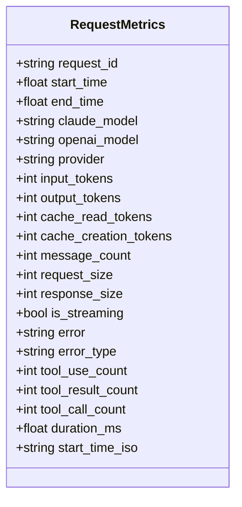

**Diagram sources**
- [request.py](file://src/core/metrics/models/request.py)

**Section sources**
- [request.py](file://src/core/metrics/models/request.py)

### Provider Metrics Model

The `ProviderModelMetrics` class in `src/core/metrics/models/provider.py` aggregates metrics at the provider-model level, maintaining separate counters for streaming and non-streaming requests. This allows for detailed analysis of performance differences between streaming and non-streaming operations.

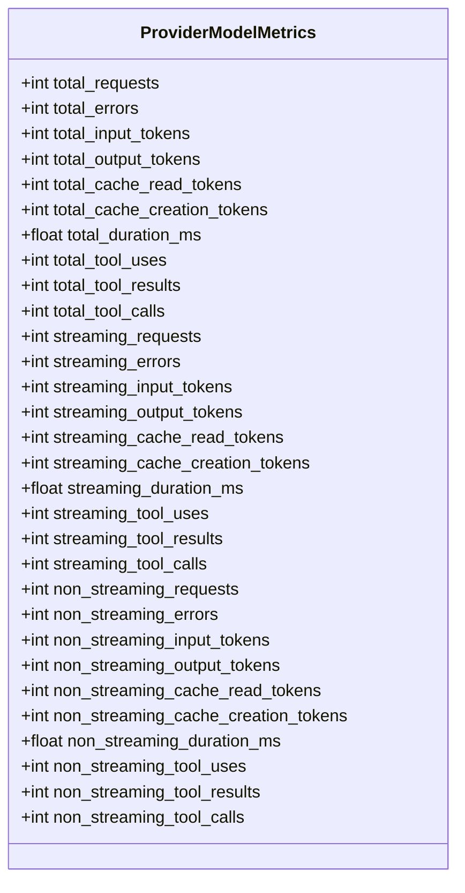

**Diagram sources**
- [provider.py](file://src/core/metrics/models/provider.py)

**Section sources**
- [provider.py](file://src/core/metrics/models/provider.py)

### Summary Metrics Model

The `SummaryMetrics` class in `src/core/metrics/models/summary.py` serves as the central aggregation point for completed requests. It maintains overall totals while also tracking distributions across models and providers, enabling comprehensive analysis of usage patterns.

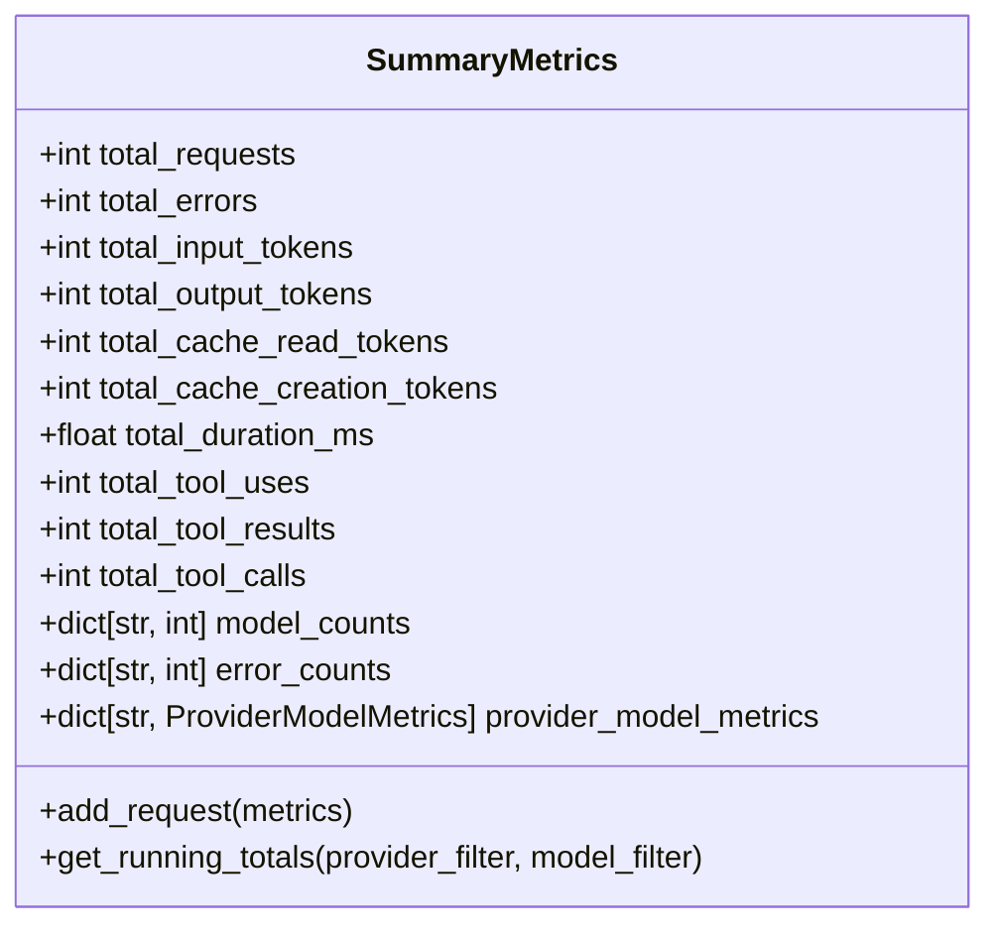

**Diagram sources**
- [summary.py](file://src/core/metrics/models/summary.py)

**Section sources**
- [summary.py](file://src/core/metrics/models/summary.py)

## Metrics Aggregation and Calculation

The metrics system employs a modular approach to aggregation and calculation, with dedicated modules handling different aspects of metric processing. This separation of concerns enables efficient, testable, and maintainable code.

### Accumulation Logic

The `accumulation.py` module provides pure functions for accumulating metrics from provider-level data into totals dictionaries. These functions are stateless and can be tested in isolation, ensuring reliability and predictability.

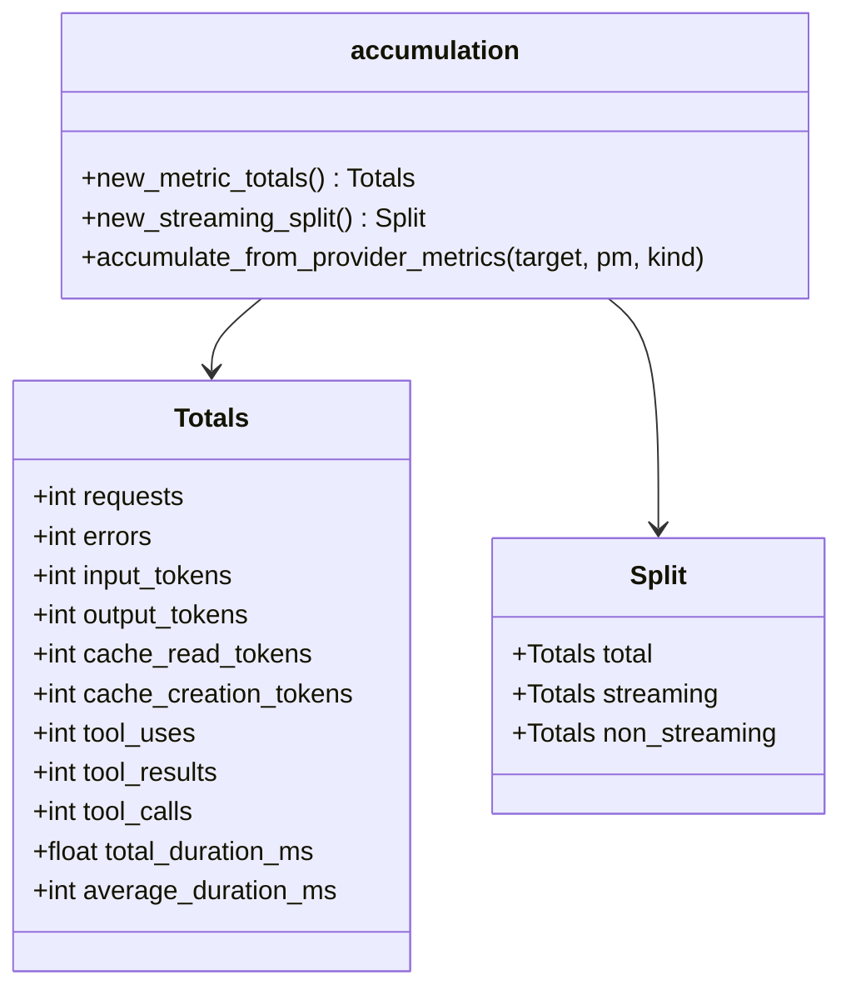

**Diagram sources**
- [accumulation.py](file://src/core/metrics/calculations/accumulation.py)

**Section sources**
- [accumulation.py](file://src/core/metrics/calculations/accumulation.py)

### Duration Calculation

The `duration.py` module handles the calculation of average duration metrics from raw timing data. It ensures that average duration is computed correctly based on total duration and request count, with appropriate handling of edge cases.

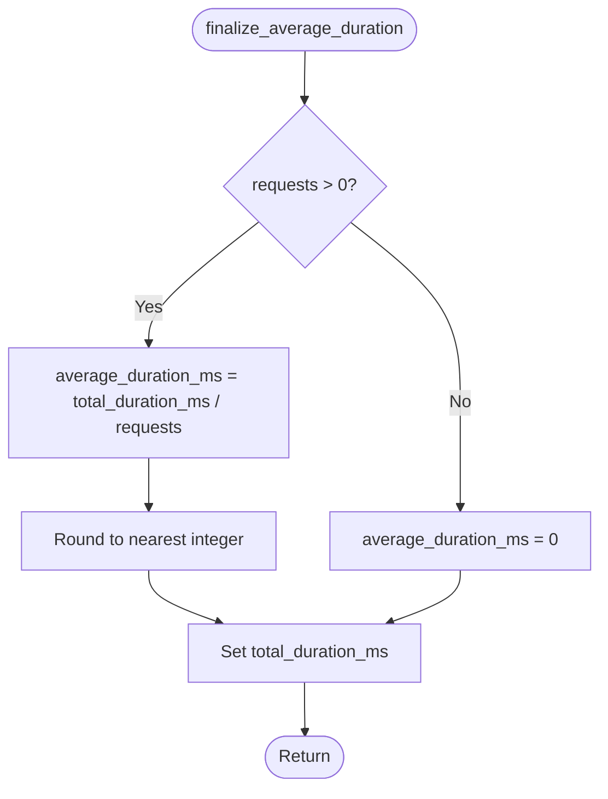

**Diagram sources**
- [duration.py](file://src/core/metrics/calculations/duration.py)

**Section sources**
- [duration.py](file://src/core/metrics/calculations/duration.py)

## Hierarchical Metrics and Roll-up Reporting

The hierarchical metrics system enables multi-dimensional analysis of usage patterns by organizing data in a provider → models structure. This allows for both detailed and aggregated views of metrics across different dimensions.

### Hierarchical Data Structure

The `hierarchical.py` module implements the logic for building hierarchical rollups from provider and model metrics. It supports filtering by provider and model patterns, enabling flexible reporting capabilities.

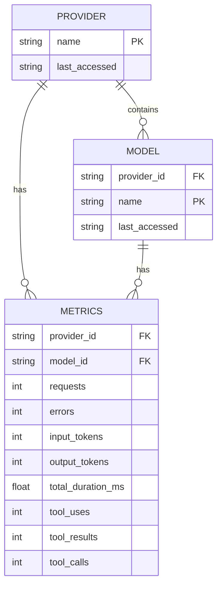

**Diagram sources**
- [hierarchical.py](file://src/core/metrics/calculations/hierarchical.py)

**Section sources**
- [hierarchical.py](file://src/core/metrics/calculations/hierarchical.py)

### Roll-up Aggregation Process

The hierarchical aggregation process combines completed request metrics with active request data to provide a comprehensive view of system performance. The process handles both streaming and non-streaming requests separately, maintaining accurate counters for each category.

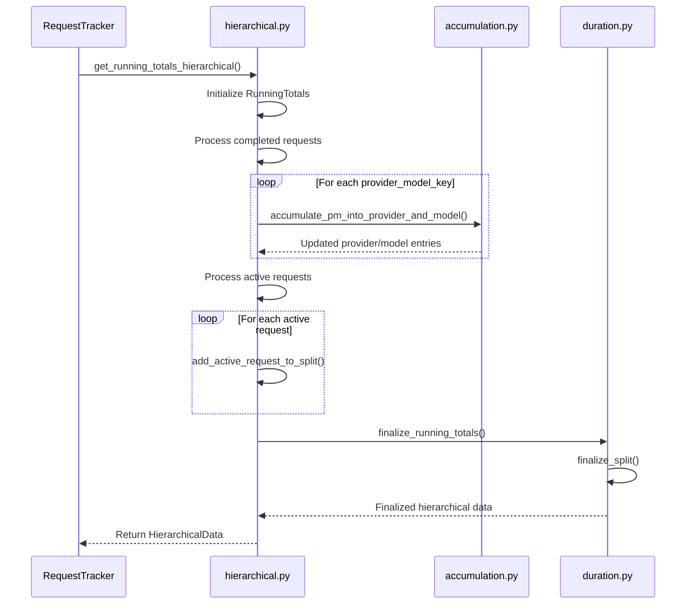

**Diagram sources**
- [hierarchical.py](file://src/core/metrics/calculations/hierarchical.py)
- [accumulation.py](file://src/core/metrics/calculations/accumulation.py)
- [duration.py](file://src/core/metrics/calculations/duration.py)

**Section sources**
- [hierarchical.py](file://src/core/metrics/calculations/hierarchical.py)

## API Integration and Endpoint Instrumentation

The metrics system is integrated with the API layer through dedicated endpoints that expose metrics data in various formats. This integration enables real-time monitoring and historical analysis of API performance.

### Metrics Endpoint Architecture

The `src/api/metrics.py` module defines several endpoints for accessing metrics data, including running totals, active requests, and recent errors. These endpoints are protected by API key authentication and support filtering and streaming capabilities.

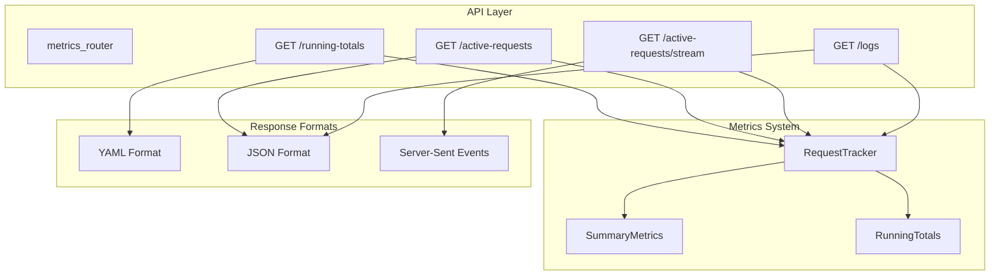

**Diagram sources**
- [metrics.py](file://src/api/metrics.py)

**Section sources**
- [metrics.py](file://src/api/metrics.py)

### Request Tracking Lifecycle

The request tracking lifecycle begins when a request is received and ends when the response is completed. The system captures metrics throughout this lifecycle, from request initiation to completion.

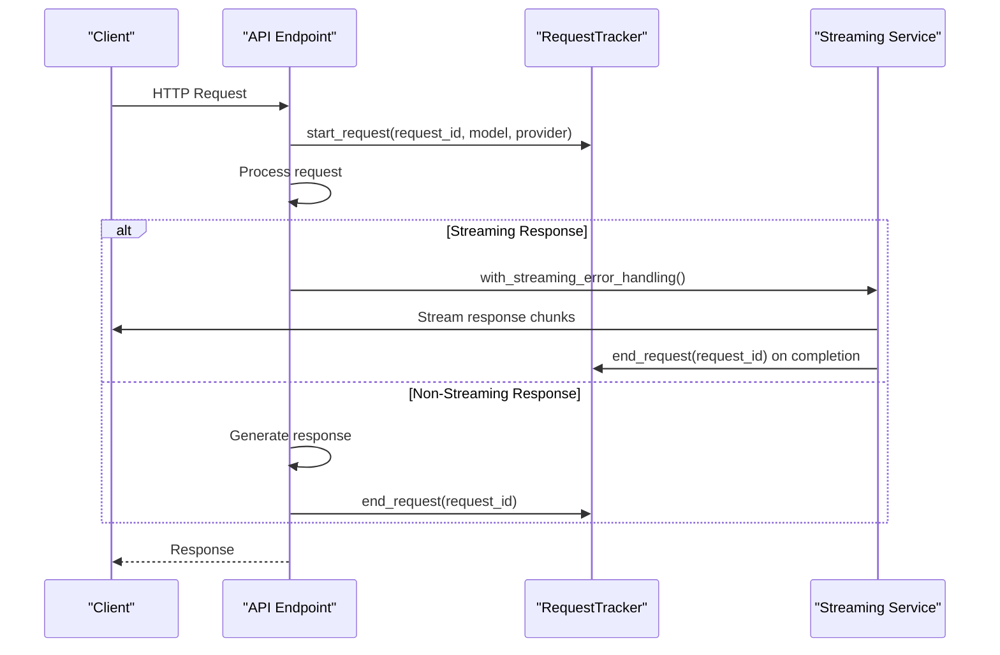

**Diagram sources**
- [metrics.py](file://src/api/metrics.py)
- [streaming.py](file://src/api/services/streaming.py)
- [tracker.py](file://src/core/metrics/tracker/tracker.py)

**Section sources**
- [metrics.py](file://src/api/metrics.py)
- [streaming.py](file://src/api/services/streaming.py)

## Performance Considerations and Optimization

The metrics collection system is designed with performance in mind, employing several strategies to minimize overhead while maintaining accuracy and reliability.

### High-Frequency Data Capture

The system uses asynchronous operations and efficient data structures to handle high-frequency data capture. The `RequestTracker` class employs an asyncio lock to ensure thread safety while minimizing contention.

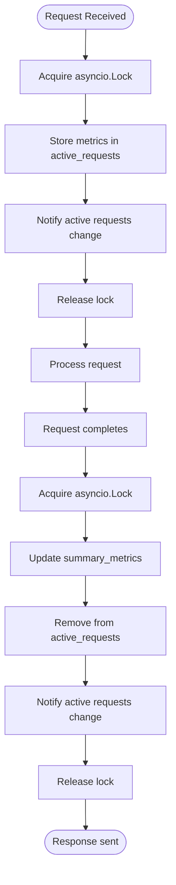

**Diagram sources**
- [tracker.py](file://src/core/metrics/tracker/tracker.py)

**Section sources**
- [tracker.py](file://src/core/metrics/tracker/tracker.py)

### Memory Management

The system implements efficient memory management through the use of bounded deques for recent errors and traces. This prevents unbounded memory growth while maintaining useful historical data for debugging and analysis.

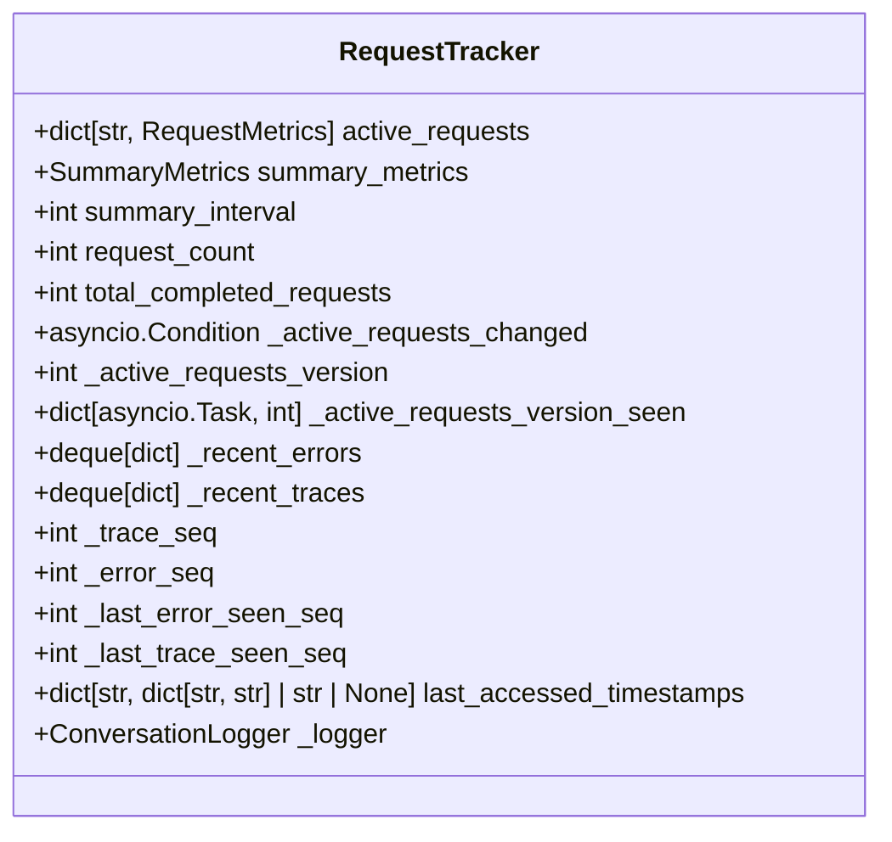

**Diagram sources**
- [tracker.py](file://src/core/metrics/tracker/tracker.py)

**Section sources**
- [tracker.py](file://src/core/metrics/tracker/tracker.py)

## Extending the Metrics System

The metrics system is designed to be extensible, allowing for the addition of custom metrics and reporting capabilities. This section provides guidance on how to extend the system to meet specific monitoring requirements.

### Custom Metrics Integration

To add custom metrics, developers can extend the existing data models or create new ones that integrate with the existing aggregation framework. The system's modular design makes it easy to incorporate additional metrics without modifying core functionality.

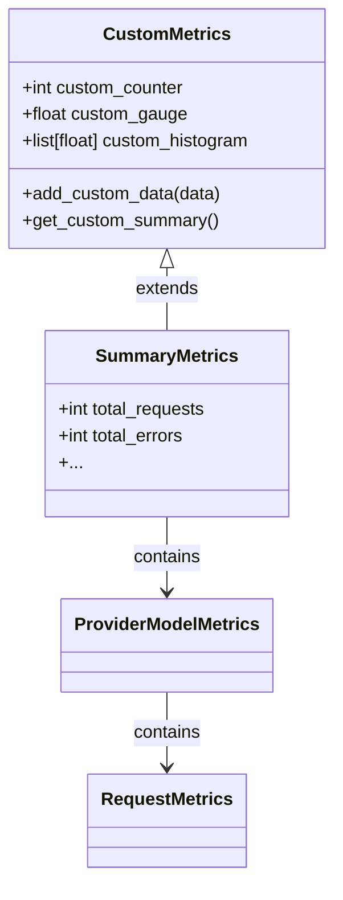

**Section sources**
- [summary.py](file://src/core/metrics/models/summary.py)
- [provider.py](file://src/core/metrics/models/provider.py)
- [request.py](file://src/core/metrics/models/request.py)

### Factory Pattern for Testability

The metrics system uses a factory pattern to create instances of the `RequestTracker`, ensuring test isolation and avoiding shared mutable state. This pattern allows tests to create fresh tracker instances without affecting other tests.

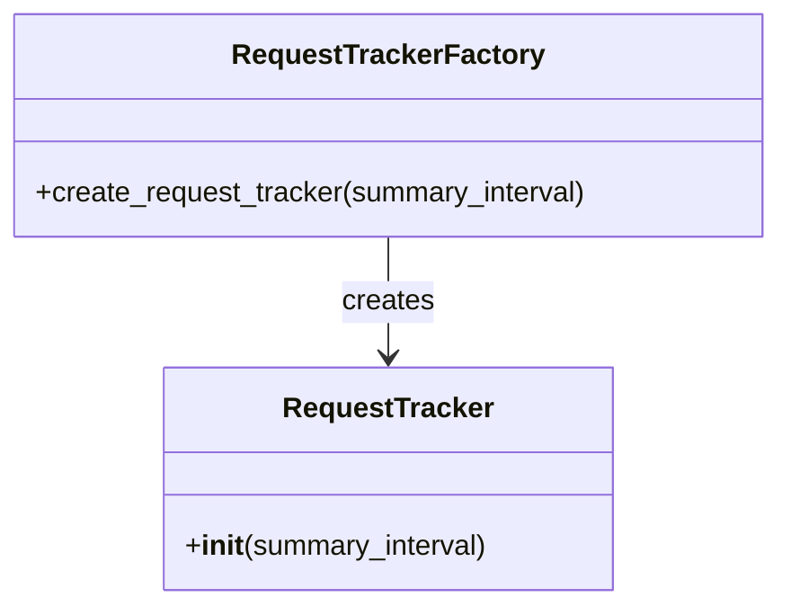

**Diagram sources**
- [factory.py](file://src/core/metrics/tracker/factory.py)
- [tracker.py](file://src/core/metrics/tracker/tracker.py)

**Section sources**
- [factory.py](file://src/core/metrics/tracker/factory.py)

## Conclusion

The metrics collection system in the Vandamme proxy provides a comprehensive solution for monitoring API performance, usage, and error patterns. By capturing granular data at the request level and aggregating it into meaningful summaries, the system enables detailed analysis of provider and model performance across multiple dimensions. The hierarchical reporting structure supports roll-up analysis while maintaining the ability to drill down into specific providers and models. Integration with the API layer through dedicated endpoints allows for real-time monitoring and historical analysis, while the system's design prioritizes performance and scalability. The modular architecture and factory pattern ensure testability and extensibility, making it easy to add custom metrics and adapt the system to evolving requirements.