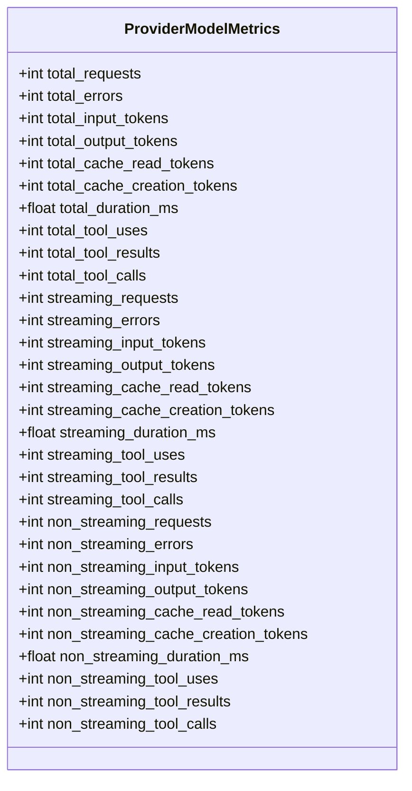
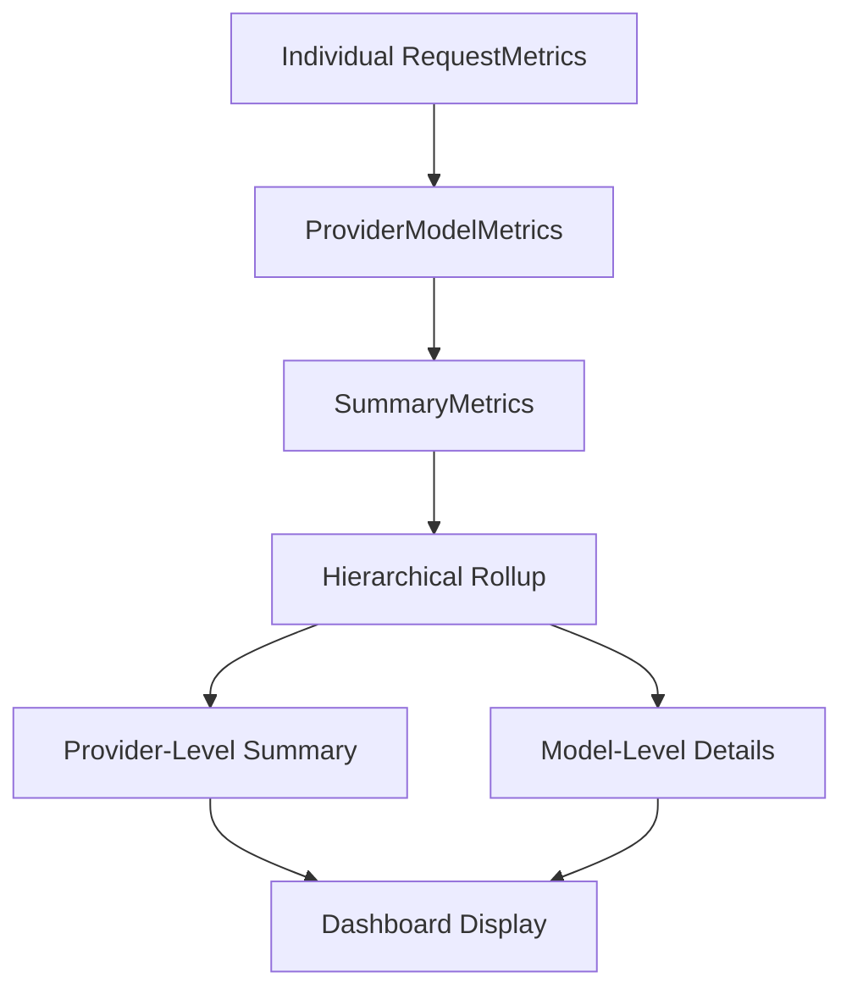

# Provider Metrics Model

<cite>
**Referenced Files in This Document**   
- [provider.py](file://src/core/metrics/models/provider.py)
- [summary.py](file://src/core/metrics/models/summary.py)
- [tracker.py](file://src/core/metrics/tracker/tracker.py)
- [accumulation.py](file://src/core/metrics/calculations/accumulation.py)
- [hierarchical.py](file://src/core/metrics/calculations/hierarchical.py)
- [metrics.py](file://src/api/metrics.py)
- [test_metrics_running_totals.py](file://tests/unit/test_metrics_running_totals.py)
</cite>

## Table of Contents
1. [Introduction](#introduction)
2. [Core Structure of ProviderModelMetrics](#core-structure-of-providermodelmetrics)
3. [Request Count Aggregation](#request-count-aggregation)
4. [Token Accumulation Metrics](#token-accumulation-metrics)
5. [Error Tracking Mechanism](#error-tracking-mechanism)
6. [Duration and Performance Metrics](#duration-and-performance-metrics)
7. [Hierarchical Roll-Up System](#hierarchical-roll-up-system)
8. [Dashboard Integration and Provider Breakdown](#dashboard-integration-and-provider-breakdown)
9. [Edge Case Handling](#edge-case-handling)
10. [High-Volume Accuracy and Performance](#high-volume-accuracy-and-performance)

## Introduction
The ProviderModelMetrics class serves as the central aggregation unit for tracking and analyzing API request metrics across provider and model combinations in the Vandamme proxy system. This model enables granular performance monitoring, cost analysis, and comparative evaluation between different AI service providers and their respective models. By maintaining detailed counters for requests, tokens, errors, and latency, it supports both real-time observability and historical reporting through the system's dashboard interface. The design emphasizes accuracy in high-throughput environments while preserving the ability to distinguish between streaming and non-streaming request patterns.

**Section sources**
- [provider.py](file://src/core/metrics/models/provider.py#L11-L47)

## Core Structure of ProviderModelMetrics
The ProviderModelMetrics class is implemented as a dataclass that maintains separate counters for total, streaming, and non-streaming requests. Each instance represents metrics for a specific provider/model combination, with the key format "{provider}:{model}" ensuring unique identification. The model tracks comprehensive usage data including input/output tokens, cache utilization, tool interactions, and duration metrics. Counters are maintained at three levels: total aggregates, streaming-specific values, and non-streaming-specific values, allowing for detailed performance comparisons between these request types.

**Diagram sources**
- [provider.py](file://src/core/metrics/models/provider.py#L11-L47)

**Section sources**
- [provider.py](file://src/core/metrics/models/provider.py#L11-L47)

## Request Count Aggregation
The model maintains three distinct request counters: total_requests, streaming_requests, and non_streaming_requests. When a request completes, the system increments both the total_requests counter and the appropriate streaming-specific counter based on the request's is_streaming flag. This dual-counting approach enables accurate roll-up reporting while preserving the ability to analyze streaming versus non-streaming performance characteristics separately. The aggregation occurs in the SummaryMetrics.add_request method, which processes completed RequestMetrics instances and updates the corresponding ProviderModelMetrics instance based on the provider/model key.

**Section sources**
- [summary.py](file://src/core/metrics/models/summary.py#L86-L123)
- [provider.py](file://src/core/metrics/models/provider.py#L15-L47)

## Token Accumulation Metrics
Token tracking is implemented with separate counters for input, output, cache read, and cache creation tokens. These metrics are accumulated from individual RequestMetrics instances into the corresponding ProviderModelMetrics fields. The model maintains both total token counts and streaming/non-streaming breakdowns, enabling detailed analysis of token consumption patterns. Cache-related metrics specifically track the efficiency of caching strategies across different provider/model combinations. All token counters default to zero rather than None to simplify aggregation logic and prevent null-related errors during summation operations.

**Section sources**
- [provider.py](file://src/core/metrics/models/provider.py#L17-L21)
- [summary.py](file://src/core/metrics/models/summary.py#L47-L50)

## Error Tracking Mechanism
Error tracking is implemented through dedicated error counters that increment when a request fails. The model maintains total_errors, streaming_errors, and non_streaming_errors counters that parallel the request counters. When a request completes with an error (indicated by a non-null error field in RequestMetrics), the system increments both the total_errors counter and the appropriate streaming-specific error counter. Error types are also categorized in the SummaryMetrics.error_counts dictionary, enabling analysis of error distribution across different provider/model combinations. This comprehensive error tracking supports root cause analysis and reliability monitoring.

**Section sources**
- [provider.py](file://src/core/metrics/models/provider.py#L16-L17)
- [summary.py](file://src/core/metrics/models/summary.py#L63-L65)
- [summary.py](file://src/core/metrics/models/summary.py#L97-L111)

## Duration and Performance Metrics
Duration metrics are tracked in milliseconds and maintained separately for total, streaming, and non_streaming requests. The total_duration_ms field accumulates the duration of all requests, while streaming_duration_ms and non_streaming_duration_ms track their respective request types. These duration values are used to calculate average response times for each provider/model combination. The system also tracks tool usage metrics (tool_uses, tool_results, tool_calls) to monitor the complexity of interactions. All duration values are floating-point numbers to preserve precision during accumulation, with final averages rounded to whole milliseconds for reporting.

**Section sources**
- [provider.py](file://src/core/metrics/models/provider.py#L21-L24)
- [summary.py](file://src/core/metrics/models/summary.py#L51-L54)
- [duration.py](file://src/core/metrics/calculations/duration.py#L6-L18)

## Hierarchical Roll-Up System
The ProviderModelMetrics class serves as the foundation for a hierarchical metrics system that supports roll-up reporting from individual requests to provider-level summaries. The RequestTracker aggregates completed requests into SummaryMetrics, which maintains a dictionary of ProviderModelMetrics instances keyed by "{provider}:{model}". The hierarchical.py module then transforms these flat aggregates into a structured format with provider rollups and model-level details. This hierarchy enables the system to generate comprehensive reports that show both overall provider performance and specific model performance within each provider.

**Diagram sources**
- [summary.py](file://src/core/metrics/models/summary.py#L37-L41)
- [hierarchical.py](file://src/core/metrics/calculations/hierarchical.py#L56-L68)
- [tracker.py](file://src/core/metrics/tracker/tracker.py#L321-L452)

**Section sources**
- [summary.py](file://src/core/metrics/models/summary.py#L37-L41)
- [hierarchical.py](file://src/core/metrics/calculations/hierarchical.py#L56-L68)

## Dashboard Integration and Provider Breakdown
The ProviderModelMetrics data powers the dashboard's provider breakdown views through the get_running_totals_hierarchical endpoint. This endpoint returns metrics in a hierarchical format that organizes data by provider, with rollup totals and individual model performance. The dashboard uses this data to display comparative analysis between different providers and models, showing key metrics such as request volume, error rates, token consumption, and response times. The system supports filtering by provider and model name (with wildcard support), enabling users to focus on specific subsets of the data. The metrics endpoint also includes active request tracking, providing real-time visibility into in-flight requests alongside historical aggregates.

**Section sources**
- [metrics.py](file://src/api/metrics.py#L176-L263)
- [tracker.py](file://src/core/metrics/tracker/tracker.py#L321-L452)
- [metrics.py](file://src/dashboard/services/metrics.py#L34-L67)

## Edge Case Handling
The model includes robust handling for edge cases such as zero requests and malformed data. When no requests have been processed for a provider/model combination, all counters remain at their default zero values, ensuring accurate reporting without division-by-zero errors. The system properly handles model names containing colons (such as OpenRouter models) by preserving the full model name after the first colon separator. Provider and model filtering uses case-insensitive wildcard matching to accommodate variations in input. The aggregation logic validates input data and gracefully handles missing or null values by treating them as zero, maintaining data integrity even with incomplete request metrics.

**Section sources**
- [summary.py](file://src/core/metrics/models/summary.py#L135-L149)
- [hierarchical.py](file://src/core/metrics/calculations/hierarchical.py#L20-L25)
- [test_metrics_running_totals.py](file://tests/unit/test_metrics_running_totals.py#L204-L301)

## High-Volume Accuracy and Performance
The ProviderModelMetrics implementation is optimized for accuracy in high-volume scenarios through several design choices. The use of simple integer and float counters ensures efficient memory usage and fast arithmetic operations. The aggregation process is thread-safe through the RequestTracker's asyncio.Lock, preventing race conditions during concurrent updates. Counter updates are batched and processed efficiently, minimizing overhead per request. The system separates completed request metrics from active requests, reducing contention on the main aggregation data structure. Regular summary emissions (controlled by summary_interval) provide periodic resets of intermediate counters while preserving long-term aggregates, helping to manage memory usage in sustained high-throughput environments.

**Section sources**
- [tracker.py](file://src/core/metrics/tracker/tracker.py#L42-L490)
- [summary.py](file://src/core/metrics/models/summary.py#L125-L198)
- [accumulation.py](file://src/core/metrics/calculations/accumulation.py#L42-L84)