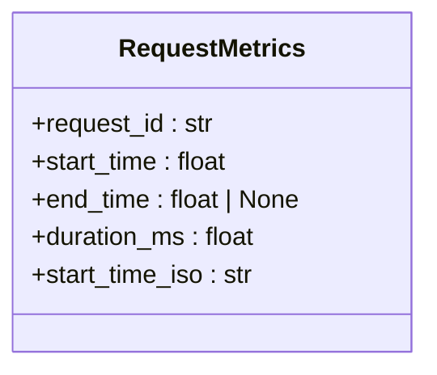
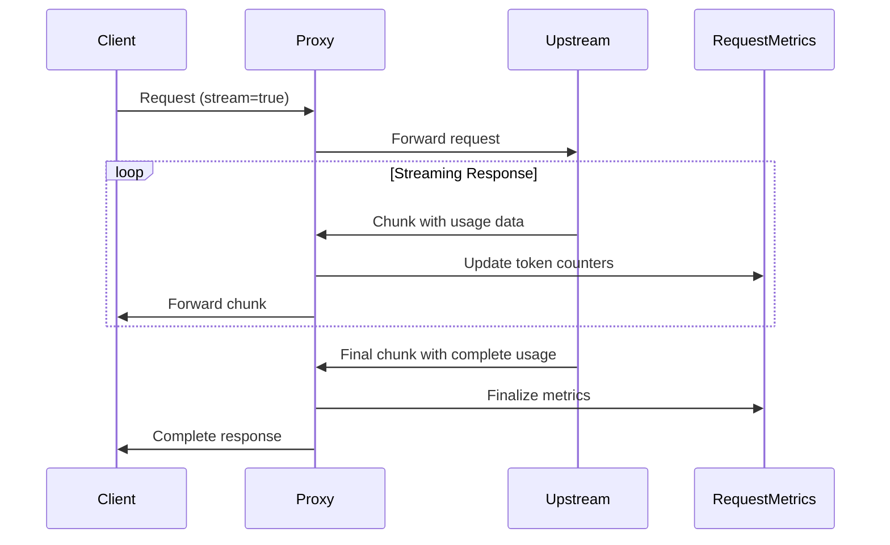
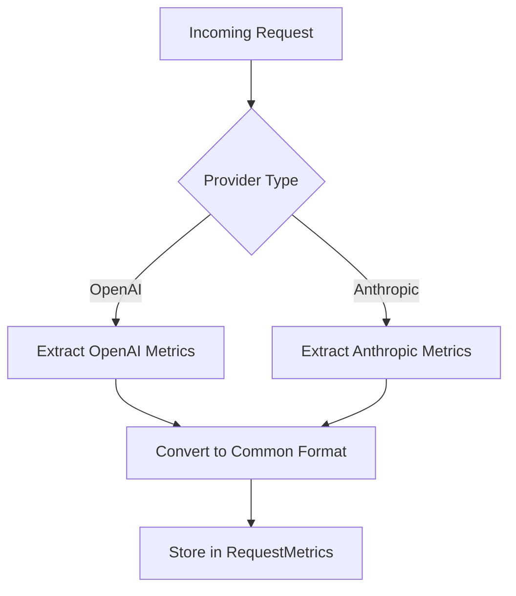

# Request Metrics Model

<cite>
**Referenced Files in This Document**   
- [request.py](file://src/core/metrics/models/request.py)
- [tracker.py](file://src/core/metrics/tracker/tracker.py)
- [response_converter.py](file://src/conversion/response_converter.py)
- [endpoints.py](file://src/api/endpoints.py)
- [anthropic_to_openai.py](file://src/conversion/anthropic_to_openai.py)
- [openai_to_anthropic.py](file://src/conversion/openai_to_anthropic.py)
</cite>

## Table of Contents
1. [Introduction](#introduction)
2. [Core Fields](#core-fields)
3. [Token Counters](#token-counters)
4. [Request Metadata](#request-metadata)
5. [Computed Properties](#computed-properties)
6. [Error Tracking](#error-tracking)
7. [Tool Usage Metrics](#tool-usage-metrics)
8. [Streaming Support](#streaming-support)
9. [Null Value Handling](#null-value-handling)
10. [Cross-Provider Data Capture](#cross-provider-data-capture)
11. [Aggregation Design](#aggregation-design)

## Introduction

The RequestMetrics class serves as the fundamental data model for tracking LLM request performance and costs within the proxy system. This model captures comprehensive telemetry data for both OpenAI and Anthropic API requests, enabling detailed analysis of usage patterns, performance characteristics, and cost factors. The design prioritizes aggregation efficiency while maintaining compatibility with both streaming and non-streaming request workflows.

**Section sources**
- [request.py](file://src/core/metrics/models/request.py#L1-L56)

## Core Fields

The RequestMetrics class contains essential fields that identify and timestamp each request:

- **request_id**: Unique identifier for the request, used for tracking and correlation across systems
- **start_time**: Unix timestamp (in seconds) when the request processing began
- **end_time**: Unix timestamp (in seconds) when the request completed, or None for active requests
- **duration_ms**: Computed property representing the request duration in milliseconds
- **start_time_iso**: Computed property providing an ISO-formatted string representation of the start time

These fields enable precise timing measurements and request identification, forming the foundation for performance analysis and debugging.

**Section sources**
- [request.py](file://src/core/metrics/models/request.py#L19-L21)

## Token Counters

The model includes comprehensive token counting capabilities to track usage and costs:

- **input_tokens**: Number of input tokens processed, defaulting to 0
- **output_tokens**: Number of output tokens generated, defaulting to 0
- **cache_read_tokens**: Number of tokens served from cache, defaulting to 0
- **cache_creation_tokens**: Number of tokens that contributed to cache creation, defaulting to 0

These counters are updated throughout the request lifecycle, with streaming requests receiving incremental updates as token usage data becomes available. The counters default to 0 rather than None to simplify aggregation and mathematical operations.

**Section sources**
- [request.py](file://src/core/metrics/models/request.py#L25-L28)
- [response_converter.py](file://src/conversion/response_converter.py#L246-L248)

## Request Metadata

The model captures essential metadata about each request:

- **claude_model**: The Claude model name specified in the request
- **openai_model**: The resolved OpenAI model name, if applicable
- **provider**: The upstream provider handling the request
- **message_count**: Number of messages in the request
- **request_size**: Size of the request payload in bytes
- **response_size**: Size of the response payload in bytes

This metadata enables filtering and grouping of metrics by provider, model, and other dimensions, supporting detailed usage analysis.

**Section sources**
- [request.py](file://src/core/metrics/models/request.py#L22-L31)
- [endpoints.py](file://src/api/endpoints.py#L784-L785)

## Computed Properties

The RequestMetrics class includes computed properties that provide derived values:

**Diagram sources**
- [request.py](file://src/core/metrics/models/request.py#L39-L55)

- **duration_ms**: Calculates the request duration in milliseconds by subtracting start_time from end_time and multiplying by 1000. Returns 0 if end_time is None.
- **start_time_iso**: Converts the Unix timestamp to an ISO-formatted string with second precision. Returns "N/A" if the timestamp is invalid or out of range.

These computed properties provide convenient access to commonly needed values without requiring external calculation.

**Section sources**
- [request.py](file://src/core/metrics/models/request.py#L39-L55)

## Error Tracking

The model includes comprehensive error tracking capabilities:

- **error**: Error message describing what went wrong, or None if the request succeeded
- **error_type**: Categorization of the error type (e.g., "upstream_timeout", "streaming_error")

Errors are captured at multiple levels, including network timeouts, upstream HTTP errors, and streaming failures. The error information is preserved in both active and completed request records, enabling detailed error analysis and troubleshooting.

**Section sources**
- [request.py](file://src/core/metrics/models/request.py#L33-L34)
- [response_converter.py](file://src/conversion/response_converter.py#L299-L300)

## Tool Usage Metrics

The model tracks detailed metrics related to tool usage:

- **tool_use_count**: Number of tool uses in the response
- **tool_result_count**: Number of tool results provided
- **tool_call_count**: Number of tool calls made

These metrics are particularly important for analyzing the usage patterns of function-calling capabilities in LLMs. The counters default to 0 to ensure consistent aggregation behavior, even when tools are not used in a particular request.

**Section sources**
- [request.py](file://src/core/metrics/models/request.py#L35-L37)
- [endpoints.py](file://src/api/endpoints.py#L802-L803)

## Streaming Support

The RequestMetrics model fully supports both streaming and non-streaming request tracking:

**Diagram sources**
- [request.py](file://src/core/metrics/models/request.py#L32)
- [response_converter.py](file://src/conversion/response_converter.py#L246-L248)

The **is_streaming** field indicates whether the request was processed as a streaming response. For streaming requests, token counters are updated incrementally as chunks are received, providing real-time visibility into token consumption. The metrics finalization is handled by the streaming wrapper, ensuring proper cleanup even if the client disconnects prematurely.

**Section sources**
- [request.py](file://src/core/metrics/models/request.py#L32)
- [tracker.py](file://src/core/metrics/tracker/tracker.py#L100-L105)

## Null Value Handling

The model employs a deliberate strategy for handling null values:

- Optional fields like **end_time**, **error**, and **error_type** use None to indicate absence of data
- Numeric counters default to 0 rather than None
- Computed properties handle missing data gracefully (e.g., duration_ms returns 0 when end_time is None)

This approach ensures that aggregation operations can proceed without requiring null checks for counters, while still preserving the distinction between "no error" (None) and "successful request" (empty error field).

**Section sources**
- [request.py](file://src/core/metrics/models/request.py#L21-L34)

## Cross-Provider Data Capture

The RequestMetrics model supports capturing data from both OpenAI and Anthropic API requests:

**Diagram sources**
- [request.py](file://src/core/metrics/models/request.py#L19-L38)
- [anthropic_to_openai.py](file://src/conversion/anthropic_to_openai.py#L45-L59)
- [openai_to_anthropic.py](file://src/conversion/openai_to_anthropic.py#L106-L177)

For OpenAI requests, usage data is extracted from the usage field in the response. For Anthropic requests, token counts are mapped from the input_tokens and output_tokens fields. The conversion layers ensure consistent metric representation regardless of the upstream provider.

**Section sources**
- [request.py](file://src/core/metrics/models/request.py#L25-L28)
- [anthropic_to_openai.py](file://src/conversion/anthropic_to_openai.py#L45-L59)

## Aggregation Design

The RequestMetrics model is designed with aggregation in mind:

- Counters default to 0 to enable simple summation operations
- Separate tracking of streaming and non-streaming requests
- Hierarchical aggregation through the SummaryMetrics class
- Support for filtering by provider and model

The aggregation system uses these metrics to generate running totals, provider breakdowns, and model usage statistics. The design ensures that metrics can be efficiently summarized at multiple levels, from individual requests to system-wide usage patterns.

**Section sources**
- [request.py](file://src/core/metrics/models/request.py#L25-L28)
- [tracker.py](file://src/core/metrics/tracker/tracker.py#L49-L50)
- [tracker.py](file://src/core/metrics/tracker/tracker.py#L130-L131)