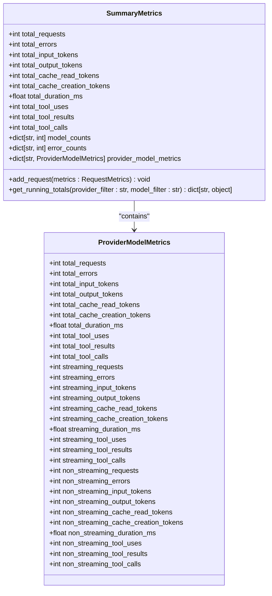
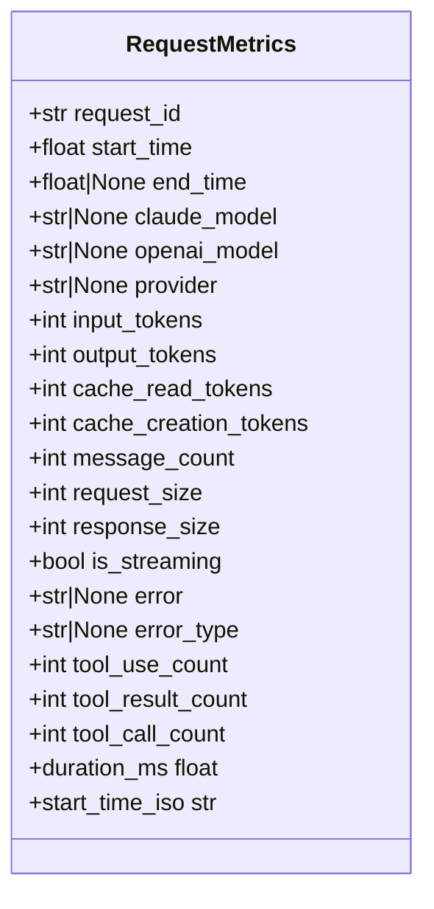
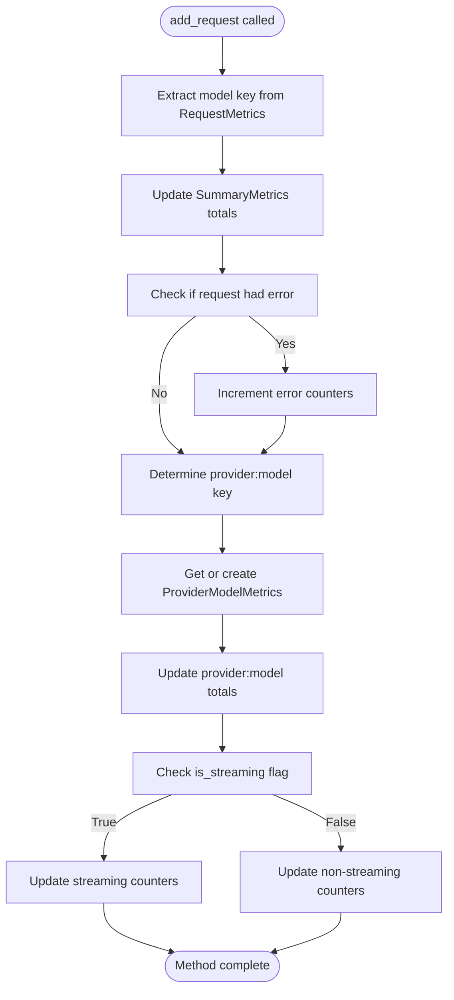
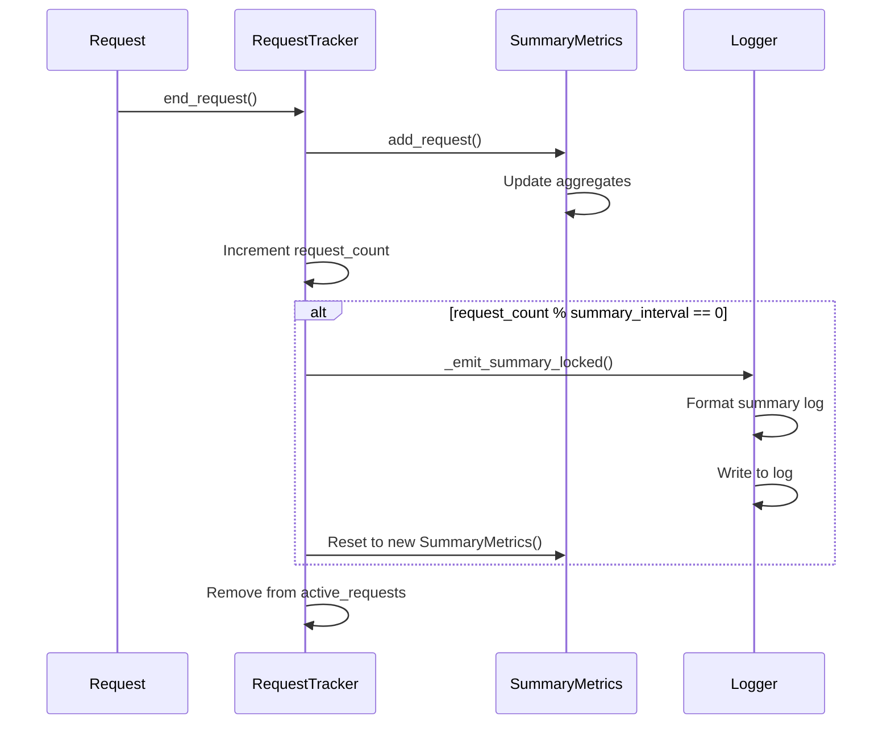
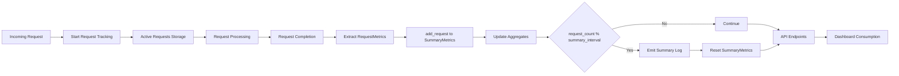
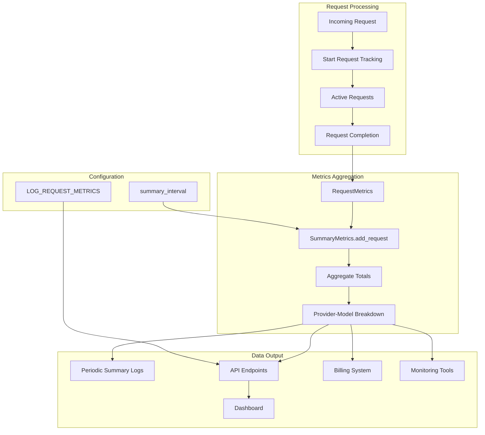

# Summary Metrics Model

<cite>
**Referenced Files in This Document**   
- [summary.py](file://src/core/metrics/models/summary.py)
- [provider.py](file://src/core/metrics/models/provider.py)
- [request.py](file://src/core/metrics/models/request.py)
- [tracker.py](file://src/core/metrics/tracker/tracker.py)
- [hierarchical.py](file://src/core/metrics/calculations/hierarchical.py)
- [accumulation.py](file://src/core/metrics/calculations/accumulation.py)
- [metrics.py](file://src/api/metrics.py)
- [runtime.py](file://src/core/metrics/runtime.py)
</cite>

## Table of Contents
1. [Introduction](#introduction)
2. [Core Data Model](#core-data-model)
3. [Provider-Model Metrics Structure](#provider-model-metrics-structure)
4. [Request Metrics Foundation](#request-metrics-foundation)
5. [Add Request Processing](#add-request-processing)
6. [Derived Metrics Calculation](#derived-metrics-calculation)
7. [Summary Interval and Reporting](#summary-interval-and-reporting)
8. [Integration with Dashboard](#integration-with-dashboard)
9. [API Endpoints and Data Flow](#api-endpoints-and-data-flow)
10. [Architecture Overview](#architecture-overview)

## Introduction

The SummaryMetrics class serves as the central aggregation point for completed request metrics in the system. It maintains running totals for all completed requests, providing comprehensive insights into request volume, token usage, error rates, and performance metrics. This model plays a critical role in the metrics collection pipeline, supporting reporting, billing, and system monitoring functions. The design enables detailed breakdowns by provider and model while maintaining efficient aggregation of key performance indicators.

## Core Data Model

The SummaryMetrics class implements a comprehensive data model for tracking completed request metrics. It maintains aggregate counters for total requests, errors, token usage (input, output, cache), tool interactions, and performance metrics. The model includes specialized collections for tracking model popularity through model_counts and error patterns through error_counts. A key feature is the provider_model_metrics dictionary that maps provider:model keys to detailed metrics objects, enabling granular analysis of performance across different provider-model combinations.

**Diagram sources**
- [summary.py](file://src/core/metrics/models/summary.py#L17-L219)
- [provider.py](file://src/core/metrics/models/provider.py#L12-L47)

**Section sources**
- [summary.py](file://src/core/metrics/models/summary.py#L17-L219)

## Provider-Model Metrics Structure

The provider_model_metrics dictionary is a critical component of the SummaryMetrics class, mapping provider:model keys to detailed metrics objects. This structure enables granular tracking of performance metrics for each provider-model combination. The metrics are maintained separately for streaming and non-streaming requests, allowing for detailed analysis of performance differences between these request types. The canonical key format "{provider}:{resolved_model}" ensures consistent tracking across the system, with fallbacks to provider, model, or "unknown" when necessary.

The ProviderModelMetrics class contains comprehensive counters for both total and streaming-specific metrics, including requests, errors, token usage, tool interactions, and duration. This separation allows for detailed analysis of how streaming requests impact overall performance and resource usage. The structure supports filtering and aggregation operations, making it suitable for reporting and monitoring use cases.

**Section sources**
- [provider.py](file://src/core/metrics/models/provider.py#L12-L47)
- [summary.py](file://src/core/metrics/models/summary.py#L37-L41)

## Request Metrics Foundation

The RequestMetrics class serves as the foundation for the metrics system, capturing detailed information about individual requests. Each request metric includes identifiers, timing information, model details, token usage, and error information. The class provides calculated properties such as duration_ms and start_time_iso, enabling consistent time-based calculations across the system. This granular data is essential for the SummaryMetrics class to accurately aggregate running totals.

The request metrics model captures both input and output token counts, cache usage (read and creation), and tool interaction metrics (uses, results, calls). It also tracks whether a request was streaming and any associated errors. This comprehensive data collection enables detailed analysis of request patterns and performance characteristics. The model's design supports efficient aggregation while preserving the necessary detail for advanced analytics.

**Diagram sources**
- [request.py](file://src/core/metrics/models/request.py#L10-L56)

**Section sources**
- [request.py](file://src/core/metrics/models/request.py#L10-L56)

## Add Request Processing

The add_request method is responsible for processing completed RequestMetrics instances and updating the aggregate totals in the SummaryMetrics class. This method handles the core aggregation logic, incrementing counters for requests, tokens, errors, and other metrics. It processes both the overall summary totals and the provider-specific metrics in the provider_model_metrics dictionary.

The method implements sophisticated logic for handling model keys, extracting the actual model name from provider-prefixed strings when necessary. It also manages the canonical provider:model key format, ensuring consistent tracking across different providers and models. For each request, the method updates both total and streaming-specific counters based on the request's is_streaming flag, maintaining separate metrics for streaming and non-streaming requests.

**Diagram sources**
- [summary.py](file://src/core/metrics/models/summary.py#L43-L124)

**Section sources**
- [summary.py](file://src/core/metrics/models/summary.py#L43-L124)

## Derived Metrics Calculation

The SummaryMetrics class supports the calculation of derived metrics through the get_running_totals method. This method computes averages and other derived values from the raw aggregate data. Key derived metrics include average_duration_ms, calculated by dividing total_duration_ms by total_requests. The method also supports filtering by provider and model, enabling focused analysis of specific segments of the traffic.

The calculation process involves iterating through the provider_model_metrics dictionary, applying filters as needed, and accumulating totals for the filtered set. For each provider-model combination, the method calculates the average duration and includes this in the returned data structure. The method returns a comprehensive dictionary containing both raw totals and derived metrics, suitable for reporting and visualization purposes.

**Section sources**
- [summary.py](file://src/core/metrics/models/summary.py#L125-L198)
- [hierarchical.py](file://src/core/metrics/calculations/hierarchical.py#L85-L125)
- [duration.py](file://src/core/metrics/calculations/duration.py#L6-L25)

## Summary Interval and Reporting

The metrics system supports periodic reporting through the summary_interval configuration parameter. This interval determines how frequently summary logs are emitted, with a default of 100 requests. When the request count reaches a multiple of the summary_interval, the system emits a comprehensive summary log entry containing key metrics. This log includes totals for requests, errors, duration, token usage, and cache statistics.

The reporting mechanism is implemented in the RequestTracker class, which manages the summary_metrics instance and handles the emission of summary logs. After emitting a summary, the system resets the summary_metrics to begin collecting data for the next interval. This approach provides regular visibility into system performance while preventing unbounded growth of the metrics data. The summary logs are formatted for easy parsing and analysis, supporting operational monitoring and troubleshooting.

**Diagram sources**
- [tracker.py](file://src/core/metrics/tracker/tracker.py#L456-L489)
- [factory.py](file://src/core/metrics/tracker/factory.py#L15-L31)

**Section sources**
- [tracker.py](file://src/core/metrics/tracker/tracker.py#L456-L489)

## Integration with Dashboard

The SummaryMetrics model integrates closely with the dashboard system, providing data for visualization and monitoring. The hierarchical metrics structure is exposed through API endpoints that return data in YAML format, suitable for consumption by the dashboard components. The dashboard uses this data to display provider and model breakdowns, token usage charts, and performance metrics.

The integration includes specialized endpoints for different types of data, such as running totals, active requests, and recent errors. The system supports filtering and pagination parameters, enabling the dashboard to request specific subsets of data as needed. The data model is designed to support both real-time monitoring and historical analysis, with the ability to filter by provider, model, and time period.

**Section sources**
- [metrics.py](file://src/api/metrics.py#L176-L263)
- [dashboard/services/metrics.py](file://src/dashboard/services/metrics.py#L34-L67)

## API Endpoints and Data Flow

The metrics system exposes several API endpoints that provide access to the aggregated data. The /running-totals endpoint returns hierarchical provider-model breakdowns in YAML format, supporting optional filtering by provider and model. The /active-requests endpoint provides snapshots of currently in-flight requests, while the /logs endpoint returns recent errors and request traces.

The data flow begins with request processing, where metrics are collected and stored in active_requests. When a request completes, its metrics are transferred to the SummaryMetrics instance via the add_request method. The aggregated data is then available through the API endpoints, with the hierarchical structure transformed into YAML format for easy consumption. The system uses asynchronous processing to ensure that metrics collection does not impact request performance.

**Diagram sources**
- [metrics.py](file://src/api/metrics.py#L176-L263)
- [tracker.py](file://src/core/metrics/tracker/tracker.py#L116-L179)
- [runtime.py](file://src/core/metrics/runtime.py#L20-L29)

**Section sources**
- [metrics.py](file://src/api/metrics.py#L176-L263)

## Architecture Overview

The SummaryMetrics model is part of a comprehensive metrics collection architecture that spans from request processing to dashboard visualization. The system uses a process-local RequestTracker to manage both active and completed request metrics. Completed requests are aggregated in the SummaryMetrics instance, while active requests are tracked separately to provide real-time visibility.

The architecture supports multiple output formats and consumption patterns, including periodic summary logs, API endpoints for real-time data access, and structured data for dashboard integration. The system is designed to be efficient and scalable, with careful attention to memory usage and performance impact. The separation of concerns between data collection, aggregation, and presentation enables flexible use of the metrics data for various purposes including monitoring, billing, and performance analysis.

**Diagram sources**
- [tracker.py](file://src/core/metrics/tracker/tracker.py#L42-L490)
- [summary.py](file://src/core/metrics/models/summary.py#L17-L219)
- [metrics.py](file://src/api/metrics.py#L1-L263)

**Section sources**
- [tracker.py](file://src/core/metrics/tracker/tracker.py#L42-L490)