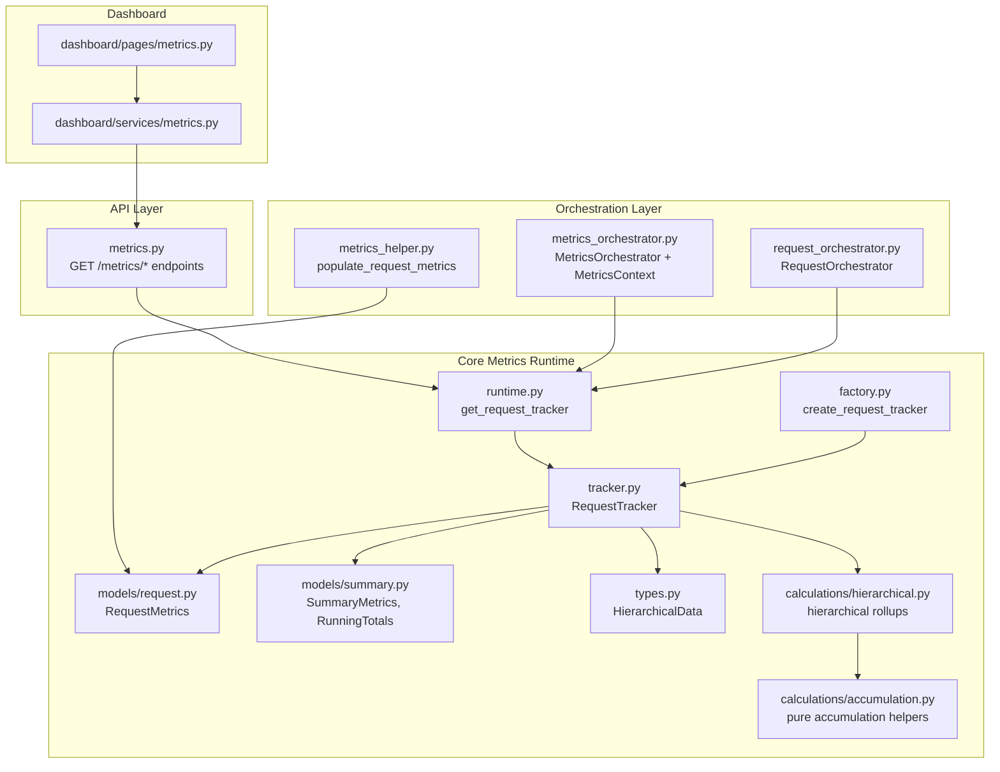
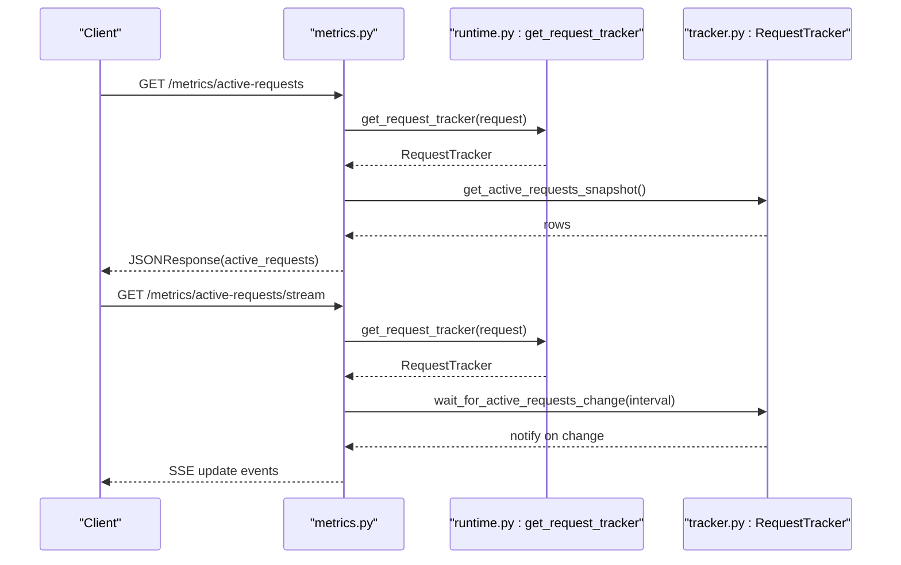
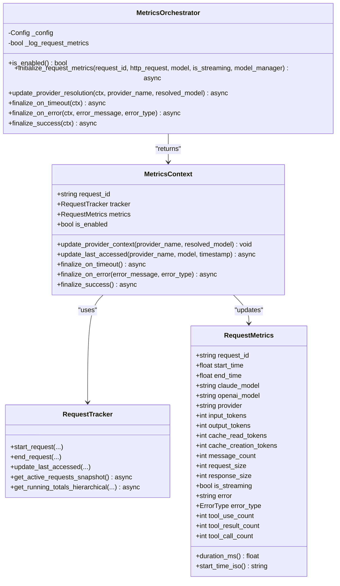
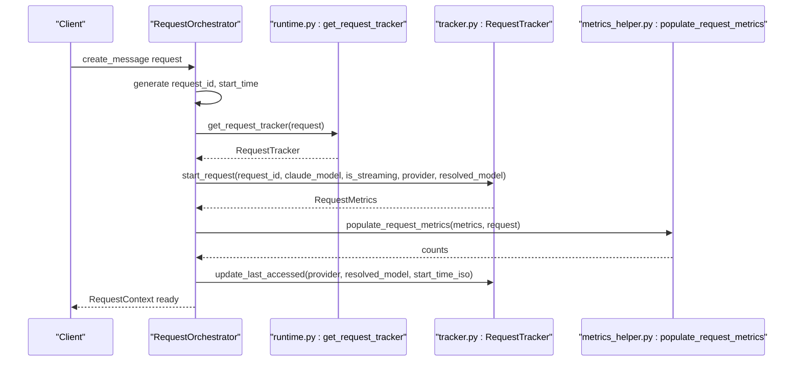
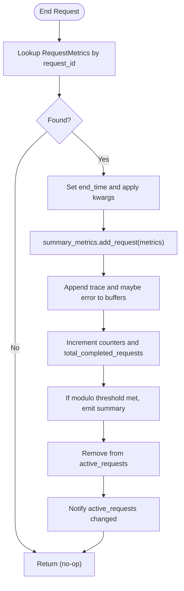
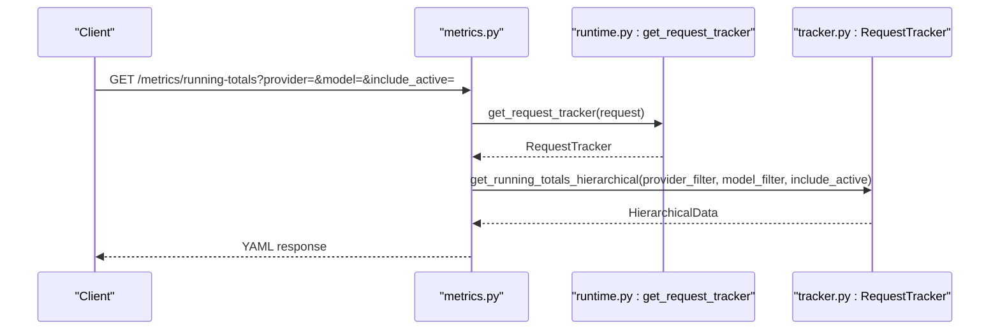
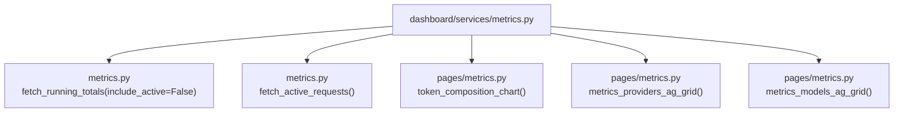
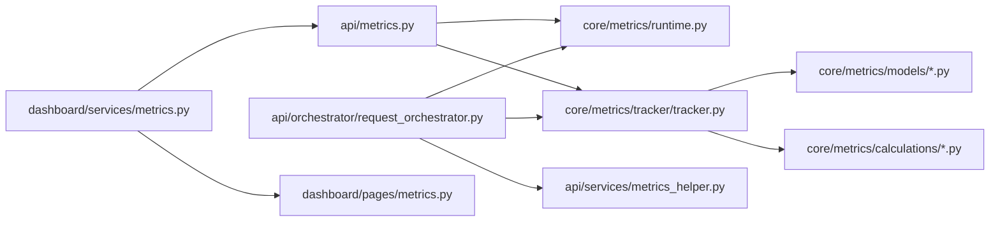

# Metrics Orchestration

<cite>
**Referenced Files in This Document**
- [metrics_orchestrator.py](file://src/api/services/metrics_orchestrator.py)
- [metrics.py](file://src/api/metrics.py)
- [metrics_helper.py](file://src/api/services/metrics_helper.py)
- [request_orchestrator.py](file://src/api/orchestrator/request_orchestrator.py)
- [runtime.py](file://src/core/metrics/runtime.py)
- [tracker.py](file://src/core/metrics/tracker/tracker.py)
- [factory.py](file://src/core/metrics/tracker/factory.py)
- [request.py](file://src/core/metrics/models/request.py)
- [summary.py](file://src/core/metrics/models/summary.py)
- [types.py](file://src/core/metrics/types.py)
- [hierarchical.py](file://src/core/metrics/calculations/hierarchical.py)
- [accumulation.py](file://src/core/metrics/calculations/accumulation.py)
- [metrics.py](file://src/dashboard/services/metrics.py)
- [metrics.py](file://src/dashboard/pages/metrics.py)
</cite>

## Table of Contents
1. [Introduction](#introduction)
2. [Project Structure](#project-structure)
3. [Core Components](#core-components)
4. [Architecture Overview](#architecture-overview)
5. [Detailed Component Analysis](#detailed-component-analysis)
6. [Dependency Analysis](#dependency-analysis)
7. [Performance Considerations](#performance-considerations)
8. [Troubleshooting Guide](#troubleshooting-guide)
9. [Conclusion](#conclusion)
10. [Appendices](#appendices)

## Introduction
This document explains the Metrics Orchestration subsystem that powers request lifecycle tracking, real-time active requests monitoring, and hierarchical running totals reporting. It covers how metrics are initialized, updated, finalized, and surfaced through both API endpoints and the embedded dashboard. The design emphasizes:
- Centralized lifecycle management via a dedicated orchestrator
- Graceful degradation when metrics are disabled
- Strong separation between API endpoints, orchestration, and core metrics runtime
- Efficient streaming updates and hierarchical rollups for dashboards

## Project Structure
The metrics orchestration spans three layers:
- API layer: endpoints and streaming for active requests and running totals
- Orchestration layer: request initialization and metrics coordination
- Core metrics runtime: tracker, models, and calculations

**Diagram sources**
- [metrics.py](file://src/api/metrics.py#L1-L266)
- [metrics_orchestrator.py](file://src/api/services/metrics_orchestrator.py#L1-L285)
- [request_orchestrator.py](file://src/api/orchestrator/request_orchestrator.py#L1-L293)
- [metrics_helper.py](file://src/api/services/metrics_helper.py#L1-L78)
- [runtime.py](file://src/core/metrics/runtime.py#L1-L29)
- [tracker.py](file://src/core/metrics/tracker/tracker.py#L1-L490)
- [factory.py](file://src/core/metrics/tracker/factory.py#L1-L31)
- [request.py](file://src/core/metrics/models/request.py#L1-L58)
- [summary.py](file://src/core/metrics/models/summary.py#L1-L219)
- [types.py](file://src/core/metrics/types.py#L1-L32)
- [hierarchical.py](file://src/core/metrics/calculations/hierarchical.py#L1-L125)
- [accumulation.py](file://src/core/metrics/calculations/accumulation.py#L1-L84)
- [metrics.py](file://src/dashboard/services/metrics.py#L1-L67)
- [metrics.py](file://src/dashboard/pages/metrics.py#L1-L210)

**Section sources**
- [metrics.py](file://src/api/metrics.py#L1-L266)
- [metrics_orchestrator.py](file://src/api/services/metrics_orchestrator.py#L1-L285)
- [request_orchestrator.py](file://src/api/orchestrator/request_orchestrator.py#L1-L293)
- [metrics_helper.py](file://src/api/services/metrics_helper.py#L1-L78)
- [runtime.py](file://src/core/metrics/runtime.py#L1-L29)
- [tracker.py](file://src/core/metrics/tracker/tracker.py#L1-L490)
- [factory.py](file://src/core/metrics/tracker/factory.py#L1-L31)
- [request.py](file://src/core/metrics/models/request.py#L1-L58)
- [summary.py](file://src/core/metrics/models/summary.py#L1-L219)
- [types.py](file://src/core/metrics/types.py#L1-L32)
- [hierarchical.py](file://src/core/metrics/calculations/hierarchical.py#L1-L125)
- [accumulation.py](file://src/core/metrics/calculations/accumulation.py#L1-L84)
- [metrics.py](file://src/dashboard/services/metrics.py#L1-L67)
- [metrics.py](file://src/dashboard/pages/metrics.py#L1-L210)

## Core Components
- MetricsOrchestrator: Centralizes metrics initialization, provider resolution updates, and finalization on success/error/timeout. Provides a MetricsContext wrapper for None-safe operations.
- RequestOrchestrator: Integrates metrics initialization into the broader request pipeline, including request conversion, authentication, and middleware preprocessing.
- RequestTracker: Process-local in-memory aggregator for active and completed requests, with broadcasting for SSE and hierarchical rollups.
- RequestMetrics: Per-request dataclass capturing timing, token usage, sizes, streaming flag, errors, and tool call counts.
- SummaryMetrics and RunningTotals: Aggregation models for completed requests and hierarchical provider/model rollups.
- API endpoints: Expose logs, active requests snapshots, live SSE stream, and running totals in YAML.
- Dashboard services/pages: Fetch and render metrics views, including token composition charts and provider/model breakdowns.

**Section sources**
- [metrics_orchestrator.py](file://src/api/services/metrics_orchestrator.py#L90-L285)
- [request_orchestrator.py](file://src/api/orchestrator/request_orchestrator.py#L27-L178)
- [tracker.py](file://src/core/metrics/tracker/tracker.py#L42-L490)
- [request.py](file://src/core/metrics/models/request.py#L11-L58)
- [summary.py](file://src/core/metrics/models/summary.py#L16-L219)
- [metrics.py](file://src/api/metrics.py#L25-L266)
- [metrics.py](file://src/dashboard/services/metrics.py#L1-L67)
- [metrics.py](file://src/dashboard/pages/metrics.py#L1-L210)

## Architecture Overview
The system follows a layered design:
- API endpoints depend on runtime helpers to retrieve the RequestTracker from the FastAPI app state.
- Orchestrators initialize metrics early in the request lifecycle and coordinate updates and finalization.
- RequestTracker maintains active requests and aggregates completed metrics into SummaryMetrics, emitting periodic summaries and maintaining last-accessed timestamps.
- Calculations modules produce hierarchical rollups and finalize averages for API responses.
- Dashboard consumes running totals and active requests snapshots via API endpoints.

**Diagram sources**
- [metrics.py](file://src/api/metrics.py#L54-L177)
- [runtime.py](file://src/core/metrics/runtime.py#L20-L29)
- [tracker.py](file://src/core/metrics/tracker/tracker.py#L249-L291)

## Detailed Component Analysis

### MetricsOrchestrator and MetricsContext
Responsibilities:
- Initialize metrics for a request (resolve provider/model, start tracking, update last accessed)
- Update provider resolution after initial setup
- Finalize on timeout, error, or success
- Provide None-safe operations when metrics are disabled

Design highlights:
- MetricsContext encapsulates request_id, tracker, metrics, and is_enabled for safe method chaining
- Methods short-circuit when metrics are disabled
- Provider/model updates preserve canonical resolved names for display

**Diagram sources**
- [metrics_orchestrator.py](file://src/api/services/metrics_orchestrator.py#L36-L285)
- [request.py](file://src/core/metrics/models/request.py#L11-L58)
- [tracker.py](file://src/core/metrics/tracker/tracker.py#L85-L179)

**Section sources**
- [metrics_orchestrator.py](file://src/api/services/metrics_orchestrator.py#L36-L285)

### RequestOrchestrator Integration
Responsibilities:
- Generate request_id and start timing
- Initialize metrics/tracker if enabled
- Resolve provider and model, convert request, apply middleware
- Update metrics with provider info and last accessed timestamps
- Handle client disconnect and finalize metrics accordingly

Key flows:
- Early metrics initialization ensures active requests never show provider-prefixed aliases while in-flight
- populate_request_metrics centralizes population of message count, sizes, and tool call counts

**Diagram sources**
- [request_orchestrator.py](file://src/api/orchestrator/request_orchestrator.py#L56-L178)
- [metrics_helper.py](file://src/api/services/metrics_helper.py#L38-L78)
- [runtime.py](file://src/core/metrics/runtime.py#L20-L29)
- [tracker.py](file://src/core/metrics/tracker/tracker.py#L85-L179)

**Section sources**
- [request_orchestrator.py](file://src/api/orchestrator/request_orchestrator.py#L56-L178)
- [metrics_helper.py](file://src/api/services/metrics_helper.py#L14-L78)

### RequestTracker Lifecycle and Hierarchical Rollups
Responsibilities:
- Track active requests and finalize them into SummaryMetrics
- Maintain last_accessed timestamps for providers/models/top
- Provide snapshots for dashboards and SSE streaming
- Compute hierarchical rollups with streaming/non-streaming splits

Important behaviors:
- get_active_requests_snapshot normalizes provider/model names and computes duration
- get_running_totals_hierarchical optionally includes active requests and applies filters
- finalize_running_totals computes averages and returns HierarchicalData

**Diagram sources**
- [tracker.py](file://src/core/metrics/tracker/tracker.py#L116-L179)

**Section sources**
- [tracker.py](file://src/core/metrics/tracker/tracker.py#L42-L490)
- [summary.py](file://src/core/metrics/models/summary.py#L16-L124)
- [hierarchical.py](file://src/core/metrics/calculations/hierarchical.py#L85-L125)
- [types.py](file://src/core/metrics/types.py#L14-L32)

### API Endpoints for Metrics
Endpoints:
- GET /metrics/logs: returns systemd logging mode and recent errors/traces
- GET /metrics/active-requests: returns snapshot of in-flight requests
- GET /metrics/active-requests/stream: SSE stream of active requests with push-on-change and heartbeats
- GET /metrics/running-totals: hierarchical YAML of provider→model rollups with optional filters

Behavior:
- Graceful degradation when metrics disabled
- SSE disabled when feature flag off
- Filters support wildcards for provider/model

**Diagram sources**
- [metrics.py](file://src/api/metrics.py#L179-L266)
- [runtime.py](file://src/core/metrics/runtime.py#L20-L29)
- [tracker.py](file://src/core/metrics/tracker/tracker.py#L315-L453)
- [hierarchical.py](file://src/core/metrics/calculations/hierarchical.py#L85-L125)

**Section sources**
- [metrics.py](file://src/api/metrics.py#L25-L266)

### Dashboard Integration
Dashboard services:
- build_metrics_view fetches running totals (completed-only) and active requests
- Renders token composition pie chart and provider/model breakdown grids
- Handles disabled metrics state with friendly alert

**Diagram sources**
- [metrics.py](file://src/dashboard/services/metrics.py#L34-L67)
- [metrics.py](file://src/dashboard/pages/metrics.py#L164-L210)

**Section sources**
- [metrics.py](file://src/dashboard/services/metrics.py#L1-L67)
- [metrics.py](file://src/dashboard/pages/metrics.py#L1-L210)

## Dependency Analysis
Key dependencies:
- API endpoints depend on runtime.py to retrieve RequestTracker from app state
- Orchestrators depend on runtime.py and tracker.py
- Tracker depends on models (RequestMetrics, SummaryMetrics) and calculation modules
- API endpoints depend on tracker for snapshots and rollups
- Dashboard services depend on API endpoints for data

**Diagram sources**
- [metrics.py](file://src/api/metrics.py#L1-L266)
- [runtime.py](file://src/core/metrics/runtime.py#L1-L29)
- [tracker.py](file://src/core/metrics/tracker/tracker.py#L1-L490)
- [request_orchestrator.py](file://src/api/orchestrator/request_orchestrator.py#L1-L293)
- [metrics_helper.py](file://src/api/services/metrics_helper.py#L1-L78)
- [summary.py](file://src/core/metrics/models/summary.py#L1-L219)
- [hierarchical.py](file://src/core/metrics/calculations/hierarchical.py#L1-L125)
- [metrics.py](file://src/dashboard/services/metrics.py#L1-L67)
- [metrics.py](file://src/dashboard/pages/metrics.py#L1-L210)

**Section sources**
- [metrics.py](file://src/api/metrics.py#L1-L266)
- [request_orchestrator.py](file://src/api/orchestrator/request_orchestrator.py#L1-L293)
- [tracker.py](file://src/core/metrics/tracker/tracker.py#L1-L490)

## Performance Considerations
- Locking and concurrency: RequestTracker uses an asyncio.Lock and Condition to guard state and broadcast changes reliably for SSE clients.
- Streaming efficiency: wait_for_active_requests_change uses a version counter to avoid missed updates and minimize redundant notifications.
- Summary emission: Periodic summaries reduce log noise and provide periodic insights without impacting request latency.
- Filtering and normalization: Hierarchical rollups support wildcard filters and strip provider prefixes to ensure canonical bucketing.

[No sources needed since this section provides general guidance]

## Troubleshooting Guide
Common issues and diagnostics:
- Metrics disabled: API endpoints return disabled state with suggestions; ensure LOG_REQUEST_METRICS is enabled.
- SSE disabled: If VDM_ACTIVE_REQUESTS_SSE_ENABLED is false, the stream endpoint returns a 503 with suggestion.
- Tracker not configured: get_request_tracker raises when app.state.request_tracker is missing or wrong type.
- Client disconnects: RequestOrchestrator sets client-disconnect error and finalizes metrics appropriately.
- Timeout or error finalization: MetricsOrchestrator sets error fields and marks end_time before ending the request.

Operational tips:
- Use /metrics/logs to inspect systemd logging mode and recent traces/errors
- Verify last_accessed timestamps are updating via active requests stream
- Confirm hierarchical rollups exclude active requests when using provider/model breakdown grids

**Section sources**
- [metrics.py](file://src/api/metrics.py#L25-L125)
- [runtime.py](file://src/core/metrics/runtime.py#L20-L29)
- [request_orchestrator.py](file://src/api/orchestrator/request_orchestrator.py#L281-L293)
- [metrics_orchestrator.py](file://src/api/services/metrics_orchestrator.py#L65-L88)

## Conclusion
Metrics Orchestration provides a robust, centralized mechanism for tracking request lifecycles, surfacing real-time active requests, and generating hierarchical rollups. The design cleanly separates concerns across API, orchestration, and runtime layers, enabling graceful degradation, efficient streaming, and dashboard-friendly outputs.

[No sources needed since this section summarizes without analyzing specific files]

## Appendices

### API Endpoints Summary
- GET /metrics/logs: returns systemd logging mode and recent errors/traces
- GET /metrics/active-requests: returns snapshot of in-flight requests
- GET /metrics/active-requests/stream: SSE stream of active requests with push-on-change and heartbeats
- GET /metrics/running-totals: hierarchical YAML of provider→model rollups with optional filters

**Section sources**
- [metrics.py](file://src/api/metrics.py#L25-L266)