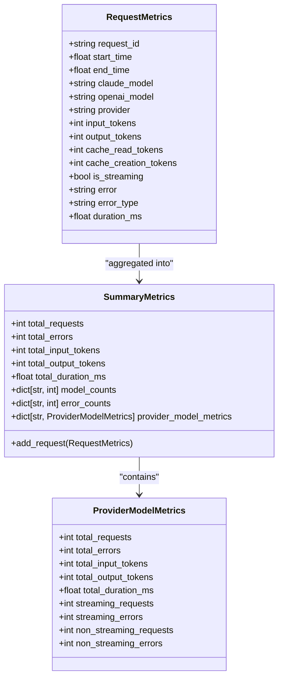
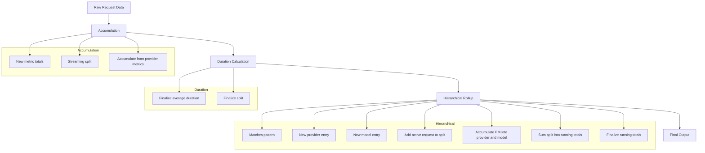
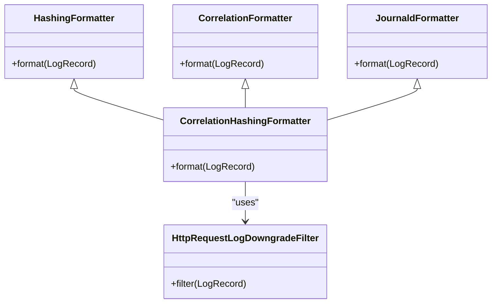
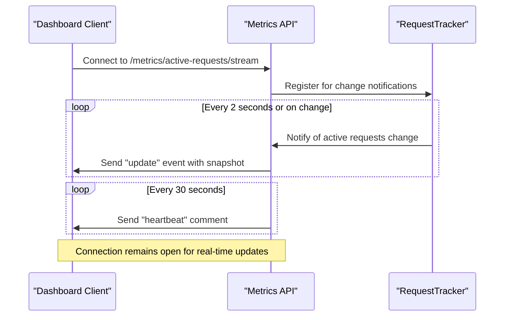
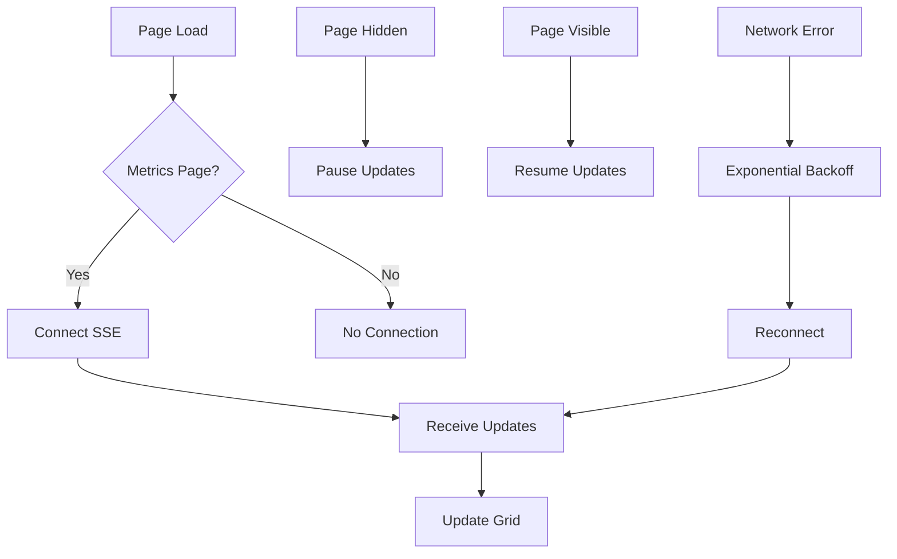

# Observability

<cite>
**Referenced Files in This Document**   
- [request.py](file://src/core/metrics/models/request.py)
- [provider.py](file://src/core/metrics/models/provider.py)
- [summary.py](file://src/core/metrics/models/summary.py)
- [accumulation.py](file://src/core/metrics/calculations/accumulation.py)
- [duration.py](file://src/core/metrics/calculations/duration.py)
- [hierarchical.py](file://src/core/metrics/calculations/hierarchical.py)
- [tracker.py](file://src/core/metrics/tracker/tracker.py)
- [configuration.py](file://src/core/logging/configuration.py)
- [correlation.py](file://src/core/logging/formatters/correlation.py)
- [base.py](file://src/core/logging/formatters/base.py)
- [http.py](file://src/core/logging/filters/http.py)
- [metrics.py](file://src/api/metrics.py)
- [25-vdm-metrics-active-requests.js](file://assets/ag_grid/25-vdm-metrics-active-requests.js)
- [26-vdm-active-requests-sse.js](file://assets/ag_grid/26-vdm-active-requests-sse.js)
- [10-vdm-grid-renderers.js](file://assets/ag_grid/10-vdm-grid-renderers.js)
- [metrics.py](file://src/dashboard/pages/metrics.py)
- [metrics.py](file://src/dashboard/services/metrics.py)
</cite>

## Table of Contents
1. [Metrics Collection System](#metrics-collection-system)
2. [Metrics Models and Data Aggregation](#metrics-models-and-data-aggregation)
3. [Logging Framework](#logging-framework)
4. [Active Requests Monitoring with SSE](#active-requests-monitoring-with-sse)
5. [External Monitoring Integration](#external-monitoring-integration)
6. [Log Analysis and Metrics Interpretation](#log-analysis-and-metrics-interpretation)
7. [Performance Monitoring and Alerting](#performance-monitoring-and-alerting)
8. [Conclusion](#conclusion)

## Metrics Collection System

The observability system in the Vandamme proxy collects comprehensive metrics on request volume, token usage, latency, and error rates. The metrics collection is centered around the RequestTracker class, which maintains both active and completed request data in memory. The system tracks key performance indicators including request counts, token usage (input, output, cache read, and cache creation), duration, tool usage, and error rates.

The metrics system is designed to be process-local, meaning metrics are reset on process restart. This design choice aligns with the existing behavior of the application. The RequestTracker maintains two types of state: active requests (in-flight) stored in the active_requests dictionary, and completed requests aggregated into summary_metrics. This separation allows for real-time monitoring of ongoing requests while maintaining historical data for analysis.

The metrics collection is configurable through environment variables, with LOG_REQUEST_METRICS controlling whether request metrics are collected at all. When enabled, the system automatically tracks all API requests, capturing detailed information about each interaction with the proxy. The metrics endpoint provides access to this data through various endpoints that serve different use cases, from real-time monitoring to historical analysis.

**Section sources**
- [tracker.py](file://src/core/metrics/tracker/tracker.py#L1-L490)
- [metrics.py](file://src/api/metrics.py#L1-L263)

## Metrics Models and Data Aggregation

### Core Metrics Models

The metrics system is built around a well-defined data model implemented in the src/core/metrics/models/ directory. The system uses three primary data classes to represent different levels of metric aggregation:

**Diagram sources**
- [request.py](file://src/core/metrics/models/request.py#L9-L56)
- [provider.py](file://src/core/metrics/models/provider.py#L11-L47)
- [summary.py](file://src/core/metrics/models/summary.py#L16-L219)

The RequestMetrics class captures data for individual requests, including timing information, token usage, and error details. The duration_ms property is calculated from start and end timestamps, providing a convenient way to access request latency. The ProviderModelMetrics class aggregates data at the provider-model level, maintaining separate counters for streaming and non-streaming requests. This separation allows for detailed analysis of performance differences between these request types.

The SummaryMetrics class serves as the top-level aggregation container, combining data from all completed requests. It maintains global totals while also preserving the provider-model breakdown. The add_request method is responsible for updating all relevant counters when a request completes, ensuring data consistency across the entire metrics hierarchy.

### Data Aggregation and Calculation

The metrics system employs a sophisticated aggregation pipeline that transforms raw request data into meaningful insights. The aggregation process is implemented across multiple modules in the src/core/metrics/calculations/ directory, each responsible for a specific aspect of the calculation:

**Diagram sources**
- [accumulation.py](file://src/core/metrics/calculations/accumulation.py#L1-L84)
- [duration.py](file://src/core/metrics/calculations/duration.py#L1-L25)
- [hierarchical.py](file://src/core/metrics/calculations/hierarchical.py#L1-L125)

The aggregation process begins with accumulation, where individual request metrics are added to appropriate counters based on request characteristics. The system maintains separate totals for streaming and non-streaming requests, allowing for detailed performance analysis. The duration module calculates average request durations from total duration and request counts, ensuring that latency metrics are accurate and meaningful.

The hierarchical module is responsible for organizing metrics into a provider→model structure that can be easily consumed by the dashboard and external monitoring systems. This module implements wildcard pattern matching for filtering, ensuring that users can easily focus on specific providers or models of interest. The final output is structured as a hierarchical data structure that preserves the relationships between providers, models, and their respective metrics.

**Section sources**
- [accumulation.py](file://src/core/metrics/calculations/accumulation.py#L1-L84)
- [duration.py](file://src/core/metrics/calculations/duration.py#L1-L25)
- [hierarchical.py](file://src/core/metrics/calculations/hierarchical.py#L1-L125)
- [summary.py](file://src/core/metrics/models/summary.py#L16-L219)

## Logging Framework

### Structured JSON Logging

The Vandamme proxy implements a comprehensive structured logging framework that provides detailed insights into system operations. The logging system is configured in src/core/logging/configuration.py and follows best practices for observability in distributed systems. All log messages are structured with consistent formatting, making them easy to parse and analyze with external tools.

The logging configuration is centralized in the configure_root_logging function, which sets up handlers for both console and syslog output. The system intelligently detects the presence of /dev/log to determine whether to use syslog or fall back to console logging. This adaptive behavior ensures that the proxy can operate effectively in various deployment environments, from local development to production containers.

**Diagram sources**
- [configuration.py](file://src/core/logging/configuration.py#L1-L144)
- [correlation.py](file://src/core/logging/formatters/correlation.py#L1-L31)
- [base.py](file://src/core/logging/formatters/base.py#L1-L20)
- [http.py](file://src/core/logging/filters/http.py#L1-L36)

### Correlation IDs and Request Tracing

A key feature of the logging framework is the use of correlation IDs to enable end-to-end request tracing. Each request is assigned a unique correlation ID that is included in all log messages related to that request. This allows operations teams to easily track the flow of a request through the system, making it much simpler to diagnose issues and understand system behavior.

The correlation ID is rendered as an 8-character prefix in log messages, making it easy to identify related log entries at a glance. This approach balances readability with the need for unique identification, as the full correlation ID is preserved in the underlying log record for more detailed analysis when needed.

The CorrelationHashingFormatter class is responsible for adding the correlation ID prefix and hashing sensitive information like API keys. This dual functionality ensures that logs are both useful for debugging and secure by default, preventing accidental exposure of sensitive credentials in log output.

### Log Level Management

The logging system implements sophisticated log level management to balance verbosity with signal-to-noise ratio. By default, the system suppresses INFO-level logs from noisy HTTP client libraries like httpx and httpcore unless the global log level is set to DEBUG. This prevents routine HTTP request/response logging from overwhelming the application logs while still making this information available when needed for debugging.

The HttpRequestLogDowngradeFilter class implements this behavior by intercepting log records from specified noisy loggers and downgrading their level from INFO to DEBUG. This ensures that these messages are only visible when the system is running in debug mode, keeping production logs clean and focused on application-level events.

The system also provides a mechanism for emitting periodic summary logs that aggregate key metrics over a configurable interval (default 100 requests). These summary logs provide a high-level view of system performance without requiring analysis of individual request logs, making it easier to spot trends and identify potential issues.

**Section sources**
- [configuration.py](file://src/core/logging/configuration.py#L1-L144)
- [correlation.py](file://src/core/logging/formatters/correlation.py#L1-L31)
- [base.py](file://src/core/logging/formatters/base.py#L1-L20)
- [http.py](file://src/core/logging/filters/http.py#L1-L36)

## Active Requests Monitoring with SSE

### Server-Sent Events Architecture

The Vandamme proxy includes a real-time monitoring system for active requests using Server-Sent Events (SSE). This system provides a live view of in-flight requests, enabling operations teams to monitor system load and identify potential bottlenecks as they occur. The SSE implementation is located in src/api/metrics.py and assets/ag_grid/26-vdm-active-requests-sse.js.

**Diagram sources**
- [metrics.py](file://src/api/metrics.py#L81-L173)
- [26-vdm-active-requests-sse.js](file://assets/ag_grid/26-vdm-active-requests-sse.js#L1-L316)

The SSE endpoint (/metrics/active-requests/stream) creates a persistent connection with the client, pushing updates whenever the set of active requests changes. This push-based architecture ensures that the dashboard view is always up-to-date without requiring frequent polling, reducing both network overhead and server load.

The system uses a condition variable with a monotonic version counter to ensure reliable delivery of updates. This approach avoids the edge-triggered nature of asyncio.Event, which could potentially miss updates if they occur between wait calls. Instead, each waiter tracks the last version it has seen and waits for a new version, guaranteeing that at least one change is observed.

### JavaScript Client Implementation

The client-side implementation of the active requests monitoring is handled by JavaScript code in the assets/ag_grid/ directory. The 26-vdm-active-requests-sse.js file contains the core SSE client logic, while 25-vdm-metrics-active-requests.js handles the display of request duration information.

The JavaScript client establishes an EventSource connection to the SSE endpoint and listens for three types of events:
- update: Contains a snapshot of current active requests
- disabled: Indicates that metrics are disabled (sent once, then stream closes)
- heartbeat: A keep-alive comment sent every 30 seconds to prevent connection timeouts

The client implements several reliability features, including automatic reconnection with exponential backoff in case of network failures, and buffering of the latest snapshot to ensure the grid is updated as soon as it becomes available. The connection is automatically managed based on page visibility and navigation, disconnecting when the user navigates away from the metrics page and reconnecting when they return.

**Diagram sources**
- [26-vdm-active-requests-sse.js](file://assets/ag_grid/26-vdm-active-requests-sse.js#L1-L316)
- [25-vdm-metrics-active-requests.js](file://assets/ag_grid/25-vdm-metrics-active-requests.js#L1-L95)

### Duration Display and Formatting

The active requests grid includes a duration column that displays how long each request has been in progress. This information is updated client-side using a separate ticker system implemented in 25-vdm-metrics-active-requests.js. The duration display uses the same recency dot renderer as other parts of the dashboard for visual consistency, but with text showing elapsed time rather than time since.

The duration ticker runs at a configurable interval (default 2 seconds) and can be adjusted by the user through the dashboard interface. The implementation uses requestAnimationFrame for smooth updates and respects the page visibility state to conserve resources when the dashboard is not visible. The duration is calculated using performance.now() for high precision and is formatted using a human-readable format (e.g., "12s", "3m 04s").

The JavaScript code also handles the formatting of provider badges with appropriate colors, request IDs, and other metadata. The grid row data is transformed from the API response format to the AG Grid format, ensuring that all necessary information is available for rendering while maintaining data consistency.

**Section sources**
- [25-vdm-metrics-active-requests.js](file://assets/ag_grid/25-vdm-metrics-active-requests.js#L1-L95)
- [26-vdm-active-requests-sse.js](file://assets/ag_grid/26-vdm-active-requests-sse.js#L1-L316)
- [10-vdm-grid-renderers.js](file://assets/ag_grid/10-vdm-grid-renderers.js#L1-L320)
- [metrics.py](file://src/dashboard/pages/metrics.py#L1-L210)

## External Monitoring Integration

### Prometheus and Grafana Integration

The Vandamme proxy provides several endpoints that facilitate integration with external monitoring systems like Prometheus and Grafana. The primary integration point is the /metrics/running-totals endpoint, which returns metrics data in YAML format that can be easily scraped and processed by monitoring tools.

To integrate with Prometheus, operations teams can configure a scrape job that periodically polls the running totals endpoint and converts the YAML response into Prometheus metrics format. The hierarchical structure of the data, with clear provider and model breakdowns, maps naturally to Prometheus labels, enabling detailed analysis and alerting based on specific providers or models.

For Grafana visualization, the metrics data can be used to create dashboards that track key performance indicators over time. The system's support for filtering by provider and model allows for the creation of focused dashboards that monitor specific aspects of the proxy's operation. The active requests SSE stream can also be integrated with Grafana using the Grafana Live feature for real-time monitoring.

### ELK Stack Integration

The structured JSON logging framework makes the Vandamme proxy well-suited for integration with the ELK (Elasticsearch, Logstash, Kibana) stack. The consistent log format, including correlation IDs and structured metadata, enables powerful search and analysis capabilities in Kibana.

Operations teams can configure Logstash to collect logs from the proxy (either from syslog or console output) and index them in Elasticsearch. The correlation IDs allow for easy tracing of individual requests across multiple log entries, while the structured fields enable faceted search and aggregation in Kibana.

The periodic summary logs provide a convenient way to track aggregate metrics in the ELK stack without the need for complex log processing. These logs can be used to create time-series visualizations in Kibana that show trends in request volume, token usage, and error rates over time.

### Dashboard and API Endpoints

The proxy exposes several API endpoints that provide different views of the metrics data, each optimized for specific use cases:

- /metrics/running-totals: Returns hierarchical metrics data in YAML format, ideal for external monitoring integration
- /metrics/active-requests: Returns a snapshot of currently active requests in JSON format
- /metrics/active-requests/stream: Provides a real-time SSE stream of active requests
- /metrics/logs: Returns recent errors and request traces for troubleshooting

These endpoints can be used directly by external monitoring systems or as the basis for custom integration scripts. The YAML format used by the running totals endpoint is particularly well-suited for configuration management tools and can be easily processed by a wide range of programming languages.

**Section sources**
- [metrics.py](file://src/api/metrics.py#L1-L263)
- [configuration.py](file://src/core/logging/configuration.py#L1-L144)

## Log Analysis and Metrics Interpretation

### Interpreting Summary Metrics

The summary metrics provided by the Vandamme proxy offer valuable insights into system performance and usage patterns. The key metrics to monitor include:

- **Request Volume**: Total requests and requests per provider/model indicate usage patterns and potential load imbalances
- **Token Usage**: Input and output token counts help identify expensive requests and optimize cost management
- **Latency**: Average duration and duration distribution reveal performance bottlenecks and help identify slow providers or models
- **Error Rates**: Total errors and error distribution by type help identify reliability issues and guide troubleshooting efforts
- **Caching Efficiency**: Cache read and creation token counts indicate how effectively the system is leveraging caching to reduce costs and improve performance

When analyzing these metrics, it's important to consider them in context. For example, a high error rate might be acceptable for a rarely-used experimental model but would be concerning for a primary production model. Similarly, high latency might be expected for complex requests with large context windows.

### Identifying Performance Issues

The metrics system provides several indicators that can help identify performance issues:

1. **Increasing Latency**: A rising trend in average duration may indicate resource constraints, network issues, or problems with upstream providers.

2. **Error Spikes**: Sudden increases in error rates, particularly for specific providers or models, may indicate service degradation or configuration issues.

3. **Imbalanced Load**: Significant disparities in request volume between providers or models may indicate routing issues or unexpected usage patterns.

4. **Caching Inefficiency**: Low cache read-to-creation ratios may indicate that the caching strategy needs optimization or that requests are too diverse to benefit from caching.

5. **Streaming vs. Non-Streaming Differences**: Significant performance differences between streaming and non-streaming requests may indicate issues with the streaming implementation or upstream provider behavior.

### Correlation ID Analysis

The correlation ID system enables powerful troubleshooting capabilities. When investigating an issue, operations teams can:

1. Identify the correlation ID from an error message or user report
2. Search logs for all entries with that correlation ID prefix
3. Trace the complete flow of the request through the system
4. Identify the specific component or upstream service that caused the issue

This end-to-end tracing capability is particularly valuable for diagnosing intermittent issues that may be difficult to reproduce. By examining the complete request lifecycle, teams can often identify patterns or conditions that contribute to failures.

**Section sources**
- [tracker.py](file://src/core/metrics/tracker/tracker.py#L1-L490)
- [configuration.py](file://src/core/logging/configuration.py#L1-L144)
- [correlation.py](file://src/core/logging/formatters/correlation.py#L1-L31)

## Performance Monitoring and Alerting

### Key Performance Indicators

To effectively monitor the Vandamme proxy, operations teams should establish alerts based on the following key performance indicators:

- **Error Rate Thresholds**: Alert when error rates exceed predefined thresholds (e.g., >5% of requests failing)
- **Latency SLOs**: Alert when average latency exceeds service level objectives
- **Request Volume Anomalies**: Alert on sudden spikes or drops in request volume that may indicate issues
- **Resource Utilization**: Monitor process memory and CPU usage to identify potential resource constraints
- **Active Request Backlog**: Alert when the number of active requests exceeds a threshold, indicating potential performance issues

These alerts should be configured with appropriate thresholds and time windows to balance sensitivity with noise reduction. For example, latency alerts might use a rolling average over 5 minutes rather than instantaneous values to avoid false positives from temporary spikes.

### Alerting Strategies

Effective alerting requires a tiered approach that balances urgency with actionable information:

1. **Critical Alerts**: Immediate notifications for issues that require immediate attention, such as complete service outages or severe performance degradation.

2. **Warning Alerts**: Notifications for issues that should be addressed but do not require immediate intervention, such as gradually increasing error rates.

3. **Informational Alerts**: Notifications for significant events that may require follow-up but do not indicate immediate problems, such as major configuration changes.

Alerts should include sufficient context to enable rapid diagnosis, including relevant metrics, timestamps, and links to detailed logs or dashboards. The use of correlation IDs in alerts can significantly accelerate troubleshooting by providing a direct link to the relevant log entries.

### Dashboard Best Practices

The built-in dashboard provides a comprehensive view of proxy performance, but operations teams should customize it to focus on their specific needs. Recommended practices include:

- **Custom Views**: Create filtered views that focus on specific providers, models, or request types relevant to the organization's usage patterns.
- **Historical Comparison**: Use the dashboard to compare current performance with historical baselines to identify trends.
- **Drill-Down Capability**: Ensure that dashboard elements support drill-down to detailed logs and metrics for deeper analysis.
- **Real-Time Monitoring**: Use the active requests view during peak usage periods to monitor system load and identify potential bottlenecks.

Regular review of the dashboard should be part of operational procedures, with scheduled check-ins to ensure ongoing system health and identify potential issues before they impact users.

**Section sources**
- [metrics.py](file://src/api/metrics.py#L1-L263)
- [tracker.py](file://src/core/metrics/tracker/tracker.py#L1-L490)
- [configuration.py](file://src/core/logging/configuration.py#L1-L144)

## Conclusion

The observability system in the Vandamme proxy provides comprehensive monitoring capabilities that enable operations teams to effectively manage, troubleshoot, and optimize the proxy's performance. The system combines detailed metrics collection, structured logging, and real-time monitoring to provide a complete picture of system behavior.

Key strengths of the observability system include:
- Comprehensive metrics collection covering request volume, token usage, latency, and error rates
- Structured logging with correlation IDs for end-to-end request tracing
- Real-time monitoring of active requests through Server-Sent Events
- Flexible integration with external monitoring systems like Prometheus, Grafana, and the ELK stack
- Built-in dashboard for immediate visibility into system performance

By leveraging these capabilities, operations teams can ensure the reliability and performance of the proxy, quickly identify and resolve issues, and make data-driven decisions about system optimization and capacity planning. The system's design balances detailed insight with operational simplicity, providing the information needed to maintain a high-performing, reliable service.