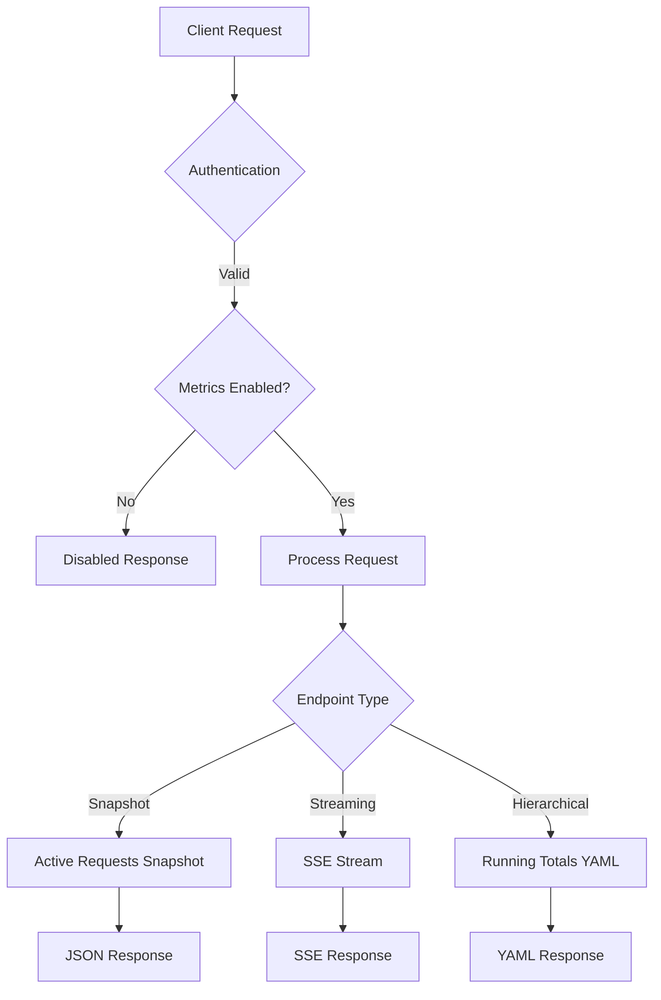
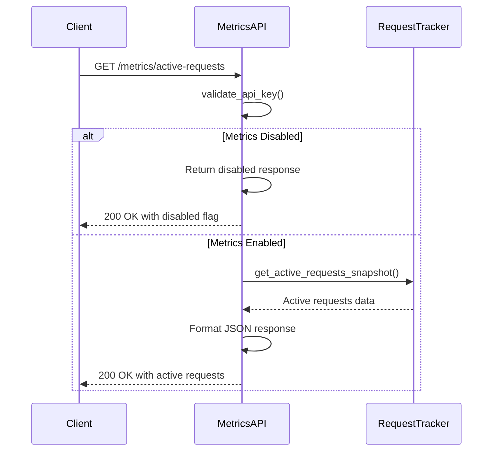
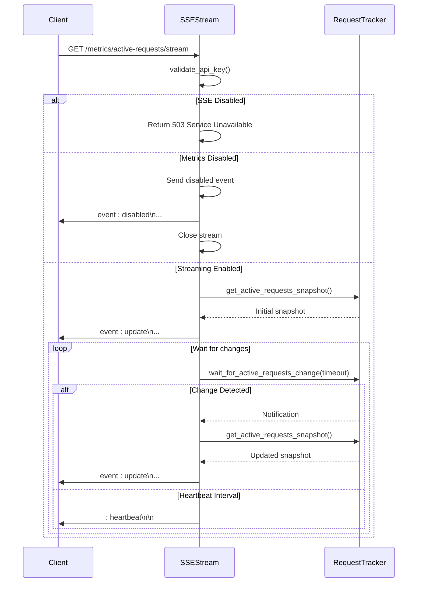
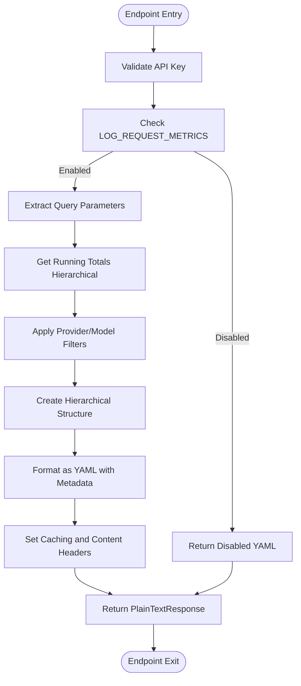
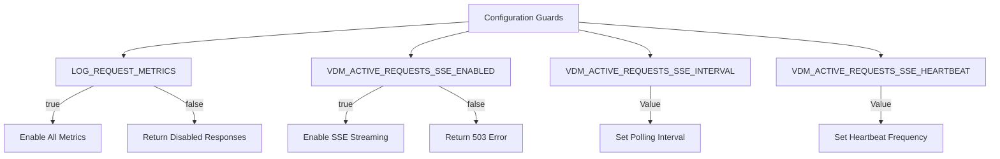

# API Exposure Layer

<cite>
**Referenced Files in This Document**   
- [metrics.py](file://src/api/metrics.py)
- [endpoints.py](file://src/api/endpoints.py)
- [yaml_formatter.py](file://src/api/utils/yaml_formatter.py)
- [streaming.py](file://src/api/services/streaming.py)
- [config.py](file://src/core/config.py)
- [tracker.py](file://src/core/metrics/tracker/tracker.py)
</cite>

## Table of Contents
1. [Introduction](#introduction)
2. [Core Metrics Endpoints](#core-metrics-endpoints)
3. [Active Requests Snapshot Endpoint](#active-requests-snapshot-endpoint)
4. [Server-Sent Events Streaming Endpoint](#server-sent-events-streaming-endpoint)
5. [Running Totals YAML Endpoint](#running-totals-yaml-endpoint)
6. [Configuration Guards](#configuration-guards)
7. [Error Handling Strategies](#error-handling-strategies)
8. [Security Considerations](#security-considerations)
9. [Client-Side Implementation](#client-side-implementation)
10. [Performance and Caching](#performance-and-caching)

## Introduction

The metrics API endpoints in Vandamme Proxy provide comprehensive monitoring and observability capabilities for tracking active requests, streaming real-time updates, and retrieving hierarchical running totals. These endpoints serve as the foundation for the dashboard and monitoring tools, enabling users to gain insights into system performance, request patterns, and resource utilization. The API layer exposes three key endpoints that cater to different monitoring needs: snapshot-based active requests, Server-Sent Events (SSE) for real-time streaming, and YAML-formatted running totals with filtering capabilities.

The metrics system is designed with extensibility and performance in mind, incorporating configuration guards that allow administrators to enable or disable specific features based on operational requirements. Authentication is uniformly enforced across all endpoints through the validate_api_key dependency, ensuring that only authorized clients can access sensitive metrics data. The implementation leverages asynchronous programming patterns to handle concurrent requests efficiently while maintaining low latency for time-sensitive operations.

**Section sources**
- [metrics.py](file://src/api/metrics.py#L1-L263)

## Core Metrics Endpoints

The metrics API exposes three primary endpoints that serve different monitoring and observability purposes. These endpoints are designed to work together to provide a comprehensive view of system activity and performance metrics. Each endpoint serves a specific use case, from immediate snapshots to real-time streaming and detailed hierarchical reporting.

The endpoint architecture follows a consistent pattern of authentication, configuration validation, and response formatting. All endpoints require API key validation through the validate_api_key dependency and respect the LOG_REQUEST_METRICS configuration flag, which acts as a master switch for metrics collection and exposure. The response formats are tailored to their respective use cases, with JSON for structured data, Server-Sent Events for real-time updates, and YAML for human-readable hierarchical reports.



**Diagram sources**
- [metrics.py](file://src/api/metrics.py#L1-L263)

**Section sources**
- [metrics.py](file://src/api/metrics.py#L1-L263)

## Active Requests Snapshot Endpoint

The `/metrics/active-requests` endpoint provides a snapshot of currently in-flight requests, returning a JSON response containing detailed information about each active request. This endpoint is designed for clients that need an immediate view of system activity without establishing a persistent connection. The response includes metadata about the request state, timing, and associated metrics, making it suitable for dashboard displays and periodic polling scenarios.

The endpoint implementation first checks the LOG_REQUEST_METRICS configuration flag to determine if metrics collection is enabled. When disabled, it returns a standardized response indicating the disabled state with a suggestion for enabling metrics. When enabled, it retrieves the current snapshot of active requests from the request tracker and formats it as a JSON response with appropriate caching headers to prevent client-side caching.



**Diagram sources**
- [metrics.py](file://src/api/metrics.py#L53-L78)

**Section sources**
- [metrics.py](file://src/api/metrics.py#L53-L78)

## Server-Sent Events Streaming Endpoint

The `/metrics/active-requests/stream` endpoint implements Server-Sent Events (SSE) to provide real-time updates of active requests with a push-on-change pattern. This endpoint establishes a persistent connection that streams updates whenever the state of active requests changes, ensuring clients receive immediate notifications of new requests starting or completing. The implementation uses a sophisticated event model with three distinct event types: update, disabled, and heartbeat.

The streaming mechanism leverages the wait_for_active_requests_change() method from the request tracker, which uses a condition variable with a monotonic version counter to ensure that clients receive updates even if multiple changes occur between polling intervals. This approach prevents missed updates that could occur with simple edge-triggered events. The stream emits an initial snapshot immediately upon connection, followed by incremental updates only when the request state actually changes, optimizing bandwidth usage.



**Diagram sources**
- [metrics.py](file://src/api/metrics.py#L81-L173)
- [tracker.py](file://src/core/metrics/tracker/tracker.py#L256-L290)

**Section sources**
- [metrics.py](file://src/api/metrics.py#L81-L173)

## Running Totals YAML Endpoint

The `/metrics/running-totals` endpoint provides hierarchical aggregation of request metrics in YAML format, offering a comprehensive view of system usage patterns across providers and models. This endpoint supports optional filtering through query parameters for provider and model, with case-insensitive wildcard matching using * and ? patterns. The response structure organizes data hierarchically with summary statistics at the top level, followed by provider-specific breakdowns and model-level details.

The implementation uses a two-step process: first retrieving hierarchical data from the request tracker with optional filtering, then formatting it as YAML using specialized utilities. The create_hierarchical_structure function transforms flat metrics data into a nested dictionary structure, while format_running_totals_yaml applies pretty-printing with comments, metadata, and optimized formatting for readability. The endpoint also includes filename suggestions in the Content-Disposition header for client-side handling.



**Diagram sources**
- [metrics.py](file://src/api/metrics.py#L176-L262)
- [yaml_formatter.py](file://src/api/utils/yaml_formatter.py#L82-L167)

**Section sources**
- [metrics.py](file://src/api/metrics.py#L176-L262)

## Configuration Guards

The metrics endpoints are controlled by several configuration guards that allow administrators to enable or disable specific features based on operational requirements. These guards are implemented as environment variables that are evaluated at runtime, providing flexibility in different deployment environments. The primary configuration guards include LOG_REQUEST_METRICS, which acts as a master switch for all metrics collection and exposure, and VDM_ACTIVE_REQUESTS_SSE_ENABLED, which specifically controls the availability of the Server-Sent Events streaming endpoint.

The LOG_REQUEST_METRICS guard affects all metrics endpoints, returning disabled responses when set to false. This allows administrators to completely disable metrics collection for performance or privacy reasons. The VDM_ACTIVE_REQUESTS_SSE_ENABLED guard specifically controls the SSE streaming endpoint, returning a 503 Service Unavailable response when disabled. Additional configuration parameters like VDM_ACTIVE_REQUESTS_SSE_INTERVAL and VDM_ACTIVE_REQUESTS_SSE_HEARTBEAT allow fine-tuning of the streaming behavior, controlling the polling interval and heartbeat frequency.



**Diagram sources**
- [config.py](file://src/core/config.py#L84-L149)
- [metrics.py](file://src/api/metrics.py#L18-L19)

**Section sources**
- [config.py](file://src/core/config.py#L84-L149)

## Error Handling Strategies

The metrics endpoints implement comprehensive error handling strategies to ensure reliable operation and meaningful error reporting. Each endpoint includes try-catch blocks to handle exceptions that may occur during processing, with appropriate logging and response formatting. For the streaming endpoint, special consideration is given to asyncio.CancelledError, which indicates client disconnection, allowing for clean resource cleanup without propagating the error.

The running totals endpoint specifically handles exceptions by returning error information formatted as YAML, maintaining consistency with the expected response format. This approach ensures that clients can parse the response even when errors occur, providing actionable feedback for troubleshooting. The streaming endpoint implements a push-on-change pattern that minimizes unnecessary network traffic while ensuring clients receive timely updates when request states change.

For SSE streams, the implementation includes a heartbeat mechanism that sends keep-alive comments every 30 seconds (configurable via VDM_ACTIVE_REQUESTS_SSE_HEARTBEAT) to prevent connection timeouts in environments with aggressive network timeouts. This heartbeat is implemented as a comment line (: heartbeat\n\n) that does not trigger client event handlers but keeps the TCP connection alive.

**Section sources**
- [metrics.py](file://src/api/metrics.py#L254-L262)
- [metrics.py](file://src/api/metrics.py#L165-L171)

## Security Considerations

The metrics endpoints incorporate several security measures to protect sensitive operational data and prevent abuse. Authentication is enforced through the validate_api_key dependency, which checks for valid API keys in either the x-api-key header or Authorization header (Bearer token). When PROXY_API_KEY is configured in the environment, the endpoint validates that the provided client API key matches the expected value, preventing unauthorized access.

For environments where API key validation is not required, the endpoint can operate in an open mode by omitting the PROXY_API_KEY environment variable. However, this configuration is not recommended for production deployments. The endpoints also respect the principle of least privilege by only exposing metrics data and not including sensitive information such as full request payloads or client IP addresses in the responses.

Rate limiting considerations are particularly important for the SSE streaming endpoint, as persistent connections can consume server resources. While the current implementation does not include explicit rate limiting, the configuration guards provide a mechanism to disable the streaming endpoint entirely if resource constraints become an issue. Administrators should monitor connection counts and consider implementing reverse proxy-level rate limiting for high-traffic deployments.

**Section sources**
- [endpoints.py](file://src/api/endpoints.py#L112-L138)
- [metrics.py](file://src/api/metrics.py#L29-L30)

## Client-Side Implementation

Consuming the metrics endpoints requires specific client-side implementations tailored to each endpoint's response format and behavior. For the SSE streaming endpoint, clients should implement proper connection handling with automatic reconnection logic to handle network interruptions. The stream emits three types of events: update (for active request snapshots), disabled (when metrics are disabled), and heartbeat (keep-alive comments), each requiring appropriate handling.

The following curl example demonstrates how to consume the SSE stream while properly handling different event types:

```bash
curl -H "x-api-key: your-api-key" \
     http://localhost:8082/metrics/active-requests/stream \
     --no-buffer | while IFS= read -r line; do
    if [[ "$line" == "event: update"* ]]; then
        echo "[$(date)] Update received"
        # Process update data
    elif [[ "$line" == "event: disabled"* ]]; then
        echo "[$(date)] Metrics disabled"
        break
    elif [[ "$line" == ": heartbeat"* ]]; then
        echo "[$(date)] Heartbeat received"
    elif [[ "$line" == "data: "* ]]; then
        # Extract and process JSON data
        data=$(echo "$line" | sed 's/data: //')
        echo "[$(date)] Data: $data"
    fi
done
```

For the YAML endpoint, clients should use a YAML parser to process the hierarchical response, taking advantage of the structured format to extract summary statistics, provider breakdowns, and model-level details. The response includes metadata comments that can be used for display purposes or logging.

**Section sources**
- [metrics.py](file://src/api/metrics.py#L86-L95)
- [metrics.py](file://src/api/metrics.py#L199-L207)

## Performance and Caching

The metrics endpoints are designed with performance considerations in mind, implementing caching headers to prevent client-side caching of dynamic content. All responses include Cache-Control: no-cache headers to ensure clients always receive the most current data. This is particularly important for the active requests endpoints, where stale data could lead to incorrect monitoring conclusions.

The streaming endpoint implements a push-on-change pattern that optimizes network usage by only sending updates when the active request state actually changes. This approach minimizes bandwidth consumption while ensuring clients receive timely notifications. The wait_for_active_requests_change() method uses a condition variable with a monotonic version counter, preventing missed updates that could occur with simple edge-triggered events.

For high-traffic deployments, administrators should monitor the resource usage of the SSE streaming endpoint, as each connected client maintains a persistent connection. The configurable heartbeat interval (VDM_ACTIVE_REQUESTS_SSE_HEARTBEAT) allows tuning of keep-alive frequency to balance connection stability with network overhead. The initial implementation does not include connection pooling or rate limiting, so reverse proxy-level controls may be necessary for large-scale deployments.

**Section sources**
- [metrics.py](file://src/api/metrics.py#L69-L70)
- [metrics.py](file://src/api/metrics.py#L246-L247)