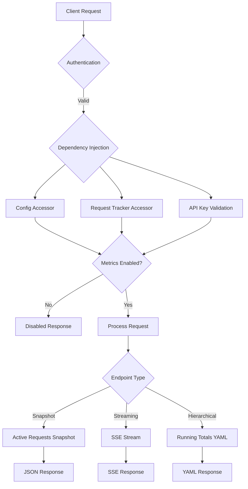

# API Exposure Layer

<cite>
**Referenced Files in This Document**   
- [metrics.py](file://src/api/metrics.py)
- [endpoints.py](file://src/api/endpoints.py)
- [yaml_formatter.py](file://src/api/utils/yaml_formatter.py)
- [streaming.py](file://src/api/services/streaming.py)
- [config.py](file://src/core/config.py)
- [runtime.py](file://src/core/metrics/runtime.py)
- [metrics_orchestrator.py](file://src/api/services/metrics_orchestrator.py)
- [main.py](file://src/main.py)
- [runtime.py](file://src/core/config/runtime.py)
- [runtime.py](file://src/api/models_cache_runtime.py)
- [runtime.py](file://src/core/model_manager_runtime.py)
</cite>

## Update Summary
**Changes Made**   
- Updated dependency injection patterns section to reflect FastAPI Depends() usage
- Added service layer architecture documentation with MetricsOrchestrator
- Enhanced centralized request handling explanation
- Updated configuration guards section with new accessor pattern
- Revised error handling strategies to include service layer improvements
- Enhanced security considerations with dependency injection benefits

## Table of Contents
1. [Introduction](#introduction)
2. [Core Metrics Endpoints](#core-metrics-endpoints)
3. [Active Requests Snapshot Endpoint](#active-requests-snapshot-endpoint)
4. [Server-Sent Events Streaming Endpoint](#server-sent-events-streaming-endpoint)
5. [Running Totals YAML Endpoint](#running-totals-yaml-endpoint)
6. [Dependency Injection Patterns](#dependency-injection-patterns)
7. [Service Layer Architecture](#service-layer-architecture)
8. [Centralized Request Handling](#centralized-request-handling)
9. [Configuration Guards](#configuration-guards)
10. [Error Handling Strategies](#error-handling-strategies)
11. [Security Considerations](#security-considerations)
12. [Client-Side Implementation](#client-side-implementation)
13. [Performance and Caching](#performance-and-caching)

## Introduction

The metrics API endpoints in Vandamme Proxy provide comprehensive monitoring and observability capabilities for tracking active requests, streaming real-time updates, and retrieving hierarchical running totals. These endpoints serve as the foundation for the dashboard and monitoring tools, enabling users to gain insights into system performance, request patterns, and resource utilization.

The metrics system has evolved to use modern FastAPI dependency injection patterns, where endpoints receive dependencies via `Depends()` rather than module imports. This architectural shift improves testability, eliminates hidden global state dependencies, and provides better separation of concerns through a centralized service layer. The implementation leverages asynchronous programming patterns to handle concurrent requests efficiently while maintaining low latency for time-sensitive operations.

**Section sources**
- [metrics.py](file://src/api/metrics.py#L1-L266)

## Core Metrics Endpoints

The metrics API exposes three primary endpoints that serve different monitoring and observability purposes. These endpoints follow a consistent dependency injection pattern, receiving all required dependencies through FastAPI's `Depends()` mechanism rather than direct imports.

The endpoint architecture incorporates centralized configuration access through `get_config()` and runtime accessors for shared services. All endpoints require API key validation through the `validate_api_key` dependency and respect the `LOG_REQUEST_METRICS` configuration flag, which acts as a master switch for metrics collection and exposure.



**Diagram sources**
- [metrics.py](file://src/api/metrics.py#L54-L80)
- [metrics.py](file://src/api/metrics.py#L83-L176)
- [metrics.py](file://src/api/metrics.py#L179-L265)

**Section sources**
- [metrics.py](file://src/api/metrics.py#L54-L265)

## Active Requests Snapshot Endpoint

The `/metrics/active-requests` endpoint provides a snapshot of currently in-flight requests, returning a JSON response containing detailed information about each active request. This endpoint demonstrates the new dependency injection pattern with explicit dependency declaration:

```python
@metrics_router.get("/active-requests")
async def get_active_requests(
    http_request: Request,
    cfg: Config = Depends(get_config),
    _: None = Depends(validate_api_key),
) -> JSONResponse:
```

The endpoint receives the `Config` instance through `get_config()` and performs API key validation through the `validate_api_key` dependency. The implementation first checks the `LOG_REQUEST_METRICS` configuration flag to determine if metrics collection is enabled. When disabled, it returns a standardized response indicating the disabled state with a suggestion for enabling metrics.

**Updated** Now uses centralized configuration access via `get_config()` and dependency injection pattern

**Section sources**
- [metrics.py](file://src/api/metrics.py#L54-L80)

## Server-Sent Events Streaming Endpoint

The `/metrics/active-requests/stream` endpoint implements Server-Sent Events (SSE) to provide real-time updates of active requests with a push-on-change pattern. This endpoint showcases the complete dependency injection architecture:

```python
@metrics_router.get("/active-requests/stream", response_model=None)
async def stream_active_requests(
    http_request: Request,
    cfg: Config = Depends(get_config),
    _: None = Depends(validate_api_key),
) -> StreamingResponse | JSONResponse:
```

The streaming endpoint receives both `Config` and API key validation dependencies through the dependency injection system. The implementation uses a sophisticated event model with three distinct event types: update, disabled, and heartbeat. The streaming mechanism leverages the `wait_for_active_requests_change()` method from the request tracker, which uses a condition variable with a monotonic version counter to ensure that clients receive updates even if multiple changes occur between polling intervals.

**Updated** Enhanced with comprehensive dependency injection pattern and centralized configuration access

**Section sources**
- [metrics.py](file://src/api/metrics.py#L83-L176)

## Running Totals YAML Endpoint

The `/metrics/running-totals` endpoint provides hierarchical aggregation of request metrics in YAML format, offering a comprehensive view of system usage patterns across providers and models. This endpoint demonstrates the service layer architecture with centralized request handling:

```python
@metrics_router.get("/running-totals")
async def get_running_totals(
    http_request: Request,
    provider: str | None = Query(
        None, description="Filter by provider (case-insensitive, supports * and ? wildcards)"
    ),
    model: str | None = Query(
        None, description="Filter by model (case-insensitive, supports * and ? wildcards)"
    ),
    include_active: bool = Query(
        True,
        description=(
            "Include in-flight requests in provider/model breakdown. "
            "Dash rollup grids should use include_active=false and rely on the "
            "Active Requests grid."
        ),
    ),
    _: None = Depends(validate_api_key),
) -> PlainTextResponse:
```

The endpoint uses a two-step process: first retrieving hierarchical data from the request tracker with optional filtering, then formatting it as YAML using specialized utilities. The `create_hierarchical_structure` function transforms flat metrics data into a nested dictionary structure, while `format_running_totals_yaml` applies pretty-printing with comments, metadata, and optimized formatting for readability.

**Updated** Now uses centralized dependency injection pattern with explicit service layer integration

**Section sources**
- [metrics.py](file://src/api/metrics.py#L179-L265)

## Dependency Injection Patterns

The metrics endpoints demonstrate modern FastAPI dependency injection patterns that replace traditional module imports with explicit dependency declarations. Each endpoint receives its dependencies through the `Depends()` mechanism, improving testability and eliminating hidden global state dependencies.

The dependency injection architecture follows these patterns:

1. **Configuration Access**: `cfg: Config = Depends(get_config)` - Centralized configuration access
2. **API Key Validation**: `_: None = Depends(validate_api_key)` - Authentication enforcement
3. **Runtime Accessors**: `tracker = get_request_tracker(http_request)` - Process-local service access

This approach provides several benefits:
- **Testability**: Dependencies can be easily mocked in unit tests
- **Explicit Contracts**: All dependencies are clearly declared in function signatures
- **Separation of Concerns**: Business logic is separated from infrastructure concerns
- **Flexibility**: Dependencies can be swapped or modified without changing endpoint logic

**Section sources**
- [metrics.py](file://src/api/metrics.py#L57-L58)
- [metrics.py](file://src/api/metrics.py#L86-L87)
- [metrics.py](file://src/api/metrics.py#L196)
- [runtime.py](file://src/core/config/runtime.py#L19-L32)

## Service Layer Architecture

The metrics system incorporates a centralized service layer architecture through the `MetricsOrchestrator` class, which handles the common pattern of metrics initialization, lifecycle management, and graceful degradation. This orchestrator encapsulates the dual-path logic (enabled pattern where code must work both when metrics are enabled and disabled), reducing cognitive load and preventing bugs from inconsistent handling.

The service layer provides several key benefits:
- **DRY Principle**: Single source of truth for metrics lifecycle
- **Graceful Degradation**: Works consistently when metrics are disabled
- **Type Safety**: Proper handling of optional metrics objects
- **Centralized Logic**: Common patterns are abstracted into reusable services

**Section sources**
- [metrics_orchestrator.py](file://src/api/services/metrics_orchestrator.py#L90-L285)

## Centralized Request Handling

The metrics endpoints leverage centralized request handling through runtime accessors that eliminate module-level singletons and hidden global state dependencies. The `get_request_tracker()` function provides access to the process-local `RequestTracker` instance owned by the FastAPI application, following the same pattern established for configuration and model management.

This centralized approach ensures:
- **Consistent Access**: All endpoints access shared services through the same pattern
- **Process Isolation**: Each process maintains its own request tracker instance
- **Type Safety**: Runtime validation ensures correct object types are returned
- **Error Prevention**: Clear error messages when services are not properly configured

**Section sources**
- [runtime.py](file://src/core/metrics/runtime.py#L20-L29)
- [main.py](file://src/main.py#L26-L28)

## Configuration Guards

The metrics endpoints are controlled by several configuration guards that allow administrators to enable or disable specific features based on operational requirements. These guards are implemented as environment variables that are evaluated at runtime through centralized accessors, providing flexibility in different deployment environments.

The configuration guard pattern uses the `get_config()` dependency injection pattern:
- `LOG_REQUEST_METRICS`: Master switch for all metrics collection and exposure
- `VDM_ACTIVE_REQUESTS_SSE_ENABLED`: Controls SSE streaming endpoint availability
- `VDM_ACTIVE_REQUESTS_SSE_INTERVAL`: Configures polling interval for streaming
- `VDM_ACTIVE_REQUESTS_SSE_HEARTBEAT`: Sets heartbeat frequency for SSE streams

**Updated** Now uses centralized configuration access via `get_config()` dependency injection pattern

**Section sources**
- [metrics.py](file://src/api/metrics.py#L62)
- [metrics.py](file://src/api/metrics.py#L100)
- [metrics.py](file://src/api/metrics.py#L117-L124)
- [runtime.py](file://src/core/config/runtime.py#L19-L32)

## Error Handling Strategies

The metrics endpoints implement comprehensive error handling strategies that benefit from the centralized service layer architecture. Each endpoint includes try-catch blocks to handle exceptions that may occur during processing, with appropriate logging and response formatting.

The running totals endpoint specifically handles exceptions by returning error information formatted as YAML, maintaining consistency with the expected response format. The streaming endpoint implements a push-on-change pattern that minimizes unnecessary network traffic while ensuring clients receive timely updates when request states change.

For SSE streams, the implementation includes a heartbeat mechanism that sends keep-alive comments every 30 seconds (configurable via `VDM_ACTIVE_REQUESTS_SSE_HEARTBEAT`) to prevent connection timeouts in environments with aggressive network timeouts.

**Updated** Enhanced with service layer error handling patterns and centralized accessors

**Section sources**
- [metrics.py](file://src/api/metrics.py#L257-L265)
- [metrics.py](file://src/api/metrics.py#L168-L174)

## Security Considerations

The metrics endpoints incorporate several security measures that benefit from the dependency injection architecture. Authentication is enforced through the `validate_api_key` dependency, which checks for valid API keys in either the `x-api-key` header or `Authorization` header (Bearer token).

The dependency injection pattern improves security by:
- **Explicit Validation**: API key validation is clearly declared as a dependency
- **Centralized Logic**: Validation logic is maintained in a single, testable location
- **Configuration Access**: The `get_config()` dependency provides access to security settings
- **Type Safety**: Proper validation of configuration objects prevents runtime errors

For environments where API key validation is not required, the endpoint can operate in an open mode by omitting the `PROXY_API_KEY` environment variable. However, this configuration is not recommended for production deployments.

**Updated** Enhanced with dependency injection security benefits and centralized validation

**Section sources**
- [endpoints.py](file://src/api/endpoints.py#L84-L114)
- [metrics.py](file://src/api/metrics.py#L30)

## Client-Side Implementation

Consuming the metrics endpoints requires specific client-side implementations tailored to each endpoint's response format and behavior. For the SSE streaming endpoint, clients should implement proper connection handling with automatic reconnection logic to handle network interruptions.

The following curl example demonstrates how to consume the SSE stream while properly handling different event types:

```bash
curl -H "x-api-key: your-api-key" \
     http://localhost:8082/metrics/active-requests/stream \
     --no-buffer | while IFS= read -r line; do
    if [[ "$line" == "event: update"* ]]; then
        echo "[$(date)] Update received"
        # Process update data
    elif [[ "$line" == "event: disabled"* ]]; then
        echo "[$(date)] Metrics disabled"
        break
    elif [[ "$line" == ": heartbeat"* ]]; then
        echo "[$(date)] Heartbeat received"
    elif [[ "$line" == "data: "* ]]; then
        # Extract and process JSON data
        data=$(echo "$line" | sed 's/data: //')
        echo "[$(date)] Data: $data"
    fi
done
```

For the YAML endpoint, clients should use a YAML parser to process the hierarchical response, taking advantage of the structured format to extract summary statistics, provider breakdowns, and model-level details.

**Section sources**
- [metrics.py](file://src/api/metrics.py#L130-L176)
- [metrics.py](file://src/api/metrics.py#L245-L255)

## Performance and Caching

The metrics endpoints are designed with performance considerations in mind, implementing caching headers to prevent client-side caching of dynamic content. All responses include `Cache-Control: no-cache` headers to ensure clients always receive the most current data.

The streaming endpoint implements a push-on-change pattern that optimizes network usage by only sending updates when the active request state actually changes. The `wait_for_active_requests_change()` method uses a condition variable with a monotonic version counter, preventing missed updates that could occur with simple edge-triggered events.

For high-traffic deployments, administrators should monitor the resource usage of the SSE streaming endpoint, as each connected client maintains a persistent connection. The configurable heartbeat interval (`VDM_ACTIVE_REQUESTS_SSE_HEARTBEAT`) allows tuning of keep-alive frequency to balance connection stability with network overhead.

**Updated** Enhanced with dependency injection performance benefits and centralized access patterns

**Section sources**
- [metrics.py](file://src/api/metrics.py#L79)
- [metrics.py](file://src/api/metrics.py#L164-L166)