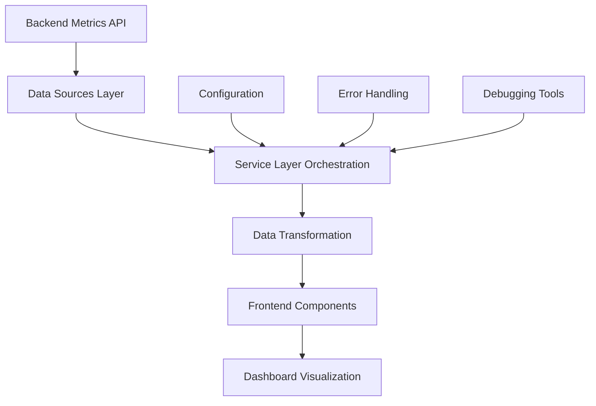
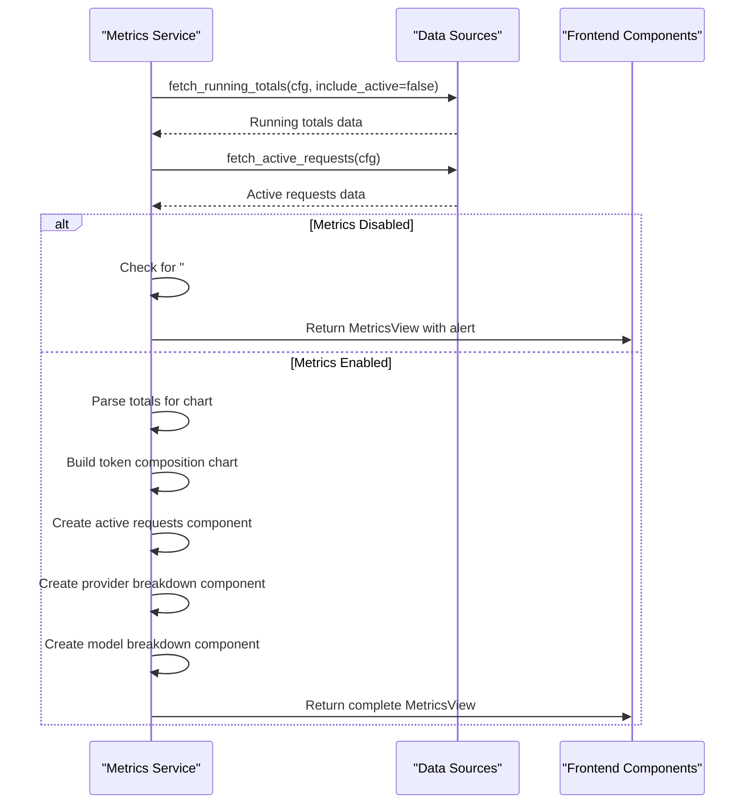
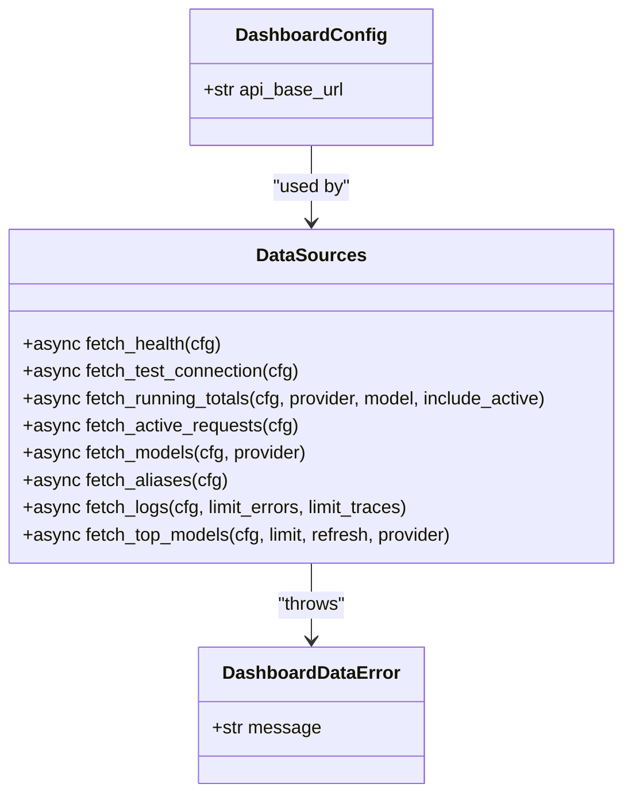
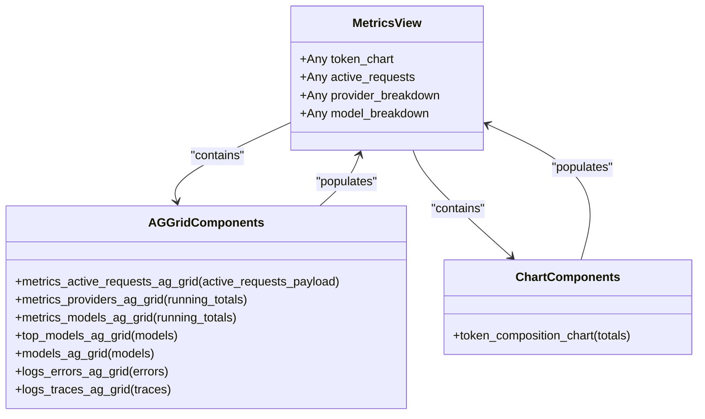
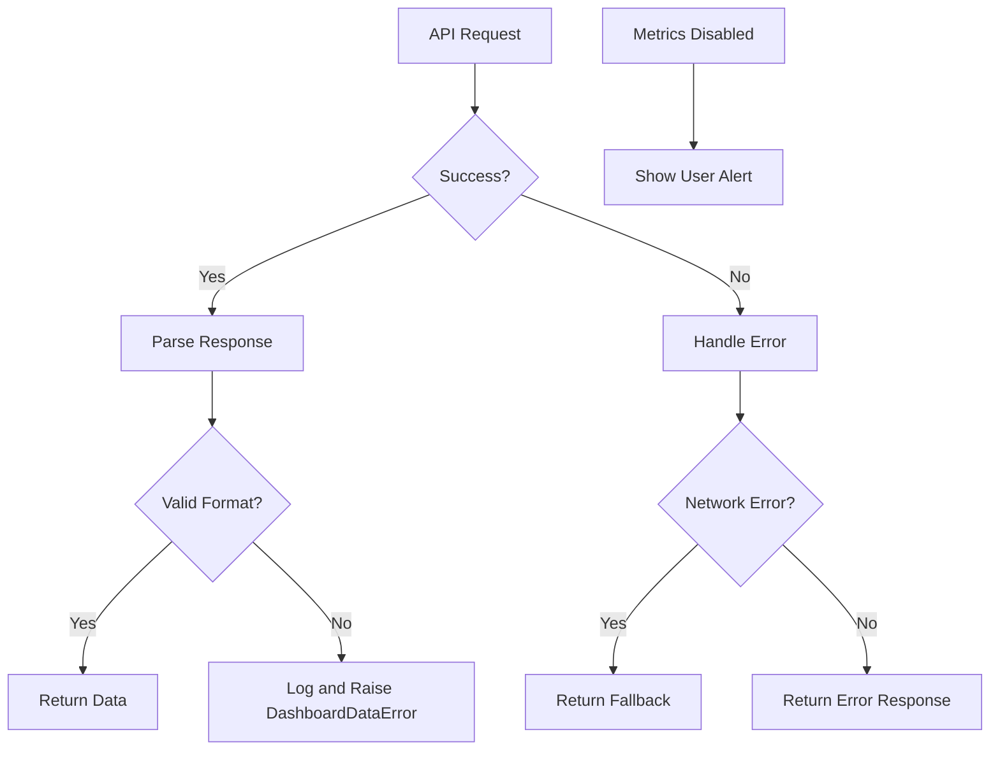
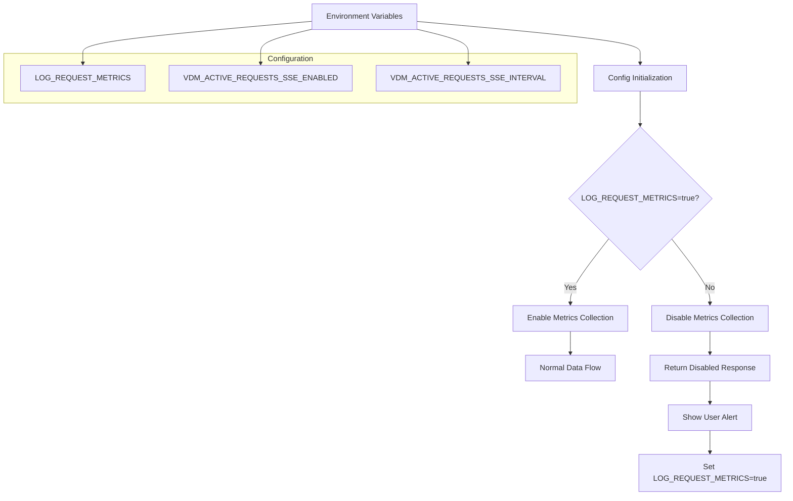
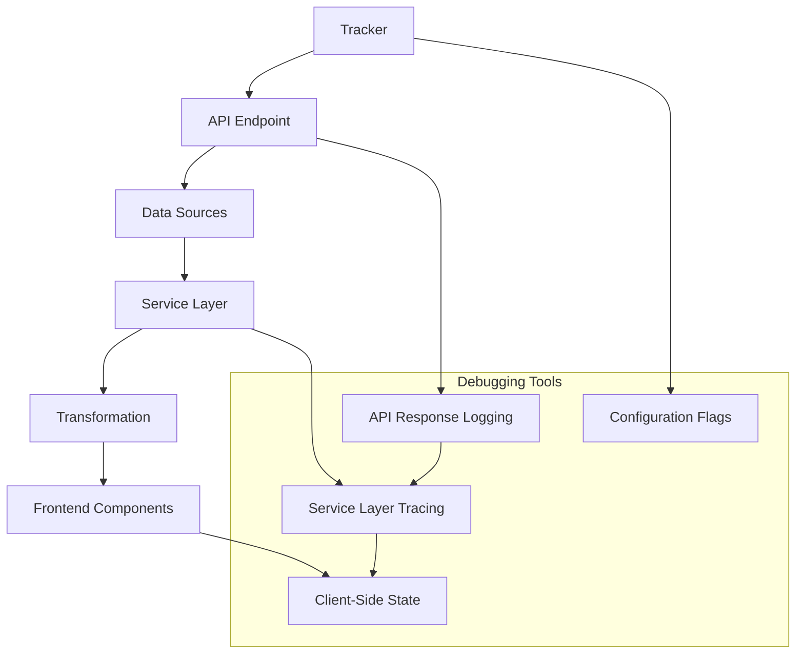

# Dashboard Data Orchestration

<cite>
**Referenced Files in This Document**   
- [metrics.py](file://src/dashboard/services/metrics.py)
- [data_sources.py](file://src/dashboard/data_sources.py)
- [normalize.py](file://src/dashboard/normalize.py)
- [ag_grid.py](file://src/dashboard/components/ag_grid.py)
- [metrics.py](file://src/dashboard/pages/metrics.py)
- [metrics.py](file://src/api/metrics.py)
- [config.py](file://src/core/config.py)
</cite>

## Table of Contents
1. [Introduction](#introduction)
2. [Data Flow Overview](#data-flow-overview)
3. [Metrics Service Layer](#metrics-service-layer)
4. [Data Sources and Fetching](#data-sources-and-fetching)
5. [Data Transformation and Normalization](#data-transformation-and-normalization)
6. [Frontend Component Integration](#frontend-component-integration)
7. [Error Handling and Fallbacks](#error-handling-and-fallbacks)
8. [Configuration and Conditional Logic](#configuration-and-conditional-logic)
9. [Debugging and Tracing](#debugging-and-tracing)
10. [Conclusion](#conclusion)

## Introduction

The dashboard data transformation pipeline orchestrates the flow of metrics data from backend services to frontend visualization components. This document details how the system collects, transforms, and displays metrics data through a coordinated service layer, data sources, and frontend components. The pipeline begins with data collection from the API metrics endpoints, proceeds through transformation and normalization, and culminates in visualization through AG Grid components and charts. The architecture is designed to handle both real-time and historical metrics data while providing appropriate fallbacks and error handling when metrics are disabled or unavailable.

## Data Flow Overview

The data transformation pipeline follows a structured flow from backend metrics collection to dashboard visualization. The process begins with the metrics service layer orchestrating data fetching from backend endpoints, transforming the raw data into standardized structures, and passing it to frontend components for display. The pipeline handles both active requests and running totals, with special consideration for cases when metrics logging is disabled. The system uses async coordination between service layers and data sources, with comprehensive error handling and fallback behaviors to ensure reliability.



**Diagram sources**
- [metrics.py](file://src/dashboard/services/metrics.py)
- [data_sources.py](file://src/dashboard/data_sources.py)

## Metrics Service Layer

The metrics service layer, implemented in `src/dashboard/services/metrics.py`, serves as the orchestration point for the data transformation pipeline. The `build_metrics_view` function coordinates the fetching of metrics data from both active requests and running totals endpoints, then constructs a standardized view for the dashboard components. This function returns a `MetricsView` dataclass that standardizes the response shape for consistent consumption by dashboard components.

The service layer handles conditional logic based on whether metrics are enabled, generating appropriate user-friendly alerts when metrics logging is disabled. It also manages the async coordination between the service layer and data sources, ensuring proper error handling and fallback behaviors. The `build_metrics_view` function is designed to keep Dash callbacks thin and make the response shape easy to unit test.



**Diagram sources**
- [metrics.py](file://src/dashboard/services/metrics.py#L34-L66)

**Section sources**
- [metrics.py](file://src/dashboard/services/metrics.py#L1-L67)

## Data Sources and Fetching

The data sources layer, implemented in `src/dashboard/data_sources.py`, provides the interface for fetching metrics data from backend endpoints. This layer contains async functions for retrieving both active requests and running totals data, with proper error handling and response parsing. The `fetch_active_requests` function retrieves the current snapshot of in-flight requests, while `fetch_running_totals` fetches aggregated metrics data across providers and models.

The data sources layer handles different response formats, parsing both JSON and YAML responses from the backend API. It includes comprehensive error handling for network issues, parsing errors, and unexpected response shapes. The layer also implements retry logic and timeout handling to ensure robust data retrieval. The `DashboardConfig` class provides configuration for the API base URL, allowing for flexible deployment scenarios.



**Diagram sources**
- [data_sources.py](file://src/dashboard/data_sources.py#L1-L362)

**Section sources**
- [data_sources.py](file://src/dashboard/data_sources.py#L1-L362)

## Data Transformation and Normalization

The data transformation and normalization layer, implemented in `src/dashboard/normalize.py`, converts raw API responses into dashboard-ready structures. The `MetricTotals` dataclass standardizes the response shape for KPIs and charts, ensuring consistent data representation across components. The normalization functions handle missing fields and type conversions, providing fallback values when data is unavailable.

The transformation process includes parsing hierarchical data structures from the running totals endpoint, extracting provider and model-level metrics, and calculating derived values like error rates. The `parse_metric_totals` function extracts key metrics from the summary section, while `provider_rows` and `model_rows_for_provider` functions transform provider and model data into row formats suitable for AG Grid components. The layer also handles special cases like metrics being disabled, ensuring appropriate fallback behavior.

```mermaid
flowchart TD
A[Raw API Response] --> B{Metrics Disabled?}
B --> |Yes| C[Return empty MetricTotals]
B --> |No| D[Extract summary data]
D --> E[Parse individual metrics]
E --> F[Handle missing fields]
F --> G[Calculate derived values]
G --> H[Return MetricTotals]
subgraph "Field Parsing"
E1[_as_int(value)]
E2[_as_float(value)]
E3[error_rate(total_requests, total_errors)]
end
E --> E1
E --> E2
E --> E3
```

**Diagram sources**
- [normalize.py](file://src/dashboard/normalize.py#L1-L226)

**Section sources**
- [normalize.py](file://src/dashboard/normalize.py#L1-L226)

## Frontend Component Integration

The frontend component integration layer connects the transformed data to visualization components, primarily AG Grid tables and charts. The `src/dashboard/components/ag_grid.py` module provides factory functions for creating AG Grid components with standardized configurations. These components receive transformed data and render it in interactive tables with sorting, filtering, and pagination capabilities.

The integration includes specialized components like `metrics_active_requests_component` and `token_composition_chart`, which handle specific visualization requirements. The AG Grid components use transformers to convert normalized data into row data formats expected by the grid. The system also implements client-side callbacks for interactive features like polling controls and real-time updates, ensuring a responsive user experience.



**Diagram sources**
- [ag_grid.py](file://src/dashboard/components/ag_grid.py#L1-L636)
- [metrics.py](file://src/dashboard/pages/metrics.py#L1-L210)

**Section sources**
- [ag_grid.py](file://src/dashboard/components/ag_grid.py#L1-L636)
- [metrics.py](file://src/dashboard/pages/metrics.py#L1-L210)

## Error Handling and Fallbacks

The system implements comprehensive error handling and fallback mechanisms to ensure reliability and user-friendly error reporting. When metrics are disabled via the `LOG_REQUEST_METRICS` configuration, the system detects this condition and provides appropriate user guidance. The `detect_metrics_disabled` function in the normalize layer checks for the presence of the "# Message" key in the response, which indicates disabled metrics.

For API errors, the data sources layer throws `DashboardDataError` exceptions with descriptive messages, which are caught and handled by the service layer. Network errors, parsing errors, and unexpected response shapes are all handled gracefully, with fallback values provided where appropriate. The system also implements client-side error handling for cases when the SSE connection for active requests is not supported or becomes disconnected, falling back to polling mechanisms.



**Diagram sources**
- [metrics.py](file://src/api/metrics.py#L1-L263)
- [data_sources.py](file://src/dashboard/data_sources.py#L1-L362)

**Section sources**
- [metrics.py](file://src/api/metrics.py#L1-L263)
- [data_sources.py](file://src/dashboard/data_sources.py#L1-L362)

## Configuration and Conditional Logic

The system's behavior is controlled by configuration settings, primarily through environment variables. The `LOG_REQUEST_METRICS` setting in `src/core/config.py` determines whether request metrics logging is enabled, with a default value of "true". This configuration is checked at multiple levels of the pipeline, from the API endpoint to the dashboard service layer.

When metrics are disabled, the system generates user-friendly alerts explaining the condition and providing guidance on how to enable metrics. The conditional logic is implemented consistently across the pipeline, with the API endpoint returning a special response containing "# Message" and "# Suggestion" fields, which are detected by the dashboard's `detect_metrics_disabled` function. The system also supports configuration for SSE (Server-Sent Events) for real-time updates, with fallback to polling when SSE is not available.



**Diagram sources**
- [config.py](file://src/core/config.py#L1-L285)
- [metrics.py](file://src/api/metrics.py#L1-L263)

**Section sources**
- [config.py](file://src/core/config.py#L1-L285)
- [metrics.py](file://src/api/metrics.py#L1-L263)

## Debugging and Tracing

The system provides several mechanisms for debugging and tracing the data flow from tracker to frontend components. The API metrics endpoints include detailed error responses that help identify issues with data retrieval. The dashboard service layer includes comprehensive logging that traces the data transformation process, making it easier to identify where issues may occur.

For real-time debugging, the system implements client-side callbacks that expose the state of various components, such as the SSE connection status for active requests. The AG Grid components include debug information in their configuration, allowing developers to trace data flow through the rendering pipeline. The system also supports configuration-based debugging, with environment variables that can enable additional logging and diagnostic information.



**Diagram sources**
- [metrics.py](file://src/api/metrics.py#L1-L263)
- [data_sources.py](file://src/dashboard/data_sources.py#L1-L362)
- [metrics.py](file://src/dashboard/services/metrics.py#L1-L67)

**Section sources**
- [metrics.py](file://src/api/metrics.py#L1-L263)
- [data_sources.py](file://src/dashboard/data_sources.py#L1-L362)
- [metrics.py](file://src/dashboard/services/metrics.py#L1-L67)

## Conclusion

The dashboard data transformation pipeline provides a robust and flexible system for collecting, transforming, and visualizing metrics data. By separating concerns into distinct layers—data sources, service orchestration, transformation, and frontend integration—the system achieves high maintainability and testability. The pipeline handles both normal operation and edge cases like disabled metrics, providing appropriate user feedback and fallback behaviors.

Key strengths of the system include its async coordination between layers, comprehensive error handling, and standardized data structures that simplify frontend integration. The use of dataclasses like `MetricsView` ensures consistent response shapes, while the transformation layer handles data normalization and missing field cases. The system's configuration-driven approach allows for flexible deployment and easy adjustment of behavior through environment variables.

For future improvements, the system could benefit from additional monitoring of the data pipeline itself, providing insights into performance and reliability. Enhanced error reporting and more granular configuration options could also improve the user experience and system maintainability.