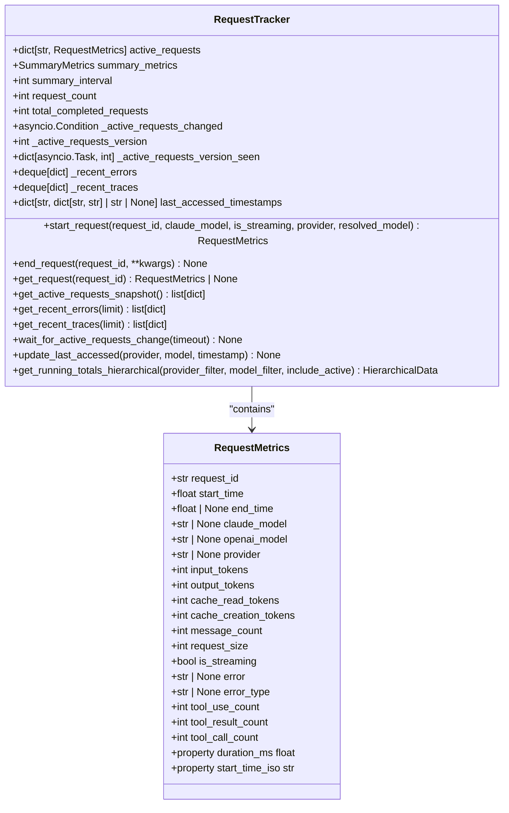
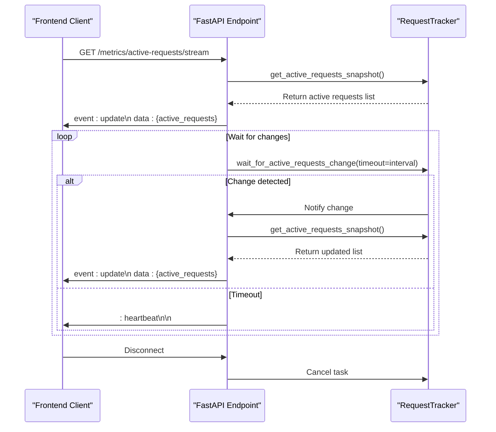
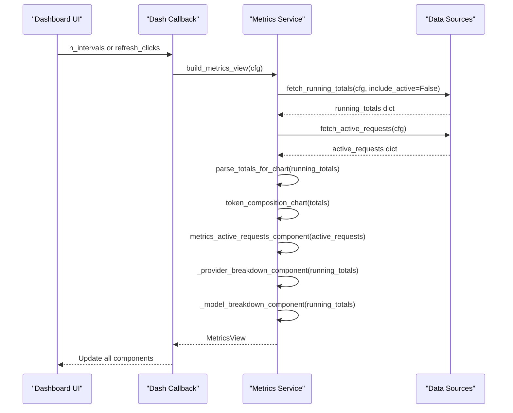
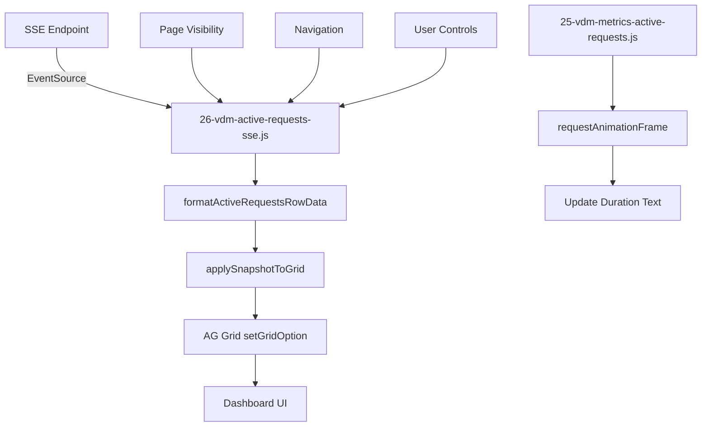
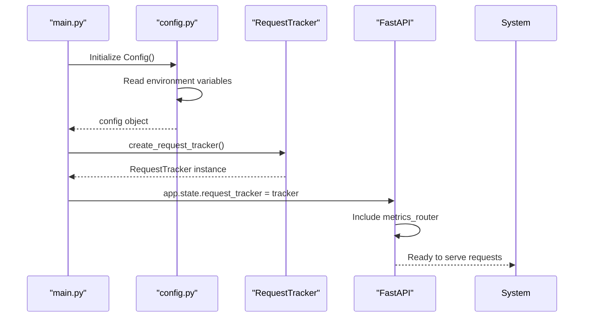

# Data Flow and Integration

<cite>
**Referenced Files in This Document**   
- [tracker.py](file://src/core/metrics/tracker/tracker.py)
- [metrics.py](file://src/api/metrics.py)
- [data_sources.py](file://src/dashboard/data_sources.py)
- [metrics.py](file://src/dashboard/services/metrics.py)
- [25-vdm-metrics-active-requests.js](file://assets/ag_grid/25-vdm-metrics-active-requests.js)
- [26-vdm-active-requests-sse.js](file://assets/ag_grid/26-vdm-active-requests-sse.js)
- [transformers.py](file://src/dashboard/ag_grid/transformers.py)
- [request.py](file://src/core/metrics/models/request.py)
- [runtime.py](file://src/core/metrics/runtime.py)
- [main.py](file://src/main.py)
- [config.py](file://src/core/config.py)
</cite>

## Table of Contents
1. [Introduction](#introduction)
2. [Active Request Tracking Mechanism](#active-request-tracking-mechanism)
3. [Metrics Endpoint Exposure](#metrics-endpoint-exposure)
4. [Data Transformation Pipeline](#data-transformation-pipeline)
5. [Dashboard Metrics View Construction](#dashboard-metrics-view-construction)
6. [Frontend Data Consumption](#frontend-data-consumption)
7. [Data Shape and Error Handling](#data-shape-and-error-handling)
8. [Debugging Strategies](#debugging-strategies)
9. [Configuration and Initialization](#configuration-and-initialization)

## Introduction
This document details the complete data flow for real-time active request monitoring in the Vandamme Proxy system. It explains how active requests are tracked from backend to frontend, covering the entire pipeline from request tracking in Python to real-time visualization in the dashboard. The system uses a process-local RequestTracker to monitor active requests, exposes this data through API endpoints, transforms it for dashboard consumption, and streams updates via Server-Sent Events (SSE) for real-time monitoring.

## Active Request Tracking Mechanism

The core of the monitoring system is the RequestTracker class in `src/core/metrics/tracker/tracker.py`, which maintains in-memory state for both active and completed requests. The tracker uses asyncio primitives to ensure thread-safe operations in the asynchronous environment.

When a new request arrives, the system calls `start_request()` which creates a RequestMetrics object and adds it to the `active_requests` dictionary. This object captures essential information including request_id, start_time, model information, and provider details. The tracker also maintains a version counter and condition variable to notify listeners of changes to the active requests set.

For streaming requests, the tracker updates metrics as the response progresses, capturing token counts and other relevant data. When a request completes, `end_request()` is called to finalize the metrics, update summary statistics, and remove the request from the active set. This method also records trace and error information in ring buffers for debugging purposes.

The tracker implements a push-notification system using `asyncio.Condition` to avoid the edge-triggered limitations of `asyncio.Event`. This ensures reliable fan-out semantics for multiple SSE clients, with each task maintaining its last-seen version to prevent missed updates.



**Diagram sources**
- [tracker.py](file://src/core/metrics/tracker/tracker.py#L42-L454)
- [request.py](file://src/core/metrics/models/request.py#L9-L56)

**Section sources**
- [tracker.py](file://src/core/metrics/tracker/tracker.py#L1-L490)

## Metrics Endpoint Exposure

The metrics system exposes data through FastAPI endpoints defined in `src/api/metrics.py`. These endpoints provide access to active request data, recent errors, and running totals. The system uses dependency injection to validate API keys and ensure secure access to metrics data.

The `/metrics/active-requests` endpoint returns a JSON snapshot of all currently active requests by calling `get_active_requests_snapshot()` on the RequestTracker. This method formats the data for dashboard consumption, including derived fields like duration_ms and properly formatted model names.

For real-time monitoring, the system implements Server-Sent Events (SSE) through the `/metrics/active-requests/stream` endpoint. This endpoint creates a long-lived connection that pushes updates whenever the active request set changes. The streaming implementation uses the `wait_for_active_requests_change()` method to efficiently wait for changes, combining periodic polling with immediate push notifications.

The endpoint implements several important features:
- Heartbeat messages every 30 seconds to keep connections alive
- Immediate updates when requests start or complete
- Only sending updates when the snapshot actually changes
- Proper error handling and client disconnection detection



**Diagram sources**
- [metrics.py](file://src/api/metrics.py#L81-L173)
- [tracker.py](file://src/core/metrics/tracker/tracker.py#L185-L240)

**Section sources**
- [metrics.py](file://src/api/metrics.py#L1-L263)

## Data Transformation Pipeline

The data transformation pipeline converts Python dictionary data from the backend into JSON payloads suitable for frontend consumption. This process begins in `src/dashboard/data_sources.py`, which contains asynchronous functions for fetching data from various API endpoints.

The `fetch_active_requests()` function retrieves the active requests snapshot from the `/metrics/active-requests` endpoint and performs initial validation. It uses httpx for HTTP requests and includes comprehensive error handling for network issues, parsing errors, and unexpected response shapes. The function returns a dictionary containing the active requests list, which is then passed to the dashboard components.

The transformation continues in `src/dashboard/ag_grid/transformers.py` with the `metrics_active_requests_row_data()` function. This function processes the API response and transforms it into the format expected by the AG Grid component. Key transformations include:
- Adding provider badge colors using the `provider_badge_color()` function
- Converting timestamps to ISO format and calculating age in seconds
- Ensuring consistent field naming for grid rendering
- Preserving raw values for sorting while providing formatted display values

The JavaScript file `assets/ag_grid/26-vdm-active-requests-sse.js` implements client-side transformation of SSE data. When an update event is received, the `formatActiveRequestsRowData()` function transforms the API row data into the AG Grid rowData format. This includes:
- Extracting provider and model information
- Converting start_time to milliseconds for duration calculations
- Calculating the age of the request in seconds
- Adding fields required by the recency dot renderer

```mermaid
flowchart TD
A[RequestTracker] --> |Python dict| B[/metrics/active-requests]
B --> |HTTP Response| C[fetch_active_requests]
C --> |dict[str, Any]| D[build_metrics_view]
D --> |dict[str, Any]| E[metrics_active_requests_component]
E --> |list[dict]| F[metrics_active_requests_row_data]
F --> |list[dict]| G[AG Grid rowData]
H[SSE Stream] --> |JSON| I[formatActiveRequestsRowData]
I --> |list[dict]| G
G --> J[AG Grid Component]
```

**Diagram sources**
- [data_sources.py](file://src/dashboard/data_sources.py#L99-L114)
- [transformers.py](file://src/dashboard/ag_grid/transformers.py#L283-L332)
- [26-vdm-active-requests-sse.js](file://assets/ag_grid/26-vdm-active-requests-sse.js#L44-L78)

**Section sources**
- [data_sources.py](file://src/dashboard/data_sources.py#L1-L362)
- [transformers.py](file://src/dashboard/ag_grid/transformers.py#L1-L486)
- [26-vdm-active-requests-sse.js](file://assets/ag_grid/26-vdm-active-requests-sse.js#L1-L316)

## Dashboard Metrics View Construction

The dashboard metrics view is constructed through a coordinated system of services and callbacks in `src/dashboard/services/metrics.py` and `src/dashboard/callbacks/metrics.py`. The `build_metrics_view()` function orchestrates the entire process, fetching data and constructing the dashboard components.

This function calls `fetch_running_totals()` with `include_active=False` to get completed request metrics for the provider and model breakdowns, while separately calling `fetch_active_requests()` to get the current active requests. This separation ensures that the rollup grids show only completed requests while the active requests grid shows in-flight requests.

The service returns a `MetricsView` dataclass containing the constructed components:
- `token_chart`: A pie chart showing token composition
- `active_requests`: The active requests grid component
- `provider_breakdown`: The provider breakdown grid
- `model_breakdown`: The model breakdown grid

The callback system in `src/dashboard/callbacks/metrics.py` connects these components to the dashboard UI. The `register_metrics_callbacks()` function sets up the primary refresh callback that updates all metrics components when triggered by polling or manual refresh. It also manages the polling interval based on user selection and controls the polling state based on user activity.



**Diagram sources**
- [metrics.py](file://src/dashboard/services/metrics.py#L34-L67)
- [metrics.py](file://src/dashboard/callbacks/metrics.py#L11-L154)

**Section sources**
- [metrics.py](file://src/dashboard/services/metrics.py#L1-L67)
- [metrics.py](file://src/dashboard/callbacks/metrics.py#L1-L154)

## Frontend Data Consumption

The frontend consumes active request data through a sophisticated JavaScript system that integrates with the AG Grid component. The primary integration is handled by `assets/ag_grid/26-vdm-active-requests-sse.js`, which establishes an EventSource connection to the SSE endpoint and updates the grid directly.

The JavaScript module implements several key features:
- Automatic connection management based on page visibility and navigation
- Connection retry with exponential backoff
- Real-time updates without server round-trips
- Buffering of snapshots until the grid API is ready
- Duplicate request ID prevention

The `applySnapshotToGrid()` function processes the incoming data, ensuring data integrity by:
- Validating and formatting each row
- Removing duplicates by request_id
- Maintaining stable ordering (most recent first)
- Using AG Grid's setGridOption() for reliable dataset replacement

For duration display, `assets/ag_grid/25-vdm-metrics-active-requests.js` implements a separate ticker that updates the duration text at a configurable interval (default 2 seconds). This uses requestAnimationFrame for smooth updates and respects page visibility to conserve resources.

The frontend also provides user controls for:
- Enabling/disabling SSE
- Adjusting the polling interval
- Manual refresh
- Displaying connection status



**Diagram sources**
- [26-vdm-active-requests-sse.js](file://assets/ag_grid/26-vdm-active-requests-sse.js#L1-L316)
- [25-vdm-metrics-active-requests.js](file://assets/ag_grid/25-vdm-metrics-active-requests.js#L1-L95)

**Section sources**
- [26-vdm-active-requests-sse.js](file://assets/ag_grid/26-vdm-active-requests-sse.js#L1-L316)
- [25-vdm-metrics-active-requests.js](file://assets/ag_grid/25-vdm-metrics-active-requests.js#L1-L95)

## Data Shape and Error Handling

The data shape expected by the frontend includes specific fields for each active request, as defined in the RequestMetrics class and transformed for dashboard consumption. The key fields are:

- `request_id`: Unique identifier for the request
- `provider`: Provider name (e.g., "openai", "anthropic")
- `model`: Model name without provider prefix
- `requested_model`: Original model name sent by client
- `resolved_model`: Canonical model name after alias resolution
- `start_time`: Unix timestamp in seconds
- `duration_ms`: Calculated duration in milliseconds
- `input_tokens`: Number of input tokens
- `output_tokens`: Number of output tokens
- `is_streaming`: Boolean indicating if request is streaming

The system handles missing or malformed data through several mechanisms:

1. **Default values**: The RequestMetrics class initializes counters to 0 rather than None for simpler aggregation
2. **Validation and fallbacks**: When provider or model information is missing, the system derives it from available data or uses "unknown" as fallback
3. **Graceful degradation**: If metrics are disabled, endpoints return structured responses with disabled flags and suggestions
4. **Error isolation**: Malformed data in one request doesn't affect others due to per-request processing

For example, when extracting the provider from a model name like "openai:gpt-4", the system splits on the first colon. If the format is malformed, it falls back to "unknown". Similarly, timestamps are validated and converted to ISO format, with "N/A" returned for invalid timestamps.

The system also handles edge cases like:
- Model names containing colons (e.g., "anthropic/claude-3-5-sonnet:context-flash")
- Provider prefixes in model names
- Missing provider information
- Invalid or missing timestamps

```mermaid
flowchart TD
A[Raw Request Data] --> B{Provider specified?}
B --> |Yes| C[Use specified provider]
B --> |No| D{Model has provider prefix?}
D --> |Yes| E[Extract provider from model]
D --> |No| F[Use "unknown"]
G[Model Name] --> H{Has provider prefix?}
H --> |Yes| I[Split and use model part]
H --> |No| J[Use full name]
K[Timestamp] --> L{Valid timestamp?}
L --> |Yes| M[Convert to ISO format]
L --> |No| N[Use "N/A"]
O[Token counts] --> P[Initialize to 0 if missing]
Q[Final Data] --> R[Structured output with all fields]
```

**Section sources**
- [tracker.py](file://src/core/metrics/tracker/tracker.py#L186-L239)
- [transformers.py](file://src/dashboard/ag_grid/transformers.py#L283-L332)

## Debugging Strategies

Effective debugging of data flow issues requires understanding the complete pipeline from backend to frontend. The system provides several tools and strategies for tracing issues:

**Backend Debugging**
- Check RequestTracker state by examining `active_requests` and `summary_metrics`
- Verify API endpoint responses using curl or browser developer tools
- Monitor logs for tracker notifications and error messages
- Validate that `LOG_REQUEST_METRICS` is enabled in configuration

**Network Debugging**
- Use browser developer tools to inspect SSE connections
- Verify EventSource is connecting to the correct endpoint
- Check for HTTP 200 responses and proper content-type headers
- Monitor for reconnection attempts and error events

**Frontend Debugging**
- Check console for JavaScript errors in the SSE module
- Verify AG Grid API is available when updates are received
- Monitor the connection indicator status
- Use the debug console to inspect rowData before grid update

Common issues and their solutions:

1. **No active requests displayed**
   - Verify `LOG_REQUEST_METRICS=true` in environment
   - Check that requests are actually being processed
   - Verify SSE connection status in browser console

2. **Stale data in grid**
   - Check polling interval settings
   - Verify SSE heartbeat messages are being received
   - Ensure page visibility is not preventing updates

3. **Connection errors**
   - Verify CORS settings if proxying
   - Check network connectivity
   - Verify endpoint URL is correct
   - Inspect browser security settings

4. **Malformed data**
   - Check API response structure
   - Verify data transformation functions
   - Inspect JavaScript console for parsing errors

The system includes built-in diagnostics:
- Connection indicator showing live/reconnecting status
- Console logging of SSE events
- Fallback to polling when SSE is disabled
- Structured error responses with suggestions

**Section sources**
- [tracker.py](file://src/core/metrics/tracker/tracker.py#L249-L291)
- [metrics.py](file://src/api/metrics.py#L97-L122)
- [26-vdm-active-requests-sse.js](file://assets/ag_grid/26-vdm-active-requests-sse.js#L190-L226)

## Configuration and Initialization

The metrics system is initialized during application startup in `src/main.py`, where the RequestTracker is created and attached to the FastAPI app state. This approach avoids module-level singletons and keeps imports side-effect free.

The tracker is configured with a summary interval that determines how often summary metrics are emitted. This is set through the `summary_interval` parameter in `create_request_tracker()`.

Key configuration options in `src/core/config.py` that affect the metrics system include:
- `log_request_metrics`: Enables or disables request metrics logging
- `active_requests_sse_enabled`: Controls whether SSE is available
- `active_requests_sse_interval`: Polling interval for SSE clients
- `active_requests_sse_heartbeat`: Interval for heartbeat messages

The system uses environment variables for configuration, allowing runtime adjustments without code changes. For example:
- `LOG_REQUEST_METRICS=true` enables active request tracking
- `VDM_ACTIVE_REQUESTS_SSE_ENABLED=false` disables SSE
- `VDM_ACTIVE_REQUESTS_SSE_INTERVAL=5.0` sets polling to 5 seconds

The RequestTracker is process-local, meaning metrics are reset on restart. This matches the existing behavior and simplifies deployment in containerized environments.



**Diagram sources**
- [main.py](file://src/main.py#L1-L105)
- [config.py](file://src/core/config.py#L1-L285)

**Section sources**
- [main.py](file://src/main.py#L1-L105)
- [config.py](file://src/core/config.py#L1-L285)