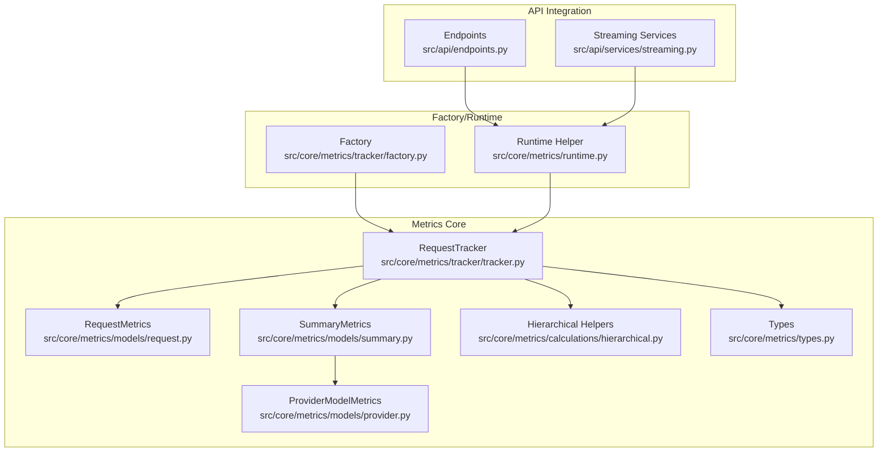
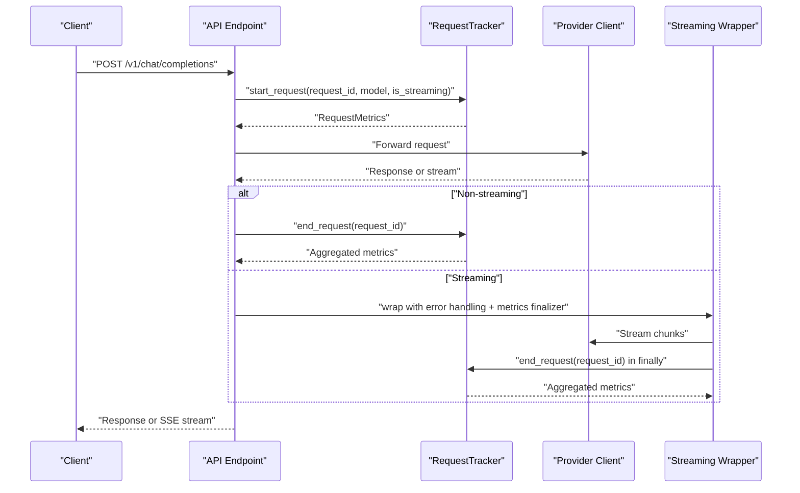
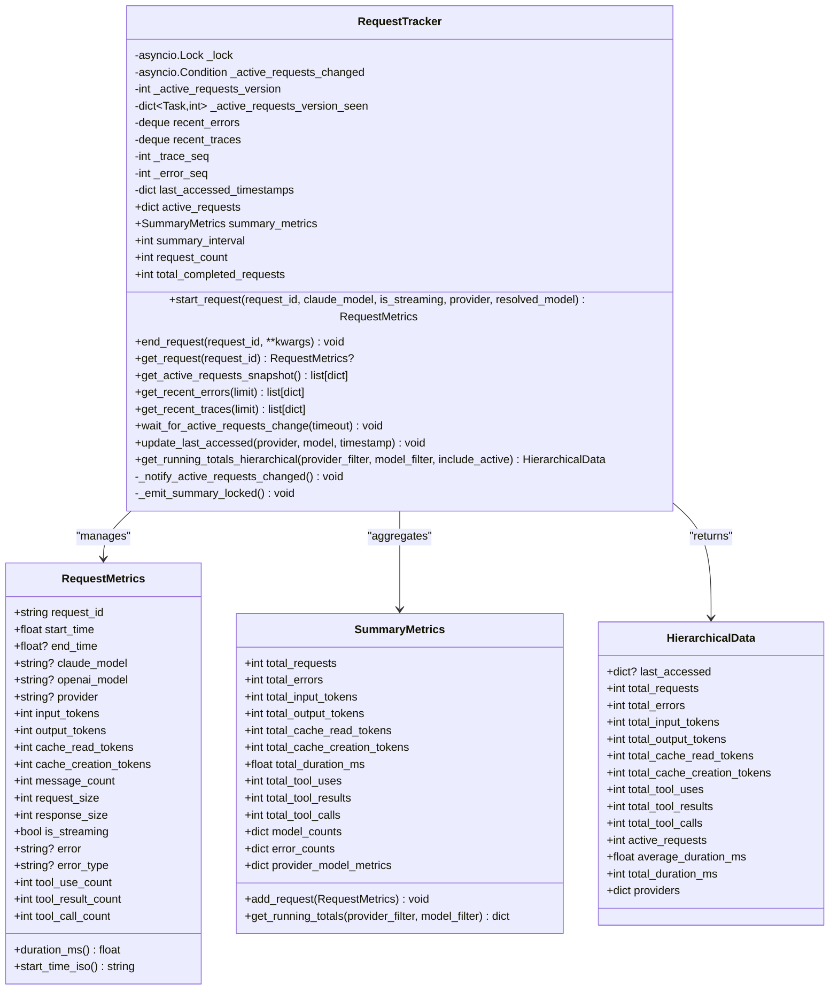
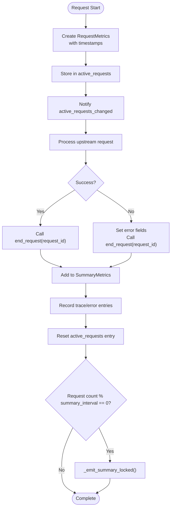
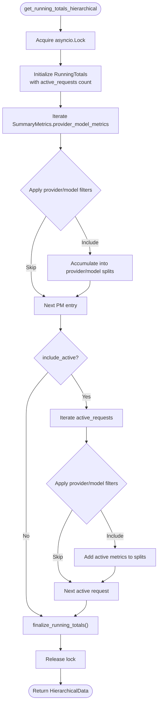
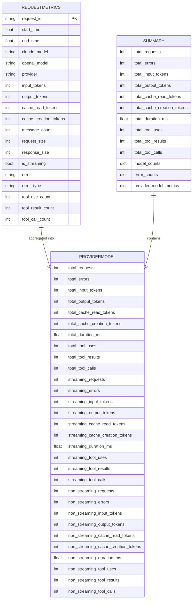
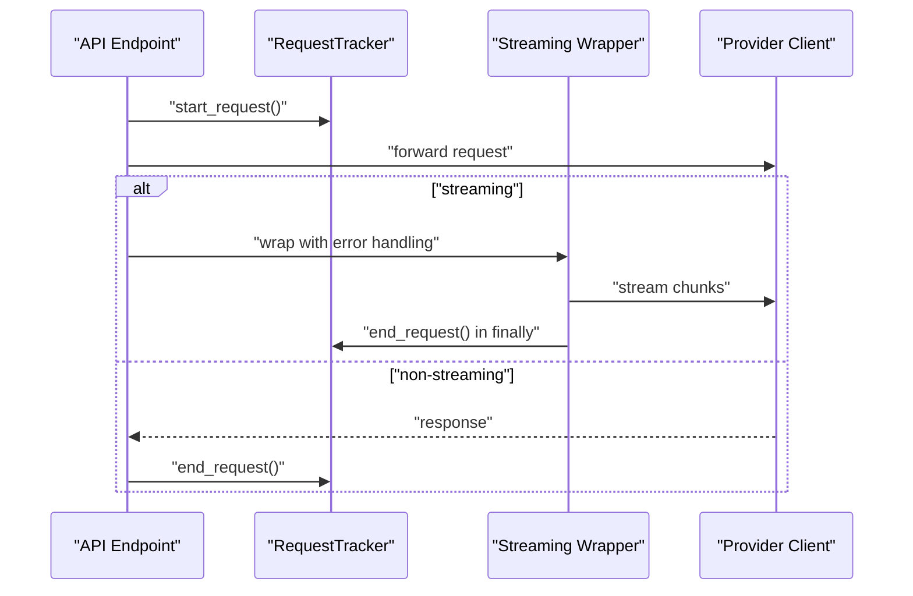
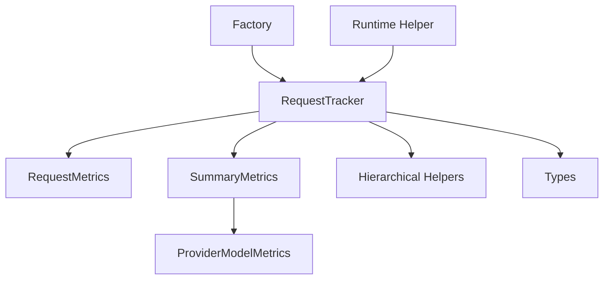

# Request Tracking Mechanism

<cite>
**Referenced Files in This Document**
- [tracker.py](file://src/core/metrics/tracker/tracker.py)
- [request.py](file://src/core/metrics/models/request.py)
- [summary.py](file://src/core/metrics/models/summary.py)
- [hierarchical.py](file://src/core/metrics/calculations/hierarchical.py)
- [factory.py](file://src/core/metrics/tracker/factory.py)
- [runtime.py](file://src/core/metrics/runtime.py)
- [types.py](file://src/core/metrics/types.py)
- [provider.py](file://src/core/metrics/models/provider.py)
- [endpoints.py](file://src/api/endpoints.py)
- [streaming.py](file://src/api/services/streaming.py)
</cite>

## Table of Contents
1. [Introduction](#introduction)
2. [Project Structure](#project-structure)
3. [Core Components](#core-components)
4. [Architecture Overview](#architecture-overview)
5. [Detailed Component Analysis](#detailed-component-analysis)
6. [Dependency Analysis](#dependency-analysis)
7. [Performance Considerations](#performance-considerations)
8. [Troubleshooting Guide](#troubleshooting-guide)
9. [Conclusion](#conclusion)

## Introduction
This document provides comprehensive data model documentation for the RequestTracker class, focusing on how it manages both active and completed request metrics within a single process. The RequestTracker implements a two-state model: active requests stored in-memory during execution and completed requests aggregated into summary metrics. It exposes thread-safe operations using asyncio primitives and provides hierarchical aggregation for provider/model filtering with optional inclusion of active requests.

## Project Structure
The request tracking mechanism spans several modules within the metrics subsystem:
- Tracker implementation: manages state, lifecycle events, and synchronization
- Data models: define the structure for request-level and summary metrics
- Calculations: provide hierarchical aggregation helpers and rolling computations
- Factory and runtime: instantiate and expose the tracker to API layers
- Types: define typed outputs for hierarchical metrics

**Diagram sources**
- [tracker.py](file://src/core/metrics/tracker/tracker.py#L42-L84)
- [request.py](file://src/core/metrics/models/request.py#L9-L56)
- [summary.py](file://src/core/metrics/models/summary.py#L16-L119)
- [provider.py](file://src/core/metrics/models/provider.py#L11-L47)
- [hierarchical.py](file://src/core/metrics/calculations/hierarchical.py#L1-L125)
- [types.py](file://src/core/metrics/types.py#L14-L32)
- [factory.py](file://src/core/metrics/tracker/factory.py#L15-L30)
- [runtime.py](file://src/core/metrics/runtime.py#L20-L28)
- [endpoints.py](file://src/api/endpoints.py#L180-L244)
- [streaming.py](file://src/api/services/streaming.py#L196-L242)

**Section sources**
- [tracker.py](file://src/core/metrics/tracker/tracker.py#L1-L84)
- [factory.py](file://src/core/metrics/tracker/factory.py#L1-L31)
- [runtime.py](file://src/core/metrics/runtime.py#L1-L29)

## Core Components
The RequestTracker orchestrates request lifecycle events and maintains two complementary data stores:
- active_requests: dict[str, RequestMetrics] storing in-flight requests
- summary_metrics: SummaryMetrics aggregating completed requests

It uses asyncio.Lock for mutual exclusion and asyncio.Condition for reliable notification of active request changes. The tracker also maintains dashboard-facing buffers for recent traces and errors, along with last_accessed timestamps for provider/model attribution.

Key responsibilities:
- start_request(): registers new active requests and initializes metrics
- end_request(): finalizes active requests and aggregates into summary metrics
- get_running_totals_hierarchical(): computes hierarchical provider/model metrics with optional active request inclusion
- Synchronization: thread-safe operations with versioned notifications for concurrent listeners

**Section sources**
- [tracker.py](file://src/core/metrics/tracker/tracker.py#L42-L84)
- [tracker.py](file://src/core/metrics/tracker/tracker.py#L85-L180)
- [tracker.py](file://src/core/metrics/tracker/tracker.py#L315-L452)

## Architecture Overview
The RequestTracker integrates with API endpoints and streaming services to capture request lifecycle events. The factory creates trackers with configurable summary intervals, and the runtime helper provides access to the process-local instance.

**Diagram sources**
- [endpoints.py](file://src/api/endpoints.py#L180-L244)
- [endpoints.py](file://src/api/endpoints.py#L326-L353)
- [streaming.py](file://src/api/services/streaming.py#L196-L242)
- [tracker.py](file://src/core/metrics/tracker/tracker.py#L85-L180)

## Detailed Component Analysis

### RequestTracker Class
The RequestTracker class encapsulates the two-state metric management model with robust synchronization and hierarchical aggregation capabilities.

**Diagram sources**
- [tracker.py](file://src/core/metrics/tracker/tracker.py#L42-L84)
- [request.py](file://src/core/metrics/models/request.py#L9-L56)
- [summary.py](file://src/core/metrics/models/summary.py#L16-L119)
- [types.py](file://src/core/metrics/types.py#L14-L32)

#### Lifecycle Management
The request lifecycle is managed through coordinated operations:
- start_request(): Creates RequestMetrics with timestamps and model metadata, stores in active_requests, and notifies listeners
- end_request(): Finalizes metrics, aggregates into summary_metrics, records dashboard traces/errors, and resets state

**Diagram sources**
- [tracker.py](file://src/core/metrics/tracker/tracker.py#L85-L180)
- [tracker.py](file://src/core/metrics/tracker/tracker.py#L456-L490)

#### Hierarchical Aggregation Logic
The get_running_totals_hierarchical method builds provider->model hierarchies with streaming/non-streaming splits and optional active request inclusion.

**Diagram sources**
- [tracker.py](file://src/core/metrics/tracker/tracker.py#L315-L452)
- [hierarchical.py](file://src/core/metrics/calculations/hierarchical.py#L85-L125)

**Section sources**
- [tracker.py](file://src/core/metrics/tracker/tracker.py#L42-L490)
- [request.py](file://src/core/metrics/models/request.py#L9-L56)
- [summary.py](file://src/core/metrics/models/summary.py#L16-L119)
- [hierarchical.py](file://src/core/metrics/calculations/hierarchical.py#L1-L125)
- [types.py](file://src/core/metrics/types.py#L14-L32)

### Data Models and Aggregation
The data models define the structures used throughout the tracking pipeline:

- RequestMetrics: per-request attributes including timestamps, token counts, streaming flags, error information, and tool usage metrics
- SummaryMetrics: accumulated totals across completed requests with provider/model granularity and streaming/non-streaming splits
- ProviderModelMetrics: granular metrics for specific provider/model combinations
- RunningTotals: hierarchical aggregation container for API responses

**Diagram sources**
- [request.py](file://src/core/metrics/models/request.py#L9-L56)
- [provider.py](file://src/core/metrics/models/provider.py#L11-L47)
- [summary.py](file://src/core/metrics/models/summary.py#L16-L119)

**Section sources**
- [request.py](file://src/core/metrics/models/request.py#L9-L56)
- [provider.py](file://src/core/metrics/models/provider.py#L11-L47)
- [summary.py](file://src/core/metrics/models/summary.py#L16-L119)

### Integration Points
The RequestTracker integrates with API endpoints and streaming services:

- API endpoints: start_request() at request initiation, end_request() on completion or error
- Streaming services: wrap streams with error handling and metrics finalization to ensure end_request() is always called
- Runtime helper: provides access to the process-local RequestTracker instance

**Diagram sources**
- [endpoints.py](file://src/api/endpoints.py#L180-L244)
- [endpoints.py](file://src/api/endpoints.py#L326-L353)
- [streaming.py](file://src/api/services/streaming.py#L196-L242)
- [runtime.py](file://src/core/metrics/runtime.py#L20-L28)

**Section sources**
- [endpoints.py](file://src/api/endpoints.py#L180-L244)
- [endpoints.py](file://src/api/endpoints.py#L326-L353)
- [streaming.py](file://src/api/services/streaming.py#L196-L242)
- [runtime.py](file://src/core/metrics/runtime.py#L20-L28)

## Dependency Analysis
The RequestTracker depends on several supporting modules for data modeling, calculation, and type safety.

**Diagram sources**
- [tracker.py](file://src/core/metrics/tracker/tracker.py#L29-L39)
- [factory.py](file://src/core/metrics/tracker/factory.py#L15-L30)
- [runtime.py](file://src/core/metrics/runtime.py#L20-L28)
- [types.py](file://src/core/metrics/types.py#L14-L32)

**Section sources**
- [tracker.py](file://src/core/metrics/tracker/tracker.py#L29-L39)
- [factory.py](file://src/core/metrics/tracker/factory.py#L15-L30)
- [runtime.py](file://src/core/metrics/runtime.py#L20-L28)
- [types.py](file://src/core/metrics/types.py#L14-L32)

## Performance Considerations
The RequestTracker is designed for high-throughput request processing with careful attention to synchronization overhead and memory usage:

- Lock contention: All public methods acquire asyncio.Lock for exclusive access to internal state. While this ensures thread safety, it can become a bottleneck under extreme concurrency. Consider batching operations or reducing lock scope where possible.
- Memory usage: active_requests grows with concurrent in-flight requests. The dictionary stores RequestMetrics objects with integer and float counters, plus string fields for identifiers. Monitor active_requests size in production to prevent memory pressure.
- Summary interval: The summary_interval parameter controls how frequently completed request summaries are logged and reset. Larger intervals reduce logging overhead but increase memory retention of completed metrics.
- Deque buffers: recent_errors and recent_traces use deques with fixed maximum lengths to cap memory usage for dashboard telemetry.
- Hierarchical computation: get_running_totals_hierarchical iterates over completed metrics and optionally active requests. Filtering reduces computational cost but still scales with the number of tracked items.

Race condition prevention:
- Versioned notifications: The tracker uses asyncio.Condition with a monotonic version counter to reliably notify multiple concurrent listeners without missing updates. Each task tracks the last seen version to avoid missed changes.
- Atomic operations: Critical sections protect state transitions (start/end) and ensure that active_requests and summary_metrics remain consistent across concurrent access.

**Section sources**
- [tracker.py](file://src/core/metrics/tracker/tracker.py#L46-L84)
- [tracker.py](file://src/core/metrics/tracker/tracker.py#L249-L291)
- [tracker.py](file://src/core/metrics/tracker/tracker.py#L456-L490)

## Troubleshooting Guide
Common issues and their resolutions:

- Missing RequestTracker instance: Ensure the tracker is created during application startup and attached to app.state. Access via get_request_tracker() will raise errors if not configured.
- Inconsistent model attribution: Verify that resolved_model is set before end_request() to avoid alias tokens in active request displays.
- Streaming finalization failures: Confirm that with_streaming_error_handling wraps all streaming generators to guarantee end_request() execution in finally blocks.
- Excessive lock contention: Monitor active_requests size and adjust summary_interval. Consider reducing concurrent request volume or optimizing downstream provider latency.
- Dashboard data gaps: Check versioned notification logic if SSE clients miss updates; the tracker uses version counters to prevent missed notifications.

**Section sources**
- [runtime.py](file://src/core/metrics/runtime.py#L20-L28)
- [streaming.py](file://src/api/services/streaming.py#L196-L242)
- [tracker.py](file://src/core/metrics/tracker/tracker.py#L256-L291)

## Conclusion
The RequestTracker provides a robust, thread-safe mechanism for managing request metrics within a single process. Its two-state model separates active and completed metrics, while hierarchical aggregation enables flexible provider/model filtering. The use of asyncio primitives ensures safe concurrent access, and the summary_interval-based reset mechanism balances observability with resource usage. Proper integration with API endpoints and streaming services guarantees comprehensive coverage of request lifecycle events, enabling accurate monitoring and diagnostics.